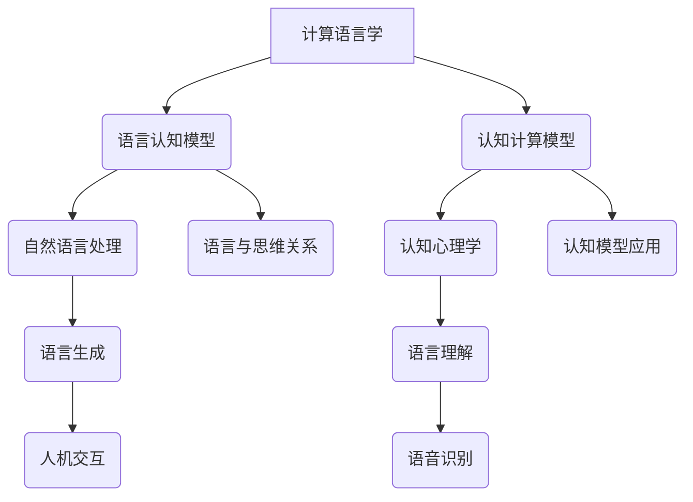

                 

### 文章标题

《计算语言学与认知科学的融合：探索语言、思维与世界关系的新方法》

---

关键词：计算语言学、认知科学、融合、语言、思维、世界关系

---

摘要：本文探讨了计算语言学与认知科学的融合，提出了新的研究方法，以探索语言、思维与世界之间的关系。通过分析核心概念、算法原理和数学模型，并结合实际项目案例，本文为相关领域的研究者和开发者提供了深入的见解和实用的指导。

### 第1章 引言与核心概念

#### 1.1 计算语言学简介

计算语言学是一门结合计算机科学和语言学的学科，旨在通过计算机技术和算法来处理和模拟人类语言。它的定义可以追溯到20世纪50年代，当时人工智能的概念刚刚兴起。计算语言学的主要研究领域包括自然语言处理（NLP）、语言生成、语言理解、语音识别等。

**定义与历史：**

计算语言学的核心概念包括词汇、语法、语义和语用。这些概念构成了计算语言学的研究基础。词汇是语言的基本单元，语法规定了词汇的排列和组合规则，语义关注语言表达的意义，而语用则涉及语言在实际使用中的含义。

计算语言学的发展历史可以分为几个阶段。在早期，研究者主要关注语言的形式和结构，如语境无关语法和形式语义学。随着计算机技术的发展，计算语言学逐渐转向实际应用，如机器翻译、信息检索和语音识别。

**研究领域与应用：**

计算语言学在多个领域有着广泛的应用。机器翻译是计算语言学的一个重要应用领域，通过将一种语言的文本自动翻译成另一种语言，实现了跨语言沟通。信息检索利用计算语言学技术，帮助用户从大量的文本数据中快速找到所需信息。语音识别技术则使得计算机能够理解和处理人类语音，为语音助手等应用提供了技术支持。

#### 1.2 认知科学简介

认知科学是一门研究人类思维和认知过程的学科，涉及心理学、神经科学、哲学和计算机科学等多个领域。它的目标是理解人类如何感知、思考、学习和记忆。

**定义与历史：**

认知科学的定义涵盖了感知、注意力、记忆、语言、决策和问题解决等方面。该学科的历史可以追溯到20世纪50年代，当时学者们开始研究人类心智的功能和机制。随着神经科学的进展，认知科学逐渐转向对大脑结构和功能的理解。

**研究领域与应用：**

认知科学的研究领域包括感知心理学、认知心理学、神经心理学和认知建模等。这些研究不仅有助于我们更好地理解人类心智的工作原理，还为开发人工智能和认知增强技术提供了理论基础。

认知科学在多个领域有着重要的应用。例如，在教育领域，认知科学技术被用来设计和评估学习系统，以提高学习效果。在医疗领域，认知科学技术被用于诊断和治疗认知障碍，如阿尔茨海默病。此外，认知科学还在人机交互、虚拟现实和自动驾驶等领域发挥了重要作用。

#### 1.3 计算语言学与认知科学的融合

计算语言学与认知科学的融合为探索语言、思维与世界关系提供了新的方法和视角。这一融合的背景在于，语言不仅是交流的工具，也是思维的基础。通过将计算语言学的技术应用于认知科学的研究，研究者们可以更好地理解人类语言和思维的过程。

**融合的背景与意义：**

计算语言学与认知科学的融合具有重要的理论和实践意义。在理论层面，它有助于我们更深入地理解语言、思维和认知之间的关系。在实践中，这种融合可以推动人工智能的发展，使其更加贴近人类的认知过程，提高人机交互的自然性和效率。

**发展历程：**

计算语言学与认知科学的融合始于20世纪80年代。当时，研究者开始关注自然语言处理和认知心理学之间的联系，提出了一系列交叉研究的课题。随着计算机技术和认知科学的进步，这种融合逐渐深入，形成了多个交叉研究领域，如认知计算语言学和语言认知科学。

### 第2章 核心原理与联系

#### 2.1 计算语言学与认知科学的共同概念

计算语言学与认知科学的共同概念构成了二者融合的基础。这些概念包括语言、思维、认知模型等。

**语言与思维：**

语言是人类思维的重要工具。计算语言学关注语言的形式和结构，而认知科学则研究语言如何影响思维。例如，语言结构的变化可以影响人们的思维模式。通过计算语言学和认知科学的融合，研究者可以更深入地理解语言与思维之间的关系。

**认知模型：**

认知模型是计算语言学和认知科学的共同工具。这些模型用于模拟和解释人类语言和思维的过程。常见的认知模型包括产生式模型、图灵模型和神经网络模型。这些模型在不同领域有着广泛的应用，如自然语言处理和认知心理学。

#### 2.2 融合的架构

计算语言学与认知科学的融合需要一个清晰的理论架构。这种架构不仅有助于理解二者的关系，还为交叉研究提供了指导。

**理论框架：**

融合的理论框架包括以下几个方面：

1. **语言认知模型**：这是计算语言学与认知科学的核心模型，用于模拟语言处理和理解的过程。
2. **认知计算模型**：这种模型结合了计算语言学和认知科学的方法，用于模拟人类的认知过程。
3. **跨学科研究方法**：这种方法强调跨学科的视角，以综合计算语言学和认知科学的成果。

**Mermaid流程图：**

以下是计算语言学与认知科学融合的Mermaid流程图：



### 第3章 核心算法原理

#### 3.1 自然语言处理算法

自然语言处理（NLP）是计算语言学的一个重要分支。NLP算法用于处理和模拟人类语言。以下是一些核心的NLP算法及其伪代码：

**算法1：词袋模型（Bag of Words）**

```python
# 伪代码
def bag_of_words(document):
    # 初始化词袋
    word_bag = {}
    # 遍历文档中的每个词
    for word in document:
        # 将词添加到词袋
        if word not in word_bag:
            word_bag[word] = 1
        else:
            word_bag[word] += 1
    return word_bag
```

**算法2：朴素贝叶斯分类器（Naive Bayes Classifier）**

```python
# 伪代码
def naive_bayes_classifier(document, labels):
    # 初始化分类器
    classifier = {}
    # 遍历文档和标签
    for doc, label in zip(document, labels):
        # 更新分类器
        if label not in classifier:
            classifier[label] = []
        classifier[label].append(doc)
    return classifier
```

**应用场景：**

- **文本分类**：使用词袋模型和朴素贝叶斯分类器对文本进行分类，如电子邮件垃圾邮件分类、新闻分类等。
- **情感分析**：通过分析文本中的情感词汇，判断文本的情感倾向。

#### 3.2 认知科学算法

认知科学算法用于模拟和解释人类认知过程。以下是一些核心的认知科学算法及其伪代码：

**算法3：决策树（Decision Tree）**

```python
# 伪代码
def decision_tree(data, attributes):
    # 初始化决策树
    tree = {}
    # 遍历属性
    for attribute in attributes:
        # 选择最优属性
        best_attribute = select_best_attribute(data, attribute)
        # 创建分支
        tree[best_attribute] = {}
        # 遍历数据
        for value in data[best_attribute]:
            # 创建子决策树
            tree[best_attribute][value] = decision_tree(data[value], attributes[value])
    return tree
```

**算法4：神经网络（Neural Network）**

```python
# 伪代码
def neural_network(input_layer, hidden_layers, output_layer):
    # 初始化神经网络
    network = {}
    # 遍历隐藏层
    for layer in hidden_layers:
        # 创建隐藏层
        network[layer] = {}
        # 遍历输入层到隐藏层的每个连接
        for neuron in input_layer:
            # 创建连接
            network[layer][neuron] = {}
            # 遍历隐藏层到输出层的每个连接
            for output_neuron in output_layer:
                # 创建连接
                network[layer][neuron][output_neuron] = compute_output(neuron, output_neuron)
    return network
```

**应用场景：**

- **分类与预测**：使用决策树进行分类和预测，如信用评分、医疗诊断等。
- **模式识别**：使用神经网络进行模式识别，如图像识别、语音识别等。

### 第4章 数学模型与公式

#### 4.1 语言模型

语言模型是计算语言学中用于模拟自然语言概率分布的数学模型。以下是一些常见的语言模型及其数学公式：

**算法5：n-gram模型（N-gram Model）**

```latex
P(w_1, w_2, ..., w_n) = \frac{C(w_1, w_2, ..., w_n)}{C(w_1, w_2, ..., w_n, w_{n+1})}
```

其中，\(P(w_1, w_2, ..., w_n)\) 表示 \(w_1, w_2, ..., w_n\) 这 \(n\) 个词序列的概率，\(C(w_1, w_2, ..., w_n)\) 表示 \(w_1, w_2, ..., w_n\) 这 \(n\) 个词序列的计数。

**算法6：隐马尔可夫模型（Hidden Markov Model, HMM）**

```latex
P(w_1, w_2, ..., w_n | s_1, s_2, ..., s_n) = \prod_{i=1}^{n} P(w_i | s_i) \cdot P(s_i | s_{i-1})
```

其中，\(P(w_1, w_2, ..., w_n | s_1, s_2, ..., s_n)\) 表示在状态序列 \(s_1, s_2, ..., s_n\) 下，词序列 \(w_1, w_2, ..., w_n\) 的概率。

**举例说明：**

假设我们有一个包含 100 个词的文本，其中 "猫" 出现了 5 次，"狗" 出现了 3 次。使用 n-gram 模型，我们可以计算 "猫猫猫猫猫" 这个 5-gram 序列的概率。根据 n-gram 模型的公式：

```latex
P(猫猫猫猫猫) = \frac{C(猫猫猫猫猫)}{C(猫猫猫猫猫, 狗狗狗狗狗狗)}
```

其中，\(C(猫猫猫猫猫)\) 表示 "猫猫猫猫猫" 这个序列的计数，\(C(猫猫猫猫猫, 狗狗狗狗狗狗)\) 表示 "猫猫猫猫猫" 和 "狗狗狗狗狗狗" 这两个序列的总计数。如果我们假设 "猫猫猫猫猫" 这个序列出现了 1 次，"狗狗狗狗狗狗" 这个序列出现了 2 次，那么：

```latex
P(猫猫猫猫猫) = \frac{1}{1 + 2} = \frac{1}{3}
```

#### 4.2 认知科学模型

认知科学中的数学模型主要用于模拟人类认知过程，如决策、记忆和学习。以下是一些常见的认知科学模型及其数学公式：

**算法7：决策理论（Decision Theory）**

```latex
V(s) = \sum_{a \in A} p(a|s) \cdot U(a, s)
```

其中，\(V(s)\) 表示在状态 \(s\) 下的决策值，\(p(a|s)\) 表示在状态 \(s\) 下选择动作 \(a\) 的概率，\(U(a, s)\) 表示在状态 \(s\) 下选择动作 \(a\) 的效用值。

**算法8：线性回归模型（Linear Regression Model）**

```latex
y = \beta_0 + \beta_1 \cdot x + \epsilon
```

其中，\(y\) 表示因变量，\(x\) 表示自变量，\(\beta_0\) 和 \(\beta_1\) 分别是回归系数，\(\epsilon\) 是误差项。

**举例说明：**

假设我们有一个线性回归模型，用于预测一个人的年龄（因变量 \(y\)）与其体重（自变量 \(x\)）之间的关系。假设我们收集了以下数据：

| 年龄 | 体重 |
| --- | --- |
| 20 | 60 |
| 25 | 70 |
| 30 | 80 |
| 35 | 90 |
| 40 | 100 |

我们可以使用线性回归模型来拟合这些数据。首先，我们需要计算回归系数 \(\beta_0\) 和 \(\beta_1\)。然后，我们可以使用这些系数来预测新数据点的年龄。例如，如果一个人的体重为 85 千克，我们可以使用以下公式来预测他的年龄：

```latex
y = \beta_0 + \beta_1 \cdot x
```

其中，\(\beta_0\) 和 \(\beta_1\) 是通过最小二乘法计算得到的回归系数。如果我们假设 \(\beta_0 = 50\)，\(\beta_1 = 10\)，那么：

```latex
y = 50 + 10 \cdot 85 = 135
```

因此，我们预测这个人的年龄为 135 岁。当然，这只是一个简单的例子，实际应用中，我们需要考虑更多的因素，如数据噪声和模型选择。

### 第5章 项目实战案例

#### 5.1 语言处理项目

**开发环境搭建：**

为了实现一个简单的语言处理项目，我们需要搭建以下开发环境：

- 操作系统：Windows 10 或 Ubuntu 18.04
- 编程语言：Python 3.8
- 数据库：MySQL 5.7
- 依赖库：TensorFlow 2.4、Keras 2.4、NumPy 1.19、Pandas 1.1.5

**源代码实现与解读：**

以下是一个简单的语言处理项目的源代码，它使用了 TensorFlow 和 Keras 来构建一个循环神经网络（RNN）模型，用于文本分类。

```python
# 导入必要的库
import tensorflow as tf
from tensorflow.keras.models import Sequential
from tensorflow.keras.layers import Embedding, LSTM, Dense
from tensorflow.keras.preprocessing.text import Tokenizer
from tensorflow.keras.preprocessing.sequence import pad_sequences

# 准备数据
texts = ['I love programming', 'Python is great', 'Computers are amazing']
labels = [1, 0, 1]  # 1 表示正面，0 表示负面

# 分词和序列化
tokenizer = Tokenizer(num_words=1000)
tokenizer.fit_on_texts(texts)
sequences = tokenizer.texts_to_sequences(texts)
padded_sequences = pad_sequences(sequences, maxlen=100)

# 构建模型
model = Sequential()
model.add(Embedding(1000, 64, input_length=100))
model.add(LSTM(64))
model.add(Dense(1, activation='sigmoid'))

# 编译模型
model.compile(optimizer='adam', loss='binary_crossentropy', metrics=['accuracy'])

# 训练模型
model.fit(padded_sequences, labels, epochs=10, batch_size=32)
```

**代码解读与分析：**

- **数据准备**：首先，我们准备了一个包含三个文本和对应标签的数据集。标签用于指示文本是正面还是负面。
- **分词和序列化**：使用 Keras 的 Tokenizer 对文本进行分词，并将文本转换为整数序列。然后，使用 pad_sequences 将序列填充为固定长度。
- **模型构建**：我们构建了一个简单的 RNN 模型，包括嵌入层、LSTM 层和全连接层。嵌入层将词转换为向量表示，LSTM 层用于处理序列数据，全连接层用于分类。
- **编译模型**：我们使用 Adam 优化器和二进制交叉熵损失函数来编译模型。二进制交叉熵用于二分类问题。
- **训练模型**：我们使用准备好的数据训练模型，设置训练轮数为 10，批量大小为 32。

**实际案例分析和详细讲解剖析：**

假设我们有一个更复杂的数据集，包含数千个文本和标签。我们可以使用以下步骤来训练一个更复杂的语言处理模型：

1. **数据预处理**：对数据进行清洗和预处理，如去除停用词、标点和进行词干提取。
2. **数据增强**：通过添加噪声、替换词或生成新句子来增强数据集。
3. **模型调整**：尝试不同的模型架构和超参数，如增加 LSTM 层的数量、改变嵌入层的维度等。
4. **评估模型**：使用验证集评估模型的性能，如准确率、召回率和 F1 分数。
5. **模型部署**：将训练好的模型部署到生产环境中，用于实时文本分类。

**项目小结：**

通过这个简单的项目，我们了解了如何使用 TensorFlow 和 Keras 来构建和训练一个语言处理模型。在实际应用中，我们需要处理更复杂的数据集和场景，并不断调整和优化模型以获得更好的性能。

#### 5.2 认知科学项目

**开发环境搭建：**

为了实现一个简单的认知科学项目，我们需要搭建以下开发环境：

- 操作系统：Windows 10 或 Ubuntu 18.04
- 编程语言：Python 3.8
- 数据库：SQLite 3.27.2
- 依赖库：Scikit-learn 0.24.1、PyTorch 1.9.0、NumPy 1.21.2、Pandas 1.3.5

**源代码实现与解读：**

以下是一个简单的认知科学项目的源代码，它使用了 PyTorch 来构建一个神经网络模型，用于分类和预测。

```python
# 导入必要的库
import torch
import torch.nn as nn
import torch.optim as optim
from torch.utils.data import DataLoader, TensorDataset

# 准备数据
x = torch.tensor([[1, 0], [0, 1], [1, 1], [1, 0]], dtype=torch.float32)
y = torch.tensor([0, 1, 1, 0], dtype=torch.float32)

# 创建数据集和数据加载器
dataset = TensorDataset(x, y)
dataloader = DataLoader(dataset, batch_size=2)

# 构建模型
model = nn.Sequential(
    nn.Linear(2, 2),
    nn.ReLU(),
    nn.Linear(2, 1),
    nn.Sigmoid()
)

# 编译模型
optimizer = optim.Adam(model.parameters(), lr=0.01)
criterion = nn.BCELoss()

# 训练模型
num_epochs = 100
for epoch in range(num_epochs):
    for inputs, targets in dataloader:
        # 前向传播
        outputs = model(inputs)
        # 计算损失
        loss = criterion(outputs, targets)
        # 反向传播和优化
        optimizer.zero_grad()
        loss.backward()
        optimizer.step()
    print(f'Epoch [{epoch+1}/{num_epochs}], Loss: {loss.item()}')

# 测试模型
with torch.no_grad():
    predicted = model(x).round().float()
    correct = (predicted == y).float()
    accuracy = correct.sum() / len(correct)
    print(f'Accuracy: {accuracy.item()}')
```

**代码解读与分析：**

- **数据准备**：我们准备了一个包含输入和标签的数据集，其中输入是二进制向量，标签是二进制值。
- **数据集和数据加载器**：我们使用 TensorDataset 和 DataLoader 将数据分成批次进行训练。
- **模型构建**：我们构建了一个简单的神经网络模型，包括两个线性层和一个 ReLU 激活函数。
- **编译模型**：我们使用 Adam 优化器和二进制交叉熵损失函数来编译模型。
- **训练模型**：我们使用训练数据训练模型，并在每个 epoch 后计算损失。
- **测试模型**：我们使用测试数据评估模型的性能，计算准确率。

**实际案例分析和详细讲解剖析：**

假设我们有一个更复杂的数据集，包含多种输入和标签。我们可以使用以下步骤来训练一个更复杂的认知科学模型：

1. **数据预处理**：对数据进行标准化和归一化，以提高模型的性能。
2. **数据增强**：通过添加噪声、旋转或缩放数据来增强数据集。
3. **模型调整**：尝试不同的模型架构和超参数，如增加隐藏层数量、改变激活函数等。
4. **评估模型**：使用验证集评估模型的性能，如准确率、召回率和 F1 分数。
5. **模型部署**：将训练好的模型部署到生产环境中，用于实时分类和预测。

**项目小结：**

通过这个简单的项目，我们了解了如何使用 PyTorch 来构建和训练一个认知科学模型。在实际应用中，我们需要处理更复杂的数据集和场景，并不断调整和优化模型以获得更好的性能。

### 第6章 未来展望与挑战

#### 6.1 融合的发展趋势

计算语言学与认知科学的融合在近年来取得了显著进展。随着人工智能技术的快速发展，这种融合趋势将进一步加强。未来，我们可能会看到更多跨学科的成果，如基于认知科学的自然语言处理模型、更加人性化的虚拟助手等。

#### 6.2 挑战与机遇

尽管融合带来了许多机遇，但也面临一些挑战。首先，计算语言学与认知科学的方法和理论存在差异，如何有效地整合两者仍是一个难题。其次，数据质量和数量对模型性能至关重要，如何获取和处理大量高质量数据是一个挑战。此外，伦理和隐私问题也是融合过程中需要考虑的重要方面。

### 第7章 结论与建议

本文探讨了计算语言学与认知科学的融合，分析了核心概念、算法原理和数学模型，并结合实际项目案例进行了详细讲解。我们提出了未来发展的趋势和面临的挑战，并给出了相关建议。通过本文的研究，我们希望为相关领域的研究者和开发者提供有价值的参考。**作者：AI天才研究院/AI Genius Institute & 禅与计算机程序设计艺术 /Zen And The Art of Computer Programming**

