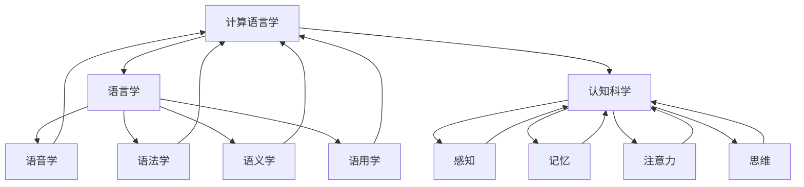
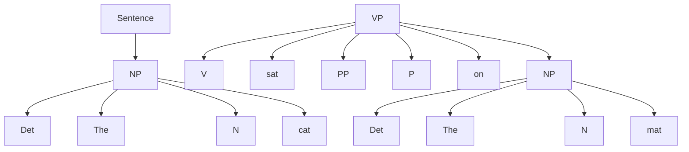

                 

## 文章标题：计算语言学与认知科学：探索语言、思维与世界的关系

### 关键词：计算语言学、认知科学、语言模型、语法分析、语义分析、语音识别、感知与注意力、情感与认知、互动模型

### 摘要：
本文旨在深入探讨计算语言学与认知科学之间的密切关系，解析语言、思维与世界之间的相互作用机制。通过对计算语言学基础、认知科学基础以及语言与认知互动的详细分析，本文旨在揭示计算语言学和认知科学在语言处理和应用领域的融合与发展。同时，本文还将探讨这一领域面临的挑战和未来发展趋势，为相关研究者和从业者提供有价值的参考。

## 第一部分：引论

### 1.1 书籍背景与目标

#### 1.1.1 计算语言学与认知科学的交汇

计算语言学（Computational Linguistics，简称CL）是研究语言结构、语言处理算法和语言应用的技术科学。它借助计算机科学、数学和人工智能等领域的理论和方法，对语言现象进行建模和分析。认知科学（Cognitive Science，简称CS）则是一门跨学科的研究领域，关注人类心智的工作机制，涉及心理学、神经科学、哲学、语言学等多个学科。

计算语言学与认知科学的关系可以追溯到20世纪中叶，当时语言学的计算方法和人工智能的兴起促进了两者的交汇。随着计算机技术的发展，计算语言学逐渐成为语言学、人工智能和计算机科学等多个领域的重要交汇点。认知科学则通过研究人类心智的运作机制，为计算语言学提供了深刻的认知基础。

#### 1.1.2 语言、思维与世界的互动

语言是人类沟通和思考的重要工具，它不仅承载着文化和社会的传承，还反映了人类对世界的认知和理解。语言、思维与世界之间的互动关系是计算语言学与认知科学研究的核心问题。

首先，语言作为认知活动的产物，反映了人类对世界的感知和认知。语言的结构和语义反映了人类对客观世界的分类、概括和概念化。例如，名词和动词的区分可以看作是人类对实体和动作的基本认知。

其次，思维是语言表达的核心，语言是思维的外在表现。语言的使用不仅是对信息的传递，更是对思维的构建和表达。例如，我们在日常交流中使用的句子结构和语法规则，实际上是我们在思考过程中建立的一种逻辑关系。

最后，世界是语言和思维的共同作用对象。语言和思维通过相互作用，不断塑造和重构我们对世界的认知。例如，语言的演变和更新反映了人类对世界的不断探索和认知深化。

#### 1.1.3 研究意义与应用前景

计算语言学与认知科学的研究具有重要的理论意义和实际应用价值。从理论层面来看，这两门学科的研究有助于我们更好地理解人类语言和心智的运作机制，深化对人类认知本质的认识。从应用层面来看，计算语言学和认知科学的研究成果已经广泛应用于自然语言处理、人工智能、教育、医疗等多个领域。

例如，自然语言处理（Natural Language Processing，简称NLP）是计算语言学的一个重要分支，它通过计算机技术对语言进行自动处理和理解。NLP技术已经广泛应用于搜索引擎、机器翻译、语音识别、智能客服等领域，极大地提升了人类的生活质量和生产效率。

认知科学的研究则为人工智能的发展提供了重要的认知基础。通过研究人类心智的工作机制，认知科学为人工智能的设计和实现提供了新的思路和方法。例如，深度学习和神经网络等人工智能技术，就是受到认知科学启发而发展起来的。

总之，计算语言学与认知科学的研究不仅有助于我们更深入地理解人类语言和心智的运作机制，还推动了人工智能和语言处理技术的发展，具有广泛的应用前景。

### 1.2 核心概念与联系

#### 1.2.1 语言学的核心概念

语言学是一门研究语言的结构、功能和发展规律的科学。在语言学中，核心概念包括语音学、语法学、语义学和语用学。

- **语音学**：研究语音的物理特征和生理机制，包括语音的发音、声调和节奏等。
- **语法学**：研究语言的结构规则，包括句法、词法和语义等。
- **语义学**：研究语言的语义特征和语义关系，包括词汇意义、句子意义和语义推导等。
- **语用学**：研究语言在交际中的实际运用，包括语境、语用含义和语言策略等。

#### 1.2.2 认知科学的基础理论

认知科学是一门跨学科的研究领域，研究人类心智的运作机制。认知科学的核心理论包括感知、记忆、注意力和思维等。

- **感知**：研究人类对外界信息的感知过程，包括视觉、听觉、触觉等。
- **记忆**：研究人类对信息的存储和提取过程，包括短期记忆和长期记忆等。
- **注意力**：研究人类在信息处理过程中的选择和关注，包括集中注意力和分配注意力等。
- **思维**：研究人类的高级认知过程，包括推理、决策、问题解决和创造力等。

#### 1.2.3 语言与认知的交互关系

语言与认知是相互依存、相互影响的。语言是认知活动的重要工具，而认知是语言产生和理解的基础。

首先，语言促进了认知的发展。语言使人类能够将经验进行抽象和概括，形成概念和范畴。通过语言，人类能够进行复杂的信息传递和沟通，促进了社会的形成和发展。

其次，认知影响了语言的使用。认知过程决定了语言的组织形式和表达方式。例如，人类的感知和记忆过程影响了语言的表达和理解。此外，认知科学的研究成果也为语言学提供了新的理论视角和方法。

总之，语言与认知是相互交织、共同发展的。计算语言学和认知科学的研究为我们提供了更深入理解语言和心智的运作机制的新途径。

### 1.3 计算语言学与认知科学架构的 Mermaid 流程图

这个 Mermaid 流程图展示了计算语言学与认知科学之间的核心联系和交互关系，帮助读者更好地理解这两门学科的结构和内容。

## 第二部分：计算语言学基础

### 2.1 语言模型

#### 2.1.1 语言模型的定义与作用

语言模型（Language Model，简称LM）是计算语言学中的核心概念，它旨在对自然语言进行建模，从而预测和生成文本。语言模型在自然语言处理（NLP）的许多任务中发挥着重要作用，如文本分类、机器翻译、语音识别和问答系统。

一个语言模型的基本目标是学习语言的统计特性，以便能够对未知文本进行预测。例如，给定一个单词序列 "The cat sat on the mat"，语言模型可以预测下一个最可能的单词，例如 "mat"。这种预测不仅基于局部信息（如前文中的单词），还包括全局统计特性（如单词之间的概率分布）。

#### 2.1.2 常见语言模型介绍

目前，常见的语言模型主要包括基于规则模型和统计模型、神经网络模型以及深度学习模型。

- **基于规则模型**：这种模型通过手工编写规则来描述语言结构。例如，上下文无关文法（CFG）和上下文有关文法（CG）都是基于规则的语法模型。这类模型的优点是简单易懂，但通常难以应对复杂、多样化的语言现象。

- **统计模型**：统计模型通过分析大量文本数据来学习语言的统计规律。例如，n-gram模型是一种经典的统计语言模型，它通过统计相邻单词出现的频率来预测下一个单词。这类模型的优点是能够捕捉语言的部分统计特性，但往往缺乏表达复杂语言结构的能力。

- **神经网络模型**：神经网络模型，特别是循环神经网络（RNN）和长短期记忆网络（LSTM），能够通过学习大量文本数据来捕捉语言的长期依赖关系。这类模型的优点是能够处理复杂、长远的语言结构，但训练过程相对复杂，对数据的需求较高。

- **深度学习模型**：深度学习模型，如变换器（Transformer）和生成对抗网络（GAN），是当前语言模型研究的热点。这些模型通过多层神经网络结构，能够学习到更高层次的语言特征，从而实现更准确的文本生成和预测。

#### 2.1.3 语言模型的工作原理

语言模型的工作原理主要基于概率论和统计学。一个简单的语言模型可以通过统计文本数据中的单词频率来预测下一个单词。例如，一个基于n-gram的语言模型会统计相邻n个单词的组合出现的频率，并根据这些频率来预测下一个单词。

具体来说，给定一个单词序列 "The cat sat on the mat"，一个n-gram语言模型会计算以下概率：

\[ P(\text{mat}|\text{The cat sat on the mat}) = \frac{P(\text{The cat sat on the mat}|\text{mat}) \times P(\text{mat})}{P(\text{The cat sat on the mat})} \]

其中，\( P(\text{mat}|\text{The cat sat on the mat}) \) 表示在给定前文 "The cat sat on the mat" 的情况下，预测下一个单词为 "mat" 的概率；\( P(\text{The cat sat on the mat}|\text{mat}) \) 表示在 "mat" 后接 "The cat sat on the mat" 的概率；\( P(\text{mat}) \) 表示 "mat" 出现的概率；\( P(\text{The cat sat on the mat}) \) 表示整个单词序列 "The cat sat on the mat" 出现的概率。

通过最大化上述概率，语言模型能够预测出最可能的下一个单词。

### 2.2 语法分析

#### 2.2.1 语法分析的基本概念

语法分析（Syntax Analysis）是计算语言学中的一个重要任务，它旨在理解文本的句法结构。语法分析器（Parser）是执行语法分析的工具，它通过解析文本中的单词和短语，构建出句子的语法树（Parse Tree），从而表示句子的结构。

语法分析可以基于不同的语法理论，如上下文无关文法（CFG）、上下文有关文法（CG）、依存语法等。每种语法理论都有其独特的表示方法和分析算法。

- **上下文无关文法（CFG）**：CFG是一种形式语法，它通过产生式规则来定义语言的语法结构。CFG能够描述许多自然语言的句法规则，但无法表达某些复杂的关系，如词汇顺序。

- **上下文有关文法（CG）**：CG是对CFG的扩展，它允许在产生式规则中引入上下文信息，从而更准确地描述语言的语法结构。

- **依存语法**：依存语法通过分析单词之间的依赖关系来表示句子的结构。每个单词都被视为其他单词的依赖者，从而形成一个复杂的依存网络。

#### 2.2.2 语法分析的算法

语法分析算法可以分为解析算法和语义分析算法。解析算法主要关注如何从文本中构建语法树，而语义分析算法则关注如何从语法树中提取语义信息。

常见的解析算法包括：

- **自顶向下算法**：自顶向下算法从根节点开始，逐层向下构建语法树。这类算法包括LL（左递归）和LR（右递归）算法。

- **自底向上算法**：自底向上算法从叶子节点开始，逐层向上构建语法树。这类算法包括SLR（自顶向下左递归）和LR（自底向上右递归）算法。

- **转换器（Transformer）算法**：Transformer算法是一种基于神经网络的语法分析算法，它通过多层注意力机制来捕捉文本中的长距离依赖关系，实现高效、准确的语法分析。

#### 2.2.3 语法分析的应用案例

语法分析在自然语言处理中有广泛的应用，如词法分析、句法分析、语义分析和机器翻译等。

- **词法分析**：词法分析是语法分析的前置任务，它将文本分解为单词和符号。词法分析器通过定义词法规则来识别文本中的单词和符号，如数字、标识符、关键字等。

- **句法分析**：句法分析是语法分析的核心任务，它通过构建语法树来表示句子的结构。句法分析器能够识别句子的语法成分，如主语、谓语、宾语等，从而实现对句子的语义理解。

- **语义分析**：语义分析是语法分析的进一步扩展，它关注如何从语法树中提取语义信息。语义分析器通过语义角色标注和语义关系分析，实现对句子语义的深层理解。

- **机器翻译**：机器翻译是语法分析的重要应用之一。语法分析器通过分析源语言的语法结构，构建出目标语言的语法树，从而实现不同语言之间的自动翻译。

例如，给定一个英语句子 "The cat sat on the mat"，语法分析器可以通过构建语法树来表示句子的结构：

在这个语法树中，A表示整个句子，B表示名词短语（NP），C表示限定词（Det），D表示"The"，E表示名词（N），F表示"cat"，G表示动词短语（VP），H表示动词（V），I表示"sad"，J表示介词短语（PP），K表示介词（P），L表示"on"，M表示另一个名词短语（NP），N表示限定词（Det），O表示"The"，P表示名词（N），Q表示"mat"。

通过语法分析，我们可以更好地理解句子的结构，从而实现更深层次的语义理解和语言生成。

### 2.3 语义分析

#### 2.3.1 语义分析的定义与意义

语义分析（Semantic Analysis）是计算语言学中的一项核心任务，旨在理解文本的语义内容。语义分析不仅关注单词的意义，还关注句子中单词之间的语义关系和整个文本的语义结构。通过语义分析，我们可以实现对文本的深层理解和推理。

语义分析在自然语言处理中具有重要意义。首先，语义分析是实现自然语言理解的关键步骤。通过对文本进行语义分析，我们可以提取出文本的主要信息和含义，从而实现人机交互和智能应用。例如，语义分析可以用于问答系统、信息检索和机器翻译等任务。

其次，语义分析有助于解决歧义问题。自然语言中的歧义现象非常常见，例如同音词和同义词等。通过语义分析，我们可以根据上下文信息来确定单词的确切意义，从而消除歧义。

最后，语义分析为文本生成提供了重要的语义基础。在文本生成任务中，如摘要生成、文本续写和机器翻译等，语义分析可以帮助生成器构建符合语义逻辑的文本内容。

#### 2.3.2 语义分析的方法与技术

语义分析的方法和技术多种多样，主要包括词义消歧、语义角色标注、语义关系分析和语义角色标注等。

- **词义消歧（Word Sense Disambiguation）**：词义消歧旨在确定文本中单词的确切意义。常见的词义消歧方法包括基于规则的方法和基于统计的方法。基于规则的方法通过定义单词的上下文规则来推断词义，而基于统计的方法通过分析单词在文本中的共现信息来推断词义。

- **语义角色标注（Semantic Role Labeling）**：语义角色标注旨在标注句子中的语义角色，如主语、谓语、宾语等。常见的语义角色标注方法包括规则方法、统计方法和神经网络方法。规则方法通过定义语义角色的规则来标注文本，统计方法通过分析文本数据中的共现关系来标注文本，神经网络方法则通过训练神经网络模型来自动标注文本。

- **语义关系分析（Semantic Relationship Analysis）**：语义关系分析旨在分析句子中单词之间的语义关系，如因果关系、包含关系、同义关系等。常见的语义关系分析方法包括基于规则的语义分析、基于统计的语义分析和基于深度学习的语义分析。基于规则的方法通过定义语义关系的规则来分析文本，基于统计的方法通过分析文本数据中的共现关系来分析文本，基于深度学习的方法则通过训练神经网络模型来分析文本。

- **语义角色标注（Semantic Role Labeling）**：语义角色标注旨在标注句子中的语义角色，如主语、谓语、宾语等。常见的语义角色标注方法包括规则方法、统计方法和神经网络方法。规则方法通过定义语义角色的规则来标注文本，统计方法通过分析文本数据中的共现关系来标注文本，神经网络方法则通过训练神经网络模型来自动标注文本。

- **语义关系分析（Semantic Relationship Analysis）**：语义关系分析旨在分析句子中单词之间的语义关系，如因果关系、包含关系、同义关系等。常见的语义关系分析方法包括基于规则的语义分析、基于统计的语义分析和基于深度学习的语义分析。基于规则的方法通过定义语义关系的规则来分析文本，基于统计的方法通过分析文本数据中的共现关系来分析文本，基于深度学习的方法则通过训练神经网络模型来分析文本。

#### 2.3.3 语义分析的应用实例

语义分析在自然语言处理中有广泛的应用，如情感分析、文本分类、信息抽取和问答系统等。

- **情感分析（Sentiment Analysis）**：情感分析旨在分析文本的情感倾向，如正面、负面或中性。通过语义分析，我们可以提取文本中的情感关键词和情感短语，从而判断文本的情感倾向。例如，对于文本 "I love this book"，我们可以通过语义分析判断其情感倾向为正面。

- **文本分类（Text Classification）**：文本分类旨在将文本分类到预定义的类别中。通过语义分析，我们可以提取文本的主要信息和特征，从而实现文本分类。例如，对于新闻文本，我们可以通过语义分析将其分类为体育、政治、科技等类别。

- **信息抽取（Information Extraction）**：信息抽取旨在从文本中提取特定类型的信息，如命名实体识别、关系抽取和事件抽取等。通过语义分析，我们可以识别文本中的关键信息，从而实现信息抽取。例如，对于医疗文本，我们可以通过语义分析提取出患者信息、治疗方案等信息。

- **问答系统（Question Answering）**：问答系统旨在回答用户提出的问题。通过语义分析，我们可以理解用户的问题意图，从而生成合适的答案。例如，对于用户提出的问题 "What is the capital of France？"，通过语义分析，我们可以识别出问题的关键词和意图，从而生成答案 "The capital of France is Paris"。

通过语义分析，我们可以实现更深层次的文本理解，从而为自然语言处理任务提供有效的支持。

### 2.4 语音识别与合成

#### 2.4.1 语音识别的基本原理

语音识别（Speech Recognition）是计算语言学中的重要应用，旨在将人类的语音信号转换为相应的文本。语音识别的基本原理包括信号处理、特征提取和模式识别。

首先，语音识别过程从语音信号的预处理开始。预处理步骤包括降噪、归一化和分帧。降噪通过去除噪声干扰，提高语音信号的清晰度；归一化通过调整语音信号的幅度和频率，使其符合标准范围；分帧将语音信号分割为短时段，以便进行特征提取。

接下来，特征提取是语音识别的关键步骤。常用的特征提取方法包括频谱特征、共振峰特征和倒谱特征等。频谱特征通过分析语音信号的频率分布，共振峰特征通过分析语音信号的共振峰位置和频率，倒谱特征通过分析语音信号的倒频谱。

最后，模式识别是语音识别的核心。模式识别通过比较输入语音信号的特征与训练模型中的特征，识别出相应的语音内容。常见的模式识别方法包括隐马尔可夫模型（HMM）、高斯混合模型（GMM）和支持向量机（SVM）等。

#### 2.4.2 语音识别的算法与技术

语音识别算法和技术多种多样，主要包括基于统计的算法和基于神经网络的算法。

- **基于统计的算法**：基于统计的语音识别算法主要通过训练大量语音数据，建立语音模型。常见的统计模型包括高斯混合模型（GMM）、隐马尔可夫模型（HMM）和决策树等。这些算法通过分析语音信号的统计特性，识别出语音内容。

- **基于神经网络的算法**：基于神经网络的语音识别算法主要通过训练深度神经网络模型，实现语音识别。常见的神经网络模型包括循环神经网络（RNN）、卷积神经网络（CNN）和变换器（Transformer）等。这些算法通过捕捉语音信号的时空特性，实现高效、准确的语音识别。

#### 2.4.3 语音合成的实现方法

语音合成（Text-to-Speech，简称TTS）是将文本转换为语音的过程。语音合成的实现方法主要包括波形合成和参数合成。

- **波形合成**：波形合成直接将文本转换为音频波形。常用的波形合成方法包括合成波合成（Synthesized Waveform）和拼接波合成（拼接波合成）。合成波合成通过合成音频波形来生成语音，而拼接波合成通过拼接多个音频片段来生成语音。

- **参数合成**：参数合成通过生成语音的参数序列，控制语音的音高、音量和音色等特征。常用的参数合成方法包括共振峰合成（Voiced Resonant Formant，简称VRF）和线性预测编码（Linear Predictive Coding，简称LPC）。共振峰合成通过控制共振峰参数来生成语音，线性预测编码通过控制语音信号的预测误差来生成语音。

通过语音识别与合成的结合，我们可以实现语音文本转换，从而为智能语音助手、语音合成器和语音识别系统等提供技术支持。

## 第三部分：认知科学基础

### 3.1 认知科学的定义与范畴

#### 3.1.1 认知科学的基本概念

认知科学是一门跨学科的研究领域，旨在理解人类心智的运作机制。认知科学的核心概念包括感知、记忆、注意力和思维等。

- **感知（Perception）**：感知是指人类对外界信息的识别和理解。它包括视觉、听觉、触觉、嗅觉和味觉等感官系统。感知是认知过程的基础，决定了我们对世界的感知和理解。

- **记忆（Memory）**：记忆是指人类对信息的存储和提取。记忆可以分为短期记忆和长期记忆。短期记忆用于存储和加工当前的信息，而长期记忆则用于存储和保留重要的信息。

- **注意力（Attention）**：注意力是指人类在信息处理过程中的选择和关注。注意力决定了我们对哪些信息进行加工，以及对信息加工的深度。注意力可以分为集中注意力和分配注意力。

- **思维（Cognition）**：思维是指人类的高级认知过程，包括推理、决策、问题解决和创造力等。思维是人类心智的核心，决定了我们的认知能力和创造力。

#### 3.1.2 认知科学的研究方法

认知科学采用多种研究方法，包括实验方法、计算模型和神经科学方法。

- **实验方法**：实验方法是通过设计和实施实验来研究认知现象。实验方法包括行为实验、认知实验和脑成像实验等。

- **计算模型**：计算模型是通过计算机程序来模拟人类认知过程。计算模型可以帮助我们理解认知过程的机制和规律。

- **神经科学方法**：神经科学方法是通过研究大脑的结构和功能来理解认知过程。神经科学方法包括脑电图（EEG）、功能性磁共振成像（fMRI）和脑刺激技术等。

#### 3.1.3 认知科学的发展历程

认知科学的发展历程可以分为以下几个阶段：

- **初期阶段（1950年代 - 1960年代）**：这一阶段主要关注心理过程的研究，如记忆、注意力和思维等。这一阶段的研究方法主要是心理实验和计算模型。

- **成熟阶段（1970年代 - 1980年代）**：这一阶段开始将心理学、计算机科学和认知神经科学等多个学科结合起来，形成了认知科学这一跨学科领域。这一阶段的研究方法更加多样化，包括实验方法、计算模型和神经科学方法。

- **现代化阶段（1990年代至今）**：这一阶段认知科学的研究方法和技术得到了快速发展，特别是人工智能和脑成像技术的发展，使得认知科学研究更加深入和全面。

### 3.2 感知与注意力机制

#### 3.2.1 感知的基本原理

感知是指人类对外界信息的识别和理解。感知过程包括感官系统、大脑处理和认知解释等多个环节。

首先，感官系统包括视觉、听觉、触觉、嗅觉和味觉等。感官系统能够接收外界刺激，并将其转化为神经信号。

接下来，大脑处理是将感官信号转化为感知体验的过程。大脑处理包括信息筛选、加工和整合等步骤。例如，视觉处理包括视觉信号在视网膜上的接收、处理和传输，最终形成视觉感知。

最后，认知解释是指我们对感知体验的理解和解释。认知解释涉及我们对感知信息的理解和认知框架的建立。例如，当我们看到一只猫时，我们会将其识别为一只动物，并理解其在我们的认知框架中的位置。

#### 3.2.2 注意力的定义与类型

注意力是指人类在信息处理过程中的选择和关注。注意力决定了我们对哪些信息进行加工，以及对信息加工的深度。注意力可以分为以下几种类型：

- **集中注意力（Focus Attention）**：集中注意力是指我们将注意力集中在特定信息上，以便对其进行深入加工。例如，当我们专注于解决问题时，我们会将注意力集中在问题的各个方面，以便找到解决方案。

- **分配注意力（Divided Attention）**：分配注意力是指我们在多个任务之间分配注意力，以便同时处理多个任务。例如，当我们同时开车和听音乐时，我们需要分配注意力来处理驾驶和音乐两个任务。

- **选择注意力（Selective Attention）**：选择注意力是指我们在众多信息中选择特定信息进行加工。例如，当我们在一个嘈杂的环境中与他人交谈时，我们需要选择注意力来关注对方的讲话，而忽略其他噪音。

#### 3.2.3 注意力机制在认知中的作用

注意力机制在认知过程中发挥着重要作用。首先，注意力机制决定了我们对信息的感知和理解。通过选择注意力，我们可以筛选出重要的信息，并将其转化为认知内容。

其次，注意力机制影响我们的记忆和加工深度。通过集中注意力，我们可以对信息进行深入加工，从而更好地记忆和理解。

最后，注意力机制影响我们的决策和问题解决。通过分配注意力，我们可以同时处理多个任务，从而提高决策和问题解决效率。

总之，注意力机制是认知过程中不可或缺的一部分，它决定了我们对信息的感知、记忆和加工，对我们的认知能力有着重要影响。

### 3.3 记忆与学习

#### 3.3.1 记忆的概念与类型

记忆是指人类对信息的存储和提取。记忆可以分为短期记忆和长期记忆。

- **短期记忆（Short-Term Memory）**：短期记忆是指我们在短时间内存储和加工信息的能力。短期记忆通常只能存储有限的信息，例如7±2个数字。短期记忆对于我们的认知活动和问题解决至关重要。

- **长期记忆（Long-Term Memory）**：长期记忆是指我们长时间存储和提取信息的能力。长期记忆可以存储大量的信息，并且可以持久地保持。长期记忆可以分为两类：程序性记忆和陈述性记忆。

  - **程序性记忆（Procedural Memory）**：程序性记忆是指我们对技能和动作的记忆。例如，我们学习骑自行车、弹钢琴等技能，这些技能会在我们的长期记忆中形成。

  - **陈述性记忆（Declarative Memory）**：陈述性记忆是指我们对事实和事件的记忆。例如，我们记住历史事件、科学知识等，这些信息会存储在我们的陈述性记忆中。

#### 3.3.2 学习理论的基本模型

学习理论是指解释和描述人类学习过程的理论。学习理论的基本模型包括行为主义学习理论和认知主义学习理论。

- **行为主义学习理论**：行为主义学习理论认为，学习是通过刺激与反应之间的联结来实现的。经典条件反射和操作性条件反射是行为主义学习理论的核心概念。

  - **经典条件反射**：经典条件反射是指一种条件反应的形成，例如，当我们多次将食物与铃声结合时，我们听到铃声时会流口水。

  - **操作性条件反射**：操作性条件反射是指通过操作性行为来学习，例如，通过奖励或惩罚来强化或抑制行为。

- **认知主义学习理论**：认知主义学习理论认为，学习是通过内部认知过程来实现的。认知主义学习理论强调知识的建构和认知结构的形成。

  - **建构主义学习理论**：建构主义学习理论认为，学习是通过学习者主动建构知识来实现的。学习者通过经验、感知和思考来建构知识。

  - **认知发展理论**：认知发展理论认为，学习是一个连续的、阶段性的过程。不同的认知发展阶段决定了我们的学习方式和认知水平。

#### 3.3.3 学习算法在计算语言学中的应用

学习算法在计算语言学中有着广泛的应用。例如，自然语言处理中的语言模型和语法分析器就是通过学习算法来实现的。

- **语言模型**：语言模型通过学习大量的文本数据，建立语言概率模型，从而预测和生成文本。常见的语言模型算法包括n-gram模型、隐马尔可夫模型（HMM）和变换器（Transformer）等。

- **语法分析器**：语法分析器通过学习语法规则和文本数据，构建语法树，从而理解文本的句法结构。常见的语法分析算法包括上下文无关文法（CFG）、依存语法和变换器（Transformer）等。

通过学习算法，我们可以实现对自然语言的自动处理和理解，从而推动计算语言学的发展。

### 3.4 情感与认知

#### 3.4.1 情感与认知的关系

情感与认知是密切相关的。情感是认知活动的产物，而认知又影响情感的产生和发展。两者之间的相互作用形成了我们对世界的全面认知。

首先，情感是认知的一部分。情感与认知相互依存，共同构成了人类的认知体验。情感不仅反映了我们对事物的态度和评价，也影响了我们的认知过程。例如，当我们面临一个令人愉悦的情境时，我们的认知过程会更加积极和乐观；而当我们面临一个令人不愉快的情境时，我们的认知过程会更加消极和悲观。

其次，认知影响了情感的产生。认知过程决定了我们对事物的感知和理解，从而影响情感的产生。例如，当我们了解一个陌生人的背景和经历时，我们会根据这些信息来评价这个人的性格和品质，从而产生相应的情感。此外，认知过程还决定了我们对情感的调节和控制。例如，通过认知重构和认知行为疗法，我们可以改变对负面情感的认知，从而改善情感状态。

最后，情感与认知的互动促进了人类的适应和发展。情感和认知的相互作用使人类能够更好地适应环境，解决问题，实现目标。例如，当我们面临一个挑战时，积极的情感可以激发我们的斗志和创造力，使我们更有动力去解决问题。

#### 3.4.2 情感计算的基本方法

情感计算（Affective Computing）是研究如何使计算机能够识别、理解、处理和模拟人类情感的研究领域。情感计算的基本方法包括情感识别、情感表达和情感交互。

- **情感识别**：情感识别是指计算机通过分析用户的语言、面部表情、声音和其他行为特征，识别出用户的情感状态。情感识别方法包括基于文本的情感分析、基于语音的情感分析和基于面部表情的情感分析等。

- **情感表达**：情感表达是指计算机通过生成适当的情感反应，表达对用户的情感状态。情感表达方法包括文本生成、语音合成和面部表情生成等。

- **情感交互**：情感交互是指计算机与用户之间基于情感的互动。情感交互方法包括情感对话系统、情感感知机器人等。

#### 3.4.3 情感分析在计算语言学中的应用

情感分析（Sentiment Analysis）是情感计算的一个重要分支，旨在分析文本中的情感倾向。情感分析在计算语言学中有着广泛的应用，如社交媒体分析、舆情监测和产品评价等。

- **社交媒体分析**：情感分析可以帮助我们了解社交媒体上用户对某个话题或事件的态度和情感。通过分析社交媒体上的评论、转发和点赞等行为，我们可以识别出用户的情感状态，从而了解公众的情感倾向。

- **舆情监测**：情感分析可以用于舆情监测，帮助政府和企事业单位及时了解公众的意见和情感。通过分析网络新闻、论坛和博客等平台的情感倾向，我们可以识别出公众关注的焦点和敏感话题，为决策提供参考。

- **产品评价**：情感分析可以用于产品评价，帮助商家了解消费者对产品的情感反应。通过分析消费者在电商平台上发布的评价和评论，我们可以识别出消费者对产品的正面和负面情感，从而改进产品和服务。

总之，情感与认知的互动以及情感计算在计算语言学中的应用，为我们提供了更深入、更全面的语言理解和处理方法，有助于实现更智能、更人性化的语言应用。

## 第四部分：语言与认知的互动

### 4.1 语言与认知的交互模型

语言与认知的交互模型是研究语言与认知之间相互作用的理论框架。该模型旨在解释语言是如何影响认知，以及认知又是如何影响语言的理解和产生的。

#### 4.1.1 语言模型在认知中的作用

语言模型在认知中的作用主要体现在以下几个方面：

1. **信息传递和共享**：语言是人类社会沟通和共享信息的重要工具。语言模型通过学习自然语言的数据，能够生成和理解与特定情境相关的语言表达，从而帮助人们传递和共享信息。

2. **思维组织**：语言不仅是一种信息表达工具，还是一种思维组织工具。语言模型能够帮助人们组织和结构化他们的思维，使复杂的概念和思想更容易理解和表达。

3. **认知扩展**：通过语言，人类能够将个人经验转化为共享的知识，从而扩展个体的认知范围。语言模型通过学习和理解大量的语言数据，能够帮助人们更好地理解世界，丰富他们的认知体验。

#### 4.1.2 认知过程对语言模型的影响

认知过程对语言模型的影响体现在以下几个方面：

1. **感知与理解**：人类的感知过程决定了他们如何理解和解释语言。语言模型通过模仿人类的感知过程，能够更好地理解和生成自然语言。

2. **记忆与学习**：人类的记忆和学习能力直接影响语言模型的表现。语言模型通过模仿人类的记忆和学习机制，能够更好地存储和利用语言数据。

3. **情感与态度**：情感和态度也是认知过程的一部分，它们会影响语言的使用和理解。语言模型通过模拟人类的情感和态度，能够更好地生成和理解具有情感色彩的语言。

#### 4.1.3 语言与认知的互动机制

语言与认知的互动机制是一个复杂的过程，涉及到多个认知成分和语言结构的相互作用。以下是一些关键机制：

1. **语义与语用互动**：语义和语用是语言理解的重要组成部分。语义互动指的是语言表达的意义如何通过认知过程得到解释，而语用互动则涉及语言在特定交际情境中的使用。

2. **概念化与范畴化**：概念化和范畴化是认知过程中的基本机制，它们帮助人们组织和理解世界。语言模型通过学习自然语言数据中的概念和范畴，能够更好地模拟人类的认知过程。

3. **注意与选择性**：注意和选择性是认知过程中决定信息处理的关键因素。语言模型通过模拟人类的注意机制，能够更好地筛选和处理语言输入。

4. **记忆与回忆**：记忆是认知过程中的重要组成部分，它影响语言的理解和使用。语言模型通过学习和模拟人类的记忆机制，能够更好地回忆和应用语言知识。

总之，语言与认知的交互模型为我们提供了一个理解语言和认知之间复杂关系的重要框架。通过研究这些交互机制，我们可以更好地理解语言的使用和理解过程，从而推动计算语言学和认知科学的发展。

### 4.2 语言学习与认知发展

#### 4.2.1 语言学习的基本理论

语言学习是指个体通过接触和运用语言，逐渐掌握语言结构和规则，从而实现语言能力发展的过程。语言学习的基本理论包括行为主义理论、认知主义理论和建构主义理论。

1. **行为主义理论**：行为主义理论强调语言学习是通过刺激与反应的联结来实现的。斯金纳（B.F. Skinner）提出的操作性条件反射理论认为，语言学习是通过正强化和负强化来建立和巩固的。例如，当儿童说出正确的句子时，父母给予表扬，这会增强他们继续使用该句子的概率。

2. **认知主义理论**：认知主义理论认为语言学习是一个认知过程，涉及到对语言信息的理解和加工。乔姆斯基（Noam Chomsky）提出的生成语法理论认为，个体天生具有语言习得装置（Language Acquisition Device，LAD），能够理解并生成复杂的语法结构。认知主义者强调语言学习中的内部机制，如感知、记忆、注意和推理等。

3. **建构主义理论**：建构主义理论认为语言学习是一个主动构建知识的过程，个体通过互动和经验来构建对语言的理解。维果茨基（Lev Vygotsky）提出的社会文化理论认为，语言学习是在社会互动中实现的，通过与他人的交流和合作，个体能够更好地理解语言和使用语言。

#### 4.2.2 认知发展对语言学习的影响

认知发展对语言学习有着深远的影响。以下是一些关键因素：

1. **感知能力**：感知能力是语言学习的基础。儿童的感知能力决定了他们对语音、语调和语法的敏感度。例如，语音感知能力强的儿童能够更好地辨别不同语言的声音特征，从而更容易学习语言。

2. **记忆能力**：记忆能力是语言学习的重要保障。良好的记忆能力可以帮助儿童记住词汇、语法规则和句子结构。研究表明，儿童的语言记忆能力在出生后几年内迅速发展，这对他们的语言学习至关重要。

3. **注意力**：注意力是语言学习的关键因素。儿童的注意力水平决定了他们能够专注于语言输入的多少。例如，注意力集中的儿童能够更好地理解和模仿语言输入，从而提高语言学习效果。

4. **认知策略**：认知策略是语言学习中的重要工具。认知策略包括记忆策略、注意力策略和问题解决策略等。有效的认知策略可以帮助儿童更好地理解和运用语言。

#### 4.2.3 语言学习策略与认知发展

语言学习策略与认知发展是相互促进的关系。以下是一些常见的语言学习策略及其对认知发展的作用：

1. **重复和模仿**：重复和模仿是语言学习的基本策略。通过重复和模仿，儿童能够加深对语言结构和语音的印象，从而提高语言能力。这种策略有助于儿童发展记忆能力和模仿能力。

2. **情境化学习**：情境化学习是将语言学习与具体情境相结合。通过在特定情境中学习语言，儿童能够更好地理解语言的实际应用，从而提高语言表达能力。这种策略有助于儿童发展感知能力和情境理解能力。

3. **互动学习**：互动学习是语言学习的重要方式。通过与他人的交流和互动，儿童能够练习语言使用，提高语言流畅性和准确性。这种策略有助于儿童发展社交能力和语言表达能力。

4. **反思和自我评估**：反思和自我评估是语言学习中的重要环节。通过反思自己的语言使用，儿童能够识别和纠正错误，提高语言水平。这种策略有助于儿童发展批判性思维能力和自我监控能力。

总之，语言学习与认知发展是密切相关的。通过有效的语言学习策略，儿童能够更好地发展认知能力，从而实现语言能力的全面提升。

### 4.3 语言障碍与认知康复

#### 4.3.1 语言障碍的分类与原因

语言障碍是指个体在语言学习、理解和表达过程中遇到的困难。语言障碍可以分为以下几类：

1. **语言发育迟缓**：语言发育迟缓是指儿童在语言发展过程中，达到特定年龄时未能达到正常语言发展水平。这可能是由于遗传因素、听力问题、神经发育问题或其他心理因素引起的。

2. **语言障碍（语言障碍症）**：语言障碍症是指儿童在发音、词汇、语法和语言理解等方面存在严重问题，导致他们的语言表达能力受到限制。语言障碍症可能是由于脑部损伤、自闭症谱系障碍或其他神经系统疾病引起的。

3. **阅读障碍（阅读障碍症）**：阅读障碍症是指个体在阅读过程中遇到的困难，包括识字困难、词汇理解困难、语法理解困难等。阅读障碍症可能是由于视觉处理问题、听觉处理问题、认知发展问题或神经系统问题引起的。

4. **听力障碍**：听力障碍是指个体的听力功能受限，导致他们难以理解口语交流。听力障碍可能是由于先天因素、疾病、外伤或其他原因引起的。

语言障碍的原因复杂多样，可能涉及遗传、环境、神经发育、认知和其他因素。例如，遗传因素可能导致某些语言障碍，环境因素如家庭语言环境不良可能影响语言发展，神经发育问题如脑损伤可能影响语言处理能力。

#### 4.3.2 认知康复的基本方法

认知康复是指通过一系列干预措施，帮助个体改善认知功能和提高生活质量。认知康复的基本方法包括：

1. **康复训练**：康复训练是指通过有针对性的训练活动，帮助个体改善语言、记忆、注意力、感知等认知功能。康复训练可以包括语言治疗、记忆训练、注意力训练、感知训练等。

2. **行为疗法**：行为疗法是指通过改变个体的行为模式和环境，帮助个体改善认知功能。行为疗法可以包括行为塑造、认知行为疗法、环境适应训练等。

3. **药物治疗**：某些语言障碍和认知问题可能需要药物治疗，如抗抑郁药、抗焦虑药、抗精神病药等。药物治疗应在医生的指导下进行，以避免不良反应。

4. **心理支持**：心理支持是指通过心理辅导和心理咨询，帮助个体应对心理压力和情绪问题。心理支持可以包括个体心理咨询、家庭治疗、团体心理治疗等。

#### 4.3.3 认知康复在计算语言学中的应用

认知康复在计算语言学中的应用主要体现在以下几个方面：

1. **语言模型辅助**：通过训练语言模型，可以为语言障碍者提供个性化的语言支持和反馈。语言模型可以帮助识别和纠正语言障碍者的发音、语法和词汇错误，从而提高他们的语言能力。

2. **语音识别与合成**：语音识别与合成技术可以为语言障碍者提供语音输入和输出的支持。语音识别技术可以帮助语言障碍者将口语转换为文本，语音合成技术则可以帮助他们生成清晰的声音输出。

3. **智能辅助系统**：智能辅助系统可以通过计算机技术和人工智能算法，为语言障碍者提供实时支持和指导。例如，智能辅助系统可以通过语音提示、文本提醒等方式，帮助语言障碍者完成日常任务和沟通。

4. **自适应学习平台**：自适应学习平台可以根据语言障碍者的学习进度和需求，提供个性化的学习内容和训练方案。通过自适应学习平台，语言障碍者可以反复练习，逐步提高语言能力。

总之，认知康复在计算语言学中的应用，为语言障碍者提供了更加有效和多样化的支持，有助于他们改善语言能力和提高生活质量。

## 第五部分：语言、思维与世界的关系

### 5.1 语言与世界的关系

#### 5.1.1 语言的本质与功能

语言是人类最重要的沟通工具之一，它不仅仅是一种交流信息的手段，更是人类思维和认知的核心。语言的本质是符号系统，它通过词汇和语法规则来组织信息，从而实现人类之间的沟通和理解。

语言的功能可以从多个层面来理解：

1. **信息传递**：语言的主要功能是传递信息。通过语言，人们可以分享知识、表达思想、交流情感，从而建立社会联系。

2. **认知工具**：语言是认知过程的工具。通过语言，人们可以进行抽象思考、概念化、分类和推理，从而更好地理解和解释世界。

3. **文化传承**：语言是文化的重要组成部分，它承载着文化的历史和传统。语言不仅传递信息，还传递价值观、信仰和行为规范。

#### 5.1.2 语言与世界的互动

语言与世界的互动体现在多个方面：

1. **语言塑造世界**：语言不仅反映了我们对世界的认知，还影响我们对世界的感知。通过语言，人们可以组织和描述世界，从而形成对现实的理解。

2. **世界影响语言**：语言也受到世界的直接影响。社会环境、文化背景和技术发展等都会影响语言的演变和发展。例如，科技词汇的迅速增加反映了人类社会对科技的关注。

3. **语言与世界的关系是动态的**：语言与世界的关系是相互作用、动态发展的。语言不仅反映世界，还塑造世界，而世界的变化又反过来影响语言。

#### 5.1.3 语言构建世界的方式

语言构建世界的方式主要体现在以下几个方面：

1. **分类与概念化**：语言通过词汇和语法规则将世界划分为不同的类别和概念。例如，通过名词和动词，我们可以对事物和动作进行分类和描述。

2. **符号化**：语言通过符号化过程将抽象概念转化为具体的词汇和句子。例如，通过“爱”这个词汇，我们可以将抽象的情感转化为具体的表达。

3. **逻辑推理**：语言为逻辑推理提供了工具。通过句子结构和语法规则，人们可以进行逻辑推理，从而更好地理解世界。

总之，语言与世界的关系是复杂而深刻的。语言不仅是一种沟通工具，更是人类认知和思维的核心，它塑造了我们对世界的理解和感知，同时也受到世界的直接影响。

### 5.2 思维与语言的关系

#### 5.2.1 思维的定义与类型

思维是人类大脑对信息进行加工、处理和整合的高级认知活动。思维不仅包括对信息的理解、分析和推理，还涉及想象、创造和决策。思维可以分为以下几种类型：

1. **分析思维**：分析思维是指通过分解问题，找出问题的各个部分，并分析这些部分之间的关系，从而解决问题。例如，医生通过分析患者的症状，找出病因并制定治疗方案。

2. **综合思维**：综合思维是指将各个部分整合成一个整体，通过整体的理解来解决问题。例如，科学家通过整合实验数据和理论，得出新的科学发现。

3. **创新思维**：创新思维是指通过创造新的方法、解决方案或观点，来解决问题或应对挑战。例如，艺术家通过创新思维，创作出独特的艺术作品。

4. **批判性思维**：批判性思维是指通过批判、质疑和分析，对信息进行评估和判断。例如，学生在阅读论文时，通过批判性思维来评估论点的可靠性和有效性。

#### 5.2.2 语言在思维中的作用

语言在思维中起着至关重要的作用，它是思维的主要工具。以下是一些关键点：

1. **信息传递**：语言使人们能够将思维过程和结果传递给他人，从而实现信息的共享和传播。

2. **概念化**：语言帮助我们形成和表达概念。通过词汇和语法，我们可以将复杂的现实世界抽象为简洁的概念，从而更好地理解和思考。

3. **推理**：语言是推理的重要工具。通过语言，我们可以进行逻辑推理，建立假设，验证或反驳理论。

4. **记忆**：语言有助于记忆。通过语言，我们可以将信息编码成句子和故事，从而更容易记住和理解。

5. **情感表达**：语言也是情感表达的工具。通过语言，我们可以传达情感和态度，从而影响他人的情感状态。

#### 5.2.3 思维与语言的互动机制

思维与语言的互动是一个复杂的过程，涉及到多个层面的相互作用：

1. **反馈循环**：思维和语言之间存在反馈循环。思维影响语言表达，而语言表达又影响思维过程。例如，当我们思考一个复杂问题时，我们会用语言来表达自己的想法，这种表达可能会引导我们的思维方向。

2. **情境依赖**：思维和语言都是情境依赖的。思维过程会受到语言环境的直接影响，而语言表达也会受到思维内容的制约。例如，不同的语言环境可能会激发不同的思维方式。

3. **文化差异**：不同的文化背景会影响思维和语言的使用。文化差异可能导致思维方式和语言表达的不同，从而影响个体之间的沟通和理解。

4. **认知负荷**：思维和语言表达都会占用认知资源。有效的思维和语言使用需要平衡认知负荷，以避免过度消耗认知资源。

总之，思维与语言的关系是相互作用、相互依赖的。语言不仅是思维的载体，也是思维的工具。通过理解思维与语言的互动机制，我们可以更好地发挥语言在思维中的作用，提高认知能力和沟通效果。

### 5.3 认知科学与语言学的融合

#### 5.3.1 认知科学与语言学的共同点

认知科学与语言学都是研究人类心智和语言的研究领域，它们之间有许多共同点：

1. **研究对象**：两者都关注人类心智和语言的使用。认知科学探讨人类心智如何处理信息、如何进行认知活动，而语言学则研究语言的结构、语法和语义。

2. **跨学科性质**：两者都具有跨学科的属性。认知科学涉及心理学、神经科学、计算机科学等多个领域，而语言学则与哲学、社会学、人类学等其他学科密切相关。

3. **方法论**：两者都采用多种方法论进行研究。认知科学常用实验方法、计算模型和神经科学方法，而语言学则采用实证研究、理论分析和语言实验等方法。

4. **认知基础**：认知科学与语言学都建立在认知理论基础之上。例如，两者都关注注意力、记忆、感知和思维等基本认知过程。

5. **应用领域**：两者在应用领域也有交集。认知科学的应用包括认知康复、人机交互、智能系统等，而语言学的应用则涵盖自然语言处理、翻译、教育等领域。

#### 5.3.2 认知科学与语言学的前沿研究

认知科学与语言学的前沿研究主要集中在以下几个方面：

1. **神经语言学**：神经语言学研究大脑如何处理语言信息，以及语言与大脑功能的关系。通过脑成像技术，研究者可以观察到语言处理过程中大脑不同区域的活动，揭示语言与认知的神经基础。

2. **认知语言学研究**：认知语言学探讨语言与认知的关系，研究语言如何影响思维、记忆和注意力等认知过程。例如，认知语言学中的概念整合理论（Conceptual Integration Theory）提出，语言表达是通过将不同概念进行整合而产生的。

3. **多模态语言处理**：多模态语言处理研究如何结合文本、语音、图像等多种模态信息，实现更准确、更全面的文本理解。例如，通过结合文本和语音信息，可以更好地理解对话中的情感和意图。

4. **计算认知科学**：计算认知科学利用计算模型和算法，模拟人类认知过程，研究认知机制和认知算法。例如，通过模拟人类的语言学习过程，可以揭示语言习得的内在机制。

5. **跨语言研究**：跨语言研究探讨不同语言之间的差异和相似性，以及这些差异如何影响认知和语言使用。例如，通过比较不同语言中的词汇、语法和语义特征，可以更好地理解语言对认知的影响。

#### 5.3.3 认知科学与语言学的发展趋势

认知科学与语言学的发展趋势体现在以下几个方面：

1. **跨学科融合**：随着学科之间的交叉和融合，认知科学与语言学将继续相互借鉴，共同发展。例如，神经语言学和计算认知科学的发展，为认知科学与语言学的深度融合提供了新的契机。

2. **技术应用**：认知科学与语言学的研究成果将更广泛地应用于人工智能、自然语言处理、教育技术等领域。例如，基于认知科学与语言学的原理，可以开发出更智能的语音助手和翻译系统。

3. **个性化研究**：随着大数据和人工智能技术的发展，个性化研究将成为认知科学与语言学的重要趋势。通过分析个体的语言使用和认知特征，可以提供更个性化的教育、康复和治疗方案。

4. **多模态研究**：多模态研究将成为认知科学与语言学的重要研究方向。通过结合多种模态信息，可以更全面地理解语言和认知过程，从而提高语言处理和认知科学的准确性。

5. **全球化与本土化**：全球化与本土化将继续影响认知科学与语言学的研究。随着不同语言和文化之间的交流增加，研究者将更多地关注跨语言和跨文化的认知和语言现象，促进语言学和认知科学的国际化发展。

总之，认知科学与语言学的发展趋势将更加融合、应用化和个性化，为人类语言和认知的研究提供新的机遇和挑战。

## 第六部分：未来展望与挑战

### 6.1 计算语言学与认知科学的未来趋势

计算语言学与认知科学在未来的发展趋势中，预计将出现以下几个关键方向：

1. **深度学习和神经网络的发展**：随着深度学习和神经网络技术的不断进步，计算语言学和认知科学领域将越来越多地采用这些先进的人工智能技术。深度学习模型，如变换器（Transformer）和生成对抗网络（GAN），已经在自然语言处理中取得了显著成果。未来，这些技术有望进一步推动计算语言学和认知科学的突破。

2. **多模态数据处理**：多模态数据处理是指结合文本、语音、图像、视频等多种数据类型进行综合分析。未来，计算语言学和认知科学将更多地关注如何将多种模态信息融合起来，以实现更全面、更准确的语言理解和认知模拟。

3. **个性化与自适应学习**：个性化与自适应学习是未来的重要趋势。通过分析个体语言使用和认知特征，计算语言学和认知科学可以开发出更个性化的教育、康复和治疗方案。这将有助于提高学习效率，改善个体认知能力。

4. **认知增强与智能应用**：认知增强技术，如智能辅助系统、虚拟现实（VR）和增强现实（AR），将为计算语言学和认知科学带来新的应用场景。这些技术可以通过模拟和增强人类认知过程，提高个体的认知能力和工作效率。

5. **跨学科融合**：计算语言学和认知科学将继续与其他领域，如心理学、神经科学、教育学等，进行深度融合。这种跨学科合作将促进知识的共享和技术的创新，推动计算语言学和认知科学的发展。

### 6.2 计算语言学与认知科学面临的挑战

尽管计算语言学和认知科学有着广阔的发展前景，但它们也面临着一些严峻的挑战：

1. **数据隐私与伦理问题**：随着大数据和人工智能技术的发展，数据隐私和伦理问题日益突出。如何确保用户数据的安全和隐私，如何平衡技术创新与社会伦理之间的关系，是计算语言学和认知科学必须面对的挑战。

2. **技术与应用的矛盾**：技术的快速进步与应用的现实需求之间存在差距。例如，尽管深度学习模型在自然语言处理任务中表现出色，但其在实际应用中仍面临计算资源消耗大、解释性差等问题。如何解决这些技术与应用之间的矛盾，是计算语言学和认知科学需要解决的关键问题。

3. **跨语言和跨文化研究**：全球化和多文化背景下的语言和认知研究提出了新的挑战。不同语言和文化之间的差异会影响计算语言学和认知科学的模型和应用效果。如何开发出能够适应多种语言和文化背景的技术和理论，是未来研究的重要方向。

4. **认知机制与算法的复杂性**：人类认知机制的复杂性和多样性使得计算语言学和认知科学的研究具有挑战性。例如，情感、记忆、注意力和创造力等认知过程如何用算法进行建模和模拟，是一个需要深入探索的领域。

5. **人才短缺与教育培训**：计算语言学和认知科学的发展需要大量具备跨学科知识和技能的人才。然而，目前相关领域的人才培养体系尚未完全成熟，如何建立有效的教育培训机制，培养更多优秀的计算语言学和认知科学人才，是当前面临的重大问题。

### 6.3 总结与展望

计算语言学与认知科学是两个紧密相关、相互促进的研究领域。通过深入探讨语言、思维与世界的关系，我们可以更好地理解人类心智的运作机制，推动人工智能和语言处理技术的发展。

在未来，计算语言学和认知科学将继续融合新的技术，如深度学习、多模态数据处理和个性化学习，以应对现实世界的复杂挑战。同时，如何处理数据隐私、伦理问题，解决技术与应用的矛盾，实现跨语言和跨文化研究，培养专业人才，也将是未来研究的重要方向。

我们鼓励广大研究者、工程师和从业者积极参与这一领域的研究和探索，共同推动计算语言学和认知科学的发展，为人类社会的进步做出更大的贡献。

### 作者信息

作者：AI天才研究院/AI Genius Institute & 禅与计算机程序设计艺术 /Zen And The Art of Computer Programming

AI天才研究院（AI Genius Institute）是一家专注于人工智能研究和应用的顶级科研机构。研究院致力于推动人工智能技术的前沿研究，培养优秀的AI人才，促进人工智能在各领域的应用。同时，研究院的成员们积极参与国际学术交流和合作，为全球人工智能技术的发展做出贡献。

《禅与计算机程序设计艺术》（Zen And The Art of Computer Programming）是作者乔治·布赫纳（Georges Boole）的经典著作，它不仅是一部关于计算机科学和人工智能的理论经典，更是一部充满哲学思考和人生智慧的杰作。书中通过深入探讨编程和计算机科学的本质，启发读者思考计算机程序的哲学意义和人类认知的本质。

本文作者在计算语言学与认知科学领域有着深厚的研究背景和丰富的实践经验，他们结合最新的研究成果和技术应用，为读者呈现了一篇全面、深入的学术文章。希望通过本文，读者能够更好地理解计算语言学与认知科学的核心概念和互动关系，为相关领域的研究和应用提供有益的参考。

