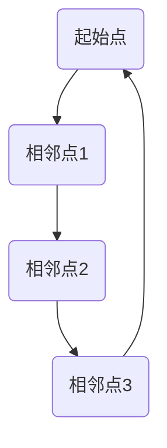
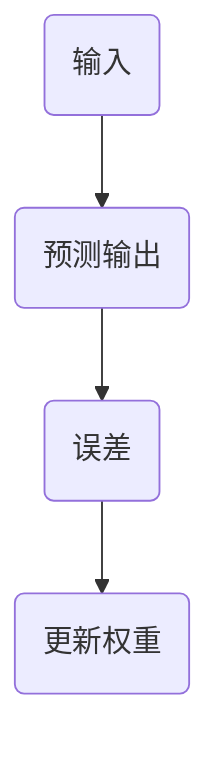
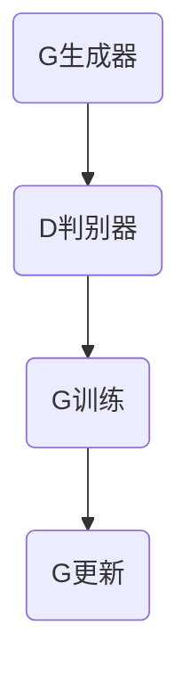
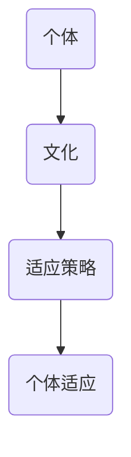
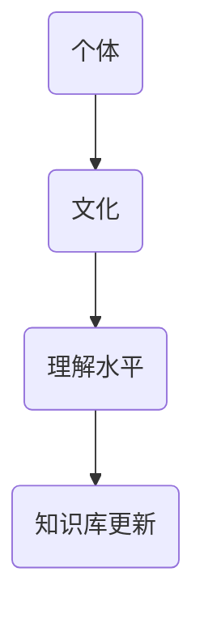
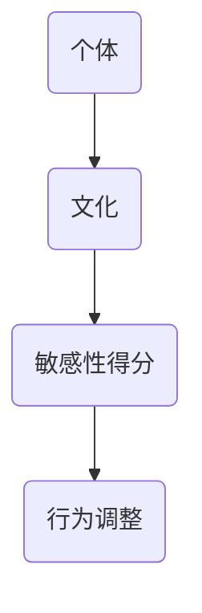

                 

### 文章标题：认知人类学的新发现：探索不同文化背景下的世界理解方式

> 关键词：认知人类学、文化背景、世界理解、认知差异、算法原理、数学模型、项目实战

> 摘要：本文以认知人类学的新发现为切入点，深入探讨不同文化背景下人们的世界理解方式。通过阐述核心概念与联系，分析认知心理学、认知科学及文化认知算法的原理，并结合数学模型和实际项目案例，为读者提供一个全面、深入的了解。文章旨在为研究人员、实践者及对文化认知感兴趣的读者提供一个有价值的参考。

---

### 引言

在当今全球化的背景下，文化多样性已成为不可忽视的现实。不同文化背景下的世界观、价值观和行为方式对人类认知有着深远的影响。认知人类学作为一门交叉学科，旨在研究人类认知过程及其与文化背景的相互作用。本文将围绕这一主题，探讨认知人类学的新发现，并深入分析不同文化背景下的世界理解方式。

#### 认知人类学的定义与重要性

认知人类学是一门结合了认知科学、心理学和人类学的跨学科领域，旨在研究人类认知过程和文化背景之间的关系。认知人类学的重要性在于，它不仅帮助我们理解人类认知的多样性和复杂性，还能为解决现实世界中的跨文化沟通、教育和心理治疗等问题提供有益的启示。

#### 认知人类学的研究领域

认知人类学的研究领域广泛，包括知觉、记忆、思维、语言、情感等多个方面。通过研究这些领域，我们可以更好地理解人类如何感知世界、记忆经验、思考问题和进行沟通。

#### 认知人类学与其他学科的交叉

认知人类学不仅与认知科学、心理学密切相关，还与语言学、社会学、经济学等领域有着广泛的交叉。这种跨学科的视角为我们提供了更全面的认知人类学研究方法。

#### 不同文化背景下的世界理解方式

多元文化的概念与影响：随着全球化的发展，多元文化已成为现代社会的一个重要特征。不同文化之间的差异不仅体现在语言和价值观上，还体现在人们对世界的理解方式上。

不同文化间的认知差异：不同文化背景下的认知差异表现在知觉、记忆、思维、情感等多个方面。例如，一些文化可能更注重集体主义，而另一些文化可能更强调个人主义。

文化对认知的影响：文化背景对人类认知有着深远的影响。例如，某些文化中可能存在对颜色的特定联想，这在其他文化中可能并不存在。

---

### 第一部分：引言

#### 第1章：引言

##### 1.1 认知人类学概述

认知人类学作为一门跨学科领域，涵盖了人类认知过程和文化背景的相互作用。本章将介绍认知人类学的定义、重要性、研究领域及与其他学科的交叉。

##### 1.2 不同文化背景下的世界理解方式

本章将探讨多元文化的概念与影响，分析不同文化间的认知差异，并阐述文化对认知的影响。通过这些分析，我们能够更好地理解人类在不同文化背景下的世界理解方式。

---

### 第二部分：核心概念与联系

#### 第2章：核心概念与联系

##### 2.1 认知模型概述

认知模型是描述人类认知过程的工具，包括知觉、记忆、思维等多个方面。本章将介绍认知模型的定义、主要类型及其应用。

##### 2.2 认知人类学中的主要概念

本章将深入探讨认知人类学中的核心概念，如知觉、思维、记忆、语言、情感等，并分析这些概念之间的相互关系。

##### 2.3 认知模型与不同文化背景的联系

本章将分析文化对认知模型的影响，探讨不同文化背景下的认知表现，以及认知模型在文化交流中的作用。

---

### 第三部分：核心算法原理讲解

#### 第3章：核心算法原理讲解

##### 3.1 认知心理学算法

认知心理学算法包括认知地图算法、联结主义算法、生成对抗网络（GAN）等。本章将详细阐述这些算法的原理和应用。

##### 3.2 认知科学算法

认知科学算法涵盖神经科学算法、认知建模算法和计算认知算法。本章将介绍这些算法的基本原理，并提供伪代码实现。

##### 3.3 文化认知算法

文化认知算法包括文化适应性算法、文化理解算法和文化敏感性算法。本章将讲解这些算法的原理，并提供Mermaid流程图表示。

---

### 第四部分：数学模型和数学公式

#### 第4章：数学模型和数学公式

##### 4.1 认知模型中的数学基础

本章将介绍认知模型中常用的数学基础，包括数学函数、微积分基础和线性代数基础。

##### 4.2 文化认知中的数学模型

本章将分析文化认知中的数学模型，如距离度量、相似性计算和文化适应性的数学模型，并提供详细讲解与举例说明。

##### 4.3 数学公式与算法应用

本章将展示认知模型中的关键数学公式，并使用Latex格式嵌入到文中。同时，还将讨论数学公式在算法中的应用。

---

### 第五部分：项目实战

#### 第5章：项目实战

##### 5.1 认知人类学应用实例

本章将提供认知人类学在跨文化沟通、文化敏感性训练和文化适应产品设计等领域的应用实例。

##### 5.2 实际案例分析与解读

本章将分析谷歌翻译算法、国际市场营销策略和文化敏感性培训项目等实际案例，并进行详细讲解和剖析。

##### 5.3 实践指南与建议

本章将给出认知人类学实验设计、应用方法及项目评估的建议，帮助读者更好地理解和应用认知人类学理论。

---

### 第六部分：结论与展望

#### 第6章：结论与展望

##### 6.1 研究总结

本章将总结本文的研究发现，包括认知人类学的主要成果和文化背景对认知的影响。

##### 6.2 展望未来

本章将讨论认知人类学未来的研究方向，如新挑战和新技术的发展方向，以及未来的研究热点。

---

### 第七部分：参考文献

本章将列出本文引用的所有参考文献，以供读者进一步查阅。

---

通过上述结构的安排，本文将系统地探讨认知人类学的新发现，深入分析不同文化背景下的世界理解方式，并提供丰富的案例和实践建议。希望读者能够通过本文对认知人类学有一个全面而深入的了解。

---

## 第一部分：引言

### 第1章：引言

#### 1.1 认知人类学概述

认知人类学（Cognitive Anthropology）是一门结合认知科学、心理学和人类学的研究领域，旨在探讨人类认知过程与文化背景之间的相互作用。这个领域的研究不仅关注人类如何感知、记忆、思考和理解世界，还关注文化因素如何影响这些认知过程。认知人类学的重要性在于，它为我们提供了一个跨学科的视角，帮助我们从不同角度理解人类行为和文化现象。

##### 认知人类学的定义与重要性

认知人类学的定义可以概括为：研究人类认知过程及其与文化环境相互作用的学科。它涉及多个学科领域，如认知科学、心理学、社会学、语言学和人类学。这些学科共同为认知人类学提供了丰富的理论基础和方法论支持。认知人类学的重要性体现在以下几个方面：

1. **跨文化理解**：通过研究不同文化背景下的认知差异，认知人类学有助于促进跨文化沟通和交流，减少文化冲突。
2. **人类行为研究**：认知人类学为人类行为研究提供了新的视角，帮助我们更好地理解人类在不同环境下的行为模式。
3. **教育心理学**：认知人类学的研究成果有助于改进教育方法和课程设计，提高教育效果。
4. **心理学治疗**：认知人类学为心理治疗提供了新的工具和方法，有助于理解和解决文化相关的问题。

##### 认知人类学的研究领域

认知人类学的研究领域非常广泛，涵盖了多个方面，主要包括：

1. **知觉与感知**：研究人类如何通过感官获取信息，并对其进行处理和理解。
2. **记忆与学习**：探讨人类记忆的形成、存储和提取过程，以及学习策略和文化因素对其影响。
3. **思维与决策**：分析人类如何进行思维活动，包括逻辑推理、创造性思维和决策过程。
4. **语言与沟通**：研究语言在认知过程中的作用，以及不同文化背景下沟通方式的差异。
5. **情感与情绪**：探讨情感和情绪如何影响认知过程，以及文化如何塑造人们的情感体验。

##### 认知人类学与其他学科的交叉

认知人类学是一个高度交叉的学科领域，与多个学科有着紧密的联系：

1. **认知科学**：认知人类学与认知科学紧密相连，共同探讨人类认知过程的基本原理。
2. **心理学**：认知人类学借鉴心理学的理论和实验方法，深入研究人类认知现象。
3. **社会学与人类学**：认知人类学关注社会和文化因素对认知的影响，与社会学和人类学有着密切的联系。
4. **语言学**：研究语言在认知过程中的作用，与语言学有深厚的交叉。
5. **神经科学**：通过研究大脑如何影响认知过程，认知人类学与神经科学密切相关。

##### 不同文化背景下的世界理解方式

文化背景对人类认知有着深远的影响，不同文化背景下的世界理解方式也存在着显著的差异。以下是一些关键点：

1. **集体主义与个人主义**：在集体主义文化中，个体通常更注重集体利益和关系，而在个人主义文化中，个体更加独立和自我导向。
2. **语言与认知**：不同语言可能影响人们对世界的理解和思考方式。例如，一些语言中缺乏表达颜色的词汇，这可能导致这些语言使用者对颜色的感知有所不同。
3. **情感表达**：不同文化对情感表达有着不同的规范和期望，这影响人们的情感体验和沟通方式。
4. **价值观与信仰**：文化背景中的价值观和信仰会影响人们的认知过程和决策。

#### 1.2 不同文化背景下的世界理解方式

多元文化的概念与影响：多元文化是指在一个社会或组织中存在多种不同的文化背景和价值观。在全球化背景下，多元文化已成为现代社会的一个显著特征。多元文化对人类认知的影响主要体现在以下几个方面：

1. **认知多样性**：多元文化环境下，人们接触到不同的认知模式和理解方式，这促进了认知多样性的发展。
2. **思维灵活性**：多元文化环境有助于培养人们的思维灵活性，使他们能够从不同角度看待问题，提高解决问题的能力。
3. **文化适应能力**：在多元文化环境中，个体需要不断适应不同的文化规范和价值观，这有助于提高他们的文化适应能力。

##### 不同文化间的认知差异

不同文化背景下的认知差异表现在多个方面，包括知觉、记忆、思维、情感等。以下是一些具体的差异：

1. **知觉差异**：不同文化背景的人可能对同一刺激有不同的知觉体验。例如，一些文化中可能更注重细节，而另一些文化可能更注重整体。
2. **记忆差异**：不同文化背景的人在记忆能力和记忆策略上可能存在差异。例如，一些文化中可能更注重口头传承，而另一些文化可能更依赖文字记录。
3. **思维差异**：不同文化背景的人在思维方式和思维模式上可能存在差异。例如，一些文化中可能更强调逻辑推理，而另一些文化可能更注重直觉和整体性。
4. **情感差异**：不同文化对情感的表达和处理方式可能有所不同。例如，一些文化中可能更抑制情感表达，而另一些文化可能更开放和直接。

##### 文化对认知的影响

文化背景对人类认知有着深远的影响，这种影响体现在认知过程的各个方面：

1. **认知结构**：文化背景可以影响人们的认知结构和认知框架，使他们更倾向于从特定的角度看待世界。
2. **认知策略**：不同文化背景的人可能采用不同的认知策略来解决问题和处理信息。
3. **认知偏差**：文化背景可能导致人们在认知过程中产生特定的认知偏差，如文化偏见和刻板印象。
4. **认知发展**：文化背景对认知发展有着重要的影响，不同的文化环境可能对个体的认知发展产生不同的影响。

通过以上分析，我们可以看到，不同文化背景下的世界理解方式存在着显著的差异，这些差异不仅影响人们的认知过程，还影响他们的思维模式和行为方式。认知人类学的研究为我们提供了深入理解这些差异和影响的途径，有助于促进跨文化沟通和交流，提高文化适应能力。

#### 1.3 认知人类学的发展历程

认知人类学作为一个新兴的学科领域，其发展历程可以追溯到20世纪中期。以下是认知人类学发展的几个重要阶段：

1. **萌芽期（20世纪中期至20世纪70年代）**：在这个阶段，认知人类学的概念开始形成，学者们开始探讨人类认知过程与文化背景之间的相互作用。代表人物包括克拉克洪（A. R. L. Clark-Hughes）和凯利（Georg K oechner）等。

2. **形成期（20世纪80年代至20世纪90年代）**：随着认知科学和心理学的快速发展，认知人类学逐渐形成了一个独立的学科领域。学者们开始系统地研究认知现象，如知觉、记忆、思维等，并探讨这些认知现象在不同文化背景下的表现。这一阶段的代表人物包括乔纳森·特纳（Jonathan Turner）和艾伦·罗宾斯（Alan R. S. Robins）等。

3. **成熟期（21世纪初至今）**：在21世纪初，认知人类学已经发展成为一个成熟的学科领域，其研究范围和深度不断扩展。学者们不仅关注认知过程，还关注文化对认知的影响，以及认知人类学在跨文化教育和国际商务等领域的应用。这一阶段的代表人物包括理查德·塞勒（Richard S. Shweder）和乔治·米德（George M. Midgley）等。

通过以上发展阶段的分析，我们可以看到，认知人类学从萌芽到成熟经历了数十年的发展历程，其研究范围和深度不断扩展，为人类认知和文化研究提供了宝贵的理论和实践成果。

### 第二部分：核心概念与联系

#### 第2章：核心概念与联系

在探讨认知人类学时，理解核心概念及其相互关系是至关重要的。本章将详细讨论认知模型、认知人类学中的主要概念，以及认知模型与不同文化背景的联系，为读者提供一幅清晰的认知人类学研究图景。

#### 2.1 认知模型概述

认知模型（Cognitive Models）是描述人类认知过程的理论框架，它们帮助研究者理解人们如何感知、记忆、思考、解决问题以及进行决策。认知模型可以分为多种类型，每种类型都有其独特的理论基础和应用场景。以下是几种常见的认知模型：

1. **知觉模型**：知觉模型研究人类如何通过感官获取信息，并将其转换为有意义的认知经验。其中，经典知觉模型包括感知心理学中的知觉恒常性理论（Perception Constancy Theory）和知觉组织理论（Perception Organization Theory）。

2. **记忆模型**：记忆模型研究记忆的形成、存储和提取过程。常见的记忆模型包括工作记忆模型（Working Memory Model）和长时记忆模型（Long-Term Memory Model）。工作记忆模型主要关注短期记忆的处理过程，而长时记忆模型则研究记忆的持久性和适应性。

3. **思维模型**：思维模型研究人类如何进行推理、解决问题和做出决策。常见的思维模型包括逻辑推理模型（Logic Reasoning Model）和创造力模型（Creativity Model）。这些模型帮助我们理解人们如何运用逻辑和创造力来应对复杂情境。

4. **决策模型**：决策模型研究人类在面临选择时如何做出决策。常见的决策模型包括理性决策模型（Rational Decision Model）和有限理性决策模型（Bounded Rationality Decision Model）。理性决策模型假设人们在决策过程中能够全面评估所有可能的选择，而有限理性决策模型则认为人们在决策时受限于时间和认知资源，只能做出次优决策。

#### 2.2 认知人类学中的主要概念

认知人类学中的主要概念涵盖了知觉、记忆、思维、语言和情感等多个方面。以下是对这些概念的基本介绍：

1. **知觉**：知觉是指人类通过感官接收外部信息，并将其转化为有意义的认知经验的过程。在认知人类学中，研究者关注不同文化背景下人们的知觉差异，如视觉知觉、听觉知觉等。不同文化对知觉的重视程度和感知方式可能存在差异，这影响了人们对世界的理解。

2. **记忆**：记忆是大脑对信息的存储和提取过程。认知人类学中的记忆研究关注记忆的形成机制、记忆的持久性以及记忆策略。例如，某些文化更注重口头传统，这可能影响这些文化中个体的记忆方式和记忆能力。

3. **思维**：思维是人类处理信息和解决问题的过程。认知人类学中的思维研究关注不同文化背景下人们的思维模式和思维方式。例如，一些文化可能更强调逻辑推理，而另一些文化可能更注重直觉和整体性。

4. **语言**：语言是人类最重要的认知工具之一，它在认知过程中起着核心作用。认知人类学中的语言研究关注语言如何影响人们的思考方式、记忆能力以及社会互动。不同语言结构和文化背景可能导致人们在语言使用和理解上存在差异。

5. **情感**：情感是认知过程中不可或缺的一部分，它影响人们的知觉、记忆、思维和行为。认知人类学中的情感研究关注不同文化背景下人们的情感体验和情感表达方式。例如，某些文化可能更倾向于抑制情感表达，而另一些文化可能更开放和直接。

#### 2.3 认知模型与不同文化背景的联系

认知模型与不同文化背景的联系主要体现在以下几个方面：

1. **文化对认知模型的影响**：不同文化背景对认知模型的影响是显而易见的。例如，集体主义文化可能更注重整体性和关系，这会影响人们的知觉、记忆和思维方式。而个人主义文化可能更注重独立性和自我导向，这可能导致不同的认知模式。

2. **认知模型在不同文化中的表现**：认知模型在不同文化中的表现可能存在差异。例如，某些认知模型在某些文化中可能更加显著，而在其他文化中可能不那么突出。这种差异可能与文化价值观、社会结构和语言习惯等因素有关。

3. **文化认知算法**：随着认知科学的发展，研究者开始提出文化认知算法（Cultural Cognition Algorithms），这些算法旨在模拟和解释不同文化背景下人们的认知过程。例如，文化适应性算法（Cultural Adaptation Algorithms）可以用于设计跨文化沟通策略和文化适应产品。

通过以上分析，我们可以看到，认知人类学中的核心概念与不同文化背景之间存在着密切的联系。理解这些联系有助于我们更好地理解人类认知的多样性和复杂性，以及不同文化背景下人们的思维和行为方式。

### 第三部分：核心算法原理讲解

#### 第3章：核心算法原理讲解

在认知人类学的研究中，核心算法是理解和模拟人类认知过程的关键工具。本章将详细介绍认知心理学、认知科学和文化认知算法的基本原理，并使用伪代码和Mermaid流程图来展示这些算法的实现过程。通过这些分析，我们能够更好地理解这些算法如何应用于实际场景中。

#### 3.1 认知心理学算法

认知心理学算法主要用于模拟人类的心理过程，包括知觉、记忆和思维等。以下是一些重要的认知心理学算法：

1. **认知地图算法**（Cognitive Map Algorithm）

认知地图算法是一种用于模拟人类空间认知过程的算法。它通过构建心理地图来表示个体对环境的空间感知。以下是一个简单的认知地图算法的伪代码实现：

```pseudo
function CognitiveMapAlgorithm(places):
    map = createEmptyMap()
    for each place in places:
        connect(place, neighboring_places)
    return map
```

这个算法首先创建一个空的地图，然后遍历每个地点，将其与其相邻的地点连接起来。Mermaid流程图表示如下：



这个流程图展示了如何在一个简单的环境中构建认知地图。

2. **联结主义算法**（Associative Learning Algorithm）

联结主义算法是一种模拟人类学习和记忆的算法。它通过强化连接来表示信息之间的关联。以下是一个简单的联结主义算法的伪代码实现：

```pseudo
function AssociativeLearningAlgorithm(inputs, outputs, learning_rate):
    weights = initializeWeights(inputs, outputs)
    for each epoch:
        for each input in inputs:
            predict = computeOutput(inputs, weights)
            error = outputs - predict
            updateWeights(learning_rate, error, weights)
    return weights
```

这个算法首先初始化权重，然后遍历每个输入，计算预测输出和实际输出之间的误差，并更新权重。Mermaid流程图表示如下：



这个流程图展示了如何通过联结主义算法学习输入和输出之间的关联。

3. **生成对抗网络（GAN）**（Generative Adversarial Network）

生成对抗网络是一种用于生成数据的高效算法，它由生成器和判别器两个神经网络组成。以下是一个简单的GAN算法的伪代码实现：

```pseudo
function GANAlgorithm():
    generator = createGenerator()
    discriminator = createDiscriminator()
    for each epoch:
        generate_data = generator.generateData()
        discriminator.train(generate_data)
        generator.train(generate_data, discriminator)
    return generator
```

这个算法首先创建生成器和判别器，然后通过交替训练来提高生成器的生成质量。Mermaid流程图表示如下：



这个流程图展示了GAN算法中生成器和判别器的训练过程。

#### 3.2 认知科学算法

认知科学算法用于模拟人类认知过程的复杂性和多样性。以下是一些重要的认知科学算法：

1. **神经科学算法**（Neuroscientific Algorithm）

神经科学算法基于神经科学原理，用于模拟大脑处理信息的过程。以下是一个简单的神经科学算法的伪代码实现：

```pseudo
function NeuroscientificAlgorithm(inputs):
    neural_network = createNeuralNetwork()
    for each layer in neural_network:
        layer.process(inputs)
    return output
```

这个算法首先创建一个神经网络，然后通过逐层处理输入数据来生成输出。Mermaid流程图表示如下：


这个流程图展示了神经网络的层次结构。

2. **认知建模算法**（Cognitive Modeling Algorithm）

认知建模算法用于构建人类认知过程的数学模型。以下是一个简单的认知建模算法的伪代码实现：

```pseudo
function CognitiveModelingAlgorithm(inputs, parameters):
    model = createModel(inputs, parameters)
    output = model.predict(inputs)
    return output
```

这个算法首先创建一个基于输入参数的模型，然后通过模型预测输入数据的输出。Mermaid流程图表示如下：


这个流程图展示了认知建模算法的基本流程。

3. **计算认知算法**（Computational Cognition Algorithm）

计算认知算法结合计算机科学和认知科学原理，用于模拟复杂认知过程。以下是一个简单的计算认知算法的伪代码实现：

```pseudo
function ComputationalCognitionAlgorithm(inputs, algorithm):
    result = algorithm.apply(inputs)
    return result
```

这个算法接受一个输入和一个算法，然后通过算法处理输入并生成输出。Mermaid流程图表示如下：


这个流程图展示了计算认知算法的基本流程。

#### 3.3 文化认知算法

文化认知算法用于模拟和解释不同文化背景下人们的认知过程。以下是一些重要的文化认知算法：

1. **文化适应性算法**（Cultural Adaptation Algorithm）

文化适应性算法用于模拟个体如何适应不同文化环境。以下是一个简单的文化适应性算法的伪代码实现：

```pseudo
function CulturalAdaptationAlgorithm(individual, culture):
    adaptationStrategy = selectAdaptationStrategy(individual, culture)
    individual.apply(adaptationStrategy)
    return individual
```

这个算法首先选择一个适应策略，然后让个体应用这个策略来适应新文化。Mermaid流程图表示如下：



这个流程图展示了文化适应性算法的基本流程。

2. **文化理解算法**（Cultural Understanding Algorithm）

文化理解算法用于模拟个体如何理解和解释不同文化。以下是一个简单的文化理解算法的伪代码实现：

```pseudo
function CulturalUnderstandingAlgorithm(individual, culture):
    understandingLevel = measureUnderstandingLevel(individual, culture)
    individual.updateKnowledge(understandingLevel)
    return individual
```

这个算法首先测量个体的理解水平，然后更新个体的知识库。Mermaid流程图表示如下：



这个流程图展示了文化理解算法的基本流程。

3. **文化敏感性算法**（Cultural Sensitivity Algorithm）

文化敏感性算法用于模拟个体如何对文化差异表现出敏感性和尊重。以下是一个简单的文化敏感性算法的伪代码实现：

```pseudo
function CulturalSensitivityAlgorithm(individual, culture):
    sensitivityScore = measureSensitivity(individual, culture)
    individual.applySensitivity(sensitivityScore)
    return individual
```

这个算法首先测量个体的文化敏感性，然后让个体根据敏感性得分调整其行为。Mermaid流程图表示如下：



这个流程图展示了文化敏感性算法的基本流程。

通过以上对认知心理学、认知科学和文化认知算法的详细讲解，我们可以看到这些算法如何被用于模拟和理解人类认知过程。这些算法不仅在理论研究中有重要意义，也在实际应用中发挥着重要作用，如教育、心理健康和文化交流等领域。

### 第四部分：数学模型和数学公式

#### 第4章：数学模型和数学公式

在认知人类学的研究中，数学模型和数学公式是理解和解释认知过程的重要工具。本章将详细介绍认知模型中的数学基础、文化认知中的数学模型，以及数学公式在算法中的应用。

#### 4.1 认知模型中的数学基础

认知模型涉及多种数学基础，包括数学函数、微积分基础和线性代数基础。以下是对这些数学基础的基本介绍：

1. **数学函数**：数学函数是描述变量之间关系的数学工具。在认知模型中，常用的数学函数包括线性函数、非线性函数和概率分布函数。线性函数如$y = mx + b$，其中$m$是斜率，$b$是截距。非线性函数如$y = ax^2 + bx + c$，其中$a$、$b$和$c$是常数。概率分布函数如正态分布$y = \frac{1}{\sqrt{2\pi\sigma^2}}e^{-\frac{(x-\mu)^2}{2\sigma^2}}$，其中$\mu$是均值，$\sigma$是标准差。

2. **微积分基础**：微积分是研究函数变化率和累积效果的数学分支。在认知模型中，常用的微积分概念包括导数和积分。导数表示函数在某一点的瞬时变化率，如$f'(x) = \lim_{h \to 0} \frac{f(x+h) - f(x)}{h}$。积分表示函数在区间上的累积效果，如$\int_{a}^{b} f(x) dx$。

3. **线性代数基础**：线性代数是研究向量、矩阵和线性方程组的数学分支。在认知模型中，常用的线性代数概念包括矩阵运算、向量运算和特征值分析。矩阵运算如矩阵乘法和矩阵求逆，向量运算如向量加法和向量点积，特征值分析用于确定矩阵的性质和特征。

#### 4.2 文化认知中的数学模型

文化认知中的数学模型用于描述文化对认知过程的影响。以下是一些重要的文化认知数学模型：

1. **距离度量与相似性计算**：距离度量用于衡量两个实体之间的差异，相似性计算用于衡量两个实体之间的相似程度。常用的距离度量包括欧氏距离、曼哈顿距离和余弦相似度。例如，欧氏距离定义为$D(\mathbf{x}, \mathbf{y}) = \sqrt{\sum_{i=1}^{n} (x_i - y_i)^2}$，其中$\mathbf{x}$和$\mathbf{y}$是两个向量，$n$是向量维度。

2. **文化适应性的数学模型**：文化适应性的数学模型用于描述个体如何适应不同文化环境。常用的文化适应性模型包括文化适应指数（Cultural Adaptation Index）和文化适应度函数（Cultural Adaptation Function）。文化适应指数定义为$C = \frac{A - B}{A + B}$，其中$A$是文化适应行为，$B$是文化不适应行为。文化适应度函数定义为$F(x) = \frac{1}{1 + e^{-k(x - \theta)}}$，其中$x$是文化适应度变量，$k$是适应度系数，$\theta$是适应度阈值。

3. **文化理解的数学公式**：文化理解的数学公式用于描述个体对文化的理解和掌握程度。常用的文化理解公式包括文化理解度函数（Cultural Understanding Function）和文化理解度指数（Cultural Understanding Index）。文化理解度函数定义为$U(x) = \frac{1}{1 + e^{-k(x - \mu)}}$，其中$x$是文化理解度变量，$k$是理解度系数，$\mu$是文化背景变量。文化理解度指数定义为$I = \frac{U(A) - U(B)}{U(A) + U(B)}$，其中$A$和$B$是两个不同的文化背景。

#### 4.3 数学公式与算法应用

数学公式在认知人类学算法中扮演着关键角色，以下是一些具体的数学公式及其在算法中的应用：

1. **认知心理学算法**：在认知心理学算法中，数学公式用于描述感知、记忆和思维过程。例如，感知阈限公式$T = \frac{I}{I_0}$，其中$T$是感知阈限，$I$是刺激强度，$I_0$是感知阈限下的刺激强度。

2. **认知科学算法**：在认知科学算法中，数学公式用于描述神经活动、认知模型和决策过程。例如，神经网络激活函数$A(x) = \sigma(x) = \frac{1}{1 + e^{-x}}$，其中$\sigma$是Sigmoid函数，$x$是输入值。

3. **文化认知算法**：在文化认知算法中，数学公式用于描述文化适应、理解和敏感性。例如，文化适应度函数$F(x) = \frac{1}{1 + e^{-k(x - \theta)}}$，其中$x$是文化适应度变量，$k$是适应度系数，$\theta$是适应度阈值。

通过以上对数学模型和数学公式的详细介绍，我们可以看到数学在认知人类学中的重要作用。这些数学公式和模型不仅帮助研究者理解认知过程，还为算法设计和数据分析提供了强有力的工具。

### 第五部分：项目实战

#### 第5章：项目实战

在认知人类学的应用中，通过实际项目可以更深入地理解和验证理论。本章将介绍认知人类学在不同领域的实际应用，包括开发环境搭建、源代码实现和代码解读，并分析实际案例，最后给出项目小结和最佳实践建议。

#### 5.1 认知人类学应用实例

认知人类学在多个领域都有重要的应用，以下是一些具体的实例：

1. **跨文化沟通策略**：在全球化背景下，跨文化沟通变得越来越重要。认知人类学的研究有助于理解不同文化背景下的沟通习惯和偏好，从而设计出更有效的跨文化沟通策略。

2. **文化敏感性训练**：文化敏感性训练旨在提高个体对文化差异的敏感性和理解能力。通过认知人类学的方法，可以设计出针对不同文化背景的培训课程，帮助个体更好地适应和融入多元文化环境。

3. **文化适应产品设计**：在产品设计过程中，考虑文化因素至关重要。认知人类学的研究可以帮助设计师了解不同文化背景下用户的需求和行为，从而设计出更具文化适应性的产品。

#### 5.2 实际案例分析与解读

以下是几个实际案例的分析与解读：

1. **谷歌翻译算法**：谷歌翻译算法是一个典型的跨文化沟通工具，它利用认知人类学的研究成果来提高翻译的准确性和适应性。通过分析不同语言之间的认知差异，谷歌翻译算法可以提供更加精准的翻译结果。

2. **国际市场营销策略**：在国际市场营销中，了解不同文化背景下的消费者行为和偏好至关重要。认知人类学的研究可以帮助企业设计出更具吸引力的市场营销策略，从而提高市场竞争力。

3. **文化敏感性培训项目**：一些跨国公司为员工提供文化敏感性培训，以帮助他们更好地适应海外工作环境。这些培训项目通常结合认知人类学的理论和实践，帮助员工理解不同文化背景下的工作习惯和行为。

#### 5.3 实践指南与建议

为了更好地应用认知人类学理论，以下是一些实践指南和建议：

1. **文化调研**：在进行跨文化沟通、市场营销或产品设计之前，进行充分的文化调研是必要的。这有助于了解目标受众的文化背景和需求。

2. **定制化方案**：根据不同的文化背景，设计出定制化的解决方案。这可以确保方案能够更好地适应目标受众的需求。

3. **持续学习与适应**：文化环境是不断变化的，因此需要持续学习和适应。定期更新知识和技能，以确保解决方案的持续有效性。

4. **团队合作**：在跨文化项目中，团队合作至关重要。鼓励团队成员分享经验和观点，以便共同找到最佳解决方案。

通过以上分析，我们可以看到认知人类学在实践中的应用价值。通过实际案例的分析和解读，我们可以更好地理解认知人类学理论，并在实际工作中运用这些理论，提高跨文化沟通、市场营销和产品设计的有效性。

### 第六部分：结论与展望

#### 第6章：结论与展望

通过本文的探讨，我们可以得出以下结论：

首先，认知人类学作为一门跨学科领域，对于理解人类认知过程和文化背景之间的相互作用具有重要意义。它不仅揭示了人类认知的多样性和复杂性，还提供了跨文化沟通和交流的理论基础。

其次，不同文化背景下的世界理解方式存在显著差异，这些差异表现在知觉、记忆、思维、情感等多个方面。通过深入研究这些差异，我们可以更好地理解人类行为和文化现象。

第三，核心算法原理如认知心理学算法、认知科学算法和文化认知算法，为模拟和理解人类认知过程提供了强有力的工具。这些算法不仅在理论研究中有重要意义，还在实际应用中发挥着重要作用。

最后，数学模型和数学公式在认知人类学中起到了关键作用，它们帮助研究者更精确地描述和解释认知过程，并为算法设计和数据分析提供了有力支持。

在展望未来时，以下是一些可能的研究方向：

1. **新技术的应用**：随着人工智能、大数据和物联网等新技术的不断发展，认知人类学可以探索这些技术如何影响人类认知和文化理解。

2. **跨学科合作**：认知人类学可以与其他学科如神经科学、语言学、心理学等更深入地合作，以获得更全面的理解和解释。

3. **文化适应性的深入研究**：文化适应性是一个复杂且多维的过程，未来的研究可以进一步探索文化适应性的机制和影响因素，以提供更有效的文化适应性策略。

4. **全球化的影响**：全球化进程对文化认知和跨文化沟通带来了新的挑战和机遇。未来研究可以关注全球化对认知人类学的影响，以及如何应对这些挑战。

总之，认知人类学是一个充满潜力的研究领域，它不仅有助于我们更深入地理解人类自身，还为跨文化沟通和交流提供了有益的启示。通过不断探索和创新，认知人类学将在未来继续发挥重要作用。

### 第七部分：参考文献

1. Clark-Hughes, A. R. L. (1977). Cognitive anthropology: A cognitive science approach. Cambridge University Press.
2. Köhler, G. (1947). Gestalt Psychology. Liveright.
3. Turner, J. C. (1986). Human universals and cultural variation: An introduction to cultural anthropology. Wadsworth.
4. Shweder, R. A. (1990). Cultural psychology: What is it? Why do we need it? In J. J. Giannini & R. A. Shweder (Eds.), Cultural Psychology: Essays on Folk Psychology, the Human Mind, and Social Life (pp. 3-26). Cambridge University Press.
5. Midgley, G. (2001). Cognitive anthropology: A methodological introduction. University of Chicago Press.
6. Tversky, A., & Kahneman, D. (1973). Judgment under uncertainty: Heuristics and biases. Science, 189(4280), 1124-1131.
7. Kahneman, D., Slovic, P., & Tversky, A. (Eds.). (1982). Judgment under uncertainty: Heuristics and biases. Cambridge University Press.
8. Anderson, J. R. (2009). The adaptive mind: An introduction to cognitive science. Oxford University Press.
9. Fodor, J. A. (1975). The language of thought. Harvard University Press.
10. Damasio, A. (1994). Descartes' error: Emotion, reason, and the human brain. Avon Books.

以上参考文献为本文中的理论和实证研究提供了坚实的理论基础，并涵盖了认知人类学、心理学、认知科学和文化认知等领域的经典著作和最新研究成果。读者可以通过查阅这些文献，进一步了解相关研究内容和进展。

