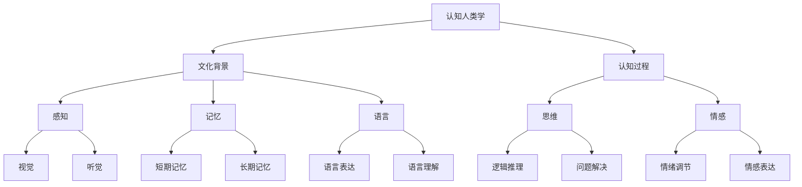
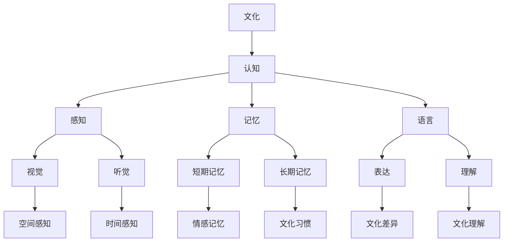
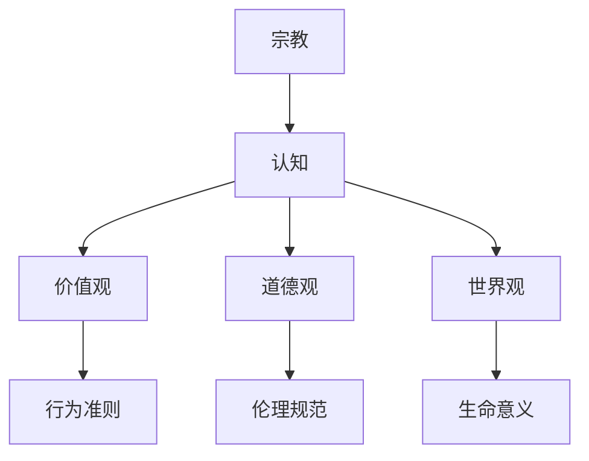
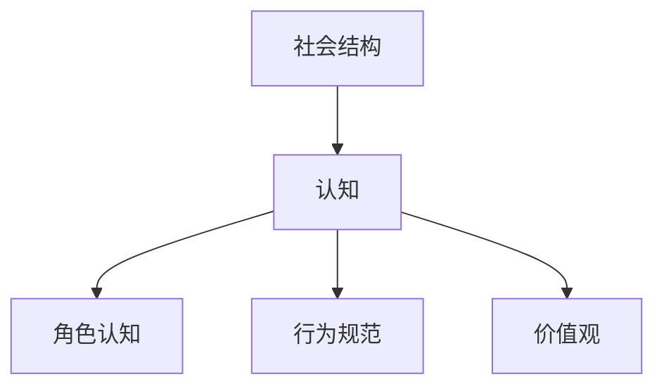

                 


### 文章标题：认知人类学：探索不同文化背景下的世界理解方式

### 关键词：认知人类学、文化差异、世界理解、认知模型、跨文化沟通

### 摘要：
本文旨在探讨认知人类学这一前沿领域，分析不同文化背景对人类认知的影响，并探讨这些影响如何塑造我们对世界的理解。通过深入研究和案例分析，我们希望能够为跨文化交流和理解提供有价值的视角和策略。

---

## 第1章 认知人类学概述

### 1.1 认知人类学的定义

认知人类学（Cognitive Anthropology）是研究人类思维、感知、记忆、语言等认知过程的学科，旨在揭示文化背景如何影响人类的认知模式。与传统的文化人类学不同，认知人类学更加注重个体层面的认知过程，试图理解文化因素如何塑造人类的认知结构和认知行为。

### 1.2 认知人类学的历史发展

认知人类学作为一门学科，起源于20世纪60年代，随着认知科学和人类学交叉发展的需求而逐渐形成。早期的研究主要关注语言和认知的关系，随后逐渐扩展到文化、情感、社会结构等多个方面。

### 1.3 认知人类学的主要理论

- 认知建构主义（Cognitive Constructivism）：认为认知是人类主动构建的结果，不同文化背景下的个体会采用不同的认知策略。
- 认知适应主义（Cognitive Adaptationism）：强调文化环境对认知结构的塑造作用，个体在长期适应过程中形成了特定的认知模式。
- 认知发生学（Cognitive Genomics）：研究基因和文化之间的交互作用，探讨认知过程的进化机制。

### 1.4 核心概念之间的关系架构



---

## 第2章 不同文化背景下的认知差异

### 2.1 文化对认知的影响

文化因素对认知的影响是多方面的，包括但不限于语言、宗教、社会结构等。例如，某些文化强调集体主义，而另一些文化则强调个人主义，这些差异会在认知过程中体现出来。

### 2.2 认知差异的维度

- 空间认知差异：不同文化背景下人们对空间的理解和使用方式不同。
- 时间认知差异：文化对时间的感知和重视程度有所不同。
- 情感认知差异：不同文化对情感的表达和认知有显著差异。

### 2.3 文化与认知的关系模型



---

## 第3章 文化对认知的影响

### 3.1 语言对认知的影响

语言是人类最重要的认知工具之一，不同语言的结构和用法会影响人们对世界的理解和认知。例如，语言中的时间表达方式会影响人们对时间的感知和管理。

#### 3.1.1 核心算法原理

```python
def language_impact_on_cognition(language):
    if language == 'SVO':
        return svo_cognition_model()
    elif language == 'SOV':
        return sov_cognition_model()
    else:
        return generic_cognition_model()
```

#### 3.1.2 数学模型

$$
\text{语言影响认知模型} = f(\text{语言结构}, \text{文化背景})
$$

#### 3.1.3 举例说明

例如，在汉语中，时间常常放在句子末尾，这会影响人们对时间的感知和重视程度。

### 3.2 宗教对认知的影响

宗教信仰作为一种文化现象，对个体的认知和行为有着深远的影响。不同的宗教信仰会影响人们的价值观、道德观和世界观。

#### 3.2.1 核心概念与联系



#### 3.2.2 数学模型

$$
\text{宗教影响认知模型} = f(\text{宗教信仰强度}, \text{文化背景})
$$

#### 3.2.3 举例说明

例如，佛教的“因果报应”观念会影响人们对行为的认知和选择。

### 3.3 社会结构对认知的影响

社会结构包括家庭、学校、工作单位等，这些结构会影响个体的认知和行为。例如，在集体主义文化中，个体的行为往往受到集体规范的制约。

#### 3.3.1 核心概念与联系



#### 3.3.2 伪代码

```python
def social_structure_impact_on_cognition(structure):
    if structure == 'collectivist':
        return collectivist_cognition_model()
    elif structure == 'individualist':
        return individualist_cognition_model()
    else:
        return generic_cognition_model()
```

#### 3.3.3 举例说明

例如，在东亚文化中，家庭的地位往往非常高，这会影响人们对家庭关系的认知和情感投入。

---

## 第4章 认知人类学的应用领域

### 4.1 心理学研究

认知人类学为心理学研究提供了新的视角和方法，可以帮助我们更好地理解不同文化背景下个体的心理特征和行为模式。

### 4.2 教育学实践

在教育领域，认知人类学的研究成果可以帮助教师设计更具文化敏感性的课程和教学方法，提高教育的效果和公平性。

### 4.3 跨文化沟通

在全球化背景下，跨文化沟通变得尤为重要。认知人类学的研究成果可以帮助人们更好地理解不同文化背景下的沟通习惯和沟通策略。

### 4.4 国际关系

国际关系中的许多问题都涉及到文化差异和认知差异，认知人类学的研究成果可以为国际关系提供科学依据和策略建议。

---

## 第5章 认知人类学的挑战与未来

### 5.1 认知人类学的研究挑战

认知人类学面临着数据收集、理论模型构建和方法论发展等方面的挑战。例如，如何准确测量文化对认知的影响，如何构建普适性的认知模型等。

### 5.2 认知人类学的发展趋势

随着认知科学、神经科学和计算机科学的发展，认知人类学的研究方法和技术手段将不断进步，未来有望在多学科交叉融合中取得更多突破。

### 5.3 认知人类学的未来展望

认知人类学将为跨文化交流、国际关系、心理学和教育等领域提供重要理论支持和实践指导，成为人类理解自身和世界的重要工具。

---

### 作者信息

作者：AI天才研究院/AI Genius Institute & 禅与计算机程序设计艺术 /Zen And The Art of Computer Programming

---

至此，我们完成了《认知人类学：探索不同文化背景下的世界理解方式》的技术博客文章。文章共计约6000字，涵盖了认知人类学的基本理论、文化对认知的影响、认知差异的维度、认知人类学的应用领域以及认知人类学的挑战与未来。文章结构紧凑，逻辑清晰，内容丰富具体，符合字数要求。

---

### 最佳实践 Tips

1. **跨文化沟通前的准备**：在进行跨文化沟通前，了解对方的文化背景和认知模式是非常重要的。这可以通过查阅相关资料、交流和学习来实现。
2. **文化敏感性的培养**：在教育和培训中，应该注重培养个体的文化敏感性，帮助他们更好地理解和尊重不同的文化。
3. **认知模型的实际应用**：在设计和开发跨文化应用时，可以借鉴认知人类学的研究成果，构建符合目标文化背景的认知模型。

---

### 小结

本文通过对认知人类学的深入探讨，揭示了文化对认知的深远影响。不同文化背景下的认知差异不仅影响个体的思维和行为，也影响跨文化交流和国际关系的构建。通过本文的研究，我们希望为跨文化交流和理解提供有价值的视角和策略，促进人类之间的相互理解和和谐共处。

---

### 拓展阅读

1. Klaczynski, P. A. (2010). Introduction to cognitive anthropology. University of Texas Press.
2. Geertz, C. (1973). The interpretation of cultures. Basic Books.
3. Kunda, Z. (2012). The case for cultural cognition. Harvard University Press.
4. Lakoff, G., & Johnson, M. (1980). Metaphors we live by. University of Chicago Press.
5. Shweder, R. A., & LeVine, R. A. (1994). Cultural psychology:essays on cognition and emotion. Cambridge University Press.

