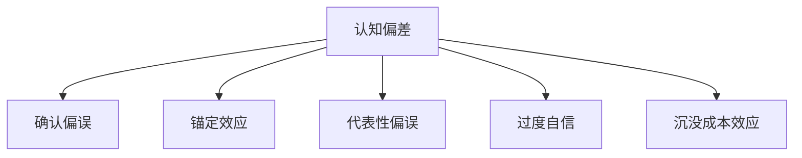

                 


### 文章标题：认知偏差如何影响我们理解世界

在人类漫长的历史长河中，我们不断探索世界，试图理解其运行规律。然而，我们的认知系统并非完美，受限于各种认知偏差，这些偏差影响了我们对世界的理解和判断。本文将深入探讨认知偏差的概念、类型、来源、影响以及应对策略，旨在帮助读者认识到认知偏差的存在，提高自身的认知能力，更好地理解世界。

### 关键词：
- 认知偏差
- 理解世界
- 认知心理学
- 决策错误
- 应对策略

### 摘要：
本文首先介绍了认知偏差的基本概念，随后详细分类并分析了常见的认知偏差类型。接着，探讨了认知偏差的来源，包括生理、心理、文化和社会等因素。随后，文章重点讨论了认知偏差对个人和群体决策的影响，并借助数学模型和伪代码进行了详细阐述。最后，文章提出了应对认知偏差的策略，包括识别与纠正认知偏差、提高决策质量的方法，以及教育和培训的作用。通过本文的阅读，读者可以更好地认识认知偏差，提高自身的认知能力，从而更准确地理解世界。

### Step 1: 引言

#### 1.1 认知偏差的概念

认知偏差（Cognitive Bias）是指人们在信息处理过程中，由于认知系统的局限性，导致判断和决策产生偏差的一种现象。这些偏差可以表现为对信息的过度依赖、简化处理、选择性记忆等，从而影响人们对现实世界的理解和判断。认知偏差是普遍存在的，不仅在日常生活中，还在决策、判断和推理中起到关键作用。

#### 1.2 认知偏差的重要性

认知偏差之所以重要，是因为它直接影响我们的决策和行为。在商业、医疗、法律等领域，认知偏差可能导致错误的决策，从而带来巨大的损失。例如，在投资领域，投资者可能因为过度自信、锚定效应等认知偏差而做出错误的决策，导致损失。在医疗领域，医生可能因为确认偏误而忽略其他诊断可能性，从而影响患者的治疗。因此，了解认知偏差，有助于我们更好地认识自身和他人的认知局限性，提高决策质量和生活质量。

#### 1.3 本书结构和目标

本文将分为三个部分。第一部分介绍认知偏差的基本原理，包括认知偏差的类型、来源和影响。第二部分探讨认知偏差在不同领域的应用，如心理学、社会学和管理学。第三部分提出应对认知偏差的策略，包括识别与纠正认知偏差、提高决策质量的方法以及教育和培训的作用。通过本文的阅读，读者可以全面了解认知偏差，提高自身的认知能力，更好地理解世界。

### Step 2: 认知偏差的类型

#### 2.1 常见的认知偏差类型

认知偏差种类繁多，下面列举几种常见的认知偏差类型：

1. **确认偏误（Confirmation Bias）**：
   确认偏误是指人们倾向于寻找、解释和记住那些符合自己已有观点的信息，而忽视或忘记那些与自己观点相矛盾的信息。这种偏差可能导致人们陷入自我肯定的循环，难以接受新的观点或证据。

2. **锚定效应（Anchoring Effect）**：
   锚定效应是指人们在做出判断或决策时，会受到先入为主的信息（锚点）的影响，从而做出非理性决策。例如，在购买商品时，先看到的标价可能影响我们对商品价值的判断。

3. **代表性偏误（Representativeness Bias）**：
   代表性偏误是指人们在做判断时，过分关注事物的表面特征，而忽视概率和统计规律。例如，在评估一个人的能力时，人们可能更关注其长相或外貌特征，而忽视其内在能力和素质。

4. **过度自信（Overconfidence）**：
   过度自信是指人们高估自己的知识和能力，从而做出过于乐观的判断。这种偏差可能导致人们忽视风险，从而导致决策失误。

5. **沉没成本效应（Sunk Cost Fallacy）**：
   沉没成本效应是指人们在做出决策时，受到已经投入的成本的影响，从而继续维持错误的投资或项目。这种偏差可能导致人们难以放弃失败的决策，从而造成更大的损失。

#### 2.2 认知偏差的 Mermaid 流程图



### Step 3: 认知偏差的来源

#### 3.1 生理和心理因素

认知偏差的产生与我们的生理和心理因素密切相关。以下是一些主要的影响因素：

1. **神经可塑性**：
   神经可塑性是指大脑神经元在结构和功能上的可塑性。认知偏差可能源于大脑神经网络的适应性变化，使得人们更容易受到某些信息的干扰。

2. **注意力**：
   注意力是指人们集中精力关注某个目标信息的能力。认知偏差可能源于注意力的选择性，使得人们更容易关注某些特定的信息，而忽略其他信息。

3. **记忆**：
   记忆是指人们将信息存储和提取的能力。认知偏差可能源于记忆的选择性，使得人们更容易记住某些特定的信息，而忘记其他信息。

4. **情绪**：
   情绪是指人们内心的感受和反应。认知偏差可能受到情绪的影响，使得人们在做决策时更容易受到情绪的影响。

#### 3.2 文化和社会因素

认知偏差的产生也与我们的文化和社会背景密切相关。以下是一些主要的影响因素：

1. **文化背景**：
   不同文化背景下的人们可能有不同的认知偏差。例如，一些文化可能强调集体主义，导致人们在决策时更倾向于考虑他人的意见，而忽视个人的观点。

2. **社会环境**：
   社会环境可能影响人们的认知偏差。例如，在一个竞争激烈的社会环境中，人们可能更容易出现过度自信的偏差。

3. **社会规范**：
   社会规范可能影响人们的认知偏差。例如，一些社会规范可能鼓励人们遵循群体决策，从而导致人们更容易受到群体思维的影响。

#### 3.3 环境因素

认知偏差的产生还受到环境因素的影响。以下是一些主要的影响因素：

1. **信息质量**：
   信息质量可能影响人们的认知偏差。高质量的信息可能帮助人们更准确地理解世界，从而减少认知偏差。

2. **信息传播**：
   信息传播方式可能影响人们的认知偏差。例如，通过社交媒体传播的信息可能更容易引发群体思维和从众行为。

3. **决策压力**：
   决策压力可能影响人们的认知偏差。在决策压力下，人们可能更容易出现过度自信和确认偏误等偏差。

#### 3.4 伪代码示例

```python
def cognitive_bias_source():
    # 生理和心理因素
    neural_plasticity = True
    attention = "selective"
    memory = "selective"
    emotion = "influence"

    # 文化和社会因素
    culture_background = "different"
    social_environment = "competitive"
    social_nor

