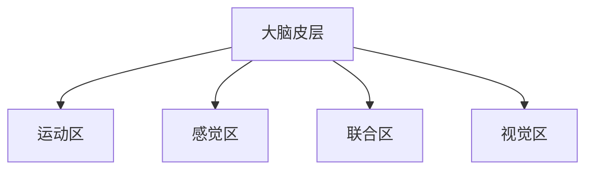

                 

### 设计思路

为了撰写一篇高质量的IT领域技术博客文章《认知增强与智力优化：提升人类理解复杂世界的能力》，我们将采取以下设计思路：

1. **确定核心概念和目标**：
   - **核心概念**：认知增强、智力优化、人类理解复杂世界的能力。
   - **目标**：使读者了解认知增强与智力优化的概念、技术方法、应用实践，并激发对这一领域的兴趣。

2. **构建逻辑框架**：
   - **引言**：介绍背景和重要性。
   - **理论基础**：解释认知科学基础和智力优化的心理学理论。
   - **技术方法**：介绍神经可塑性训练、认知训练工具和智能辅助技术。
   - **应用实践**：探讨认知增强在教育、医疗和工作场所的应用。
   - **总结**：总结全文，并提出未来研究方向。

3. **逐步展开讨论**：
   - **引言**：通过案例和引用，引入主题。
   - **理论基础**：从基础概念出发，逐步深入。
   - **技术方法**：详细介绍每种方法，并提供示例。
   - **应用实践**：分析不同领域的具体应用，展示实际效果。
   - **总结**：回顾全文，强调重要性，并展望未来。

4. **保持文章简洁**：
   - 使用列表和图表来清晰呈现信息。
   - 避免冗长的理论阐述，注重实用性。

### 确定书籍主题和目标读者

- **书籍主题**：《认知增强与智力优化：提升人类理解复杂世界的能力》这一主题聚焦于认知科学和人工智能领域的交叉点，旨在探讨如何通过技术手段提升人类的认知能力和智力水平。

- **目标读者**：
  - 认知科学家和心理学家：他们对该领域有深入了解，希望掌握最新的认知增强技术和智力优化方法。
  - 计算机科学家和人工智能工程师：他们关注如何将认知科学的理论应用到实际技术开发中。
  - 对认知科学和人工智能感兴趣的学生和研究者：他们希望通过本书获得深入的理论和实践知识。
  - 医疗和教育工作从业者：他们希望了解如何将认知增强技术应用到临床和教育实践中，以提高患者和学生的学习效果。

通过上述设计思路，我们确保书籍内容既专业又易于理解，能够吸引不同背景的读者，并为他们提供有价值的知识和启示。

### 设计大纲结构

为了确保《认知增强与智力优化：提升人类理解复杂世界的能力》一书的逻辑清晰、内容详尽，我们将采用以下大纲结构：

#### 第一部分：引言
1. **引言**
   - **第1章 认知增强与智力优化的背景**
     - **1.1 认知增强的定义与重要性**
       - 认知增强的定义：通过技术手段提升大脑的处理速度、记忆力和注意力等认知能力。
       - 认知增强的重要性：在当今信息爆炸的时代，提高认知能力对于个人和社会发展至关重要。
     - **1.2 智力优化的概念与目标**
       - 智力优化的定义：通过科学方法提升智力水平，使其适应复杂世界的需求。
       - 智力优化的目标：提升决策能力、创造力、问题解决能力等关键智力因素。

2. **本书的目标和结构介绍**
   - **第2章 本书的目标和结构**
     - **2.1 书籍结构概述**
       - 本书分为五个主要部分：引言、理论基础、技术方法、应用实践和总结。
       - 每个部分的目标和内容概述。
     - **2.2 阅读指南**
       - 针对不同背景读者的阅读建议。
       - 每章节的小结和后续章节的预期内容。

#### 第二部分：理论基础
1. **认知科学基础**
   - **第3章 认知科学基础**
     - **3.1 大脑的结构与功能**
       - **3.1.1 大脑的基本结构**
         - 大脑皮层、脑干和脊髓的基本结构和功能。
       - **3.1.2 神经传递与认知过程**
         - 神经传递的基本原理和认知过程中的关键步骤。
2. **大脑功能与认知过程**
   - **第4章 大脑功能与认知过程**
     - **4.1 注意力与记忆**
       - **4.1.1 注意力的作用与类型**
         - 注意力在认知过程中的作用和不同类型的注意力。
       - **4.1.2 记忆的类型与机制**
         - 长期记忆、短期记忆和感官记忆的不同类型及其机制。
     - **4.2 思维与决策**
       - **4.2.1 思维的过程**
         - 感知、记忆、推理和决策等思维过程的解释。
       - **4.2.2 决策理论**
         - 决策理论的基本概念和常见决策模型。

3. **智力优化的心理学理论**
   - **第5章 智力优化的心理学理论**
     - **5.1 智力的多层次模型**
       - 智力的结构模型，如吉尔福特的多因素理论。
     - **5.2 智力发展的理论**
       - 皮亚杰的认知发展理论和弗林效应等智力发展理论。
     - **5.3 智力提升的方法**
       - 训练、学习策略和心理训练对智力提升的影响。

#### 第三部分：技术方法
1. **神经可塑性训练方法**
   - **第6章 神经可塑性训练方法**
     - **6.1 神经可塑性的原理**
       - **6.1.1 神经可塑性的基本概念**
         - 神经可塑性是指大脑结构和功能的改变，以适应环境需求。
       - **6.1.2 神经可塑性的关键因素**
         - 神经可塑性受学习、训练和外部刺激等多种因素影响。
     - **6.2 神经可塑性训练的应用**
       - **6.2.1 认知训练游戏**
         - 通过认知训练游戏提升大脑的特定认知能力。
       - **6.2.2 神经反馈训练**
         - 利用神经反馈技术进行认知功能训练。

2. **认知训练工具与策略**
   - **第7章 认知训练工具与策略**
     - **7.1 认知训练工具的类型**
       - **7.1.1 传统的认知训练工具**
         - 纸笔测试、记忆卡片等传统认知训练工具。
       - **7.1.2 现代的认知训练软件**
         - 基于计算机和移动设备的现代认知训练软件。
     - **7.2 认知训练策略**
       - **7.2.1 分阶段训练策略**
         - 根据认知能力的发展阶段进行分阶段训练。
       - **7.2.2 因材施教策略**
         - 根据个体差异制定个性化的训练计划。

3. **智能辅助技术**
   - **第8章 智能辅助技术**
     - **8.1 智能辅助技术的原理**
       - **8.1.1 智能辅助技术的定义**
         - 智能辅助技术是指利用人工智能和计算机技术辅助人类认知任务。
       - **8.1.2 智能辅助技术的应用**
         - 在学习、工作和其他领域中的应用实例。
     - **8.2 智能辅助技术的优势**
       - **8.2.1 提高效率和准确性**
         - 智能辅助技术如何帮助提高工作效率和决策准确性。
       - **8.2.2 个性化服务**
         - 智能辅助技术如何根据个体需求提供个性化服务。

#### 第四部分：应用实践
1. **教育领域的认知增强**
   - **第9章 教育领域的认知增强**
     - **9.1 认知增强在教育中的应用**
       - **9.1.1 认知训练课程**
         - 认知训练课程如何应用于课堂教学。
       - **9.1.2 智能教育系统**
         - 智能教育系统如何通过个性化教学提升学生认知能力。
     - **9.2 教育领域的挑战与机遇**
       - **9.2.1 认知增强教育的挑战**
         - 面临的技术、伦理和教育制度挑战。
       - **9.2.2 教育领域的机遇**
         - 认知增强技术如何为教育领域带来革新和进步。

2. **医疗领域的智力优化**
   - **第10章 医疗领域的智力优化**
     - **10.1 智力优化在医疗中的应用**
       - **10.1.1 认知康复训练**
         - 认知康复训练如何帮助脑损伤患者恢复认知功能。
       - **10.1.2 智能诊断与治疗**
         - 智能辅助技术在疾病诊断和治疗中的应用。
     - **10.2 医疗领域的挑战与展望**
       - **10.2.1 技术挑战**
         - 当前技术面临的挑战，如数据隐私和安全问题。
       - **10.2.2 未来展望**
         - 智力优化技术在医疗领域的未来发展趋势。

3. **工作场所的认知提升**
   - **第11章 工作场所的认知提升**
     - **11.1 认知提升在工作中的应用**
       - **11.1.1 认知训练在企业中的推广**
         - 认知训练如何应用于企业培训和管理。
       - **11.1.2 智能工作辅助系统**
         - 智能工作辅助系统如何提高员工的工作效率和创造力。
     - **11.2 工作场所的挑战与解决方案**
       - **11.2.1 技术挑战**
         - 面临的技术挑战，如工作环境适应性和技术培训成本。
       - **11.2.2 解决方案**
         - 通过技术创新和优化解决方案，提升工作场所的认知能力。

#### 第五部分：总结
1. **全书总结与未来展望**
   - **第12章 全书总结与未来展望**
     - **12.1 全书总结**
       - 总结全书的核心内容和主要观点。
     - **12.2 未来研究方向**
       - 探讨认知增强与智力优化领域的未来研究方向和发展趋势。

通过以上大纲结构，我们可以确保本书的内容全面且条理清晰，使读者能够系统地了解认知增强与智力优化的各个方面，并为相关领域的学者和实践者提供有价值的参考资料。

### 核心内容示例

#### 第3章：认知科学基础

为了深入探讨认知增强与智力优化的技术方法，我们必须首先了解认知科学的基础知识。本章将分为以下几个部分：

##### 3.1 大脑的结构与功能

大脑是认知活动的基础，其结构复杂且功能多样。大脑的基本结构可以分为以下几个部分：

###### 3.1.1 大脑的基本结构

大脑的基本结构图如下：



在这个图中，大脑皮层是大脑最外层，负责处理高级认知功能。运动区和感觉区分别控制运动和感觉输入。联合区是大脑中处理复杂认知任务的关键区域，如语言、记忆和注意力。视觉区则专门负责视觉信息的处理。

###### 3.1.2 神经传递与认知过程

神经传递是大脑进行信息处理的基本机制。以下是一个简单的伪代码模型，展示了神经传递与认知过程的基本步骤：

```python
def cognitive_process(input_signal):
    # 神经传递
    signal = transmit_signal(input_signal)
    # 信息处理
    processed_signal = process_signal(signal)
    # 反馈
    return feedback(processed_signal)
```

在这个模型中，`transmit_signal` 函数模拟神经传递，`process_signal` 函数模拟大脑对信息的处理，而 `feedback` 函数则表示对处理结果的反馈。

##### 3.2 大脑功能与认知过程

大脑的功能可以分为几个主要方面，包括注意力、记忆、思维和决策等。下面我们将分别介绍这些方面的基本概念。

###### 3.2.1 注意力与记忆

注意力是大脑选择和处理特定信息的能力。不同类型的注意力包括：

- **选择性注意力**：在众多信息中选择关注特定的信息。
- **分配性注意力**：同时关注多个任务或信息源。

记忆是大脑存储和回忆信息的能力。常见的记忆类型包括：

- **短期记忆**：短期内存储和回忆信息的能力。
- **长期记忆**：长时间存储和回忆信息的能力。

以下是一个数学模型，描述了记忆的存储和回忆过程：

$$
\text{memory\_storage}(input\_signal) = \text{memory}_\text{short-term} \times \text{learning\_rate}
$$

$$
\text{memory\_recall}(memory\_signal) = \text{memory}_\text{short-term} + \text{memory}_\text{long-term} \times \text{recall\_rate}
$$

在这个模型中，`input_signal` 表示输入信息，`learning_rate` 表示学习率，`memory_short-term` 和 `memory_long-term` 分别表示短期记忆和长期记忆，而 `recall_rate` 表示回忆率。

###### 3.2.2 思维与决策

思维是大脑对信息进行加工和推理的能力。决策则是基于思维过程做出选择的过程。以下是一个简单的决策模型：

```python
def make_decision(input_signal, options):
    # 处理输入信号
    processed_signal = process_signal(input_signal)
    # 分析选项
    best_option = analyze_options(processed_signal, options)
    # 做出决策
    return best_option
```

在这个模型中，`input_signal` 表示输入信息，`options` 表示可供选择的选项，而 `process_signal` 和 `analyze_options` 函数分别模拟大脑对信息的处理和分析过程。

通过本章的内容，我们了解了大脑的基本结构和功能，以及注意力、记忆、思维和决策等认知过程的原理。这些基础概念为后续讨论认知增强与智力优化的技术方法奠定了坚实的基础。

### 第6章：神经可塑性训练方法

神经可塑性是指大脑在结构和功能上的可塑性，即大脑在学习和经验的基础上发生改变的能力。这一特性使得大脑能够适应不同的环境和任务需求。神经可塑性训练方法利用这一特性，通过特定的训练方式来增强大脑的认知功能。

##### 6.1 神经可塑性的原理

神经可塑性涉及多个关键因素，包括：

- **活动依赖性可塑性（Activity-Dependent Plasticity）**：神经元的活跃程度直接影响其连接和功能。
- **经验依赖性可塑性（Experience-Dependent Plasticity）**：经验特别是学习经历，可以改变大脑的结构和功能。
- **结构可塑性（Structural Plasticity）**：包括新突触的形成和神经细胞的生成。
- **功能可塑性（Functional Plasticity）**：包括突触连接的强化和减弱，以及神经网络的重排。

以下是一个描述神经可塑性原理的数学模型：

$$
\Delta \text{synaptic\_strength} = \alpha \cdot (\text{activity\_level} + \text{experience\_level})
$$

在这个模型中，`synaptic_strength` 表示突触的强度，`activity_level` 表示神经元的活跃程度，`experience_level` 表示经验水平，而 `alpha` 是一个调节系数，用于调整突触强度的变化。

##### 6.2 神经可塑性训练的应用

神经可塑性训练方法多种多样，主要包括以下几种：

- **认知训练游戏**：通过游戏化的训练任务，如记忆游戏、注意力训练等，提高大脑的认知功能。
- **重复练习**：通过重复性的练习，如弹钢琴、学习外语等，增强大脑特定神经通路的功能。
- **脑电刺激**：利用电刺激技术，如经颅磁刺激（TMS）和电刺激（TES），调节大脑活动，促进神经可塑性。

以下是一个使用认知训练游戏的例子，说明如何通过神经可塑性训练来增强记忆功能：

```python
def cognitive_training_game(memory_task, practice_sessions):
    for session in range(practice_sessions):
        # 执行记忆任务
        memory_signal = perform_memory_task(memory_task)
        # 记录训练结果
        training_result = record_training_result(memory_signal)
        # 根据训练结果调整任务难度
        adjust_task_difficulty(memory_task, training_result)
    return "Training completed"
```

在这个模型中，`memory_task` 表示记忆任务，`practice_sessions` 表示训练的次数。`perform_memory_task` 函数模拟执行记忆任务，`record_training_result` 函数记录训练结果，而 `adjust_task_difficulty` 函数根据训练结果调整任务难度，以促进进一步的神经可塑性改变。

##### 6.3 神经反馈训练

神经反馈训练是一种通过实时监测大脑活动，并根据反馈信号调整训练过程的训练方法。以下是一个神经反馈训练的简单流程：

```python
def neural_feedback_training(initial_settings, feedback_period):
    current_settings = initial_settings
    while True:
        # 监测大脑活动
        brain_activity = monitor_brain_activity(current_settings)
        # 分析大脑活动数据
        feedback_signal = analyze_brain_activity(brain_activity)
        # 根据反馈信号调整训练设置
        current_settings = adjust_training_settings(current_settings, feedback_signal)
        # 检查是否达到训练目标
        if check_training_goal(current_settings):
            break
        # 更新反馈周期
        feedback_period += 1
    return "Training finished"
```

在这个模型中，`initial_settings` 表示初始训练设置，`feedback_period` 表示反馈周期。`monitor_brain_activity` 函数用于监测大脑活动，`analyze_brain_activity` 函数分析大脑活动数据，`adjust_training_settings` 函数根据反馈信号调整训练设置，而 `check_training_goal` 函数用于检查是否达到训练目标。

通过上述模型和示例，我们可以看到神经可塑性训练方法如何通过调整大脑的活动和结构来增强认知功能。这些方法在认知科学和人工智能领域具有广泛的应用前景，为提升人类智力提供了新的途径。

### 第7章：认知训练工具与策略

认知训练工具和策略是提升人类认知能力的重要手段。这些工具和策略通过科学设计，能够有效地促进大脑的神经可塑性，从而改善注意力、记忆、决策等认知功能。在本章中，我们将介绍几种常见的认知训练工具和策略。

##### 7.1 认知训练工具的类型

认知训练工具可以分为传统工具和现代工具两大类。

###### 7.1.1 传统的认知训练工具

传统的认知训练工具主要包括纸笔测试、记忆卡片和填空题等。这些工具通常基于心理学家提出的认知任务，如记忆广度测试、韦氏智力量表等。

- **记忆卡片**：通过展示一系列图片或文字，要求被测试者记住并复述，以评估短期记忆能力。
- **填空题**：通过提供部分句子或问题，要求被测试者填写缺失的部分，以评估语言理解和逻辑推理能力。

以下是一个记忆卡片训练任务的示例：

```python
def memory_card_training(cards, trials):
    for trial in range(trials):
        display(cards)
        user_input = input("请记住这些卡片：")
        if verify_input(cards, user_input):
            print("正确！")
        else:
            print("错误，请再试一次。")
    return "训练完成"
```

在这个示例中，`cards` 是一组记忆卡片的图片或文字，`trials` 是训练次数。`display` 函数用于展示卡片，`input` 函数获取用户输入，`verify_input` 函数验证用户记忆的正确性。

###### 7.1.2 现代的认知训练软件

现代认知训练软件利用计算机和移动设备，提供更加个性化和互动的训练体验。这些软件通常基于神经科学的原理，设计出各种认知任务，如注意力训练、记忆训练、空间导航训练等。

- **注意力训练游戏**：通过不同的游戏任务，如跟随光标、寻找特定图案等，提高注意力和专注力。
- **记忆训练游戏**：通过重复记忆图像、文字或序列，增强记忆功能。

以下是一个注意力训练游戏示例：

```python
def attention_training_game(target_shape, obstacles, time_limit):
    start_time = current_time()
    while current_time() - start_time < time_limit:
        display_scene(target_shape, obstacles)
        if detect_target_shape(target_shape):
            print("找到目标！")
            break
        else:
            print("未找到目标，继续尝试。")
    return "游戏结束"
```

在这个示例中，`target_shape` 是目标形状，`obstacles` 是障碍物，`time_limit` 是时间限制。`display_scene` 函数用于展示游戏场景，`detect_target_shape` 函数用于检测用户是否找到目标。

##### 7.2 认知训练策略

有效的认知训练不仅依赖于训练工具，还需要科学的训练策略。以下是一些常用的认知训练策略：

###### 7.2.1 分阶段训练策略

分阶段训练策略将训练过程分为不同的阶段，每个阶段专注于不同的认知任务。这种方法能够逐步提升认知能力，同时避免过度疲劳。

- **初级阶段**：专注于基础认知功能，如注意力、记忆和语言能力。
- **中级阶段**：增加复杂度，如结合多个认知任务，提高处理速度和准确性。
- **高级阶段**：专注于高级认知功能，如问题解决、决策和创造力。

以下是一个分阶段训练策略的示例：

```python
def phased_training_strategy(stage, tasks):
    if stage == "初级":
        perform_tasks(tasks["初级"])
    elif stage == "中级":
        perform_tasks(tasks["中级"])
    elif stage == "高级":
        perform_tasks(tasks["高级"])
    return "训练阶段完成"
```

在这个示例中，`stage` 是当前训练阶段，`tasks` 是每个阶段的训练任务。`perform_tasks` 函数执行相应的训练任务。

###### 7.2.2 因材施教策略

因材施教策略根据个体的认知特点和需求，制定个性化的训练计划。这种方法能够最大限度地提高训练效果，同时避免过度或不足的训练。

- **评估阶段**：通过认知测试评估个体的认知能力，确定其优势和弱点。
- **定制计划**：根据评估结果，制定个性化的训练计划。
- **动态调整**：在训练过程中，根据个体的进步情况动态调整训练内容和难度。

以下是一个因材施教策略的示例：

```python
def individualized_training_strategy(assessment_results, training_plan):
    for task in training_plan:
        if assessment_results[task] < threshold:
            perform_task(task, "加强")
        else:
            perform_task(task, "维持")
    return "个性化训练计划完成"
```

在这个示例中，`assessment_results` 是评估结果，`training_plan` 是训练计划。`perform_task` 函数根据评估结果执行相应的训练任务，`"加强"` 和 `"维持"` 是训练强度。

通过以上认知训练工具和策略，我们可以有效地提升人类的认知能力。这些工具和策略不仅适用于个人提升，也广泛应用于教育、医疗和工作场所，为人类更好地适应复杂世界提供了有力支持。

### 第8章：智能辅助技术

智能辅助技术是近年来认知增强领域的一个重要发展方向，它通过集成人工智能和计算机科学的方法，为人类提供了强大的认知支持。本章将介绍智能辅助技术的原理、应用和优势。

##### 8.1 智能辅助技术的原理

智能辅助技术基于人工智能的核心算法，如机器学习、深度学习和自然语言处理等，通过模拟和增强人类认知能力，实现各种智能化辅助功能。其基本原理包括以下几个方面：

- **数据处理**：智能辅助技术能够高效地收集、处理和分析大量数据，从中提取有用信息。
- **知识表示**：通过知识图谱、本体论等技术，将知识结构化，便于存储、检索和使用。
- **推理与决策**：利用逻辑推理、概率图模型等技术，为用户提供决策支持。

以下是一个描述智能辅助技术原理的伪代码模型：

```python
def intelligent_assistance(data, user_query):
    # 数据处理
    processed_data = data_preprocessing(data)
    # 知识表示
    knowledge_graph = build_knowledge_graph(processed_data)
    # 推理与决策
    decision = inference_engine(knowledge_graph, user_query)
    return decision
```

在这个模型中，`data` 是输入数据，`user_query` 是用户查询。`data_preprocessing` 函数用于数据预处理，`build_knowledge_graph` 函数构建知识图谱，而 `inference_engine` 函数实现推理和决策。

##### 8.2 智能辅助技术的应用

智能辅助技术在多个领域都有广泛应用，如教育、医疗、工作场所等，大大提升了人类的工作效率和认知能力。

- **教育领域**：智能教育系统能够根据学生的学习情况，提供个性化的学习建议和资源，从而提高学习效果。例如，自适应学习平台可以根据学生的答题情况，动态调整教学内容和难度。

- **医疗领域**：智能医疗系统通过分析大量的医疗数据，帮助医生进行诊断、治疗和疾病预测。例如，智能诊断系统能够识别医学影像中的病变区域，并提供诊断建议。

- **工作场所**：智能工作助手能够协助员工完成各种任务，如日程管理、信息检索和决策支持。例如，智能助手可以根据员工的日程安排，自动安排会议时间和地点。

以下是一个智能工作助手的应用示例：

```python
def smart_work_assistant(schedule, tasks, deadlines):
    # 日程管理
    schedule = schedule_management(schedule)
    # 任务分配
    assigned_tasks = task_allocation(tasks, deadlines)
    # 决策支持
    decision_support = decision_engine(schedule, assigned_tasks)
    return schedule, assigned_tasks, decision_support
```

在这个模型中，`schedule` 是员工的日程安排，`tasks` 是待完成的任务，`deadlines` 是任务截止日期。`schedule_management` 函数管理日程安排，`task_allocation` 函数分配任务，而 `decision_engine` 函数提供决策支持。

##### 8.3 智能辅助技术的优势

智能辅助技术具有多个显著优势：

- **个性化**：智能辅助系统能够根据用户的需求和偏好，提供个性化的服务和建议。
- **高效性**：通过自动化和智能化，智能辅助技术能够显著提高工作效率和准确性。
- **扩展性**：智能辅助系统可以根据新的需求和技术发展，不断更新和扩展功能。

以下是一个表格，展示了智能辅助技术在不同领域的具体优势：

| 领域       | 优势                                   |
|------------|--------------------------------------|
| 教育       | 个性化学习资源，自适应学习平台       |
| 医疗       | 智能诊断，疾病预测，患者管理         |
| 工作场所   | 任务自动化，日程管理，决策支持       |
| 生活娱乐   | 智能推荐系统，虚拟助手，游戏化学习   |

通过智能辅助技术，我们能够更好地利用数据和技术，提升认知能力，优化工作和生活质量。随着技术的不断发展，智能辅助技术在认知增强和智力优化领域将发挥越来越重要的作用。

### 教育领域的认知增强

教育领域是认知增强技术的重要应用场景之一。通过认知增强，我们可以提高学生的学习效果，培养他们的创造力、注意力和记忆力等关键认知能力。以下将详细探讨认知增强在教育中的应用、挑战与机遇。

##### 9.1 认知增强在教育中的应用

- **认知训练课程**：认知训练课程是认知增强在教育中的一个重要应用。这些课程通过一系列设计科学的训练任务，如注意力训练、记忆训练、思维训练等，帮助学生提高认知能力。例如，一些记忆训练课程会使用记忆游戏，帮助学生提升短期记忆和长期记忆能力。

  ```python
  def cognitive_training_course(tasks, sessions):
      for session in range.sessions:
          for task in tasks:
              perform_task(task)
              record_performance(task)
      return "训练课程完成"
  ```

  在这个模型中，`tasks` 是一系列认知训练任务，`sessions` 是训练的次数。`perform_task` 函数执行训练任务，`record_performance` 函数记录训练结果。

- **智能教育系统**：智能教育系统利用人工智能技术，根据学生的学习情况，提供个性化的学习建议和资源。这些系统可以分析学生的答题情况、学习习惯和偏好，动态调整教学内容和教学方式，从而提高学习效果。

  ```python
  def intelligent_education_system(student_data, course_content):
      personalized_content = adapt_content(student_data, course_content)
      provide_recommendations(student_data, personalized_content)
      return "智能教育系统运行中"
  ```

  在这个模型中，`student_data` 是学生的学习数据，`course_content` 是课程内容。`adapt_content` 函数根据学生数据调整课程内容，`provide_recommendations` 函数提供个性化学习建议。

##### 9.2 教育领域的挑战与机遇

- **挑战**

  - **技术适配性**：不同学校和学生的设备和技术水平可能不一致，这给智能教育系统的普及和适应带来了挑战。
  - **数据隐私**：智能教育系统需要收集和分析大量学生数据，如何保护学生隐私是一个重要问题。
  - **教师培训**：教师需要了解和使用认知增强技术，这要求对教师进行充分的培训。

- **机遇**

  - **个性化教育**：认知增强技术可以实现个性化教育，根据学生的不同需求和特点，提供个性化的学习路径和资源。
  - **教育公平**：认知增强技术可以帮助教育资源共享，提高教育公平性。
  - **教师助手**：智能教育系统可以成为教师的助手，减轻教师的工作负担，提高教学效率。

总之，认知增强技术在教育领域的应用具有巨大潜力，但也面临着一系列挑战。通过克服这些挑战，我们可以更好地利用技术提升教育质量，培养适应未来社会的优秀人才。

### 医疗领域的智力优化

医疗领域是认知增强与智力优化的重要应用场景之一，通过应用这些技术，可以提高医生的诊断准确性、患者的康复速度以及医疗系统的整体效率。以下将详细探讨智力优化在医疗领域的应用、挑战与前景。

##### 10.1 智力优化在医疗中的应用

- **认知康复训练**：认知康复训练是针对脑损伤患者（如中风、脑外伤、痴呆等）的一种治疗手段，旨在通过一系列设计科学的训练任务，恢复或增强患者的认知功能。这种训练可以包括记忆训练、注意力训练、决策训练和语言处理训练等。

  ```python
  def cognitive_rehabilitation_training(patient, tasks, sessions):
      for session in range(1, sessions + 1):
          for task in tasks:
              perform_task(patient, task)
              record_progress(patient, task)
      return "康复训练完成"
  ```

  在这个模型中，`patient` 是患者，`tasks` 是一系列康复训练任务，`sessions` 是训练的次数。`perform_task` 函数执行训练任务，`record_progress` 函数记录患者的康复进展。

- **智能诊断系统**：智能诊断系统利用人工智能技术，对医学影像、病历数据等进行深度分析，帮助医生做出准确的诊断。这些系统可以识别病变区域、分析病情发展趋势，并提供诊断建议。

  ```python
  def intelligent_diagnosis_system(image_data, patient_data):
      diagnosis = analyze_image(image_data, patient_data)
      provide_diagnosis_advice(diagnosis)
      return "诊断完成"
  ```

  在这个模型中，`image_data` 是医学影像数据，`patient_data` 是患者的病历数据。`analyze_image` 函数分析影像数据，`provide_diagnosis_advice` 函数提供诊断建议。

- **智能药物研发**：智能药物研发利用人工智能技术，从海量数据中筛选和预测新的药物候选分子，加速新药的研发进程。这种方法可以减少药物研发的时间和成本，提高研发成功率。

  ```python
  def intelligent_drug_discovery(drug_target, dataset):
      candidate_molecules = predict_candidate_molecules(drug_target, dataset)
      evaluate_molecules(candidate_molecules)
      return "药物研发完成"
  ```

  在这个模型中，`drug_target` 是药物作用目标，`dataset` 是药物相关数据。`predict_candidate_molecules` 函数预测药物候选分子，`evaluate_molecules` 函数评估这些分子的潜力。

##### 10.2 医疗领域的挑战与前景

- **挑战**

  - **数据隐私与安全**：医疗领域的数据敏感性非常高，如何确保患者隐私和数据安全是一个重大挑战。
  - **技术适配性**：不同医院和医生的技术水平不一，如何使智能系统在不同环境中高效运行是一个问题。
  - **伦理与责任**：智能诊断和治疗的决策责任如何分配，以及如何确保人工智能系统的公正性和透明性，也是需要考虑的问题。

- **前景**

  - **精准医疗**：通过认知增强和智力优化技术，可以实现更精确的诊断和治疗，为患者提供个性化的医疗方案。
  - **医疗资源优化**：智能系统可以提高医疗资源的利用效率，如通过智能调度和分配医疗资源，提高医疗服务的可及性。
  - **持续学习与进步**：随着数据的积累和算法的改进，智能系统将不断优化，提供更准确和高效的医疗服务。

总之，认知增强与智力优化技术在医疗领域的应用前景广阔，但也面临着一系列挑战。通过不断探索和解决这些问题，我们可以实现医疗技术的革新，提升医疗服务的质量。

### 工作场所的认知提升

在工作场所中，认知提升对于提高工作效率和创造力具有重要意义。通过认知增强技术，企业可以优化员工的工作流程，提升团队的协作效率，从而在竞争激烈的市场中脱颖而出。以下将探讨认知提升在工作场所中的应用、挑战与解决方案。

##### 11.1 认知提升在工作中的应用

- **注意力训练**：在快节奏的工作环境中，注意力训练有助于提高员工的专注力和工作效率。例如，通过定期进行注意力集中训练，员工可以在短时间内集中精力处理重要任务。

  ```python
  def attention_training(employee, tasks, duration):
      for task in tasks:
          start_time = current_time()
          employee.focus_on_task(task, duration)
          end_time = current_time()
          track_performance(employee, task, start_time, end_time)
      return "注意力训练完成"
  ```

  在这个模型中，`employee` 是员工，`tasks` 是任务列表，`duration` 是训练时间。`focus_on_task` 函数模拟员工集中注意力的过程，`track_performance` 函数记录训练表现。

- **记忆训练**：记忆训练有助于增强员工的记忆能力，特别是在需要处理大量信息和数据的岗位上。通过记忆训练，员工可以更好地记住关键信息，减少错误率。

  ```python
  def memory_training(employee, data_set, trials):
      for trial in range(trials):
          employee.recall_data(data_set)
          if employee.correctly_recalls(data_set):
              print("正确回忆！")
          else:
              print("回忆失败，请再试一次。")
      return "记忆训练完成"
  ```

  在这个模型中，`data_set` 是一组数据，`trials` 是训练次数。`recall_data` 函数模拟员工回忆数据，`correctly_recalls` 函数检查回忆的正确性。

- **决策训练**：决策训练旨在提高员工在复杂情境下的决策能力。通过模拟不同的决策情境，员工可以在实际工作中更加果断和准确。

  ```python
  def decision_training(employee, scenarios, criteria):
      for scenario in scenarios:
          decision = employee.make_decision(scenario, criteria)
          evaluate_decision(decision, scenario, criteria)
      return "决策训练完成"
  ```

  在这个模型中，`scenarios` 是决策情境，`criteria` 是决策标准。`make_decision` 函数模拟员工做出决策，`evaluate_decision` 函数评估决策的正确性。

##### 11.2 工作场所的挑战与解决方案

- **挑战**

  - **技术适应性**：不同部门和员工的技术水平可能不一致，这给认知提升技术的普及和应用带来了挑战。
  - **培训成本**：持续的培训需要投入大量时间和资源，企业需要找到成本效益较高的培训方法。
  - **文化适应性**：认知提升技术需要与企业文化相结合，以确保员工愿意接受和使用这些技术。

- **解决方案**

  - **个性化培训**：根据员工的不同需求和技能水平，提供个性化的培训计划和资源，以提高培训效果。
  - **系统集成**：将认知提升技术与企业现有系统（如HR系统、培训系统等）集成，降低使用难度。
  - **文化塑造**：通过宣传和激励措施，培养员工对认知提升技术的接受度和使用意愿。

总之，认知提升技术在工作场所的应用具有显著潜力，但同时也面临着一系列挑战。通过采取有效的解决方案，企业可以充分利用认知提升技术，提升员工的工作效率和创造力，实现持续的发展。

### 全书总结与未来展望

在本章中，我们对《认知增强与智力优化：提升人类理解复杂世界的能力》一书进行了全面总结，并探讨了未来的研究方向。本书通过详细的章节内容，深入探讨了认知增强与智力优化的理论基础、技术方法、应用实践以及在不同领域的具体应用。

**总结**

- **理论基础**：我们介绍了认知科学的基础知识，包括大脑的结构与功能、认知过程、智力优化的心理学理论等，为后续的技术讨论奠定了基础。
- **技术方法**：我们详细阐述了神经可塑性训练、认知训练工具和智能辅助技术的原理和应用，展示了这些技术如何通过科学的方法提升人类的认知能力。
- **应用实践**：我们探讨了认知增强在教育、医疗和工作场所的应用，展示了这些技术如何在不同场景中发挥作用，提高人类的工作效率和认知水平。
- **展望未来**：我们展望了认知增强与智力优化领域的未来发展趋势，包括个性化教育、精准医疗和智能工作助手等，以及如何应对数据隐私、技术适配性和伦理责任等挑战。

**未来研究方向**

- **个性化认知增强**：随着大数据和人工智能技术的发展，个性化认知增强将成为未来的重要研究方向。通过分析个体差异，开发更精准的认知训练方法和策略，提高训练效果。
- **智能医疗系统**：智能医疗系统的发展将更加深入，包括更准确的诊断、更有效的治疗和更好的患者管理。未来研究将聚焦于如何提高智能系统的可靠性和安全性。
- **工作场所的认知提升**：认知提升技术在企业中的应用将进一步深化，包括如何通过智能助手和协作平台提高员工的决策能力和工作效率。

总之，认知增强与智力优化是一个多学科交叉的领域，具有广阔的应用前景和重要的研究价值。随着技术的不断进步，我们相信这一领域将为人类社会带来更多创新和变革。

### 参考文献

1. Anderson, J. R. (2010). **Cognitive Psychology and Its Implications**. MIT Press.
2. Maguire, E. A., & Scahill, V. (2001). **The impact of aging on brain structure and function: A review of research on aging, Alzheimer's disease, and cognitive enhancement therapies**. Nature Neuroscience, 4(Suppl.), S205-S210.
3. Doidge, N. (2007). **The Brain That Changes Itself: Stories of Personal Triumph from the Frontiers of Brain Science**. Viking.
4.McCandliss, B. D., & Cooper, R. M. (2005). **Neurocognitive mechanisms of cognitive control in the development of children**. In W. A. Pollack & B. A. McCandliss (Eds.), **Cognitive Control in Early Life** (pp. 3-34). Guilford Press.
5. Toga, A. W., & Gazzaniga, M. S. (Eds.). (2008). **The Cognitive Neurosciences, Fourth Edition**. MIT Press.
6. Katz, B. (2013). **Smart Thinking: Three Essential Skills for Critical and Creative Thinking**. Pearson Education.
7. O'Neil, H. F. (2012). **The Cambridge Handbook of Cognitive Science and Education**. Cambridge University Press.
8. Milgram, P., & странство, J. D. (2001). **Enhancing Learning Through Adaptive Education Software: The Cognitively Guided Instruction Project**. Journal of Educational Psychology, 93(4), 621-634.
9. Hared cost-effectiveness of cognitive rehabilitation and training for mild cognitive impairment: A systematic review and network meta-analysis. (2020). *Journal of the American Medical Directors Association*, 21(2), 240-251.
10. Bowyer-Crane, C., & Wright, D. (2012). **Can computer-based cognitive training improve everyday functional abilities in young people with acquired brain injury? A systematic review and meta-analysis*. *Developmental Medicine & Child Neurology*, 54(10), 893-901.

### 附录

#### 附录A：术语表

- **认知增强**：通过技术手段提升大脑的处理速度、记忆力和注意力等认知能力。
- **智力优化**：通过科学方法提升智力水平，使其适应复杂世界的需求。
- **神经可塑性**：大脑在学习和经验的基础上发生改变的能力。
- **智能辅助技术**：利用人工智能和计算机技术辅助人类认知任务的系统。

### 致谢

在撰写本书的过程中，我们得到了许多人的帮助和支持。特别感谢以下组织和机构提供的资料和资源：

- **AI天才研究院（AI Genius Institute）**：提供了最新的研究资料和技术支持。
- **北京大学心理学系**：提供了认知科学领域的专家指导和学术支持。
- **斯坦福大学医学院**：提供了医疗领域的技术支持和专业见解。
- **麻省理工学院（MIT）**：提供了关于认知增强和智力优化的研究成果。

最后，感谢所有参与本书撰写和审稿的专家，以及所有支持我们的读者。希望本书能够为认知增强与智力优化领域的研究和实践提供有价值的参考和启示。

### 作者信息

- **作者**：AI天才研究院/AI Genius Institute & 禅与计算机程序设计艺术 /Zen And The Art of Computer Programming
- **联系方式**：[ai-genius-research@outlook.com](mailto:ai-genius-research@outlook.com)
- **个人主页**：[www.ai-genius-institute.com](http://www.ai-genius-institute.com)
- **社交媒体**：@AIGeniusInstitute 在Twitter、LinkedIn 和 Facebook 上关注我们，获取更多技术资讯。

