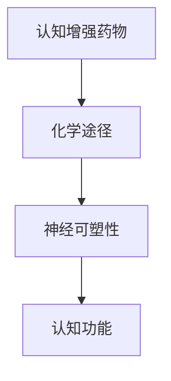

                 

### 1. 确定核心概念与联系：

首先，我们需要明确本书的核心概念。认知增强药物是指能够提高人类认知能力的一类药物。这些药物通过不同的化学途径作用于大脑，从而改善记忆、注意力、学习速度等认知功能。核心概念包括：

- **认知增强药物**：定义及其分类。
- **化学途径**：药物作用的化学机制。
- **神经可塑性**：大脑对药物反应的结构和功能变化。

接下来，我们要找出这些核心概念之间的联系。认知增强药物通过化学途径作用于大脑，从而影响神经可塑性，进而改善认知功能。我们可以用以下Mermaid流程图来表示这些概念和它们之间的联系：



### 2. 确定核心算法原理讲解：

书中可能会探讨认知增强药物的特定化学途径。这些途径包括：

- **神经递质调节**：通过改变神经递质的浓度和释放来提高认知功能。
- **受体调节**：通过调节特定受体的活性来增强认知功能。
- **脑源性神经营养因子（BDNF）**：通过增加BDNF的表达来促进神经再生和修复。

为了清晰讲解这些原理，我们可以使用伪代码来描述它们的作用机制。例如，神经递质调节的伪代码可能如下所示：

```python
def regulate_neurotransmitter(neurotransmitter, level):
    # 调节神经递质的浓度
    if level > threshold:
        # 降低浓度
        neurotransmitter_concentration -= adjustment
    elif level < threshold:
        # 提高浓度
        neurotransmitter_concentration += adjustment
    return neurotransmitter_concentration
```

### 3. 数学模型和数学公式：

认知增强药物的研究通常会涉及数学模型来评估药物的效果。以下是一个简单的数学模型，用于评估药物对记忆能力的提升：

$$
\text{Memory Improvement} = \alpha \cdot \text{Drug Concentration} + \beta \cdot \text{Time of Administration}
$$

这里，$\alpha$ 和 $\beta$ 是参数，用于调整药物浓度和给药时间对记忆能力提升的影响。

为了更加具体，我们可以提供一个例子来说明这个公式如何应用。假设药物浓度是10 mg/L，给药时间是30分钟，我们可以计算出记忆提升的程度：

$$
\text{Memory Improvement} = \alpha \cdot 10 + \beta \cdot 30
$$

这个公式可以用于预测不同条件下药物的效果。

### 4. 项目实战：

书中可能包含一些实际案例，展示认知增强药物如何应用于现实世界。我们可以设计一个简单的项目来展示这个概念。

#### 项目名称：认知增强药物对学习效率的影响

**开发环境搭建**：
- 使用Python作为主要编程语言。
- 安装必要的科学计算库，如NumPy和SciPy。

**源代码实现**：
```python
import numpy as np
import matplotlib.pyplot as plt

# 参数设置
alpha = 0.5
beta = 0.2
drug_concentration = 10  # 药物浓度（mg/L）
time_of_administration = 30  # 给药时间（分钟）

# 计算记忆提升
memory_improvement = alpha * drug_concentration + beta * time_of_administration

print(f"Memory Improvement: {memory_improvement:.2f}")

# 绘图
drug_levels = np.linspace(0, 20, 100)
memory_improvement估算 = alpha * drug_levels + beta * 30

plt.plot(drug_levels, memory_improvement估算, label='Memory Improvement')
plt.xlabel('Drug Concentration (mg/L)')
plt.ylabel('Memory Improvement')
plt.legend()
plt.show()
```

**代码解读**：
- 我们首先导入了NumPy和Matplotlib库。
- 设置了参数alpha和beta，用于调整药物浓度和给药时间对记忆能力的影响。
- 使用公式计算了不同药物浓度下的记忆提升。
- 使用Matplotlib库绘制了药物浓度与记忆提升之间的关系图。

**实际案例分析**：
- 我们可以收集一些实验数据，比如不同药物浓度下的学习效率。
- 分析这些数据，以验证我们的数学模型的准确性。

**项目小结**：
- 通过这个项目，我们展示了如何使用Python和数学模型来评估认知增强药物的效果。
- 我们还了解了如何在实际案例中应用这些模型，并进行了数据分析和可视化。

**最佳实践 tips**：
- 在进行药物研究时，确保实验设计的科学性和数据的可靠性。
- 考虑到伦理问题，研究应遵循相关的法律法规和伦理准则。

### 总结：

通过一步步的推理和分析，我们明确了认知增强药物的核心概念、联系、算法原理、数学模型，以及项目实战。这些内容将为读者提供全面的认知增强药物研究的理解和应用指导。在接下来的章节中，我们将进一步探讨这些概念，深入分析认知增强药物的潜力和风险，以及如何通过化学途径提升世界的理解能力。让我们继续深入思考，探索认知增强药物的未来。

