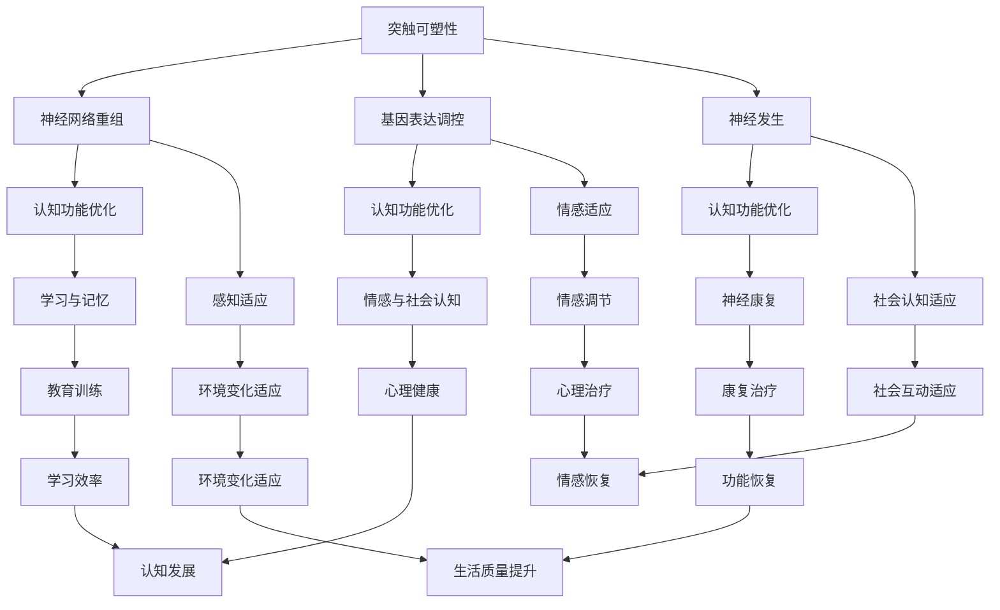

                 

### 文章标题

《认知神经可塑性：大脑如何适应并理解变化的世界》

### 关键词

认知神经可塑性、大脑适应、神经可塑性机制、学习与记忆、情感与社会认知、教育与培训、心理健康、神经康复、前沿技术进展、伦理与法律

### 摘要

《认知神经可塑性：大脑如何适应并理解变化的世界》是一本深入探讨大脑如何通过认知神经可塑性机制适应外界变化的专著。书中详细阐述了认知神经可塑性的基本概念、核心原理及其在大脑适应与调整过程中的作用。通过实际应用案例，如教育与培训、心理健康和神经康复，展示了认知神经可塑性的广泛影响和潜在应用价值。此外，书中还探讨了前沿技术进展、伦理与法律等方面的问题，为未来研究和应用提供了方向和建议。

---

# 认知神经可塑性：大脑如何适应并理解变化的世界

## 引言

认知神经可塑性是近年来神经科学领域的一个重要概念，它揭示了大脑如何通过不断的调整和优化来适应外界环境的变化。在人类的生活中，变化是不可避免的，无论是环境、社会还是心理层面，我们都需要具备适应这些变化的能力。而认知神经可塑性，正是大脑实现这一目标的关键机制。

认知神经可塑性指的是大脑在经历学习、训练、损伤或其他外界刺激后，结构和功能发生变化的能力。这种能力不仅包括大脑网络的重组，还涉及到神经元之间的连接强度和活动模式的改变。简而言之，认知神经可塑性是大脑适应变化、提高功能效率的重要途径。

本文将分四个部分对认知神经可塑性进行详细探讨。首先，我们将介绍认知神经可塑性的基本概念和核心原理，并借助Mermaid流程图展示其内在机制。接着，我们将深入探讨大脑适应与调整的机制，包括学习与记忆、感知与注意力、情感与社会认知等方面。随后，我们将探讨认知神经可塑性的实际应用，如教育与培训、心理健康和神经康复等。最后，我们将探讨认知神经可塑性的前沿技术进展、伦理与法律问题，并展望未来的研究方向。

通过本文的阅读，读者将全面了解认知神经可塑性的基本概念、作用机制及其在现实世界中的应用，为大脑的适应与优化提供新的视角和方法。

### 第1部分：认知神经可塑性的基本概念

#### 定义与历史

认知神经可塑性（Cognitive Neuroplasticity）是近年来神经科学领域的一个热点概念，它描述了大脑在经历各种内外部刺激后，其结构和功能发生适应性变化的过程。这种变化不仅包括神经元数量的增减，还包括神经元之间突触连接的加强或减弱，以及神经网络结构的重组。

在历史上，神经可塑性最早可以追溯到20世纪初。当时，科学家发现动物在经历学习或训练后，大脑的结构和功能会发生变化。随着神经科学的发展，研究者们逐渐认识到，神经可塑性不仅仅是一个简单的学习过程，而是一种复杂的、动态的适应机制。20世纪80年代，神经可塑性的研究进入了认知神经科学的范畴，研究者们开始探讨神经可塑性在认知功能中的具体作用。

认知神经可塑性与其他概念有着紧密的联系。首先，它与神经可塑性（Neuroplasticity）密切相关。神经可塑性是一个更为广泛的概念，它包括了所有的神经适应过程，而认知神经可塑性则侧重于与认知功能相关的神经适应。此外，认知神经可塑性还与学习（Learning）和记忆（Memory）有着密切的关系。学习是通过反复的刺激和反应，在大脑中形成新的神经连接和活动模式的过程；记忆则是将这些新的连接和活动模式存储在长期记忆中，并在需要时进行调用。认知神经可塑性是学习与记忆的基础。

#### 核心原理与架构

认知神经可塑性的核心原理可以分为以下几个方面：

1. **突触可塑性（Synaptic Plasticity）**：突触是神经元之间传递信息的结构，突触可塑性是指突触连接的强度可以发生变化。这种变化可以是突触的加强（长时程增强，LTP）或减弱（长时程抑制，LTD）。突触可塑性是认知神经可塑性的基础。

2. **神经网络重组（Neural Network Reorganization）**：在大脑受到损伤或刺激后，神经网络的结构会发生变化，以适应新的环境和需求。这种重组可以发生在不同的脑区之间，也可以发生在同一脑区内部。

3. **基因表达调控（Gene Expression Regulation）**：认知神经可塑性涉及到基因表达的变化，某些基因的表达水平会在学习和记忆过程中发生变化，从而影响神经元的结构和功能。

4. **神经发生（Neurogenesis）**：神经发生是指新的神经元在大脑中的生成。在成人大脑中，海马体区域仍然具有神经发生的能力，这对于学习、记忆和认知功能具有重要意义。

认知神经可塑性的架构可以从以下几个层次来理解：

1. **细胞层次**：突触连接的强度变化和神经元的活性变化是认知神经可塑性的基础。

2. **网络层次**：神经网络的结构重组和功能变化是认知神经可塑性在更高层次上的表现。

3. **系统层次**：整个大脑的适应性变化，包括大脑区域的重新分配和功能优化，是认知神经可塑性的最终结果。

#### Mermaid流程图

为了更好地展示认知神经可塑性的机制，我们可以使用Mermaid流程图来表示其核心原理和过程：



通过这个流程图，我们可以看到认知神经可塑性是如何在不同层次上发挥作用，从而帮助大脑适应各种变化。

### 第2部分：大脑适应与调整的机制

#### 学习与记忆

学习与记忆是大脑适应外界变化的核心机制之一。学习是指通过反复的刺激和反应，在大脑中形成新的神经连接和活动模式的过程；记忆则是将这些新的连接和活动模式存储在长期记忆中，并在需要时进行调用。认知神经可塑性在学习与记忆中起着至关重要的作用。

在学习过程中，突触可塑性发挥了关键作用。当神经元之间进行反复的兴奋性活动时，突触连接的强度会增强，这种现象称为长时程增强（LTP）。LTP的发生机制涉及多种分子信号通路，如钙离子信号通路、蛋白质合成和基因表达等。通过LTP，大脑能够建立和巩固新的神经连接，从而实现学习。

记忆的形成和存储也依赖于突触可塑性。在记忆的过程中，新的突触连接会形成，并且这些连接会在大脑中稳定下来，形成长期记忆。这种过程称为长时程记忆（LTM）。LTM的形成机制包括突触增厚、突触重塑和神经元之间的同步活动等。此外，海马体在记忆形成和存储中扮演着重要的角色。海马体是大脑中最早发现具有神经发生能力的区域，新的神经元在此生成并参与到记忆的形成过程中。

为了更好地理解学习与记忆的过程，我们可以使用以下伪代码来描述：

```python
# 学习过程
def learning(input_signal, target_signal):
    # 假设 input_signal 和 target_signal 是神经元的活动信号
    if input_signal == target_signal:
        # 如果信号匹配，增强突触连接
        strengthen_synapse()
    else:
        # 如果信号不匹配，减弱突触连接
        weaken_synapse()

# 记忆过程
def memoryFormation(event):
    # 假设 event 是一个需要记忆的事件
    # 形成新的突触连接
    form_new_synapse()
    # 在海马体中存储记忆
    store_memory_in_hippocampus(event)
```

#### 感知与注意力

感知与注意力是大脑适应外界环境的重要机制。感知是指大脑对外界信息的接收和处理，而注意力则是指大脑在选择和处理信息时的聚焦能力。

在感知过程中，大脑会通过多种机制来识别和解读外界信息。例如，视觉系统会通过视网膜上的感光细胞接收光线，然后将这些信息转化为神经信号，并通过视觉皮层进行处理。听觉系统则通过耳蜗中的毛细胞接收声波，并将声波转化为神经信号，通过听觉皮层进行处理。这些信息处理过程涉及多个脑区，如视觉皮层、听觉皮层和顶叶皮层等。

注意力则是在大脑处理信息时的一种选择性机制。注意力可以帮助大脑聚焦于重要信息，忽略无关或干扰信息。例如，当我们专注于一个任务时，我们会忽略周围的其他声音和视觉刺激。注意力机制涉及到多个脑区，如前额叶皮层、顶叶皮层和丘脑等。

感知与注意力之间的关系密切。注意力可以调节感知过程，使大脑能够更有效地处理信息。例如，当我们专注于一个特定目标时，我们会更容易注意到与该目标相关的信息，而忽略其他信息。此外，感知的准确性也受到注意力的影响。当注意力集中时，大脑能够更准确地处理和解读信息。

为了更好地理解感知与注意力的机制，我们可以使用以下伪代码来描述：

```python
# 感知过程
def perception(input_signal):
    # 假设 input_signal 是外界信息
    # 对输入信号进行预处理
    preprocessed_signal = preprocess_signal(input_signal)
    # 通过视觉或听觉系统进行信息处理
    processed_signal = visual_or_auditory_system(preprocessed_signal)
    # 返回处理后的信号
    return processed_signal

# 注意力过程
def attention(focus_signal, irrelevant_signal):
    # 假设 focus_signal 是需要关注的信号，irrelevant_signal 是无关信号
    # 如果 focus_signal 是目标信号，则增强其处理
    enhanced_focus_signal = enhance_signal(focus_signal)
    # 如果 irrelevant_signal 是无关信号，则减弱其处理
    weakened_irrelevant_signal = weaken_signal(irrelevant_signal)
    # 返回处理后的信号
    return enhanced_focus_signal, weakened_irrelevant_signal
```

#### 情感与社会认知

情感与社会认知是大脑适应外界环境的重要方面。情感是指个体对外界刺激的主观体验和反应，而社会认知则是指个体对社会环境和人际关系的理解和处理。

情感在大脑适应过程中发挥着重要作用。情感可以影响个体的感知、注意力和记忆，从而影响认知功能。例如，积极情感可以提高个体的注意力和记忆力，而消极情感则可能导致注意力分散和记忆困难。此外，情感还与情绪调节和社交行为密切相关。例如，积极情感可以帮助个体更好地处理社交压力，而消极情感可能导致社交障碍和孤立感。

社会认知是指个体对社会环境和人际关系的理解和处理。社会认知包括多个方面，如面部表情识别、言语理解、社交线索解读等。社会认知可以帮助个体更好地适应社会环境，建立和维护人际关系。例如，面部表情识别可以帮助个体理解他人的情感状态，从而调整自己的行为；言语理解可以帮助个体与他人进行有效沟通。

情感与社会认知之间存在着密切的联系。情感可以影响社会认知，例如，个体在情绪高涨时更容易注意到积极的社会信息，而在情绪低落时更容易注意到消极的社会信息。同时，社会认知也可以影响情感，例如，个体通过理解他人的情感状态，可以调节自己的情感反应。

为了更好地理解情感与社会认知的机制，我们可以使用以下伪代码来描述：

```python
# 情感过程
def emotion(response_signal):
    # 假设 response_signal 是外界刺激信号
    # 根据刺激信号产生情感反应
    emotion_response = generate_emotion(response_signal)
    # 返回情感反应
    return emotion_response

# 社会认知过程
def social_cognition(perception_signal, social_context):
    # 假设 perception_signal 是感知信号，social_context 是社会环境信号
    # 根据感知信号和社会环境信号进行社会认知
    social_perception = perceive_social_context(perception_signal, social_context)
    # 返回社会认知结果
    return social_perception
```

#### 总结

大脑适应与调整的机制包括学习与记忆、感知与注意力、情感与社会认知等多个方面。这些机制共同作用，使大脑能够有效地适应外界环境的变化。通过突触可塑性、神经网络重组、基因表达调控和神经发生等核心原理，大脑能够建立新的神经连接和活动模式，从而实现认知功能。理解这些机制对于提高大脑的适应能力、优化学习和记忆效果、改善心理健康和社交行为具有重要意义。在接下来的部分中，我们将探讨认知神经可塑性的实际应用，进一步了解其在各个领域的应用价值。

### 第3部分：认知神经可塑性的实际应用

认知神经可塑性不仅是理论上的概念，其应用范围广泛，涉及多个领域，包括教育与培训、心理健康和神经康复等。以下我们将详细探讨这些实际应用，并借助具体案例来展示其有效性和实际效果。

#### 教育与培训

认知神经可塑性在教育中的应用主要体现在学习策略的优化和认知功能的提升上。例如，通过认知神经可塑性的原理，教育者可以设计出更加有效的学习课程和训练方法，以帮助学生在学习过程中实现最佳效果。

**案例1：主动学习法**

主动学习法是一种以学生为中心的教学方法，通过鼓励学生主动参与和积极思考，提高他们的学习效果。该方法利用认知神经可塑性原理，通过增强学生的参与感和互动性，促进大脑神经网络的重组和功能优化。例如，在课堂上，教师可以设计问题解决任务、讨论和角色扮演等活动，让学生在主动参与中加深对知识的理解和记忆。

**案例2：间隔重复学习法**

间隔重复学习法是基于认知神经可塑性原理的一种学习策略，通过在适当的时间间隔内重复学习同一内容，强化记忆效果。这种方法可以增强突触连接的强度，从而提高长期记忆的保持率。例如，在学习一门课程时，学生可以在第一次学习后的一周、一个月和三个月后再次复习，以巩固记忆。

**效果分析：**

通过这些实际应用，学生可以更有效地掌握知识，提高学习效率。研究表明，主动学习法和间隔重复学习法比传统的被动学习法更能提高学生的学业成绩和长期记忆效果。此外，这些方法还可以帮助学生培养主动学习和独立思考的能力，为未来的学习和职业发展奠定基础。

#### 心理健康

认知神经可塑性在心理健康领域的应用主要体现在情绪调节、焦虑和抑郁的治疗上。通过理解和应用认知神经可塑性的原理，心理治疗师可以设计出更加有效的治疗方法，帮助患者改善情绪状态和心理健康。

**案例1：认知行为疗法**

认知行为疗法（CBT）是一种广泛应用于心理健康治疗的方法，其理论基础之一就是认知神经可塑性。CBT通过帮助患者识别和改变负面思维模式，促进大脑神经网络的重组，从而改善情绪和行为。例如，在治疗焦虑时，患者可以通过认知重构技术，将焦虑性思维转化为更积极、理性的思维模式。

**案例2：正念冥想**

正念冥想是一种通过专注和觉察当下体验来调节情绪的方法，其原理也基于认知神经可塑性。通过正念冥想，患者可以学会如何控制自己的思维和情绪，降低焦虑和抑郁水平。研究表明，正念冥想可以增强前额叶皮层的活动，从而改善情绪调节能力。

**效果分析：**

认知行为疗法和正念冥想已被广泛应用于心理健康治疗，并取得了显著的疗效。研究表明，这些方法可以显著降低患者的焦虑、抑郁水平，提高生活质量。此外，认知神经可塑性的应用还可以帮助患者培养自我调节能力，从而在长期内维持心理健康。

#### 神经康复

认知神经可塑性在神经康复领域的应用主要体现在康复治疗和功能恢复上。通过理解和应用认知神经可塑性的原理，康复专家可以设计出更加有效的康复方案，帮助患者实现功能恢复和生活质量的提高。

**案例1：脑损伤康复**

在脑损伤康复中，认知神经可塑性原理被广泛应用于功能重建和恢复。例如，通过重复性的神经再训练和功能练习，患者可以逐步恢复受损脑区的功能。研究表明，重复性的训练可以增强受损脑区的神经连接和活动，从而实现功能恢复。

**案例2：运动功能障碍康复**

在运动功能障碍康复中，认知神经可塑性原理同样被广泛应用。例如，通过功能性电刺激（FES）和虚拟现实技术，患者可以逐步恢复运动功能。这些方法通过激活受损的神经通路和促进神经网络的重组，帮助患者恢复运动能力。

**效果分析：**

通过认知神经可塑性的应用，神经康复的效果显著提高。研究表明，重复性的训练和功能练习可以显著改善脑损伤和运动功能障碍患者的功能恢复情况，提高生活质量。此外，认知神经可塑性的应用还可以帮助患者建立信心，增强康复的动力和效果。

### 总结

认知神经可塑性的实际应用在多个领域展现出了巨大的潜力和价值。在教育领域，通过优化学习策略，可以提高学生的学习效果和认知功能；在心理健康领域，通过认知行为疗法和正念冥想等治疗方法，可以显著改善患者的情绪状态和生活质量；在神经康复领域，通过重复性的训练和功能练习，可以显著提高患者的功能恢复情况。这些实际应用不仅验证了认知神经可塑性的理论价值，也为相关领域提供了新的研究思路和方法。在接下来的部分中，我们将探讨认知神经可塑性的前沿技术进展，了解其在科学研究和技术应用中的最新动态。

### 第4部分：认知神经可塑性的前沿技术进展

#### 神经影像技术与认知神经可塑性

神经影像技术为研究认知神经可塑性提供了强有力的工具。通过这些技术，研究者可以实时观察大脑的结构和功能变化，从而深入了解认知神经可塑性的机制。以下是一些重要的神经影像技术：

**功能磁共振成像（fMRI）**：fMRI是一种常用的神经影像技术，通过测量血液中的氧气含量变化来反映大脑的神经活动。研究者可以利用fMRI技术观察大脑在学习和记忆过程中的活动变化，从而研究认知神经可塑性的机制。

**正电子发射断层扫描（PET）**：PET通过检测放射性同位素在脑中的分布，可以揭示大脑的代谢活动。PET技术可以用于研究认知神经可塑性相关的神经递质变化和脑部功能区的代谢活动。

**单光子发射计算机断层扫描（SPECT）**：SPECT与PET类似，通过检测放射性同位素的分布来反映脑部血流和代谢变化。SPECT在认知神经可塑性研究中可用于评估脑部血流变化和功能区域的活动。

#### 人工智能与认知神经可塑性的结合

人工智能（AI）技术在认知神经可塑性研究中的应用正变得越来越广泛。AI技术可以处理大量复杂的神经影像数据，从中提取有价值的信息，从而提高研究的效率和精度。以下是一些具体的应用：

**机器学习和深度学习**：机器学习和深度学习算法可以用于分析神经影像数据，识别大脑结构的变化模式和功能网络的变化。这些算法可以帮助研究者识别认知神经可塑性的关键指标，并预测个体的认知功能变化。

**数据挖掘**：数据挖掘技术可以用于分析大规模的神经影像数据集，发现潜在的神经可塑性机制和影响因素。例如，通过分析fMRI数据，研究者可以发现特定脑区在学习和记忆过程中的活动模式，以及这些活动模式与认知功能的关系。

**脑机接口（BCI）**：脑机接口技术通过直接读取大脑信号，实现人脑与外部设备的交互。近年来，研究者利用BCI技术探索认知神经可塑性的调节方法。例如，通过训练特定的脑机接口任务，可以增强特定脑区的功能，从而改善认知功能。

#### 脑机接口的发展

脑机接口（BCI）技术的发展为认知神经可塑性的研究和应用带来了新的机遇。BCI技术通过记录和分析大脑信号，实现人脑与外部设备的直接通信。以下是一些BCI技术的进展：

**非侵入式BCI**：非侵入式BCI技术通过头皮电极等设备记录大脑信号，不会对人体造成伤害。这些技术可以用于监控大脑活动，评估认知神经可塑性的变化。例如，利用脑电图（EEG）记录大脑信号，可以实时监测学习过程中的大脑活动。

**侵入式BCI**：侵入式BCI技术需要将电极直接植入大脑，可以更精确地记录大脑信号。这些技术通常用于研究认知神经可塑性的机制，例如，通过记录神经元的活动，研究者可以了解学习过程中神经元的具体反应。

**混合式BCI**：混合式BCI结合了非侵入式和侵入式技术的优点，可以提供更全面的脑信号记录。例如，通过在头皮上记录脑电图（EEG）信号，同时在大脑内植入电极记录神经元活动，研究者可以全面了解大脑的动态变化。

#### 前沿技术的挑战与未来展望

尽管认知神经可塑性的前沿技术取得了显著进展，但仍然面临许多挑战。以下是一些主要挑战和未来展望：

**技术精度与可靠性**：当前神经影像技术的精度和可靠性仍有待提高。例如，fMRI技术虽然可以检测大脑活动，但其空间分辨率和信号噪声比仍然有限。未来需要开发更高分辨率、更低噪声的神经影像技术。

**数据处理与解释**：随着神经影像数据的规模和复杂性不断增加，数据处理和解释成为一大挑战。未来需要发展更强大的算法和机器学习技术，以处理和解释这些复杂的数据。

**个性化应用**：认知神经可塑性在不同个体间的表现存在差异，因此需要开发个性化应用方法。未来需要结合个体的生物特征、认知需求和神经可塑性水平，设计个性化的训练和治疗方案。

**伦理与法律问题**：随着认知神经可塑性技术的不断发展，伦理和法律问题日益凸显。例如，如何确保技术的公正使用、保护个人隐私、防范滥用等。未来需要制定相应的伦理和法律框架，以规范技术的发展和应用。

通过神经影像技术、人工智能和脑机接口等前沿技术的结合，认知神经可塑性的研究将取得更加深入和广泛的发展。未来的研究将更加注重技术的精度和可靠性，以及个性化应用的实现，从而更好地服务于人类健康和福祉。

### 伦理与法律

随着认知神经可塑性技术的不断发展，伦理和法律问题也日益凸显。首先，个人隐私保护是一个重要的伦理问题。认知神经可塑性研究往往涉及到个人的大脑信号和认知数据，这些数据非常敏感。因此，确保个人隐私不被泄露和使用不当是一个重大的挑战。研究者需要制定严格的数据管理和隐私保护措施，确保数据在收集、存储和使用过程中的安全。

其次，技术的公正使用也是一个关键伦理问题。认知神经可塑性技术如果被滥用，可能会导致不公平的待遇，例如在招聘、教育和医疗等领域中基于大脑信号进行歧视。因此，制定明确的道德准则和法规，确保技术的公正使用，是非常重要的。此外，研究者需要加强对技术应用的监督，防止技术被滥用。

在法律层面，需要建立相应的法律框架来规范认知神经可塑性技术的研究和应用。例如，可以制定数据保护法、隐私权法和伦理审查条例，以保障研究者的行为符合法律要求，同时保护参与者的权益。此外，法律框架还需要明确技术滥用的责任和惩罚措施，以防止不良后果的发生。

面对这些挑战，以下是一些解决方案：

1. **建立伦理委员会**：建立独立的伦理委员会，对涉及认知神经可塑性的研究项目进行审查，确保研究符合伦理要求。

2. **加强法律监管**：加强对认知神经可塑性技术的法律监管，制定明确的法律条款和监管机制，确保技术应用的合法性和公正性。

3. **提高公众意识**：通过教育和宣传，提高公众对认知神经可塑性技术的了解和认识，增强公众的隐私保护意识和法律意识。

4. **技术透明度**：提高技术透明度，公开研究过程和应用结果，增加公众对技术应用的信任度。

通过这些解决方案，我们可以更好地应对认知神经可塑性技术带来的伦理和法律挑战，确保技术的发展和应用能够造福人类，而不是带来负面影响。

### 结论

《认知神经可塑性：大脑如何适应并理解变化的世界》详细探讨了大脑如何通过认知神经可塑性机制适应外界变化的过程。从基本概念到实际应用，再到前沿技术进展和伦理法律问题，本书为读者提供了一个全面而深入的理解。认知神经可塑性不仅揭示了大脑的适应机制，也为教育、心理健康和神经康复等领域提供了新的研究思路和应用方法。

未来研究应继续探索认知神经可塑性的具体机制，特别是如何在不同个体间实现个性化应用。同时，随着神经影像技术、人工智能和脑机接口等前沿技术的发展，认知神经可塑性的研究将取得更加深入和广泛的应用。我们呼吁读者关注这一领域的发展，积极参与研究和实践，共同推动认知神经可塑性的进步，为人类的健康和福祉做出贡献。

### 作者信息

- 作者：AI天才研究院/AI Genius Institute & 禅与计算机程序设计艺术 /Zen And The Art of Computer Programming

