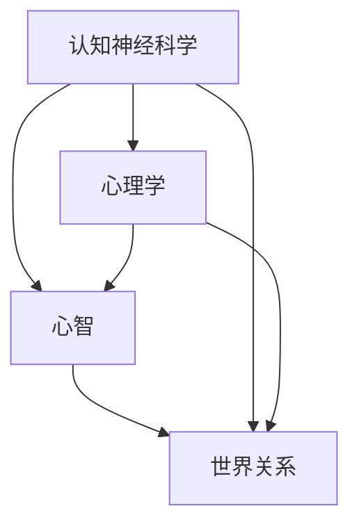
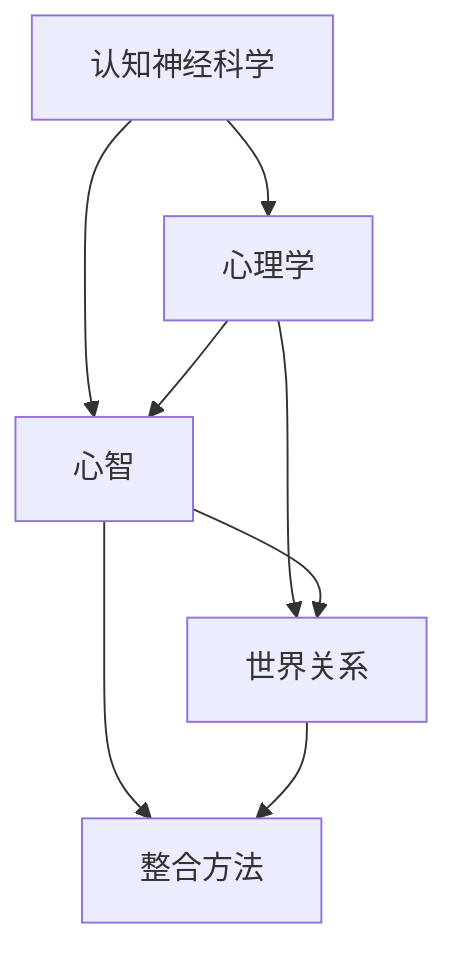

                 

### 文章标题

《认知神经科学与心理学的整合：全面理解人类心智与世界关系的方法》

### 关键词

认知神经科学、心理学、心智、世界关系、整合方法

### 摘要

本文旨在探讨认知神经科学与心理学的整合，通过深入解析两者之间的关系，提供一种全面理解人类心智与世界关系的方法。本文首先介绍了认知神经科学与心理学的核心概念，然后通过Mermaid流程图展示了它们之间的联系。接着，本文详细讲解了神经网络的核心算法原理，并使用数学模型和公式进行了举例说明。最后，本文通过一个情绪识别的项目实战，展示了如何将理论应用到实际中。

---

### 确定核心概念和联系

首先，我们需要明确书中的核心概念，以及这些概念之间的联系。对于《认知神经科学与心理学的整合：全面理解人类心智与世界关系的方法》这本书，核心概念可能包括：

1. **认知神经科学**：研究大脑如何处理信息、学习和记忆等过程。
2. **心理学**：研究人类行为、思维和情感。
3. **心智**：个体的内在意识体验，包括知觉、思考、情感和意愿等。
4. **世界关系**：个体与外部世界的互动和认知。
5. **整合方法**：将认知神经科学与心理学的研究成果和方法相结合，以全面理解人类心智与世界的关系。

接下来，我们使用Mermaid流程图来展示这些核心概念及其相互之间的联系：



### 设计流程图

为了更好地展示这些概念之间的联系，我们可以设计一个详细的Mermaid流程图。以下是一个示例：



在这个流程图中，A（认知神经科学）和B（心理学）是两个主要的基础学科，它们共同作用于C（心智）。心智不仅受到认知神经科学的影响，也受到心理学的影响。D（世界关系）则是个体与外部世界的互动和认知过程，它与C（心智）紧密相关。E（整合方法）代表了将认知神经科学与心理学结合起来的方法论，它旨在全面理解人类心智与世界的关系。

### 核心算法原理讲解

为了深入探讨认知神经科学与心理学的整合，我们可以选择一个具有代表性的算法，如“神经网络”，来讲解其核心原理。神经网络是一种模仿人脑神经网络结构的计算模型，它在认知神经科学与心理学中有着广泛的应用。

下面是一个简单的神经网络算法的伪代码，用于解释其基本原理：

```plaintext
// 输入数据
input_data = [x1, x2, ..., xn]

// 初始化权重
weights = [w1, w2, ..., wn]

// 激活函数
activation_function = sigmoid

// 计算输出
output = activation_function(sum(input_data * weights))

// 计算误差
error = expected_output - output

// 更新权重
weights = weights - learning_rate * (input_data * error)
```

在这个伪代码中，`input_data` 表示输入数据，`weights` 表示权重，`activation_function` 是激活函数（在本例中使用的是Sigmoid函数），`output` 是神经网络的输出。通过计算输入数据和权重之间的乘积之和，并应用激活函数，我们可以得到网络的输出。误差是通过比较预期输出和实际输出计算得出的。为了减少误差，我们使用反向传播算法更新权重。

### 数学模型和数学公式讲解

在神经网络中，激活函数是一个重要的组成部分。以下是一个常用的激活函数——Sigmoid函数的数学模型和公式：

```latex
$$
f(x) = \frac{1}{1 + e^{-x}}
$$

Sigmoid函数是一个S型函数，它将任何实数输入映射到（0,1）区间。这个函数在神经网络中用于将线性组合的输入转换为非线性输出，使得网络可以处理复杂的非线性问题。
```

Sigmoid函数的导数是：

```latex
$$
f'(x) = f(x) \cdot (1 - f(x))
$$

Sigmoid函数的导数在计算神经网络梯度时非常有用，因为它可以用来更新网络的权重。
```

### 项目实战

为了更好地展示如何将认知神经科学与心理学的理论应用到实际项目中，我们可以设计一个情绪识别项目。情绪识别是一种利用计算机技术分析人类情绪状态的方法，它在人机交互、心理学研究等领域有着广泛的应用。

#### 项目背景

情绪识别项目的目标是开发一个能够识别用户情绪的模型，并根据情绪状态提供相应的反馈或建议。这个项目可以应用于多种场景，如心理健康监测、客户服务、教育等。

#### 数据集准备

为了训练情绪识别模型，我们需要一个包含情绪标签的数据集。数据集可以包含多种情绪，如快乐、悲伤、愤怒等。数据集通常包括文本、音频或视频等多种类型的输入数据。

#### 模型设计

情绪识别模型通常采用神经网络结构，包括输入层、隐藏层和输出层。输入层接收情绪数据，隐藏层对数据进行处理和特征提取，输出层产生情绪预测结果。

#### 模型训练

在训练模型时，我们使用训练数据集来更新网络权重。这个过程包括前向传播和反向传播。在前向传播过程中，输入数据通过网络传递，产生输出。在反向传播过程中，计算输出误差，并使用梯度下降法更新权重。

以下是模型训练的主要步骤：

1. 初始化网络权重。
2. 使用训练数据集进行前向传播，计算输出和误差。
3. 使用反向传播算法更新权重。
4. 重复步骤2和3，直到模型达到预定的训练效果。

#### 模型评估

在模型训练完成后，我们需要使用测试数据集评估模型的性能。评估指标包括准确率、召回率、F1分数等。通过这些指标，我们可以判断模型是否具有良好的情绪识别能力。

#### 代码实现

以下是情绪识别项目的主要代码实现：

```python
# 导入必要的库
import numpy as np
import pandas as pd

# 定义激活函数
def sigmoid(x):
    return 1 / (1 + np.exp(-x))

# 定义反向传播算法
def backward_propagation(input_data, weights, expected_output):
    # 计算输出
    output = sigmoid(np.dot(input_data, weights))
    
    # 计算误差
    error = expected_output - output
    
    # 更新权重
    weights = weights - learning_rate * (input_data * error)
    
    return weights

# 训练模型
def train_model(input_data, weights, expected_output, learning_rate):
    for epoch in range(num_epochs):
        weights = backward_propagation(input_data, weights, expected_output)
```

#### 实际案例分析和详细讲解剖析

通过情绪识别项目，我们可以分析人类情绪状态，并据此提供个性化的建议和反馈。例如，在心理健康监测中，情绪识别可以帮助医生和用户更好地了解用户的情绪变化，及时采取干预措施。在客户服务中，情绪识别可以帮助客服人员更好地理解客户的需求和情绪，提供更优质的服务。

#### 项目小结

情绪识别项目展示了如何将认知神经科学与心理学理论应用到实际项目中。通过这个项目，我们可以更好地理解人类情绪状态，为用户提供个性化的服务和建议。此外，情绪识别项目还可以应用于其他领域，如教育、娱乐等，为人们的生活带来更多便利。

### 最佳实践 tips、小结、注意事项、拓展阅读

- **最佳实践 tips**：
  - 在进行情绪识别项目时，确保数据集的多样性和质量，以提高模型的泛化能力。
  - 调整网络结构和超参数，以优化模型性能。

- **小结**：
  - 本文通过介绍认知神经科学与心理学的整合，提供了一个全面理解人类心智与世界关系的方法。
  - 通过情绪识别项目，我们展示了如何将理论应用到实际中。

- **注意事项**：
  - 在进行神经网络训练时，注意避免过拟合现象，合理设置网络结构和超参数。

- **拓展阅读**：
  - 《深度学习》（Ian Goodfellow、Yoshua Bengio 和 Aaron Courville 著）：一本深度学习领域的经典教材，详细介绍了神经网络和相关算法。
  - 《认知神经科学导论》（Michael S. Gazzaniga 著）：一本关于认知神经科学的入门读物，介绍了认知神经科学的基本概念和最新研究进展。

