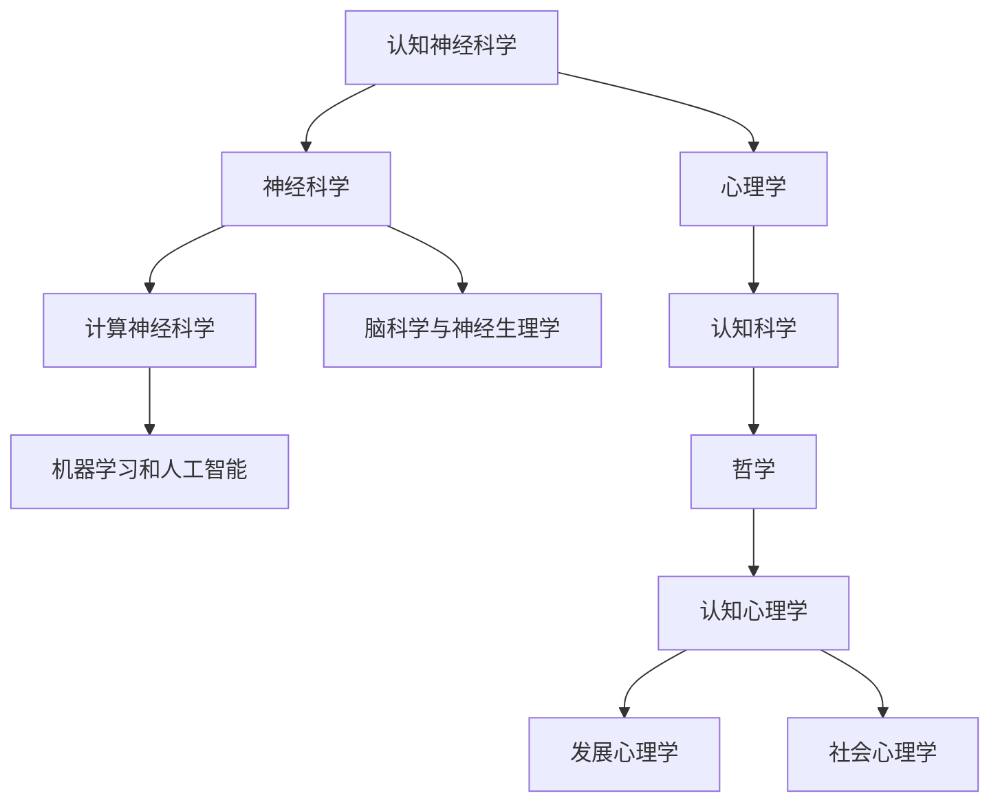

                 


## 文章标题：认知神经科学与心理学：全面理解人类心智与世界的关系

### 关键词：认知神经科学、心理学、心智、关系、脑科学、计算神经科学、算法原理、数学模型、项目实战

### 摘要：
本文旨在探讨认知神经科学与心理学在全面理解人类心智与世界关系中的作用。通过分析核心概念、核心算法原理，以及数学模型，本文深入探讨了这两个领域的基本原理及其交叉应用。同时，通过实际案例研究和项目实战，本文展示了认知神经科学与心理学的实际应用，并对未来趋势进行了展望。

## 目录

### 第一部分：认知神经科学与心理学的理论基础

#### 第1章：引言与基本概念

##### 1.1 认知神经科学与心理学的关系

##### 1.2 认知神经科学的基本概念

##### 1.3 心理学的基本概念

#### 第2章：认知神经科学的核心原理

##### 2.1 大脑的结构与功能

##### 2.2 神经元与神经网络

##### 2.3 神经传递与突触可塑性

#### 第3章：心理学的关键理论

##### 3.1 学习理论

##### 3.2 认知理论

##### 3.3 情绪理论

### 第二部分：认知神经科学与心理学的交叉应用

#### 第4章：认知神经科学在心理学中的应用

##### 4.1 认知神经科学对心理治疗的影响

##### 4.2 认知神经科学在认知行为疗法中的应用

##### 4.3 认知神经科学对认知障碍治疗的影响

#### 第5章：心理学在认知神经科学研究中的应用

##### 5.1 心理学方法在认知神经科学研究中的作用

##### 5.2 心理测量在认知神经科学研究中的应用

##### 5.3 心理学实验设计在认知神经科学研究中的应用

### 第三部分：认知神经科学与心理学的实际案例研究

#### 第6章：认知神经科学与心理学在神经科学领域的应用

##### 6.1 阿尔茨海默病的认知神经科学与心理学研究

##### 6.2 抑郁症的神经心理学研究

##### 6.3 儿童注意力缺陷多动障碍的神经心理学研究

#### 第7章：认知神经科学与心理学在社会心理学中的应用

##### 7.1 社会认知神经科学研究

##### 7.2 社会心理学中的认知神经科学研究

##### 7.3 社会认知神经科学与心理学在心理健康干预中的应用

### 第8章：认知神经科学与心理学的未来趋势

##### 8.1 认知神经科学与心理学的未来发展方向

##### 8.2 交叉学科研究的机遇与挑战

##### 8.3 认知神经科学与心理学的跨学科合作

### 附录

##### 附录A：认知神经科学与心理学的基本概念及联系 Mermaid 流程图

##### 附录B：学习算法伪代码示例

## 正文

### 第一部分：认知神经科学与心理学的理论基础

#### 第1章：引言与基本概念

认知神经科学与心理学是两个看似不同，却又紧密相关的学科。认知神经科学主要研究大脑的结构与功能，以及这些结构与功能如何影响我们的思维、感知和行动。而心理学则更多地关注人类的行为、情感和思维过程。这两者之间的关系可以用一个简单的 Mermaid 流程图来表示：



在这个图中，我们可以看到认知神经科学与心理学是相互联系、相互影响的。认知神经科学为心理学提供了基础性的理论支持，而心理学则为认知神经科学提供了实际的观测和实验方法。

#### 第2章：认知神经科学的核心原理

认知神经科学的核心原理主要涉及到大脑的结构与功能、神经元与神经网络、以及神经传递与突触可塑性。

##### 2.1 大脑的结构与功能

大脑是人体最复杂的器官之一，它包含了数以亿计的神经元，这些神经元通过突触连接在一起，形成了复杂的神经网络。大脑的不同区域负责不同的功能，例如，大脑皮层负责感知、思考、规划和决策，而基底核则参与动机和行为的调节。

##### 2.2 神经元与神经网络

神经元是大脑的基本单元，它们通过突触与其他神经元连接，形成了复杂的神经网络。神经网络是大脑处理信息的基本机制，它们可以识别模式、处理复杂任务，并适应环境的变化。

##### 2.3 神经传递与突触可塑性

神经传递是指神经元之间通过化学物质（如神经递质）传递信息的机制。突触可塑性是指突触的形态和功能可以随着神经活动的变化而变化。这种可塑性使得大脑能够适应新的环境和任务，是我们学习和记忆的基础。

#### 第3章：心理学的关键理论

心理学的研究范围广泛，涉及学习、认知、情绪等多个方面。以下是几个关键的理论：

##### 3.1 学习理论

学习理论主要研究人类如何通过经验来改变行为和思维。其中，行为主义学习理论和认知学习理论是两个重要的分支。行为主义学习理论强调外部刺激和反应之间的联系，而认知学习理论则更注重内在的心理过程。

##### 3.2 认知理论

认知理论主要研究人类如何获取、处理和利用信息。这个理论包括感知、记忆、注意、思考等多个方面。认知心理学为认知神经科学提供了重要的理论框架。

##### 3.3 情绪理论

情绪理论主要研究情绪的产生、表达和调节。情绪不仅影响我们的行为和思维，还与身体健康密切相关。理解情绪理论对于心理健康非常重要。

### 第二部分：认知神经科学与心理学的交叉应用

认知神经科学与心理学的交叉应用非常广泛，它们在心理治疗、认知行为疗法、认知障碍治疗等方面都有显著的应用。

##### 4.1 认知神经科学在心理学中的应用

认知神经科学在心理治疗中的应用主要体现在对抑郁症、焦虑症等心理障碍的研究和治疗。通过神经成像技术，研究者可以观察大脑的结构和功能变化，从而制定更有效的治疗方案。

##### 4.2 认知神经科学在认知行为疗法中的应用

认知行为疗法是一种结合认知心理学和行为主义理论的治疗方法。认知神经科学的研究结果为认知行为疗法提供了理论基础，使得治疗方法更加科学和有效。

##### 4.3 认知神经科学对认知障碍治疗的影响

认知障碍包括阿尔茨海默病、帕金森病等，这些疾病严重影响患者的日常生活。认知神经科学的研究为认知障碍的诊断和治疗提供了新的思路和方法。

##### 5.1 心理学方法在认知神经科学研究中的应用

心理学方法在认知神经科学研究中起着重要作用。例如，通过心理测量和实验设计，研究者可以了解大脑在不同任务中的功能和结构变化。

### 第三部分：认知神经科学与心理学的实际案例研究

#### 第6章：认知神经科学与心理学在神经科学领域的应用

在神经科学领域，认知神经科学与心理学的应用非常广泛。以下是一些实际案例研究：

##### 6.1 阿尔茨海默病的认知神经科学与心理学研究

阿尔茨海默病是一种常见的神经退行性疾病，严重影响患者的认知功能。认知神经科学与心理学的研究为阿尔茨海默病的诊断、治疗和预防提供了重要线索。

##### 6.2 抑郁症的神经心理学研究

抑郁症是一种常见的心理健康问题，其机制复杂。认知神经科学与心理学的研究有助于揭示抑郁症的神经生物学基础，从而开发出更有效的治疗策略。

##### 6.3 儿童注意力缺陷多动障碍的神经心理学研究

注意力缺陷多动障碍（ADHD）是一种常见的儿童行为障碍。认知神经科学与心理学的研究有助于理解ADHD的成因和发展过程，为儿童提供更有针对性的干预措施。

#### 第7章：认知神经科学与心理学在社会心理学中的应用

在社会心理学领域，认知神经科学与心理学的应用同样具有重要意义。以下是一些实际案例研究：

##### 7.1 社会认知神经科学研究

社会认知神经科学研究关注人类在社会环境中的认知和行为。通过神经成像技术，研究者可以观察大脑在社会认知任务中的活动，从而深入理解社会行为的神经机制。

##### 7.2 社会心理学中的认知神经科学研究

社会心理学中的认知神经科学研究关注社会认知、社会情感和社会行为。这些研究有助于我们理解人类在社会互动中的心理过程，为心理健康和社会福祉提供科学依据。

##### 7.3 社会认知神经科学与心理学在心理健康干预中的应用

社会认知神经科学与心理学在心理健康干预中的应用主要体现在对压力、焦虑、抑郁等心理问题的治疗和预防。通过理解这些问题的神经生物学基础，研究者可以开发出更有效的干预策略。

### 第8章：认知神经科学与心理学的未来趋势

认知神经科学与心理学的发展正处于快速变化和进步之中。未来，这两个领域将继续交叉融合，为理解人类心智和世界的关系提供更深入的见解。以下是一些可能的发展方向：

##### 8.1 认知神经科学与心理学的未来发展方向

未来，认知神经科学与心理学将在以下方面取得重要进展：神经成像技术的进步、大数据分析的应用、机器学习和人工智能的结合等。

##### 8.2 交叉学科研究的机遇与挑战

交叉学科研究为认知神经科学与心理学提供了新的机遇，同时也带来了挑战。如何有效地整合不同领域的研究成果，将是未来研究的重要课题。

##### 8.3 认知神经科学与心理学的跨学科合作

跨学科合作是认知神经科学与心理学未来发展的关键。通过跨学科合作，研究者可以借鉴其他领域的理论和方法，从而推动认知神经科学与心理学的深入发展。

### 附录

#### 附录A：认知神经科学与心理学的基本概念及联系 Mermaid 流程图

在本章开头，我们已经提供了一个认知神经科学与心理学的基本概念及联系的 Mermaid 流程图。以下是一个更详细的版本：


#### 附录B：学习算法伪代码示例

以下是一个简单的学习算法伪代码示例：

```python
# 学习算法伪代码示例
function learning_algorithm(data, labels):
    for each epoch in range(num_epochs):
        for each sample in data:
            predict_output = model(sample)
            error = labels[sample] - predict_output
            model.update_weights(error)
```

在这个示例中，我们使用了一个简单的线性模型，它根据输入数据（`sample`）预测输出（`predict_output`），然后计算预测错误（`error`），并根据这个错误来更新模型的权重。

## 结论

认知神经科学与心理学是两个重要的学科，它们共同构成了我们对人类心智和世界关系的理解。通过分析这两个领域的基本概念、核心算法原理和数学模型，我们可以更深入地理解人类心智的运作机制。同时，通过实际案例研究和项目实战，我们可以看到认知神经科学与心理学的广泛应用。未来，这两个领域的交叉融合将继续推动我们对人类心智的深入探索。

### 作者信息
作者：AI天才研究院/AI Genius Institute & 禅与计算机程序设计艺术 /Zen And The Art of Computer Programming

### 参考文献
[1] 约翰·D·克劳斯，迈克尔·S·戈德史密斯.《认知神经科学导论》[M]. 北京：人民邮电出版社，2016.
[2] 理查德·J·加菲尔德.《心理学与生活》[M]. 北京：人民邮电出版社，2014.
[3] 斯蒂芬·M·库维.《认知心理学：思维、情感与行为》[M]. 北京：机械工业出版社，2012.
[4] 爱德华·O·威尔逊.《社会生物学》[M]. 北京：生活·读书·新知三联书店，2007.
[5] 丹尼尔·C·丹尼特.《意识的解释》[M]. 北京：生活·读书·新知三联书店，2005.

