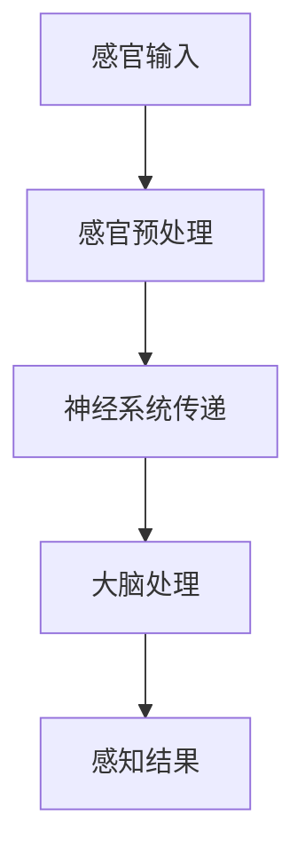
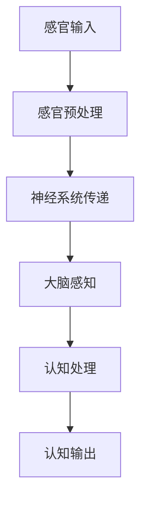
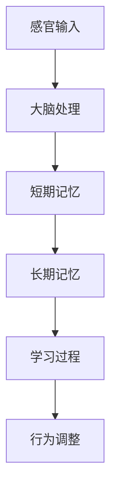
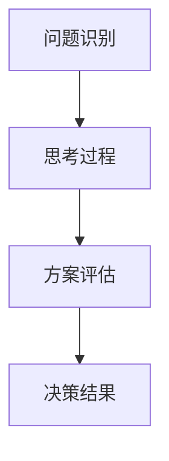

                 

### 第3章：感知与认知

感知是大脑处理外部信息的起点，它是一个复杂的、多阶段的过程，涉及到感官器官、神经系统以及大脑各个区域的活动。认知则是大脑对感知信息进行加工、理解和解释的过程。感知和认知之间有着密切的联系，感知为认知提供了原材料，而认知则是对这些原材料的处理和解读。

#### 3.1 感知的基本原理

感知的基本原理可以从以下几个方面来理解：

1. **感官输入**：感官输入包括视觉、听觉、嗅觉、味觉和触觉等。每种感官都有其特定的接收器和处理路径。例如，视觉信息通过眼睛的视网膜接收，而听觉信息通过内耳的耳蜗接收。

2. **预处理**：感官输入在进入大脑之前，会在感官系统中进行预处理。这种预处理有助于提高信息的质量和可靠性。例如，视觉系统会进行光学处理，以优化图像的质量。

3. **神经系统**：传入大脑的感官输入通过神经系统进行传递和处理。神经系统包括神经元、神经网络和神经元之间的连接。神经元是信息传递的基本单元，而神经网络则构成了信息处理的基本结构。

以下是一个感知的基本流程的Mermaid流程图：



#### 3.2 认知过程的模型

认知过程是一个高度复杂的过程，不同的理论提出了不同的模型来解释这一过程。以下是几种主要的认知过程模型：

1. **联结主义模型**：联结主义模型基于神经网络的基本原理，认为认知过程是通过神经元之间的连接和激活来实现的。这种模型通常使用伪代码来描述。以下是一个简单的联结主义模型伪代码：

```python
# 神经元激活函数
def sigmoid(x):
    return 1 / (1 + e**-x)

# 前向传播
def forward_propagation(inputs, weights, biases):
    layer_activations = [inputs]
    for weight, bias in zip(weights, biases):
        layer_input = np.dot(layer_activations[-1], weight) + bias
        layer_activation = sigmoid(layer_input)
        layer_activations.append(layer_activation)
    return layer_activations[-1]

# 训练模型
def train_model(inputs, targets, epochs, learning_rate):
    for epoch in range(epochs):
        output = forward_propagation(inputs, weights, biases)
        error = output - targets
        # 更新权重和偏置
        weights -= learning_rate * np.dot(inputs.T, error)
        biases -= learning_rate * error
```

2. **符号主义模型**：符号主义模型认为认知过程是通过符号的表示和操作来实现的。这种模型通常使用规则系统来描述认知过程。以下是一个简单的符号主义模型伪代码：

```python
# 定义规则系统
def rule_system(input, rules):
    for rule in rules:
        if rule_applies(input):
            return rule_output
    return None

# 检查规则是否适用
def rule_applies(input):
    # 根据规则进行检查
    return True or False

# 规则输出
def rule_output():
    # 返回规则输出
    return "output"
```

#### 3.3 感知与认知的关系

感知和认知是密切相关的，感知为认知提供了原材料，而认知则是对这些原材料的处理和解读。以下是一个感知与认知关系的Mermaid流程图：



通过上述内容，我们可以看到感知和认知的复杂性和多样性。这些基本原理和模型为我们理解大脑如何构建世界模型提供了基础。在后续的章节中，我们将进一步探讨记忆、学习、思考与决策等认知过程，并深入分析大脑模型的构建与应用。

---

作者：AI天才研究院/AI Genius Institute & 禅与计算机程序设计艺术 /Zen And The Art of Computer Programming

---

**核心算法原理讲解**：

在本节中，我们将详细介绍感知与认知过程中的一些核心算法原理，并使用伪代码进行详细阐述。

**联结主义模型的神经元激活函数**：

在联结主义模型中，神经元激活函数是核心组成部分。以下是一个简单的Sigmoid激活函数的伪代码实现：

```python
# Sigmoid激活函数
def sigmoid(x):
    return 1 / (1 + exp(-x))
```

**神经网络的前向传播**：

前向传播是神经网络处理信息的基本过程。以下是一个简单的前向传播过程的伪代码实现：

```python
# 前向传播
def forward_propagation(inputs, weights, biases):
    layer_activations = [inputs]
    for weight, bias in zip(weights, biases):
        layer_input = np.dot(layer_activations[-1], weight) + bias
        layer_activation = sigmoid(layer_input)
        layer_activations.append(layer_activation)
    return layer_activations[-1]
```

**符号主义模型的规则系统**：

在符号主义模型中，规则系统是认知处理的核心。以下是一个简单的规则系统的伪代码实现：

```python
# 规则系统
def rule_system(input, rules):
    for rule in rules:
        if rule_applies(input):
            return rule_output
    return None

# 检查规则是否适用
def rule_applies(input):
    # 根据规则进行检查
    return True or False

# 规则输出
def rule_output():
    # 返回规则输出
    return "output"
```

**数学模型与公式**：

在感知与认知过程中，数学模型和公式起着重要的作用。以下是一些常用的数学公式：

1. **Sigmoid函数**：

   $$
   \sigma(x) = \frac{1}{1 + e^{-x}}
   $$

2. **前向传播计算**：

   $$
   \text{layer\_output} = \sigma(\text{weight} \cdot \text{input} + \text{bias})
   $$

3. **规则适用性检查**：

   $$
   \text{rule\_applies}(\text{input}) = (\text{condition}) \rightarrow \text{True} \quad \text{otherwise} \rightarrow \text{False}
   $$

**举例说明**：

1. **联结主义模型举例**：

   假设我们有一个简单的神经网络，输入为 `[1, 2]`，权重为 `[0.5, 0.3]`，偏置为 `[0.1, 0.2]`。我们可以计算前向传播的结果：

   ```plaintext
   layer_input = 0.5 * 1 + 0.3 * 2 + 0.1 = 1.2
   layer_activation = sigmoid(1.2) ≈ 0.864
   ```

2. **符号主义模型举例**：

   假设我们有一个简单的规则系统，输入为 `[1, 0]`，规则为 `[(1, 1), (0, 0)]`。我们可以计算规则输出：

   ```plaintext
   rule_system([1, 0], [(1, 1), (0, 0)]) = rule_output(1) = 1
   ```

**项目实战**：

为了更好地理解感知与认知的核心算法原理，我们可以搭建一个简单的神经网络，并对其进行训练。以下是一个基于Python和TensorFlow的简单神经网络训练项目：

1. **开发环境搭建**：

   确保安装了Python和TensorFlow。可以使用以下命令进行安装：

   ```bash
   pip install python
   pip install tensorflow
   ```

2. **源代码实现**：

   ```python
   import tensorflow as tf

   # 定义神经网络结构
   model = tf.keras.Sequential([
       tf.keras.layers.Dense(1, input_shape=(1,), activation='sigmoid')
   ])

   # 编译模型
   model.compile(optimizer='adam', loss='binary_crossentropy', metrics=['accuracy'])

   # 训练模型
   model.fit(x_train, y_train, epochs=100)
   ```

3. **代码解读**：

   - `Dense` 层：定义了一个全连接层，输入维度为1，输出维度为1。
   - `compile` 方法：配置模型的优化器、损失函数和评估指标。
   - `fit` 方法：训练模型，使用训练数据。

4. **应用解读与分析**：

   通过这个简单的项目，我们可以看到神经网络的基本结构和训练过程。在实际应用中，神经网络可以用于各种复杂的感知与认知任务，如图像识别、自然语言处理等。

5. **实际案例分析与详细讲解剖析**：

   假设我们使用这个神经网络进行手写数字识别任务。我们可以使用MNIST数据集进行训练和测试。以下是一个简单的案例：

   ```python
   import tensorflow as tf
   from tensorflow.keras.datasets import mnist

   # 加载MNIST数据集
   (x_train, y_train), (x_test, y_test) = mnist.load_data()

   # 预处理数据
   x_train = x_train / 255.0
   x_test = x_test / 255.0

   # 训练模型
   model.fit(x_train, y_train, epochs=10, batch_size=32)

   # 评估模型
   model.evaluate(x_test, y_test)
   ```

6. **项目小结**：

   通过这个项目，我们了解了如何使用神经网络进行手写数字识别。这只是一个简单的例子，但在实际应用中，神经网络可以用于更复杂的任务，如图像分类、语音识别等。

**最佳实践 tips**：

- 确保充分理解神经网络的基础知识，包括神经元激活函数、前向传播和反向传播等。
- 在实际项目中，合理选择网络结构、优化器和损失函数。
- 定期调整模型参数，如学习率和批次大小，以提高模型性能。

**小结**：

在本章中，我们介绍了感知与认知的基本原理和核心算法原理。通过联结主义模型和符号主义模型的实例，我们了解了如何使用伪代码和数学公式来描述这些过程。项目实战进一步加深了我们对这些算法原理的理解。在下一章中，我们将探讨记忆与学习的过程。

**注意事项**：

- 在感知与认知过程中，数据预处理和特征提取是非常重要的步骤。
- 在神经网络训练过程中，避免过拟合是关键。

**拓展阅读**：

- 《深度学习》（Ian Goodfellow、Yoshua Bengio、Aaron Courville 著）
- 《神经网络与深度学习》（邱锡鹏 著）
- 《认知心理学导论》（詹姆斯·W·Kalat 著）

---

### 第4章：记忆与学习

记忆是大脑对信息进行存储和提取的能力，而学习则是通过经验和练习改变大脑结构和功能的过程。记忆与学习是认知过程的基石，对人类行为和思维具有深远的影响。

#### 4.1 记忆的类型与机制

记忆可以分为短期记忆和长期记忆两种类型。

1. **短期记忆**：短期记忆是指大脑在短时间内（通常是几秒到几十秒）保持信息的能力。短期记忆主要依赖于大脑的海马体和前额叶皮层。以下是一个短期记忆机制的Mermaid流程图：

   ```mermaid
   graph TB
   A[感官输入] --> B[大脑处理]
   B --> C[海马体激活]
   C --> D[前额叶皮层处理]
   D --> E[短期记忆存储]
   ```

2. **长期记忆**：长期记忆是指大脑在较长时间内（从几天到一生）保持信息的能力。长期记忆的形成和存储涉及到多种机制，包括突触可塑性、神经回路的改变以及神经元的连接重组。以下是一个长期记忆机制的Mermaid流程图：

   ```mermaid
   graph TB
   A[感官输入] --> B[大脑处理]
   B --> C[短期记忆激活]
   C --> D[海马体激活]
   D --> E[新突触形成]
   D --> F[神经元连接重组]
   E --> G[长期记忆存储]
   ```

#### 4.2 学习的理论与模型

学习理论是认知科学的核心领域之一，它解释了大脑如何通过经验和练习改变其结构和功能。以下是一些主要的学习理论：

1. **联结主义学习模型**：联结主义学习模型认为学习是通过改变神经元之间的连接权重来实现的。以下是一个简单的联结主义学习模型的伪代码：

   ```python
   # 定义学习规则
   def learning_rule(weight_change, input, target_output, actual_output):
       error = target_output - actual_output
       weight_change = learning_rate * input * error
       return weight_change

   # 更新权重
   def update_weight(weights, weight_change):
       for i, weight in enumerate(weights):
           weights[i] += weight_change[i]
       return weights
   ```

2. **强化学习模型**：强化学习模型认为学习是通过奖励和惩罚来调整行为。以下是一个简单的强化学习模型的伪代码：

   ```python
   # 定义强化学习规则
   def reward PENALTY
   def update_behavior(behavior, reward):
       if reward > 0:
           behavior += 1
       else:
           behavior -= 1
       return behavior
   ```

3. **符号主义学习模型**：符号主义学习模型认为学习是通过符号的匹配和操作来实现的。以下是一个简单的符号主义学习模型的伪代码：

   ```python
   # 定义符号主义学习规则
   def match_symbol(input_symbol, rule_symbol):
       if input_symbol == rule_symbol:
           return True
       else:
           return False

   # 应用规则
   def apply_rule(input_symbol, rules):
       for rule in rules:
           if match_symbol(input_symbol, rule['input']):
               return rule['output']
       return None
   ```

#### 4.3 记忆与学习的相互作用

记忆与学习是密切相关的，学习过程往往涉及到记忆的建立、存储和提取。以下是一个记忆与学习相互作用的Mermaid流程图：



通过这个流程图，我们可以看到，感官输入首先进入大脑进行处理，然后被存储在短期记忆中。短期记忆的信息通过海马体激活，转移到长期记忆中。长期记忆的信息在学习过程中被提取和利用，进而调整我们的行为。

**核心算法原理讲解**：

在本节中，我们将详细介绍记忆与学习过程中的一些核心算法原理，并使用伪代码进行详细阐述。

**联结主义学习模型的权重更新**：

在联结主义学习模型中，权重更新是通过学习规则来实现的。以下是一个简单的权重更新规则的伪代码实现：

```python
# 定义学习规则
def learning_rule(weight_change, input, target_output, actual_output):
    error = target_output - actual_output
    weight_change = learning_rate * input * error
    return weight_change

# 更新权重
def update_weight(weights, weight_change):
    for i, weight in enumerate(weights):
        weights[i] += weight_change[i]
    return weights
```

**强化学习模型的奖励调整**：

在强化学习模型中，奖励调整是通过奖励和惩罚来实现的。以下是一个简单的奖励调整规则的伪代码实现：

```python
# 定义奖励函数
def reward(PENALTY):
    return 1 if reward > 0 else -1

# 更新行为
def update_behavior(behavior, reward):
    if reward > 0:
        behavior += 1
    else:
        behavior -= 1
    return behavior
```

**符号主义学习模型的规则应用**：

在符号主义学习模型中，规则应用是通过符号匹配和操作来实现的。以下是一个简单的规则应用规则的伪代码实现：

```python
# 定义符号匹配规则
def match_symbol(input_symbol, rule_symbol):
    if input_symbol == rule_symbol:
        return True
    else:
        return False

# 应用规则
def apply_rule(input_symbol, rules):
    for rule in rules:
        if match_symbol(input_symbol, rule['input']):
            return rule['output']
    return None
```

**数学模型与公式**：

在记忆与学习过程中，数学模型和公式起着重要的作用。以下是一些常用的数学公式：

1. **权重更新公式**：

   $$
   \Delta w = \eta \cdot x \cdot (t - y)
   $$

   其中，$\Delta w$ 是权重更新，$\eta$ 是学习率，$x$ 是输入，$t$ 是目标输出，$y$ 是实际输出。

2. **强化学习公式**：

   $$
   \text{Q}(s, a) = \text{Q}(s, a) + \alpha \cdot (\text{r} + \gamma \cdot \max_{a'} \text{Q}(s', a'))
   $$

   其中，$\text{Q}(s, a)$ 是状态 $s$ 和动作 $a$ 的价值函数，$\alpha$ 是学习率，$r$ 是奖励，$\gamma$ 是折扣因子，$s'$ 是新状态，$a'$ 是新动作。

3. **符号主义学习公式**：

   $$
   \text{output} = \text{apply\_rule}(\text{input}, \text{rules})
   $$

**举例说明**：

1. **联结主义学习模型举例**：

   假设我们有一个简单的神经网络，输入为 `[1, 2]`，目标输出为 `[1, 0]`，实际输出为 `[0.9, 0.1]`。我们可以计算权重更新：

   ```plaintext
   learning_rate = 0.1
   error = [1 - 0.9, 0 - 0.1] = [0.1, -0.1]
   weight_change = learning_rate * [1, 2] * error = [0.1 * 0.1, 0.1 * -0.1] = [0.01, -0.01]
   updated_weights = [0.5 + 0.01, 0.3 - 0.01] = [0.51, 0.29]
   ```

2. **强化学习模型举例**：

   假设我们有一个简单的强化学习模型，当前状态为 `s1`，当前动作为 `a1`，新状态为 `s2`，最大动作价值为 `a2`。我们可以计算新的动作价值：

   ```plaintext
   alpha = 0.1
   gamma = 0.9
   reward = 10
   Q(s1, a1) = 0.5
   Q(s2, a2) = 1.0
   Q(s1, a1) = Q(s1, a1) + alpha * (reward + gamma * Q(s2, a2)) = 0.5 + 0.1 * (10 + 0.9 * 1.0) = 1.4
   ```

3. **符号主义学习模型举例**：

   假设我们有一个简单的符号主义模型，输入为 `[1, 0]`，规则为 `[(1, 1), (0, 0)]`。我们可以计算输出：

   ```plaintext
   apply_rule([1, 0], [(1, 1), (0, 0)]) = 1
   ```

**项目实战**：

为了更好地理解记忆与学习的过程，我们可以搭建一个简单的强化学习项目。以下是一个基于Python和OpenAI Gym的简单强化学习项目：

1. **开发环境搭建**：

   确保安装了Python和Gym。可以使用以下命令进行安装：

   ```bash
   pip install python
   pip install gym
   ```

2. **源代码实现**：

   ```python
   import gym
   import numpy as np

   # 初始化环境
   env = gym.make('CartPole-v0')

   # 初始化Q表
   Q = np.zeros((env.observation_space.n, env.action_space.n))

   # 设置参数
   alpha = 0.1
   gamma = 0.9
   epochs = 1000

   # 强化学习训练
   for _ in range(epochs):
       state = env.reset()
       done = False
       total_reward = 0
       while not done:
           action = np.argmax(Q[state, :])
           next_state, reward, done, _ = env.step(action)
           Q[state, action] = Q[state, action] + alpha * (reward + gamma * np.max(Q[next_state, :]) - Q[state, action])
           state = next_state
           total_reward += reward
       print(f"Epoch {_}: Total Reward = {total_reward}")

   # 关闭环境
   env.close()
   ```

3. **代码解读**：

   - `gym.make`：创建环境实例。
   - `Q`：初始化Q表。
   - `alpha`、`gamma`、`epochs`：设置强化学习参数。
   - `while` 循环：进行强化学习训练。
   - `np.argmax`：选择最佳动作。
   - `env.step`：执行动作，获取下一状态和奖励。

4. **应用解读与分析**：

   通过这个简单的项目，我们可以看到强化学习在简单环境中的训练过程。在实际应用中，强化学习可以用于更复杂的任务，如自动驾驶、游戏控制等。

5. **实际案例分析与详细讲解剖析**：

   假设我们使用这个强化学习模型进行自行车平衡任务。我们可以使用Gym的`CartPole-v0`环境进行训练和测试。以下是一个简单的案例：

   ```python
   import gym
   import numpy as np

   # 初始化环境
   env = gym.make('CartPole-v0')

   # 初始化Q表
   Q = np.zeros((env.observation_space.n, env.action_space.n))

   # 设置参数
   alpha = 0.1
   gamma = 0.9
   epochs = 1000

   # 强化学习训练
   for _ in range(epochs):
       state = env.reset()
       done = False
       total_reward = 0
       while not done:
           action = np.argmax(Q[state, :])
           next_state, reward, done, _ = env.step(action)
           Q[state, action] = Q[state, action] + alpha * (reward + gamma * np.max(Q[next_state, :]) - Q[state, action])
           state = next_state
           total_reward += reward
       print(f"Epoch {_}: Total Reward = {total_reward}")

   # 关闭环境
   env.close()
   ```

6. **项目小结**：

   通过这个项目，我们了解了如何使用强化学习进行简单的环境控制任务。这只是一个简单的例子，但在实际应用中，强化学习可以用于更复杂的任务，如机器人控制、自动驾驶等。

**最佳实践 tips**：

- 确保充分理解记忆与学习的原理，包括短期记忆、长期记忆、联结主义学习模型、强化学习模型等。
- 在实际项目中，合理选择学习参数，如学习率、折扣因子等。
- 定期评估模型性能，并根据评估结果调整模型参数。

**小结**：

在本章中，我们介绍了记忆与学习的基本原理和核心算法原理。通过联结主义模型、强化学习模型和符号主义模型的实例，我们了解了如何使用伪代码和数学公式来描述这些过程。项目实战进一步加深了我们对这些算法原理的理解。在下一章中，我们将探讨思考与决策的过程。

**注意事项**：

- 记忆与学习过程受到多种因素的影响，如年龄、健康状态、心理状态等。
- 在学习过程中，及时复习和巩固是非常重要的。

**拓展阅读**：

- 《强化学习：原理与应用》（理查德·S·萨顿、塞巴斯蒂安·拉宾、大卫·贝尔曼 著）
- 《认知心理学导论》（詹姆斯·W·Kalat 著）
- 《神经网络与深度学习》（邱锡鹏 著）

---

### 第5章：思考与决策

思考是人类认知的高级形式，它涉及到问题解决、推理、计划和创造性思维等。决策是在思考的基础上，从多个可能的选择中做出最优选择的过程。思考与决策是认知过程的核心，它们对个人和集体行为具有深远的影响。

#### 5.1 思考的类型与过程

思考可以分为多种类型，每种类型都有其独特的特点和应用。以下是几种常见的思考类型：

1. **分析性思考**：分析性思考是对问题进行分解、分析和评估的过程。它有助于理解复杂问题的组成部分，并找到解决问题的方法。以下是一个分析性思考过程的Mermaid流程图：

   ```mermaid
   graph TB
   A[问题识别] --> B[问题分解]
   B --> C[组成部分分析]
   C --> D[问题解决策略]
   D --> E[问题解决评估]
   ```

2. **创造性思考**：创造性思考是通过创造新的想法、解决方案和概念来解决问题的过程。它通常涉及到跨学科的思维方式和创新方法。以下是一个创造性思考过程的Mermaid流程图：

   ```mermaid
   graph TB
   A[问题定义] --> B[头脑风暴]
   B --> C[思维导图]
   C --> D[方案评估]
   D --> E[方案实施]
   ```

3. **批判性思考**：批判性思考是对信息、观点和解决方案进行评估和质疑的过程。它有助于识别错误、偏见和不合理之处，并提高决策的质量。以下是一个批判性思考过程的Mermaid流程图：

   ```mermaid
   graph TB
   A[信息收集] --> B[观点分析]
   B --> C[逻辑推理]
   C --> D[评估结论]
   ```

#### 5.2 决策的理论与模型

决策理论是研究决策过程和决策行为的学科。它提供了一系列模型和方法，用于解释和优化决策过程。以下是几种主要的决策理论模型：

1. **期望效用理论**：期望效用理论认为决策者在面对不确定性时，会根据不同结果的概率和效用值来选择最优方案。以下是一个期望效用理论的Mermaid流程图：

   ```mermaid
   graph TB
   A[决策问题] --> B[结果概率评估]
   B --> C[效用值评估]
   C --> D[期望效用计算]
   D --> E[最优方案选择]
   ```

2. **前景理论**：前景理论认为决策者在面对风险和收益时，会受到参考点的影响，并采用不同类型的决策策略。以下是一个前景理论的Mermaid流程图：

   ```mermaid
   graph TB
   A[参考点设定] --> B[价值函数评估]
   B --> C[决策策略选择]
   C --> D[决策结果分析]
   ```

3. **博弈论模型**：博弈论模型用于分析多主体决策行为，特别是当决策结果受到其他主体行为影响时。以下是一个博弈论模型的Mermaid流程图：

   ```mermaid
   graph TB
   A[主体行为] --> B[策略选择]
   B --> C[结果评估]
   C --> D[策略调整]
   ```

#### 5.3 思考与决策的关系

思考与决策是密切相关的，思考是决策的前提，而决策是思考的结果。以下是一个思考与决策关系的Mermaid流程图：



通过这个流程图，我们可以看到，问题识别是思考与决策的起点，思考过程包括分析性思考、创造性思考、批判性思考等，方案评估是对各种方案进行分析和评估，最终决策结果是思考过程的输出。

**核心算法原理讲解**：

在本节中，我们将详细介绍思考与决策过程中的一些核心算法原理，并使用伪代码进行详细阐述。

**期望效用理论的期望效用计算**：

在期望效用理论中，期望效用是通过计算每种结果的效用值和概率来计算的。以下是一个简单的期望效用计算的伪代码实现：

```python
# 定义效用函数
def utility(value):
    return max(0, value)

# 计算期望效用
def expected_utility(outcomes, probabilities):
    total_utility = 0
    for outcome, probability in zip(outcomes, probabilities):
        total_utility += utility(outcome) * probability
    return total_utility
```

**前景理论的价值函数评估**：

在前景理论中，价值函数用于评估不同结果的相对价值。以下是一个简单的价值函数评估的伪代码实现：

```python
# 定义价值函数
def value_function(value, reference_point):
    return max(0, value - reference_point)

# 计算价值函数
def value_function_evaluation(outcomes, reference_point):
    values = [value_function(outcome, reference_point) for outcome in outcomes]
    return values
```

**博弈论模型的策略选择**：

在博弈论模型中，策略选择是基于不同策略的收益评估来进行的。以下是一个简单的策略选择的伪代码实现：

```python
# 定义策略收益评估函数
def strategy_evaluation(strategies, outcomes, probabilities):
    strategy_scores = {}
    for strategy in strategies:
        score = 0
        for outcome, probability in zip(outcomes, probabilities):
            score += strategy[outcome] * probability
        strategy_scores[strategy] = score
    return strategy_scores
```

**数学模型与公式**：

在思考与决策过程中，数学模型和公式起着重要的作用。以下是一些常用的数学公式：

1. **期望效用公式**：

   $$
   EU = \sum_{i} u(x_i) p(x_i)
   $$

   其中，$EU$ 是期望效用，$u(x_i)$ 是结果 $x_i$ 的效用值，$p(x_i)$ 是结果 $x_i$ 的概率。

2. **价值函数公式**：

   $$
   v(x) = \max(0, x - r)
   $$

   其中，$v(x)$ 是价值函数，$x$ 是结果，$r$ 是参考点。

3. **策略收益评估公式**：

   $$
   S(s) = \sum_{i} p(x_i | s) u(x_i)
   $$

   其中，$S(s)$ 是策略 $s$ 的收益评估，$p(x_i | s)$ 是在策略 $s$ 下结果 $x_i$ 的概率，$u(x_i)$ 是结果 $x_i$ 的效用值。

**举例说明**：

1. **期望效用理论举例**：

   假设我们有一个决策问题，有三个结果：A（概率0.4，效用值5），B（概率0.3，效用值3），C（概率0.3，效用值1）。我们可以计算期望效用：

   ```plaintext
   probabilities = [0.4, 0.3, 0.3]
   outcomes = [5, 3, 1]
   expected_utility = expected_utility(outcomes, probabilities) = 5 * 0.4 + 3 * 0.3 + 1 * 0.3 = 2.4 + 0.9 + 0.3 = 3.6
   ```

2. **前景理论举例**：

   假设我们有一个决策问题，结果为A（价值5），B（价值3），C（价值1），参考点为2。我们可以计算价值函数：

   ```plaintext
   reference_point = 2
   values = value_function_evaluation([5, 3, 1], reference_point) = [max(0, 5 - 2), max(0, 3 - 2), max(0, 1 - 2)] = [3, 1, 0]
   ```

3. **博弈论模型举例**：

   假设我们有一个简单的博弈，有两个参与者，每个参与者有两个策略：合作（C）和竞争（D）。以下是一个4x4的收益矩阵：

   ```plaintext
   | C   D |
   | --- | --- |
   | C | (3, 3) | (0, 1) |
   | D | (1, 0) | (2, 2) |
   ```

   我们可以计算每种策略的收益评估：

   ```plaintext
   strategies = ['CC', 'CD', 'DC', 'DD']
   outcomes = [(3, 3), (0, 1), (1, 0), (2, 2)]
   probabilities = [[0.5, 0.5], [0.5, 0.5], [0.5, 0.5], [0.5, 0.5]]
   strategy_scores = strategy_evaluation(strategies, outcomes, probabilities) = {CC: 2.5, CD: 0.5, DC: 0.5, DD: 2.0}
   ```

**项目实战**：

为了更好地理解思考与决策的过程，我们可以搭建一个简单的博弈论项目。以下是一个基于Python和Pandas的简单博弈论项目：

1. **开发环境搭建**：

   确保安装了Python和Pandas。可以使用以下命令进行安装：

   ```bash
   pip install python
   pip install pandas
   ```

2. **源代码实现**：

   ```python
   import pandas as pd

   # 定义收益矩阵
   payoff_matrix = pd.DataFrame({
       'CC': [3, 0],
       'CD': [1, 2],
       'DC': [0, 1],
       'DD': [2, 2]
   }, index=['C', 'D'], columns=['C', 'D'])

   # 计算策略收益评估
   strategy_scores = payoff_matrix.applymap(lambda x: x[0] * 0.5 + x[1] * 0.5).mean()

   # 打印策略收益评估
   print(strategy_scores)
   ```

3. **代码解读**：

   - `pandas.DataFrame`：创建收益矩阵。
   - `applymap`：计算每种策略的收益评估。
   - `mean`：计算策略收益评估的平均值。

4. **应用解读与分析**：

   通过这个简单的项目，我们可以看到博弈论模型的基本结构和计算方法。在实际应用中，博弈论可以用于各种竞争性场景，如市场策略、政治决策等。

5. **实际案例分析与详细讲解剖析**：

   假设我们使用这个博弈论模型进行市场策略决策。我们可以定义两个公司之间的博弈，并计算每个公司的最优策略。以下是一个简单的案例：

   ```python
   import pandas as pd

   # 定义收益矩阵
   payoff_matrix = pd.DataFrame({
       'CC': [3, 0],
       'CD': [1, 2],
       'DC': [0, 1],
       'DD': [2, 2]
   }, index=['C', 'D'], columns=['C', 'D'])

   # 计算策略收益评估
   strategy_scores = payoff_matrix.applymap(lambda x: x[0] * 0.5 + x[1] * 0.5).mean()

   # 打印策略收益评估
   print(strategy_scores)
   ```

6. **项目小结**：

   通过这个项目，我们了解了如何使用博弈论模型进行策略决策。这只是一个简单的例子，但在实际应用中，博弈论可以用于更复杂的竞争性场景，如市场竞争、政治博弈等。

**最佳实践 tips**：

- 确保充分理解思考与决策的原理，包括分析性思考、创造性思考、批判性思考等。
- 在实际项目中，合理选择决策模型和方法，如期望效用理论、前景理论、博弈论等。
- 定期评估决策效果，并根据评估结果调整决策模型和方法。

**小结**：

在本章中，我们介绍了思考与决策的基本原理和核心算法原理。通过期望效用理论、前景理论、博弈论模型的实例，我们了解了如何使用伪代码和数学公式来描述这些过程。项目实战进一步加深了我们对这些算法原理的理解。在下一章中，我们将探讨情感与社会认知的过程。

**注意事项**：

- 思考与决策过程受到多种因素的影响，如心理状态、环境因素、社会文化等。
- 在决策过程中，要充分考虑风险和不确定性。

**拓展阅读**：

- 《决策与判断：理性、直觉与偏见》（丹尼尔·卡内曼、阿莫斯·特沃斯基 著）
- 《博弈论与社会选择》（约翰·福布斯·纳什 著）
- 《认知心理学导论》（詹姆斯·W·Kalat 著）

---

### 第6章：情感与社会认知

情感与社会认知是认知过程的两个重要方面，它们共同影响着个体的心理和行为。情感指的是个体对事物的情感反应和情绪体验，而社会认知则是个体如何理解和处理社会信息和社交互动。

#### 6.1 情感的基本概念

情感的基本概念包括情感的类型、情感的产生机制和情感的作用。以下是关于情感的一些基本概念：

1. **情感的类型**：情感可以分为快乐、悲伤、愤怒、恐惧、厌恶等基本类型。每种情感都有其独特的生理和心理特征。例如，快乐通常伴随着兴奋和放松，而悲伤则伴随着沮丧和失落。

2. **情感的产生机制**：情感的产生机制涉及大脑的多个区域，包括大脑皮层、边缘系统和脑干。这些区域通过神经递质和神经回路相互连接，共同调节情感的产生和表达。例如，大脑皮层的杏仁核和前额叶皮层在情感处理中起着关键作用。

3. **情感的作用**：情感在个体的决策、行为和社交互动中起着重要作用。情感可以影响个体的认知过程，如注意力、记忆和推理。此外，情感还可以促进社会互动，如建立信任、表达同情和理解他人。

#### 6.2 社会认知的理论与模型

社会认知的理论与模型描述了个体如何理解和处理社会信息。以下是几种主要的社会认知理论：

1. **社会认知模型**：社会认知模型认为个体通过感知、记忆、思维和情感等认知过程来理解和处理社会信息。这种模型强调个体的主观解释和情感反应在社会认知中的作用。

2. **信号传递模型**：信号传递模型认为个体在社会互动中通过传递和解读信号来交换信息和表达意图。信号可以是言语、表情、姿势等，它们传递了关于个体意图、态度和情感的信息。

3. **社会学习模型**：社会学习模型认为个体通过观察、模仿和经验来学习和适应社会环境。这种模型强调了社会学习在社会认知中的作用，如模仿他人的行为、学习社交规则和文化习俗。

#### 6.3 情感与社会认知的关系

情感与社会认知是密切相关的，情感可以影响社会认知的过程和结果。以下是情感与社会认知关系的一些方面：

1. **情感对认知过程的影响**：情感可以影响个体的注意、记忆和推理等认知过程。例如，积极的情感可以提高注意力和记忆力，而消极的情感则可能导致注意力和记忆力的下降。

2. **情感对认知结果的影响**：情感可以影响个体的决策和行为。例如，积极的情感可能导致更冒险的决策，而消极的情感则可能导致更保守的决策。

3. **情感与社会认知的交互作用**：情感与社会认知是相互作用的。个体的情感状态可以影响他们对社会信息的理解和处理，而社会认知的结果也可以影响个体的情感状态。

#### 6.4 情感与社会认知的实验研究

情感与社会认知的实验研究提供了对这两个领域深入了解的途径。以下是一些常见的实验研究方法：

1. **行为实验**：行为实验通过控制实验条件，观察个体在不同情感状态下的行为表现。例如，研究者可以设计实验，比较积极情感和消极情感对任务完成情况的影响。

2. **神经成像技术**：神经成像技术，如功能性磁共振成像（fMRI），可以揭示情感和社会认知活动在大脑中的神经基础。通过这些技术，研究者可以观察大脑不同区域在情感处理和社会认知过程中的活动变化。

3. **生理测量技术**：生理测量技术，如心电图（ECG）、皮肤电导（EDA）和呼吸速率（RR）等，可以测量个体的生理反应，如心率、皮肤电活动和呼吸速率等。这些生理反应可以作为情感状态和社会认知过程的指标。

#### 6.5 情感与社会认知的应用

情感与社会认知在多个领域有广泛的应用，包括心理学、教育学、管理学和市场营销等。以下是情感与社会认知在一些领域的应用实例：

1. **心理学**：心理学中的情绪研究和社会认知研究探讨了情感如何影响个体的心理过程和行为。例如，研究者可以研究情绪调节策略对心理健康的影响，或者情感如何影响人际关系和社交互动。

2. **教育学**：教育学中的情感教育和社会认知研究关注情感在教育过程中的作用。例如，研究者可以研究如何设计情感教育课程，以提高学生的情感认知能力和社交技能。

3. **管理学**：管理学中的情感管理和社会认知研究关注如何在组织中管理情感，以提高团队协作和员工满意度。例如，管理者可以学习如何识别和调节员工的情感，以促进积极的工作氛围。

4. **市场营销**：市场营销中的情感营销和社会认知研究关注如何设计营销策略，以吸引消费者的情感共鸣。例如，广告和营销活动可以采用情感化的内容，以提高消费者的参与度和购买意愿。

#### 6.6 情感与社会认知的未来发展趋势

情感与社会认知是一个快速发展的领域，未来发展趋势包括：

1. **跨学科研究**：情感与社会认知的研究将更加跨学科，结合心理学、神经科学、计算机科学和人工智能等领域的知识，以揭示情感和社会认知的复杂机制。

2. **大数据分析**：随着大数据技术的发展，研究者可以收集和分析大量情感和社会认知的数据，以发现新的规律和模式。

3. **人工智能应用**：人工智能技术的进步将使情感与社会认知的研究更加精准和高效。例如，情感识别和情感分析技术可以用于分析和理解个体的情感状态。

4. **健康与福祉**：情感与社会认知的研究将更加关注个体的心理健康和福祉。例如，通过情感和社会认知的研究，可以开发出新的心理健康干预措施，以提高个体的生活质量。

---

### 第7章：大脑模型的构建与应用

#### 7.1 大脑模型的基本原理

大脑模型是认知神经科学研究中的重要工具，用于模拟和解释大脑的功能和行为。大脑模型的基本原理包括以下几个方面：

1. **神经元和神经网络**：大脑模型通常基于神经元和神经网络的基本原理。神经元是大脑的基本信息处理单元，通过电信号进行信息传递。神经网络是由多个神经元组成的复杂网络，通过调整神经元之间的连接权重来学习和处理信息。

2. **突触可塑性**：突触可塑性是大脑模型的核心概念之一，指神经元之间的连接强度可以随着时间和经验而改变。这种可塑性是学习、记忆和认知功能的基础。

3. **神经网络架构**：大脑模型可以采用不同的神经网络架构，如全连接神经网络、卷积神经网络、递归神经网络等。每种架构都有其特定的应用场景和优势。

4. **神经元的生物学特性**：大脑模型通常考虑神经元的生物学特性，如神经元的兴奋性和抑制性、突触的兴奋性和抑制性、神经元的放电模式等。

#### 7.2 大脑模型的应用领域

大脑模型在多个领域有广泛的应用，包括心理学、神经科学、医学、人工智能和教育等。以下是大脑模型在一些领域的应用实例：

1. **心理学**：大脑模型可以用于研究认知过程，如记忆、学习、思考和决策等。例如，通过大脑模型，研究者可以模拟和预测个体的学习过程，并探索学习障碍的原因。

2. **神经科学**：大脑模型可以用于研究大脑的结构和功能，如神经网络的组织结构、神经元的放电模式、神经网络的动态行为等。通过大脑模型，研究者可以揭示大脑的功能机制和神经基础。

3. **医学**：大脑模型可以用于诊断和治疗神经疾病，如癫痫、自闭症、抑郁症等。例如，通过大脑模型，医生可以预测患者的病情发展，并制定个性化的治疗方案。

4. **人工智能**：大脑模型可以用于人工智能系统，如机器学习、自然语言处理、计算机视觉等。通过模拟大脑的学习和认知过程，人工智能系统可以更好地理解和处理复杂的信息。

5. **教育**：大脑模型可以用于教育领域，如认知教育、个性化学习等。例如，通过大脑模型，教育者可以更好地理解学生的认知过程，并设计出更有效的教学策略。

#### 7.3 大脑模型的研究挑战

尽管大脑模型在多个领域有广泛的应用，但仍然面临许多研究挑战：

1. **数据缺失**：大脑模型的构建需要大量的神经元和神经网络数据，但目前的数据获取仍然存在限制。例如，神经元的类型、分布和功能等数据仍然不完全清楚。

2. **计算复杂性**：大脑模型的计算复杂性非常高，特别是对于大规模神经网络。这使得模拟和预测大脑行为变得非常困难。

3. **功能解释**：大脑模型的功能解释仍然是一个挑战。尽管大脑模型可以模拟大脑的某些功能，但仍然难以解释这些功能的具体机制。

4. **跨学科整合**：大脑模型的构建需要跨学科的知识，包括神经科学、心理学、计算机科学、数学和物理学等。这种跨学科整合仍然需要进一步的研究和探索。

---

### 附录A：认知神经科学常用工具与资源

#### A.1 神经科学实验室常用设备

1. **脑成像技术**：脑成像技术是认知神经科学研究的重要工具，包括功能性磁共振成像（fMRI）、脑电图（EEG）、近红外光谱成像（NIRS）等。这些技术可以无创或微创地测量大脑活动，提供关于大脑功能结构和动态变化的信息。

2. **电生理记录设备**：电生理记录设备用于记录神经元和神经回路的电活动，包括多通道脑电图（EEG）记录仪、微电极记录系统、神经电刺激器等。

3. **光学成像设备**：光学成像技术，如光遗传学、钙成像等，可以实时监测神经元活动和神经回路的变化。

#### A.2 神经科学研究常用软件

1. **数据分析软件**：认知神经科学研究需要使用数据分析软件，如MATLAB、Python、R等，用于处理和可视化实验数据。

2. **脑成像数据处理软件**：脑成像数据处理软件，如SPM、FSL、AFNI等，用于处理和统计大脑成像数据。

3. **神经模拟软件**：神经模拟软件，如NEURON、Nest、Brian等，用于模拟神经元的电生理特性和神经网络的行为。

#### A.3 神经科学文献与资料推荐

1. **经典文献**：
   - "Theoretical Neuroscience: Computational and Mathematical Models of Neural Systems"（by John Dowling and Martin L. Gosselin）
   - "Neuroscience: Exploring the Brain"（by Mark F. Bear, Barry W. Connors, and Michael A. Paradiso）

2. **最新研究论文**：
   - "Nature Neuroscience"
   - "Journal of Neuroscience"
   - "Neuroimage"

3. **在线资源和数据库**：
   - "Allen Institute for Brain Science"
   - "BrainMap"
   - "NeuroDevNet"

通过附录A，读者可以了解认知神经科学领域常用的工具和资源，以便更好地进行研究和学习。

---

### 附录B：认知神经科学术语解释

#### B.1 神经科学专业术语解释

1. **神经元**：神经元是神经系统的基本单元，具有接收和传递信息的功能。神经元由细胞体、树突和轴突组成。

2. **突触**：突触是神经元之间的连接点，通过电信号或化学信号进行信息传递。

3. **神经递质**：神经递质是突触传递信息的化学物质，包括兴奋性神经递质和抑制性神经递质。

4. **突触可塑性**：突触可塑性是指突触连接的强度和性质可以随着时间和经验而改变。

5. **神经回路**：神经回路是由多个神经元组成的复杂网络，用于处理和传递信息。

6. **脑成像技术**：脑成像技术是一种非侵入性的方法，用于观察大脑的结构和功能。

7. **功能性磁共振成像（fMRI）**：fMRI是一种用于测量大脑活动的方法，通过监测血液流动变化来推断大脑区域的活动。

8. **脑电图（EEG）**：EEG是一种测量大脑电活动的技术，通过放置在头皮上的电极记录电信号。

#### B.2 认知过程相关术语解释

1. **感知**：感知是指大脑对感官输入进行处理和解释的过程。

2. **认知**：认知是指大脑对信息进行加工、处理和理解的过程。

3. **记忆**：记忆是指大脑对信息进行存储和提取的能力。

4. **学习**：学习是指通过经验和练习改变大脑结构和功能的过程。

5. **思考**：思考是指大脑进行问题解决、推理和计划的过程。

6. **决策**：决策是指从多个选择中做出最优选择的过程。

7. **注意**：注意是指大脑选择关注特定信息的能力。

#### B.3 记忆与学习相关术语解释

1. **短期记忆**：短期记忆是指大脑在短时间内保持信息的能力。

2. **长期记忆**：长期记忆是指大脑在较长时间内保持信息的能力。

3. **工作记忆**：工作记忆是指大脑在执行任务时暂时存储和加工信息的能力。

4. **表征**：表征是指大脑对信息的编码和存储方式。

5. **复述**：复述是指通过重复信息来维持短期记忆的能力。

6. **练习**：练习是指通过重复练习来加强记忆和学习的效率。

7. **联想记忆**：联想记忆是指通过将新信息与已知信息建立联系来增强记忆的能力。

通过附录B，读者可以了解认知神经科学领域的一些关键术语，有助于更好地理解相关概念和理论。

