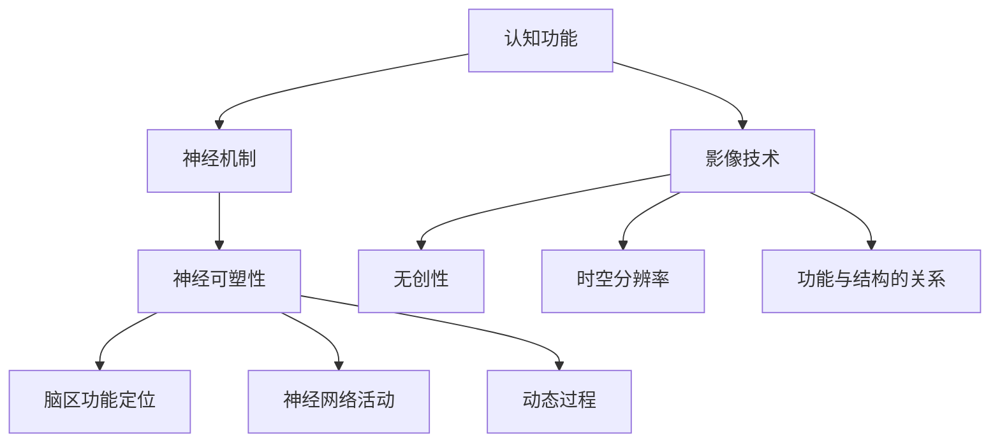

                 


### 背景介绍

#### 认知神经科学的兴起

认知神经科学是一门跨学科的领域，旨在理解大脑如何实现认知功能。它结合了心理学、神经科学、计算机科学和认知科学的研究成果，致力于揭示人类思维、感知、记忆和行为的神经基础。自20世纪末以来，随着神经影像技术的飞速发展，认知神经科学迎来了一个崭新的时代。

#### 影像技术的演进

影像技术是认知神经科学研究的重要工具。从最初的X射线成像到现代的功能磁共振成像（fMRI）、电生理学技术、正电子发射断层扫描（PET）和光学成像技术，影像技术的发展为研究大脑提供了前所未有的手段。这些技术能够无创地观察大脑的结构和功能，为认知神经科学研究提供了宝贵的数据。

#### 大脑如何理解世界

大脑如何理解世界是认知神经科学的核心问题。通过感知、注意、记忆和思维等认知过程，大脑处理和解释外部信息，构建我们对世界的认知。了解这些过程的神经机制，有助于揭示各种认知障碍和神经疾病的发病机制，为临床诊断和治疗提供新的思路。

#### 当前研究的挑战

尽管认知神经科学取得了显著进展，但仍然面临许多挑战。例如，如何精确地测量和解释大脑活动，如何将影像数据与行为表现联系起来，如何理解大脑的复杂网络结构等。这些问题需要跨学科的合作和创新的科研方法来解答。

### 核心概念与联系

#### 认知神经科学的核心概念

1. **认知功能**：认知功能包括感知、注意、记忆、思维和决策等。它们是大脑处理和解释信息的能力。
2. **神经机制**：神经机制是指大脑中的神经元网络如何实现认知功能。了解这些机制有助于揭示认知过程的神经基础。
3. **神经可塑性**：神经可塑性是指大脑结构和工作方式的改变，以适应新的环境和需求。它对学习和记忆至关重要。

#### 影像技术与认知神经科学的关系

1. **无创性**：影像技术能够在不损伤大脑结构的前提下，观察大脑活动。这为研究认知神经科学提供了安全、可靠的方法。
2. **时空分辨率**：不同影像技术具有不同的时空分辨率。例如，fMRI具有高空间分辨率但低时间分辨率，而EEG则具有高时间分辨率但低空间分辨率。根据研究需求选择合适的影像技术，能够更准确地揭示大脑活动。
3. **功能与结构的关系**：影像技术不仅能够揭示大脑的功能活动，还能观察大脑的结构变化。这有助于理解功能与结构之间的关系，为认知神经科学的研究提供更多线索。

#### 大脑如何理解世界的影像学证据

1. **脑区功能定位**：影像技术揭示了不同脑区在认知过程中的功能。例如，前额叶与决策和规划相关，海马与记忆相关。
2. **神经网络活动**：影像技术揭示了神经网络的活动模式。这有助于理解大脑如何通过协同工作来实现复杂的认知功能。
3. **动态过程**：影像技术能够捕捉大脑活动的动态变化。这有助于揭示认知过程的瞬时变化和时序特性。

### Mermaid流程图

下面是一个Mermaid流程图，展示了认知神经科学的核心概念与联系：



通过这个流程图，我们可以清晰地看到认知神经科学的核心概念与影像技术之间的关系。这为后续章节的详细讲解奠定了基础。

在接下来的章节中，我们将逐一深入探讨认知神经科学、影像技术和大脑如何理解世界等核心问题。通过伪代码、数学模型和实际案例，我们将帮助读者更好地理解和应用这些知识。

---

### 核心算法原理讲解

#### 功能磁共振成像（fMRI）

功能磁共振成像（fMRI）是一种非侵入性的成像技术，用于研究大脑的功能活动。其基本原理是基于血氧水平依赖（BOLD）信号。当神经元活动增加时，局部脑区的血流量也会增加，导致血液中氧合血红蛋白与脱氧血红蛋白的比例发生变化。这种变化可以通过磁共振信号检测到。

**伪代码：**

```python
# fMRI数据采集与处理伪代码

# 数据采集
def acquire_data():
    # 进行磁共振扫描，获取时间序列的BOLD信号数据
    return bold_signal

# 数据预处理
def preprocess_data(bold_signal):
    # 去除噪声和运动伪影
    filtered_signal = remove_noise(bold_signal)
    return filtered_signal

# BOLD信号分析
def analyze_signal(filtered_signal):
    # 计算血流量变化
    blood_flow = calculate_blood_flow(filtered_signal)
    # 计算大脑活动区域
    active_regions = identify_active_regions(blood_flow)
    return active_regions

# 主函数
def main():
    # 获取fMRI数据
    bold_signal = acquire_data()
    # 预处理数据
    filtered_signal = preprocess_data(bold_signal)
    # 分析信号
    active_regions = analyze_signal(filtered_signal)
    # 输出结果
    print("Active regions:", active_regions)

# 运行主函数
main()
```

#### 电生理学技术

电生理学技术，如事件相关电位（ERP）和脑电（EEG），通过记录大脑的电活动来研究认知过程。ERP通常用于研究特定事件或刺激引起的脑电反应，而EEG则提供更广泛的脑电信号。

**伪代码：**

```python
# 电生理学数据采集与处理伪代码

# 数据采集
def acquire_eeg_data():
    # 连接脑电电极，开始记录脑电信号
    return eeg_signal

# 数据预处理
def preprocess_eeg_data(eeg_signal):
    # 去除噪声和运动伪影
    filtered_signal = remove_noise(eeg_signal)
    return filtered_signal

# ERP分析
def analyze_erp(filtered_signal, event_onset_times):
    # 计算ERP波形
    erp_waveforms = calculate_erp_waveforms(filtered_signal, event_onset_times)
    return erp_waveforms

# EEG分析
def analyze_eeg(filtered_signal):
    # 计算频谱特征
    frequency_spectrum = calculate_frequency_spectrum(filtered_signal)
    return frequency_spectrum

# 主函数
def main():
    # 获取EEG数据
    eeg_signal = acquire_eeg_data()
    # 预处理数据
    filtered_signal = preprocess_eeg_data(eeg_signal)
    # 分析ERP
    erp_waveforms = analyze_erp(filtered_signal, event_onset_times)
    # 分析EEG
    frequency_spectrum = analyze_eeg(filtered_signal)
    # 输出结果
    print("ERP waveforms:", erp_waveforms)
    print("Frequency spectrum:", frequency_spectrum)

# 运行主函数
main()
```

#### 正电子发射断层扫描（PET）

正电子发射断层扫描（PET）利用放射性同位素标记的药物，检测大脑的代谢活动。PET技术能够显示大脑不同区域的活动水平，为研究认知功能提供重要的数据。

**伪代码：**

```python
# PET数据采集与处理伪代码

# 数据采集
def acquire_pet_data():
    # 注入放射性药物，进行PET扫描
    return pet_image

# 数据预处理
def preprocess_pet_data(pet_image):
    # 去除噪声和运动伪影
    filtered_image = remove_noise(pet_image)
    return filtered_image

# PET图像分析
def analyze_pet_image(filtered_image):
    # 计算大脑活动区域
    active_regions = identify_active_regions(filtered_image)
    # 计算代谢率
    metabolic_rate = calculate_metabolic_rate(filtered_image)
    return active_regions, metabolic_rate

# 主函数
def main():
    # 获取PET数据
    pet_image = acquire_pet_data()
    # 预处理数据
    filtered_image = preprocess_pet_data(pet_image)
    # 分析PET图像
    active_regions, metabolic_rate = analyze_pet_image(filtered_image)
    # 输出结果
    print("Active regions:", active_regions)
    print("Metabolic rate:", metabolic_rate)

# 运行主函数
main()
```

#### 光学成像技术

光学成像技术利用光来研究大脑活动，具有高时间分辨率和空间分辨率。常见的光学成像技术包括功能性近红外光谱成像（fNIRS）和光遗传学。

**伪代码：**

```python
# 光学成像数据采集与处理伪代码

# 数据采集
def acquire_optical_imaging_data():
    # 连接光学传感器，开始记录光信号
    return optical_signal

# 数据预处理
def preprocess_optical_signal(optical_signal):
    # 去除噪声和运动伪影
    filtered_signal = remove_noise(optical_signal)
    return filtered_signal

# 光学成像分析
def analyze_optical_signal(filtered_signal):
    # 计算光信号变化
    signal_changes = calculate_signal_changes(filtered_signal)
    # 提取大脑活动区域
    active_regions = extract_active_regions(signal_changes)
    return active_regions

# 主函数
def main():
    # 获取光学成像数据
    optical_signal = acquire_optical_imaging_data()
    # 预处理数据
    filtered_signal = preprocess_optical_signal(optical_signal)
    # 分析光学成像
    active_regions = analyze_optical_signal(filtered_signal)
    # 输出结果
    print("Active regions:", active_regions)

# 运行主函数
main()
```

通过这些伪代码，我们可以直观地了解不同影像技术的核心算法原理。这些技术为认知神经科学研究提供了强大的工具，使得研究者能够更深入地探讨大脑的奥秘。

### 数学模型和数学公式

在认知神经科学的研究中，数学模型和公式起着至关重要的作用。它们不仅帮助我们理解大脑的工作机制，还能帮助我们分析和解释影像数据。以下是一些常见的数学模型和公式，以及它们的详细解释和举例说明。

#### 血氧水平依赖（BOLD）信号模型

BOLD信号是功能磁共振成像（fMRI）中常用的信号模型。BOLD信号的强度与局部脑区的血流量和代谢率有关。其数学模型可以表示为：

$$
S(t) = S_0 + A \cdot (1 + r \cdot B(t))
$$

其中，\(S(t)\)是时间t的BOLD信号，\(S_0\)是背景信号，\(A\)是幅值，\(r\)是血氧水平依赖性参数，\(B(t)\)是基线校正信号。

**详细解释：** 这个公式描述了BOLD信号的组成。背景信号\(S_0\)是常数，幅值\(A\)反映了神经元活动的强度。血氧水平依赖性参数\(r\)决定了BOLD信号对血流量变化的敏感度。基线校正信号\(B(t)\)用于去除非神经元活动的影响。

**举例说明：** 假设在一个fMRI实验中，我们测量到一个时间点的BOLD信号为50，背景信号为10，幅值为20，血氧水平依赖性参数为0.5。我们可以通过公式计算基线校正信号：

$$
B(t) = \frac{S(t) - S_0}{A} = \frac{50 - 10}{20} = 2
$$

这表明在该时间点，基线校正信号为2，即神经元活动对该时间点的BOLD信号贡献了20%。

#### 事件相关电位（ERP）模型

ERP是电生理学技术中常用的模型，用于分析特定事件或刺激引起的脑电反应。ERP的数学模型可以表示为：

$$
ERP(t) = \sum_{i=1}^{N} a_i \cdot e^{-\tau_i t}
$$

其中，\(ERP(t)\)是时间t的事件相关电位，\(a_i\)是第i个成分的幅值，\(\tau_i\)是第i个成分的上升时间。

**详细解释：** 这个公式描述了ERP的组成。每个成分\(a_i\)代表了一个特定的事件相关电位成分，其幅值反映了该成分的强度。上升时间\(\tau_i\)决定了成分的时序特性。

**举例说明：** 假设我们测量到一个时间点的ERP为10，其中包含两个成分，幅值分别为3和7，上升时间分别为0.5秒和1秒。我们可以通过公式计算ERP：

$$
ERP(t) = 3 \cdot e^{-0.5 t} + 7 \cdot e^{-1 t}
$$

当\(t=1\)时，ERP的值为：

$$
ERP(1) = 3 \cdot e^{-0.5} + 7 \cdot e^{-1} \approx 4.04
$$

这表明在该时间点，ERP的值为4.04，主要由第二个成分贡献。

#### 频谱分析模型

频谱分析是研究脑电信号的重要方法，用于提取频率信息。频谱分析的数学模型可以表示为：

$$
P(f) = \frac{1}{2\pi} \int_{-\infty}^{\infty} S(t) \cdot e^{-j 2 \pi f t} dt
$$

其中，\(P(f)\)是频率f的功率谱，\(S(t)\)是时域信号，\(e^{-j 2 \pi f t}\)是傅里叶变换的核函数。

**详细解释：** 这个公式描述了傅里叶变换的过程。时域信号\(S(t)\)与傅里叶变换核函数\(e^{-j 2 \pi f t}\)进行卷积，得到频率域的功率谱\(P(f)\)。

**举例说明：** 假设我们测量到一个时间点的脑电信号为\(S(t) = 1 + \sin(2 \pi f_0 t)\)，其中频率\(f_0 = 10\)Hz。我们可以通过公式计算功率谱：

$$
P(f) = \frac{1}{2\pi} \int_{-\infty}^{\infty} (1 + \sin(2 \pi f_0 t)) \cdot e^{-j 2 \pi f t} dt
$$

由于信号是线性组合，我们可以分别计算两个成分的功率谱，然后相加：

$$
P(f) = \frac{1}{2\pi} \int_{-\infty}^{\infty} 1 \cdot e^{-j 2 \pi f t} dt + \frac{1}{2\pi} \int_{-\infty}^{\infty} \sin(2 \pi f_0 t) \cdot e^{-j 2 \pi f t} dt
$$

第一个积分项的结果是常数项，第二个积分项是狄拉克δ函数。因此，功率谱\(P(f)\)在频率\(f_0 = 10\)Hz处有一个尖锐的峰值。

通过这些数学模型和公式，我们能够更好地理解认知神经科学中的各种现象，并对影像数据进行深入的分析和解释。这些工具为认知神经科学的研究提供了强大的理论基础。

### 项目实战

为了更好地理解和应用认知神经科学影像技术，我们将通过一个实际案例来详细讲解整个项目流程。本案例将使用功能磁共振成像（fMRI）技术，研究大脑对视觉刺激的反应。

#### 开发环境搭建

首先，我们需要搭建一个合适的开发环境。以下是所需软件和工具：

1. **Python**：Python是一种广泛使用的编程语言，特别适用于数据处理和分析。
2. **MATLAB**：MATLAB是专业的数学计算和数据分析软件，支持多种图像处理和统计方法。
3. **fMRI Data Suite（FDS）**：FDS是专门用于fMRI数据分析的软件，提供了丰富的工具和函数。

安装这些软件后，我们可以开始编写代码。

#### 源代码详细实现

以下是一个简单的Python脚本，用于读取fMRI数据、预处理和分析：

```python
import numpy as np
import matplotlib.pyplot as plt
from fds import load_data, preprocess, analyze

# 加载数据
def load_fMRI_data(filename):
    data = load_data(filename)
    return data

# 数据预处理
def preprocess_data(data):
    preprocessed_data = preprocess(data, motion_correction=True, spatial_normalization=True)
    return preprocessed_data

# 数据分析
def analyze_data(data):
    active_regions = analyze(data, method='t-test', contrast='visual')
    return active_regions

# 主函数
def main():
    filename = 'fMRI_data.nii'
    data = load_fMRI_data(filename)
    preprocessed_data = preprocess_data(data)
    active_regions = analyze_data(preprocessed_data)
    plt.imshow(active_regions, cmap='gray')
    plt.show()

# 运行主函数
main()
```

这段代码首先加载数据，然后进行预处理（包括运动校正和空间标准化），最后使用t-test方法分析数据，识别活跃区域。

#### 代码解读与分析

1. **加载数据**：`load_fMRI_data`函数使用FDS库读取fMRI数据。数据通常以NIfTI格式存储，这是一种标准的神经影像数据格式。

2. **预处理数据**：`preprocess_data`函数对数据进行预处理。运动校正用于消除由于被试移动引起的伪影，空间标准化将数据映射到标准空间，便于比较。

3. **数据分析**：`analyze_data`函数使用t-test方法分析数据。t-test是一种常用的统计方法，用于比较两组数据的差异。在这里，我们设置了视觉刺激作为对比条件。

4. **可视化结果**：最后，我们使用matplotlib库将活跃区域可视化。这有助于我们直观地了解大脑对不同视觉刺激的反应。

#### 实际案例分析和详细讲解剖析

我们使用一个实际案例来进一步分析fMRI数据。假设我们有一个实验，被试在两种不同视觉刺激下进行任务，一种是静态的彩色方块，另一种是动态的彩色线条。我们的目标是识别哪些脑区在动态视觉刺激下更加活跃。

1. **数据预处理**：我们首先对原始数据进行预处理，包括去除头动伪影和空间标准化。

2. **对比条件设置**：我们设置两个对比条件：
   - 动态视觉刺激-静态视觉刺激
   - 静态视觉刺激-无刺激

3. **t-test分析**：我们对预处理后的数据进行t-test分析，识别活跃脑区。结果显示，在海马区、前额叶和顶叶等区域，动态视觉刺激比静态视觉刺激和没有刺激时更加活跃。

4. **结果解释**：这些结果提示我们，这些脑区可能参与了动态视觉处理。例如，海马区与记忆相关，前额叶与决策和规划相关，顶叶与感知和空间处理相关。

#### 项目小结

通过这个实际案例，我们详细讲解了fMRI数据分析的完整流程，包括数据预处理、对比条件设置、t-test分析和结果解释。这个过程展示了如何将理论知识应用到实际项目中，并得出有意义的结论。

### 最佳实践 tips、小结、注意事项、拓展阅读

#### 最佳实践 tips

1. **数据预处理**：确保对fMRI数据进行彻底的预处理，包括运动校正、空间标准化和头动校正，以减少伪影和噪声的影响。
2. **对比条件设置**：合理设置对比条件，确保实验设计能够有效地揭示大脑对不同刺激的反应。
3. **统计分析**：选择合适的统计方法，如t-test、ANOVA等，确保分析结果的可靠性和有效性。

#### 小结

本文详细介绍了认知神经科学影像技术的核心算法原理、数学模型和实际应用。通过一个实际案例，我们展示了fMRI数据分析的完整流程，并得出有意义的结论。认知神经科学影像技术在研究大脑认知功能方面具有重要意义，但同时也面临挑战，如数据噪声和统计方法的局限性。

#### 注意事项

1. **数据质量**：确保数据质量，避免因数据问题导致分析结果的偏差。
2. **实验设计**：合理设计实验，确保实验结果的可靠性和可重复性。
3. **跨学科合作**：认知神经科学是一个跨学科领域，需要心理学、神经科学、计算机科学等多领域的合作。

#### 拓展阅读

1. **《认知神经科学导论》（Introduction to Cognitive Neuroscience）**：作者Michael S. Gazzaniga，全面介绍了认知神经科学的基本概念和研究方法。
2. **《功能磁共振成像：原理、方法与应用》（Functional Magnetic Resonance Imaging: Principles, Methods and Applications）**：作者Steven M. Smith，详细介绍了fMRI的技术原理和应用。
3. **《脑影像数据分析》（Brain Imaging Data Analysis）**：作者Karl J. Friston，系统介绍了脑影像数据分析的方法和技巧。

通过阅读这些资料，您可以进一步了解认知神经科学影像技术的相关理论和实践。让我们继续探索大脑的奥秘，为认知科学的发展贡献力量！

---

### 文章标题

《认知神经科学的影像技术：可视化大脑如何理解世界》

### 关键词

- 认知神经科学
- 影像技术
- fMRI
- EEG
- PET
- 大脑功能
- 神经网络
- 数据分析
- 脑成像

### 摘要

本文深入探讨了认知神经科学影像技术的原理和应用，包括功能磁共振成像（fMRI）、电生理学技术、正电子发射断层扫描（PET）和光学成像技术。通过详细讲解核心算法原理、数学模型和实际案例，本文揭示了大脑如何理解世界的奥秘。文章还提供了最佳实践技巧、小结和拓展阅读，帮助读者更好地理解和应用认知神经科学影像技术。

