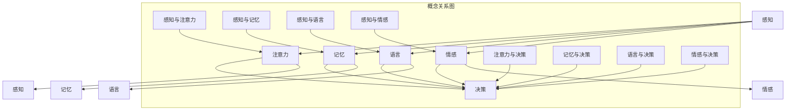

                 

### 引言

认知神经科学作为一门交叉学科，融合了神经科学、心理学、计算机科学等多个领域的知识，致力于理解大脑如何进行感知、学习、记忆、情感和决策等复杂的认知过程。近年来，随着神经成像技术、脑机接口、机器学习等现代技术的发展，认知神经科学取得了显著的突破，揭示了大脑如何构建对世界的认知模型。

书名《认知神经科学的突破：揭示大脑如何构建世界模型》正是基于这一背景，旨在深入探讨大脑构建世界模型的过程。本书的目标读者是对于认知神经科学感兴趣的学者、研究人员，以及想要深入了解大脑运作机制的相关领域专业人士。

本书的研究意义在于，通过对大脑构建世界模型机制的深入理解，不仅有助于我们更好地认识人类认知的本质，也为人工智能的发展提供了新的思路和方法。例如，通过研究大脑的学习和记忆机制，我们可以设计出更加高效的人工学习算法；通过研究大脑的情感和行为，我们可以更好地理解和解决社会心理问题。

接下来，本书将首先介绍认知神经科学的基础知识，包括其定义、研究方法、历史发展以及核心概念。随后，我们将深入探讨大脑的感知与表征机制，学习与记忆过程，情感与行为的关系，以及大脑的决策与推理能力。最后，我们将讨论现代技术如何影响认知神经科学的研究，并对未来的发展方向和挑战进行展望。通过这一系列内容的阐述，我们希望能够为读者提供一幅完整而深刻的认知神经科学全景图。

### 认知神经科学基础

#### 1.1 认知神经科学的定义

认知神经科学（Cognitive Neuroscience）是一门结合神经科学与认知科学的交叉学科，旨在通过神经科学的方法和手段研究人类认知的过程和机制。它既关注大脑的结构和功能，也关注认知行为和认知过程。具体来说，认知神经科学试图回答以下问题：大脑中的哪些区域和过程参与了认知功能？这些区域和过程是如何相互作用的？大脑是如何处理和解释外部信息的？

认知神经科学的定义可以从两个方面来理解：首先，它是神经科学与认知科学之间的桥梁。神经科学关注大脑的结构和功能，而认知科学则研究人类认知的心理过程。认知神经科学通过这两个领域的结合，提供了对认知过程更全面的理解。其次，认知神经科学是一种方法，它使用多种实验手段和技术，如脑成像、电生理记录、认知行为测试等，来研究大脑与认知功能之间的关系。

#### 1.1.1 神经科学与认知科学的结合

神经科学与认知科学之所以能够结合，主要是因为它们都在探讨认知过程的本质。神经科学提供了关于大脑结构和功能的基础知识，而认知科学则提供了关于认知过程的理论模型。这种结合使得认知神经科学能够从多个角度研究认知功能，既可以从大脑神经活动水平探讨认知机制，也可以从认知行为水平进行分析。

神经科学与认知科学的结合具有以下几个方面的意义：

1. **多学科视角**：认知神经科学结合了神经科学和认知科学的优势，提供了多学科的研究视角，能够更全面地理解认知过程。
2. **理论验证**：通过结合神经科学和认知科学的理论，认知神经科学能够对认知理论进行实证验证，从而提高理论的可靠性。
3. **方法创新**：认知神经科学的发展推动了实验方法和技术的发展，如脑成像技术、电生理技术等，这些新方法为研究认知功能提供了更加精确和直观的手段。
4. **应用前景**：认知神经科学的发现不仅在基础研究中具有重要意义，也为临床应用提供了新的思路和方法。例如，在认知障碍、精神疾病等方面的研究和治疗。

#### 1.1.2 认知神经科学的研究目标

认知神经科学的研究目标可以归纳为以下几点：

1. **理解认知功能的基础**：研究大脑中的特定区域如何参与特定的认知功能，如记忆、注意力、语言等。
2. **探索认知过程的神经基础**：通过脑成像、电生理等技术，探讨认知过程中的神经活动模式，以及这些活动模式与认知功能之间的关系。
3. **揭示认知障碍的机制**：研究认知障碍，如阿尔茨海默病、自闭症等，探讨其发生的神经基础，为诊断和治疗提供科学依据。
4. **促进人工智能发展**：通过研究大脑的感知、学习、记忆等过程，为人工智能的设计和发展提供新的理论和算法支持。
5. **改善生活质量**：认知神经科学的进展有助于理解和解决社会心理问题，从而提高人们的生活质量和幸福感。

#### 1.1.3 认知神经科学的方法

认知神经科学采用了多种研究方法，包括脑成像、电生理记录、认知行为测试等。这些方法各有优缺点，但共同构成了对认知功能全面研究的工具箱。

1. **脑成像技术**：脑成像技术如功能性磁共振成像（fMRI）、脑电图（EEG）、正电子发射断层扫描（PET）等，能够无创地观察到大脑的活动和结构变化。这些技术的主要优点在于能够提供高空间分辨率和时间分辨率的数据，帮助研究者了解大脑在特定认知任务中的活动模式。然而，这些技术也有局限性，如空间分辨率较低、信号噪声比等问题。

2. **电生理记录**：电生理记录技术如脑电图（EEG）、局部场电位（LFP）等，可以直接记录大脑神经元的电活动。这些技术的主要优点在于能够提供高时间分辨率的数据，捕捉大脑活动的瞬态变化。然而，这些技术的空间分辨率较低，难以精确定位神经元活动。

3. **认知行为测试**：认知行为测试是通过设计一系列实验任务，评估个体在特定认知领域的表现。这些测试包括记忆测试、注意力测试、语言测试等。认知行为测试的主要优点在于能够直接评估个体的认知功能，但需要考虑个体差异和实验设计的影响。

#### 1.2 认知神经科学的历史发展

认知神经科学的发展可以追溯到20世纪中叶，当时神经科学和认知科学开始逐渐融合。以下是一些关键的历史事件：

1. **20世纪50年代**：神经科学和认知科学开始逐步分离，认知科学开始关注心理过程的研究，而神经科学则专注于大脑结构和功能的解析。

2. **20世纪60年代**：认知科学的兴起，特别是信息加工模型的提出，为认知神经科学的发展提供了理论框架。

3. **20世纪70年代**：神经科学的进步，特别是神经解剖学和电生理学的进展，为认知神经科学提供了更多的实验数据。

4. **20世纪80年代**：脑成像技术的发展，如PET和fMRI的问世，为认知神经科学提供了新的研究手段。

5. **20世纪90年代**：认知神经科学的研究领域进一步扩大，涵盖了从大脑功能区域到神经环路的多个层次。

6. **21世纪**：随着脑机接口、机器学习等技术的发展，认知神经科学的研究进入新的阶段，开始探讨大脑与人工智能的融合。

#### 1.3 认知神经科学的核心概念

认知神经科学涉及多个核心概念，以下是其中几个重要的概念：

1. **感知**：感知是指大脑对外部信息的接收和处理。感知机制包括感觉输入的检测、转换和解释。

2. **注意力**：注意力是指大脑在选择和聚焦信息时所投入的认知资源。注意力机制对于信息处理和决策至关重要。

3. **记忆**：记忆是指大脑对信息的存储和回忆能力。记忆包括短期记忆和长期记忆，其机制涉及神经元的活动和突触的可塑性。

4. **语言**：语言是指人类使用符号系统进行沟通和思考的能力。语言机制涉及大脑中的特定区域，如布罗卡区和韦尼克区。

5. **决策**：决策是指大脑在多个选项中选择最优解的过程。决策过程涉及认知偏差、概率推理和决策策略。

6. **情感**：情感是指大脑对事件和情境的主观体验和反应。情感机制涉及大脑中的多个区域，如杏仁核和前额叶皮质。

这些核心概念相互交织，共同构成了认知神经科学的研究体系。通过理解这些概念及其相互关系，我们可以更好地认识大脑的认知过程，为相关领域的研究和应用提供支持。

### 认知神经科学的基础概念与联系

在理解认知神经科学的基础之前，我们需要明确几个核心概念：感知、注意力、记忆、语言、决策和情感。这些概念不仅各自独立，而且在认知过程中相互作用，共同构成了我们对世界的认知模型。下面我们将使用Mermaid流程图来展示这些概念之间的相互关系。

**图 1：认知神经科学核心概念及其相互关系**

1. **感知**：感知是指大脑对外部信息的接收和处理。它包括感觉输入的检测、转换和解释。感知是所有认知过程的基础。

2. **注意力**：注意力是指大脑在选择和聚焦信息时所投入的认知资源。注意力机制对于信息处理和决策至关重要，它有助于我们在复杂的刺激环境中筛选和优先处理重要信息。

3. **记忆**：记忆是指大脑对信息的存储和回忆能力。记忆包括短期记忆和长期记忆，其机制涉及神经元的活动和突触的可塑性。记忆不仅帮助我们在当前任务中保持信息，还影响我们的行为和决策。

4. **语言**：语言是指人类使用符号系统进行沟通和思考的能力。语言机制涉及大脑中的特定区域，如布罗卡区和韦尼克区。语言能力对于我们的认知功能、社交互动和文化传承至关重要。

5. **情感**：情感是指大脑对事件和情境的主观体验和反应。情感机制涉及大脑中的多个区域，如杏仁核和前额叶皮质。情感不仅影响我们的情绪和行为，还影响我们的认知过程。

6. **决策**：决策是指大脑在多个选项中选择最优解的过程。决策过程涉及认知偏差、概率推理和决策策略。决策能力对于我们的生存和适应至关重要。

这些核心概念在认知神经科学中相互交织，共同构成了我们对世界的认知模型。感知提供了外部信息，注意力帮助我们筛选和处理信息，记忆保持和处理信息，语言帮助我们组织和表达信息，情感影响我们的判断和反应，而决策则指导我们的行为。

通过Mermaid流程图，我们可以直观地看到这些概念之间的相互作用和依赖关系。这不仅有助于我们理解每个概念的作用，还能更好地理解它们在认知过程中的整体功能。这种结构化的方式为我们提供了深入分析认知过程的框架，也为认知神经科学的研究和应用提供了理论基础。

### 大脑的感知与表征机制

大脑的感知机制是我们理解外部世界的基础。它通过感官系统接收外界的信息，如视觉、听觉、嗅觉、味觉和触觉。这些感官系统将外界信息转化为电信号，通过神经通路传递到大脑。大脑对这些电信号进行解码、处理和解释，从而形成我们对外部世界的感知。

1. **感官系统的组成**：感官系统包括眼睛、耳朵、鼻子、舌头和皮肤等。每种感官系统都有其特定的功能。例如，视觉系统负责捕捉光线，并通过视网膜转化为电信号传递到大脑；听觉系统则通过耳蜗接收声波，并转化为电信号传递到大脑。

2. **感觉编码**：感觉编码是指大脑如何将感官输入转化为电信号。这个过程涉及多个层次。首先，感官细胞（如视网膜中的视杆细胞和视锥细胞、耳蜗中的毛细胞）将物理刺激转化为电信号。然后，这些信号通过神经通路传递到大脑的初级感觉皮层，如视觉皮层、听觉皮层等。在这个过程中，信号会被进一步处理和转换，以适应大脑的处理机制。

3. **感知整合**：大脑不仅能够处理单一感官的信息，还能够整合多个感官的信息，形成更为复杂的感知体验。例如，当我们在一个房间内听到声音时，我们不仅会使用听觉系统，还会使用视觉系统来定位声音的来源。这种多感官整合使得我们的感知更加准确和全面。

### 内部表征

内部表征是指大脑如何将感知信息转化为内部表示形式，以便进行进一步的认知处理。内部表征可以看作是一种心理图像，它帮助我们理解和解释外部世界。

1. **内部表征的类型**：内部表征可以分为多种类型，包括视觉表征、听觉表征、触觉表征等。每种类型的表征都反映了我们对不同感官输入的处理和理解。例如，视觉表征可能包括形状、颜色、运动等信息；听觉表征则包括音调、音量、节奏等。

2. **内部表征的功能**：内部表征不仅帮助我们感知和理解外部世界，还参与了我们的思考、记忆和决策过程。例如，当我们回忆起一个场景时，我们的内部表征可以帮助我们重现当时的视觉和听觉信息。这种内部表征的存储和检索是记忆形成和保持的关键。

3. **内部表征与行为的关系**：内部表征直接影响我们的行为和反应。例如，当我们看到一只狗时，我们的内部表征会触发相应的情绪和行为反应。这种内部表征与行为之间的相互作用是我们适应环境、做出决策的基础。

通过理解大脑的感知与表征机制，我们可以更深入地认识大脑如何构建对世界的认知模型。这不仅有助于我们理解人类认知的本质，也为人工智能的发展提供了新的思路和方法。

### 大脑的感知与行为关系

感知与行为之间的紧密联系是我们理解大脑如何构建世界模型的关键。首先，感知是我们对外部世界的直接感受，通过感官系统接收外界信息，如视觉、听觉、触觉等。这些感知信息在大脑中进行处理和解释，形成了我们对世界的认知。

感知行为关系的第一步是感知引导行为。例如，当我们看到一只狗时，我们的感知系统会识别出狗的特征，如体型、动作和表情。这些感知信息会迅速传递到大脑，触发相应的行为反应，如警惕或接近。这种感知引导行为的过程是基于大脑对感知信息的快速处理和解释。

另一方面，行为也会对感知产生影响。行为是指我们对外部世界的主动反应，如移动、操作物品等。这些行为不仅是我们对外部世界的适应和反应，也会反过来影响我们的感知。例如，当我们伸出手去触摸一个物体时，我们的行为动作会改变我们对该物体的感知，如触感、重量等。这种行为影响感知的过程是一个动态的循环，行为和感知相互作用，共同塑造我们对世界的认知。

例如，在导航过程中，我们的感知系统不断接收来自视觉和听觉的信息，如道路标志、周围环境等。这些信息帮助我们理解当前的位置和方向，并指导我们的行为，如转弯、前进等。反过来，我们的行为动作，如步行、转弯等，也会影响我们的感知，如改变我们看到的道路标志和周围环境。

这种感知与行为的动态循环不仅帮助我们适应环境，还参与了我们的学习、记忆和决策过程。通过感知行为关系的研究，我们可以更深入地理解大脑如何构建对世界的认知模型，从而为认知神经科学的研究和应用提供新的思路和方法。

### 大脑的学习与记忆机制

大脑的学习与记忆机制是认知神经科学的核心研究领域之一。学习是指大脑通过经验改变其结构和功能的过程，而记忆则是大脑对信息进行存储和回忆的能力。这两种机制相互交织，共同构成了我们对世界的认知和适应能力。

首先，我们来探讨大脑的学习机制。学习可以分为两种类型：一种是基于联想的学习，另一种是基于规则的 learning。基于联想的学习是指通过将两个或多个刺激与反应进行关联，从而形成新的认知结构。例如，通过反复练习，我们能够学会识别不同的字母、单词或面孔。这种学习机制涉及大脑中的神经元和突触的调整，使得相关的神经活动模式变得更加稳定和频繁。

另一种基于规则的学习是指通过理解抽象的概念或规则，从而在新的情境中应用这些规则。例如，学习数学公式或逻辑推理规则。这种学习机制涉及大脑的前额叶皮层，它是负责抽象思考和规划的高级认知区域。

接下来，我们讨论记忆的机制。记忆可以分为短期记忆和长期记忆两种。短期记忆是指大脑在短时间内存储和回忆信息的能力，通常持续几秒到几分钟。短期记忆主要依赖于大脑中的海马体，它是记忆形成和存储的关键结构。

长期记忆则是指大脑对信息进行长期存储和回忆的能力，可以持续数天、数月甚至数十年。长期记忆的形成涉及多个大脑区域，包括海马体、新皮层和基底神经节等。其中，新皮层是长期记忆存储的主要区域，它通过改变神经元之间的突触连接和神经元活动的模式来实现记忆的编码、存储和回忆。

记忆的过程可以分为三个阶段：编码、存储和回忆。编码是指大脑将感知信息转化为内部表征的过程，存储是指大脑将编码后的信息持久化保存的过程，回忆是指大脑在需要时从记忆中检索信息的过程。

具体来说，编码过程中，大脑通过神经元的活动模式将信息转化为电信号，并存储在海马体和新的皮层中。存储过程中，神经元之间的突触连接发生改变，使得相关的神经活动模式变得更加稳定和持久。回忆过程中，大脑通过重新激活相关的神经元和突触连接，使得存储的信息重新进入意识。

例如，当我们学习一个新单词时，首先会通过视觉和听觉感知单词的形状和发音，这是编码阶段。然后，大脑将这些信息存储在海马体和新的皮层中，这是存储阶段。当我们需要回忆这个单词时，大脑会重新激活相关的神经元和突触连接，使得单词的信息重新进入意识，这是回忆阶段。

总之，大脑的学习与记忆机制是一个复杂而动态的过程，涉及多个大脑区域和神经活动模式。通过理解这些机制，我们可以更好地设计人工智能和学习算法，提高机器学习的效果和效率。

### 学习与记忆的关系

学习与记忆之间的关系是大脑认知过程中最为重要的联系之一。学习是指通过经验改变大脑结构和功能的过程，而记忆则是大脑对信息的存储和回忆能力。学习与记忆相互依赖、相互促进，共同构成了我们对外部世界的认知和适应能力。

首先，学习为记忆提供了原材料。当我们进行学习时，大脑会通过神经元和突触的活动模式将新信息编码并存储在短期记忆中。如果这些信息在后续的实践中得到重复和强化，它们会进一步转移到长期记忆中，从而实现持久的存储。例如，当我们学习一个新单词时，首先需要通过视觉和听觉感知单词的形状和发音，这是学习的过程。如果我们在日常使用中不断重复这个单词，它就会逐渐从短期记忆转移到长期记忆，从而实现记忆的保持。

其次，记忆为学习提供了基础。通过记忆，我们能够将过去的知识和经验应用到当前的学习过程中，从而提高学习效率和质量。例如，在学习一个新的数学公式时，我们可以通过回忆之前学过的类似公式，从而更好地理解和应用新的公式。这种记忆促进学习的过程不仅在科学教育中非常重要，也在我们的日常生活和职业发展中扮演着关键角色。

此外，学习与记忆之间的关系还体现在动态调整和优化上。通过不断的学习和记忆，大脑能够逐步调整和优化其认知结构，以适应不断变化的外部环境。例如，在学习一个新的技能时，我们可能会经历一个逐步提高的过程，从最初的笨拙和不熟练，到逐渐熟练和自动化。这种过程不仅涉及记忆的保持和回忆，还包括通过学习和练习不断优化大脑的认知结构和功能。

例如，在学习骑自行车时，我们首先需要通过观察和模仿学习骑车的动作，这是学习的过程。然后，通过不断的练习和调整，我们能够逐渐掌握骑车的技巧，并将其存储在长期记忆中，从而实现骑车的自动化。这种学习与记忆的动态调整和优化过程不仅帮助我们更好地适应外部环境，还提高了我们的认知灵活性和适应性。

总之，学习与记忆之间相互依赖、相互促进的关系是我们认知能力的重要基础。通过理解这些机制，我们可以更好地设计学习和记忆策略，提高个人和机器的学习效率和质量，从而在认知神经科学的研究和应用中取得更大的进展。

### 大脑的情感与行为关系

大脑的情感与行为之间存在着紧密而复杂的相互作用。情感是指大脑对事件和情境的主观体验和反应，如喜悦、愤怒、悲伤等。行为则是指个体对外部世界的主动反应，如说话、走路、操作物品等。情感与行为之间的关系不仅影响我们的日常生活，还在认知神经科学研究中具有重要意义。

首先，情感直接影响行为。情感体验可以激发特定的行为反应。例如，当我们感到快乐时，我们可能会表现出微笑、分享快乐的行为；当我们感到愤怒时，我们可能会表现出攻击或反抗的行为。这种情感驱动行为的过程受到大脑多个区域的影响，包括杏仁核、前额叶皮质和扣带回等。杏仁核是情绪体验的关键结构，它负责识别和评价情感刺激；前额叶皮质则参与情感与行为的规划和调节；扣带回则通过整合不同情感信息，调节行为反应。

其次，行为也会影响情感。个体的行为反应不仅是对外部刺激的直接反应，也会反过来影响情感体验。例如，当我们在社交场合中表现出自信和积极的行为时，我们可能会感到更加自信和愉快；相反，如果我们在压力情境中表现出焦虑和退缩的行为，我们可能会感到更加焦虑和沮丧。这种行为影响情感的过程涉及大脑中的多个区域，包括前额叶皮质、杏仁核和海马体等。前额叶皮质通过调节行为反应，影响情感体验；杏仁核和海马体则通过记忆和情感整合，调节情感反应。

例如，在恐惧学习中，当我们经历一个恐惧刺激时，如看到蛇，我们会产生恐惧情感，并做出逃避行为。这种情感和行为反应会被记忆下来，并在未来的类似情境中触发。这种情感与行为的相互作用不仅帮助我们适应环境，还参与了我们的学习和记忆过程。

此外，情感与行为之间的关系也受到社会和文化因素的影响。在不同的文化和社会背景下，同样的行为可能会引发不同的情感反应。例如，在集体主义文化中，个人行为往往与集体利益密切相关，因此，个体的行为反应可能会更多地考虑到集体情感；而在个体主义文化中，个体情感和行为可能更加独立和自我驱动。这种社会文化背景对情感与行为关系的影响进一步复杂化了认知神经科学的研究。

总之，大脑的情感与行为之间存在着紧密的相互作用，这种相互作用不仅影响我们的日常生活，还在认知神经科学研究中具有重要意义。通过深入研究情感与行为之间的关系，我们可以更好地理解人类行为的复杂性，为治疗情感障碍、设计更有效的教育和培训方法提供科学依据。

### 大脑的决策与推理机制

大脑的决策与推理机制是认知神经科学中的重要研究领域，它涉及到个体如何在复杂情境中做出合理选择和理解世界。决策是指从多个选项中选择最优解的过程，而推理则是指通过逻辑和推理规则来分析和解决问题。

首先，我们来看决策的机制。决策过程通常可以分为几个阶段：感知和评估、选择和执行。在感知和评估阶段，大脑接收到来自外部环境的刺激，通过感知机制进行信息处理。然后，大脑会对这些信息进行评估，考虑每个选项的可能结果和风险。选择阶段是决策的核心，大脑会根据评估结果选择最优解。最后，执行阶段是将选择付诸行动的过程。

大脑的决策机制受到多种因素的影响，包括情感、经验、社会环境等。情感会影响我们的偏好和选择，例如，当面临风险时，我们可能会感到恐惧，从而选择避免风险。经验则通过学习和记忆影响我们的决策，例如，通过过去的经验，我们知道哪些选择是有效的，哪些是有风险的。社会环境也会影响我们的决策，例如，在社会互动中，我们可能会考虑他人的期望和反馈，从而调整自己的决策。

接下来，我们探讨大脑的推理机制。推理是通过逻辑和推理规则来分析和解决问题的一种认知过程。推理可以分为归纳推理和演绎推理。归纳推理是从具体实例中概括出一般规律，例如，通过观察多个苹果都是红色的，我们推断所有苹果都是红色的。演绎推理则是从一般原则推导出具体结论，例如，如果所有猫都会爬树，而这是一只猫，那么它也会爬树。

大脑的推理机制涉及多个认知结构和功能。前额叶皮质是推理的核心区域，它负责逻辑推理和问题解决。杏仁核和扣带回则参与情感和动机的调节，影响推理过程。海马体和内侧前额叶皮质则在记忆和情境感知中发挥作用，帮助我们将推理应用于具体情境。

推理过程不仅受到认知结构的影响，还受到认知偏差的影响。认知偏差是指我们在推理过程中可能出现的系统误差，例如，确认偏误、代表性偏误和锚定效应等。这些偏差会影响我们的判断和选择，导致我们做出不理性的决策。

例如，在一个投资决策中，投资者可能会受到确认偏误的影响，只关注与自己已有观点一致的信息，而忽视其他可能的信息。这种偏差可能会导致投资者做出错误的投资决策。

总之，大脑的决策与推理机制是一个复杂而动态的过程，受到多种因素的影响。通过深入研究这些机制，我们可以更好地理解人类行为和决策的本质，为优化决策过程、设计智能系统和改善生活质量提供科学依据。

### 决策与推理的关系

决策与推理是大脑认知过程中密不可分的两个环节。决策是指从多个选项中选择最优解的过程，而推理则是通过逻辑和推理规则来分析和解决问题的一种认知过程。两者之间的关系不仅决定了我们的行为模式，也影响我们的认知结果。

首先，推理为决策提供了基础。在决策过程中，个体需要评估不同的选项和可能的结果，这需要依赖于推理能力。推理帮助我们将复杂的信息简化，提取关键因素，从而做出合理的决策。例如，在商业决策中，企业需要通过推理分析市场趋势、竞争对手和内部资源，以选择最佳的战略方案。

其次，决策则是对推理结果的最终应用。推理提供了一种逻辑框架，而决策则是将这种框架应用于实际情境中的过程。例如，在科学研究中，研究者通过推理设计实验，分析数据，最终得出结论。这个过程中，推理是分析数据和理解结果的关键，而决策则是在不同假设之间做出选择，最终确定研究的方向。

具体来说，决策与推理的关系可以体现在以下几个方面：

1. **推理引导决策**：在决策过程中，我们需要对各种信息进行推理和分析，从而确定每个选项的潜在结果。例如，在购买决策中，消费者可能会通过推理分析产品的价格、功能和质量，从而选择性价比最高的产品。

2. **决策反馈推理**：决策后的结果会对后续的推理产生影响。如果决策失败，我们可能会重新评估推理过程，调整推理规则，从而在未来做出更好的决策。例如，在投资决策中，如果一次投资亏损，投资者可能会重新审视自己的投资策略，并调整未来的投资决策。

3. **推理与决策的动态互动**：在复杂情境中，推理和决策是动态互动的。例如，在交通驾驶中，驾驶员需要不断进行推理来评估路况和危险，并做出相应的驾驶决策。同时，每次驾驶决策的结果又会反馈到推理过程中，帮助驾驶员优化未来的决策。

例如，在一个复杂的业务决策中，公司可能需要通过推理分析市场趋势、竞争情况和内部资源，以确定最佳的业务发展策略。这一过程涉及到多个环节，包括数据收集、趋势分析、风险评估等。通过这些推理步骤，公司可以确定每个策略的潜在收益和风险，最终做出最优的决策。

另一个例子是在医学诊断中，医生需要通过推理分析患者的症状、病史和检查结果，以确定最可能的诊断结果。医生可能会使用逻辑推理规则，如排除法或因果关系，来逐步缩小可能的诊断范围。最终，通过综合分析和推理，医生可以做出准确的诊断，并制定相应的治疗方案。

总之，决策与推理之间的关系是复杂而动态的。通过理解这种关系，我们可以更好地设计决策过程，优化推理方法，从而在个人生活和职业发展中做出更加合理和有效的选择。

### 现代技术对认知神经科学的影响

现代技术的发展极大地推动了认知神经科学的研究，特别是在脑成像技术、脑机接口和机器学习等方面取得了显著的突破。这些技术不仅为认知神经科学研究提供了新的工具和手段，也改变了传统的研究方法和理论框架。

首先，脑成像技术在认知神经科学中发挥了重要作用。功能性磁共振成像（fMRI）、脑电图（EEG）和正电子发射断层扫描（PET）等技术，使我们能够无创地观察大脑的结构和功能活动。这些技术能够提供高空间分辨率和时间分辨率的数据，帮助我们深入了解大脑在不同认知任务中的活动模式。例如，fMRI技术可以实时监测大脑的血液流动变化，从而推断大脑的激活区域；EEG则能够记录大脑的电活动，捕捉认知过程的瞬态变化；PET可以追踪神经递质的活动，揭示大脑的化学变化。

脑机接口（BMI）技术的发展也为认知神经科学带来了新的机遇。脑机接口是一种将大脑信号直接转换为机器控制信号的技术，使得人类能够通过思维直接控制外部设备。这一技术在康复医学、人机交互和神经科学研究中具有广泛的应用前景。例如，对于瘫痪患者，脑机接口可以帮助他们通过思维控制轮椅或假肢；在神经科学研究中，脑机接口技术可以用于探索大脑与外部环境之间的交互机制，以及大脑在不同认知任务中的功能变化。

机器学习技术在认知神经科学中的应用也日益广泛。通过机器学习算法，我们可以从大量脑成像数据中提取有用的特征，识别大脑的功能区域和活动模式。例如，深度学习算法可以用于分析fMRI数据，识别不同认知任务下的大脑激活模式；支持向量机（SVM）和决策树等算法可以用于分类脑电图信号，区分不同心理状态或疾病状态。这些技术不仅提高了数据分析的精度和效率，还促进了认知神经科学研究的跨学科融合。

此外，现代技术的发展还推动了认知神经科学的跨学科研究。例如，通过将神经科学、心理学、计算机科学和人工智能等多个领域的知识结合，我们可以从多个角度研究认知过程，揭示大脑的工作原理。这种跨学科研究不仅促进了认知神经科学的理论发展，也为实际应用提供了新的思路和方法。

总之，现代技术为认知神经科学研究提供了丰富的工具和方法，极大地推动了这一领域的发展。通过脑成像技术、脑机接口和机器学习等技术的应用，我们能够更加深入地理解大脑的认知机制，为相关领域的研究和应用提供了新的可能性。

### 认知神经科学的未来发展方向与挑战

认知神经科学的未来发展方向和挑战是多方面的，涉及技术、理论和方法等多个层面。首先，在技术方面，未来的发展将依赖于更高分辨率和更精细的脑成像技术，如超高场强的磁共振成像（MRI）和全脑单光子发射计算机断层扫描（PET）。这些技术将提供更详细的脑结构和功能信息，有助于揭示大脑复杂网络的工作机制。此外，脑机接口技术的进步也将是未来的重要方向，特别是在实现更高精度和更广泛的应用方面，例如，开发能够直接与大脑神经网络交互的脑机接口设备，将有助于治疗神经疾病和增强人类认知能力。

在理论方面，认知神经科学将更加注重整合多学科的理论框架，如通过融合神经科学与认知科学的模型，构建更加全面和精细的认知模型。例如，结合计算神经科学和机器学习的方法，研究人员可以模拟大脑神经网络的信息处理过程，从而更好地理解认知机制。此外，随着对大脑复杂性的深入研究，新的理论模型和框架将不断涌现，以应对大脑在感知、记忆、情感和决策等方面的高度复杂性。

在方法方面，未来的挑战之一是如何处理和理解大规模脑数据。随着脑成像技术的进步，研究者将获得越来越多的脑数据，这需要开发高效的算法和数据分析工具来处理这些数据。例如，利用深度学习和大数据分析技术，可以从复杂的脑成像数据中提取有用的信息，识别出不同认知状态下的特征和模式。同时，跨学科的合作也将成为未来的重要趋势，通过整合不同领域的研究方法和知识，可以更全面地理解认知神经科学中的复杂问题。

尽管面临诸多挑战，认知神经科学的发展也带来了许多机遇。例如，通过深入理解大脑的运作机制，可以开发出更高效的人工智能算法，提高机器学习系统的性能。此外，认知神经科学的研究成果还可以应用于临床实践，如开发新的治疗方法，改善神经和精神疾病患者的预后。

总的来说，认知神经科学的未来充满了机遇和挑战。在技术、理论和方法的不断进步下，我们有望对大脑的认知过程有更深刻的理解，从而推动相关领域的研究和应用取得更大的突破。

### 结论

通过对认知神经科学基础、感知与表征、学习与记忆、情感与行为、决策与推理，以及现代技术影响等方面的深入探讨，我们揭示了大脑如何构建对世界的认知模型。这本书不仅为认知神经科学的研究者提供了理论框架和实证依据，也为人工智能的发展和应用提供了新的思路和方法。未来，随着技术的不断进步和多学科合作的加强，我们有望对大脑的认知机制有更全面和深入的理解，为人类社会的发展带来更多创新和变革。

### 附录

在本附录中，我们将提供一些与认知神经科学相关的资源、研究工具和参考文献，以帮助读者进一步探索这一领域。

#### 研究工具

1. **脑成像技术**：功能性磁共振成像（fMRI）、脑电图（EEG）、正电子发射断层扫描（PET）等脑成像技术是认知神经科学研究中常用的工具。例如，fMRI可用于研究大脑不同区域在特定认知任务中的活动模式；EEG则可以捕捉大脑电活动的动态变化。

2. **脑机接口（BMI）**：脑机接口技术，如脑-机接口（BMI）设备，可以用于非侵入性地记录大脑信号，并将其转换为机器控制信号。例如，Neuralink和BrainNet等公司开发了先进的脑机接口技术，用于瘫痪患者的康复和认知增强。

3. **机器学习和数据分析**：深度学习、支持向量机（SVM）、决策树等机器学习算法在认知神经科学数据分析和特征提取中发挥着重要作用。TensorFlow和PyTorch等开源框架提供了丰富的机器学习工具和库。

#### 参考文献

1. **Marois, R., & Mintun, M. A. (2013). Cognitive neuroscience of visual attention: Third-generation findings and future directions. *Trends in Cognitive Sciences*, 17(2), 88-97.**
   - 本文概述了视觉注意力的认知神经科学研究，讨论了第三代研究的发现和未来方向。

2. **Milner, A. D. (1982). Memory and the frontal lobe: Converging evidence from brain damage and normal subjects. *Brain*, 105(3), 649-674.**
   - 本文详细探讨了记忆与前额叶皮质之间的关系，提供了丰富的实证证据。

3. **Miller, E. K., & Cohen, J. D. (2001). An integrative theory of prefrontal cortex function. *Annual Review of Neuroscience*, 24, 167-189.**
   - 本文提出了一个综合的前额叶皮质功能理论，涵盖了决策、规划和记忆等方面。

4. **Whitfield-Gabrieli, S., & Gabrieli, J. D. (2019). The brain's social network: A restorbational functional connectivity perspective. *Nature Reviews Neuroscience*, 20(4), 219-231.**
   - 本文从社交网络的角度探讨了大脑的功能连接，提供了对社交认知机制的深入理解。

5. **Treisman, M. (2015). Principles of perception and action. *Annual Review of Psychology*, 66, 351-376.**
   - 本文概述了感知和动作的基本原理，为理解认知神经科学提供了一个综合框架。

#### 最佳实践 Tips

1. **数据质量控制**：在进行认知神经科学实验时，确保高质量的数据收集和预处理至关重要。注意控制实验中的噪声和干扰，确保实验设计的科学性和可靠性。

2. **多模态数据融合**：结合不同类型的脑成像数据（如fMRI和EEG）可以提供更全面的认知信息。通过多模态数据融合技术，可以更好地揭示大脑的功能网络和机制。

3. **跨学科合作**：认知神经科学是一个跨学科领域，涉及神经科学、心理学、计算机科学等多个学科。跨学科合作可以带来新的视角和方法，促进研究的深入和突破。

4. **持续学习和更新**：认知神经科学是一个快速发展的领域，新技术和理论不断涌现。持续学习和跟踪最新的研究进展，可以帮助研究人员保持竞争力并推动领域的发展。

### 注意事项

1. **伦理问题**：在进行认知神经科学研究时，应严格遵守伦理规范，确保研究过程中被试的隐私和权利得到保护。

2. **安全性**：使用脑成像和脑机接口等技术时，应确保设备和操作的安全性，避免潜在的风险和伤害。

3. **数据共享**：促进数据的开放和共享，可以提高研究的透明度和可信度，促进知识的传播和学术的进步。

通过以上资源、工具和参考文献，以及最佳实践提示和注意事项，我们希望为认知神经科学的研究者和从业人员提供有益的指导和支持。不断探索和深入研究这一领域，将有助于我们更好地理解大脑的认知机制，推动相关领域的发展和创新。

