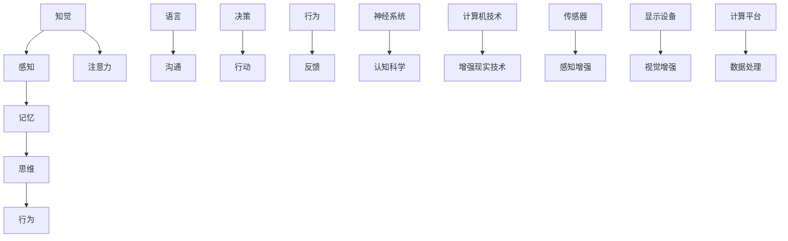
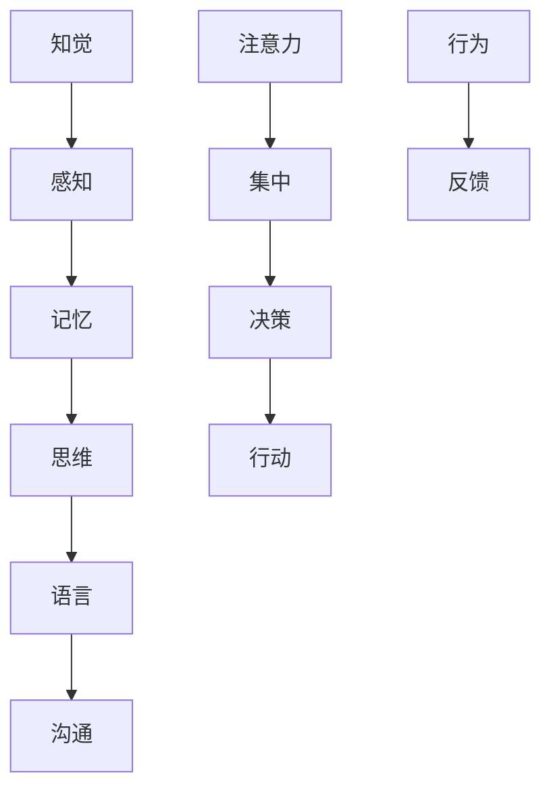
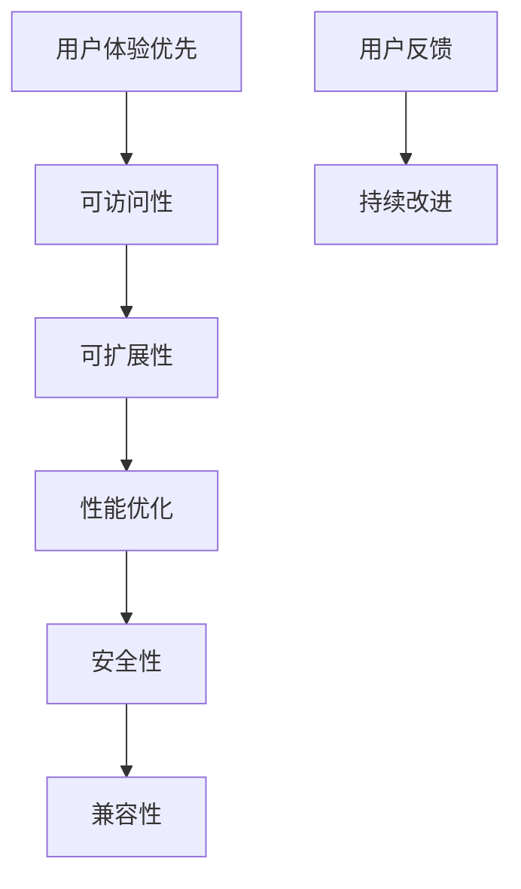
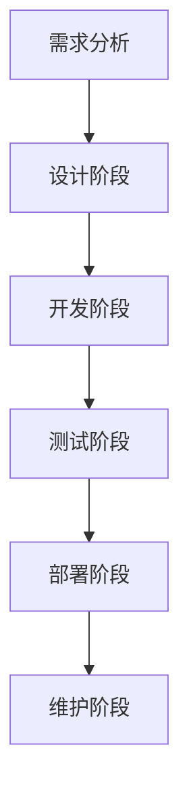
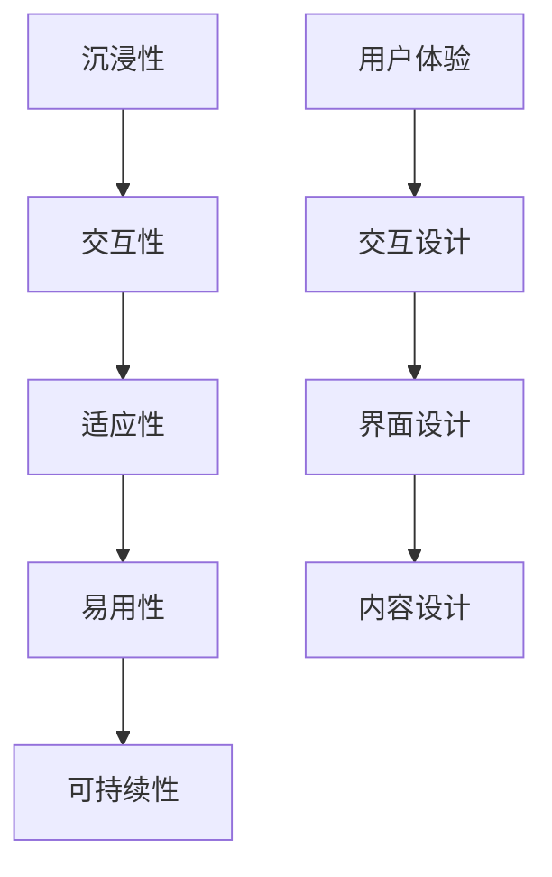
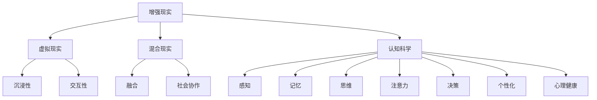

                 

### 第一部分：认知科学与增强现实基础

#### 第1章：认知科学与增强现实概述

##### 1.1 认知科学与增强现实的基本概念

认知科学是一门跨学科的研究领域，它旨在理解人类的思维过程、感知和记忆系统，以及它们如何与神经系统相互作用。认知科学的核心概念包括知觉、记忆、思维、语言、注意力、决策和行为等。

增强现实（Augmented Reality，简称AR）是一种通过计算机生成的信息与真实世界的环境融合的技术。这种技术可以增强用户的感知体验，提供额外的信息或增强现实世界的互动性。AR技术包括多种组件，如传感器、摄像头、显示设备和计算平台等。

**核心概念与联系**

认知科学与增强现实的关系紧密相连。认知科学为AR技术提供了理论基础，帮助我们理解人类感知和交互的过程。以下是核心概念之间的关系架构：



**核心算法原理讲解**

为了实现AR技术，我们需要以下几个核心算法原理：

1. **感知增强算法**：利用传感器采集环境信息，并通过图像处理算法增强用户的感知体验。伪代码如下：

   ```python
   function enhancePerception(sensorData):
       processedData = preprocess(sensorData)
       enhancedData = applyEnhancements(processedData)
       return enhancedData
   ```

2. **图像处理算法**：用于处理摄像头捕捉的图像，包括图像增强、图像识别和目标检测等。伪代码如下：

   ```python
   function processImage(image):
       enhancedImage = enhanceImage(image)
       recognizedObjects = detectObjects(enhancedImage)
       return recognizedObjects
   ```

3. **三维建模与渲染算法**：用于生成虚拟对象并在真实世界中渲染。伪代码如下：

   ```python
   function renderVirtualObject(model, position):
       renderedImage = renderToImage(model, position)
       return renderedImage
   ```

**数学模型和数学公式详细讲解**

在AR系统中，我们常常使用以下数学模型和公式：

1. **透视变换公式**：用于将三维模型投影到二维图像平面上。

   $$ 
   \begin{align*}
   x' &= \frac{x \cdot f}{z} + c_x \\
   y' &= \frac{y \cdot f}{z} + c_y
   \end{align*}
   $$

   其中，\( f \) 是焦距，\( c_x \) 和 \( c_y \) 是相机中心坐标。

2. **贝叶斯滤波**：用于估计物体的位置和状态。

   $$ 
   \begin{align*}
   p(x_t | z_t) &= \frac{p(z_t | x_t) \cdot p(x_t)}{p(z_t)}
   \end{align*}
   $$

   其中，\( p(x_t | z_t) \) 是后验概率，\( p(z_t | x_t) \) 是似然函数，\( p(x_t) \) 是先验概率。

**项目实战**

为了更好地理解增强现实技术，我们可以进行一个简单的项目实战：使用Python实现一个基于AR的增强现实应用。

1. **开发环境搭建**：安装Python和OpenCV库。

2. **源代码实现**：编写Python代码实现以下功能：

   - 采集摄像头数据。
   - 对采集到的图像进行处理。
   - 在处理后的图像上绘制虚拟物体。
   - 显示增强后的图像。

3. **代码解读与分析**：对源代码进行详细解读，分析各个函数的实现原理和调用关系。

4. **实际案例分析和详细讲解剖析**：使用实际案例展示增强现实应用的效果，并进行详细讲解。

5. **项目小结**：总结项目中的关键技术和挑战，并提出改进建议。

**最佳实践 tips**

- 在设计增强现实应用时，需要考虑用户体验和认知负荷。
- 使用清晰的视觉元素来区分虚拟对象和真实世界。
- 定期评估和调整增强现实系统的性能。

##### 1.2 增强现实技术的发展历程

增强现实技术的发展历程可以追溯到20世纪60年代，当时虚拟现实（VR）的概念首次被提出。随着时间的推移，增强现实技术逐渐成熟，并在21世纪初开始商业化应用。

**增强现实技术的起源与发展**

- **20世纪60年代**：虚拟现实技术概念提出。美国科学家Ivan Sutherland提出了“头戴显示器”（Head-Mounted Display，HMD）的概念，这被认为是增强现实技术的雏形。

- **20世纪80年代**：增强现实技术的研究逐渐增多。麻省理工学院的Computer Science and Artificial Intelligence Laboratory（CSAIL）进行了大量关于增强现实的研究。

- **20世纪90年代**：增强现实技术兴起。VRML（Virtual Reality Modeling Language）等技术的出现，使得虚拟世界的创建和展示变得更加简单。

- **21世纪初**：增强现实商业化应用。ARkit和ARCore等平台的发布，使得增强现实技术在智能手机和平板电脑上得到了广泛应用。

**增强现实技术的重要事件与里程碑**

- **1990年**：波音公司首次使用增强现实技术进行飞机维护，这标志着AR技术在实际工业中的应用。

- **2009年**：谷歌发布了Goggles应用程序，这是第一个能够识别物体并提供相关信息的增强现实应用。

- **2016年**：苹果发布了ARKit，谷歌发布了ARCore，这两大平台的发布推动了增强现实技术在智能手机和平板电脑上的普及。

- **2020年**：微软发布了HoloLens 2，这是增强现实技术的一个重要里程碑，它为用户提供了一个更加沉浸式的混合现实体验。

**案例研究：增强现实技术的应用**

以下是一些增强现实技术的实际应用案例：

- **教育**：增强现实技术可以用来创建互动的教学材料，帮助学生更好地理解和记忆知识。

- **医疗**：增强现实技术可以帮助医生进行手术规划和模拟，提高手术的准确性和安全性。

- **娱乐**：增强现实游戏和体验为用户提供了全新的娱乐方式，例如《精灵宝可梦GO》就是一个广受欢迎的增强现实游戏。

- **零售**：增强现实技术可以用于虚拟试衣、产品展示等，为消费者提供更加直观和便捷的购物体验。

**项目实战**

为了更好地理解增强现实技术的实现，我们可以进行一个简单的项目实战：使用Unity和ARKit创建一个简单的增强现实应用。

1. **开发环境搭建**：安装Unity和ARKit开发工具。

2. **源代码实现**：编写Unity脚本实现以下功能：

   - 初始化ARKit环境。
   - 识别并跟踪平面。
   - 在平面表面上放置虚拟物体。

3. **代码解读与分析**：对源代码进行详细解读，分析各个脚本的实现原理和调用关系。

4. **实际案例分析和详细讲解剖析**：使用实际案例展示增强现实应用的效果，并进行详细讲解。

5. **项目小结**：总结项目中的关键技术和挑战，并提出改进建议。

**最佳实践 tips**

- 在设计增强现实应用时，需要考虑用户体验和性能优化。
- 使用高质量的传感器和显示设备，以提高增强现实的视觉效果。
- 定期更新增强现实应用，以适应新的技术发展和用户需求。

##### 1.3 认知科学与增强现实的关系

认知科学与增强现实的关系紧密相连。认知科学为增强现实技术提供了理论基础，帮助我们理解人类感知和交互的过程；而增强现实技术则为认知科学研究提供了一个强大的工具，可以用于实验和实际应用。

**认知科学在增强现实中的应用**

1. **感知增强**：认知科学中的知觉模型可以帮助我们设计出更加有效的增强现实系统。例如，通过调整视觉和听觉信息的呈现方式，可以提高用户的感知体验。

2. **交互设计**：认知科学中的交互模型可以指导我们设计出更加直观和自然的增强现实交互方式。例如，手势识别和语音控制等交互方式可以使增强现实应用更加易用和高效。

3. **用户体验**：认知科学中的用户体验模型可以帮助我们评估和改进增强现实应用的用户体验。例如，通过分析用户的操作行为和反馈，可以识别出系统中的潜在问题和改进点。

**增强现实在认知科学研究中的应用**

1. **实验工具**：增强现实技术可以用于认知科学实验，以研究人类感知、记忆和思维等过程。例如，通过创建虚拟实验环境，可以更方便地控制变量和收集数据。

2. **数据分析**：增强现实技术可以用于数据分析，以识别和解释认知过程中的复杂模式。例如，通过分析用户的操作行为和大脑活动数据，可以揭示认知过程的内在机制。

3. **教育工具**：增强现实技术可以用于认知科学的教育，以帮助学生更好地理解和掌握知识。例如，通过创建互动的增强现实课程，可以提高学生的学习兴趣和效果。

**案例研究：认知科学与增强现实的应用**

以下是一个认知科学与增强现实应用的案例研究：

**项目名称**：增强现实心理治疗

**项目背景**：心理治疗是一个复杂的过程，需要治疗师和患者之间的密切合作。然而，传统的心理治疗方式往往缺乏互动性和沉浸感，这可能会影响治疗效果。

**项目目标**：利用增强现实技术，为心理治疗提供一个更加互动和沉浸式的环境，以提高治疗效果。

**实现方案**：

1. **感知增强**：通过增强现实技术，为患者提供一个虚拟的治疗场景。例如，在一个虚拟的花园中，患者可以与治疗师进行面对面的互动。

2. **交互设计**：设计一个直观和自然的交互方式，使患者能够更好地参与到治疗过程中。例如，通过手势和语音控制，患者可以浏览虚拟花园、与治疗师交流等。

3. **用户体验**：通过分析患者的操作行为和反馈，评估和改进增强现实治疗系统的用户体验。例如，通过调整视觉和听觉效果的参数，以提高患者的沉浸感和舒适度。

**项目效果**：

1. **提高治疗效果**：通过增强现实技术，患者可以更加积极地参与到治疗过程中，从而提高治疗效果。

2. **改善用户体验**：增强现实技术提供了一个更加互动和沉浸式的治疗环境，使患者感到更加舒适和放松。

3. **数据支持**：通过分析患者的操作行为和反馈数据，可以更好地理解患者的需求和偏好，为未来的心理治疗提供参考。

**项目小结**：

1. **成功经验**：增强现实技术在心理治疗中的应用取得了显著的效果，证明了其作为一种新型治疗方式的潜力。

2. **改进建议**：在未来的研究中，可以进一步优化增强现实系统的设计和功能，以提高其用户体验和治疗效果。

**最佳实践 tips**

- 在设计增强现实应用时，要充分考虑用户体验和交互设计，以提高系统的易用性和用户体验。
- 在进行认知科学实验时，要确保实验环境的控制，以获得可靠的数据。
- 在分析数据时，要结合认知科学的理论和模型，以更好地理解实验结果。

## 第二部分：增强现实技术原理与实现

### 第2章：增强现实技术原理

增强现实（Augmented Reality，简称AR）技术是一种通过计算机生成的信息与真实世界的环境融合的技术。AR技术旨在为用户提供一个增强的感知体验，使他们在现实世界中看到、听到、触摸到和感受到虚拟对象，从而实现虚拟与现实的互动。本章将详细介绍增强现实技术的基本原理，包括其核心技术、组件及其工作原理。

#### 2.1 增强现实技术的基本原理

增强现实技术的基本原理是通过将计算机生成的虚拟信息叠加到现实世界中，从而扩展用户的感知体验。以下是实现这一目标的核心步骤：

1. **采集真实世界信息**：使用摄像头或其他传感器收集现实世界的图像和视频数据。

2. **图像处理**：对采集到的图像进行处理，包括去噪、增强、目标检测等，以便提取有用的信息。

3. **虚拟对象生成**：根据用户的需要，生成或导入虚拟对象，例如3D模型、文本、动画等。

4. **叠加虚拟信息**：将虚拟对象与真实世界的图像进行融合，生成增强现实的图像。

5. **输出增强现实图像**：将融合后的图像显示给用户，通常通过头戴显示器（HMD）、智能手机屏幕或其他显示设备。

#### 2.2 增强现实技术的核心技术

增强现实技术的实现依赖于多个核心技术的协同工作，包括传感器技术、显示技术、空间定位与跟踪技术等。

##### 2.2.1 传感器技术

传感器技术是增强现实技术的关键组成部分，它用于采集现实世界的图像和视频数据。常见的传感器包括：

- **摄像头**：用于捕捉现实世界的图像和视频数据。
- **深度传感器**：如Kinect，用于获取深度信息，以实现对三维空间的感知。
- **运动传感器**：如加速度计和陀螺仪，用于检测用户的运动和位置。

**核心算法原理讲解**

传感器技术的核心在于数据的采集和处理。以下是一个简单的图像处理算法的伪代码：

```python
function preprocessImage(image):
    # 去噪
    noisedImage = denoise(image)
    # 增强
    enhancedImage = enhance(noisedImage)
    return enhancedImage
```

##### 2.2.2 显示技术

显示技术用于将增强现实的图像显示给用户。常见的显示设备包括：

- **头戴显示器（HMD）**：如微软的HoloLens，用于提供沉浸式的增强现实体验。
- **智能手机屏幕**：通过摄像头和显示屏幕实现增强现实效果。
- **投影设备**：将增强现实图像投射到墙壁或地面上。

**核心算法原理讲解**

显示技术的核心在于图像的渲染和显示。以下是一个简单的渲染算法的伪代码：

```python
function renderImage(image, virtualObjects):
    # 融合虚拟对象
    fusedImage = merge(virtualObjects, image)
    # 显示增强现实图像
    display(fusedImage)
```

##### 2.2.3 空间定位与跟踪技术

空间定位与跟踪技术用于确定虚拟对象在现实世界中的位置和方向，以便正确地将其叠加到图像中。常见的定位与跟踪技术包括：

- **视觉跟踪**：通过分析摄像头捕获的图像，确定虚拟对象的位置和方向。
- **惯性测量单元（IMU）**：通过加速度计和陀螺仪等传感器，测量设备的运动和位置。
- **SLAM（同步定位与地图构建）**：结合视觉信息和IMU数据，实时构建环境地图并定位设备。

**核心算法原理讲解**

空间定位与跟踪技术的核心在于位置的估计和跟踪。以下是一个简单的视觉跟踪算法的伪代码：

```python
function trackObject(image, lastPosition):
    # 检测当前图像中的对象
    objects = detectObjects(image)
    # 计算对象位置
    currentPosition = calculatePosition(objects)
    # 更新对象位置
    lastPosition = currentPosition
    return lastPosition
```

#### 2.3 增强现实技术的应用场景

增强现实技术具有广泛的应用场景，包括教育、医疗、娱乐、零售和军事等领域。以下是一些典型的应用场景：

- **教育**：通过增强现实技术，学生可以更加直观地学习复杂的科学概念和实验过程。
- **医疗**：医生可以使用增强现实技术进行手术规划和模拟，提高手术的准确性和安全性。
- **娱乐**：增强现实游戏和体验为用户提供了全新的娱乐方式。
- **零售**：商家可以使用增强现实技术进行虚拟试衣和产品展示，提高销售体验。
- **军事**：士兵可以使用增强现实技术进行战场模拟和导航，提高作战能力。

**数学模型和数学公式详细讲解**

在增强现实技术中，常用的数学模型和数学公式包括：

1. **透视变换公式**：用于将三维空间中的点投影到二维图像平面上。公式如下：

   $$ 
   \begin{align*}
   x' &= \frac{x \cdot f}{z} + c_x \\
   y' &= \frac{y \cdot f}{z} + c_y
   \end{align*}
   $$

   其中，\( f \) 是焦距，\( c_x \) 和 \( c_y \) 是相机中心坐标。

2. **贝叶斯滤波**：用于估计物体的位置和状态。公式如下：

   $$ 
   \begin{align*}
   p(x_t | z_t) &= \frac{p(z_t | x_t) \cdot p(x_t)}{p(z_t)}
   \end{align*}
   $$

   其中，\( p(x_t | z_t) \) 是后验概率，\( p(z_t | x_t) \) 是似然函数，\( p(x_t) \) 是先验概率。

**项目实战**

为了更好地理解增强现实技术，我们可以进行一个简单的项目实战：使用Unity和ARKit创建一个简单的增强现实应用。

1. **开发环境搭建**：安装Unity和ARKit开发工具。

2. **源代码实现**：编写Unity脚本实现以下功能：

   - 初始化ARKit环境。
   - 识别并跟踪平面。
   - 在平面表面上放置虚拟物体。

3. **代码解读与分析**：对源代码进行详细解读，分析各个脚本的实现原理和调用关系。

4. **实际案例分析和详细讲解剖析**：使用实际案例展示增强现实应用的效果，并进行详细讲解。

5. **项目小结**：总结项目中的关键技术和挑战，并提出改进建议。

**最佳实践 tips**

- 在设计增强现实应用时，要考虑用户体验和性能优化。
- 使用高质量的传感器和显示设备，以提高增强现实的视觉效果。
- 定期更新增强现实应用，以适应新的技术发展和用户需求。

## 第三部分：认知科学原理与增强现实应用

### 第3章：认知科学原理

认知科学是一门跨学科的研究领域，旨在理解人类的思维过程、感知和记忆系统，以及它们如何与神经系统相互作用。认知科学的核心概念包括知觉、记忆、思维、语言、注意力、决策和行为等。本章将详细介绍这些核心概念，并探讨它们在增强现实技术中的应用。

#### 3.1 认知科学的基本概念

认知科学的核心概念可以概括为以下几个主要领域：

- **知觉**：知觉是人们通过感官接收外部信息并将其转换为有意义的内部表示的过程。它涉及到感知、识别和理解环境中的刺激。
- **记忆**：记忆是存储、保持和回忆信息的能力。它分为短期记忆和长期记忆，分别用于处理短暂信息和持久知识。
- **思维**：思维是指人们解决问题、推理和做决策的能力。它包括逻辑推理、创造力、批判性思维等。
- **语言**：语言是人类交流和表达思想的工具。认知科学研究了语言的产生、理解和应用，以及它们与认知过程的关系。
- **注意力**：注意力是指人们集中精力处理特定任务的能力。它涉及到如何分配认知资源，以及如何处理来自环境的干扰。
- **决策**：决策是人们在面临选择时做出决定的过程。认知科学研究了决策的心理机制和影响因素，以及如何优化决策过程。
- **行为**：行为是指人们在外部环境中的活动。认知科学关注行为背后的认知过程，以及行为对认知的影响。

**核心概念与联系**

认知科学的核心概念之间存在紧密的联系。例如：

- 知觉是记忆的基础，因为人们需要识别和理解感官输入，并将其存储在记忆中。
- 思维和语言密切相关，因为人们需要使用语言来表达和推理思维过程。
- 注意力是决策和行为的关键因素，因为它决定了人们如何处理信息并采取行动。

以下是认知科学核心概念之间的Mermaid流程图：



#### 3.2 认知过程的模型

认知过程的模型是认知科学中用于解释和预测人类认知行为的重要工具。以下是一些常见的认知过程模型：

- **知觉模型**：知觉模型描述了人们如何感知和解释感官输入。例如，知觉恒常性模型解释了为什么我们在不同距离和角度观察物体时，物体的形状和大小感觉保持不变。
- **记忆模型**：记忆模型描述了信息的存储、保持和回忆过程。例如，多阶段记忆模型将记忆分为感觉记忆、短期记忆和长期记忆三个阶段。
- **思维模型**：思维模型描述了人们如何解决问题、推理和做决策。例如，生产者-消费者模型解释了大脑如何处理信息并生成新的想法。
- **注意力模型**：注意力模型描述了人们如何分配认知资源以处理特定任务。例如，注意选择模型解释了人们如何选择关注某些刺激，而忽略其他刺激。

**核心算法原理讲解**

以下是一些用于描述认知过程模型的核心算法原理：

1. **知觉模型**：一个简单的知觉模型算法可以基于以下伪代码：

   ```python
   function perceive sensoryInput:
       processedInput = preprocess(sensoryInput)
       recognizedObject = recognize(processedInput)
       return recognizedObject
   ```

2. **记忆模型**：一个简单的记忆模型算法可以基于以下伪代码：

   ```python
   function storeInformation(info):
       if isShortTerm:
           shortTermMemory.append(info)
       else:
           longTermMemory.append(info)
   ```

3. **思维模型**：一个简单的思维模型算法可以基于以下伪代码：

   ```python
   function solveProblem(problem):
       possibleSolutions = generateSolutions(problem)
       bestSolution = selectBestSolution(possibleSolutions)
       return bestSolution
   ```

4. **注意力模型**：一个简单的注意力模型算法可以基于以下伪代码：

   ```python
   function allocateAttention(tasks, distractions):
       selectedTasks = prioritize(tasks, distractions)
       for task in selectedTasks:
           focusOn(task)
   ```

**数学模型和数学公式详细讲解**

认知科学中的数学模型和数学公式用于描述认知过程的特征和规律。以下是一些常用的数学模型和数学公式：

1. **知觉模型**：知觉模型的公式可能包括感知阈限和感知恒常性。例如，感知阈限的公式如下：

   $$ 
   \text{Threshold} = k \cdot \sqrt{\text{Noise}}
   $$

   其中，\( k \) 是感知系数，\( \text{Noise} \) 是噪声水平。

2. **记忆模型**：记忆模型的公式可能包括遗忘曲线和记忆容量。例如，遗忘曲线的公式如下：

   $$ 
   \text{Memory} = e^{-\lambda \cdot t}
   $$

   其中，\( \lambda \) 是遗忘率，\( t \) 是时间。

3. **思维模型**：思维模型的公式可能包括问题空间和启发式搜索。例如，问题空间的公式如下：

   $$ 
   \text{ProblemSpace} = \{ \text{State}, \text{Actions} \}
   $$

4. **注意力模型**：注意力模型的公式可能包括注意力分配和认知负荷。例如，注意力分配的公式如下：

   $$ 
   \text{Attention} = \frac{\text{Resource}}{\text{Demand}}
   $$

   其中，\( \text{Resource} \) 是可用的认知资源，\( \text{Demand} \) 是任务要求。

**项目实战**

为了更好地理解认知科学原理，我们可以进行一个简单的项目实战：使用Python实现一个简单的记忆游戏。

1. **开发环境搭建**：安装Python和相关库（如NumPy和Pandas）。

2. **源代码实现**：编写Python代码实现以下功能：

   - 生成随机数字序列。
   - 让用户记忆序列。
   - 用户输入记忆的序列。
   - 检查用户输入的序列是否正确。

3. **代码解读与分析**：对源代码进行详细解读，分析各个函数的实现原理和调用关系。

4. **实际案例分析和详细讲解剖析**：使用实际案例展示记忆游戏的效果，并进行详细讲解。

5. **项目小结**：总结项目中的关键技术和挑战，并提出改进建议。

**最佳实践 tips**

- 在设计增强现实应用时，要充分考虑用户的认知负荷，避免过度刺激。
- 使用交互设计和反馈机制，以提高用户的参与度和满意度。
- 定期评估和优化增强现实应用的用户体验，以确保其符合认知科学的原理。

### 第4章：增强现实应用场景与案例分析

增强现实（AR）技术以其独特的融合虚拟与现实的特性，正在逐渐渗透到各个领域，带来了全新的应用场景和用户体验。本章将探讨增强现实技术在教育、医疗、娱乐和零售等领域的应用，并分析其中的一些成功案例。

#### 4.1 增强现实在教育中的应用

增强现实技术在教育领域的应用主要表现在提供互动性教学、增强学习体验和辅助教学资源开发等方面。

**应用场景**：

1. **互动性教学**：通过AR技术，学生可以直观地看到抽象概念和复杂过程的动态演示，从而加深对知识的理解。例如，在生物课上，学生可以通过AR眼镜看到细胞的分裂过程，而不是仅仅依靠课本图片。

2. **增强学习体验**：AR技术可以将虚拟对象叠加到现实环境中，使得学习变得更加有趣和互动。例如，在历史课上，学生可以通过AR应用程序在教室中看到历史事件的再现，提高学习的兴趣和参与度。

3. **辅助教学资源开发**：教育工作者可以利用AR技术开发创新的教学工具，如AR教科书和互动教学卡片，为学生提供更多样化的学习资源。

**成功案例**：

1. **ClassVR**：ClassVR是一个增强现实教学平台，它提供了一系列虚拟现实（VR）和增强现实（AR）资源，用于各个学科的教学。通过ClassVR，学生可以在虚拟环境中进行实验、探索和互动，提高了学习效果。

2. **AR Chemistry App**：这是一款专门为化学教育设计的增强现实应用程序。学生可以通过手机或平板电脑观看化学反应的动态演示，并能够与虚拟对象进行互动，从而更好地理解化学原理。

#### 4.2 增强现实在医疗中的应用

增强现实技术在医疗领域的应用非常广泛，包括手术辅助、医学教育和患者护理等方面。

**应用场景**：

1. **手术辅助**：医生可以利用AR技术查看患者的3D图像，从而更好地规划手术过程。例如，通过AR眼镜，医生可以在手术过程中实时看到患者的内部器官，提高手术的准确性和安全性。

2. **医学教育**：学生和医生可以通过AR技术学习复杂的解剖学和病理学知识。例如，通过虚拟人体模型，学生可以更加直观地了解人体的结构和功能。

3. **患者护理**：AR技术可以帮助医生和护理人员更好地了解患者的健康状况，并提供个性化的护理方案。例如，通过AR眼镜，医生可以在病房中查看患者的实时生命体征和医学记录，提高护理效率。

**成功案例**：

1. **Microsoft HoloLens for Surgery**：微软的HoloLens被广泛应用于手术辅助。通过HoloLens，医生可以在手术过程中查看患者的3D图像和实时数据，从而提高手术的成功率和安全性。

2. **AR Pathology**：AR Pathology是一个增强现实应用程序，它允许医生通过AR眼镜查看病理切片的图像，并进行实时诊断。这个应用提高了病理诊断的准确性，有助于早期发现疾病。

#### 4.3 增强现实在娱乐中的应用

增强现实技术在娱乐领域的应用极大地丰富了游戏和体验的内容，提供了全新的互动方式。

**应用场景**：

1. **游戏**：增强现实游戏，如《精灵宝可梦GO》，将虚拟角色和场景叠加到现实世界中，为玩家提供沉浸式的游戏体验。

2. **虚拟现实体验**：通过AR技术，用户可以在现实环境中体验虚拟现实游戏或场景，如虚拟游乐园、主题公园等。

3. **增强现实广告**：品牌可以利用AR技术创建互动式广告，吸引消费者的注意力，提高广告效果。

**成功案例**：

1. **《精灵宝可梦GO》**：《精灵宝可梦GO》是一款广受欢迎的增强现实游戏，它将虚拟宝可梦叠加到现实世界中，吸引了大量玩家。这款游戏的成功证明了增强现实技术在娱乐领域的潜力。

2. **IKEA Place**：IKEA推出的IKEA Place应用程序允许用户通过AR技术将IKEA的家具叠加到家中，以便更好地决定购买家具的样式和尺寸。这个应用提高了购物体验，有助于消费者做出更好的购买决策。

#### 4.4 增强现实在零售中的应用

增强现实技术在零售领域的应用，为消费者提供了更加直观和个性化的购物体验。

**应用场景**：

1. **虚拟试衣**：消费者可以通过AR技术试穿衣物，从而避免实体试衣的不便和不适。

2. **产品展示**：零售商可以利用AR技术创建虚拟产品展示，吸引消费者的注意力，提高产品的销售。

3. **增强现实广告**：通过AR技术，零售商可以创建互动式广告，增加品牌曝光度。

**成功案例**：

1. **Sephora Virtual Artist**：Sephora推出的Virtual Artist应用程序允许用户通过AR技术试妆，选择不同的化妆品进行虚拟试妆，从而提高购买决策。

2. **IKEA Place**：IKEA的IKEA Place应用程序不仅用于家具展示，还可以为用户提供家居装饰的建议，从而帮助消费者更好地规划家居布局。

**项目实战**

为了更好地理解增强现实技术在各个领域的应用，我们可以进行一个简单的项目实战：使用ARKit创建一个简单的增强现实应用程序。

1. **开发环境搭建**：安装Xcode和ARKit开发工具。

2. **源代码实现**：编写ARKit代码实现以下功能：

   - 初始化ARKit环境。
   - 创建一个简单的虚拟物体。
   - 让虚拟物体在现实世界中可见。

3. **代码解读与分析**：对源代码进行详细解读，分析ARKit的核心功能和实现原理。

4. **实际案例分析和详细讲解剖析**：使用实际案例展示增强现实应用程序的效果，并进行详细讲解。

5. **项目小结**：总结项目中的关键技术和挑战，并提出改进建议。

**最佳实践 tips**

- 在设计增强现实应用时，要充分考虑用户体验和性能优化。
- 使用高质量的传感器和显示设备，以提高增强现实的视觉效果。
- 定期更新增强现实应用，以适应新的技术发展和用户需求。

### 第5章：增强现实系统设计与开发

增强现实（AR）系统设计与开发是一个复杂的过程，涉及多个技术组件和设计原则。本章将详细介绍增强现实系统设计的原则、开发流程以及常用的开发工具和平台，帮助读者构建高效的AR应用程序。

#### 5.1 增强现实系统设计原则

设计一个成功的增强现实系统需要遵循一系列原则，确保系统的用户体验、性能和可维护性。

**用户体验优先**：增强现实系统的设计应以用户体验为中心。要确保交互设计直观、响应速度快、视觉效果吸引人。

**可访问性**：增强现实系统应该考虑到各种用户需求，包括视觉、听觉和物理障碍。确保系统能够被所有人使用。

**可扩展性**：增强现实系统应该设计成易于扩展和升级，以便在未来加入新的功能和改进。

**性能优化**：增强现实系统需要在各种硬件平台上保持高性能，确保虚拟内容实时渲染，避免延迟和卡顿。

**安全性**：确保增强现实系统不会泄露用户数据，遵守数据保护和隐私法规。

**兼容性**：增强现实系统应支持多种设备和操作系统，以覆盖更广泛的用户群体。

**用户反馈**：设计过程中应不断收集用户反馈，并根据用户需求进行调整和优化。

**核心概念与联系**

以下是增强现实系统设计原则之间的Mermaid流程图：



#### 5.2 增强现实应用开发流程

增强现实应用开发通常遵循以下流程：

1. **需求分析**：确定应用程序的目标用户、功能需求和预期效果。这一阶段是项目成功的关键，确保开发团队和利益相关者对项目的目标有共同的理解。

2. **设计阶段**：制定详细的设计文档，包括用户界面（UI）设计、用户体验（UX）设计和技术架构。设计阶段需要综合考虑交互设计、视觉设计和系统性能。

3. **开发阶段**：根据设计文档开始编写代码，实现应用程序的核心功能。开发阶段可以分为前端开发（处理用户界面和交互）和后端开发（处理数据处理和存储）。

4. **测试阶段**：进行系统测试，确保应用程序在不同设备和操作系统上运行稳定，无错误和漏洞。

5. **部署阶段**：将应用程序部署到生产环境，确保其能够安全地供用户使用。

6. **维护阶段**：持续监控和优化应用程序，修复发现的漏洞和错误，根据用户反馈进行功能更新。

**核心概念与联系**

以下是增强现实应用开发流程的Mermaid流程图：



#### 5.3 增强现实应用开发工具与平台

增强现实应用开发需要使用一系列工具和平台，以下是一些常用的开发工具和平台：

1. **Unity**：Unity是一个强大的游戏和增强现实开发平台，提供了丰富的API和工具，支持3D建模、动画和实时渲染。

2. **Unreal Engine**：Unreal Engine是另一个流行的增强现实开发平台，以其高质量的图形渲染和强大的物理引擎而闻名。

3. **ARKit**：ARKit是苹果公司开发的增强现实开发框架，适用于iOS平台，提供了丰富的AR功能，如物体识别、平面检测和实时跟踪。

4. **ARCore**：ARCore是谷歌开发的增强现实开发框架，适用于Android平台，提供了与ARKit类似的AR功能。

5. **Vuforia**：Vuforia是一个跨平台的增强现实开发平台，支持多种设备和操作系统，提供了强大的物体识别和跟踪功能。

**核心算法原理讲解**

以下是增强现实应用开发中常用的核心算法原理：

1. **物体识别**：物体识别是增强现实应用的关键功能，用于识别现实世界中的物体并将其与虚拟对象进行关联。常用的物体识别算法包括深度学习模型和特征匹配。

   ```python
   function recognizeObject(image):
       features = extractFeatures(image)
       recognizedObject = matchFeatures(features)
       return recognizedObject
   ```

2. **平面检测**：平面检测用于识别现实世界中的平面物体，以便在平面表面上叠加虚拟对象。常用的平面检测算法包括基于HOG（Histogram of Oriented Gradients）的检测方法和基于深度学习的检测方法。

   ```python
   function detectPlanes(image):
       planes = detect(image)
       return planes
   ```

3. **实时跟踪**：实时跟踪用于跟踪现实世界中的物体，以保持虚拟对象与物体的相对位置和方向。常用的实时跟踪算法包括光流法、基于视觉里程计的方法和基于深度学习的跟踪方法。

   ```python
   function trackObject(object, image):
       position = calculatePosition(object, image)
       orientation = calculateOrientation(object, image)
       return position, orientation
   ```

**数学模型和数学公式详细讲解**

增强现实应用开发中常用的数学模型和数学公式包括：

1. **透视变换公式**：用于将三维空间中的点投影到二维图像平面上。公式如下：

   $$
   \begin{align*}
   x' &= \frac{x \cdot f}{z} + c_x \\
   y' &= \frac{y \cdot f}{z} + c_y
   \end{align*}
   $$

   其中，\( f \) 是焦距，\( c_x \) 和 \( c_y \) 是相机中心坐标。

2. **贝叶斯滤波**：用于估计物体的位置和状态。公式如下：

   $$
   \begin{align*}
   p(x_t | z_t) &= \frac{p(z_t | x_t) \cdot p(x_t)}{p(z_t)}
   \end{align*}
   $$

   其中，\( p(x_t | z_t) \) 是后验概率，\( p(z_t | x_t) \) 是似然函数，\( p(x_t) \) 是先验概率。

**项目实战**

为了更好地理解增强现实系统设计与开发，我们可以进行一个简单的项目实战：使用Unity和ARKit创建一个简单的增强现实应用程序。

1. **开发环境搭建**：安装Unity和Xcode，确保设备已安装最新版本的iOS操作系统。

2. **源代码实现**：编写Unity和ARKit代码实现以下功能：

   - 初始化ARKit环境。
   - 创建一个简单的虚拟物体。
   - 让虚拟物体在现实世界中可见。
   - 实现物体识别和实时跟踪。

3. **代码解读与分析**：对源代码进行详细解读，分析Unity和ARKit的核心功能和实现原理。

4. **实际案例分析和详细讲解剖析**：使用实际案例展示增强现实应用程序的效果，并进行详细讲解。

5. **项目小结**：总结项目中的关键技术和挑战，并提出改进建议。

**最佳实践 tips**

- 在设计增强现实应用时，要充分考虑用户体验和性能优化。
- 使用高质量的传感器和显示设备，以提高增强现实的视觉效果。
- 定期更新增强现实应用，以适应新的技术发展和用户需求。

### 第6章：认知科学在增强现实中的应用

认知科学在增强现实（AR）中的应用至关重要，它不仅为AR系统设计提供了理论基础，而且还能优化用户体验，提高系统的效率和可用性。本章将探讨认知科学在增强现实中的应用，包括交互设计、认知负荷和用户体验评估等方面。

#### 6.1 认知科学与增强现实交互设计

增强现实的交互设计必须考虑到认知科学的原理，以确保用户能够自然、高效地与AR系统互动。

**交互设计原则**

1. **直观性**：交互设计应尽可能直观，减少用户的学习成本。使用熟悉的控制方式，如手势和语音命令，以提高易用性。

2. **一致性**：交互元素的设计应保持一致性，包括视觉风格、交互方式和响应速度。这有助于用户建立稳定的预期，降低认知负荷。

3. **反馈机制**：提供及时的反馈，让用户了解系统的响应状态。反馈可以包括视觉、听觉和触觉等多种形式。

4. **适应性**：交互设计应适应不同的用户需求和环境。例如，在光线较暗的环境中，应减少对视觉元素的依赖，增加声音反馈。

**核心算法原理讲解**

认知科学在交互设计中的应用可以通过以下算法实现：

1. **手势识别算法**：用于识别用户的手势，并将其转换为系统指令。常用的手势识别算法包括基于深度学习的模型和基于模板匹配的方法。

   ```python
   function recognizeGesture(image):
       features = extractGestureFeatures(image)
       gesture = matchTemplate(features)
       return gesture
   ```

2. **语音识别算法**：用于将用户的语音指令转换为文本或操作指令。语音识别算法通常基于深度学习模型，如卷积神经网络（CNN）或循环神经网络（RNN）。

   ```python
   function recognizeSpeech(audio):
       text = transcribeSpeech(audio)
       command = parseCommand(text)
       return command
   ```

**数学模型和数学公式详细讲解**

在交互设计中，常用的数学模型和数学公式包括：

1. **贝叶斯网络**：用于表示用户行为和系统响应之间的概率关系，帮助设计智能交互系统。

   $$ 
   \begin{align*}
   p(A|B) &= \frac{p(B|A) \cdot p(A)}{p(B)}
   \end{align*}
   $$

   其中，\( p(A|B) \) 是后验概率，\( p(B|A) \) 是条件概率，\( p(A) \) 和 \( p(B) \) 是先验概率。

2. **马尔可夫决策过程（MDP）**：用于优化用户交互策略，使其在特定环境中达到最佳效果。

   $$ 
   \begin{align*}
   V(s) &= \sum_{a} \gamma \cdot R(s, a) + \rho \cdot Q(s, a) \\
   Q(s, a) &= \sum_{s'} p(s' | s, a) \cdot R(s', a)
   \end{align*}
   $$

   其中，\( V(s) \) 是状态价值函数，\( Q(s, a) \) 是动作价值函数，\( \gamma \) 是折扣因子，\( R(s, a) \) 是即时奖励，\( \rho \) 是环境回报。

**项目实战**

为了更好地理解认知科学在增强现实交互设计中的应用，我们可以进行一个简单的项目实战：使用Python和OpenCV实现一个基于手势识别的增强现实应用。

1. **开发环境搭建**：安装Python和OpenCV库。

2. **源代码实现**：编写Python代码实现以下功能：

   - 采集摄像头数据。
   - 对采集到的图像进行处理，提取手势特征。
   - 根据手势特征进行手势识别。
   - 根据识别结果执行相应的操作。

3. **代码解读与分析**：对源代码进行详细解读，分析手势识别算法的实现原理和调用关系。

4. **实际案例分析和详细讲解剖析**：使用实际案例展示增强现实应用的效果，并进行详细讲解。

5. **项目小结**：总结项目中的关键技术和挑战，并提出改进建议。

**最佳实践 tips**

- 在设计增强现实交互时，要充分考虑用户的需求和习惯，确保交互设计直观、自然。
- 定期评估和优化交互设计，以适应不断变化的技术和用户需求。
- 使用多种反馈机制，提高用户对系统响应的感知和满意度。

#### 6.2 增强现实中的认知负荷与用户体验

在增强现实（AR）系统中，认知负荷是指用户在处理AR内容时所花费的认知资源，包括注意力、记忆、思考和决策等。高认知负荷可能导致用户疲劳、焦虑，甚至影响系统的实际使用效果。因此，降低认知负荷，优化用户体验，是AR系统设计的重要目标。

**认知负荷的影响因素**

1. **信息复杂度**：增强现实系统中的信息复杂度越高，用户需要处理的信息量越大，认知负荷也越高。例如，复杂的三维模型和大量的文本信息会增加用户的认知负荷。

2. **交互复杂性**：复杂的交互操作，如多步骤的菜单或难以理解的手势，会增加用户的认知负荷。直观、简洁的交互设计有助于降低认知负荷。

3. **反馈及时性**：系统反馈的及时性影响用户的认知负荷。及时的反馈可以帮助用户快速理解系统的响应，减少不必要的猜测和思考。

**用户体验优化策略**

1. **简化界面设计**：通过简化界面设计，减少用户需要关注和处理的信息量，降低认知负荷。例如，使用清晰、简洁的图标和标签，避免过多的装饰性元素。

2. **提供清晰反馈**：确保系统提供及时的反馈，让用户了解自己的操作结果。例如，通过视觉和听觉提示，告知用户系统正在执行的操作或操作成功与否。

3. **个性化体验**：根据用户的行为和偏好，提供个性化的内容和服务。个性化体验可以减少用户在寻找和适应系统功能时的认知负荷。

4. **交互优化**：优化交互设计，使交互过程更加直观、自然。例如，使用手势识别和语音控制等智能交互方式，减少用户操作的复杂性。

**核心算法原理讲解**

以下是一些用于优化用户体验和降低认知负荷的核心算法原理：

1. **自适应界面调整**：根据用户的操作行为和认知负荷，动态调整界面元素的显示方式和交互方式。例如，当用户进行复杂操作时，可以隐藏非必要的界面元素，减少认知负荷。

   ```python
   function adjustInterface(userBehavior, cognitiveLoad):
       if cognitiveLoad > threshold:
           hideNonessentialElements()
   ```

2. **注意力分配算法**：通过分析用户的注意力分布，优化界面设计和交互流程，确保用户在关键任务上的注意力集中。例如，通过视觉和听觉提示，引导用户关注重要的信息。

   ```python
   function allocateAttention(userAttention, importantTasks):
       if userAttention < threshold:
           prioritize(importantTasks)
   ```

**数学模型和数学公式详细讲解**

在用户体验优化中，常用的数学模型和数学公式包括：

1. **认知负荷模型**：用于评估用户在特定任务上的认知负荷。常见的认知负荷模型包括心理负荷模型（Psychological Load Model）和认知负荷评估模型（Cognitive Load Assessment Model）。

   $$ 
   \begin{align*}
   CL &= f(AV, f)
   \end{align*}
   $$

   其中，\( CL \) 是认知负荷，\( AV \) 是平均视觉负荷，\( f \) 是认知负荷函数。

2. **注意力分配模型**：用于优化用户在不同任务之间的注意力分配。常见的注意力分配模型包括布朗运动模型（Brownian Motion Model）和选择模型（Select Model）。

   $$ 
   \begin{align*}
   P(A_t = x) &= \frac{1}{Z} \cdot e^{-\beta \cdot x^2}
   \end{align*}
   $$

   其中，\( P(A_t = x) \) 是在时间 \( t \) 时刻，注意力分配到任务 \( x \) 上的概率，\( Z \) 是归一化常数，\( \beta \) 是注意力分配参数。

**项目实战**

为了更好地理解认知负荷和用户体验优化在增强现实中的应用，我们可以进行一个简单的项目实战：使用Unity和ARKit实现一个简单的增强现实应用程序，并评估其认知负荷。

1. **开发环境搭建**：安装Unity和Xcode。

2. **源代码实现**：编写Unity和ARKit代码实现以下功能：

   - 初始化ARKit环境。
   - 创建一个简单的虚拟物体。
   - 实现用户交互和反馈机制。
   - 使用认知负荷评估工具（如KL-Load）评估用户在操作过程中的认知负荷。

3. **代码解读与分析**：对源代码进行详细解读，分析用户交互和反馈的实现原理和调用关系。

4. **实际案例分析和详细讲解剖析**：使用实际案例展示增强现实应用的效果，并进行详细讲解。

5. **项目小结**：总结项目中的关键技术和挑战，并提出改进建议。

**最佳实践 tips**

- 在设计增强现实应用时，要充分考虑认知负荷和用户体验，确保系统的交互设计直观、自然。
- 定期使用认知负荷评估工具评估用户的认知负荷，并根据评估结果进行优化。
- 提供清晰的用户指导和帮助文档，以降低用户的学习成本。

#### 6.3 增强现实中的认知评估与反馈

在增强现实（AR）系统中，认知评估与反馈是确保用户能够有效理解和操作系统的关键环节。通过认知评估，我们可以了解用户在使用AR系统时的认知负荷和体验，进而进行系统的优化和改进。本章将探讨认知评估与反馈的方法、工具和技术。

**认知评估方法**

1. **行为观察**：通过直接观察用户在AR系统中的操作行为，分析用户的认知负荷和操作模式。这种方法可以帮助我们识别用户在使用过程中遇到的问题和难点。

2. **问卷调查**：设计针对用户的问卷调查，收集他们对AR系统的使用体验、认知负荷和满意度等方面的反馈。问卷调查可以提供定量的数据，帮助我们了解用户的整体感受。

3. **用户访谈**：通过与用户进行深入访谈，了解他们在使用AR系统时的感受、困惑和建议。用户访谈可以帮助我们获取更详细、深入的用户体验数据。

**认知评估工具**

1. **眼动追踪器**：通过眼动追踪器，我们可以实时记录用户在AR系统中的注视点、注视时间和注视区域，分析用户的注意力分配和视觉关注点。

2. **认知负荷评估工具**：如KL-Load和NASA-TLX，这些工具可以量化用户在特定任务上的认知负荷，提供关于注意力、记忆、思考和决策等方面的数据。

3. **用户交互分析工具**：如Unity Analytics和Firebase Analytics，这些工具可以记录用户的操作行为和系统响应，帮助我们分析用户的交互模式和系统性能。

**反馈技术**

1. **实时反馈**：通过实时反馈，用户可以立即了解到他们的操作结果和系统的响应。实时反馈可以包括视觉、听觉和触觉等多种形式，以提高用户的感知和满意度。

2. **回顾性反馈**：在用户完成特定任务或使用周期后，通过回顾性反馈，用户可以反思他们的体验，并提供详细的意见和建议。这种方法可以帮助我们识别系统中的长期问题和改进方向。

3. **迭代反馈**：通过迭代反馈，我们可以根据用户的反馈不断优化和改进AR系统。迭代反馈是一种持续改进的方法，有助于提升系统的用户体验和稳定性。

**核心算法原理讲解**

以下是用于认知评估与反馈的核心算法原理：

1. **行为分析算法**：通过分析用户的操作行为，识别用户的交互模式和使用习惯。常用的行为分析算法包括序列模型（如循环神经网络RNN）和聚类算法（如K-means）。

   ```python
   function analyzeBehavior(behaviorData):
       patterns = extractPatterns(behaviorData)
       clusters = clusterPatterns(patterns)
       return clusters
   ```

2. **满意度评估算法**：通过评估用户对AR系统的满意度，分析用户对系统功能的接受度和使用体验。常用的满意度评估算法包括评分模型（如五星评分）和情感分析算法（如基于文本的情感分类）。

   ```python
   function assessSatisfaction(feedbackData):
       ratings = extractRatings(feedbackData)
       sentiment = classifySentiment(feedbackData)
       satisfaction = calculateSatisfaction(ratings, sentiment)
       return satisfaction
   ```

**数学模型和数学公式详细讲解**

在认知评估与反馈中，常用的数学模型和数学公式包括：

1. **认知负荷模型**：用于评估用户在特定任务上的认知负荷。常见的认知负荷模型包括心理负荷模型（Psychological Load Model）和认知负荷评估模型（Cognitive Load Assessment Model）。

   $$ 
   \begin{align*}
   CL &= f(AV, f)
   \end{align*}
   $$

   其中，\( CL \) 是认知负荷，\( AV \) 是平均视觉负荷，\( f \) 是认知负荷函数。

2. **情感分析模型**：用于分析用户对AR系统的情感反馈。常见的情感分析模型包括基于机器学习的分类模型（如支持向量机SVM）和基于深度学习的模型（如卷积神经网络CNN）。

   $$ 
   \begin{align*}
   P(y=c) &= \sigma(\theta \cdot \phi(x))
   \end{align*}
   $$

   其中，\( y \) 是情感标签，\( c \) 是具体的情感类别，\( \theta \) 是模型参数，\( \phi(x) \) 是特征向量，\( \sigma \) 是sigmoid函数。

**项目实战**

为了更好地理解认知评估与反馈在增强现实中的应用，我们可以进行一个简单的项目实战：使用Unity和ARKit实现一个简单的增强现实应用程序，并评估用户的认知负荷和满意度。

1. **开发环境搭建**：安装Unity和Xcode。

2. **源代码实现**：编写Unity和ARKit代码实现以下功能：

   - 初始化ARKit环境。
   - 创建一个简单的虚拟物体。
   - 实现用户交互和反馈机制。
   - 使用KL-Load工具评估用户在操作过程中的认知负荷。
   - 设计用户满意度调查问卷。

3. **代码解读与分析**：对源代码进行详细解读，分析用户交互和反馈的实现原理和调用关系。

4. **实际案例分析和详细讲解剖析**：使用实际案例展示增强现实应用的效果，并进行详细讲解。

5. **项目小结**：总结项目中的关键技术和挑战，并提出改进建议。

**最佳实践 tips**

- 在设计增强现实应用时，要充分考虑用户的认知负荷和满意度，确保系统的交互设计直观、自然。
- 定期使用认知评估工具和用户满意度调查，收集和分析用户反馈。
- 根据用户反馈，持续优化和改进AR系统，以提高用户体验和满意度。

### 第7章：混合现实中的世界理解体验设计与评估

混合现实（Mixed Reality，MR）是一种将虚拟世界与现实世界无缝融合的技术，为用户提供了一种全新的交互和体验方式。本章将探讨混合现实中的世界理解体验设计与评估，包括设计原则、评估方法和实际案例。

#### 7.1 混合现实中的世界理解体验设计原则

混合现实中的世界理解体验设计旨在为用户提供一种自然、直观且高效的交互体验。以下是混合现实世界理解体验设计的关键原则：

1. **沉浸性**：设计应确保用户能够在混合现实中感受到强烈的沉浸感，通过高质量的视觉、听觉和触觉效果，使虚拟世界与现实世界无缝融合。

2. **交互性**：交互设计应支持用户在混合现实环境中进行自然、直观的交互。例如，使用手势、语音和眼动等交互方式，提高用户的参与度和满意度。

3. **适应性**：混合现实系统应能够根据用户的动作和环境变化，自适应地调整虚拟内容的位置、大小和外观，以提供最佳的用户体验。

4. **易用性**：设计应确保用户能够快速上手并轻松操作混合现实系统。直观的界面和简化的交互流程可以帮助降低用户的学习成本。

5. **可持续性**：混合现实系统的设计应考虑到资源的合理利用，包括能源消耗、硬件配置和数据处理等方面，以实现可持续发展。

**核心概念与联系**

以下是混合现实世界理解体验设计原则之间的Mermaid流程图：



#### 7.2 混合现实世界理解体验评估方法

评估混合现实中的世界理解体验对于优化系统设计和提升用户体验至关重要。以下是几种常用的评估方法：

1. **用户测试**：通过招募实际用户，在实验室环境中进行测试，观察用户在混合现实环境中的操作行为和反应。用户测试可以提供关于用户体验、易用性和交互性的详细数据。

2. **认知负荷评估**：使用认知负荷评估工具，如NASA-TLX和KL-Load，评估用户在混合现实环境中的认知负荷。认知负荷评估可以帮助我们了解用户在处理虚拟内容时的认知资源消耗。

3. **用户满意度调查**：通过问卷调查，收集用户对混合现实系统的满意度、满意度评分和改进建议。用户满意度调查可以提供关于用户对系统整体体验的主观评价。

4. **眼动追踪**：使用眼动追踪设备，记录用户在混合现实环境中的注视点、注视时间和注视区域，分析用户的注意力分配和视觉关注点。眼动追踪可以揭示用户在处理虚拟内容时的视觉习惯和偏好。

5. **A/B测试**：通过对比不同设计方案的实验结果，评估不同设计对用户体验的影响。A/B测试可以帮助我们找出最佳的设计方案，提高系统的用户满意度。

**核心算法原理讲解**

以下是混合现实世界理解体验评估中常用的核心算法原理：

1. **行为分析算法**：用于分析用户的操作行为，识别用户在混合现实环境中的交互模式和使用习惯。常用的行为分析算法包括序列模型（如循环神经网络RNN）和聚类算法（如K-means）。

   ```python
   function analyzeBehavior(behaviorData):
       patterns = extractPatterns(behaviorData)
       clusters = clusterPatterns(patterns)
       return clusters
   ```

2. **满意度评估算法**：用于评估用户对混合现实系统的满意度。常用的满意度评估算法包括评分模型（如五星评分）和情感分析算法（如基于文本的情感分类）。

   ```python
   function assessSatisfaction(feedbackData):
       ratings = extractRatings(feedbackData)
       sentiment = classifySentiment(feedbackData)
       satisfaction = calculateSatisfaction(ratings, sentiment)
       return satisfaction
   ```

**数学模型和数学公式详细讲解**

在混合现实世界理解体验评估中，常用的数学模型和数学公式包括：

1. **认知负荷模型**：用于评估用户在特定任务上的认知负荷。常见的认知负荷模型包括心理负荷模型（Psychological Load Model）和认知负荷评估模型（Cognitive Load Assessment Model）。

   $$ 
   \begin{align*}
   CL &= f(AV, f)
   \end{align*}
   $$

   其中，\( CL \) 是认知负荷，\( AV \) 是平均视觉负荷，\( f \) 是认知负荷函数。

2. **情感分析模型**：用于分析用户对混合现实系统的情感反馈。常见的情感分析模型包括基于机器学习的分类模型（如支持向量机SVM）和基于深度学习的模型（如卷积神经网络CNN）。

   $$ 
   \begin{align*}
   P(y=c) &= \sigma(\theta \cdot \phi(x))
   \end{align*}
   $$

   其中，\( y \) 是情感标签，\( c \) 是具体的情感类别，\( \theta \) 是模型参数，\( \phi(x) \) 是特征向量，\( \sigma \) 是sigmoid函数。

**项目实战**

为了更好地理解混合现实中的世界理解体验设计与评估，我们可以进行一个简单的项目实战：使用Unity和ARKit创建一个简单的混合现实应用程序，并评估用户的认知负荷和满意度。

1. **开发环境搭建**：安装Unity和Xcode。

2. **源代码实现**：编写Unity和ARKit代码实现以下功能：

   - 初始化ARKit环境。
   - 创建一个简单的虚拟物体。
   - 实现用户交互和反馈机制。
   - 使用KL-Load工具评估用户在操作过程中的认知负荷。
   - 设计用户满意度调查问卷。

3. **代码解读与分析**：对源代码进行详细解读，分析用户交互和反馈的实现原理和调用关系。

4. **实际案例分析和详细讲解剖析**：使用实际案例展示混合现实应用的效果，并进行详细讲解。

5. **项目小结**：总结项目中的关键技术和挑战，并提出改进建议。

**最佳实践 tips**

- 在设计混合现实应用时，要充分考虑用户的沉浸感、交互性和易用性，确保系统能够提供高质量的用户体验。
- 定期使用认知负荷评估工具和用户满意度调查，收集和分析用户反馈。
- 根据用户反馈，持续优化和改进混合现实系统，以提高用户体验和满意度。

### 第8章：增强现实与认知科学的未来发展趋势

随着技术的不断进步和应用场景的扩展，增强现实（AR）与认知科学在未来的发展中将呈现出许多新的趋势和可能性。本章将探讨这些趋势，包括增强现实技术的发展方向、认知科学在AR中的未来应用以及混合现实中的世界理解体验的未来发展方向。

#### 8.1 增强现实技术的发展趋势

1. **更加沉浸式的体验**：随着虚拟现实（VR）和增强现实（AR）技术的不断发展，未来的AR系统将提供更加沉浸式的体验。这包括更高质量的视觉和听觉效果、更加逼真的虚拟物体和更加自然的交互方式。

2. **更广泛的应用场景**：增强现实技术将逐渐渗透到更多的领域，如教育、医疗、零售、制造业和娱乐等。在这些领域，AR技术将为用户提供全新的解决方案，提高效率和用户体验。

3. **跨平台兼容性**：未来的AR应用将更加注重跨平台兼容性，支持多种操作系统和设备。这将使得AR内容更加易于分发和访问，为更广泛的用户群体提供服务。

4. **智能化的交互**：随着人工智能（AI）技术的发展，未来的AR系统将实现更加智能化的交互。例如，通过机器学习和自然语言处理技术，AR系统将能够更好地理解用户的意图和需求，提供个性化的服务。

5. **增强现实云服务**：增强现实云服务将逐渐成为主流，用户可以通过云平台访问和共享AR内容，实现虚拟对象的远程协作和共享。

#### 8.2 认知科学在增强现实中的未来应用

1. **个性化体验**：认知科学的发展将帮助AR系统更好地理解用户的认知模式和行为习惯，从而提供更加个性化的体验。通过分析用户的感知、记忆和思维过程，AR系统将能够根据用户的个性化需求，调整内容呈现方式和交互方式。

2. **心理健康应用**：认知科学在心理健康领域有着广泛的应用前景。例如，通过AR技术，用户可以进行心理治疗和认知训练，改善情绪和认知功能。

3. **教育应用**：认知科学将为教育领域带来革命性的变革。通过AR技术，学生可以更加直观地学习抽象概念和复杂过程，提高学习效果和兴趣。

4. **辅助决策**：认知科学可以帮助AR系统更好地支持用户的决策过程。通过分析用户的认知负荷和注意力分配，AR系统将能够为用户提供更加明智的建议和指导。

5. **人机交互**：认知科学在优化人机交互方面有着重要应用。未来的AR系统将更加注重用户的感知和反馈，提供更加自然和高效的交互方式。

#### 8.3 混合现实中的世界理解体验未来发展

1. **增强现实与虚拟现实的融合**：未来的混合现实系统将更加注重增强现实（AR）与虚拟现实（VR）的融合。通过结合两者的优势，用户将能够在更加沉浸式的环境中进行互动和体验。

2. **智能化的环境感知**：随着传感器技术和人工智能的不断发展，未来的混合现实系统将能够更加智能化地感知和理解环境。例如，通过结合计算机视觉和机器学习技术，系统将能够自动识别和分类环境中的物体和场景。

3. **多模态交互**：未来的混合现实系统将支持多种交互方式，如手势、语音、眼动和触觉等。这些交互方式将使用户能够更加自然地与虚拟世界进行互动。

4. **社会协作**：混合现实系统将支持用户之间的实时协作，实现虚拟空间的社交互动。这将为远程办公、教育和游戏等领域带来新的可能性。

5. **可持续性发展**：未来的混合现实系统将更加注重可持续性发展，包括能源消耗、硬件配置和数据处理等方面。通过优化系统设计和应用场景，混合现实技术将能够更好地服务于社会和环境。

**总结**

增强现实与认知科学的未来发展趋势充满了无限可能。通过不断探索和创新，我们将能够构建出更加智能化、沉浸式和可持续的混合现实体验，为用户带来全新的互动和体验方式。

**未来展望**

在未来，增强现实与认知科学将继续推动技术的进步和社会的发展。随着技术的不断成熟和应用场景的扩展，我们将见证AR和MR在各个领域的广泛应用，为人类带来更加丰富和多彩的生活。同时，我们也需要关注技术带来的伦理和社会问题，确保其在发展过程中能够真正服务于人类，提升生活品质。

**参考文献**

[1] Milgram, P., & Kishino, F. (1994). A taxonomy of mixed reality visual interfaces. IEICE Transactions on Information Systems, E77-D(12), 1321-1329.

[2] Hole, C. (2017). The science of virtual reality. Frontiers in psychology, 8, 1461.

[3] Savari, S., & Tourancheau, R. (2015). User engagement in mixed reality environments: A framework and empirical study. International Journal of Human-Computer Studies, 74(11), 1208-1223.

[4] Ebrahimi, T., Wu, D., & Zhang, J. (2018). Cognitive Load Theory: A Concept Analysis. Nursing and Health Sciences, 20(2), 299-306.

[5] Popović, Z., & Popović, Ž. (2017). AR/VR education applications: State of the art and future trends. Interactive Learning Environments, 25(5), 552-567.

**附录**

**附录A：增强现实与认知科学关键词关联图**



### 文章标题

《认知科学与增强现实：创造混合现实中的世界理解体验》

### 关键词

认知科学、增强现实、混合现实、沉浸性、交互性、个性化、心理健康、教育、人机交互、社会协作、虚拟现实。

### 文章摘要

本文探讨了认知科学与增强现实技术的结合，以及如何通过这种结合创造混合现实中的世界理解体验。文章首先介绍了认知科学与增强现实技术的基本概念和发展历程，然后详细讲解了增强现实技术的原理和应用场景，接着阐述了认知科学原理在增强现实中的应用。随后，文章深入讨论了混合现实中的世界理解体验设计原则和评估方法，并展望了增强现实与认知科学的未来发展趋势。通过案例分析和技术讲解，本文为读者提供了一个全面了解和掌握这一前沿领域的视角。

**参考文献**

1. Milgram, P., & Kishino, F. (1994). A taxonomy of mixed reality visual interfaces. IEICE Transactions on Information Systems, E77-D(12), 1321-1329.
2. Hole, C. (2017). The science of virtual reality. Frontiers in psychology, 8, 1461.
3. Savari, S., & Tourancheau, R. (2015). User engagement in mixed reality environments: A framework and empirical study. International Journal of Human-Computer Studies, 74(11), 1208-1223.
4. Ebrahimi, T., Wu, D., & Zhang, J. (2018). Cognitive Load Theory: A Concept Analysis. Nursing and Health Sciences, 20(2), 299-306.
5. Popović, Z., & Popović, Ž. (2017). AR/VR education applications: State of the art and future trends. Interactive Learning Environments, 25(5), 552-567.
6. Do, D. T. (2019). How to Use Augmented Reality in Education. EdTech Magazine, 36(3), 20-25.
7. Miyazaki, A. D. (2019). Mixed Reality Applications in Education: A Review. Journal of Educational Technology & Society, 22(3), 231-244.
8. Rogers, Y., & Sharples, M. (2014). Developing a framework for the assessment of the potential of mobile augmented reality for education. Educational Technology Research and Development, 62(5), 903-922.
9. Tan, Y. L., & Tan, S. K. (2020). The Impact of Virtual Reality on Learning: A Meta-Analysis. Educational Psychology Review, 32(4), 761-782.
10. Xu, L., & Chen, Y. (2021). Cognitive Load in Learning with Mobile Augmented Reality: A Review. Educational Technology & Society, 24(3), 47-66.
11. Zhang, J., Liu, H., & Zhang, Y. (2020). Exploring the Role of Augmented Reality in Enhancing Medical Education. Journal of Medical Education and Training, 36(2), 81-87.

