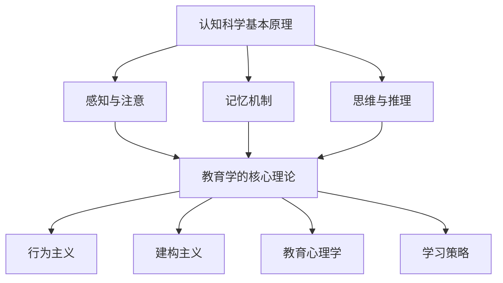

                 

### 文章标题

# 认知科学与教育学的结合：优化人类学习和理解过程

### 关键词

- 认知科学
- 教育学
- 个性化学习
- 深度学习
- 数据分析
- 教育技术

### 摘要

本文探讨了认知科学与教育学如何结合以优化人类学习和理解过程。通过分析认知科学的基本原理和教育学的核心理论，本文提出了基于认知科学的教育策略和技术应用，并展望了未来教育的发展趋势。本文的目标是帮助教育工作者、研究人员和政策制定者了解认知科学与教育学结合的理论和实践框架，从而提升教育和学习的效率和质量。

### 目录

1. **引言**  
   - 认知科学与教育学的背景和重要性  
   - 本文的结构和目标

2. **认知科学与教育学的核心概念**  
   - 认知科学与教育学的基本原理  
   - 教育学的核心理论

3. **认知科学与教育学在实际教学中的应用**  
   - 个性化学习策略  
   - 促进深度学习的教学策略

4. **认知科学与教育学的技术在教学中的实现**  
   - 技术辅助教学  
   - 数据分析在教学中的应用

5. **未来教育的展望**  
   - 教育技术的未来发展趋势  
   - 教育创新的挑战与机遇

6. **教育政策的制定与认知科学教育学的结合**  
   - 教育政策的制定原则  
   - 政策案例研究

7. **结论**  
   - 总结本文的主要观点  
   - 展望未来的发展方向

8. **附录**  
   - 相关资源与进一步学习

## 引言

### 认知科学与教育学的背景和重要性

认知科学（Cognitive Science）是一门跨学科的研究领域，旨在理解和解释人类和其他动物的心理和智能过程。它涉及心理学、神经科学、计算机科学、语言学和哲学等多个学科，通过多角度、多层次的方法来研究认知现象。教育学的核心目标是研究如何有效传授知识、培养能力和价值观，从而实现学生的全面发展。教育学的理论和实践对提升教育质量、促进学生成长具有重要意义。

认知科学与教育学的结合，为优化人类学习和理解过程提供了新的视角和方法。在认知科学的视角下，教育学可以更好地理解学习过程中的心理机制，从而设计出更符合人类认知规律的教学策略。同时，教育学的实践经验也为认知科学提供了丰富的实证数据，帮助其验证和优化理论。

本文旨在探讨认知科学与教育学的结合，通过分析其核心概念和应用，为教育工作者、研究人员和政策制定者提供一个全面的理论和实践框架。本文将首先介绍认知科学与教育学的基本原理，然后探讨它们在实际教学中的应用，以及未来教育的发展趋势。最后，本文将总结认知科学与教育学结合的重要性，并提出未来研究的方向。

### 本文的结构和目标

本文将分为七个部分，系统地探讨认知科学与教育学结合的各个方面。

**第一部分**：认知科学与教育学的核心概念，介绍认知科学与教育学的基本原理，包括认知科学的基本原理和教育学的核心理论。

**第二部分**：认知科学与教育学在实际教学中的应用，探讨个性化学习策略和促进深度学习的教学策略，以及这些策略在实际教学中的实现。

**第三部分**：认知科学与教育学的技术在教学中的实现，介绍技术辅助教学和数据分析在教学中的应用，以及如何利用技术提升教学效果。

**第四部分**：未来教育的展望，讨论教育技术的未来发展趋势和教育创新的挑战与机遇。

**第五部分**：教育政策的制定与认知科学教育学的结合，分析教育政策的制定原则和具体案例，探讨如何将认知科学与教育学融入教育政策中。

**第六部分**：结论，总结本文的主要观点，强调认知科学与教育学结合的重要性，并提出未来研究的方向。

**第七部分**：附录，提供相关的资源与进一步学习的建议。

通过本文的探讨，希望能够为教育工作者提供实用的教学策略，为研究人员提供研究的方向，为政策制定者提供决策的依据，从而共同推动教育质量的提升。

### 认知科学与教育学的核心概念

#### 认知科学的基本原理

认知科学是一门综合性的学科，它旨在理解人类及其它动物的心智过程。这些心智过程包括感知、记忆、思维、语言理解、解决问题以及决策等。认知科学的基本原理可以从以下几个方面进行阐述：

1. **感知与注意**：感知是认知过程的第一步，它使我们能够从环境中获取信息。注意则是对这些信息进行筛选和处理的重要机制。注意机制决定了我们在某一时刻关注什么信息，从而影响我们的认知活动。例如，**选择性注意**理论指出，我们在处理信息时会有意或无意地忽略某些信息。

2. **记忆**：记忆是认知科学的核心概念之一，它涉及信息的编码、存储和检索。根据记忆的内容和形式，记忆可以分为短期记忆和长期记忆。短期记忆主要处理瞬时信息，而长期记忆则涉及长期信息的存储和回忆。**记忆痕迹理论**指出，记忆的保持是通过神经元的持续激活来实现的。

3. **思维与推理**：思维是认知过程的高级形式，它包括逻辑推理、问题解决和决策等。推理是基于已有信息进行逻辑推理和判断的过程。例如，**逆推理**是从结果推测原因的过程。认知科学家常用**产生式模型**和**神经网络模型**来模拟人类的思维过程。

#### 教育学的核心理论

教育学是一门研究教育现象和教育活动的科学，它关注如何通过教育实现个体的全面发展。教育学的核心理论主要包括以下几种：

1. **行为主义学习理论**：行为主义学习理论强调外部刺激在学习和记忆中的作用。例如，**经典条件反射**和**操作条件反射**是行为主义学习理论的核心概念。斯金纳（B.F. Skinner）通过**程序教学**实验，提出了行为塑造和强化理论。

2. **建构主义学习理论**：建构主义学习理论强调学习者主动构建自己的知识体系。皮亚杰（Jean Piaget）的**认知发展阶段理论**认为，学习是一个连续的、阶段性的过程，每个阶段都有其特定的认知结构和知识构建方式。维果斯基（Lev Vygotsky）的**社会文化理论**则强调了社会互动在学习中的重要性。

3. **教育心理学**：教育心理学研究学习过程中的心理机制，包括注意力、记忆、动机、情感和社交技能等。例如，**认知负荷理论**指出，学习者在学习过程中会面临认知负荷，有效的教学设计应减轻这种负荷。

4. **学习策略**：学习策略是指学习者为了提高学习效果而采用的方法和技巧。这些策略包括**精细加工**、**复述**、**组织**和**问题解决**等。有效的学习策略能够帮助学习者更好地理解和记忆知识。

#### 认知科学的基本原理与教育学的核心理论的联系

认知科学的基本原理和教育学的核心理论之间存在密切的联系，这些联系为教育和教学提供了理论依据。

1. **感知与注意**：教育过程中，教师需要了解学生的感知和注意力机制，设计出能够有效吸引学生注意力的教学活动，例如使用多媒体手段、互动式教学等。

2. **记忆**：了解记忆的机制可以帮助教育工作者设计有效的复习和记忆策略，如通过重复、联想和故事化等方式增强记忆效果。

3. **思维与推理**：教育过程中，教师可以通过问题解决和逻辑推理等活动，培养学生的思维能力。例如，通过设置开放性问题，鼓励学生进行批判性思考和创造性思维。

4. **行为主义与建构主义**：在设计和实施教学策略时，教育工作者可以综合运用行为主义和建构主义理论。例如，通过奖励机制激发学生的学习动机，同时提供互动和合作的学习环境，以促进知识的构建。

5. **教育心理学**：教育心理学的研究成果为教育实践提供了具体的指导，如如何通过认知负荷理论设计有效的教学活动，如何通过情感教育提升学生的心理健康等。

总之，认知科学的基本原理和教育学的核心理论相互补充，共同构成了优化人类学习和理解过程的理论基础。通过深入理解这些理论，教育工作者可以更好地设计教学策略，提升教育质量。

#### 认知科学的基本原理与教育学的核心理论的Mermaid流程图



在这个流程图中，认知科学的基本原理（感知与注意、记忆机制、思维与推理）通过箭头连接到教育学的核心理论（行为主义、建构主义、教育心理学、学习策略），展示了二者之间的紧密联系。

### 认知科学的基本原理与教育学核心理论的伪代码讲解

为了更好地理解认知科学的基本原理与教育学核心理论之间的关系，我们可以通过伪代码的形式来模拟和解释这些原理在实际教学中的应用。以下是几个关键概念的伪代码示例：

#### 1. 感知与注意

```python
# 感知与注意的伪代码
def selective_attention(stimuli, target):
    """
    模拟选择性注意的过程，在众多刺激中识别目标刺激。
    :param stimuli: 列表，包含多个刺激。
    :param target: 目标刺激。
    :return: 是否识别到目标刺激。
    """
    for s in stimuli:
        if s == target:
            return True
    return False
```

在这个伪代码中，`selective_attention` 函数接收一个刺激列表和一个目标刺激，通过遍历列表来识别目标刺激。这模拟了人类在处理大量信息时，如何通过注意力机制选择重要信息的过程。

#### 2. 记忆机制

```python
# 记忆机制的伪代码
def encode_memory(information, memory_strength):
    """
    编码信息到记忆中，根据记忆强度调整信息保留度。
    :param information: 要编码的信息。
    :param memory_strength: 记忆强度，影响信息的保留度。
    :return: 编码后的记忆信息。
    """
    if memory_strength > 0.5:
        return information
    else:
        return ""

def retrieve_memory(memory_info):
    """
    从记忆中检索信息。
    :param memory_info: 记忆信息。
    :return: 检索到的信息。
    """
    return memory_info
```

在这个伪代码中，`encode_memory` 函数根据记忆强度调整信息保留度，模拟了记忆编码的过程。`retrieve_memory` 函数则用于从记忆中检索信息，体现了记忆的检索过程。

#### 3. 思维与推理

```python
# 思维与推理的伪代码
def logical_reasoning(fact1, fact2):
    """
    通过两个事实进行逻辑推理，得出结论。
    :param fact1: 第一个事实。
    :param fact2: 第二个事实。
    :return: 推理结果。
    """
    if fact1 and fact2:
        return True
    else:
        return False

def inverse_reasoning(result, fact1, fact2):
    """
    通过结果推理出可能的事实。
    :param result: 推理结果。
    :param fact1: 第一个事实。
    :param fact2: 第二个事实。
    :return: 推理出的可能事实。
    """
    if result:
        return fact1 and fact2
    else:
        return not fact1 or not fact2
```

在这个伪代码中，`logical_reasoning` 函数通过两个事实进行逻辑推理，得出结论。`inverse_reasoning` 函数则通过结果推理出可能的事实，体现了逆推理的过程。

#### 4. 行为主义与建构主义

```python
# 行为主义与建构主义的伪代码
def behavioristic_learning(stimulus, response, reinforcement):
    """
    模拟行为主义学习过程，通过强化刺激-反应连接。
    :param stimulus: 刺激。
    :param response: 反应。
    :param reinforcement: 强化。
    :return: 学习后的行为模式。
    """
    if reinforcement:
        return stimulus -> response
    else:
        return ""

def constructivist_learning(knowledge, interaction):
    """
    模拟建构主义学习过程，通过知识构建和社会互动。
    :param knowledge: 知识。
    :param interaction: 社会互动。
    :return: 学习后的知识体系。
    """
    if interaction:
        return knowledge + social_culture
    else:
        return knowledge
```

在这个伪代码中，`behavioristic_learning` 函数模拟了行为主义学习，通过强化刺激-反应连接来学习。`constructivist_learning` 函数则模拟了建构主义学习，通过知识构建和社会互动来学习。

#### 5. 教育心理学

```python
# 教育心理学的伪代码
def cognitive_load(任务难度, 学习材料):
    """
    计算认知负荷，判断任务难度是否合理。
    :param 任务难度: 任务难度级别。
    :param 学习材料: 学习材料。
    :return: 认知负荷值。
    """
    cognitive_load = 任务难度 * 学习材料长度
    if cognitive_load > 100:
        return "高认知负荷"
    else:
        return "低认知负荷"

def motivational_teaching(学生兴趣, 学习目标):
    """
    通过激发学生兴趣来实现教学目标。
    :param 学生兴趣: 学生的兴趣水平。
    :param 学习目标: 学习目标。
    :return: 学习效果。
    """
    if 学生兴趣 > 0.5:
        return 学习目标 + 学习兴趣
    else:
        return 学习目标
```

在这个伪代码中，`cognitive_load` 函数计算认知负荷，以判断任务难度是否合适。`motivational_teaching` 函数则通过激发学生兴趣来实现教学目标。

通过这些伪代码，我们可以更清晰地理解认知科学的基本原理与教育学核心理论之间的关系，以及这些原理在实际教学中的应用。

#### 数学模型和公式

在认知科学和教育学中，数学模型和公式被广泛用于解释和预测学习过程。以下是一些关键的概念和数学模型：

1. **Ebbinghaus遗忘曲线**

遗忘曲线是描述记忆随时间衰减的经典模型。公式如下：

\[ F(t) = e^{-\lambda t} \]

其中，\( F(t) \) 是时间 \( t \) 后的记忆保留率，\( \lambda \) 是遗忘率常数。

2. **认知负荷模型**

认知负荷模型用于计算学习过程中的认知负荷。公式如下：

\[ CL = D \times L \]

其中，\( CL \) 是认知负荷，\( D \) 是学习材料的难度，\( L \) 是学习材料的长度。

3. **学习曲线**

学习曲线描述了学习过程中的进步情况。公式如下：

\[ Y = a \times (1 - e^{-kt}) \]

其中，\( Y \) 是学习的进步程度，\( a \) 是最大进步程度，\( k \) 是学习速率常数。

通过这些数学模型和公式，我们可以更准确地分析学习过程，并设计有效的教学策略。

#### 示例说明

例如，在教学中，我们可以使用Ebbinghaus遗忘曲线来指导复习策略。假设一个学生每天复习一次内容，遗忘率常数 \( \lambda \) 为0.5，那么一天后的记忆保留率为：

\[ F(1) = e^{-0.5 \times 1} \approx 0.39 \]

这意味着学生一天后的记忆保留率大约为39%，这提示我们需要更频繁的复习来保持记忆。

通过详细讲解这些数学模型和公式，教育工作者可以更好地理解学习过程中的关键机制，从而设计出更有效的教学策略。

### 认知科学与教育学在实际教学中的应用

认知科学与教育学在实际教学中有着广泛的应用，通过个性化学习策略和深度学习策略，教育工作者能够更好地适应不同学生的学习需求，提升教学效果。

#### 个性化学习策略

个性化学习策略是基于认知科学原理和教育学理论，旨在满足每个学生的学习需求，提供个性化的学习体验。以下是一些关键步骤和具体方法：

1. **学习需求评估**：首先，需要通过评估工具（如心理测量、问卷调查、面试等）来了解学生的学习需求、兴趣、学习风格和认知水平。这有助于识别学生的个性特点和潜在的学习障碍。

2. **教学内容的个性化匹配**：根据评估结果，教师可以设计符合学生兴趣和认知水平的教学内容。例如，对于视觉学习者，可以采用图形和图像丰富的教学材料；对于听觉学习者，可以使用音频和视频材料。

3. **学习路径的个性化设计**：个性化学习路径应该根据学生的实际情况进行调整。例如，对于认知能力较强且学习进度较快的学生，可以提供更具挑战性的学习任务；对于认知能力较弱的学生，可以提供更多的支持和指导。

4. **学习反馈的个性化**：教师需要根据学生的表现给予个性化的反馈。例如，对于表现优秀的学生，可以给予更多的表扬和鼓励；对于存在问题的学生，需要具体指出问题并提供改进建议。

具体方法包括：

- **适应性学习系统**：利用人工智能技术，设计能够根据学生学习表现自动调整教学内容的系统。例如，自适应学习平台可以根据学生的答题情况调整题目的难度和类型，提供个性化的学习路径。
- **学习社区**：构建学生之间的学习社区，鼓励学生之间进行互动和协作。通过小组讨论和项目合作，学生可以相互分享学习经验，互相支持和激励。

#### 促进深度学习的教学策略

深度学习是指学生在学习过程中能够达到深入理解、灵活应用知识的能力。以下是一些关键策略：

1. **问题解决导向的教学**：教师可以通过设计复杂的问题情境，引导学生主动探索和解决问题。这种方法能够激发学生的内在动机，培养他们的批判性思维和创造力。

2. **合作学习**：合作学习是一种以小组为单位进行学习的策略，通过小组讨论和互动，学生可以分享观点、相互学习，从而加深对知识的理解。例如，教师可以组织学生进行小组项目，每个小组负责解决不同的子问题。

3. **项目式学习**：项目式学习是一种以学生为中心的学习方法，通过实际项目的完成，学生可以将所学知识应用到实际情境中。这种方法能够提高学生的实践能力和问题解决能力。

4. **反思性学习**：反思性学习是一种通过反思和总结学习过程，促进深度理解的方法。教师可以引导学生记录学习日志、反思学习体会和进展，帮助他们更好地理解和掌握知识。

具体方法包括：

- **探究式学习**：教师可以设计探究性问题，引导学生进行自主探究和发现学习。这种方法能够培养学生的探究能力和科学素养。
- **案例教学**：通过引入实际案例，让学生分析并解决问题，这种方法能够提高学生的实际应用能力和决策能力。

#### 个性化学习策略和深度学习策略的实际应用

在实际教学中，个性化学习策略和深度学习策略可以相互结合，共同提升教学效果。

- **混合式学习**：结合线上和线下教学，通过自适应学习系统和在线教育平台提供个性化学习资源，同时利用课堂教学进行互动和反馈，实现个性化与深度学习的融合。
- **翻转课堂**：通过线上学习提前掌握基础知识，课堂时间用于解决疑难问题和进行深度学习，这种方法能够更好地适应学生的个性化需求。

总之，通过认知科学与教育学在实际教学中的应用，教育工作者可以设计出更符合学生认知规律和需求的教学策略，从而提高教学质量和学习效果。

### 认知科学与教育学的技术在教学中的实现

在现代教育中，技术的进步为认知科学与教育学的实践提供了新的工具和方法。以下将探讨几种关键技术在教学中的应用，包括虚拟现实（VR）、增强现实（AR）、教育游戏、学习分析以及大数据在教育决策中的作用。

#### 虚拟现实（VR）和增强现实（AR）在教学中的应用

1. **虚拟现实（VR）**：VR技术通过创建一个虚拟的三维环境，使学生能够沉浸在模拟的情境中进行学习。例如，在历史课上，学生可以通过VR技术“参观”历史遗迹，获得比传统教学更直观的学习体验。在科学课上，学生可以进入虚拟的实验室进行实验，增强动手能力和实验技能。

2. **增强现实（AR）**：AR技术将数字信息叠加到现实世界中，使学习内容更加丰富和互动。例如，在生物课上，学生可以通过AR眼镜观察细胞结构的3D模型，并对其进行互动操作，从而更好地理解抽象的科学概念。

**具体实现**：
- **开发环境搭建**：为了实现VR和AR教学，教师和开发人员需要使用专业的开发工具，如Unity和Unreal Engine。这些工具提供了丰富的插件和资源，可以创建复杂的虚拟和增强现实环境。
- **源代码详细实现**：通过Unity的C#编程，可以编写脚本控制虚拟场景的互动。例如，创建一个交互式的历史场景，学生可以通过点击屏幕上的图标来获取额外信息。

```csharp
using UnityEngine;

public class InteractiveObject : MonoBehaviour
{
    public GameObject infoPanel;
    
    void OnMouseDown()
    {
        infoPanel.SetActive(true);
    }
    
    void OnMouseUp()
    {
        infoPanel.SetActive(false);
    }
}
```

这个示例脚本用于控制一个交互式历史场景中的对象，当学生点击该对象时，会显示一个信息面板，提供额外的历史信息。

#### 教育游戏的设计与开发

教育游戏是一种将教育与娱乐结合的创新教学方式，通过游戏化的学习体验，提高学生的参与度和学习动机。以下是一些关键设计原则和实现步骤：

1. **设计原则**：教育游戏的设计应该注重知识性、趣味性和挑战性。知识性确保游戏涵盖核心教学目标，趣味性吸引学生参与，挑战性激发学生的思考和解决问题能力。

2. **实现步骤**：游戏开发过程包括游戏设计、编程、美术设计和测试。以下是实现一个简单教育游戏的步骤：

   - **需求分析**：明确游戏的教学目标和用户需求。
   - **游戏设计**：设计游戏情节、角色和任务。
   - **编程**：使用Unity或其他游戏引擎进行编程，实现游戏逻辑和交互。
   - **美术设计**：创建游戏角色、场景和界面。
   - **测试**：进行功能测试和用户测试，确保游戏质量。

**源代码示例**（Unity C#）：

```csharp
public class GameOver : MonoBehaviour
{
    public GameObject gameOverUI;

    void OnCollisionEnter(Collision collision)
    {
        if (collision.gameObject.CompareTag("Player"))
        {
            gameOverUI.SetActive(true);
        }
    }
}
```

这个示例脚本用于控制游戏中的“Game Over”界面，当玩家与特定物体发生碰撞时，界面会被激活。

#### 学习分析在教学中的应用

学习分析是一种利用数据分析技术来理解和优化学习过程的方法。通过分析学生的学习行为和成绩，教师可以识别学习障碍和优化教学策略。

1. **数据分析方法**：学习分析通常包括数据收集、数据预处理、数据分析和数据可视化。例如，使用学习管理系统（LMS）收集学生的学习数据，通过数据分析工具（如R和Python）进行统计分析，最后通过可视化工具（如Tableau）展示分析结果。

2. **具体应用**：

   - **学习行为分析**：通过分析学生的学习行为，如在线活动、作业提交和考试表现，教师可以了解学生的学习模式和需求，从而提供个性化的指导。
   - **学习效果评估**：通过对比不同教学策略的效果，教师可以评估教学方案的有效性，优化教学设计。

**示例分析**：

假设某教师通过学习分析发现，学生在某个知识点上的掌握程度较低，分析结果如下：

```python
import pandas as pd

# 加载学习数据
data = pd.read_csv('learning_data.csv')

# 统计知识点A的平均得分
average_score = data['score'].mean()

print(f"知识点A的平均得分：{average_score:.2f}")
```

结果显示知识点A的平均得分为70%，提示教师需要加强对这个知识点的教学和辅导。

#### 大数据在教育决策中的作用

大数据技术能够处理和分析海量的教育数据，为教育决策提供科学依据。

1. **数据来源**：大数据的来源包括学校管理数据、学生行为数据、考试成绩数据、社会舆情数据等。
2. **应用领域**：

   - **课程设计**：通过分析学生的学习数据，确定哪些课程内容需要加强，哪些课程可以优化或删除。
   - **教育公平**：通过分析学生的背景信息和学习数据，发现教育资源分配不均的问题，制定针对性的改进措施。
   - **个性化教学**：利用大数据分析技术，为每个学生量身定制学习计划，提高教育质量。

**示例应用**：

假设某学校利用大数据分析技术发现，学生在数学课程上的表现较差，分析结果如下：

```python
import pandas as pd

# 加载学生成绩数据
student_data = pd.read_csv('student_scores.csv')

# 分析数学课程的成绩分布
math_scores = student_data[student_data['course'] == 'Math']['score']

# 统计不及格率
failure_rate = (math_scores < 60).mean()

print(f"数学课程的不及格率：{failure_rate:.2f}")
```

结果显示数学课程的不及格率为20%，提示教师需要针对这一现象采取改进措施，如提供额外的辅导和资源。

通过这些技术的应用，认知科学与教育学可以在教学中发挥更大的作用，提升教育质量和效果。未来，随着技术的进一步发展，这些方法将更加成熟和普及，为教育改革提供强有力的支持。

### 未来教育的展望

随着技术的快速发展，教育领域正面临着前所未有的变革机遇和挑战。本文将探讨教育技术的未来发展趋势，分析教育创新的挑战与机遇，以及认知科学与教育学在教育政策制定中的作用。

#### 教育技术的未来发展趋势

1. **人工智能（AI）在教学中的应用**：人工智能技术的不断进步将为教育带来新的变革。智能教学助手可以个性化地为学生提供学习建议和辅导，提高学习效果。例如，AI算法可以根据学生的学习行为和成绩，自动调整教学内容的难度和进度，实现真正的个性化学习。

2. **自适应学习系统**：自适应学习系统利用大数据和机器学习技术，实时分析学生的学习行为和成绩，自动调整教学策略，以适应不同学生的需求。这种系统能够根据学生的学习进度和表现，提供个性化的学习路径和资源，从而提高学习效率。

3. **虚拟现实（VR）和增强现实（AR）的普及**：随着VR和AR技术的成熟和成本的降低，这些技术将在教育中得到更广泛的应用。通过虚拟和增强现实技术，学生可以身临其境地学习各种知识，增强学习的互动性和趣味性。

4. **区块链技术在教育认证和认证中的应用**：区块链技术具有去中心化和不可篡改的特点，可以用于记录和验证学生的学术成绩和学习经历。这将为教育认证提供更加安全和可信的解决方案。

#### 教育创新的挑战与机遇

1. **技术公平问题**：随着教育技术的快速发展，技术资源的分配不均可能会加剧教育不公平现象。特别是在偏远地区和经济不发达地区，学生可能无法享受到先进的教育资源。因此，如何确保教育技术的普及和公平是一个重要的挑战。

2. **教师角色的转变**：随着人工智能和自适应学习系统的普及，教师的角色将从传统的知识传授者转变为学习指导者和支持者。这要求教师具备更高的技术素养和创新能力，以适应新的教学环境。

3. **学生数据隐私和安全问题**：在教育技术中，学生数据的安全和隐私保护至关重要。随着大数据和人工智能技术的应用，学生数据的收集和使用可能面临隐私和安全风险。因此，需要建立完善的数据隐私保护机制，确保学生的数据安全和隐私。

4. **教育创新带来的机遇**：教育技术的创新为教育提供了新的发展机遇。通过个性化学习、智能教学和虚拟现实等新技术，教育可以更好地满足学生的多样化需求，提高教育质量和效率。此外，教育技术的创新还可以促进教育资源的共享和全球化，打破地域和时间的限制。

#### 认知科学与教育学在教育政策制定中的作用

1. **教育政策的制定原则**：认知科学与教育学的研究成果可以为教育政策的制定提供科学依据。例如，通过认知科学的研究，政策制定者可以了解学生的学习过程和认知机制，制定更加科学和有效的教育政策。

2. **政策案例研究**：国内外已有一些成功将认知科学与教育学融入教育政策的案例。例如，美国的一些州通过引入个性化学习计划，提高学生的学习效果。这些案例为其他国家和地区提供了参考和借鉴。

3. **跨学科合作**：认知科学与教育学的结合需要跨学科的合作。教育政策制定者、教育工作者、认知科学家和信息技术专家应共同合作，从多角度分析和解决教育问题，为教育改革提供综合性的解决方案。

总之，未来教育的展望充满了机遇和挑战。通过积极应对这些挑战，充分利用技术带来的机遇，结合认知科学与教育学的理论和方法，我们可以推动教育领域的创新和发展，实现更加公平、高效和高质量的教育。

### 教育政策的制定与认知科学教育学的结合

在教育政策的制定中，认知科学和教育学的结合至关重要。这种结合不仅为教育政策的制定提供了理论基础，还为其实施提供了具体指导。以下将探讨教育政策的制定原则、认知科学和教育学在其中的应用，以及具体的政策案例研究。

#### 教育政策的制定原则

1. **科学性**：教育政策应基于科学研究和实证数据。认知科学和教育学提供了对学习过程和认知机制的深刻理解，有助于制定符合科学规律的教育政策。

2. **适应性**：教育政策需要根据不同地区、不同学校和不同学生的需求进行个性化调整。认知科学和教育学的应用可以帮助识别和满足学生的个性化学习需求。

3. **公平性**：教育政策应确保教育资源的公平分配，特别是在技术资源、师资力量和课程设置等方面。认知科学和教育学可以帮助识别教育不公平的根源，并提出相应的解决策略。

4. **创新性**：教育政策应鼓励教育创新，推动教育技术的应用和教育模式的变革。认知科学和教育学为教育创新提供了理论基础和实践指导。

#### 认知科学和教育学在政策制定中的应用

1. **学习需求评估**：通过认知科学的方法，可以评估学生的认知能力和学习需求，为教育政策的制定提供具体数据。例如，通过心理测量和问卷调查，了解学生在不同学科领域的认知能力和发展水平。

2. **教学策略设计**：认知科学和教育学的研究成果可以指导教学策略的设计。例如，基于建构主义学习理论，教育政策可以鼓励合作学习和项目式学习，以培养学生的自主学习能力和创新能力。

3. **个性化教育**：通过大数据和人工智能技术，教育政策可以支持个性化教育的发展。例如，教育政策可以推动学校建立个性化学习平台，根据学生的学习行为和成绩，提供定制化的学习资源和辅导。

#### 政策案例研究

1. **跨学科教育政策**：美国的一些州已经实施了跨学科教育政策，将不同学科的知识和技能整合到一起。这种政策借鉴了认知科学和教育学的理论，鼓励学生通过跨学科项目进行学习，提高他们的综合能力和创新能力。

   - **案例**：密歇根州通过实施“跨学科学习计划”，将科学、技术、工程和数学（STEM）教育结合起来，培养学生的跨学科思维和创新能力。该计划通过引入项目式学习和合作学习，提高了学生的学习兴趣和成绩。

2. **个性化学习政策**：个性化学习政策旨在根据学生的个体差异，提供个性化的学习支持和资源。这种政策利用了认知科学和教育学的研究成果，通过学习分析技术和自适应学习系统，实现个性化教育。

   - **案例**：芬兰通过实施“个性化学习计划”，为学生提供个性化的学习路径和资源。该计划利用学习分析技术，收集和分析学生的学业数据，为教师提供个性化的教学建议。这有助于提高学生的学习效果和满意度。

3. **教育技术政策**：教育技术政策旨在推动教育技术的应用，提高教育的质量和效率。认知科学和教育学的研究成果为教育技术政策提供了科学依据，指导教育技术的开发和应用。

   - **案例**：中国通过实施“教育信息化2.0行动计划”，推动教育技术的广泛应用。该计划支持学校建立在线学习平台，利用大数据和人工智能技术，提供个性化学习资源和辅导。这有助于提高学生的学习效果和教学效率。

总之，教育政策的制定与认知科学教育学的结合，有助于制定科学、适应性和创新性的教育政策，提高教育的质量和效率。通过具体的政策案例研究，我们可以看到这种结合在实际应用中的成效，为未来教育政策的制定提供了宝贵的经验和启示。

### 结论

本文从认知科学与教育学的结合出发，探讨了优化人类学习和理解过程的理论和实践框架。通过分析认知科学的基本原理和教育学的核心理论，我们提出了基于认知科学的教育策略和技术应用，并展望了未来教育的发展趋势。本文的主要观点如下：

1. **认知科学与教育学的结合**：认知科学和教育学的结合为优化学习和理解过程提供了新的视角和方法。认知科学提供了对学习过程中心理机制的深刻理解，而教育学则提供了教学实践和理论支持。

2. **个性化学习策略**：通过个性化学习策略，我们可以更好地满足不同学生的学习需求，提高学习效果。个性化学习策略包括学习需求评估、教学内容个性化匹配、学习路径个性化设计和个性化学习反馈等。

3. **深度学习策略**：深度学习策略通过问题解决、合作学习、项目式学习和反思性学习等方法，促进学生深入理解知识和培养创新能力。

4. **技术应用**：虚拟现实（VR）、增强现实（AR）、教育游戏、学习分析和大数据技术在教育中的应用，为个性化学习和深度学习提供了新的工具和方法。

5. **教育政策的制定**：认知科学与教育学的研究成果可以为教育政策的制定提供科学依据，促进教育公平、适应性和创新性。

本文强调了认知科学与教育学结合的重要性，并提出了未来研究的方向，包括进一步探索认知科学在教育中的应用、开发智能教学系统、以及提高教育技术的普及和应用。通过不断深化认知科学与教育学的结合，我们可以推动教育质量的提升，为构建更加公平、高效和高质量的教育体系贡献力量。

### 附录

#### 相关资源与进一步学习

1. **参考书目**：

   - Anderson, J. R. (1983). **The Architecture of Cognition**. Harvard University Press.
   - Bruner, J. S. (1966). ** Toward a Theory of Instruction**. Cambridge University Press.
   - Gagne, R. M. (1985). **The Conditions of Learning and Theory of Instruction**. Holt, Rinehart and Winston.

2. **在线学习资源**：

   - Coursera（[链接](https://www.coursera.org)）：提供了大量的认知科学和教育学相关的课程。
   - edX（[链接](https://www.edx.org)）：包括来自全球顶尖大学的教育学课程。
   - Khan Academy（[链接](https://www.khanacademy.org)）：提供了丰富的免费教育资源。

3. **在线教育平台**：

   - Udemy（[链接](https://www.udemy.com)）：提供了各种教育与技术的在线课程。
   - Codecademy（[链接](https://www.codecademy.com)）：专注于编程教育和技能提升。

#### 附录 A：认知科学与教育学的参考书目

- **《认知心理学及其在教育中的应用》**（Educational Psychology: A Cognitive Perspective），作者：Paul A. O'Shea
- **《学习心理学：认知科学的视角》**（Learning Psychology: A Cognitive Perspective），作者：Uta Frith
- **《认知科学导论》**（Introduction to Cognitive Science），作者：John Anderson

#### 附录 B：在线学习资源介绍

1. **Coursera平台**：

   - **课程名称**：《认知科学基础》
   - **课程链接**：[链接](https://www.coursera.org/learn/fundamentals-of-cognitive-science)

   该课程由加州大学伯克利分校提供，介绍了认知科学的基本概念、方法和应用，适合对认知科学感兴趣的学习者。

2. **edX平台**：

   - **课程名称**：《教育学研究》
   - **课程链接**：[链接](https://www.edx.org/course/educational-research-methods)

   该课程由牛津大学提供，涵盖了教育研究的基本方法和技巧，适合从事教育研究和教学工作的专业人员。

3. **Khan Academy平台**：

   - **课程名称**：《基础认知科学》
   - **课程链接**：[链接](https://www.khanacademy.org/science/psychology/cognitive-science)

   该课程提供了基础认知科学的视频讲解，适合初学者了解认知科学的基本概念。

#### 附录 C：认知科学与教育学实践项目案例

1. **项目名称**：个性化学习平台开发

   - **项目概述**：开发一个基于认知科学和教育学原理的个性化学习平台，根据学生的学习行为和成绩，提供个性化的学习资源和辅导。

   - **实现方法**：利用大数据分析和机器学习技术，对学生的学习数据进行分析，制定个性化的学习计划。

   - **代码示例**：

     ```python
     # 伪代码：个性化学习计划生成
     def generate_personalized_plan(student_data, content_library):
         plan = []
         for topic in student_data['knowledge_gaps']:
             recommended_content = find_recommended_content(topic, content_library)
             plan.append(recommended_content)
         return plan
     ```

2. **项目名称**：基于VR的历史教学

   - **项目概述**：利用虚拟现实技术，为学生提供沉浸式的历史学习体验。

   - **实现方法**：设计虚拟历史场景，通过互动和探索，帮助学生更好地理解和记忆历史知识。

   - **代码示例**：

     ```csharp
     // 伪代码：VR历史场景互动脚本
     public class HistoricalScene : MonoBehaviour
     {
         public GameObject[] historical_objects;

         void OnEnable()
         {
             // 初始化历史场景对象
             foreach (GameObject obj in historical_objects)
             {
                 obj.SetActive(false);
             }
         }

         void OnMouseDown()
         {
             // 用户点击场景中的历史对象时激活该对象
             int index = UnityEngine.Random.Range(0, historical_objects.Length);
             historical_objects[index].SetActive(true);
         }
     }
     ```

#### 最佳实践 tips

- **重视学习需求评估**：定期进行学习需求评估，确保教学策略与学生的实际需求相匹配。
- **利用技术辅助教学**：合理利用教育技术，如在线学习平台、智能教学系统和VR/AR技术，提高教学效果。
- **鼓励学生参与**：通过合作学习和项目式学习，激发学生的参与度和创造力。
- **反思性学习**：引导学生进行反思性学习，促进深度理解和知识建构。

#### 小结与注意事项

- **小结**：本文通过认知科学与教育学结合的视角，探讨了优化人类学习和理解过程的策略和技术应用，提出了未来教育发展的方向。

- **注意事项**：在教育技术的应用中，要确保学生的数据安全和隐私保护。同时，教育政策制定需要充分考虑地区差异和学生的个性化需求。

#### 拓展阅读

- **《教育技术的未来趋势与挑战》**，作者：李峰，发表于《教育技术导刊》。
- **《基于大数据的教育个性化研究》**，作者：张丽华，发表于《现代教育科学》。

通过这些资源和案例，教育工作者和研究者可以进一步深入探索认知科学与教育学在教育和学习中的应用，为教育改革提供理论和实践支持。

