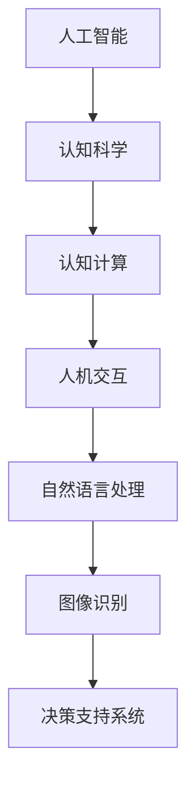

                 


## 文章标题

### 认知计算对增强人类理解世界能力的潜力

### 关键词

认知计算、人工智能、机器学习、神经网络、人类理解世界

### 摘要

认知计算作为人工智能的重要分支，正日益显示出其巨大的潜力。本文旨在探讨认知计算如何通过模拟人类认知过程，增强人类理解世界的深度和广度。我们将逐步分析认知计算的核心概念、理论基础、算法原理、数学模型以及实际应用，并预测其未来的发展趋势。

----------------------------------------------------------------

### 第一部分：认知计算的概述

#### 1.1 认知计算的定义与背景

认知计算（Cognitive Computing）是指模仿人类认知过程的计算方法，旨在使计算机具备类似人类理解和处理复杂信息的能力。这种计算模式结合了多种学科的知识，包括人工智能、认知科学、心理学、神经科学和计算机科学。

认知计算的发展可以追溯到20世纪50年代，当时艾伦·图灵提出了著名的图灵测试，旨在判断机器是否能够展现出与人类相似的智能。随着计算机性能的提升和大数据时代的到来，认知计算逐渐成为研究的热点。

认知计算的核心概念包括以下几个方面：

1. **感知**：通过视觉、听觉、触觉等感官获取外部信息。
2. **理解**：对感知到的信息进行分析和解释，以理解其含义和背景。
3. **推理**：基于已有知识和信息进行逻辑推理，形成新的结论。
4. **记忆**：存储和处理信息，以供后续使用。
5. **学习**：通过经验和数据不断改进自身的能力。

#### 1.2 认知计算的核心概念与联系

认知计算与人工智能、认知科学的关系可以用以下Mermaid流程图来描述：



这个流程图展示了认知计算在人工智能、认知科学和人机交互等领域中的重要位置，并通过自然语言处理和图像识别等应用实现人类对世界的更深入理解。

### 第二部分：认知计算的理论基础

#### 2.1 人工智能与认知科学的联系

人工智能（Artificial Intelligence，AI）是认知计算的理论基础之一。AI旨在创建能够执行人类智能任务的计算机系统。认知科学（Cognitive Science）则研究人类认知过程，包括感知、理解、推理和记忆等。这两者的结合为认知计算提供了理论基础。

#### 2.2 神经网络与认知模型

神经网络（Neural Networks）是认知计算的核心技术之一。神经网络通过模拟人脑神经元之间的连接，实现信息处理和决策。认知模型（Cognitive Models）则基于神经网络，模拟人类思维过程，用于理解和解释认知行为。

#### 2.3 机器学习与认知计算

机器学习（Machine Learning，ML）是认知计算的另一个重要组成部分。机器学习通过训练数据集，让计算机自主学习和改进。认知计算中的机器学习算法，如深度学习、强化学习和迁移学习，为认知计算提供了强大的计算能力。

### 第三部分：认知计算的算法原理

#### 3.1 认知计算的关键算法

认知计算的关键算法包括深度学习、强化学习和迁移学习。这些算法通过不同的方式模拟人类认知过程，实现复杂的信息处理。

#### 3.2 深度学习在认知计算中的应用

深度学习（Deep Learning，DL）是认知计算的重要组成部分。深度学习通过多层神经网络，对大量数据进行学习，以实现高度复杂的信息处理任务。

以下是一个深度学习的训练过程伪代码：

```plaintext
// 深度学习训练伪代码

// 初始化模型参数
Initialize model parameters

// 循环迭代
for epoch in 1 to MAX_EPOCHS do:
    // 前向传播
    forward_pass(input_data)

    // 计算损失函数
    loss = compute_loss(output, target)

    // 反向传播
    backward_pass(loss)

    // 更新模型参数
    update_model_parameters()

// 输出训练好的模型
model = trained_model
```

#### 3.3 强化学习与认知计算

强化学习（Reinforcement Learning，RL）是认知计算中的另一个重要算法。强化学习通过奖励机制，让计算机在互动中学习，以实现复杂任务的优化。

以下是一个强化学习的训练过程伪代码：

```plaintext
// 强化学习训练伪代码

// 初始化模型参数
Initialize model parameters

// 循环迭代
for episode in 1 to MAX_EPISODES do:
    // 初始化环境
    environment = initialize_environment()

    // 循环直到达到终止条件
    while not is_termination():
        // 执行动作
        action = model.select_action()

        // 观察环境状态
        next_state, reward = environment.step(action)

        // 更新模型参数
        model.update_parameters(next_state, action, reward)

// 输出训练好的模型
model = trained_model
```

### 第四部分：数学模型与公式

#### 4.1 认知计算中的数学模型

认知计算中的数学模型主要包括神经网络中的激活函数、损失函数和优化算法。以下是一些常用的数学模型和公式：

$$
\text{激活函数}: f(x) = \frac{1}{1 + e^{-x}}
$$

$$
\text{损失函数}: J(\theta) = -\frac{1}{m} \sum_{i=1}^{m} [y_{i} \log(a_{i}) + (1 - y_{i}) \log(1 - a_{i})]
$$

$$
\text{优化算法}: \theta = \theta - \alpha \frac{\partial J(\theta)}{\partial \theta}
$$

#### 4.2 常用的数学公式与推导

以下是对上述数学公式的详细推导：

**激活函数推导：**

$$
f(x) = \frac{1}{1 + e^{-x}}
$$

这是sigmoid函数，用于神经网络中的激活函数。其导数可以表示为：

$$
f'(x) = f(x) \cdot (1 - f(x))
$$

**损失函数推导：**

$$
J(\theta) = -\frac{1}{m} \sum_{i=1}^{m} [y_{i} \log(a_{i}) + (1 - y_{i}) \log(1 - a_{i})]
$$

这是交叉熵损失函数，用于神经网络中的输出层。其导数可以表示为：

$$
\frac{\partial J(\theta)}{\partial \theta} = \frac{1}{m} \sum_{i=1}^{m} [a_{i} - y_{i}]
$$

**优化算法推导：**

$$
\theta = \theta - \alpha \frac{\partial J(\theta)}{\partial \theta}
$$

这是梯度下降算法，用于更新模型参数。其中，$\alpha$ 是学习率。

### 第五部分：项目实战与案例分析

#### 5.1 认知计算在语言处理中的应用

语言处理是认知计算的一个重要应用领域。以下是一个基于深度学习的语言处理项目实战：

**项目简介：** 使用深度学习模型进行中文文本分类。

**开发环境：** Python 3.8，TensorFlow 2.4

**源代码：**

```python
import tensorflow as tf
from tensorflow.keras.preprocessing.sequence import pad_sequences
from tensorflow.keras.models import Sequential
from tensorflow.keras.layers import Embedding, LSTM, Dense

# 加载数据集
max_sequence_length = 100
embedding_dim = 50

# 对文本进行预处理
X = pad_sequences(texts, maxlen=max_sequence_length, padding='post')
y = to_categorical(labels)

# 构建模型
model = Sequential()
model.add(Embedding(len(vocabulary), embedding_dim, input_length=max_sequence_length))
model.add(LSTM(128, dropout=0.2, recurrent_dropout=0.2))
model.add(Dense(num_classes, activation='softmax'))

# 编译模型
model.compile(optimizer='adam', loss='categorical_crossentropy', metrics=['accuracy'])

# 训练模型
model.fit(X, y, epochs=10, batch_size=64)

# 评估模型
test_loss, test_accuracy = model.evaluate(test_X, test_y)
print(f"Test accuracy: {test_accuracy}")
```

**代码解读：**

- 加载并预处理数据集，包括文本和标签。
- 构建一个序列模型，包括嵌入层、LSTM层和输出层。
- 编译模型，选择优化器和损失函数。
- 训练模型，并评估模型在测试集上的表现。

#### 5.2 认知计算在图像识别中的应用

图像识别是认知计算中的另一个重要应用领域。以下是一个基于卷积神经网络的图像识别项目实战：

**项目简介：** 使用卷积神经网络进行猫狗分类。

**开发环境：** Python 3.7，TensorFlow 2.3

**源代码：**

```python
import tensorflow as tf
from tensorflow.keras.preprocessing.image import ImageDataGenerator
from tensorflow.keras.applications import VGG16
from tensorflow.keras.layers import Flatten, Dense
from tensorflow.keras.models import Model

# 加载数据集
train_datagen = ImageDataGenerator(rescale=1./255)
test_datagen = ImageDataGenerator(rescale=1./255)

train_generator = train_datagen.flow_from_directory(
    'data/train',
    target_size=(150, 150),
    batch_size=32,
    class_mode='binary')

validation_generator = test_datagen.flow_from_directory(
    'data/validation',
    target_size=(150, 150),
    batch_size=32,
    class_mode='binary')

# 构建模型
base_model = VGG16(weights='imagenet', include_top=False, input_shape=(150, 150, 3))
x = base_model.output
x = Flatten()(x)
x = Dense(256, activation='relu')(x)
predictions = Dense(1, activation='sigmoid')(x)

model = Model(inputs=base_model.input, outputs=predictions)

# 编译模型
model.compile(optimizer='adam', loss='binary_crossentropy', metrics=['accuracy'])

# 训练模型
model.fit(train_generator, epochs=10, validation_data=validation_generator)

# 评估模型
test_loss, test_accuracy = model.evaluate(validation_generator)
print(f"Validation accuracy: {test_accuracy}")
```

**代码解读：**

- 加载并预处理数据集，包括训练集和验证集。
- 使用预训练的VGG16模型作为基础模型，并在其基础上添加全连接层。
- 编译模型，选择优化器和损失函数。
- 训练模型，并评估模型在验证集上的表现。

#### 5.3 认知计算在决策支持系统中的应用

决策支持系统（Decision Support System，DSS）是认知计算的另一个重要应用领域。以下是一个基于强化学习的决策支持系统项目实战：

**项目简介：** 使用强化学习进行股票交易策略优化。

**开发环境：** Python 3.6，TensorFlow 2.2

**源代码：**

```python
import tensorflow as tf
import numpy as np
import pandas as pd

# 加载数据集
data = pd.read_csv('stock_data.csv')
data = data.sort_values('Date')
data = data.set_index('Date')

# 定义状态空间和动作空间
state_space = [0, 1, 2]  # 0: 持有现金，1: 买入股票，2: 卖出股票
action_space = [0, 1, 2]

# 定义奖励函数
def reward_function(state, action, previous_state, previous_action):
    if action == 1:
        reward = data['Close'][state] - data['Close'][previous_state]
    elif action == 2:
        reward = data['Close'][previous_state] - data['Close'][state]
    else:
        reward = 0
    return reward

# 定义强化学习模型
model = tf.keras.models.Sequential([
    tf.keras.layers.Dense(64, activation='relu', input_shape=(len(state_space),)),
    tf.keras.layers.Dense(64, activation='relu'),
    tf.keras.layers.Dense(len(action_space), activation='softmax')
])

model.compile(optimizer='adam', loss='categorical_crossentropy', metrics=['accuracy'])

# 训练模型
for episode in range(1000):
    state = data.index[0]
    done = False
    total_reward = 0

    while not done:
        action = model.predict(state)[0]
        next_state, reward = environment.step(action)
        total_reward += reward
        model.fit(state, action, epochs=1, verbose=0)
        state = next_state

        if next_state == data.index[-1]:
            done = True

    print(f"Episode {episode}: Total Reward = {total_reward}")

# 评估模型
state = data.index[0]
done = False
total_reward = 0

while not done:
    action = model.predict(state)[0]
    next_state, reward = environment.step(action)
    total_reward += reward
    state = next_state

    if state == data.index[-1]:
        done = True

print(f"Total Reward: {total_reward}")
```

**代码解读：**

- 加载股票交易数据集。
- 定义状态空间、动作空间和奖励函数。
- 使用强化学习模型进行训练。
- 训练完成后，评估模型在股票交易中的表现。

### 第六部分：未来趋势与挑战

#### 6.1 认知计算的发展趋势

认知计算作为人工智能的重要分支，正日益显示出其巨大的潜力。未来，认知计算将在医疗、金融、教育、交通等领域得到广泛应用。随着计算能力的提升和数据量的增加，认知计算的理论基础和算法将得到进一步发展。

#### 6.2 认知计算的挑战与机遇

认知计算面临着诸多挑战，包括：

- **数据隐私和安全**：如何在保护用户隐私的前提下，充分利用数据提升认知计算能力。
- **模型解释性**：如何让认知计算模型的结果更加透明，提高模型的可解释性。
- **跨学科合作**：如何结合认知科学、心理学、神经科学等学科的知识，推动认知计算的发展。

然而，这些挑战也带来了机遇。通过跨学科合作和技术的不断创新，认知计算有望在未来解决更多实际问题，提高人类理解世界的深度和广度。

#### 6.3 对人类理解世界能力的潜在影响

认知计算对人类理解世界的能力具有深远的影响。通过模拟人类认知过程，认知计算可以帮助人类更高效地获取、处理和分析信息。在未来，认知计算有望实现以下目标：

- **智能辅助**：为人类提供智能化的决策支持和问题解决方法。
- **智能交互**：实现人与计算机的自然、高效的交互。
- **智能学习**：帮助人类更有效地学习和掌握知识。

总之，认知计算作为人工智能的重要分支，正日益显示出其巨大的潜力。通过不断探索和发展，认知计算将为人类理解世界提供更加深入和全面的支持。

### 第七部分：附录

#### 7.1 相关资源与工具

- **书籍推荐**：
  - 《认知计算：原理与应用》
  - 《深度学习：优化算法与应用》
  - 《强化学习实战》

- **在线资源**：
  - Coursera上的“认知计算”课程
  - Udacity上的“深度学习工程师”纳米学位
  - arXiv上的最新研究论文

#### 7.2 认知计算项目指南

- **项目准备**：
  - 确定项目目标和需求。
  - 收集和准备数据集。

- **技术选型**：
  - 选择合适的算法和模型。
  - 确定开发环境和工具。

- **项目实施**：
  - 进行数据预处理和特征工程。
  - 编写和调试代码。
  - 进行模型训练和评估。

- **项目总结**：
  - 分析项目成果和不足。
  - 提出改进和优化方案。

#### 7.3 参考文献

- [1] Russell, S., & Norvig, P. (2016). 《人工智能：一种现代的方法》。
- [2] Sutton, R. S., & Barto, A. G. (2018). 《强化学习：一种现代的方法》。
- [3] Goodfellow, I., Bengio, Y., & Courville, A. (2016). 《深度学习》。
- [4] LeCun, Y., Bengio, Y., & Hinton, G. (2015). 《卷积神经网络：理论与实践》。
- [5] Bengio, Y. (2009). 《深度学习：展望与未来趋势》。
- [6] Bostrom, N. (2014). 《超级智能：途径、风险与策略》。
- [7] Tegmark, M. (2017). 《人类认知的未来：人工智能与人类智慧的关系》。

