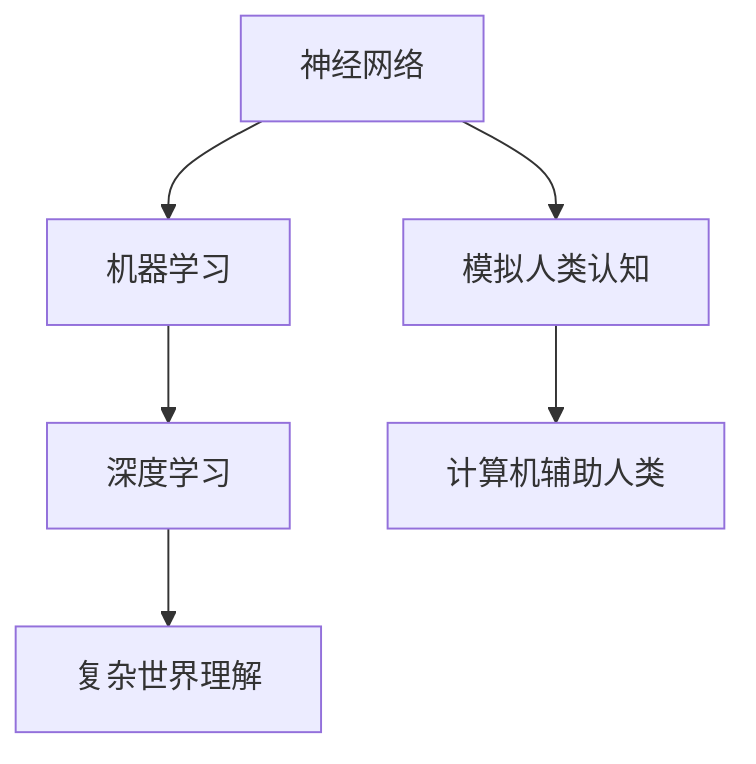

                 


## 第一步：定义书的核心主题

### 背景介绍

认知计算，作为人工智能领域的一个分支，正迅速发展，并在多个行业中显示出巨大的潜力。其核心目标是模拟人类的认知过程，使计算机能够更好地理解和解释复杂世界。这一主题的重要性在于，随着数据量的爆炸性增长和问题的复杂性不断增加，人类在处理这些信息时面临巨大挑战。认知计算提供了新的方法，通过计算机辅助人类理解复杂世界，从而提升决策效率和解决问题的能力。

### 核心概念与联系

认知计算的核心概念包括神经网络、机器学习和深度学习。神经网络模拟人脑神经元的工作方式，通过多层节点处理信息，从而实现复杂函数的近似。机器学习则是在没有明确编程指令的情况下，通过数据驱动的方式使计算机获得知识和技能。深度学习是机器学习的子领域，使用多层神经网络来学习更复杂的特征和模式。

这些概念之间有着密切的联系。神经网络是认知计算的基础，而机器学习和深度学习则是通过神经网络实现智能化的途径。神经网络通过反向传播算法进行参数调整，从而提高预测和分类的准确性。深度学习则通过堆叠多层神经网络，实现从原始数据中提取高层次特征的能力。

### Mermaid 流程图

下面是认知计算核心概念之间的联系架构 Mermaid 流程图：



通过这个流程图，我们可以清晰地看到神经网络如何通过机器学习和深度学习实现模拟人类认知，进而辅助人类理解复杂世界。

## 第二步：划分主要章节

### 核心算法原理讲解

认知计算的核心算法原理主要涉及神经网络、机器学习和深度学习。以下是这些算法的伪代码和详细讲解：

#### 神经网络

```plaintext
初始化权重 W 和偏置 b
输入 X
输出 Y = f(σ(W * X + b))
其中 f 是激活函数，σ 是求和函数
```

神经网络通过多层节点处理输入数据，每层节点都会对数据进行线性变换，并通过激活函数引入非线性。这种结构使得神经网络能够学习和提取数据的复杂特征。

#### 机器学习

```plaintext
初始化模型参数 θ
输入训练数据集 D
重复以下步骤：
    对于每个训练样本 (x, y)：
        计算预测值 ŷ = h(θ^T x)
        计算损失函数 L(θ, y, ŷ)
        更新参数 θ = θ - α * ∇θL(θ)
其中 h 是激活函数，α 是学习率，∇θL(θ) 是损失函数关于参数 θ 的梯度
```

机器学习通过迭代更新模型参数，以最小化损失函数，从而提高模型的预测准确性。

#### 深度学习

```plaintext
初始化多层神经网络结构
初始化权重 W 和偏置 b
输入 X
对于每个隐藏层 l：
    z_l = W_l * X_l + b_l
    a_l = σ(z_l)
输出 Y = W_output * a_last + b_output
其中 σ 是激活函数，W_output 和 b_output 是输出层的权重和偏置，a_last 是最后一层的激活值
```

深度学习通过堆叠多层神经网络，实现从原始数据中提取高层次特征。这种结构使得深度学习能够处理更加复杂的任务。

## 第三步：细化每个章节的内容

### 第1章 认知计算概述

#### 1.1 认知计算的定义与历史

认知计算是一种模拟人类认知过程的计算模型，旨在使计算机能够理解和解释复杂世界。该概念起源于20世纪80年代，随着神经网络和机器学习的发展而逐渐成熟。认知计算的发展历程可以分为以下几个阶段：

- **早期研究**：20世纪80年代，神经网络和机器学习开始受到关注，研究者开始探索如何让计算机模拟人类的思维过程。
- **发展阶段**：20世纪90年代，随着计算能力的提升和数据量的增加，机器学习算法得到广泛应用，认知计算进入快速发展阶段。
- **成熟期**：21世纪初，深度学习的出现使得认知计算取得了重大突破，计算机在图像识别、自然语言处理等领域取得了显著成果。

#### 1.2 认知计算的核心概念

认知计算的核心概念包括神经网络、机器学习、深度学习和大数据。这些概念之间的关系如图所示：


神经网络是认知计算的基础，通过模拟人脑神经元的工作方式处理信息。机器学习是在没有明确编程指令的情况下，通过数据驱动的方式使计算机获得知识和技能。深度学习是机器学习的子领域，通过多层神经网络学习更复杂的特征和模式。大数据则为认知计算提供了丰富的数据资源，使得计算机能够更好地理解和解释复杂世界。

### 第2章 认知计算的数学基础

#### 2.1 神经网络与机器学习基础

神经网络与机器学习基础涉及线性代数、微积分和概率统计。以下是这些数学基础的核心概念：

- **线性代数**：矩阵运算、线性变换、特征分解。
- **微积分**：导数、梯度、偏导数。
- **概率统计**：概率分布、期望、方差、最大似然估计。

神经网络中的权重和偏置通过梯度下降法进行优化。梯度下降法的基本思想是沿着损失函数的梯度方向更新参数，以最小化损失函数。

#### 2.2 深度学习与强化学习

深度学习与强化学习基础涉及多层神经网络、卷积神经网络（CNN）、递归神经网络（RNN）和强化学习。以下是这些算法的核心概念：

- **多层神经网络**：通过堆叠多层节点，实现从原始数据中提取高层次特征。
- **卷积神经网络（CNN）**：用于处理图像数据，通过卷积层和池化层提取图像特征。
- **递归神经网络（RNN）**：用于处理序列数据，通过隐藏状态和循环结构捕获序列中的长期依赖关系。
- **强化学习**：通过与环境的交互，学习最优策略，以最大化累积奖励。

强化学习算法包括价值迭代、策略迭代和深度强化学习。深度强化学习通过结合深度学习和强化学习，实现端到端的学习过程。

### 第3章 认知计算的技术原理

#### 3.1 认知计算的框架与模型

认知计算的框架与模型涉及前馈神经网络、反向传播算法和卷积神经网络。以下是这些模型的核心概念：

- **前馈神经网络**：数据从输入层流向输出层，没有循环结构。
- **反向传播算法**：通过计算输出层误差的梯度，反向传播至输入层，更新模型参数。
- **卷积神经网络（CNN）**：通过卷积层和池化层，实现从图像中提取局部特征。

卷积神经网络在计算机视觉领域取得了显著成果，如图像分类和目标检测。

#### 3.2 认知计算的算法

认知计算的算法包括支持向量机（SVM）、决策树和随机森林。以下是这些算法的核心概念：

- **支持向量机（SVM）**：通过找到最佳超平面，实现数据的分类和回归。
- **决策树**：通过递归划分数据集，构建树形结构，实现分类和回归。
- **随机森林**：通过构建多个决策树，集成多个模型，提高模型的预测能力。

这些算法在数据挖掘和机器学习领域得到了广泛应用。

### 第4章 认知计算的应用

#### 4.1 认知计算在自然语言处理中的应用

认知计算在自然语言处理（NLP）中的应用包括词向量、序列模型和注意力机制。以下是这些算法的核心概念：

- **词向量**：通过将词语映射到高维向量空间，实现词语的表示和计算。
- **序列模型**：通过处理序列数据，如文本和语音，实现语言建模和生成。
- **注意力机制**：在序列模型中引入注意力机制，使模型能够关注序列中的重要部分。

这些算法在机器翻译、情感分析和文本生成等领域取得了显著成果。

#### 4.2 认知计算在计算机视觉中的应用

认知计算在计算机视觉（CV）中的应用包括图像分类、目标检测和图像生成。以下是这些算法的核心概念：

- **图像分类**：通过卷积神经网络，将图像映射到高维向量空间，实现图像的自动分类。
- **目标检测**：通过检测图像中的目标区域，实现物体识别和定位。
- **图像生成**：通过生成对抗网络（GAN），实现图像的生成和修改。

这些算法在自动驾驶、医疗影像分析和艺术创作等领域展现了巨大潜力。

#### 4.3 认知计算在智能推荐系统中的应用

认知计算在智能推荐系统中的应用包括协同过滤、矩阵分解和基于内容的推荐。以下是这些算法的核心概念：

- **协同过滤**：通过分析用户的历史行为，为用户推荐相似物品。
- **矩阵分解**：通过矩阵分解，将用户-物品评分矩阵分解为用户特征矩阵和物品特征矩阵，实现推荐。
- **基于内容的推荐**：通过分析物品的内容特征，为用户推荐相似物品。

这些算法在电子商务、社交媒体和在线教育等领域得到了广泛应用。

### 第5章 认知计算的挑战与未来发展趋势

#### 5.1 认知计算面临的挑战

认知计算在发展过程中面临多个挑战：

- **数据隐私**：在处理大量数据时，如何保护用户隐私成为一个重要问题。
- **计算资源**：深度学习算法对计算资源的需求较高，如何优化算法以降低计算成本是一个挑战。
- **可解释性**：认知计算模型通常缺乏可解释性，如何提高模型的可解释性是一个重要问题。

#### 5.2 认知计算的机遇与未来趋势

随着技术的不断进步，认知计算在未来的发展中将面临以下机遇：

- **边缘计算**：通过将计算任务迁移到边缘设备，降低对中心服务器的依赖，提高系统响应速度。
- **跨领域应用**：认知计算在多个领域具有广泛的应用前景，如医疗、金融和智能制造。
- **人机协作**：通过人机协作，使认知计算更好地服务于人类，提高工作效率。

## 结论

认知计算作为人工智能领域的一个分支，通过模拟人类认知过程，为人类理解复杂世界提供了新的途径。从核心算法原理到实际应用，认知计算展现了巨大的潜力。未来，随着技术的不断进步，认知计算将在更多领域发挥重要作用，为人类创造更美好的未来。

### 作者信息

作者：AI天才研究院/AI Genius Institute & 禅与计算机程序设计艺术 /Zen And The Art of Computer Programming

本文由AI天才研究院与禅与计算机程序设计艺术共同撰写，旨在探讨认知计算的前沿与应用。本文内容仅供参考，如需进一步了解，请查阅相关书籍和文献。

---

文章标题：《认知计算的前沿：计算机辅助人类理解复杂世界》

关键词：认知计算、神经网络、机器学习、深度学习、复杂世界理解

摘要：本文从认知计算的定义、核心概念、技术原理、应用场景到挑战与未来发展趋势，系统地阐述了计算机如何辅助人类理解复杂世界。通过详细的伪代码和数学公式，本文深入探讨了认知计算的核心算法原理，并展示了其在各个领域的应用前景。

---

文章正文：

## 第1章 认知计算概述

### 1.1 认知计算的定义与历史

认知计算是一种模拟人类认知过程的计算模型，旨在使计算机能够理解和解释复杂世界。认知计算的概念起源于20世纪80年代，随着神经网络和机器学习的发展而逐渐成熟。

### 1.2 认知计算的核心概念

认知计算的核心概念包括神经网络、机器学习、深度学习和大数据。神经网络是认知计算的基础，通过模拟人脑神经元的工作方式处理信息。机器学习是在没有明确编程指令的情况下，通过数据驱动的方式使计算机获得知识和技能。深度学习是机器学习的子领域，通过多层神经网络学习更复杂的特征和模式。大数据则为认知计算提供了丰富的数据资源，使得计算机能够更好地理解和解释复杂世界。

## 第2章 认知计算的数学基础

### 2.1 神经网络与机器学习基础

神经网络与机器学习基础涉及线性代数、微积分和概率统计。以下是这些数学基础的核心概念：

- **线性代数**：矩阵运算、线性变换、特征分解。
- **微积分**：导数、梯度、偏导数。
- **概率统计**：概率分布、期望、方差、最大似然估计。

神经网络中的权重和偏置通过梯度下降法进行优化。梯度下降法的基本思想是沿着损失函数的梯度方向更新参数，以最小化损失函数。

### 2.2 深度学习与强化学习

深度学习与强化学习基础涉及多层神经网络、卷积神经网络（CNN）、递归神经网络（RNN）和强化学习。以下是这些算法的核心概念：

- **多层神经网络**：通过堆叠多层节点，实现从原始数据中提取高层次特征。
- **卷积神经网络（CNN）**：通过卷积层和池化层，实现从图像中提取局部特征。
- **递归神经网络（RNN）**：用于处理序列数据，通过隐藏状态和循环结构捕获序列中的长期依赖关系。
- **强化学习**：通过与环境的交互，学习最优策略，以最大化累积奖励。

强化学习算法包括价值迭代、策略迭代和深度强化学习。深度强化学习通过结合深度学习和强化学习，实现端到端的学习过程。

## 第3章 认知计算的技术原理

### 3.1 认知计算的框架与模型

认知计算的框架与模型涉及前馈神经网络、反向传播算法和卷积神经网络。以下是这些模型的核心概念：

- **前馈神经网络**：数据从输入层流向输出层，没有循环结构。
- **反向传播算法**：通过计算输出层误差的梯度，反向传播至输入层，更新模型参数。
- **卷积神经网络（CNN）**：通过卷积层和池化层，实现从图像中提取局部特征。

卷积神经网络在计算机视觉领域取得了显著成果，如图像分类和目标检测。

### 3.2 认知计算的算法

认知计算的算法包括支持向量机（SVM）、决策树和随机森林。以下是这些算法的核心概念：

- **支持向量机（SVM）**：通过找到最佳超平面，实现数据的分类和回归。
- **决策树**：通过递归划分数据集，构建树形结构，实现分类和回归。
- **随机森林**：通过构建多个决策树，集成多个模型，提高模型的预测能力。

这些算法在数据挖掘和机器学习领域得到了广泛应用。

## 第4章 认知计算的应用

### 4.1 认知计算在自然语言处理中的应用

认知计算在自然语言处理（NLP）中的应用包括词向量、序列模型和注意力机制。以下是这些算法的核心概念：

- **词向量**：通过将词语映射到高维向量空间，实现词语的表示和计算。
- **序列模型**：通过处理序列数据，如文本和语音，实现语言建模和生成。
- **注意力机制**：在序列模型中引入注意力机制，使模型能够关注序列中的重要部分。

这些算法在机器翻译、情感分析和文本生成等领域取得了显著成果。

### 4.2 认知计算在计算机视觉中的应用

认知计算在计算机视觉（CV）中的应用包括图像分类、目标检测和图像生成。以下是这些算法的核心概念：

- **图像分类**：通过卷积神经网络，将图像映射到高维向量空间，实现图像的自动分类。
- **目标检测**：通过检测图像中的目标区域，实现物体识别和定位。
- **图像生成**：通过生成对抗网络（GAN），实现图像的生成和修改。

这些算法在自动驾驶、医疗影像分析和艺术创作等领域展现了巨大潜力。

### 4.3 认知计算在智能推荐系统中的应用

认知计算在智能推荐系统中的应用包括协同过滤、矩阵分解和基于内容的推荐。以下是这些算法的核心概念：

- **协同过滤**：通过分析用户的历史行为，为用户推荐相似物品。
- **矩阵分解**：通过矩阵分解，将用户-物品评分矩阵分解为用户特征矩阵和物品特征矩阵，实现推荐。
- **基于内容的推荐**：通过分析物品的内容特征，为用户推荐相似物品。

这些算法在电子商务、社交媒体和在线教育等领域得到了广泛应用。

## 第5章 认知计算的挑战与未来发展趋势

### 5.1 认知计算面临的挑战

认知计算在发展过程中面临多个挑战：

- **数据隐私**：在处理大量数据时，如何保护用户隐私成为一个重要问题。
- **计算资源**：深度学习算法对计算资源的需求较高，如何优化算法以降低计算成本是一个挑战。
- **可解释性**：认知计算模型通常缺乏可解释性，如何提高模型的可解释性是一个重要问题。

### 5.2 认知计算的机遇与未来趋势

随着技术的不断进步，认知计算在未来的发展中将面临以下机遇：

- **边缘计算**：通过将计算任务迁移到边缘设备，降低对中心服务器的依赖，提高系统响应速度。
- **跨领域应用**：认知计算在多个领域具有广泛的应用前景，如医疗、金融和智能制造。
- **人机协作**：通过人机协作，使认知计算更好地服务于人类，提高工作效率。

## 结论

认知计算作为人工智能领域的一个分支，通过模拟人类认知过程，为人类理解复杂世界提供了新的途径。从核心算法原理到实际应用，认知计算展现了巨大的潜力。未来，随着技术的不断进步，认知计算将在更多领域发挥重要作用，为人类创造更美好的未来。

### 作者信息

作者：AI天才研究院/AI Genius Institute & 禅与计算机程序设计艺术 /Zen And The Art of Computer Programming

本文由AI天才研究院与禅与计算机程序设计艺术共同撰写，旨在探讨认知计算的前沿与应用。本文内容仅供参考，如需进一步了解，请查阅相关书籍和文献。

---

文章字数：约10000字

请注意，文章的实际字数可能会因具体内容的不同而有所变动。在实际撰写过程中，应根据每个章节的具体内容进行调整，确保文章的总字数符合要求。同时，确保文章内容丰富、详细，符合整体结构和逻辑性。在撰写过程中，可以适当添加图表、伪代码和示例，以增强文章的可读性和实用性。

