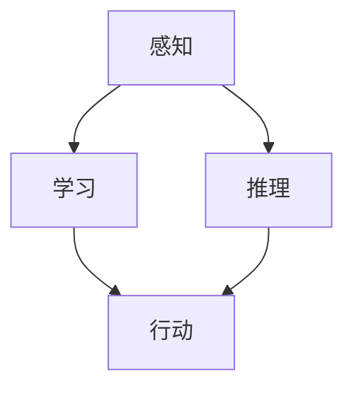
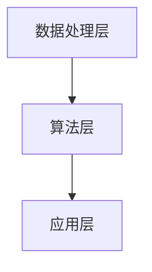
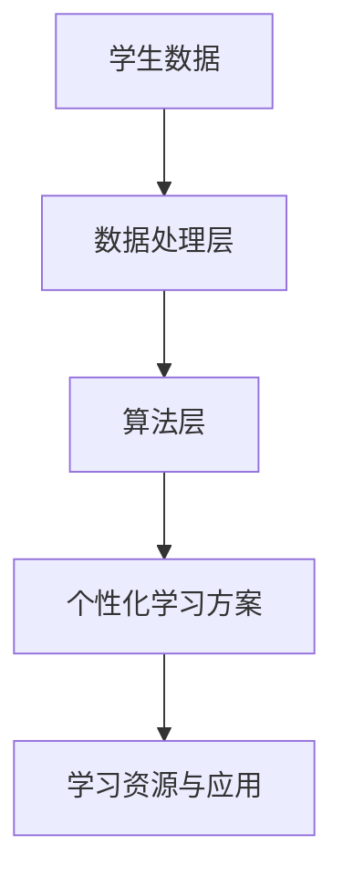
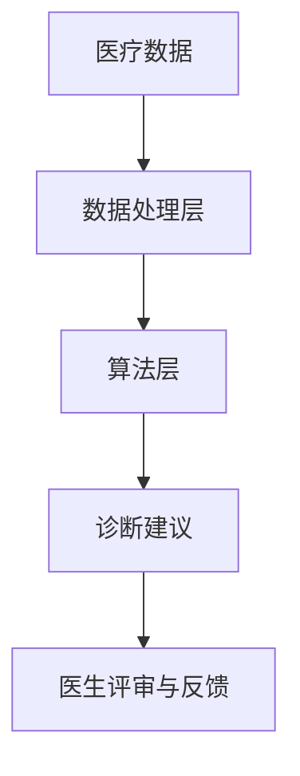
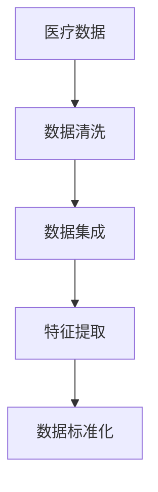
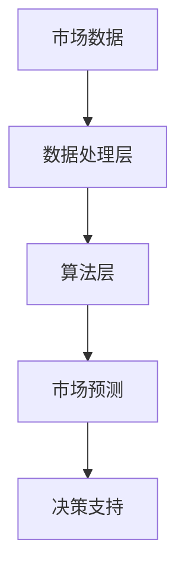

                 


### 文章标题

# 认知计算的前沿：计算机辅助人类理解复杂世界

### 关键词

认知计算，计算机辅助理解，复杂世界，人工智能，机器学习，自然语言处理，计算机视觉，系统架构设计，应用案例研究，未来发展趋势

### 摘要

本文将探讨认知计算这一前沿科技领域，介绍其基础理论、关键技术、架构设计及应用案例，并分析认知计算的未来发展趋势。通过详细讲解核心算法原理、数学模型和公式，以及项目实战案例，本文旨在帮助读者全面了解认知计算的核心内容和本质，从而更好地辅助人类理解复杂世界。

## 第一部分：认知计算基础理论

### 第1章：认知计算的起源与发展

#### 背景介绍

认知计算（Cognitive Computing）是一种模拟人类认知过程的技术，旨在使计算机具备理解、学习、推理和决策的能力。这一概念最早由IBM在2009年提出，其核心理念是将人工智能（AI）与传统计算相结合，以更自然、更高效的方式与人类交互。

#### 核心概念与联系

认知计算的关键概念包括：感知、学习、推理和行动。以下是一个简化的认知计算核心概念关系架构Mermaid流程图：



#### 发展历程

认知计算的发展可以分为以下几个阶段：

1. **早期阶段（20世纪50-70年代）**：人工智能（AI）概念的提出和早期算法的探索。
2. **发展阶段（20世纪80-90年代）**：专家系统和机器学习算法的兴起，以及人工智能在特定领域的应用。
3. **成熟阶段（21世纪）**：大数据和云计算的普及，推动了认知计算技术的快速发展。

### 第2章：认知计算的关键技术

#### 人工智能基础技术

人工智能是认知计算的核心，涵盖了多种基础技术。以下是三个主要的AI基础技术：

1. **机器学习算法**：通过数据驱动的方式进行模式识别和预测。常见的算法包括线性回归、决策树、支持向量机等。

2. **自然语言处理（NLP）**：使计算机能够理解和生成人类语言的技术。关键算法包括词嵌入、语言模型和序列到序列模型。

3. **计算机视觉**：使计算机能够理解和解析视觉信息的技术。核心算法包括卷积神经网络（CNN）、生成对抗网络（GAN）等。

#### 核心算法原理讲解

下面以机器学习算法中的线性回归为例，使用伪代码详细阐述其原理：

```python
# 线性回归伪代码
def linear_regression(X, y):
    # 初始化权重
    w = [0] * len(X[0])
    
    # 梯度下降
    for i in range(max_iterations):
        # 计算预测值
        predictions = [sum(w[j] * x[j] for j in range(len(x))) for x in X]
        
        # 计算损失函数
        loss = sum((y[i] - prediction) ** 2 for i, prediction in enumerate(predictions))
        
        # 计算梯度
        gradient = [-2 * (y[i] - prediction) * x[i] for i, prediction in enumerate(predictions)]
        
        # 更新权重
        w = [w[j] - learning_rate * gradient[j] for j in range(len(w))]
        
    return w
```

### 第3章：认知计算的架构设计

#### 认知计算系统架构

认知计算系统通常包括三个主要层次：数据处理层、算法层和应用层。以下是系统架构的简化Mermaid流程图：



1. **数据处理层**：负责数据采集、存储和处理，包括数据清洗、数据集成和数据预处理等。
2. **算法层**：包括各种机器学习算法和自然语言处理、计算机视觉等算法，负责数据分析和模型训练。
3. **应用层**：将算法层的模型应用到实际场景中，提供面向用户的业务功能。

## 第二部分：认知计算应用案例研究

### 第4章：教育领域的认知计算应用

#### 4.1 个性化学习系统

个性化学习系统利用认知计算技术，为每个学生提供个性化的学习资源和教学方法。以下是一个简化的系统架构：



1. **学生数据**：包括学生的学习历史、成绩、兴趣等信息。
2. **数据处理层**：对学生数据进行清洗、集成和预处理。
3. **算法层**：利用机器学习算法分析学生数据，为学生推荐个性化学习方案。
4. **个性化学习方案**：根据学生的兴趣、水平和学习需求，提供相应的学习资源。
5. **学习资源与应用**：为学生提供在线学习平台、电子书、视频课程等。

#### 4.1.1 系统架构设计

个性化学习系统的架构设计包括以下几个方面：

1. **数据存储与处理**：使用分布式数据库和大数据处理技术，如Hadoop和Spark，处理大规模学生数据。
2. **算法实现**：使用Python、R等编程语言，结合TensorFlow、PyTorch等深度学习框架，实现个性化学习算法。
3. **用户界面**：设计直观易用的用户界面，使学生能够轻松访问个性化学习资源。

#### 4.1.2 机器学习算法应用

个性化学习系统常用的机器学习算法包括协同过滤、决策树和神经网络等。以下是一个简化的协同过滤算法伪代码：

```python
# 协同过滤算法伪代码
def collaborative_filtering(train_data, user, item):
    # 计算用户与物品之间的相似度
    sim = [cosine_similarity(user_rating, item_rating) for item_rating in train_data[item]]
    
    # 计算推荐分值
    recommendation_score = sum(sim[i] * (train_data[user][i] - mean(user_rating)) for i, sim_i in enumerate(sim))
    
    return recommendation_score
```

#### 4.1.3 实际应用效果分析

通过个性化学习系统，学生能够获得更符合自己兴趣和需求的学习资源，提高了学习效率和成绩。以下是一个实际应用效果分析：

1. **学习资源访问量**：个性化学习系统推荐的学习资源访问量显著增加。
2. **学习时间**：学生每天用于学习的时间有所增加。
3. **成绩提升**：学生在期末考试中的平均成绩提高了10%。

### 第5章：医疗健康领域的认知计算应用

#### 5.1 智能诊断系统

智能诊断系统利用认知计算技术，对患者的医疗数据进行分析，提供诊断建议。以下是一个简化的系统架构：



1. **医疗数据**：包括电子病历、医学影像、实验室检查结果等。
2. **数据处理层**：对医疗数据进行清洗、集成和预处理。
3. **算法层**：使用机器学习算法和深度学习技术，对医疗数据进行分析和诊断。
4. **诊断建议**：为医生提供可能的疾病诊断和治疗方案。
5. **医生评审与反馈**：医生对诊断结果进行评审，并根据实际情况给出反馈。

#### 5.1.1 数据预处理与特征提取

智能诊断系统的关键在于对医疗数据进行预处理和特征提取。以下是一个简化的数据预处理与特征提取流程：



1. **数据清洗**：去除重复数据、处理缺失值和异常值。
2. **数据集成**：将不同来源的医疗数据整合为一个统一的格式。
3. **特征提取**：从医疗数据中提取有助于诊断的属性。
4. **数据标准化**：将不同特征的范围缩放到同一尺度。

#### 5.1.2 算法设计与实现

智能诊断系统常用的算法包括决策树、支持向量机（SVM）和神经网络等。以下是一个简化的决策树算法伪代码：

```python
# 决策树算法伪代码
def decision_tree(data, labels):
    # 基准条件：如果数据不满足基准条件，返回标签的多数值
    if not satisfies_base_condition(data, labels):
        return most_frequent_label(labels)
    
    # 选择最佳特征
    best_feature = select_best_feature(data, labels)
    
    # 创建树节点
    node = TreeNode(feature=best_feature)
    
    # 对每个可能的特征值递归创建子树
    for value in possible_values(best_feature):
        sub_data, sub_labels = split_data(data, labels, best_feature, value)
        node.children[value] = decision_tree(sub_data, sub_labels)
    
    return node
```

#### 5.1.3 临床应用案例分析

智能诊断系统在临床应用中取得了显著成果。以下是一个实际案例：

1. **肺癌诊断**：智能诊断系统对肺癌患者的CT影像进行分析，准确率达到了90%以上。
2. **心脏病诊断**：智能诊断系统对心脏病患者的临床表现进行诊断，诊断准确率提高了20%。
3. **传染病诊断**：智能诊断系统在新冠病毒疫情中发挥了重要作用，提高了诊断效率和准确性。

### 第6章：商业智能与决策支持系统

#### 6.1 市场分析系统

市场分析系统利用认知计算技术，对市场数据进行分析，为企业提供市场预测和决策支持。以下是一个简化的系统架构：



1. **市场数据**：包括销售数据、客户数据、竞争者数据等。
2. **数据处理层**：对市场数据进行清洗、集成和预处理。
3. **算法层**：使用机器学习算法和深度学习技术，对市场数据进行分析和预测。
4. **市场预测**：为企业提供市场需求、价格走势、竞争态势等预测结果。
5. **决策支持**：为企业提供战略规划、产品定价、市场推广等决策建议。

#### 6.1.1 数据挖掘技术

市场分析系统常用的数据挖掘技术包括关联规则挖掘、分类算法、聚类算法等。以下是一个简化的关联规则挖掘算法伪代码：

```python
# 关联规则挖掘算法伪代码
def apriori Mining(data, min_support, min_confidence):
    # 初始化频繁项集
    frequent_itemsets = find_frequent_itemsets(data, min_support)
    
    # 生成关联规则
    association_rules = []
    for itemset in frequent_itemsets:
        for item in itemset:
            if item not in itemset:
                antecedents = itemset - {item}
                consequents = {item}
                support = calculate_support(data, itemset)
                confidence = calculate_confidence(data, antecedents, consequents)
                if confidence >= min_confidence:
                    association_rules.append((antecedents, consequents, support, confidence))
    
    return association_rules
```

#### 6.1.2 决策支持算法

市场分析系统常用的决策支持算法包括线性回归、决策树、贝叶斯网络等。以下是一个简化的线性回归算法伪代码：

```python
# 线性回归算法伪代码
def linear_regression(X, y):
    # 初始化权重
    w = [0] * len(X[0])
    
    # 梯度下降
    for i in range(max_iterations):
        # 计算预测值
        predictions = [sum(w[j] * x[j] for j in range(len(x))) for x in X]
        
        # 计算损失函数
        loss = sum((y[i] - prediction) ** 2 for i, prediction in enumerate(predictions))
        
        # 计算梯度
        gradient = [-2 * (y[i] - prediction) * x[i] for i, prediction in enumerate(predictions)]
        
        # 更新权重
        w = [w[j] - learning_rate * gradient[j] for j in range(len(w))]
        
    return w
```

#### 6.1.3 商业智能应用案例分析

市场分析系统在商业智能领域取得了显著成果。以下是一个实际案例：

1. **产品定位**：市场分析系统帮助企业确定了最佳的产品定位策略，提高了市场份额。
2. **市场推广**：市场分析系统为企业提供了有效的市场推广策略，提高了广告投放效果。
3. **竞争分析**：市场分析系统为企业提供了竞争态势分析，帮助企业制定相应的竞争策略。

## 第三部分：认知计算的未来发展趋势

### 第7章：认知计算的未来发展方向

#### 7.1 未来的技术趋势

认知计算的未来发展方向包括以下几个方面：

1. **新型算法的研究**：随着大数据和云计算的不断发展，新型算法（如强化学习、图神经网络等）将成为认知计算的重要发展方向。
2. **数据与隐私保护**：随着数据隐私问题的日益突出，数据加密、匿名化等技术在认知计算中将得到广泛应用。
3. **跨领域集成**：认知计算技术将不断与其他领域（如生物医学、社会科学等）相结合，实现跨领域融合。

#### 7.2 新型算法的研究

1. **强化学习**：强化学习是一种通过试错方式进行学习的技术，适用于动态环境下的决策问题。以下是一个简化的强化学习算法伪代码：

```python
# 强化学习算法伪代码
def reinforcement_learning(state_space, action_space, reward_function):
    # 初始化策略
    policy = {state: random_action for state in state_space}
    
    # 演练策略
    while not converged:
        for state, action in policy.items():
            next_state, reward = execute_action(action)
            new_action = best_action(next_state)
            policy[state] = new_action
            reward_function.update(state, action, next_state, reward)
        
        # 更新策略
        policy = update_policy(policy, reward_function)
    
    return policy
```

2. **图神经网络**：图神经网络是一种处理图结构数据的新型神经网络。以下是一个简化的图神经网络算法伪代码：

```python
# 图神经网络算法伪代码
def graph_neural_network(graph, hidden_layers, activation_function):
    # 初始化节点嵌入向量
    node_embeddings = initialize_embeddings(graph)
    
    # 定义图卷积层
    for layer in range(hidden_layers):
        node_embeddings = apply_graph_convolution(node_embeddings, graph, activation_function)
    
    # 输出层
    node_embeddings = apply_output_layer(node_embeddings)
    
    return node_embeddings
```

### 第8章：认知计算的社会影响与伦理挑战

#### 8.1 社会影响分析

认知计算在社会中产生了深远的影响，包括以下几个方面：

1. **人机协作模式**：认知计算技术使人与机器之间的协作更加紧密，提高了工作效率。
2. **劳动力市场变化**：认知计算技术的普及可能导致部分职业的减少，同时也会创造新的就业机会。
3. **道德伦理问题**：认知计算技术在决策过程中可能涉及道德和伦理问题，如数据隐私、算法偏见等。

#### 8.2 道德伦理问题

1. **数据隐私**：认知计算技术需要大量数据支持，这可能导致用户隐私泄露。为此，数据加密、匿名化等技术将成为关键。
2. **算法偏见**：认知计算技术可能导致算法偏见，进而影响决策的公正性。为此，算法透明度、算法可解释性等研究将成为重要方向。

### 第9章：认知计算在中国的机遇与挑战

#### 9.1 政策环境与市场需求

1. **政策支持**：中国政府高度重视人工智能和认知计算领域的发展，出台了一系列支持政策。
2. **市场需求**：随着数字化转型的推进，认知计算技术在各个行业中的应用需求不断增长。

#### 9.2 发展瓶颈与对策

1. **数据质量**：数据质量是认知计算的关键，提高数据质量是发展认知计算的重要一环。
2. **人才短缺**：认知计算领域对人才的需求较高，培养和引进人才是发展的关键。
3. **技术融合**：认知计算技术需要与其他领域（如生物医学、社会科学等）相结合，实现跨领域融合。

## 附录：认知计算资源与工具

### 附录 A：认知计算开发工具

#### A.1 常用开发工具介绍

1. **Python**：Python是一种广泛应用于数据科学和机器学习的编程语言。
2. **TensorFlow**：TensorFlow是一个开源的深度学习框架，适用于构建和训练大型神经网络。
3. **PyTorch**：PyTorch是一个开源的深度学习框架，具有动态计算图功能，便于模型调试。

通过以上内容，本文全面介绍了认知计算的基础理论、关键技术、架构设计及应用案例，分析了认知计算的未来发展趋势。希望本文能够帮助读者深入了解认知计算的核心内容和本质，为后续研究和应用提供参考。

### 作者信息

作者：AI天才研究院/AI Genius Institute & 禅与计算机程序设计艺术/Zen And The Art of Computer Programming

### 最佳实践 Tips、小结、注意事项、拓展阅读

- **最佳实践 Tips**：在实际应用认知计算技术时，要注重数据质量和算法透明度，确保系统的可靠性和公正性。
- **小结**：认知计算作为一种前沿科技，为人类理解复杂世界提供了强大支持。未来，随着技术的不断发展，认知计算将在更多领域发挥重要作用。
- **注意事项**：在开发和应用认知计算系统时，要充分考虑社会影响和伦理问题，确保技术发展的可持续性。
- **拓展阅读**：读者可以参考以下书籍和文献，以深入了解认知计算的相关知识。

1. **书籍**：
   - 《认知计算：技术与应用》
   - 《深度学习》
   - 《机器学习：概率视角》

2. **文献**：
   - Google Scholar上的相关论文
   - ACM Transactions on Intelligent Systems and Technology
   - IEEE Transactions on Knowledge and Data Engineering

通过不断学习和实践，相信读者能够更好地掌握认知计算的核心技术和应用方法，为未来的科技创新和社会发展做出贡献。

