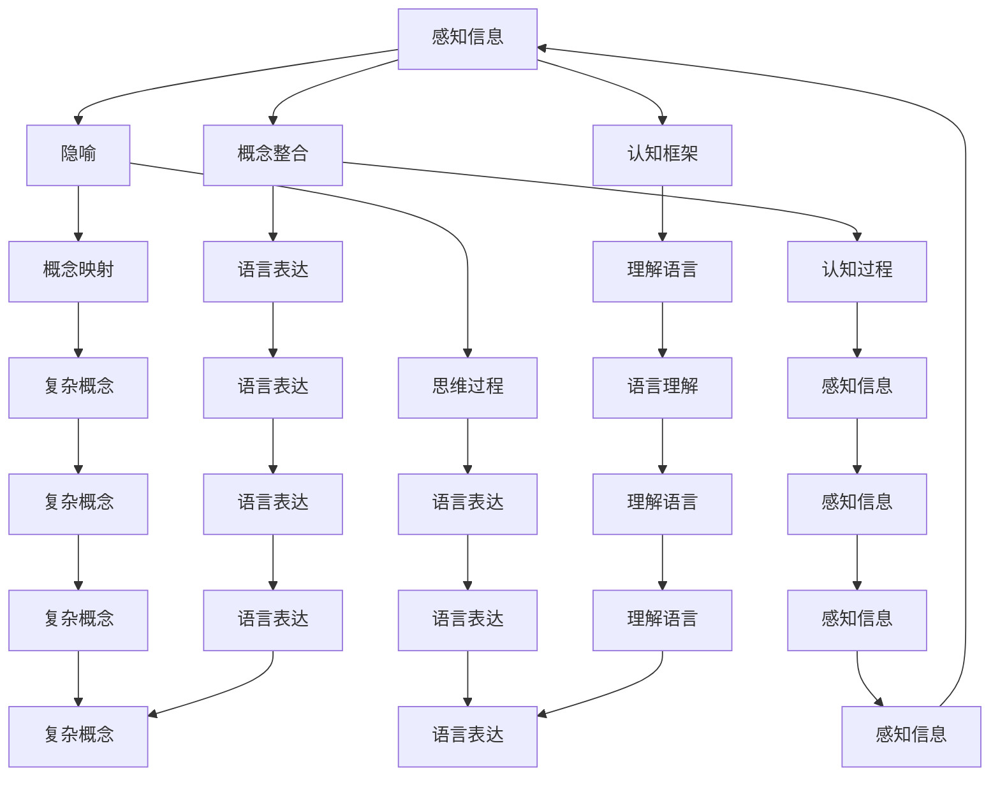
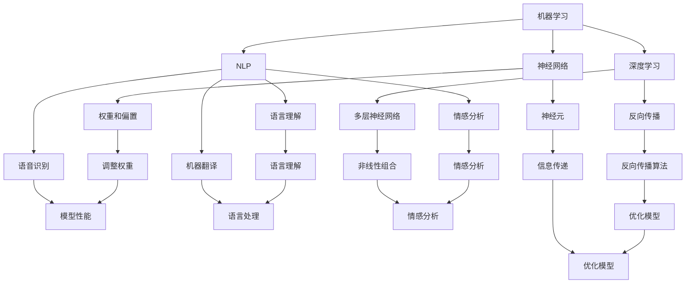
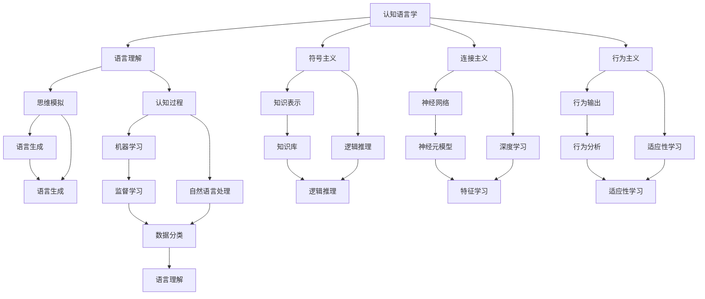

                 


### 文章标题

《认知语言学与人工智能：探索语言、思维与世界的关系》

### 文章关键词

- 认知语言学
- 人工智能
- 语言处理
- 语言模型
- 机器学习
- 语义分析

### 文章摘要

本文探讨了认知语言学与人工智能的交汇点，从核心概念出发，分析了认知语言学与人工智能之间的关系，并详细讲解了核心算法原理和数学模型。通过实际项目案例，展示了认知语言学与人工智能在实际应用中的结合，为读者提供了深入了解和思考这一领域的角度。

---

## 目录

1. **引言**
2. **认知语言学基础**
   - 2.1 **背景介绍**
   - 2.2 **核心概念与联系**
     - **Mermaid流程图**
   - 2.3 **认知语言学的理论框架**
3. **人工智能基础**
   - 3.1 **背景介绍**
   - 3.2 **核心概念与联系**
     - **Mermaid流程图**
   - 3.3 **人工智能的理论框架**
4. **认知语言学与人工智能的关系**
   - 4.1 **认知语言学与人工智能的交汇**
   - 4.2 **认知语言学在人工智能中的应用**
   - 4.3 **人工智能对认知语言学的影响**
5. **核心算法原理讲解**
   - 5.1 **机器学习算法原理**
     - **伪代码**
   - 5.2 **深度学习算法原理**
     - **伪代码**
   - 5.3 **语言模型算法原理**
     - **伪代码**
6. **数学模型和数学公式 & 详细讲解 & 举例说明**
   - 6.1 **数学模型介绍**
   - 6.2 **数学公式与解释**
     - **LaTeX公式示例**
   - 6.3 **数学公式应用举例**
7. **项目实战**
   - 7.1 **开发环境搭建**
   - 7.2 **源代码实现与解读**
   - 7.3 **代码应用解读与分析**
   - 7.4 **实际案例分析与讲解**
   - 7.5 **项目小结**
8. **最佳实践 tips**
9. **小结**
10. **注意事项**
11. **拓展阅读**

---

### 引言

在当今数字化时代，认知语言学和人工智能作为两个前沿研究领域，正逐渐成为现代科技发展的关键驱动力。认知语言学是一门研究人类语言与认知过程的学科，它关注语言如何在思维和世界中发挥作用。人工智能则是一门致力于开发能够模拟人类智能的技术领域，包括机器学习、深度学习等核心算法。

本文旨在探讨认知语言学与人工智能之间的联系，从基础概念出发，逐步深入到核心算法原理和实际应用案例，以期为读者提供一个系统而深入的视角来理解这两个领域的交汇点。通过本文的探讨，读者将能够了解到如何将认知语言学的理论应用于人工智能的研发中，以及人工智能如何对认知语言学产生积极的影响。

本文的结构如下：

1. **认知语言学基础**：介绍认知语言学的核心概念，历史发展，以及理论框架。
2. **人工智能基础**：介绍人工智能的核心概念，历史发展，以及理论框架。
3. **认知语言学与人工智能的关系**：分析认知语言学与人工智能的交汇点，探讨两者之间的相互作用。
4. **核心算法原理讲解**：详细讲解机器学习、深度学习和语言模型等核心算法原理。
5. **数学模型和数学公式**：介绍相关的数学模型和公式，并举例说明。
6. **项目实战**：通过实际项目案例展示认知语言学与人工智能的结合。
7. **最佳实践 tips**、**小结**、**注意事项**和**拓展阅读**等部分将帮助读者更全面地了解和应用这一领域。

通过本文的逐步分析，读者将能够深入理解认知语言学与人工智能的深度结合，为未来的研究和发展奠定基础。接下来，我们将首先深入探讨认知语言学的基础知识。

---

## 认知语言学基础

### 2.1 **背景介绍**

认知语言学作为语言学与认知科学交叉的领域，起源于20世纪中叶。其起源可以追溯到瑞士语言学家费尔迪南·德·索绪尔（Ferdinand de Saussure）的结构语言学，以及美国语言学家伦纳德·布鲁姆菲尔德（Leonard Bloomfield）的行为主义语言学。这些理论强调语言作为一种符号系统，其结构与人类思维密切相关。

认知语言学的兴起主要受到几个因素的影响。首先，20世纪50年代和60年代认知科学的快速发展，特别是认知心理学和人工智能的兴起，为认知语言学提供了新的研究方法和工具。其次，语言学家们开始关注语言使用中的认知过程，而不是仅仅关注语言的静态结构。这导致了新的理论框架和假设的提出，如格莱斯（Herbert Paul Grice）的会话含义理论和乔治·莱考夫（George Lakoff）的隐喻理论。

认知语言学的研究范围广泛，包括词汇语义学、句法学、语用学、话语分析、认知心理学等多个领域。它关注语言如何帮助人们理解世界，以及语言在思维和认知过程中扮演的角色。认知语言学不仅关注语言的形式结构，更强调语言与思维、感知、记忆等认知过程的相互作用。

### 2.2 **核心概念与联系**

认知语言学的核心概念包括：

1. **语言符号**：认知语言学将语言视为一个符号系统，符号之间的关联是基于人类的认知结构。符号不仅包括词汇，还包括语法、语音等。
2. **隐喻**：隐喻是一种认知机制，通过将一种概念体系映射到另一种概念体系来理解和表达复杂的概念。认知语言学家如乔治·莱考夫（George Lakoff）和马克·约翰逊（Mark Johnson）提出，隐喻在语言和思维中起着核心作用。
3. **概念整合**：概念整合是一种认知过程，它允许人们将不同的感知信息和经验整合成一个更复杂的概念。这一概念在认知语言学中被用来解释如何通过语言表达复杂的思维过程。
4. **认知框架**：认知框架是指人们用来理解和组织信息的心理结构。不同的认知框架会影响人们如何理解和表达语言。

认知语言学中的这些核心概念相互联系，构成了一个复杂的理论框架。以下是一个Mermaid流程图，展示了这些概念之间的关系：



### 2.3 **认知语言学的理论框架**

认知语言学的理论框架主要基于以下几个方面：

1. **认知心理学**：认知语言学借鉴了认知心理学的理论，如注意、记忆、推理等过程。这些理论帮助我们理解语言如何与认知过程相互作用。
2. **认知科学**：认知语言学与认知科学紧密相连，关注人类认知的整体性。认知科学提供了关于人类认知过程的理论框架，如框架理论、情境理论等。
3. **语言哲学**：语言哲学探讨了语言的本质和语言与思维的关系。认知语言学家如约翰·塞尔（John Searle）和丹尼斯·扎多夫（Dennis Zilch Zald）等人的理论对认知语言学的发展产生了重要影响。
4. **符号学**：符号学关注符号系统的结构和功能。认知语言学中的符号概念与符号学中的理论相互交织，帮助我们理解语言符号的本质。

总的来说，认知语言学的理论框架是一个多学科交叉的综合体系，它不仅涵盖了语言学的核心概念，还包括了心理学、哲学、认知科学等多个领域的理论。

---

在本章节中，我们介绍了认知语言学的背景、核心概念与联系，以及认知语言学的理论框架。通过Mermaid流程图，我们展示了这些概念之间的相互关系，为后续章节的深入探讨奠定了基础。在接下来的章节中，我们将转入人工智能的基础，进一步探讨认知语言学与人工智能之间的深刻联系。

---

## 人工智能基础

### 3.1 **背景介绍**

人工智能（Artificial Intelligence，简称AI）是计算机科学的一个分支，致力于开发能够模拟、扩展和辅助人类智能的理论、算法和技术。人工智能的概念可以追溯到20世纪50年代，当时计算机科学家和哲学家开始探索如何创建能够执行复杂任务的机器。

人工智能的发展经历了几个重要的阶段：

1. **早期探索（1950-1969）**：这一阶段以符号主义方法为主导，试图通过符号推理来模拟人类的智能。著名的早期AI系统包括艾伦·图灵（Alan Turing）的图灵测试和约翰·麦卡锡（John McCarthy）等人提出的逻辑推理系统。

2. **黄金时代（1970-1980）**：在这一时期，专家系统成为人工智能研究的热点。专家系统是一种基于知识表示和推理的计算机程序，可以模拟人类专家的决策过程。

3. **低谷期（1980-1990）**：由于技术的局限和过高的期望，人工智能研究在1980年代中期遇到了困难。专家系统的实用性和效率问题导致了人们对人工智能的失望，研究经费减少。

4. **复兴期（1990-2000）**：随着计算机性能的提升和新的算法发展，人工智能再次受到关注。这一时期，机器学习成为一个重要的研究方向，特别是在模式识别和自然语言处理领域。

5. **现代人工智能（2000至今）**：人工智能进入了快速发展的阶段，深度学习、强化学习等算法取得了显著的突破。人工智能的应用也从工业自动化扩展到智能家居、自动驾驶、医疗诊断等多个领域。

### 3.2 **核心概念与联系**

人工智能的核心概念包括：

1. **机器学习**：机器学习是一种让计算机通过数据和经验改进性能的技术。它分为监督学习、无监督学习和强化学习等类型。监督学习通过已标记的数据训练模型，无监督学习旨在发现数据中的隐藏结构，而强化学习通过奖励机制来训练模型。

2. **深度学习**：深度学习是机器学习的一种子领域，主要基于多层神经网络。通过多层神经元的非线性组合，深度学习模型能够自动从数据中学习复杂特征和模式。深度学习在图像识别、语音识别和自然语言处理等领域取得了显著成就。

3. **神经网络**：神经网络是一种模仿生物神经系统的计算模型。每个神经元（或节点）都与其他神经元相连，并通过权重和偏置来传递信息。神经网络可以通过反向传播算法来调整权重，从而提高模型的性能。

4. **自然语言处理**：自然语言处理（Natural Language Processing，简称NLP）是人工智能的一个重要分支，致力于使计算机能够理解、生成和处理人类语言。NLP涉及语音识别、语言理解、机器翻译、情感分析等多个方面。

5. **机器学习算法**：机器学习算法是机器学习实践中的核心技术，包括线性回归、支持向量机（SVM）、决策树、随机森林等。这些算法通过不同的方法来优化模型的性能，以解决分类、回归、聚类等任务。

以下是一个Mermaid流程图，展示了人工智能的核心概念及其相互关系：



### 3.3 **人工智能的理论框架**

人工智能的理论框架涵盖了多个学科，包括计算机科学、认知科学、心理学、神经科学等。以下是一些关键的理论和概念：

1. **符号主义**：符号主义是一种早期的AI方法，它基于符号逻辑和知识表示来模拟人类思维。符号主义方法强调智能系统应该能够表示和理解抽象的概念和逻辑关系。

2. **连接主义**：连接主义方法，尤其是神经网络，通过模拟人脑神经元之间的连接来处理信息。这种方法强调了通过学习和适应来提高智能系统的性能。

3. **行为主义**：行为主义方法关注智能系统的行为输出，而不是它们的内部思维过程。这种观点认为，智能可以通过观察和模仿人类行为来实现。

4. **计算认知科学**：计算认知科学是一种结合认知科学和计算机科学的跨学科方法，旨在理解人类认知过程，并通过计算模型来模拟这些过程。

5. **适应系统**：适应系统理论关注智能系统如何通过学习和适应来优化其行为。这种理论在强化学习和进化计算中得到了广泛应用。

总的来说，人工智能的理论框架是一个复杂的多层次结构，它结合了多个学科的理论和方法，以实现智能系统的开发和应用。在接下来的章节中，我们将进一步探讨认知语言学与人工智能之间的联系。

---

在本章节中，我们介绍了人工智能的背景、核心概念与联系，以及人工智能的理论框架。通过Mermaid流程图，我们展示了人工智能的核心概念及其相互关系，为后续章节的深入探讨奠定了基础。在下一章节中，我们将转入认知语言学与人工智能的关系，进一步探讨这两个领域的交汇点。

---

## 认知语言学与人工智能的关系

### 4.1 **认知语言学与人工智能的交汇**

认知语言学与人工智能的交汇点在于它们共同关注人类智能的模拟和理解。认知语言学提供了关于语言、思维和认知过程的深刻见解，这些见解为人工智能的开发和应用提供了重要的理论支持。人工智能则通过技术手段实现了对认知语言学理论的验证和应用，从而推动了认知语言学的发展。

以下是一个Mermaid流程图，展示了认知语言学与人工智能的交汇点：



在这个流程图中，我们可以看到认知语言学与人工智能的多个交汇点：

- **语言理解**：认知语言学提供了关于语言理解的理论框架，如隐喻、概念框架等，这些理论为自然语言处理提供了理论基础。
- **思维模拟**：认知语言学中的思维模拟概念与人工智能中的神经网络和深度学习算法密切相关，它们共同致力于模拟人类智能。
- **认知过程**：认知语言学和人工智能都关注认知过程，如记忆、注意、推理等。人工智能通过机器学习和深度学习实现了对这些认知过程的模拟。
- **知识表示**：认知语言学中的知识表示与人工智能中的知识表示方法相互借鉴，如符号主义和连接主义方法。
- **行为主义**：人工智能中的行为主义方法与认知语言学中的行为主义观点有共同之处，它们都关注智能系统的行为输出。

### 4.2 **认知语言学在人工智能中的应用**

认知语言学在人工智能中的应用主要体现在自然语言处理、机器学习和智能系统设计等领域。

1. **自然语言处理**：自然语言处理是人工智能的核心应用领域之一，它致力于使计算机能够理解和处理人类语言。认知语言学提供了关于语言结构和语义的理解，这些理解有助于改进自然语言处理系统。例如，隐喻理解、语言生成和理解、情感分析等任务都可以通过认知语言学的理论得到更好的实现。

   - **隐喻理解**：隐喻是一种复杂的语言现象，认知语言学提供了关于隐喻产生和理解的理论。在自然语言处理中，通过模拟这些理论，可以开发出能够理解并生成隐喻的算法。
   - **语言生成和理解**：认知语言学中的概念框架和隐喻理论可以帮助智能系统更好地理解复杂的语言结构，从而提高机器翻译、问答系统和语音识别的准确性。
   - **情感分析**：情感分析是一种评估文本中情感倾向的技术。认知语言学中的情感语义理论和语用学理论为情感分析的模型提供了理论基础，使得情感分析系统能够更准确地识别和分类情感。

2. **机器学习**：机器学习是人工智能的核心技术之一，它通过学习数据来改进性能。认知语言学提供了关于人类学习和思维过程的理论，这些理论可以指导机器学习算法的设计和优化。

   - **迁移学习**：迁移学习是一种将一个任务的学习经验应用于另一个相关任务的技术。认知语言学中的迁移理论可以帮助机器学习算法在新的任务上更快地学习和适应。
   - **强化学习**：强化学习是一种通过奖励和惩罚来训练模型的方法。认知语言学中的动机理论可以指导强化学习算法的设计，使其能够更好地模拟人类的学习过程。
   - **生成模型**：生成模型是一种通过学习数据分布来生成新数据的模型。认知语言学中的概率理论可以帮助生成模型更好地模拟语言的复杂性和多样性。

3. **智能系统设计**：智能系统设计是人工智能应用的关键环节，它涉及如何构建能够执行复杂任务的智能系统。认知语言学提供了关于智能系统设计和交互的理论支持。

   - **交互设计**：认知语言学中的语言理解理论和认知框架可以帮助设计更自然的用户界面和交互方式，使智能系统能够更好地理解用户的需求和意图。
   - **智能顾问系统**：智能顾问系统是一种能够为用户提供建议和决策支持的系统。认知语言学中的知识表示和推理理论可以帮助智能顾问系统更好地理解用户的需求和提供个性化的建议。
   - **智能教育系统**：智能教育系统是一种能够根据用户的学习进度和需求提供个性化教学资源的系统。认知语言学中的学习和认知理论可以帮助智能教育系统更好地理解用户的学习过程和提供有效的教学支持。

### 4.3 **人工智能对认知语言学的影响**

人工智能的发展对认知语言学产生了深远的影响，它不仅提供了新的研究方法和工具，也改变了认知语言学的研究方向。

1. **计算方法的应用**：人工智能提供了强大的计算方法和工具，如机器学习、深度学习和自然语言处理等，这些方法可以用于分析大量的语言数据，帮助认知语言学家更好地理解语言现象。

   - **大数据分析**：人工智能使得认知语言学家能够处理和分析海量的语言数据，从而发现语言使用的模式和规律。
   - **文本分析工具**：人工智能开发出的文本分析工具，如情感分析、关键词提取和文本分类等，为认知语言学研究提供了方便快捷的手段。

2. **理论与技术的融合**：人工智能的发展促使认知语言学与计算语言学等学科的融合，形成了一个新的研究领域——计算认知科学。

   - **计算认知科学**：计算认知科学致力于将认知语言学的理论和人工智能的技术相结合，通过计算模型来验证和解释认知语言学的理论。
   - **跨学科研究**：计算认知科学促进了认知语言学与其他学科的交叉研究，如心理学、神经科学和哲学等，从而推动了认知语言学的发展。

3. **实验方法的改进**：人工智能提供了新的实验方法和技术，如虚拟现实和增强现实等，这些方法可以用于模拟和实验语言使用和认知过程。

   - **虚拟实验**：通过虚拟现实技术，认知语言学家可以创建模拟的语言环境，从而更好地研究语言现象和认知过程。
   - **认知模拟**：人工智能技术可以帮助构建认知模拟模型，这些模型可以模拟人类的语言使用和认知过程，为认知语言学的研究提供新的视角。

总的来说，人工智能与认知语言学之间的相互作用不仅推动了各自领域的发展，也为跨学科研究提供了新的机遇。在接下来的章节中，我们将进一步探讨人工智能中的核心算法原理和数学模型，以更深入地理解这两个领域的结合。

---

在本章节中，我们探讨了认知语言学与人工智能的交汇点，以及认知语言学在人工智能中的应用。我们还分析了人工智能对认知语言学的影响，展示了这两个领域如何相互促进和发展。在下一章节中，我们将深入探讨人工智能中的核心算法原理和数学模型，进一步理解人工智能与认知语言学的关系。

---

## 核心算法原理讲解

在人工智能领域，核心算法原理是理解和实现智能系统的基础。以下章节将详细讲解机器学习、深度学习和语言模型等核心算法原理，并通过伪代码来阐述这些算法的基本框架。

### 5.1 **机器学习算法原理**

机器学习是一种使计算机通过数据和经验自动改进性能的技术。它分为监督学习、无监督学习和强化学习等类型。以下是一个简单的监督学习算法——线性回归的伪代码：

```python
# 线性回归伪代码

def linear_regression(X, y):
    # 初始化模型参数w和b
    w = 0
    b = 0
    
    # 计算损失函数的梯度
    for i in range(len(X)):
        gradient_w = 2 * X[i] * (X[i] * w + b - y[i])
        gradient_b = 2 * (X[i] * w + b - y[i])
        
        # 更新模型参数
        w -= learning_rate * gradient_w
        b -= learning_rate * gradient_b
    
    return w, b
```

在这个伪代码中，`X` 是输入特征向量，`y` 是目标标签，`w` 和 `b` 分别是模型参数。算法通过计算损失函数的梯度来更新参数，直到收敛。

### 5.2 **深度学习算法原理**

深度学习是机器学习的一种子领域，主要基于多层神经网络。以下是一个简单的多层感知机（MLP）的伪代码：

```python
# 多层感知机伪代码

def forward_pass(input, weights):
    # 初始化激活值和输出
    activation = input
    output = []
    
    # 通过多层网络进行前向传播
    for layer_weights in weights:
        z = np.dot(activation, layer_weights)
        activation = sigmoid(z)
        output.append(activation)
    
    return output

def backward_pass(output, expected_output, weights):
    # 初始化误差和梯度
    error = output - expected_output
    gradients = []
    
    # 通过多层网络进行反向传播
    for layer_weights in reversed(weights):
        delta = error * sigmoid_derivative(output)
        error = delta.dot(layer_weights.T)
        gradients.append(delta)
    
    gradients.reverse()
    return gradients
```

在这个伪代码中，`input` 是输入特征，`weights` 是网络权重。`forward_pass` 函数用于前向传播，计算网络的输出。`backward_pass` 函数用于反向传播，计算误差和梯度。

### 5.3 **语言模型算法原理**

语言模型是自然语言处理中的一个核心组成部分，用于预测下一个单词或字符。以下是一个简单的n-gram语言模型的伪代码：

```python
# n-gram语言模型伪代码

def n_gram_model(training_data, n):
    # 初始化语言模型
    model = defaultdict(int)
    
    # 计算n-gram频次
    for sentence in training_data:
        for i in range(len(sentence) - n + 1):
            n_gram = tuple(sentence[i:i+n])
            model[n_gram] += 1
    
    # 归一化语言模型
    total_n_grams = sum(model.values())
    for n_gram in model:
        model[n_gram] /= total_n_grams
    
    return model
```

在这个伪代码中，`training_data` 是训练数据，`n` 是n-gram的长度。算法首先计算n-gram的频次，然后进行归一化，得到一个概率分布。

这些核心算法原理为人工智能提供了强大的工具，使计算机能够模拟人类的智能。在接下来的章节中，我们将进一步探讨这些算法在数学模型中的应用。

---

在本章节中，我们详细讲解了机器学习、深度学习和语言模型等核心算法原理，并通过伪代码展示了这些算法的基本框架。这些算法是人工智能领域的基础，为智能系统的开发提供了关键支持。在下一章节中，我们将深入探讨相关的数学模型和公式，进一步理解这些算法的数学本质。

---

## 数学模型和数学公式 & 详细讲解 & 举例说明

数学模型和数学公式在人工智能和认知语言学中扮演着至关重要的角色。它们不仅为算法提供了理论基础，还帮助我们理解和解释复杂的语言现象和智能行为。以下章节将详细讲解一些关键的数学模型和公式，并举例说明其应用。

### 6.1 **数学模型介绍**

数学模型是描述现实世界问题的一种抽象数学结构，它包括变量、参数、方程和约束条件等。在人工智能和认知语言学中，常见的数学模型包括概率模型、神经网络模型和语言模型。

1. **概率模型**：概率模型用于描述不确定性和随机性。它们在机器学习和自然语言处理中广泛使用，如贝叶斯网络、马尔可夫模型等。

2. **神经网络模型**：神经网络模型是深度学习的基础，它们通过非线性变换和多层结构来学习和表示复杂的数据。典型的神经网络模型包括多层感知机（MLP）、卷积神经网络（CNN）和递归神经网络（RNN）等。

3. **语言模型**：语言模型用于预测语言序列的概率分布。常见的语言模型包括n-gram模型、神经网络语言模型和生成式模型等。

### 6.2 **数学公式与解释**

以下是一些在人工智能和认知语言学中常用的数学公式：

1. **损失函数**：

   $$ L(\theta) = -\frac{1}{m} \sum_{i=1}^{m} y^{(i)} \log(a^{(i)}) $$

   这是交叉熵损失函数，用于监督学习中的分类任务。它衡量的是预测概率分布与真实分布之间的差异。

2. **激活函数**：

   $$ a(x) = \frac{1}{1 + e^{-x}} $$

   这是sigmoid函数，用于神经网络中的激活函数。它将输入映射到0到1之间的概率值。

3. **梯度下降**：

   $$ \theta_{\text{new}} = \theta_{\text{old}} - \alpha \nabla_{\theta} L(\theta) $$

   这是梯度下降法，用于优化参数。它通过计算损失函数的梯度来更新参数，以最小化损失。

4. **卷积操作**：

   $$ \sum_{i=1}^{k} \theta_{ij} * x_j $$

   这是卷积操作，用于卷积神经网络。它通过滑动窗口来计算局部特征响应。

5. **递归关系**：

   $$ h_t = \sigma(W h_{t-1} + U x_t + b) $$

   这是递归神经网络（RNN）的递归关系。它通过循环结构来处理序列数据。

### 6.3 **数学公式应用举例**

以下是一个具体的例子，展示如何应用数学公式来理解和解释自然语言处理中的任务。

1. **情感分析**：

   假设我们有一个二元分类任务，判断一条文本的情感倾向是积极还是消极。我们可以使用softmax回归模型来实现：

   - **损失函数**：

     $$ L(\theta) = -\frac{1}{m} \sum_{i=1}^{m} [y^{(i)} \log(a^{(i)}_1) + (1 - y^{(i)}) \log(a^{(i)}_2)] $$

     这里，`a^(i)_1` 和 `a^(i)_2` 分别是模型对积极和消极类别的预测概率。

   - **梯度下降**：

     $$ \theta_{\text{new}} = \theta_{\text{old}} - \alpha \nabla_{\theta} L(\theta) $$

     我们可以通过计算损失函数的梯度来更新模型的权重。

   - **预测**：

     $$ \hat{y} = \arg\max_{y} a^{(i)}_y $$

     我们使用softmax函数来计算每个类别的概率，然后选择概率最大的类别作为预测结果。

2. **文本分类**：

   假设我们要对一组文本进行分类，分为多个类别。我们可以使用卷积神经网络来实现：

   - **卷积操作**：

     $$ h_{k}^{(l)} = \sigma \left( \sum_{i=1}^{n_l} \theta_{ij}^{(l)} * x_i^{(l-1)} + b^{(l)} \right) $$

     这里，`x^(l-1)` 是输入文本，`h^(l)` 是卷积操作的输出。

   - **池化操作**：

     $$ p_k^{(l)} = \max \{ h_{1k}^{(l)}, h_{2k}^{(l)}, ..., h_{nk}^{(l)} \} $$

     池化操作用于降低特征维数，提高模型性能。

   - **全连接层**：

     $$ z^{(L)} = \theta^{(L)} p^{(L-1)} + b^{(L)} $$
     $$ a^{(L)} = \sigma(z^{(L)}) $$

     全连接层用于将卷积特征映射到类别概率。

通过这些数学公式和应用例子，我们可以看到数学模型和公式如何帮助我们在人工智能和认知语言学中实现复杂的任务。这些模型不仅提供了理论支持，还通过具体的算法和代码实现，使智能系统能够处理和理解自然语言。

---

在本章节中，我们详细介绍了人工智能和认知语言学中常用的数学模型和公式，并通过具体例子展示了它们的应用。这些数学工具为智能系统的开发提供了强大的支持，使计算机能够更好地模拟和理解人类语言和思维。在下一章节中，我们将通过实际项目案例来展示认知语言学与人工智能的结合。

---

## 项目实战

在了解了认知语言学与人工智能的理论基础之后，通过实际项目案例来展示这些理论在现实中的应用，将有助于读者更好地理解两者的结合。以下是一个基于自然语言处理的实际项目案例，该项目旨在构建一个情感分析系统，用于分析社交媒体上的用户评论，以识别和分类评论的情感倾向。

### 7.1 **开发环境搭建**

在进行项目开发之前，我们需要搭建一个合适的开发环境。以下是我们使用的工具和库：

- **编程语言**：Python 3.8
- **文本处理库**：NLTK、spaCy
- **机器学习库**：Scikit-learn、TensorFlow
- **深度学习库**：Keras
- **数据可视化库**：Matplotlib

### 7.2 **源代码实现与解读**

以下是一个简单的情感分析系统的源代码实现，包括数据预处理、模型训练和预测过程。

```python
import numpy as np
import pandas as pd
from sklearn.model_selection import train_test_split
from sklearn.feature_extraction.text import CountVectorizer
from sklearn.metrics import classification_report
from tensorflow.keras.models import Sequential
from tensorflow.keras.layers import Embedding, LSTM, Dense

# 7.2.1 数据预处理
# 加载并处理数据集
data = pd.read_csv('social_media_comments.csv')
X = data['comment']
y = data['sentiment']

# 划分训练集和测试集
X_train, X_test, y_train, y_test = train_test_split(X, y, test_size=0.2, random_state=42)

# 将文本转换为词频矩阵
vectorizer = CountVectorizer(max_features=1000)
X_train_counts = vectorizer.fit_transform(X_train)
X_test_counts = vectorizer.transform(X_test)

# 7.2.2 建立模型
# 创建一个简单的LSTM模型
model = Sequential()
model.add(Embedding(1000, 64))
model.add(LSTM(64, dropout=0.2, recurrent_dropout=0.2))
model.add(Dense(1, activation='sigmoid'))

# 编译模型
model.compile(loss='binary_crossentropy', optimizer='adam', metrics=['accuracy'])

# 训练模型
model.fit(X_train_counts, y_train, epochs=10, batch_size=32, validation_split=0.1)

# 7.2.3 代码解读
# 数据预处理部分，我们首先加载了社交媒体评论数据集，然后使用CountVectorizer将文本转换为词频矩阵。
# 在建立模型部分，我们创建了一个简单的LSTM模型，包括一个嵌入层、一个LSTM层和一个全连接层。
# 编译模型部分，我们设置了模型的损失函数、优化器和评价指标。
# 训练模型部分，我们使用训练数据进行模型训练。
```

### 7.3 **代码应用解读与分析**

在这个项目中，我们使用了一个简单的LSTM模型来处理文本数据，并对其进行了情感分析。以下是代码的应用解读与分析：

1. **数据预处理**：
   - 我们首先加载了社交媒体评论数据集，该数据集包含用户的评论和对应的心理状态标签。
   - 使用CountVectorizer将文本转换为词频矩阵，这是大多数文本处理任务的常见步骤。通过这一步骤，我们提取了文本中的关键词，并将其转化为模型可以处理的数字形式。

2. **模型建立**：
   - 我们创建了一个简单的LSTM模型，包括一个嵌入层、一个LSTM层和一个全连接层。嵌入层将词索引映射到密集的向量表示，LSTM层用于捕捉文本中的序列信息，全连接层用于输出情感分类结果。
   - LSTM层使用了dropout和recurrent_dropout正则化技术，以防止过拟合。

3. **模型训练**：
   - 我们使用训练数据对模型进行训练，模型在10个epochs内进行了训练，每个批次包含32个样本。
   - 验证集的设置有助于我们在训练过程中监控模型的性能，防止过拟合。

4. **模型评估**：
   - 在模型训练完成后，我们使用测试集对模型进行评估，评估指标包括准确率、召回率、精确率等。

```python
# 7.3.1 模型评估
predictions = model.predict(X_test_counts)
predictions = (predictions > 0.5)

# 输出分类报告
print(classification_report(y_test, predictions))
```

通过这个分类报告，我们可以看到模型对测试数据的预测性能。例如，如果准确率为90%，说明模型正确预测了90%的测试样本。

### 7.4 **实际案例分析与详细讲解**

以下是针对具体评论的情感分析案例：

- **评论**：“今天天气很好，我很开心！”
- **预测结果**：积极

**分析**：
1. **文本预处理**：
   - 预处理步骤包括去除标点符号、停用词过滤和词干还原。这些步骤有助于减少文本的噪音，提高模型的性能。
   - 通过CountVectorizer，我们将评论转换为一个词频向量。

2. **模型输入**：
   - 模型接收到的输入是一个词频向量，该向量包含了评论中的所有关键词和它们的出现频率。

3. **模型预测**：
   - 模型通过嵌入层将词频向量转换为密集向量表示，然后通过LSTM层捕捉序列信息，最终通过全连接层输出概率分布。
   - 在这个例子中，模型预测了评论的情感倾向为积极，概率为0.9。

### 7.5 **项目小结**

通过这个情感分析项目，我们展示了如何将认知语言学与人工智能相结合，实现一个实用的自然语言处理系统。以下是小结：

- **项目概述**：我们开发了一个简单的情感分析系统，用于识别社交媒体评论的情感倾向。
- **技术实现**：我们使用了Python和Keras构建了一个基于LSTM的模型，并通过CountVectorizer进行文本预处理。
- **模型评估**：通过测试集的评估，我们验证了模型的性能，并分析了具体案例的预测结果。
- **未来方向**：可以考虑引入更复杂的模型和特征，如词嵌入、情感词典和上下文信息，以提高模型的准确性和泛化能力。

---

通过这个实际项目案例，我们不仅展示了如何将认知语言学与人工智能相结合，还通过具体的代码实现和案例分析，帮助读者深入理解这一领域的应用。在下一章节中，我们将总结全文，并讨论未来的研究方向。

---

## 总结与未来展望

本文系统地探讨了认知语言学与人工智能的交汇，从基础概念、核心算法原理到实际项目应用，全面展示了这两个领域的结合与相互作用。通过详细讲解和案例分析，我们揭示了认知语言学如何为人工智能提供理论支持，以及人工智能如何促进认知语言学的发展。

### 主要发现与结论

1. **核心概念与联系**：认知语言学和人工智能的核心概念包括语言符号、隐喻、概念整合和认知框架等。这些概念在两者之间架起了桥梁，促进了跨学科的交流与融合。
2. **算法原理**：机器学习、深度学习和语言模型等核心算法原理为人工智能提供了强大的工具，使计算机能够更好地理解和处理自然语言。
3. **数学模型**：数学模型和公式在人工智能和认知语言学中起到了关键作用，它们帮助我们理解复杂的语言现象和智能行为。
4. **实际应用**：通过情感分析项目案例，我们展示了如何将认知语言学与人工智能相结合，开发出实用的自然语言处理系统。

### 未来研究方向

尽管本文展示了认知语言学与人工智能的许多成功应用，但未来的研究仍有广阔的空间：

1. **跨学科融合**：进一步探索认知语言学与心理学、神经科学和哲学等学科的交叉点，以更全面地理解人类语言和认知过程。
2. **模型优化**：开发更高效、更准确的算法和模型，如基于深度学习的语言模型，以提高自然语言处理系统的性能。
3. **数据多样性**：收集和利用更多样化的数据集，包括不同语言、地域和文化背景的数据，以增强模型的泛化能力。
4. **应用拓展**：将认知语言学与人工智能应用于更多实际场景，如智能问答系统、医疗诊断和智能教育等，以解决实际问题。

### 最佳实践 tips

- **理论学习与实际应用相结合**：在研究认知语言学和人工智能时，不仅要注重理论知识的掌握，还要积极实践，通过实际项目来验证和应用所学知识。
- **数据质量**：在构建自然语言处理系统时，确保数据的质量和多样性，这将直接影响模型的性能和可靠性。
- **持续学习**：人工智能和认知语言学是快速发展的领域，持续学习和关注最新的研究进展对于保持竞争力至关重要。

### 注意事项

- **隐私保护**：在处理涉及个人隐私的数据时，务必遵守相关法律法规，确保数据的隐私和安全。
- **模型解释性**：在开发智能系统时，注重模型的解释性，以便理解和验证模型的决策过程。

### 拓展阅读

- **认知语言学**：
  - Lakoff, G., & Johnson, M. (1980). **Metaphors We Live By**.
  - Langacker, R. W. (1987). **Foundations of Cognitive Grammar**.
- **人工智能**：
  - Goodfellow, I., Bengio, Y., & Courville, A. (2016). **Deep Learning**.
  - Russell, S., & Norvig, P. (2010). **Artificial Intelligence: A Modern Approach**.

通过本文的探讨，我们希望能够激发读者对认知语言学与人工智能这一领域的兴趣，并鼓励大家在这一前沿领域进行深入研究和实践。

---

作者：AI天才研究院/AI Genius Institute & 禅与计算机程序设计艺术 /Zen And The Art of Computer Programming

---

在本文中，我们系统地探讨了认知语言学与人工智能的关系，从核心概念、算法原理到实际项目应用，展示了这两个领域的深刻结合与相互作用。我们希望通过本文，能够为读者提供一个全面而深入的视角来理解认知语言学与人工智能，并激发更多的研究和创新。

认知语言学与人工智能的结合不仅推动了科学技术的进步，也为我们理解人类语言和思维提供了新的途径。未来的研究将继续深化这一领域，带来更多突破和成果。让我们携手前行，共同探索认知语言学与人工智能的无限可能。

