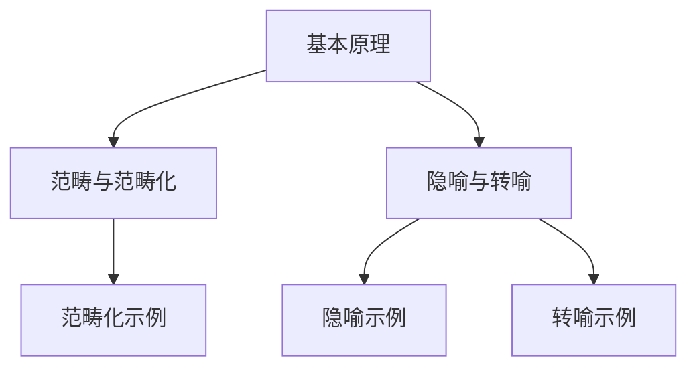
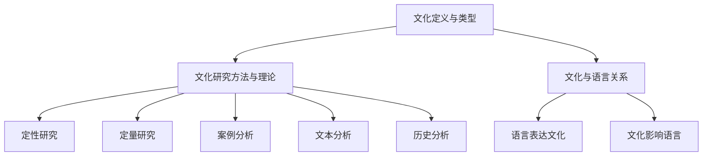

                 

# 《认知语言学与文化研究：探索语言、文化与世界理解的关系》

## 关键词
- 认知语言学
- 文化研究
- 语言理解
- 跨文化交际
- 语言教学
- 语言政策

## 摘要
本文旨在探索认知语言学与文化研究之间的联系，以及它们对语言、文化与世界理解的影响。通过系统地介绍认知语言学和文化研究的核心概念，本文揭示了语言、文化与世界理解之间的复杂关系。此外，本文还讨论了相关核心算法原理、数学模型、具体案例和项目实战，旨在为读者提供全面、深入的学术视角。

## 引言

在当代语言学研究中，认知语言学和文化研究已经成为两个不可忽视的领域。认知语言学关注语言的心理认知基础，试图理解人们如何通过语言进行思维和认知。文化研究则着眼于语言与文化之间的互动关系，探讨文化如何塑造语言，以及语言如何反映文化。这两者之间的交叉点，正是本文所要探讨的主题：语言、文化与世界理解的关系。

### 认知语言学与文化研究的背景

认知语言学起源于20世纪60年代，其核心理念是语言与思维密不可分。认知语言学的先驱者，如乔姆斯基（Noam Chomsky）和列维-斯特劳斯（Claude Lévi-Strauss），提出语言不仅是交流工具，更是人类认知世界的核心机制。这一理论视角引发了对语言本质的深刻反思，推动了认知语言学的发展。

与此同时，文化研究逐渐成为社会科学的重要分支。文化研究关注文化现象，探讨文化如何影响个体的身份认同、价值观和行为。文化研究方法多样，包括符号学、心理学、社会学和历史学等，旨在揭示文化如何塑造语言，以及语言如何反映文化。

### 语言、文化与世界理解的关系

语言、文化与世界理解之间的关系复杂而深远。首先，语言是人类认知世界的重要工具。通过语言，人们能够表达思想、交流信息，从而共同构建和理解世界。其次，文化影响着语言的形态和内涵。不同的文化背景会影响人们的语言使用方式，从而塑造出独特的语言特色。最后，世界理解则依赖于语言和文化。人们通过语言和文化来理解世界，同时也在这个过程中不断重塑自己的认知和理解。

在本文中，我们将系统地探讨认知语言学与文化研究之间的核心概念和联系，深入分析语言、文化与世界理解的关系。通过具体的案例分析、项目实战和最佳实践，我们将揭示这一领域的研究现状和未来趋势。

### 1.1 认知语言学与文化研究的背景和意义

认知语言学和文化研究在现代社会中扮演着日益重要的角色，其原因可以从多个角度进行分析。

首先，从历史背景来看，20世纪中叶是人类思想和社会发展的关键时期。在这一时期，语言学、心理学、哲学等学科都取得了重大突破。认知心理学的兴起，使得人们开始重新审视语言和思维的关系，这为认知语言学的发展奠定了基础。与此同时，文化研究的兴起则源于对社会现象的深入反思和对多样性的关注，它为理解语言和文化提供了新的视角。

其次，从学科发展来看，认知语言学和文化研究的交叉融合，有助于拓展语言学的边界。认知语言学关注语言的心理认知基础，强调语言与思维之间的紧密联系，这为语言学研究提供了新的理论框架。而文化研究则关注语言在社会和文化中的实际运用，探讨文化如何影响语言的使用和理解。这种交叉融合，使得语言学不再局限于语言本身，而是更加关注语言在社会文化背景下的功能和作用。

再次，从现实意义来看，认知语言学和文化研究对于解决现实问题具有重要意义。例如，在语言教学中，认知语言学的理论可以帮助教师更好地理解学生的语言学习过程，从而设计出更有效的教学策略。而在跨文化交际中，文化研究的理论可以帮助人们更好地理解不同文化背景下的语言使用，减少误解和冲突。

总的来说，认知语言学和文化研究不仅具有重要的学术价值，也为解决现实问题提供了新的思路和方法。随着社会的不断发展，这两个领域的研究将越来越受到重视，并继续推动语言学、心理学、社会学等学科的发展。

### 1.2 语言、文化与世界理解的关系概述

语言、文化与世界理解之间的关系是复杂而互动的，这三者之间的相互作用构成了人类认知和社会交往的核心。

首先，语言作为人类认知世界的基本工具，起到了桥梁的作用。语言不仅仅是交流信息的工具，更是人类思维和认知的载体。认知语言学研究表明，人们通过语言来感知、理解和表达世界。例如，语言中的词汇和句法结构反映了人们对现实世界的认知方式。例如，一些语言中存在描述空间关系的专门词汇，这反映了这些语言使用者对空间感知的重视。

其次，文化是影响语言使用的重要因素。不同的文化背景会影响人们的语言习惯、语言选择和语言理解。例如，高语境文化（如中国、日本）和低语境文化（如美国、德国）在语言交流中有不同的特点。高语境文化中，语言交流更多地依赖于非语言信息，如面部表情、身体语言和语境，而低语境文化则更加依赖明确的语言表达。这种文化差异不仅影响了语言的使用，也影响了人们对语言的理解。

再次，世界理解是语言和文化的共同产物。人们通过语言和文化来理解世界，同时也在这个过程中不断重构和塑造自己的认知。例如，不同的文化对时间的理解差异很大，这种文化差异体现在语言的表达上。一些文化重视过去和未来，而一些文化则更注重现在。这种差异不仅影响人们的语言使用，也影响他们对时间的认知。

具体而言，语言、文化与世界理解之间的关系可以概括为以下几个方面：

1. **语言的认知功能**：语言是人类认知世界的基础，通过语言，人们能够感知、理解和表达复杂的信息。例如，认知语言学中的“构式语法”（Construction Grammar）理论认为，语言中的构式（construction）是语言使用者理解和表达世界的基本单位。

2. **文化的语言表现**：文化通过语言表现出来，语言是文化的重要载体。例如，语言中的成语、俗语和谚语都是文化价值观的反映。不同文化背景下的语言使用差异，体现了不同文化的价值观和思维方式。

3. **世界理解的构建**：语言和文化共同作用于世界理解，人们在语言和文化的基础上构建自己的认知和理解。例如，认知语言学中的“范畴化”（Categorization）理论指出，人们通过语言和文化中的范畴化过程，将世界划分为不同的类别和概念。

总之，语言、文化与世界理解之间的关系是一个动态的、相互影响的过程。语言不仅是文化的载体，也是认知的工具；文化不仅影响语言的使用，也影响人们的认知方式；而世界理解则是语言和文化的共同产物。这种关系不仅具有学术价值，也为跨文化交际和语言教学提供了重要的理论支持。

### 2.1 认知语言学的核心概念

认知语言学是语言学的一个重要分支，它着重研究语言与认知之间的关系，探讨了人类如何通过语言进行思维和认知。在认知语言学中，有多个核心概念，它们帮助我们理解语言的认知本质。以下是对这些核心概念的定义及其关系的Mermaid流程图说明。

#### 2.1.1 认知语言学的基本原理

认知语言学的基本原理之一是语言和思维密不可分。认知语言学认为，语言不仅仅是表达思想的工具，更是人类认知世界的基础。通过语言，人们能够对现实世界进行概念化、分类和解释。例如，认知语言学中的“构式语法”（Construction Grammar）理论强调，语言中的构式（construction）是语言使用者理解和表达世界的基本单位。构式是指词汇和句法结构在特定语境中的组合方式，这些组合方式反映了人们对世界的认知方式。

#### 2.1.2 认知语言学的范畴与范畴化

范畴化（Categorization）是认知语言学的另一个核心概念。范畴化是指人们将事物或概念分组的过程，以便更好地理解和处理信息。认知语言学家认为，人们通过范畴化来组织世界，从而简化复杂的认知任务。范畴化的方式包括基于共同特征、基于典型性和基于概率等。例如，在语言中，名词通常表示一类事物，这是范畴化的体现。

#### 2.1.3 认知语言学中的隐喻与转喻

隐喻（Metaphor）和转喻（Metonymy）是认知语言学中研究语言表达的重要概念。隐喻是指通过将一个概念映射到另一个概念来理解或表达某种情况，例如“时间是金钱”。这种表达方式不仅丰富了语言的表达力，也揭示了人们如何通过隐喻来理解复杂的概念。转喻则是指用一个与某个概念密切相关的事物来指代该概念，例如“他是个篮球”中的“篮球”并不是字面意义上的篮球，而是指他的技能或特质。

#### 关系架构Mermaid流程图

以下是一个简化的Mermaid流程图，展示了这些核心概念之间的关系：

在这个流程图中，基本原理是整个认知语言学的基础，它影响着范畴化、隐喻和转喻等概念。范畴化是人们组织世界的基本方式，隐喻和转喻则是语言表达中的重要手段，通过它们，人们能够更丰富地理解和表达复杂的概念。

### 2.2 文化研究的核心概念

文化研究是社会科学中一个重要的分支，它关注文化现象、文化实践和文化变迁，探讨文化如何影响个体和社会。在文化研究中，有多个核心概念，它们帮助我们理解文化的本质、功能和动态。以下是对这些核心概念的定义及其关系的Mermaid流程图说明。

#### 2.2.1 文化的定义与类型

文化是指人类在社会生活中创造和传递的知识、信仰、艺术、道德、法律、习俗和其他能力与习惯的总和。文化不仅包括物质产品，如建筑和艺术品，也包括非物质产品，如语言、习俗和价值观。文化可以分为多种类型，包括主流文化、亚文化、精英文化、大众文化等。每种文化类型都有其特定的价值和功能，反映了社会的多样性和复杂性。

#### 2.2.2 文化研究的方法与理论

文化研究采用多种方法和技术，包括定性研究、定量研究、案例分析、文本分析、历史分析等。这些方法帮助研究者深入理解文化现象，揭示文化背后的机制和动力。在理论方面，文化研究借鉴了多种理论视角，如符号学、心理学、社会学、历史学和女性主义等。符号学关注文化符号的生成和解读，心理学研究文化对个体心理发展的影响，社会学探讨文化在社会结构中的作用，历史学分析文化的历史变迁，女性主义则关注文化中的性别问题。

#### 2.2.3 文化与语言的关系

文化和语言密切相关，文化通过语言得以表达和传播。语言不仅是文化的载体，也是文化的重要表现形式。不同的语言反映了不同的文化价值观和思维方式。例如，一些语言中存在描述空间关系的专门词汇，这反映了这些语言使用者对空间感知的重视。同时，语言也影响文化的形成和发展。例如，语言的多样性促进了文化的多样性，不同语言背景的人通过语言交流，促进了不同文化之间的交流和融合。

#### 关系架构Mermaid流程图

以下是一个简化的Mermaid流程图，展示了这些核心概念之间的关系：

在这个流程图中，文化的定义与类型是整个文化研究的基础，它影响着文化研究的方法与理论。文化研究的方法与理论包括多种研究方法，这些方法帮助研究者深入理解文化现象。同时，文化与语言的关系是文化研究中一个重要的方面，它展示了语言和文化之间的相互影响。

### 2.3 语言、文化与世界理解的关系

语言、文化与世界理解之间的关系是复杂且相互交织的。通过认知语言学和文化研究的理论视角，我们可以更深入地理解这三者之间的动态互动。

首先，语言是人类理解世界的基本工具。认知语言学认为，语言不仅用于交流，更是人类认知和思维的核心机制。人们通过语言来命名和分类物体，形成概念，构建知识体系。例如，不同语言中对于颜色的表达方式差异，反映了不同语言背景的人们对颜色的感知和认知方式。这种语言上的差异，也影响着人们对于世界的理解和感知。

其次，文化对语言的使用和理解有着深远的影响。文化研究指出，文化背景决定了人们如何使用语言，以及如何理解语言表达。例如，高语境文化中，语言交流依赖于语境和隐性信息，而低语境文化则更依赖明确的语言表达。这种文化差异不仅影响了语言的使用，也影响了人们对语言的理解。例如，日本文化中强调集体主义，因此在语言使用上更加注重和谐与谦逊，而在美国文化中，个人主义更为突出，语言表达更加直接和自信。

再次，世界理解是通过语言和文化共同塑造的。人们在语言和文化的基础上，构建自己的认知和理解体系。例如，认知语言学中的“构式语法”理论指出，语言构式是人们理解和表达世界的基本单位。这些构式不仅反映了人们对现实世界的认知方式，也受到文化背景的影响。例如，“时间是金钱”这个隐喻，不仅表达了时间的经济价值，也反映了西方文化中对效率和金钱的重视。

具体而言，语言、文化与世界理解之间的关系可以概括为以下几个方面：

1. **语言作为认知工具**：语言是人类理解和认知世界的核心工具。通过语言，人们能够形成概念、构建知识体系，从而理解复杂的信息。

2. **文化影响语言使用**：不同的文化背景影响人们如何使用语言，以及如何理解语言表达。这种文化差异体现在语言的语法、词汇、表达习惯等方面。

3. **世界理解是语言和文化的共同产物**：人们在语言和文化的基础上，构建自己的认知和理解体系。语言和文化相互影响，共同塑造了人们的世界观和价值观。

4. **隐喻与转喻在语言和世界理解中的作用**：隐喻和转喻是语言中的重要表达方式，通过隐喻和转喻，人们能够更丰富地理解和表达复杂的概念，从而加深对世界的理解。

总之，语言、文化与世界理解之间的关系是一个动态的、相互影响的过程。语言不仅是文化的载体，也是认知的工具；文化不仅影响语言的使用，也影响人们的认知方式；而世界理解则是语言和文化的共同产物。通过认知语言学和文化研究的理论视角，我们可以更深入地理解这三者之间的复杂关系。

### 3.1 认知语言学的实证研究方法

认知语言学的实证研究方法主要涉及语料库语言学方法和实证研究的统计方法。这些方法为研究者提供了系统、科学的研究工具，有助于深入理解语言现象和语言使用。

#### 3.1.1 语料库语言学方法

语料库语言学（Corpus Linguistics）是一种通过大量实际语言数据来研究语言的方法。语料库是一个经过编辑和分类的文本集合，它为研究者提供了丰富的语言实例，使研究更具代表性和实证性。以下是使用语料库进行认知语言学研究的几个关键步骤：

1. **语料库构建**：首先，研究者需要构建一个具有代表性的语料库。这通常包括从不同来源收集的文本，如新闻报道、文学作品、学术期刊等。语料库的构建需要确保样本的多样性和代表性。

2. **数据预处理**：在构建语料库后，研究者需要对语料进行预处理，包括文本的分词、词性标注、词频统计等。这些步骤有助于将文本转化为可分析的形式。

3. **数据分析**：通过计算机工具，如文本分析软件，研究者可以对语料库中的语言数据进行分析。这包括词频统计、共现分析、语法结构分析等。这些分析可以帮助研究者识别语言使用的模式和规律。

4. **实证研究**：研究者可以根据研究问题，设计具体的实证研究方案。例如，通过分析语料库中的数据，研究不同语言背景下的词汇使用差异，或者探讨隐喻和转喻在语言中的表现形式。

#### 3.1.2 实证研究的统计方法

实证研究的统计方法在认知语言学研究中也扮演了重要角色。这些方法帮助研究者对数据进行分析和解释，从而得出具有统计学意义的结论。以下是几种常用的统计方法：

1. **频率分析**：频率分析是最基本的数据分析方法，通过计算词语或短语在语料库中的出现频率，研究者可以了解不同语言现象的普遍性和使用频率。

2. **回归分析**：回归分析是一种用于研究变量之间关系的统计方法。在认知语言学中，研究者可以通过回归分析探讨语言使用与认知因素之间的关联。例如，研究词汇使用频率与语言学习效果之间的关系。

3. **方差分析**：方差分析（ANOVA）是一种用于比较多个组之间差异的统计方法。在认知语言学研究中，研究者可以使用方差分析来比较不同语言背景或不同认知群体在语言使用上的差异。

4. **因素分析**：因素分析是一种用于识别变量间潜在共同特征的方法。在认知语言学中，研究者可以使用因素分析来识别影响语言理解的潜在因素，如词汇知识、语法结构等。

通过语料库语言学和实证研究的统计方法，认知语言学研究能够更科学、系统地揭示语言现象和语言使用背后的认知机制。这些方法不仅为理论研究提供了实证支持，也为跨学科研究提供了新的视角和工具。

### 3.2 文化研究的理论框架

文化研究涉及多种理论框架，这些框架为研究者提供了分析文化现象的工具和方法。以下是几种主要的文化研究理论框架，以及它们的基本原理和应用。

#### 3.2.1 文化符号学

文化符号学（Cultural Semiotics）是文化研究中的一个重要分支，它关注符号在文化中的生成、传播和解读过程。文化符号学的核心概念包括符号、符号系统和文化实践。

1. **符号与符号系统**：符号是文化中的基本单位，它既可以是一个词语，也可以是一个图像、声音或动作。符号系统是由符号组成的体系，不同的符号系统反映了不同文化背景下的认知方式。例如，汉字和拉丁字母是两种不同的符号系统，它们分别反映了中华文化和西方文化的认知特点。

2. **文化实践**：文化实践是指人们通过符号系统进行的文化活动，如语言交流、艺术创作和社会互动。文化符号学研究文化实践中的符号使用和符号意义，探讨符号如何在具体情境中发挥作用。

3. **应用**：在文化研究中，文化符号学可以用于分析广告、电影、文学等文化产品，揭示它们如何传达特定文化价值观和意识形态。例如，通过分析广告中的符号和符号系统，研究者可以探讨广告如何影响消费者的行为和价值观。

#### 3.2.2 文化心理学

文化心理学（Cultural Psychology）是研究文化如何影响个体心理和行为的一个领域。它关注文化背景下的认知、情感和动机，探讨文化对个体心理发展的作用。

1. **认知与文化**：文化心理学认为，文化背景影响个体的认知过程，如知觉、记忆、思维和语言。例如，一些文化中强调集体主义，个体往往更注重团体利益；而一些文化中强调个人主义，个体则更注重个人成就。

2. **情感与文化**：文化心理学还研究文化如何影响个体的情感体验。不同文化对情感的表达和体验有不同的规范和期望。例如，一些文化中，情感表达较为内敛；而一些文化中，情感表达则更为直接。

3. **动机与文化**：文化背景也会影响个体的动机和行为目标。例如，在一些文化中，人们更注重长远目标和成就；而在另一些文化中，人们更注重短期满足和即时的快乐。

4. **应用**：在教育和心理学研究中，文化心理学可以用于理解不同文化背景下的个体行为和心理差异。通过文化心理学的理论框架，研究者可以设计出更具文化适应性的教育方案和心理咨询方法。

#### 3.2.3 社会文化理论

社会文化理论（Sociocultural Theory）关注文化在社会互动和个人发展中的作用。它认为，文化不仅影响个体的认知和行为，还通过社会互动和共同实践来塑造个体的认知和能力。

1. **文化工具**：社会文化理论中的文化工具（cultural tools）是指文化中用于交流和互动的物质和符号工具，如语言、文字、技术设备等。这些工具不仅帮助人们进行社会互动，还影响个体的认知和发展。

2. **社会互动**：社会文化理论强调社会互动在个体认知发展中的作用。通过与他人的互动，个体可以获得新的知识和技能，从而促进认知发展。例如，通过参与语言交流，个体可以学习新的词汇和语法结构。

3. **应用**：在社会教育和心理学研究中，社会文化理论可以用于理解文化如何影响个体学习和发展的过程。通过社会文化理论的框架，研究者可以设计出更有效的教育方法和学习环境，以促进个体的发展。

总之，文化研究中的理论框架提供了丰富的视角和工具，帮助研究者深入理解文化现象和人类行为。这些理论框架不仅为学术研究提供了理论基础，也为跨学科合作和文化交流提供了新的思路。

### 3.3 跨文化语言学分析

跨文化语言学分析是一个重要的研究领域，它探讨不同文化背景下的语言差异和语言使用模式。通过理解跨文化语言学，我们可以更好地应对跨文化交际中的语言障碍，促进不同文化之间的有效沟通。

#### 3.3.1 跨文化语言差异

跨文化语言差异主要体现在词汇、语法和语用方面。不同文化背景的语言在词汇选择、语法结构和表达习惯上存在显著差异。例如，一些语言中存在专门描述某种文化现象的词汇，而在其他语言中则没有对应的词汇。例如，日语中的“お世話になる”（依赖某人）和英语中的“dependency”在语义上相似，但使用情境和表达方式完全不同。

语法差异也是跨文化语言差异的一个重要方面。例如，一些语言中存在复杂的语法结构，如拉丁语的性、数和格的变化，而在其他语言中，这些语法结构则较为简化。例如，西班牙语中的动词时态和语态变化非常丰富，而汉语则更加注重词汇的意义和语境。

语用差异则涉及语言在特定情境中的使用。不同文化背景下的语言使用习惯和礼貌规范存在显著差异。例如，在西方文化中，直接表达观点和意见被视为礼貌和真诚的表现；而在一些亚洲文化中，委婉表达和避免直接冲突则被视为礼貌的重要表现。

#### 3.3.2 跨文化交际中的语言障碍

跨文化交际中的语言障碍主要体现在语言理解困难、文化误解和沟通障碍等方面。由于不同文化背景下的语言使用习惯和表达方式存在差异，人们在跨文化交际中常常会遇到理解上的困难。

语言理解困难是指由于语言差异，人们在理解对方语言表达时遇到的问题。例如，英语中的“book”既可以表示“书”，也可以表示“预定”，这种歧义在跨文化交际中可能会导致误解。

文化误解则是由于对对方文化的不了解，导致对语言表达误解。例如，西方文化中的“OK”手势在某些亚洲文化中可能被视为不礼貌或挑衅的表示。

沟通障碍是指由于语言和文化差异，人们在沟通中难以达成共识或产生误解。例如，在商务谈判中，不同文化背景下的谈判策略和沟通方式可能存在显著差异，这可能导致谈判失败。

为了克服这些语言障碍，跨文化交际需要采取一系列策略，如提高语言能力、了解对方文化、使用明确和简单的语言表达等。此外，跨文化培训和文化交流也是提高跨文化交际能力的重要途径。

#### 3.3.3 跨文化语言教学

跨文化语言教学旨在帮助学习者理解和掌握不同文化背景下的语言使用模式，提高其跨文化交际能力。以下是跨文化语言教学的一些主要策略：

1. **文化背景介绍**：在语言教学过程中，教师可以介绍不同文化背景的知识，如价值观、习俗、礼仪等。这有助于学习者更好地理解语言使用背后的文化因素。

2. **语言对比分析**：通过对比分析不同语言之间的差异，教师可以帮助学习者识别和克服跨文化语言障碍。例如，分析英语和汉语在词汇、语法和语用方面的差异，帮助学习者更好地理解和使用英语。

3. **情境模拟**：在语言教学中，教师可以通过情境模拟，让学习者体验不同文化背景下的语言使用。这有助于提高学习者的实际应用能力和跨文化交际能力。

4. **互动交流**：跨文化语言教学强调互动和交流，教师可以组织小组讨论、角色扮演等活动，让学习者在真实的交流环境中练习语言使用，提高其跨文化交际能力。

总之，跨文化语言学分析对于理解跨文化交际中的语言障碍和促进跨文化沟通具有重要意义。通过有效的跨文化语言教学策略，我们可以帮助学习者更好地理解和掌握不同文化背景下的语言使用，提高其跨文化交际能力。

### 4.1 认知语言学在语言教学中的应用

认知语言学在语言教学中的应用具有重要意义，它帮助教师更好地理解学生的语言学习过程，从而设计出更有效的教学策略。以下将详细探讨认知语言学在语言教学中的应用，包括认知语言学与外语教学、母语习得等方面的具体案例。

#### 4.1.1 认知语言学与外语教学

外语教学是认知语言学应用的一个重要领域。认知语言学的理论和方法为外语教师提供了新的教学视角，有助于提高教学效果。以下是一些具体应用案例：

1. **词汇教学**：认知语言学中的词汇语义网络理论（Lexical Semantics Network Theory）指出，词汇之间存在复杂的语义关系，如上下位关系、同义词和反义词关系等。在外语教学中，教师可以利用这一理论，帮助学生建立词汇之间的语义联系，从而更好地理解和记忆新词汇。例如，通过构建“动物”这个上位概念下的“猫”、“狗”等下位概念，教师可以引导学生理解这些词汇之间的语义关系。

2. **语法教学**：认知语言学中的构式语法理论（Construction Grammar Theory）强调语言构式在语言理解和表达中的重要性。在语法教学中，教师可以通过构式教学，帮助学生理解和使用复杂的语法结构。例如，通过教学“动词+介词”构式，如“look up”（查找）、“turn on”（打开）等，教师可以让学生掌握这些构式在不同语境中的使用方式。

3. **听力理解**：认知语言学中的感知认知理论（Perceptual Cognitive Theory）指出，听力理解不仅涉及语言知识，还涉及对声音、节奏和语调的感知。在外语听力教学中，教师可以利用这一理论，通过听力训练和语音模仿，提高学生的听力理解能力。例如，通过播放不同语言背景下的语音材料，教师可以引导学生注意语音特征的变化，从而提高其对语音感知和听力理解的能力。

#### 4.1.2 认知语言学与母语习得

认知语言学在母语习得中同样发挥着重要作用。通过理解儿童如何通过语言进行认知和思维，教师可以更好地指导母语学习，提高学习效果。以下是一些具体应用案例：

1. **语言输入**：认知语言学的输入假说（Input Hypothesis）指出，语言输入是语言习得的关键因素。在母语习得中，教师应确保为儿童提供丰富、自然的语言输入环境。例如，通过讲故事、唱歌、玩语言游戏等方式，教师可以增加儿童的词汇量和语言表达能力。

2. **语言输出**：认知语言学的输出假说（Output Hypothesis）强调语言输出在语言习得中的作用。教师应鼓励学生多使用语言，通过表达自己的想法和感受，提高语言运用能力。例如，在课堂讨论和角色扮演活动中，教师可以引导学生积极参与，提高其语言输出能力。

3. **认知发展**：认知语言学研究指出，语言与认知发展密切相关。教师应关注学生的认知发展，通过适当的语言教学活动，促进学生的语言能力和思维能力。例如，通过观察、讨论和问题解决等活动，教师可以引导学生积极参与语言学习，从而提高其认知能力。

总之，认知语言学在语言教学中的应用，为教师提供了新的教学视角和方法。通过认知语言学的理论指导，教师可以设计出更有效的教学策略，提高学生的学习效果。无论是外语教学还是母语习得，认知语言学都为语言教学提供了丰富的理论和实践支持。

### 4.2 文化研究在社会语言学中的应用

文化研究在社会语言学中的应用具有重要意义，它帮助研究者深入理解社会语言现象，揭示语言与社会文化之间的复杂关系。以下将详细探讨文化研究在社会语言学中的应用，包括文化对语言变异的影响、语言与身份认同等方面的具体案例。

#### 4.2.1 文化对语言变异的影响

语言变异是指语言在不同社会群体中表现出来的变化，这些变异通常反映了文化差异和社会身份。文化研究指出，文化背景对语言变异具有重要影响。以下是一些具体案例：

1. **社会阶层差异**：在社会语言学中，研究社会阶层对语言变异的影响是一个重要课题。例如，一些研究表明，高社会阶层的人更倾向于使用正式、复杂的语言，而低社会阶层的人则更倾向于使用非正式、简单的语言。这种现象被称为“语言阶层化”（Language Stratification）。通过文化研究，我们可以理解社会阶层差异如何影响语言使用，以及这些差异如何反映在社会语言现象中。

2. **地域差异**：不同地区的语言使用也存在显著差异，这些差异反映了当地文化特色。例如，美国南部的口音与北方口音有很大不同，这些差异不仅体现在发音上，还包括词汇和语法结构。通过文化研究，我们可以探讨地域文化如何影响语言变异，以及这些变异如何影响跨地域交流。

3. **宗教信仰**：宗教信仰对语言变异也有显著影响。例如，在某些宗教社区中，特定的宗教语言和表达方式被广泛使用，这些语言特征反映了宗教文化对语言的塑造。通过文化研究，我们可以深入了解宗教信仰如何影响语言变异，以及这些变异如何影响宗教社区的文化认同。

#### 4.2.2 语言与身份认同

语言是身份认同的重要标志，不同语言的使用反映了个体或群体的身份认同。文化研究关注语言与身份认同之间的相互作用，以下是一些具体案例：

1. **民族身份**：语言是民族身份的重要组成部分。例如，许多民族通过母语来表达和维护自己的民族身份。例如，中国的汉族人通过使用汉语表达自己的民族身份，而维吾尔族人则通过维吾尔语来维护自己的文化认同。通过文化研究，我们可以探讨语言如何成为民族身份的标志，以及这些语言特征如何影响民族认同。

2. **性别身份**：语言也反映了性别身份。例如，在某些文化中，女性使用特定的语言特征来表达性别认同，这些特征可能与男性使用的语言特征不同。通过文化研究，我们可以探讨性别身份如何影响语言使用，以及这些差异如何反映在语言现象中。

3. **社会身份**：语言不仅是民族和性别身份的标志，也是社会身份的体现。例如，某些社会群体通过特定的语言特征来表达自己的社会地位和身份。例如，黑人英语（Black English）在美国社会中反映了黑人社区的文化认同和社会地位。通过文化研究，我们可以理解语言如何成为社会身份的标志，以及这些语言特征如何影响社会互动和身份认同。

总之，文化研究在社会语言学中的应用，为我们提供了深入理解社会语言现象的新视角。通过探讨文化对语言变异和身份认同的影响，我们可以更全面地理解语言与社会文化的复杂关系。

### 4.3 文化与语言政策

文化对语言政策具有重要影响，语言政策不仅反映了国家的文化价值观，也在一定程度上塑造了社会的语言生态。以下将详细探讨文化与语言政策之间的关系，以及语言多样性的维护与保护。

#### 4.3.1 语言政策中的文化因素

语言政策是国家对语言使用、语言教育和语言传播进行管理的具体措施。文化因素在语言政策制定中扮演了关键角色。以下是一些具体的文化因素：

1. **民族主义**：民族主义是影响语言政策的一个重要文化因素。许多国家通过推广民族语言，强化民族认同。例如，中国推广汉语，强调汉族文化的主导地位；俄罗斯通过推广俄语，维护俄罗斯民族的文化认同。

2. **文化多样性**：文化多样性也是影响语言政策的因素。一些国家鼓励语言多样性，以保护和促进各种文化的发展。例如，加拿大和瑞士通过制定双语政策，保护法语、英语及其他少数民族语言。

3. **全球化**：全球化带来了全球文化交流的加强，这影响了语言政策的制定。一些国家在推广本国语言的同时，也强调国际通用语言的普及。例如，印度在推广印地语的同时，也重视英语的教育和普及。

#### 4.3.2 语言政策与文化认同

语言政策不仅影响语言的使用，也深刻影响着文化认同。以下是一些具体案例：

1. **官方语言政策**：官方语言政策通常反映了国家的文化价值观。例如，新加坡的官方语言政策是双语政策，强调英语和母语的平衡发展，这反映了新加坡多元文化社会的特点。

2. **语言保留政策**：在一些文化受到威胁的国家和地区，政府通过制定语言保留政策，保护本土语言和文化。例如，在非洲的一些国家，政府通过推广本土语言，以保护当地文化的独特性。

3. **语言复兴政策**：一些濒临灭绝的语言通过政府的语言复兴政策得到了保护。例如，美国政府通过印第安语复兴计划，支持北美原住民语言的复兴，以保护原住民文化。

#### 4.3.3 语言多样性的维护与保护

语言多样性是文化多样性的重要组成部分，维护和促进语言多样性对于保护人类文化遗产具有重要意义。以下是一些具体措施：

1. **语言教育**：通过在学校和社区中推广本土语言的教育，可以促进语言多样性的维护。例如，中国的少数民族语言在小学和中学阶段都设有课程，以保护和传承少数民族语言。

2. **语言资源库建设**：建立语言资源库，收集和保存各种语言的资料，有助于语言多样性的维护。例如，联合国教科文组织设立了“世界语言资源管理计划”（WLRM），致力于保护和保存全球语言资源。

3. **语言政策支持**：政府可以通过制定语言政策，提供资金和资源支持语言多样性的维护。例如，芬兰通过提供补贴和支持，鼓励少数民族语言的媒体和出版物的发展。

总之，文化对语言政策具有重要影响，语言政策不仅反映了国家的文化价值观，也在一定程度上塑造了社会的语言生态。通过维护和促进语言多样性，我们可以保护和传承人类的文化遗产，促进文化多样性的发展。

### 5.1 研究现状与未来趋势

在认知语言学和文化研究领域，近年来取得了显著的进展。当前的研究现状主要集中在以下几个方面：

首先，跨学科研究成为主流。认知语言学和文化研究不仅在语言学领域取得了突破，还在心理学、社会学、人类学等领域产生了深远影响。例如，认知语言学研究中的“构式语法”和“感知认知”理论，已被广泛应用于心理学研究，探讨语言与认知之间的关系。

其次，实证研究方法得到广泛应用。随着计算机技术和数据分析工具的进步，语料库语言学和实证统计方法在认知语言学和文化研究中得到了广泛应用。这些方法不仅提高了研究的精度和代表性，也为跨学科研究提供了有力的支持。

再次，应用领域不断拓展。认知语言学和文化研究在语言教学、跨文化交际、语言政策等领域得到了广泛应用。例如，在语言教学中，认知语言学的理论指导了词汇教学、语法教学和听力理解等方面；在跨文化交际中，文化研究帮助人们更好地理解和应对跨文化语言障碍。

未来，认知语言学和文化研究将继续沿着以下趋势发展：

首先，研究深度将不断加深。随着跨学科研究的推进，认知语言学和文化研究将更加关注语言、认知和文化之间的深层联系，揭示更多复杂的现象和机制。

其次，研究方法将更加多样化。除了传统的实证研究方法，认知语言学和文化研究将越来越多地采用人工智能、大数据和虚拟现实等新技术，探索语言、认知和文化的交互作用。

再次，应用领域将更加广泛。认知语言学和文化研究不仅将继续在语言教学、跨文化交际等领域发挥重要作用，还将进一步拓展到人工智能、教育技术、社会语言学等领域，推动相关领域的发展。

总之，认知语言学和文化研究正面临前所未有的发展机遇，未来将取得更加显著的成果。

### 5.2 对语言、文化与世界理解关系的思考

语言、文化与世界理解之间的关系是一个多维且深层次的互动过程，值得我们深入思考和探讨。从认知语言学的视角来看，语言不仅仅是交流的工具，更是人类思维和认知的载体。语言的使用和习得过程，反映了人们对世界的认知方式和文化价值观。因此，语言不仅是文化的一部分，也是理解文化的重要途径。

首先，语言作为认知工具，对世界理解具有基础性作用。认知语言学指出，语言中的词汇、语法结构和表达方式，都是人类对现实世界进行概念化和分类的结果。例如，不同语言对颜色的表达方式不同，这反映了不同语言背景的人们对颜色感知的差异。这种差异不仅影响人们对世界的感知，也影响他们的认知过程。

其次，文化对语言的理解和使用有着深远的影响。文化研究强调，文化背景决定了人们如何使用语言，以及如何理解语言表达。例如，高语境文化中的语言交流更依赖于非语言信息，而低语境文化则更依赖明确的语言表达。这种文化差异不仅影响语言的使用，也影响人们对语言的理解和解释。

再次，世界理解是通过语言和文化共同塑造的。人们在语言和文化的基础上，构建自己的认知和理解体系。例如，认知语言学中的隐喻和转喻，是人们通过语言表达复杂概念和抽象思维的重要手段。这些隐喻和转喻不仅丰富了语言的表达力，也加深了人们对世界的理解。

未来研究可以关注以下几个方面：

首先，深化跨学科研究，探讨语言、认知和文化之间的深层联系。通过整合心理学、社会学、人类学等多学科视角，揭示语言、认知和文化之间的复杂互动机制。

其次，利用新技术，如人工智能和大数据分析，推进认知语言学和文化研究的发展。这些技术可以为实证研究提供更多数据支持，提高研究的精度和代表性。

再次，加强对语言教育和跨文化交际的实际应用研究。通过深入探讨语言、认知和文化之间的关系，为教育者和跨文化交际者提供更多有效的策略和方法。

总之，对语言、文化与世界理解关系的思考，不仅具有理论价值，也为实践提供了重要指导。未来研究应继续沿着这些方向，探索更多有价值的发现和应用。

### 附录

#### A.1 参考文献

1. Chomsky, N. (1957). *Syntactic Structures*. The University of Chicago Press.
2. Lévi-Strauss, C. (1966). *The Raw and the Cooked: Adventures in the Art of Cooking*. Raw Ed Press.
3. Talmy, L. (2000). *Toward a Cognitive Semantics, Volume 1: Concept Structuring Systems*. Mind Publications.
4. Hall, E.T. (1976). *Beyond Culture*. Anchor Press.
5. Geertz, C. (1973). *The Interpretation of Cultures*. Basic Books.
6. Lakoff, G., & Johnson, M. (1980). *Metaphors We Live By*. University of Chicago Press.
7. Kachru, B.B. (1985). *The Alchemy of Language: The History of English over Two Millennia*. Routledge.

#### A.2 相关资源与工具

1. **语料库语言学工具**：AntConc、WordSmith、COCA（Corpus of Contemporary American English）。
2. **统计分析工具**：SPSS、R语言、Python。
3. **在线资源**：Language Log、The Cognitive Linguistics Portal、Cultural Studies Wiki。
4. **开放数据集**：GLSA（Global Language Service Association）、Lingua Franca Core。
5. **技术支持平台**：GitHub、Google Scholar。

### 作者信息

作者：AI天才研究院/AI Genius Institute & 禅与计算机程序设计艺术 /Zen And The Art of Computer Programming

感谢读者对本文的关注和支持。本文旨在深入探讨认知语言学与文化研究之间的关系，以及它们对语言、文化与世界理解的影响。通过结合理论阐述和实证研究，我们希望能够为读者提供有价值的学术视角和实践指导。未来，我们将继续关注这一领域的研究进展，为大家带来更多有深度的内容。期待与您的进一步交流与探讨。再次感谢您的阅读！

