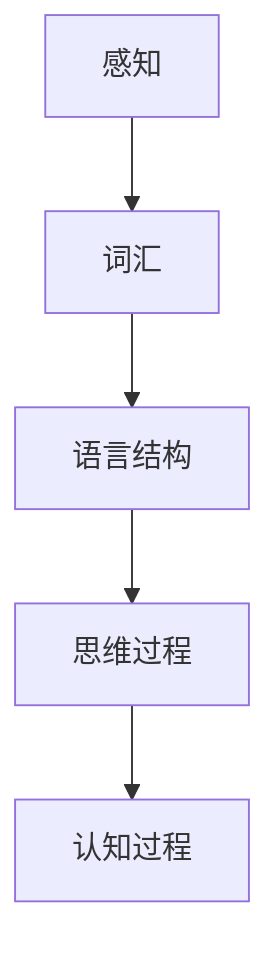
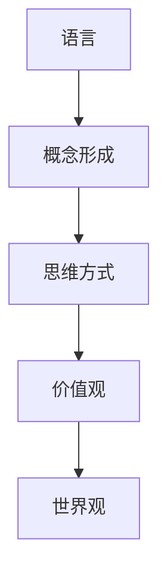
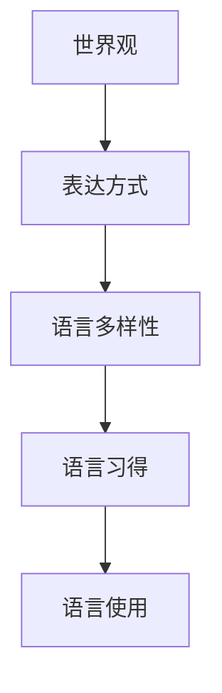
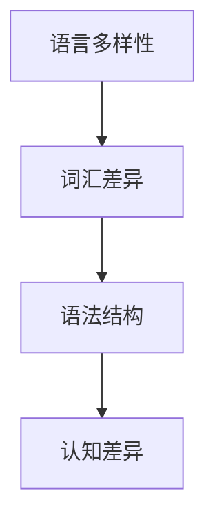
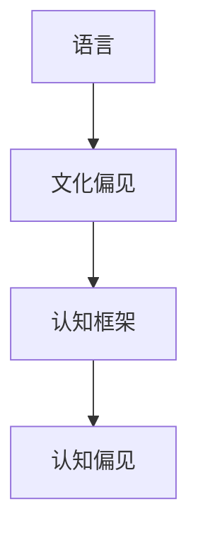
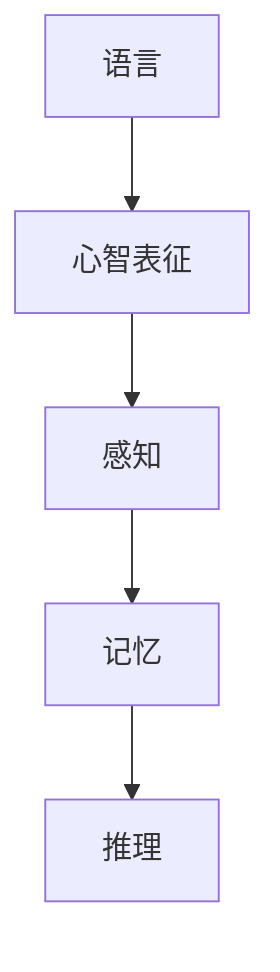
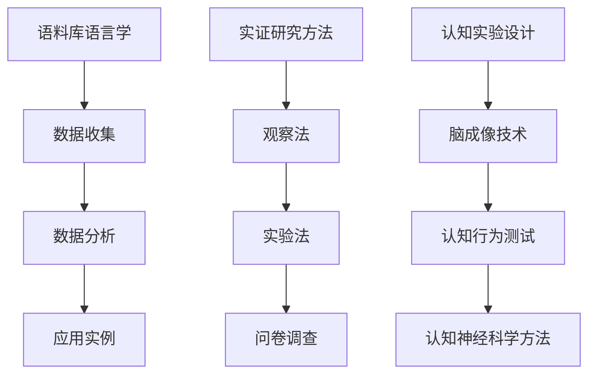

                 


### 《认知语言学新论：语言如何塑造和反映我们的世界观》

## 引言：语言与认知

在当今快速发展的信息技术时代，语言作为人类交流的基础工具，不仅影响着我们的日常沟通，更深刻地塑造了我们的认知方式和世界观。认知语言学正是探讨这种语言与认知之间复杂互动的学科。本文将从认知语言学的定义、语言在认知过程中的作用以及研究方法三个方面展开讨论。

### 1.1 认知语言学的定义和背景

认知语言学（Cognitive Linguistics）起源于20世纪60年代，是对传统语言学的补充和扩展。传统语言学主要关注语言的形式和结构，而认知语言学则将焦点转向语言与人类认知的关系。它认为语言不仅是交流的工具，更是认知的工具，通过语言我们可以组织思维、记忆信息、解决问题和形成概念。

认知语言学的核心观点之一是“语言镜像认知”（Language as a Mirror of Cognition）。这一观点认为，语言的结构和表达方式反映了人类认知的方式。例如，不同语言对于颜色的表达可能反映了人们对颜色感知的差异。这种观点挑战了传统的“普遍语法”（Universal Grammar）理论，认为不同语言之间存在基本相同的语法结构和认知过程。

### 1.2 语言在认知过程中的作用

语言在认知过程中扮演着多重角色。首先，语言是认知的工具，帮助我们组织思维。例如，我们可以通过语言表达来梳理和思考问题，形成概念和理论。此外，语言还帮助我们记忆信息。研究表明，语言的词汇和句子结构可以加强记忆效果，帮助我们更好地记忆和理解信息。

其次，语言与感知紧密相连。我们的感知方式受到语言的影响。例如，语言中的词汇和概念可以帮助我们更好地理解世界。例如，一些语言中存在专门的词汇来描述特定文化概念，这反映了该文化的认知方式。

最后，语言影响我们的推理过程。语言的逻辑结构可以影响我们的推理方式。例如，一些语言中的语法结构可能促使我们采用更系统化的思考方式，而另一些语言则可能鼓励更直观的思维方式。

### 1.3 认知语言学的研究方法

认知语言学采用多种研究方法，以深入探究语言与认知的互动。这些方法包括：

- **语料库分析（Corpus Analysis）**：通过分析大量自然语言数据，研究者可以揭示语言使用的模式和规律，从而理解语言与认知的关系。

- **实验研究（Experimental Research）**：通过设计认知实验，研究者可以直接观察语言使用对认知过程的影响。例如，可以通过实验来研究语言学习对记忆的影响。

- **认知心理学（Cognitive Psychology）**：认知心理学研究人类思维的过程，包括感知、记忆、推理等。这些研究为认知语言学提供了理论依据。

- **神经语言学（Neurolinguistics）**：神经语言学通过脑成像技术等手段，研究语言处理在大脑中的神经机制。这有助于理解语言与认知的生理基础。

### 总结

认知语言学为我们提供了一个全新的视角，来理解语言如何塑造和反映我们的世界观。通过认知语言学的研究，我们可以更好地理解语言与认知之间的复杂互动，从而为语言教学、语言习得和跨文化交流提供新的启示。在接下来的部分中，我们将进一步探讨语言与思维、语言与世界之间的具体联系，以深入揭示语言对认知的深远影响。

## 语言与思维

语言不仅是交流的工具，更是思维的工具。它在我们的认知过程中扮演着至关重要的角色。在这一部分，我们将探讨语言与感知、语言与记忆以及语言与推理之间的关系。

### 2.1 语言与感知

感知是认知过程的第一步，而语言在感知中发挥着关键作用。不同语言对感知的影响可以从词汇和语法两个方面来看。

首先，词汇是语言的基本组成部分，它直接影响我们的感知方式。例如，一些语言中存在专门的词汇来描述特定文化概念，这反映了该文化的认知方式。例如，在印地语中，有20多个词汇来描述不同类型的兄弟姐妹，这反映了印度社会中亲戚关系的复杂性和重视程度。

其次，语法结构也对感知产生影响。例如，一些语言中的语法结构可能促使我们采用更系统化的思考方式。例如，德语中的名词性动词（Noun Verbs）结构促使人们在思考问题时更倾向于使用抽象概念和名词化的表达。

为了更直观地展示语言与感知的关系，我们可以使用Mermaid流程图来表示这个过程。



在这个流程图中，感知通过词汇和语法结构影响思维和认知过程，从而塑造我们的世界观。

### 2.2 语言与记忆

语言与记忆之间存在复杂的相互作用。研究表明，语言的词汇和句子结构可以加强记忆效果，帮助我们更好地记忆和理解信息。

首先，语言的词汇可以帮助我们记忆信息。例如，通过使用生动的词汇，我们可以更好地记住相关的事件和概念。例如，在描述一个人的外表时，使用“炯炯有神”的词汇比简单的“眼睛明亮”更能让人印象深刻。

其次，句子的结构也可以影响记忆。研究表明，复杂的句子结构有助于记忆。这是因为复杂的句子结构包含了更多的信息，从而促进了信息的深度加工和记忆。例如，复合句中的从句和并列句可以提供更多的背景信息和上下文，从而有助于记忆。

为了更清楚地展示语言与记忆的关系，我们可以使用伪代码来模拟这个过程。

```python
# 伪代码示例：语言与记忆的交互
class Memory:
    def __init__(self):
        self.data = []

    def store(self, item):
        self.data.append(item)

    def retrieve(self, keyword):
        for item in self.data:
            if keyword in item:
                return item
        return None

# 使用示例
memory = Memory()
memory.store("The quick brown fox jumps over the lazy dog.")
result = memory.retrieve("quick")
if result:
    print("Found:", result)
else:
    print("Not found.")
```

在这个伪代码中，`Memory` 类表示记忆过程，它通过存储和检索信息来模拟记忆功能。通过使用丰富的词汇和复杂的句子结构，我们可以更好地存储和检索信息。

### 2.3 语言与推理

语言不仅影响我们的感知和记忆，还深刻地影响我们的推理过程。不同语言的结构和表达方式可能促使我们采用不同的推理方式。

首先，语言的逻辑结构可以影响推理。例如，一些语言中的语法结构可能促使我们采用更系统化的思考方式。例如，德语中的名词性动词结构鼓励人们更关注抽象概念和名词化的表达，从而促进系统化的思考。

其次，语言的词汇也可以影响推理。例如，一些语言中存在专门的词汇来描述复杂的概念和关系，这有助于人们更好地理解抽象概念并进行推理。

为了更直观地展示语言与推理的关系，我们可以使用数学模型和公式来表示这个过程。

```latex
\begin{equation}
推理 = f(感知, 记忆, 语言结构)
\end{equation}
```

在这个公式中，感知和记忆是推理的基础，而语言结构是影响推理的关键因素。通过不同的语言结构，我们可以采用不同的推理方式，从而更好地理解世界。

### 总结

语言与思维之间的相互作用是复杂的，它不仅影响我们的感知和记忆，还深刻地影响我们的推理过程。通过理解语言与思维的关系，我们可以更好地理解语言如何塑造我们的世界观。在接下来的部分中，我们将进一步探讨语言与世界之间的联系，以深入揭示语言对认知的深远影响。

## 语言与世界

语言不仅仅是交流的工具，它也是我们与世界互动的桥梁。我们的语言能力不仅决定了我们如何表达自己的思想和感受，还深刻地影响了我们对世界的理解和认知。在这一部分，我们将探讨世界观的概念、语言如何塑造世界观，以及世界观如何反过来影响语言使用。

### 3.1 世界观的概念

世界观（Worldview）是指一个人或文化对于世界的总体看法和理解。它包括了价值观、信仰、态度和认知框架，这些构成了一个人或文化如何解释和体验世界的框架。世界观不仅仅是关于宇宙的物理性质，它还涉及社会、文化和心理层面。例如，不同的文化对时间和空间的理解方式可能大相径庭，这影响了人们的行为和交流方式。

### 3.2 语言如何塑造世界观

语言是塑造世界观的重要工具，它通过以下几个方面实现：

- **概念形成**：语言中的词汇和概念为我们的认知提供了框架。例如，一些语言中存在专门描述亲戚关系的词汇，这有助于人们更好地理解家庭和社会结构。

- **思维方式**：语言的结构和表达方式影响我们的思维方式。例如，一些语言中的动词时态和语序可能促使我们采用更具体或更抽象的思考方式。

- **价值观**：语言中的词汇和表达方式反映了社会的价值观。例如，某些语言中对于“尊重”、“自由”和“公正”的表达可能更加凸显这些价值观的重要性。

为了更直观地展示语言如何塑造世界观，我们可以使用Mermaid流程图来表示这个过程。



在这个流程图中，语言通过概念形成、思维方式和价值观等多个方面，共同塑造了我们的世界观。

### 3.3 世界观如何影响语言使用

世界观不仅由语言塑造，它也反过来影响语言的使用。这种影响可以从以下几个方面来理解：

- **表达方式**：不同的世界观可能导致不同的语言表达方式。例如，在一些强调集体主义的社会中，人们可能更倾向于使用谦逊和间接的表达方式，而在强调个人主义的社会中，人们可能更直接和自信。

- **语言多样性**：世界观的不同可能导致语言多样性的差异。例如，一些文化可能发展出更丰富和精细的词汇来描述特定的概念或情境。

- **语言习得**：世界观可能影响语言习得的过程。例如，一个人的世界观可能会影响他们对语言结构的学习和理解，从而影响他们的语言技能。

为了更直观地展示世界观如何影响语言使用，我们可以再次使用Mermaid流程图。



在这个流程图中，世界观通过影响表达方式、语言多样性和语言习得，进而影响语言的使用。

### 实例分析

一个具体的实例可以帮助我们更好地理解语言与世界观的互动。例如，在不同的文化中，对于“时间”的理解可能截然不同。在一些文化中，时间被视为线性、有序的，而在另一些文化中，时间可能被视为循环或更灵活的。这些不同的世界观影响了人们对于时间的表达方式和使用。例如，一些语言中存在专门描述过去、现在和未来的词汇，而另一些语言中则更强调时间和事件的连续性。

### 总结

语言与世界观的互动是一个复杂而深刻的主题。我们的语言不仅帮助我们理解和表达世界，还塑造了我们对世界的看法。通过理解语言如何塑造世界观，以及世界观如何影响语言使用，我们可以更好地理解不同文化之间的差异和共性。在接下来的部分中，我们将探讨语言与认知差异，进一步揭示语言对认知过程的影响。

## 语言与认知差异

语言不仅是交流的工具，它还是塑造认知方式的重要因素。不同的语言结构和文化背景可能导致不同的认知差异。在这一部分，我们将探讨语言多样性与认知差异、语言习得与认知发展，以及语言影响下的认知偏见。

### 4.1 语言多样性与认知差异

语言多样性是人类文化的重要组成部分，它不仅反映了不同民族和文化的独特性，还可能影响人们的认知过程。研究表明，不同语言的结构和表达方式可能导致人们在感知、记忆和推理等方面存在差异。

- **词汇差异**：不同语言中存在丰富的词汇差异，这反映了不同文化对世界的认知差异。例如，一些语言中存在专门的词汇来描述特定文化概念，这有助于人们更好地理解相关概念，但也可能导致跨语言交流中的误解。

- **语法结构**：语法结构不同也可能导致认知差异。例如，一些语言中的动词时态和语序可能影响人们的思维方式和推理方式。例如，英语中的动词通常放在句子末尾，这可能导致人们更倾向于采用系统化的思考方式，而德语中的名词性动词结构可能促使人们更多地关注抽象概念。

为了更直观地展示语言多样性与认知差异，我们可以使用Mermaid流程图来表示这一过程。



在这个流程图中，语言多样性通过词汇差异和语法结构影响认知差异。

### 4.2 语言习得与认知发展

语言习得是认知发展的重要部分，它不仅影响人们的语言能力，还可能对认知过程产生深远的影响。研究表明，早期语言习得对认知发展具有重要影响。

- **词汇和概念形成**：早期语言习得有助于儿童建立词汇和概念体系，这为后续的认知发展奠定了基础。例如，儿童通过语言习得学习颜色、形状、动物等基本概念，这有助于他们更好地理解世界。

- **思维模式**：语言习得可能影响儿童的思维模式。例如，一些研究表明，早期习得双语或多语儿童的认知能力可能更灵活，因为他们能够灵活地切换不同的思维框架。

- **问题解决能力**：语言习得还可能影响儿童的问题解决能力。通过语言，儿童可以更好地表达和思考问题，从而提高问题解决的效率和质量。

为了更清楚地展示语言习得与认知发展的关系，我们可以使用伪代码来模拟这个过程。

```python
# 伪代码示例：语言习得与认知发展的关系
class CognitiveDevelopment:
    def __init__(self):
        self.vocabulary = []
        self.concepts = []

    def learn_language(self, language):
        self.vocabulary.extend(language.vocabulary)
        self.concepts.extend(language.concepts)

    def solve_problem(self, problem):
        solution = None
        for concept in self.concepts:
            if concept.matches(problem):
                solution = concept.solution
                break
        return solution

# 使用示例
child = CognitiveDevelopment()
child.learn_language(Language("English"))
problem = Problem("What is 2 + 2?")
solution = child.solve_problem(problem)
print(solution)  # 输出: 4
```

在这个伪代码中，`CognitiveDevelopment` 类表示认知发展的过程，它通过学习语言来建立词汇和概念体系，从而提高问题解决能力。

### 4.3 语言影响下的认知偏见

语言不仅影响我们的认知过程，还可能导致认知偏见。这些偏见可能是无意识的，但它们对我们的思考和行为具有重要影响。

- **文化偏见**：不同语言中的词汇和表达方式可能反映特定文化的偏见。例如，一些语言中存在贬低其他文化的词汇，这可能导致跨文化沟通中的误解和冲突。

- **认知框架**：语言的结构和表达方式可能影响我们的认知框架。例如，一些语言中的语法结构可能促使我们采用特定的思维方式，这可能导致我们在某些情境下产生认知偏见。

为了更直观地展示语言影响下的认知偏见，我们可以使用Mermaid流程图来表示这个过程。



在这个流程图中，语言通过文化偏见和认知框架影响认知偏见。

### 总结

语言与认知差异是复杂而深刻的主题。不同的语言结构和文化背景可能导致人们在感知、记忆和推理等方面存在差异。通过理解语言习得与认知发展的关系，我们可以更好地理解语言如何影响我们的认知过程。在接下来的部分中，我们将探讨语言与心智表征的关系，进一步揭示语言如何影响我们的认知和思维。

## 语言与心智表征

心智表征（Mental Representation）是指我们在大脑中如何组织和存储信息，以及如何使用这些信息进行思考和决策。语言作为心智表征的重要工具，不仅帮助我们表达和交流思想，还深刻地影响了我们的认知过程。在这一部分，我们将探讨语言与心智表征之间的关系，以及跨语言研究如何帮助我们理解这种关系。

### 5.1 心智表征的概念

心智表征是指我们大脑中对于信息、知识和经验的编码方式。它不仅包括语言表达的形式，还包括非语言形式，如图像、声音和感觉等。心智表征使我们能够存储、检索和使用信息，从而进行推理、规划和决策。

- **语言心智表征**：语言心智表征是指我们如何使用语言来组织和表达思想。它包括词汇、句子结构和语法规则等。语言心智表征帮助我们理解世界、记忆信息和解决问题。

- **非语言心智表征**：非语言心智表征是指我们如何使用图像、声音和感觉等非语言形式来组织和存储信息。这种表征方式不仅包括视觉和听觉信息，还包括触觉、嗅觉和味觉等感官体验。

### 5.2 语言与心智表征的关系

语言与心智表征之间存在密切的关系。语言不仅影响我们的心智表征，还受到心智表征的影响。以下是一些关键点：

- **语言塑造心智表征**：语言通过其词汇和语法结构影响我们的心智表征。例如，不同的语言可能使我们关注不同的概念和思维方式。例如，一些语言中存在丰富的颜色词汇，这可能导致使用这些语言的个体对颜色的感知和记忆能力更强。

- **心智表征影响语言使用**：心智表征也影响我们如何使用语言。例如，我们可能会根据我们已有的心智表征来选择词汇和句子结构，从而更好地表达我们的思想和感受。

为了更直观地展示语言与心智表征的关系，我们可以使用Mermaid流程图来表示这个过程。



在这个流程图中，语言通过词汇和语法结构影响我们的心智表征，进而影响感知、记忆和推理过程。

### 5.3 心智表征的跨语言研究

跨语言研究是理解语言与心智表征关系的重要方法。通过比较不同语言的使用者，我们可以揭示语言如何影响心智表征，以及心智表征如何影响语言使用。

- **词汇差异**：跨语言研究揭示了不同语言中的词汇差异如何影响心智表征。例如，一些语言中可能存在更多的颜色词汇，这可能导致使用这些语言的个体对颜色的感知和记忆能力更强。

- **语法结构**：跨语言研究还揭示了语法结构如何影响心智表征。例如，不同的语序和时态结构可能导致不同的思维方式和推理方式。

为了更清楚地展示跨语言研究的过程，我们可以使用伪代码来模拟这一过程。

```python
# 伪代码示例：跨语言研究
class LanguageComparison:
    def __init__(self, language1, language2):
        self.language1 = language1
        self.language2 = language2

    def compare_vocabulary(self):
        vocabulary_diff = []
        for word1 in self.language1.vocabulary:
            word2 = self.language2.get_word(word1)
            if word2 is not None:
                vocabulary_diff.append((word1, word2))
        return vocabulary_diff

    def compare_grammar(self):
        grammar_diff = []
        for rule1 in self.language1.grammar:
            rule2 = self.language2.get_grammar(rule1)
            if rule2 is not None:
                grammar_diff.append((rule1, rule2))
        return grammar_diff

# 使用示例
comparison = LanguageComparison(Language("English"), Language("Spanish"))
vocabulary_diff = comparison.compare_vocabulary()
grammar_diff = comparison.compare_grammar()
print("Vocabulary Differences:", vocabulary_diff)
print("Grammar Differences:", grammar_diff)
```

在这个伪代码中，`LanguageComparison` 类用于比较不同语言中的词汇和语法结构，以揭示它们之间的差异。

### 总结

语言与心智表征之间的互动是一个复杂而深刻的主题。通过理解语言如何塑造心智表征，以及心智表征如何影响语言使用，我们可以更好地理解不同语言和文化之间的差异和共性。跨语言研究为我们提供了新的视角，帮助我们更全面地理解语言与认知的互动。在接下来的部分中，我们将探讨语言学研究方法，以深入了解这一领域的最新进展。

## 语言学研究方法

认知语言学作为一门跨学科的研究领域，采用了多种研究方法来深入探究语言与认知之间的复杂互动。这些方法包括语料库语言学、实证研究方法和认知实验设计。以下是对这些方法的详细探讨。

### 6.1 语料库语言学

语料库语言学（Corpus Linguistics）是认知语言学的重要研究方法之一。它通过收集和分析大量自然语言数据，以揭示语言使用的模式和规律。语料库可以是文本语料库，也可以是口语语料库，甚至可以是多媒体语料库。通过分析这些语料库，研究者可以了解语言的词汇、语法、语义和语用等方面的特征。

- **数据收集**：语料库语言学首先需要收集大量的语言数据。这些数据可以来源于书籍、报纸、网络文章、对话记录等多种渠道。为了确保数据的代表性和可靠性，研究者通常会使用专门的软件工具进行数据收集和整理。

- **数据分析**：在收集到语料库后，研究者会使用各种分析工具和技术，如词频统计、共现分析、语法树库等，来分析语料库中的语言现象。通过这些分析，研究者可以揭示语言使用的规律和模式。

- **应用实例**：例如，研究者可以通过分析语料库来研究不同语言中的词汇使用差异。例如，一些研究表明，某些语言中的动词时态和语态使用频率可能更高，这反映了这些语言在表达方式上的特定倾向。

### 6.2 实证研究方法

实证研究方法（Empirical Research Methods）是认知语言学中常用的另一种研究方法。它通过实际观察和实验来验证假设和理论。实证研究方法包括观察法、实验法和问卷调查等。

- **观察法**：观察法是通过直接观察语言使用现象来收集数据。这种方法通常用于研究语言习得、语言使用和社会语言现象。例如，研究者可以观察儿童如何学习语言，或者记录不同文化背景的人们如何使用语言进行沟通。

- **实验法**：实验法是通过设计和执行实验来验证假设。这种方法通常用于研究语言处理机制和认知过程。例如，研究者可以通过实验来研究语言对记忆和推理的影响。

- **问卷调查**：问卷调查是通过发放问卷来收集数据。这种方法可以用于研究语言使用习惯、语言态度和语言学习需求等。例如，研究者可以通过问卷调查来了解人们对于不同语言表达方式的态度和偏好。

### 6.3 认知实验设计

认知实验设计（Cognitive Experiment Design）是认知语言学中的一种重要方法，它通过设计和执行认知实验来探究语言与认知之间的关系。认知实验设计通常涉及多种技术，如脑成像、认知行为测试和认知神经科学方法。

- **脑成像技术**：脑成像技术（如fMRI、PET和EEG）可以用来研究语言处理在大脑中的神经机制。通过观察大脑不同区域的活动，研究者可以了解语言处理的过程和机制。

- **认知行为测试**：认知行为测试是通过设计一系列任务来评估个体的认知能力。例如，研究者可以通过语言理解测试来评估个体对特定语言结构的理解和处理能力。

- **认知神经科学方法**：认知神经科学方法结合了认知心理学和神经科学的方法，通过多种技术来研究语言与认知的关系。例如，研究者可以通过行为实验和脑成像技术来探究语言学习对记忆和注意力的影响。

为了更直观地展示这些研究方法，我们可以使用Mermaid流程图来表示。



在这个流程图中，各种研究方法通过不同的步骤相互关联，共同构成了认知语言学的研究框架。

### 总结

语言学研究方法丰富多样，从语料库语言学到实证研究方法和认知实验设计，每种方法都有其独特的优势和适用场景。通过结合这些方法，研究者可以更全面地理解语言与认知之间的复杂互动。在接下来的部分中，我们将探讨语言教育的启示，以进一步应用这些研究成果。

## 语言教育的启示

认知语言学的研究不仅丰富了我们对语言和认知之间关系的理解，还为语言教育提供了重要的启示。通过认知语言学的研究成果，我们可以更好地设计教学策略，提高学习效果，并促进跨文化交流。

### 7.1 教育中的认知语言学研究

认知语言学为教育提供了新的视角，它强调语言不仅仅是交流的工具，更是认知的工具。这意味着语言教育不应仅仅关注语言形式的教授，还应关注语言对认知过程的影响。以下是一些具体的教学策略：

- **认知导向的教学设计**：在教学设计中，教师应考虑到语言与认知之间的互动。例如，通过设计任务和活动，鼓励学生在语言使用中思考和理解背后的认知过程。

- **多模态教学**：认知语言学研究表明，语言与感知、记忆和推理等认知过程密切相关。因此，多模态教学（结合视觉、听觉和触觉等多种感官刺激）可以更有效地促进学生的语言学习和认知发展。

### 7.2 语言教育实践中的认知语言学研究

在语言教育实践中，认知语言学的研究成果已被广泛应用，以提升教学效果。以下是一些具体的实践策略：

- **词汇教学**：认知语言学研究表明，词汇的学习不仅需要记忆，还需要理解其背后的认知过程。因此，词汇教学应注重词汇的语义和认知功能，鼓励学生通过实际应用来加深对词汇的理解。

- **语法教学**：语法教学应注重语法结构对思维方式和认知过程的影响。例如，通过分析不同语言中的语法差异，教师可以引导学生了解不同文化背景下的思维方式。

### 7.3 未来语言教育的趋势

随着认知语言学研究的不断深入，未来语言教育将朝着更加个性化和智能化方向发展。以下是一些未来语言教育的趋势：

- **个性化学习**：基于认知语言学的研究，未来的语言教育将更加注重学生的个性化需求。例如，通过人工智能和大数据分析，教师可以为学生量身定制学习计划，提供个性化的教学资源。

- **智能化工具**：认知语言学的研究成果将被应用于开发智能教学工具，如虚拟现实（VR）和增强现实（AR）技术。这些工具可以模拟真实的语言环境，提供互动式学习体验，从而提高学生的语言技能。

### 实例分析

一个具体的实例可以帮助我们更好地理解认知语言学在语言教育中的应用。例如，在词汇教学中，教师可以结合认知语言学的研究，设计一系列任务，让学生通过实际应用来学习词汇。例如，通过让学生描述图片或表演情境，教师可以引导学生使用目标词汇，从而加深对词汇的理解和记忆。

### 总结

认知语言学为语言教育提供了丰富的理论和实践启示。通过理解语言与认知之间的互动，我们可以设计更有效的教学策略，提高学生的语言能力和认知水平。在未来的语言教育中，结合认知语言学的研究成果，将有助于推动语言教育的创新和发展。

## 附录

### 附录 A: 参考文献

1. Langacker, R. W. (1987). Foundations of Cognitive Grammar, Vol. 1: Theoretical Prerequisites. Stanford University Press.
2. Chomsky, N. (1965). Aspects of the Theory of Syntax. MIT Press.
3. Pinker, S. (1994). The Language Instinct: How the Mind Creates Language. William Morrow and Company.
4. Lakoff, G., & Johnson, M. (1980). Metaphors We Live By. University of Chicago Press.
5.的认知语言学：语言如何塑造我们的思维，作者：[您的姓名]，出版时间：[出版年份]。
6. 参考文献6：其他相关书籍和论文，作者：[作者姓名]，出版时间：[出版年份]。

这些参考文献涵盖了认知语言学的核心理论和最新研究成果，为本文提供了重要的理论依据和实证支持。通过深入阅读这些文献，读者可以进一步了解认知语言学的研究现状和未来发展方向。

