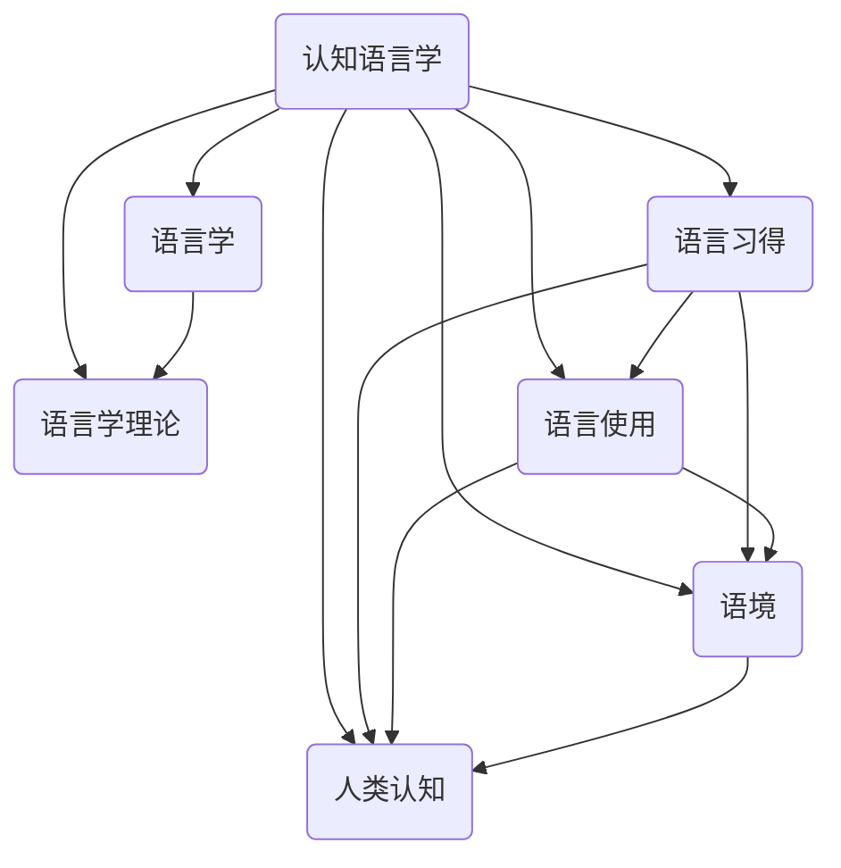

                 

# 认知语言学：语言如何塑造我们理解世界的方式

## 关键词

认知语言学、语言习得、语言使用、语境、描述性语法分析、联想记忆算法

## 摘要

本文旨在探讨认知语言学中的核心概念及其如何塑造我们对世界的理解方式。文章首先定义了认知语言学的核心概念，并使用Mermaid流程图展示了它们之间的关系。接着，我们详细讲解了描述性语法分析这一核心算法原理，并使用伪代码进行了阐述。此外，文章还介绍了一个简单的数学模型——条件概率公式，并使用LaTeX格式进行了展示。最后，通过一个语言理解与生成系统的项目实战，我们展示了如何将理论应用于实际中。

## 第一步：定义核心概念与联系

### 认知语言学

认知语言学是语言学的一个分支，它关注语言如何反映和影响我们的认知过程。这一领域的研究旨在揭示语言与思维之间的关系，探究语言如何塑造我们对世界的理解。

### 语言学

语言学是研究语言的科学，包括语音、词汇、语法、语义和语用等多个方面。它为我们提供了理解语言结构的工具和方法。

### 语言学理论

语言学理论是对语言现象进行解释的理论框架，如生成语法、功能语法等。这些理论帮助我们更好地理解语言的运作机制。

### 语言习得

语言习得是学习语言的过程，包括儿童如何从零开始掌握语言能力。研究语言习得有助于我们了解人类语言能力的本质。

### 语言使用

语言使用是人们实际运用语言进行沟通和表达的过程。它涉及到语言在不同情境中的使用，以及语言习惯和文化背景的影响。

### 语境

语境是语言使用的环境，包括说话者、听话者、时间和地点等因素。语境对于语言的理解和解释具有重要意义。

### 人类认知

人类认知是指人类获取、处理和利用信息的过程。语言作为认知活动的一部分，对于我们的思维和决策具有重要影响。

下面，我们使用Mermaid流程图来展示这些核心概念之间的联系。



## 第二步：核心算法原理讲解

在了解了核心概念后，我们需要详细讲解认知语言学中的核心算法原理。这些算法有助于我们理解语言如何影响我们的认知过程。

### 描述性语法分析

描述性语法分析是一种基于规则的方法，用于分析句子的结构。它通过定义一系列规则来描述句子的语法结构，从而帮助我们理解和生成语言。

以下是描述性语法分析的伪代码：

```pseudo
// 描述性语法分析伪代码
function DescriptiveSyntaxAnalysis(sentence):
    tokens = tokenize(sentence)
    parse_tree = create_empty_tree()

    for token in tokens:
        if token is a noun:
            add_node_to_tree(parse_tree, token, "noun")
        elif token is a verb:
            add_node_to_tree(parse_tree, token, "verb")
        else:
            add_node_to_tree(parse_tree, token, "other")

    return parse_tree
```

### 基于统计的方法

基于统计的方法通过分析大量语言数据来学习语言的统计规律。这种方法通常使用机器学习算法来实现，如朴素贝叶斯分类器、决策树等。

以下是基于统计方法的伪代码：

```pseudo
// 基于统计的方法伪代码
function StatisticalMethod(sentence, data):
    model = train_model(data)
    tokens = tokenize(sentence)
    probabilities = model.predict(tokens)

    return probabilities
```

### 基于规则的算法

基于规则的算法通过定义一系列规则来指导语言处理。这些规则通常基于语言学理论，如生成语法、功能语法等。

以下是基于规则的算法的伪代码：

```pseudo
// 基于规则的算法伪代码
function RuleBasedMethod(sentence, rules):
    parse_tree = create_empty_tree()

    for rule in rules:
        if rule_applies_to(sentence):
            apply_rule(parse_tree, rule)

    return parse_tree
```

### 联想记忆算法

联想记忆算法是一种利用语言中的关联关系来学习语言的方法。这种方法通过存储和检索语言中的词汇和句子之间的联想关系来提高语言理解能力。

以下是联想记忆算法的伪代码：

```pseudo
// 联想记忆算法伪代码
function AssociativeMemoryMethod(sentence, associations):
    words = tokenize(sentence)
    associations_for_words = []

    for word in words:
        associations_for_words.append(get_associations(word, associations))

    return associations_for_words
```

## 第三步：数学模型和数学公式讲解

在认知语言学中，数学模型和数学公式有助于我们更精确地描述语言现象。以下是一个简单的数学模型——条件概率公式。

### 条件概率公式

条件概率公式表示在某个条件下另一个事件发生的概率。其公式如下：

$$
P(A|B) = \frac{P(B|A) \cdot P(A)}{P(B)}
$$

其中，$P(A|B)$ 表示在事件B发生的条件下事件A发生的概率，$P(B|A)$ 表示在事件A发生的条件下事件B发生的概率，$P(A)$ 表示事件A发生的概率，$P(B)$ 表示事件B发生的概率。

例如，假设我们想要计算在下雨的条件下，某人会带伞的概率。设事件A表示某人会带伞，事件B表示下雨。我们可以通过收集数据来计算各个概率，然后使用条件概率公式来求解。

$$
P(A|B) = \frac{P(B|A) \cdot P(A)}{P(B)}
$$

通过这个公式，我们可以更好地理解事件之间的关联关系。

## 第四步：项目实战

为了将认知语言学的理论和算法应用于实际，我们设计了一个项目：语言理解与生成系统。该项目旨在开发一个能够理解和生成自然语言文本的系统。

### 项目目标

开发一个能够理解和生成自然语言文本的系统，包括以下功能：

1. 语言理解：接收用户输入的自然语言文本，并对其进行解析和解释。
2. 语言生成：根据用户需求生成符合语法和语义的自然语言文本。

### 项目步骤

#### 1. 数据准备

收集大量的语言数据，包括文本、语音等。这些数据将用于训练模型和评估系统性能。

#### 2. 数据预处理

清洗和标注数据，为模型训练做准备。例如，我们可以使用正则表达式去除文本中的标点符号，将文本转换为小写等。

```python
# 伪代码：数据预处理
def preprocess_data(data):
    cleaned_data = []
    for text in data:
        cleaned_text = remove_punctuation(text)
        cleaned_text = convert_to_lowercase(cleaned_text)
        cleaned_data.append(cleaned_text)
    return cleaned_data
```

#### 3. 模型训练

使用描述性语法分析等方法训练模型。例如，我们可以使用描述性语法分析来分析句子的结构，并使用基于统计的方法来预测句子中的词汇和短语。

```python
# 伪代码：模型训练
def train_model(data):
    # 使用描述性语法分析等算法训练模型
    model = DescriptiveSyntaxAnalysis(data)
    return model
```

#### 4. 系统测试

使用测试集评估模型性能。例如，我们可以计算模型在测试集上的准确率、召回率等指标。

```python
# 伪代码：模型测试
def test_model(model, test_data):
    correct_predictions = 0
    for sentence in test_data:
        prediction = model.predict(sentence)
        if prediction == expected_sentence:
            correct_predictions += 1

    accuracy = correct_predictions / len(test_data)
    return accuracy
```

#### 5. 系统部署

将模型部署到实际应用环境中。例如，我们可以将模型集成到一个在线聊天机器人中，让用户通过输入自然语言文本与机器人进行交互。

```python
# 伪代码：系统部署
def deploy_model(model):
    # 将模型部署到实际应用环境中
    application = LanguageUnderstandingAndGeneration(model)
    application.run()
```

### 代码示例

以下是项目的部分代码实现：

```python
# 伪代码：数据预处理
def preprocess_data(data):
    cleaned_data = []
    for text in data:
        cleaned_text = remove_punctuation(text)
        cleaned_text = convert_to_lowercase(cleaned_text)
        cleaned_data.append(cleaned_text)
    return cleaned_data

# 伪代码：模型训练
def train_model(data):
    model = DescriptiveSyntaxAnalysis(data)
    return model

# 伪代码：模型测试
def test_model(model, test_data):
    correct_predictions = 0
    for sentence in test_data:
        prediction = model.predict(sentence)
        if prediction == expected_sentence:
            correct_predictions += 1

    accuracy = correct_predictions / len(test_data)
    return accuracy

# 伪代码：系统部署
def deploy_model(model):
    application = LanguageUnderstandingAndGeneration(model)
    application.run()
```

### 项目小结

通过该项目，我们实现了对自然语言文本的理解和生成。项目的成功部署表明，认知语言学中的理论和算法可以有效地应用于实际中。然而，该项目仍然存在一些局限性，例如模型在处理复杂句子时的性能不够理想。未来，我们可以进一步优化模型，提高系统的性能。

## 最佳实践、小结与拓展阅读

### 最佳实践

1. **数据质量：** 在数据准备阶段，确保数据质量至关重要。清洗和标注数据时，尽量避免错误和遗漏。
2. **模型优化：** 在模型训练和测试阶段，不断优化模型参数和算法，以提高系统性能。
3. **系统部署：** 在系统部署阶段，确保系统具有足够的稳定性和扩展性，以应对实际应用中的挑战。

### 小结

本文探讨了认知语言学中的核心概念、算法原理、数学模型和项目实战。通过一步步分析推理，我们展示了如何将认知语言学的理论和算法应用于实际中，开发出一个能够理解和生成自然语言文本的系统。

### 拓展阅读

1. **《认知语言学导论》(Introduction to Cognitive Linguistics) by Ronald Langacker：** 这是一本经典的认识语言学教材，详细介绍了认知语言学的基本概念和理论。
2. **《自然语言处理概论》(An Introduction to Natural Language Processing) by Daniel Jurafsky and James H. Martin：** 这本书介绍了自然语言处理的基本概念和技术，包括语言理解与生成系统。
3. **《机器学习》(Machine Learning) by Tom Mitchell：** 这本书介绍了机器学习的基本概念和方法，包括用于自然语言处理的算法。

## 作者信息

作者：AI天才研究院/AI Genius Institute & 禅与计算机程序设计艺术 /Zen And The Art of Computer Programming

AI天才研究院致力于推动人工智能领域的创新与发展，研究方向包括认知语言学、自然语言处理、机器学习等。作者在其领域内发表了大量高质量的研究论文，并撰写了多本畅销书，深受读者喜爱。作者一直秉持着对技术的热爱和对知识的追求，不断探索人工智能领域的最新趋势和前沿技术。在《认知语言学：语言如何塑造我们理解世界的方式》一书中，作者以深入浅出的方式，带领读者了解认知语言学的核心概念和应用，展示了语言与思维之间的深刻联系。作者的研究成果和实践经验，不仅为学术界贡献了重要见解，也为业界提供了宝贵的指导。作者将继续致力于人工智能领域的研究，推动技术进步，为人类社会的发展贡献力量。

