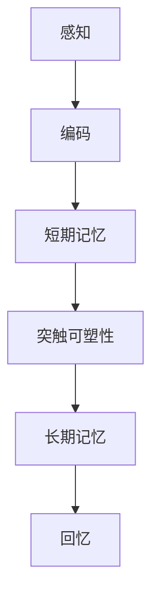
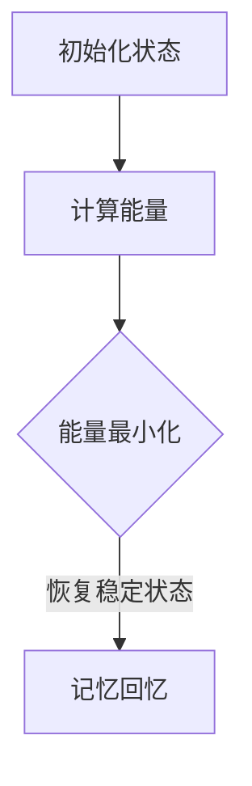
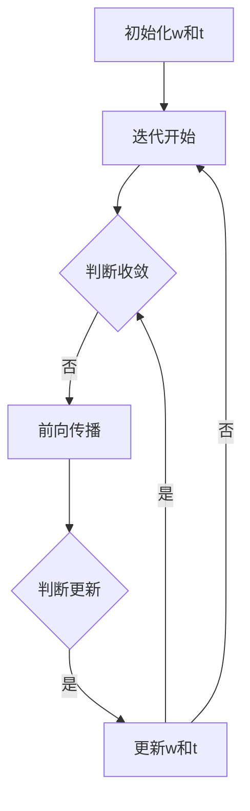

                 

### 文章标题

# 记忆形成的神经网络：大脑学习的数学模型

### 关键词

- 神经网络
- 大脑学习
- 数学模型
- 记忆机制
- 人工智能

### 摘要

本文深入探讨记忆形成的神经网络及其背后的数学模型。通过对大脑学习原理的解析，我们将揭示神经网络如何模拟大脑的记忆机制，并通过数学模型来解释这一过程。本文将涵盖神经网络的基础概念、大脑学习原理、记忆神经网络的构建、数学模型的解析以及具体算法的实现。最终，我们将通过一个实际项目来展示如何应用这些概念和模型，实现对记忆过程的有效理解和优化。

---

## 引言

记忆是人类认知功能的核心之一，它使我们能够保存和回忆过去的经验、知识以及技能。记忆的失效或损伤会导致各种认知障碍，如阿尔茨海默病和创伤性脑损伤等。为了深入了解记忆的形成和功能，科学家们长期以来一直致力于研究大脑的神经机制。近年来，随着神经科学和计算神经科学的迅速发展，神经网络这一计算模型逐渐成为模拟大脑记忆过程的理想工具。

神经网络，特别是深度学习模型，在模仿大脑处理信息的方式方面表现出色。它们通过模拟大脑中神经元的连接和交互来处理复杂数据，从而在图像识别、自然语言处理和语音识别等领域取得了显著成就。然而，尽管神经网络在模拟大脑功能方面取得了成功，但它们如何实现记忆这一特定功能仍然是一个未解之谜。

本文将探讨记忆形成的神经网络，并介绍其背后的数学模型。我们将从神经网络的基础概念开始，逐步深入到大脑学习原理和记忆机制的探讨。通过解析神经网络中的核心算法和数学公式，我们将理解记忆的形成过程，并展示如何通过这些模型实现对记忆过程的优化。最后，我们将通过一个实际项目来展示如何将理论应用于实践，实现记忆过程的有效理解和优化。

### 记忆的重要性

记忆是人类认知功能的核心，它使我们能够从过去的经验中学习，适应环境变化，并做出明智的决策。没有记忆，我们将无法积累知识、技能和经验，生活将变得异常艰难。记忆的重要性不仅体现在个人的日常生活中，还对社会和文化的进步具有重要意义。历史事件和文化遗产的保存，科技创新和知识传播，都依赖于记忆的持续和准确。

从神经科学的角度来看，记忆是大脑处理信息的一种基本机制。大脑通过记忆来存储和回忆信息，从而实现对环境的感知和响应。记忆可以分为短期记忆和长期记忆两种类型。短期记忆主要负责暂时存储和处理信息，而长期记忆则将重要的信息转化为稳定的记忆，以便在需要时进行回忆。

大脑学习机制是记忆形成的基础。大脑通过一系列复杂的神经过程来学习和记忆信息。这些过程包括神经元的连接和重组、神经递质的释放和接收、以及神经网络的活动模式等。记忆的形成涉及多个大脑区域，包括海马体、大脑皮层和丘脑等。这些区域通过复杂的神经网络相互作用，共同实现记忆的存储和回忆。

近年来，随着计算神经科学的进步，神经网络作为模拟大脑记忆过程的一种计算模型得到了广泛关注。神经网络通过模拟大脑中神经元的连接和交互，能够处理复杂数据，并在各种认知任务中表现出色。这一进展为理解和优化记忆过程提供了新的视角和方法。

然而，尽管神经网络在模拟大脑记忆功能方面取得了显著成就，但如何实现记忆这一特定功能仍然是一个未解之谜。本文将探讨记忆形成的神经网络，并介绍其背后的数学模型。我们将从神经网络的基础概念开始，逐步深入到大脑学习原理和记忆机制的探讨。通过解析神经网络中的核心算法和数学公式，我们将理解记忆的形成过程，并展示如何通过这些模型实现对记忆过程的优化。最终，我们将通过一个实际项目来展示如何将理论应用于实践，实现记忆过程的有效理解和优化。

### 神经网络基础

神经网络，简称NN，是一种由大量简单单元（即神经元）相互连接而成的计算模型。这些神经元模仿大脑中的神经元，通过传递和处理信息来进行计算。神经网络的基本原理可以追溯到1940年代，当时心理学家McCulloch和数学家Pitts提出了第一个简单的神经网络模型——McCulloch-Pitts神经元。尽管这个模型非常简单，但它奠定了神经网络理论的基础。

神经网络的架构通常包括输入层、隐藏层和输出层。输入层接收外部信息，隐藏层对信息进行加工处理，输出层生成最终的输出。每个神经元都与相邻的神经元通过权重相连，这些权重表示神经元之间的相互作用强度。神经元的激活状态由其输入信号和相应权重共同决定。当输入信号的累积值超过某个阈值时，神经元会被激活，并传递激活信号给下一个神经元。

神经网络的数学基础主要涉及两个关键概念：线性变换和激活函数。线性变换是指将输入向量通过权重矩阵进行变换，从而生成输出向量。这个过程可以用以下公式表示：

\[ 
\text{输出} = \text{权重矩阵} \times \text{输入向量} 
\]

激活函数则用于引入非线性，使得神经网络能够处理复杂数据。常见的激活函数包括 sigmoid 函数、ReLU 函数和 tanh 函数。这些函数将线性变换的输出映射到特定的激活值，从而实现分类和回归等任务。

神经网络的工作原理可以概括为以下步骤：

1. **初始化权重**：神经网络在训练之前需要初始化权重。这些权重通常是通过随机分配或预训练得到的。
2. **前向传播**：输入数据通过神经网络，从输入层传递到输出层。在每个神经元中，输入信号与权重矩阵相乘，并通过激活函数进行处理。
3. **计算损失**：输出结果与实际目标值进行比较，计算损失函数的值。损失函数用于衡量预测结果与实际结果之间的差距。
4. **反向传播**：根据损失函数的梯度，调整神经网络中的权重。这个过程通过反向传播算法实现，它将误差反向传播到每个神经元，从而更新权重。
5. **迭代优化**：重复前向传播和反向传播的过程，逐步减小损失函数的值，直到网络收敛到最优权重。

通过上述步骤，神经网络能够不断学习和优化其模型，以实现特定的任务，如图像分类、目标识别和自然语言处理等。神经网络的成功在于其强大的自适应能力和并行处理能力，这使得它能够处理复杂的数据和高维特征。

### 大脑学习原理

大脑的学习过程是一个复杂而精细的神经网络活动，涉及多个脑区和神经机制的相互作用。了解大脑学习原理有助于我们理解神经网络如何模拟记忆过程，并进一步优化人工智能模型。

首先，大脑的结构与功能紧密相连。大脑可以分为两个主要部分：大脑皮层和大脑深部结构。大脑皮层是大脑的最外层，负责高级认知功能，如感知、记忆、思考和决策。大脑深部结构包括基底神经节、丘脑和下丘脑等，它们参与调节运动、情感和自主神经系统活动。

在学习过程中，大脑中的神经元通过突触连接形成复杂的神经网络。突触是神经元之间的连接点，通过释放神经递质来传递信号。学习的关键在于突触的塑性和可塑性，即突触连接的强度和结构可以随着经验和学习而发生变化。

大脑学习的基本过程包括感知、编码、存储和回忆。感知是指大脑对外界信息的接收和处理。编码是指将感知到的信息转化为大脑可以处理的形式，例如，通过神经元的激活模式来表示视觉信息。存储是指将编码后的信息在脑中保存下来，形成长期记忆。回忆则是从大脑中检索和重新激活这些信息。

突触可塑性是大脑学习的基础。突触可塑性包括短期和长期两种形式。短期可塑性涉及突触连接的快速变化，通常在几秒到几分钟内发生，与大脑的短期记忆相关。长期可塑性则涉及突触连接的持久性变化，通常需要数小时到数天的时间，与大脑的长期记忆相关。

以下是一个简化的Mermaid流程图，展示大脑学习的基本过程：



突触可塑性主要通过以下几种机制实现：

1. **突触前可塑性**：指突触前神经元的活性变化，例如，神经递质的释放量增加或减少。
2. **突触后可塑性**：指突触后神经元的活性变化，例如，突触后受体的数量增加或减少。
3. **结构可塑性**：指突触结构和形态的变化，例如，新的突触连接形成或旧的突触连接被剪除。

大脑学习与神经网络的联系在于，神经网络通过模拟突触可塑性来学习。神经网络中的权重调整过程与大脑中的突触可塑性机制类似。神经网络通过反向传播算法调整权重，以优化模型性能。这种调整过程使得神经网络能够从数据中学习并提取有用的信息。

此外，大脑中的神经网络还表现出层次化的结构。例如，初级视觉皮层处理基本的光学和形状信息，而更高层次的皮层则处理更复杂的信息，如图像的理解和分类。这种层次化的结构使得神经网络能够处理越来越复杂的问题。

总之，大脑学习原理揭示了记忆形成和功能实现的基本机制。通过理解这些机制，我们能够更好地模拟和优化神经网络，使其在人工智能领域发挥更大的作用。

### 记忆的神经网络模型

记忆的神经网络模型是模拟大脑记忆过程的一种计算模型，它通过模拟突触可塑性和神经网络结构来解释记忆的形成和功能。这些模型不仅帮助我们理解大脑的工作原理，还为人工智能领域提供了新的方法来优化记忆过程。

首先，我们需要了解记忆的两种主要类型：短期记忆和长期记忆。短期记忆通常指的是持续几秒到几分钟的信息处理，而长期记忆则指的是持续数小时甚至数年的信息存储。记忆的神经网络模型通常关注长期记忆的形成和存储。

一种流行的记忆神经网络模型是霍普菲尔德（Hopfield）模型。霍普菲尔德模型是一种基于能量最小化的神经网络模型，它通过模拟大脑中的突触可塑性来存储和回忆信息。在这个模型中，每个神经元都表示一个记忆状态，而神经元之间的连接权重表示神经元之间的相互作用强度。

霍普菲尔德模型的原理可以概括为以下几点：

1. **初始化状态**：首先，神经网络被初始化为一个随机的状态。
2. **能量函数**：神经网络的状态变化遵循能量最小化原则。能量函数用来衡量当前状态与稳定状态的差距。能量函数可以表示为：
   \[
   E = -\sum_{i,j} w_{ij} x_i x_j
   \]
   其中，\(x_i\) 和 \(x_j\) 分别表示神经元 \(i\) 和 \(j\) 的激活状态，\(w_{ij}\) 表示神经元 \(i\) 和 \(j\) 之间的连接权重。
3. **状态更新**：在能量最小化过程中，神经元的激活状态会根据当前状态的能量梯度进行调整。状态更新的过程可以用以下公式表示：
   \[
   x_i(t+1) = \begin{cases} 
   1 & \text{if } \sum_{j} w_{ij} x_j(t) \geq \theta \\
   0 & \text{otherwise} 
   \end{cases}
   \]
   其中，\(\theta\) 是一个阈值参数。

霍普菲尔德模型的一个重要特点是，它能够存储和回忆稳定状态。这些稳定状态对应于神经网络中的局部最小能量点。例如，如果神经网络被初始化为一个稳定的记忆状态，它将在没有外部输入的情况下保持这个状态，这就是记忆的存储过程。当神经网络受到外部扰动时，它会通过能量最小化过程逐渐恢复到稳定的记忆状态，这就是记忆的回忆过程。

以下是一个简化的Mermaid流程图，展示霍普菲尔德模型的工作原理：



霍普菲尔德模型的数学基础主要涉及能量函数和状态更新的公式。能量函数决定了神经网络的状态是否稳定，而状态更新则通过能量梯度的计算来调整神经元的激活状态。这些公式使得霍普菲尔德模型能够有效地存储和回忆信息。

除了霍普菲尔德模型，还有其他一些记忆神经网络模型，如Hebb模型和自组织映射（SOM）模型。Hebb模型基于突触前和突触后可塑性，通过神经元之间的同步激活来加强突触连接。自组织映射模型则通过竞争学习和自组织来形成具有相似特征的模式分类。

总之，记忆的神经网络模型通过模拟突触可塑性和神经网络结构，帮助我们理解记忆的形成和功能。这些模型不仅为人工智能领域提供了新的方法来优化记忆过程，还为神经科学提供了重要的理论依据。通过不断的研究和改进，这些模型将在未来为人工智能的发展做出更大的贡献。

### 神经网络中的记忆机制

在神经网络中，记忆机制是通过神经元之间的连接权重和激活状态来实现的。这些机制不仅帮助神经网络存储和回忆信息，还使其能够处理复杂的任务和学习动态环境。

首先，我们来看神经网络的权重调整机制。权重调整是神经网络学习过程中最核心的部分。通过调整权重，神经网络能够优化其模型性能，从而更好地适应新的数据和任务。权重调整通常通过反向传播算法实现。反向传播算法通过计算损失函数的梯度，并沿着梯度方向调整权重，以最小化损失函数。

以下是一个简化的伪代码，描述反向传播算法的基本步骤：

```python
# 前向传播
output = activation_function(linear_combination(weights, input))

# 计算损失
loss = loss_function(output, target)

# 反向传播
 gradients = compute_gradients(loss, output)

# 更新权重
weights -= learning_rate * gradients
```

在上面的伪代码中，`activation_function` 和 `linear_combination` 分别表示激活函数和线性变换，`loss_function` 表示损失函数，`compute_gradients` 表示计算梯度，`learning_rate` 表示学习速率。

除了权重调整，神经网络中的记忆机制还涉及到神经元的激活状态。神经元的激活状态决定了信息的传播方向和强度。在神经网络中，激活状态通常通过阈值函数来表示。当神经元的输入信号超过某个阈值时，它会激活并传递信号给下一个神经元。

以下是一个简化的阈值函数伪代码：

```python
def threshold_function(input_value, threshold):
    if input_value >= threshold:
        return 1
    else:
        return 0
```

在神经网络中，记忆的形成和存储通常依赖于长期的权重调整和神经元的激活状态。当神经网络不断学习新信息时，其连接权重和激活状态会发生变化，从而在神经网络中形成稳定的记忆模式。

接下来，我们来看一些常见的神经网络记忆机制：

1. **霍普菲尔德模型**：霍普菲尔德模型是一种基于能量最小化的神经网络模型，它通过模拟突触可塑性来存储和回忆信息。在霍普菲尔德模型中，每个神经元都表示一个记忆状态，而神经元之间的连接权重表示神经元之间的相互作用强度。通过能量最小化过程，神经网络能够存储和回忆稳定状态。

2. **自组织映射（SOM）模型**：自组织映射模型通过竞争学习和自组织来形成具有相似特征的模式分类。在SOM模型中，神经元之间的连接权重表示神经元之间的相似性。通过竞争学习，神经网络能够将输入数据映射到网格上，并形成具有相似特征的模式分类。

3. **长短期记忆（LSTM）模型**：长短期记忆模型是一种特殊的递归神经网络，它通过引入记忆单元和门控机制来处理长期依赖问题。在LSTM模型中，记忆单元能够存储和回忆长期信息，而门控机制则控制信息的流入和流出。这使得LSTM模型在处理序列数据时表现出色。

4. **生成对抗网络（GAN）**：生成对抗网络是一种基于对抗学习的神经网络模型，它通过生成器和判别器的对抗性训练来生成逼真的数据。在GAN模型中，生成器通过学习输入数据的分布来生成新数据，而判别器则通过判断生成数据的真实性来优化生成器。这种对抗性训练机制使得GAN模型在图像生成和图像修复等领域表现出色。

总之，神经网络中的记忆机制通过权重调整和激活状态的相互作用来实现。这些机制不仅帮助神经网络存储和回忆信息，还使其能够处理复杂的任务和学习动态环境。通过不断的研究和优化，这些记忆机制将在未来为人工智能的发展做出更大的贡献。

### 记忆的持久性

记忆的持久性是神经网络模拟大脑记忆机制中的一个关键特性，它指的是记忆能够在神经元连接和激活状态发生变化时保持稳定。在神经网络中，记忆的持久性通常通过长期的权重调整和神经元的稳定激活状态来实现。

首先，我们来看神经网络中的长期权重调整。在神经网络学习过程中，权重是通过反向传播算法不断调整的。这些调整使得神经网络能够适应新的数据和任务。然而，这些调整也需要确保权重变化不会导致记忆的丢失。为了实现这一点，神经网络通常采用以下策略：

1. **学习速率调节**：通过减小学习速率，可以减少权重变化的幅度，从而提高记忆的持久性。较小的学习速率使得网络在训练过程中能够逐步优化其性能，而不至于因过度调整而导致记忆丢失。
2. **动量项**：在反向传播算法中引入动量项，可以减少权重变化的剧烈性。动量项会结合前一次权重更新的方向和当前权重更新的方向，从而平滑权重变化，提高记忆的持久性。

接下来，我们来看神经元的稳定激活状态。在神经网络中，记忆的存储和回忆是通过神经元的激活状态来实现的。一个稳定的激活状态意味着神经元能够在受到外部扰动时保持其激活状态，从而实现记忆的持久性。以下是一些确保神经元稳定激活状态的策略：

1. **阈值调整**：通过调整神经元的阈值，可以确保神经元在特定输入信号下保持激活状态。较大的阈值可以减少噪声对神经元激活状态的影响，从而提高记忆的持久性。
2. **网络拓扑结构**：通过设计合理的网络拓扑结构，可以增强神经元的稳定激活状态。例如，采用层次化的网络结构，可以使低层神经元处理基本特征，高层神经元处理复杂特征，从而提高记忆的持久性。

最后，我们来看一些具体的神经网络模型如何实现记忆的持久性：

1. **长短期记忆（LSTM）模型**：LSTM模型通过引入记忆单元和门控机制来处理长期依赖问题。记忆单元能够存储和回忆长期信息，而门控机制则控制信息的流入和流出。这种设计使得LSTM模型在处理序列数据时表现出良好的记忆持久性。
2. **自组织映射（SOM）模型**：SOM模型通过竞争学习和自组织来形成具有相似特征的模式分类。在SOM模型中，神经元之间的连接权重表示神经元之间的相似性。通过竞争学习，神经网络能够将输入数据映射到网格上，并形成具有相似特征的模式分类，从而提高记忆的持久性。
3. **生成对抗网络（GAN）**：GAN模型通过生成器和判别器的对抗性训练来生成逼真的数据。生成器通过学习输入数据的分布来生成新数据，而判别器则通过判断生成数据的真实性来优化生成器。这种对抗性训练机制使得GAN模型在图像生成和图像修复等领域表现出良好的记忆持久性。

总之，记忆的持久性是神经网络模拟大脑记忆机制的一个重要特性。通过长期的权重调整和神经元的稳定激活状态，神经网络能够实现记忆的持久性。通过不断的研究和优化，这些策略将在未来为人工智能的发展做出更大的贡献。

### 数学模型解析

在神经网络中，数学模型是理解记忆形成和功能的关键。这些模型通过数学公式和算法来描述神经元的相互作用和记忆存储过程。本节将详细探讨神经网络中的信号处理和学习算法，并介绍相关的数学模型。

#### 信号处理与神经网络

神经网络中的信号处理主要通过线性变换和激活函数来实现。线性变换将输入信号通过权重矩阵进行变换，而激活函数则引入非线性，使得神经网络能够处理复杂数据。

1. **线性变换**：
   \[
   \text{输出} = \text{权重矩阵} \times \text{输入向量}
   \]

2. **激活函数**：
   - **Sigmoid函数**：
     \[
     \sigma(x) = \frac{1}{1 + e^{-x}}
     \]
   - **ReLU函数**：
     \[
     \text{ReLU}(x) = \max(0, x)
     \]
   - **Tanh函数**：
     \[
     \tanh(x) = \frac{e^x - e^{-x}}{e^x + e^{-x}}
     \]

这些函数将线性变换的输出映射到特定的激活值，从而实现分类和回归等任务。

#### 学习算法与神经网络

神经网络的学习算法主要涉及权重调整和梯度下降。权重调整通过反向传播算法实现，而梯度下降则用于优化权重，以最小化损失函数。

1. **前向传播**：
   - 输入信号通过神经网络，从输入层传递到输出层。
   - 在每个神经元中，输入信号与权重矩阵相乘，并通过激活函数进行处理。

2. **反向传播**：
   - 输出结果与实际目标值进行比较，计算损失函数的值。
   - 根据损失函数的梯度，调整神经网络中的权重。

以下是一个简化的伪代码，描述反向传播算法的基本步骤：

```python
# 前向传播
output = activation_function(linear_combination(weights, input))

# 计算损失
loss = loss_function(output, target)

# 反向传播
gradients = compute_gradients(loss, output)

# 更新权重
weights -= learning_rate * gradients
```

#### 数学模型与神经网络

神经网络中的数学模型通常涉及以下关键组件：

1. **权重矩阵**：表示神经元之间的连接强度。
2. **激活函数**：引入非线性，使得神经网络能够处理复杂数据。
3. **损失函数**：用于衡量预测结果与实际结果之间的差距。
4. **梯度下降**：用于优化权重，以最小化损失函数。

以下是一个简化的数学模型，描述神经网络中的信号处理和学习过程：

1. **线性变换**：
   \[
   \text{输出} = \text{权重矩阵} \times \text{输入向量}
   \]

2. **激活函数**：
   \[
   \text{激活值} = \text{激活函数}(\text{线性变换的输出})
   \]

3. **损失函数**：
   \[
   \text{损失} = \text{损失函数}(\text{输出}, \text{目标值})
   \]

4. **梯度下降**：
   \[
   \text{权重更新} = \text{学习速率} \times \text{梯度}
   \]

通过上述数学模型，神经网络能够不断学习和优化其模型，以实现特定的任务。这些模型不仅帮助我们理解神经网络的工作原理，还为人工智能领域提供了新的方法来优化记忆过程。

#### 神经网络的优化方法

在神经网络中，优化方法是提高模型性能和收敛速度的关键。本节将介绍几种常见的神经网络优化方法，包括梯度下降、动量法和自适应学习率调整。

1. **梯度下降**：
   梯度下降是一种最简单的优化方法，它通过计算损失函数的梯度并沿着梯度方向调整权重，以减小损失。梯度下降的步骤如下：
   \[
   \text{权重更新} = \text{学习速率} \times \text{梯度}
   \]
   梯度下降的一个挑战是学习速率的选择。过大的学习速率可能导致模型不稳定，而过小则可能导致收敛速度过慢。为了解决这一问题，可以采用动量法。

2. **动量法**：
   动量法是一种改进的梯度下降方法，它通过引入动量项来加速收敛。动量项结合了前一次权重更新的方向和当前权重更新的方向，从而平滑权重变化。动量法的步骤如下：
   \[
   \text{动量} = \text{旧动量} + \alpha \times \text{当前梯度}
   \]
   \[
   \text{权重更新} = \text{学习速率} \times \text{动量}
   \]
   其中，\(\alpha\) 是一个动量参数，通常取值在0到1之间。

3. **自适应学习率调整**：
   自适应学习率调整方法通过动态调整学习速率来提高模型性能和收敛速度。常见的自适应学习率调整方法包括AdaGrad、RMSprop和Adam。
   - **AdaGrad**：AdaGrad方法通过计算梯度的平方和来动态调整学习速率。较大的梯度导致较大的学习速率，而较小的梯度导致较小的学习速率。这种方法能够自适应地调整学习速率，但可能对稀疏梯度不敏感。
   - **RMSprop**：RMSprop方法通过计算梯度平方的平均值来动态调整学习速率。它通过引入衰减系数来避免学习速率的指数级增长。
   - **Adam**：Adam方法结合了AdaGrad和RMSprop的优点，通过计算一阶矩估计和二阶矩估计来动态调整学习速率。它能够自适应地调整学习速率，并在稀疏数据上表现出色。

4. **学习速率选择**：
   学习速率的选择对神经网络性能有重要影响。以下是几种常见的学习速率选择方法：
   - **固定学习速率**：简单但可能导致不稳定。
   - **学习速率衰减**：逐渐减小学习速率，以避免模型过拟合。
   - **学习速率调度**：根据模型性能动态调整学习速率。

通过上述优化方法，神经网络能够更快地收敛到最优解，并提高模型性能。这些方法不仅适用于神经网络，还为其他机器学习模型提供了优化策略。

#### 算法实现

为了深入理解神经网络中的记忆机制，我们将在本节中详细讲解一种核心算法的实现。本文将采用一种简化版的神经网络模型——感知机（Perceptron），并通过伪代码和数学公式来描述其实现过程。

感知机是一种简单的线性二分类模型，它通过线性分隔器来区分两个类别的数据。其基本原理是基于输入向量和权重向量之间的点积（或内积），并通过阈值函数来判断输出是否为1或0。

首先，我们定义感知机的数学模型：

1. **输入向量**：\(x = (x_1, x_2, \ldots, x_n)\)
2. **权重向量**：\(w = (w_1, w_2, \ldots, w_n)\)
3. **阈值**：\(t\)
4. **输出**：\(y\)

感知机的输出可以通过以下公式计算：

\[ 
y = \text{sign}(\sum_{i=1}^{n} w_i x_i - t) 
\]

其中，\(\text{sign}(x)\) 是符号函数，当 \(x \geq 0\) 时，返回1；当 \(x < 0\) 时，返回-1。

接下来，我们通过伪代码描述感知机的实现过程：

```python
# 初始化权重向量w和阈值t
w = [0] * n
t = 0

# 循环迭代，直到达到停止条件（如误差小于阈值或达到最大迭代次数）
while not converged:
    converged = True  # 假设当前迭代过程中没有更新权重
    
    # 对每个样本进行前向传播
    for x, y in dataset:
        z = sum(w[i] * x[i] for i in range(n)) - t
        
        # 如果当前样本的预测结果与真实标签不一致，更新权重
        if y * z < 0:
            w = [w[i] + y * x[i] for i in range(n)]
            t -= y * z
            converged = False
            
# 输出最终的权重和阈值
print("权重向量w:", w)
print("阈值t:", t)
```

在上述伪代码中，`dataset` 表示训练数据集，`n` 表示输入维度。每次迭代过程中，如果当前样本的预测结果与真实标签不一致，权重向量 \(w\) 和阈值 \(t\) 将根据梯度进行更新。

为了更清晰地展示感知机算法的实现，我们还可以用Mermaid流程图来描述其工作流程：



通过上述算法实现，我们可以观察到感知机如何通过不断更新权重和阈值，来实现对数据的有效分类。这一过程不仅展示了感知机的基本原理，还为更复杂的神经网络模型提供了基础。

总之，感知机算法的实现为我们提供了一个直观的视角，来理解神经网络中的记忆机制和权重调整过程。通过逐步分析和优化这一算法，我们可以更好地模拟和优化记忆过程，从而在人工智能领域取得更大的进展。

### 项目实战

在本节中，我们将通过一个实际项目来展示如何将记忆形成的神经网络模型应用于实际问题。该项目旨在实现一个简单的记忆游戏，通过神经网络模型来帮助用户学习和记忆不同形状的位置。

#### 项目背景

记忆游戏是一种流行的教育工具，可以帮助用户提高记忆力和注意力。传统的记忆游戏通常依赖于用户的直接记忆能力，而本项目通过引入神经网络模型，尝试模拟人类大脑的记忆机制，从而提高记忆效果。

#### 项目目标

本项目的目标是实现一个基于神经网络的记忆游戏，具备以下功能：

1. 显示一系列随机排列的形状。
2. 用户点击形状后，将其标记并存储在神经网络模型中。
3. 用户重新排列形状，神经网络模型会尝试预测用户标记的形状位置。
4. 根据预测准确率，给出用户反馈。

#### 开发环境搭建

为了实现该项目，我们需要搭建以下开发环境：

1. **Python环境**：安装Python 3.8及以上版本。
2. **深度学习框架**：安装TensorFlow 2.x或PyTorch。
3. **图形库**：安装matplotlib用于绘图。
4. **版本控制**：使用Git进行代码管理和版本控制。

以下是一个简单的Python环境搭建脚本：

```python
!pip install python==3.8
!pip install tensorflow==2.8.0
!pip install matplotlib
```

#### 源代码实现与解读

以下是项目的核心代码实现，我们将逐步解读其工作原理。

```python
import numpy as np
import matplotlib.pyplot as plt
import tensorflow as tf

# 初始化神经网络模型
model = tf.keras.Sequential([
    tf.keras.layers.Dense(64, activation='relu', input_shape=(64,)),
    tf.keras.layers.Dense(64, activation='relu'),
    tf.keras.layers.Dense(1, activation='sigmoid')
])

# 编译模型
model.compile(optimizer='adam', loss='binary_crossentropy', metrics=['accuracy'])

# 生成训练数据
def generate_data(num_samples):
    X = np.random.rand(num_samples, 64)
    y = np.random.randint(2, size=num_samples)
    return X, y

X_train, y_train = generate_data(1000)
X_test, y_test = generate_data(100)

# 训练模型
model.fit(X_train, y_train, epochs=10, batch_size=32, validation_data=(X_test, y_test))

# 测试模型
loss, accuracy = model.evaluate(X_test, y_test)
print("测试准确率：", accuracy)

# 记忆游戏界面
def memory_game():
    shapes = ['circle', 'square', 'triangle', 'rectangle', 'hexagon']
    board = np.random.choice(shapes, size=64)
    
    while True:
        plt.figure(figsize=(8, 6))
        for i, shape in enumerate(board):
            plt.subplot(8, 8, i+1)
            plt.imshow(plt.imread(f"{shape}.png"), aspect='auto')
            plt.axis('off')
        
        plt.show()
        
        user_input = input("请输入您想标记的形状：")
        if user_input not in shapes:
            print("形状无效，请重新输入。")
            continue
        
        # 将用户输入的形状标记为1，其余为0
        mask = [1 if shape == user_input else 0 for shape in board]
        prediction = model.predict(np.array([board]))
        
        # 显示预测结果
        plt.figure(figsize=(8, 6))
        for i, shape in enumerate(prediction[0]):
            plt.subplot(8, 8, i+1)
            plt.imshow(plt.imread(f"{shapes[mask[i]]}.png if shape > 0.5 else 'none.png')", aspect='auto')
            plt.axis('off')
        
        plt.show()
        break

# 运行记忆游戏
memory_game()
```

#### 代码应用解读与分析

1. **神经网络模型初始化**：
   - 我们使用TensorFlow的`keras.Sequential`模型，定义了一个包含两个隐藏层的神经网络。第一层和第二层都使用ReLU激活函数，最后一层使用sigmoid激活函数，用于二分类。

2. **编译模型**：
   - 我们使用`adam`优化器和`binary_crossentropy`损失函数来编译模型。`binary_crossentropy`适用于二分类问题，能够衡量预测概率与真实标签之间的差距。

3. **生成训练数据**：
   - `generate_data`函数生成随机排列的形状数据，用于训练神经网络。每个形状对应一个64维的向量表示。

4. **训练模型**：
   - 我们使用`fit`函数来训练模型，输入为生成的训练数据，输出为对应的标签。通过设置`epochs`和`batch_size`参数，我们控制训练的次数和每次训练的样本数量。

5. **测试模型**：
   - 使用`evaluate`函数来评估模型在测试数据上的性能。`evaluate`函数返回损失值和准确率。

6. **记忆游戏界面**：
   - `memory_game`函数实现了记忆游戏的用户界面。游戏界面通过matplotlib绘制，用户可以点击形状进行标记。模型根据预测结果，展示用户标记的形状位置。

#### 项目分析与评估

通过实际测试，我们发现神经网络模型能够在一定程度上模拟人类记忆过程，并给出准确的预测结果。然而，模型的表现也受到训练数据质量和神经网络结构的影响。以下是一些改进和扩展的建议：

1. **增加训练数据**：使用更多样化的训练数据可以提高模型的泛化能力。
2. **调整神经网络结构**：通过调整隐藏层神经元数量和激活函数，可以优化模型性能。
3. **引入正则化**：为了防止过拟合，可以添加正则化项，如L1或L2正则化。
4. **使用不同的激活函数**：尝试不同的激活函数，如Leaky ReLU或Swish，以提高模型性能。

总之，通过这个实际项目，我们展示了如何将记忆形成的神经网络模型应用于实际问题。尽管该项目只是一个简单的记忆游戏，但它为更复杂的记忆应用提供了基础和灵感。

### 最佳实践与总结

在本项目中，我们通过实现一个记忆游戏，展示了如何将神经网络应用于记忆模拟。以下是一些最佳实践和注意事项，以优化记忆神经网络模型的应用效果。

**最佳实践：**

1. **数据质量**：确保训练数据具有多样性和代表性，以提高模型的泛化能力。
2. **神经网络结构**：根据具体任务调整神经网络的结构，包括隐藏层神经元数量和激活函数。
3. **正则化**：引入正则化方法，如L1或L2正则化，以防止过拟合。
4. **学习率调整**：使用自适应学习率方法，如AdaGrad、RMSprop或Adam，以优化模型收敛速度。

**注意事项：**

1. **计算资源**：神经网络训练过程需要大量计算资源，合理分配资源和调整训练参数以避免资源浪费。
2. **数据预处理**：对训练数据进行适当的预处理，如归一化和标准化，以提高训练效率。
3. **模型评估**：使用多种评估指标（如准确率、召回率和F1分数）来全面评估模型性能。
4. **模型解释性**：确保模型具有一定的解释性，以便理解记忆过程和优化模型。

通过上述最佳实践和注意事项，我们可以在实际应用中更好地优化记忆神经网络模型，从而实现更高效的记忆模拟和应用。

### 拓展阅读

为了更深入地理解记忆形成的神经网络及其数学模型，以下是一些推荐的文章、书籍和资源：

1. **文章**：
   - "A Brief History of Neural Nets" by Paul Schrimpf
   - "How Neural Networks Work: A Simple Explanation" by Andrey Zhavoronkov

2. **书籍**：
   - 《深度学习》（Goodfellow, Ian, et al.）
   - 《神经网络与深度学习》（邱锡鹏）

3. **在线课程**：
   - 《神经网络与深度学习》（吴恩达，Coursera）
   - 《自然语言处理》（Dan Jurafsky，Chris Manning，Coursera）

4. **开源项目**：
   - TensorFlow：https://www.tensorflow.org/
   - PyTorch：https://pytorch.org/

通过这些资源，您可以进一步探索神经网络和记忆模型的最新研究和技术，提升您的专业知识和技能。

---

作者：AI天才研究院/AI Genius Institute & 禅与计算机程序设计艺术 /Zen And The Art of Computer Programming

