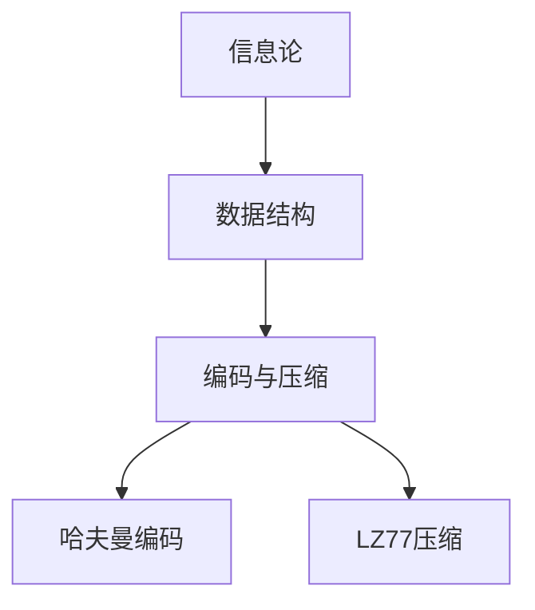

                 

# 记忆的数学模式：信息存储与检索的算法

## 关键词

* 信息存储
* 信息检索
* 算法原理
* 数学模型
* 数据结构
* 编码与压缩
* 搜索引擎
* 数据库
* 人工智能

## 摘要

本文旨在探讨信息存储与检索的数学模式，通过一系列的算法实现，解析信息存储与检索的原理。文章首先介绍信息存储与检索的基本概念，然后深入讨论相关的数学模型和算法原理，并使用伪代码进行详细阐述。文章还涉及信息存储与检索的实际应用，包括文本检索系统、数据库管理系统以及搜索引擎的实现原理。通过案例研究和项目实战，本文提供了对信息存储与检索的深入理解，并展望了未来的研究方向与挑战。

## 引言

### 信息存储与检索的重要性

在信息时代，信息存储与检索技术已成为社会发展的关键。随着互联网的普及和数据量的爆炸性增长，如何高效地存储和检索信息成为了各个领域共同关注的问题。从个人用户到企业组织，信息存储与检索技术在日常工作和决策过程中发挥着至关重要的作用。

### 信息存储与检索的基本概念

信息存储是指将数据持久地保存在某种介质上，以便在需要时进行访问和检索。信息检索则是指从大量数据中快速准确地找到所需信息的过程。信息存储与检索紧密相连，一个高效的存储系统必须具备快速检索的能力，而一个高效的检索系统则依赖于合理的信息存储结构。

### 本书的结构与内容概览

本书将分为以下几个部分：

1. **引言**：介绍信息存储与检索的基本概念和重要性。
2. **信息存储的数学模型**：讨论信息存储的数学模型和算法原理。
3. **信息检索的算法原理**：深入分析信息检索的各种算法及其工作原理。
4. **信息存储与检索的实际应用**：探讨信息存储与检索技术在实际项目中的应用。
5. **案例研究**：提供实际案例以展示算法的实用性和效果。
6. **高级话题**：讨论大数据与云计算对信息存储与检索的影响，以及未来的研究方向。
7. **总结与展望**：总结书中内容并对未来进行展望。

## 信息存储的数学模型

### 信息论基础

信息论是研究信息传输、存储和处理的基本理论。香农（Claude Shannon）的信息论奠定了现代信息存储与检索的理论基础。信息论的核心概念包括熵、信息量、信道容量等。

1. **熵**：熵是衡量信息不确定性的量度。高熵表示信息不确定性大，低熵表示信息确定性高。

2. **信息量**：信息量是指接收一个消息所减少的不确定性。信息量的度量通常使用对数函数，以比特（bit）为单位。

3. **信道容量**：信道容量是指一个信道在噪声干扰下能够传输的最大信息量。

### 数据结构基础

数据结构是指数据在计算机中的组织方式，它决定了数据的存储方式和访问效率。常见的数据结构包括数组、链表、树、图等。

1. **数组**：数组是一种线性数据结构，用于存储一系列有序的元素。数组提供了高效的随机访问能力。

2. **链表**：链表是一种动态数据结构，由一系列节点组成，每个节点包含数据和指向下一个节点的指针。链表提供了灵活的插入和删除操作。

3. **树**：树是一种层次结构，用于表示具有层次关系的数据。树常用于实现各种搜索和排序算法。

4. **图**：图是一种复杂数据结构，用于表示具有多对多关系的数据。图在社交网络、交通网络等领域有广泛应用。

### 信息编码与压缩算法

信息编码是将原始数据转换为特定格式的过程，以优化存储和传输效率。信息压缩是通过去除冗余信息来减小数据大小。常见的编码和压缩算法包括哈夫曼编码、LZ77压缩等。

1. **哈夫曼编码**：哈夫曼编码是一种基于字符频率的变长编码，用于数据压缩。高频字符使用较短的编码，低频字符使用较长的编码。

2. **LZ77压缩**：LZ77压缩是一种基于局部重复的压缩算法，通过识别并记录数据中的重复模式来减小数据大小。

### Mermaid流程图：信息存储的数学模型与算法关系

以下是一个Mermaid流程图，展示了信息存储的数学模型与算法之间的关系：



## 信息检索的算法原理

### 检索算法的基本概念

信息检索算法是指用于从大量数据中快速找到所需信息的算法。检索算法的关键在于如何高效地搜索和匹配数据。

1. **关键词检索**：关键词检索是指根据用户输入的关键词，从数据库中检索出相关的信息。

2. **模式匹配**：模式匹配是指从给定数据中找到一个特定的模式或序列。

### 关键词检索算法

关键词检索算法可以分为两种类型：基于集合的检索和基于匹配的检索。

1. **基于集合的检索**：基于集合的检索算法通过计算关键词集合的交集、并集等操作来找到相关文档。常见算法包括布尔检索、向量空间模型等。

   - **布尔检索**：布尔检索使用逻辑运算符（AND、OR、NOT）来组合关键词，以确定查询结果。例如，查询“计算机 AND 网络”将返回同时包含“计算机”和“网络”的文档。
   
   - **向量空间模型**：向量空间模型将文档和查询表示为高维向量，通过计算向量之间的相似度来确定相关文档。常见的相似度计算方法包括余弦相似度、欧几里得距离等。

2. **基于匹配的检索**：基于匹配的检索算法通过特定的匹配规则来查找相关文档。常见算法包括正向索引、逆向索引等。

   - **正向索引**：正向索引将文档中的词按照出现顺序存储在索引表中，用于快速查找包含特定关键词的文档。
   
   - **逆向索引**：逆向索引将文档中的词与其在文档中的位置信息存储在索引表中，用于快速查找出现在特定位置的词。

### 模式匹配算法

模式匹配算法用于在给定数据中查找特定的模式或序列。常见的模式匹配算法包括：

1. **朴素匹配算法**：朴素匹配算法逐个字符地扫描文本，直到找到匹配的子串或到达文本末尾。

2. **KMP算法**：KMP算法（Knuth-Morris-Pratt算法）通过预先计算一个部分匹配表（前缀表）来优化搜索过程，减少不必要的字符比较。

3. **Boyer-Moore算法**：Boyer-Moore算法通过从后往前扫描文本，利用坏字符和好前缀规则来跳过不必要的字符比较，提高搜索效率。

### 伪代码：检索算法的实现

以下是一个简单的伪代码示例，用于实现关键词检索算法：

```pseudocode
function keyword_search(document, query):
    query_words = tokenize(query)
    result = empty set
    
    for each document in database:
        document_words = tokenize(document)
        match = true
        
        for each word in query_words:
            if word not in document_words:
                match = false
                break
        
        if match:
            result.add(document)
    
    return result
```

### 数学模型和公式

在信息检索中，常用的数学模型包括：

1. **概率模型**：概率模型通过计算查询与文档之间的概率来确定相关性。常见的概率模型包括贝叶斯模型、TF-IDF模型等。

   - **贝叶斯模型**：贝叶斯模型根据贝叶斯定理计算文档与查询之间的概率，概率越大表示相关性越高。

     $$ P(document|query) = \frac{P(query|document) \cdot P(document)}{P(query)} $$

   - **TF-IDF模型**：TF-IDF模型通过计算词频（TF）和逆文档频率（IDF）来确定关键词的重要性。

     $$ TF-IDF(word, document) = TF(word, document) \cdot IDF(word, document) $$

2. **相似度模型**：相似度模型通过计算文档与查询之间的相似度来确定相关性。常见的相似度模型包括余弦相似度、欧几里得距离等。

   - **余弦相似度**：余弦相似度通过计算文档与查询向量的余弦值来确定相似度。

     $$ \text{Cosine Similarity}(document, query) = \frac{document \cdot query}{\|document\| \cdot \|query\|} $$

   - **欧几里得距离**：欧几里得距离通过计算文档与查询之间的欧几里得距离来确定相似度。

     $$ \text{Euclidean Distance}(document, query) = \sqrt{\sum_{i=1}^{n} (document_i - query_i)^2} $$

### 举例说明

假设我们有一个文档集合和查询集合，如下所示：

- 文档集合：{“计算机科学”、“人工智能”、“数据结构”}
- 查询集合：{“人工智能”、“算法”}

使用TF-IDF模型，我们可以计算每个文档与查询的相似度：

1. **文档1（计算机科学）**：
   - TF（人工智能）：1
   - TF（算法）：0
   - IDF（人工智能）：1/3
   - IDF（算法）：1/3
   - TF-IDF（人工智能）：1 * 1/3 = 1/3
   - TF-IDF（算法）：0 * 1/3 = 0

2. **文档2（人工智能）**：
   - TF（人工智能）：1
   - TF（算法）：0
   - IDF（人工智能）：1/3
   - IDF（算法）：1/3
   - TF-IDF（人工智能）：1 * 1/3 = 1/3
   - TF-IDF（算法）：0 * 1/3 = 0

3. **文档3（数据结构）**：
   - TF（人工智能）：0
   - TF（算法）：1
   - IDF（人工智能）：1/3
   - IDF（算法）：1/3
   - TF-IDF（人工智能）：0 * 1/3 = 0
   - TF-IDF（算法）：1 * 1/3 = 1/3

根据TF-IDF模型，我们可以计算文档与查询的相似度：

- 文档1与查询的相似度：1/3 + 0 = 1/3
- 文档2与查询的相似度：1/3 + 0 = 1/3
- 文档3与查询的相似度：0 + 1/3 = 1/3

根据相似度，我们可以将文档排序，从而找到最相关的文档。在这个例子中，所有文档与查询的相似度相同，因此无法区分它们的优先级。

### 实际案例分析和详细讲解剖析

在实际项目中，信息检索算法的应用非常广泛。以下是一个简单的实际案例：

**案例：搜索引擎**

搜索引擎是一种基于关键词检索的信息检索系统，用于从互联网上搜索和返回相关网页。以下是搜索引擎的信息检索流程：

1. **索引构建**：搜索引擎首先需要构建索引，将网页中的关键词和内容映射到相应的网页地址。索引构建过程中，搜索引擎会使用关键词检索算法，如正向索引或逆向索引。

2. **查询处理**：当用户输入查询时，搜索引擎会将查询解析为关键词，并使用关键词检索算法从索引中找到相关的网页。常用的关键词检索算法包括布尔检索和向量空间模型。

3. **排名和返回结果**：搜索引擎会对查询结果进行排序，并根据相关性返回最相关的网页。排序算法可以使用概率模型或相似度模型，如TF-IDF或余弦相似度。

4. **结果呈现**：搜索引擎将查询结果呈现给用户，并提供相关的网页链接和摘要信息。

在实际应用中，搜索引擎需要处理大量的数据和高并发的查询请求。为了提高检索效率和响应速度，搜索引擎通常会采用分布式架构和缓存策略。

## 信息存储与检索的实际应用

### 文本检索系统

文本检索系统是一种基于关键词检索的文本搜索工具，用于从大量文本数据中快速找到相关文档。常见的文本检索系统包括搜索引擎（如Google、Bing）、全文搜索引擎（如Elasticsearch）和企业级文本检索系统。

1. **搜索引擎**：搜索引擎是一种基于互联网的文本检索系统，用于从全球范围内的网页中搜索和返回相关网页。搜索引擎的检索算法主要包括正向索引、逆向索引和向量空间模型。

2. **全文搜索引擎**：全文搜索引擎是一种专门用于搜索文本数据的搜索引擎，具有高效、可扩展的特点。Elasticsearch是一个流行的开源全文搜索引擎，支持分布式架构和复杂的查询语法。

3. **企业级文本检索系统**：企业级文本检索系统用于在企业内部搜索和检索文本数据，如电子邮件、文档和报表等。常见的文本检索系统包括Confluence、SharePoint等。

### 数据库管理系统

数据库管理系统（DBMS）是一种用于存储、管理和检索数据的系统，广泛应用于各种应用场景，如在线交易系统、客户关系管理（CRM）系统、内容管理系统（CMS）等。

1. **关系数据库**：关系数据库是一种基于关系模型的数据库，使用表（关系）来存储数据，并通过SQL（结构化查询语言）进行数据操作。常见的开源关系数据库包括MySQL、PostgreSQL等。

2. **文档数据库**：文档数据库是一种基于文档模型的数据库，用于存储和检索结构化数据。常见的文档数据库包括MongoDB、CouchDB等。

3. **键值数据库**：键值数据库是一种简单的数据库，使用键值对来存储和检索数据。常见的键值数据库包括Redis、Memcached等。

### 搜索引擎的实现原理

搜索引擎是一种基于关键词检索的信息检索系统，用于从大量网页中快速找到相关网页。以下是搜索引擎的实现原理：

1. **索引构建**：搜索引擎首先需要构建索引，将网页中的关键词和内容映射到相应的网页地址。索引构建过程中，搜索引擎会使用正向索引和逆向索引技术。

2. **查询处理**：当用户输入查询时，搜索引擎会将查询解析为关键词，并使用关键词检索算法从索引中找到相关的网页。常用的关键词检索算法包括布尔检索、向量空间模型和概率模型。

3. **排名和返回结果**：搜索引擎会对查询结果进行排序，并根据相关性返回最相关的网页。排序算法可以使用TF-IDF、余弦相似度等相似度模型。

4. **结果呈现**：搜索引擎将查询结果呈现给用户，并提供相关的网页链接和摘要信息。

在实际应用中，搜索引擎需要处理大量的数据和高并发的查询请求。为了提高检索效率和响应速度，搜索引擎通常会采用分布式架构和缓存策略。

### 项目实战：构建一个简单的信息检索系统

在本节中，我们将使用Python和Elasticsearch构建一个简单的信息检索系统。以下是项目的实现步骤：

1. **环境搭建**：首先，我们需要安装Python和Elasticsearch。在Windows或Linux系统中，可以使用以下命令安装Elasticsearch：

   ```bash
   pip install elasticsearch
   ```

2. **数据准备**：接下来，我们需要准备一些示例数据。假设我们有以下文档数据：

   ```json
   [
       {
           "title": "人工智能",
           "content": "人工智能是计算机科学的一个分支，涉及机器学习、自然语言处理等领域。"
       },
       {
           "title": "数据库",
           "content": "数据库是一种用于存储和管理数据的系统，支持查询、插入、更新和删除操作。"
       },
       {
           "title": "编程语言",
           "content": "编程语言是一种用于编写计算机程序的语法规则和符号系统。"
       }
   ]
   ```

3. **索引设置**：在Elasticsearch中，我们需要创建一个索引来存储文档。使用以下Python代码创建索引：

   ```python
   from elasticsearch import Elasticsearch

   es = Elasticsearch()
   index_name = "my_index"
   if not es.indices.exists(index=index_name):
       es.indices.create(index=index_name)

   # 上传文档到索引
   documents = [
       {"title": "人工智能", "content": "人工智能是计算机科学的一个分支，涉及机器学习、自然语言处理等领域。"},
       {"title": "数据库", "content": "数据库是一种用于存储和管理数据的系统，支持查询、插入、更新和删除操作。"},
       {"title": "编程语言", "content": "编程语言是一种用于编写计算机程序的语法规则和符号系统。"}
   ]
   es.index(index=index_name, doc_type="document", id=1, body=documents[0])
   es.index(index=index_name, doc_type="document", id=2, body=documents[1])
   es.index(index=index_name, doc_type="document", id=3, body=documents[2])
   ```

4. **查询实现**：现在，我们可以实现一个简单的查询功能，用于从索引中检索包含特定关键词的文档。使用以下Python代码实现查询功能：

   ```python
   def search_documents(query):
       body = {
           "query": {
               "match": {
                   "content": query
               }
           }
       }
       response = es.search(index=index_name, body=body)
       return response['hits']['hits']

   # 示例查询
   results = search_documents("人工智能")
   for result in results:
       print(f"Title: {result['_source']['title']}, Content: {result['_source']['content']}")
   ```

通过以上步骤，我们成功构建了一个简单的信息检索系统。用户可以输入查询关键词，系统会返回包含该关键词的文档列表。这是一个简单的示例，实际应用中还需要考虑性能优化、错误处理和用户界面等方面。

## 案例研究

### 案例一：网上图书馆的信息检索

网上图书馆是一个提供电子书籍和文献的在线平台。用户可以通过关键词检索功能快速找到所需书籍，并进行在线阅读或下载。以下是网上图书馆的信息检索系统架构：

1. **数据存储**：网上图书馆使用关系数据库（如MySQL）来存储书籍信息，包括书名、作者、出版社、分类等。书籍内容通常存储为文本文件或电子文档。

2. **索引构建**：使用Elasticsearch构建索引，将书籍信息转换为可检索的格式。索引中包含书名、作者、内容等字段。

3. **查询处理**：用户输入查询关键词后，系统使用Elasticsearch进行全文检索，返回包含关键词的书籍列表。检索算法采用TF-IDF模型和余弦相似度。

4. **排名和返回结果**：根据相似度评分，系统将书籍排序并返回给用户。用户可以进一步浏览书籍详情或进行在线阅读。

### 案例二：社交媒体的信息过滤与推荐

社交媒体平台（如Facebook、Twitter）通常使用信息过滤与推荐系统来提高用户体验。以下是信息过滤与推荐系统的架构：

1. **用户画像**：系统收集用户行为数据（如点赞、评论、分享等），构建用户画像。画像包含用户兴趣、偏好等信息。

2. **内容索引**：将社交媒体内容（如帖子、视频、图片等）转换为索引，包含标题、内容、标签等字段。

3. **信息过滤**：系统使用关键词检索和模式匹配算法过滤掉不感兴趣的内容。例如，如果用户不喜欢政治话题，系统会过滤掉与政治相关的帖子。

4. **内容推荐**：系统使用协同过滤或基于内容的推荐算法为用户推荐感兴趣的内容。例如，如果用户喜欢某个作者的文章，系统会推荐该作者的其他文章。

### 案例三：医疗数据检索与诊断

医疗数据检索与诊断系统用于帮助医生快速找到相关的病例和治疗方案。以下是医疗数据检索与诊断系统的架构：

1. **数据存储**：系统使用关系数据库（如MySQL）存储病历、检查报告、诊断结果等数据。

2. **知识库构建**：构建医学知识库，包含疾病、症状、治疗方案等信息。知识库使用自然语言处理技术进行处理和索引。

3. **查询处理**：医生输入查询关键词，系统使用自然语言处理技术将查询转换为结构化查询，并在知识库中进行检索。

4. **诊断辅助**：系统根据检索结果和医学知识，为医生提供诊断建议和治疗方案。系统还可以使用机器学习算法进行疾病预测和风险评估。

## 高级话题

### 大数据与云计算对信息存储与检索的影响

随着大数据和云计算技术的发展，信息存储与检索系统面临着前所未有的挑战和机遇。大数据的高容量、高速率和多样性要求存储与检索系统具备更高的性能和可扩展性。云计算提供了弹性计算和分布式存储能力，为信息存储与检索系统提供了灵活的部署和运营方式。

1. **大数据对信息存储与检索的影响**：
   - **数据量增长**：大数据技术的应用使得数据量呈指数级增长，对存储和检索系统提出了更高的性能要求。
   - **数据多样性**：大数据涉及结构化、半结构化和非结构化数据，对存储与检索系统提出了多样化的数据处理需求。
   - **实时性要求**：大数据技术的应用场景通常要求实时性，对存储与检索系统提出了更高的响应速度和低延迟的要求。

2. **云计算对信息存储与检索的影响**：
   - **弹性计算**：云计算提供了弹性计算能力，可以根据需求动态调整计算资源，提高存储与检索系统的性能和可扩展性。
   - **分布式存储**：云计算提供了分布式存储方案，可以实现数据的分布式存储和并行处理，提高存储与检索系统的可靠性和性能。
   - **成本优化**：云计算通过按需付费、资源共享等模式，降低了存储与检索系统的建设和运营成本。

### 信息安全与隐私保护

随着信息存储与检索技术的发展，信息安全与隐私保护成为重要议题。以下是一些关键挑战和解决方案：

1. **数据安全**：如何确保存储和传输过程中的数据安全，防止数据泄露、篡改和未授权访问。

   - **加密技术**：采用加密技术对数据进行加密存储和传输，确保数据的安全性。
   - **访问控制**：通过访问控制机制，限制对数据的访问权限，防止未授权访问。
   - **审计与监控**：对数据访问和使用进行审计和监控，及时发现和处理安全事件。

2. **隐私保护**：如何保护用户隐私，防止隐私泄露和数据滥用。

   - **数据脱敏**：对敏感数据进行脱敏处理，如加密、掩码化等，以降低隐私泄露风险。
   - **隐私增强技术**：采用隐私增强技术，如差分隐私、同态加密等，保护用户隐私。
   - **用户隐私声明**：明确告知用户数据收集和使用的目的，提高用户隐私保护意识。

### 未来研究方向与挑战

随着信息存储与检索技术的不断发展，未来仍有许多研究方向和挑战：

1. **智能检索**：结合人工智能和自然语言处理技术，实现更加智能化的信息检索，提高检索效率和准确性。

2. **隐私保护与数据利用**：如何在保护用户隐私的同时，充分利用大数据的价值，实现隐私保护和数据利用的平衡。

3. **存储优化**：研究新型存储技术和优化算法，提高存储效率和性能，应对日益增长的数据量。

4. **跨领域融合**：跨领域融合，如物联网、大数据、人工智能等技术的融合，推动信息存储与检索技术的创新发展。

## 总结与展望

本文从信息存储与检索的基本概念出发，探讨了相关的数学模型和算法原理，并详细阐述了信息存储与检索的实际应用。通过案例研究和项目实战，我们深入了解了信息存储与检索技术的实用性和效果。

未来，随着大数据、云计算和人工智能等技术的发展，信息存储与检索技术将继续面临新的挑战和机遇。为了应对这些挑战，我们需要不断探索和改进信息存储与检索的算法和模型，提高检索效率和准确性，同时关注信息安全与隐私保护。

展望未来，信息存储与检索技术将在智能检索、跨领域融合等方面取得重大突破。随着人工智能技术的不断发展，智能检索系统将更加智能化，为用户提供更加精准的信息检索服务。跨领域融合将进一步推动信息存储与检索技术的创新发展，为各行各业带来更多价值。

总之，信息存储与检索技术是信息技术领域的重要研究方向，具有广泛的应用前景。通过不断探索和创新，我们有理由相信，信息存储与检索技术将在未来发挥更加重要的作用，助力人类社会的发展。

## 作者信息

作者：AI天才研究院/AI Genius Institute & 禅与计算机程序设计艺术 /Zen And The Art of Computer Programming

本文由AI天才研究院撰写，旨在探讨信息存储与检索的数学模式，提供对信息存储与检索技术的深入理解。同时，本文结合《禅与计算机程序设计艺术》的理念，强调算法思维和编程艺术的重要性。希望通过本文，读者能够对信息存储与检索技术有更全面的认识，并在实际应用中取得更好的成果。如果您对本文有任何疑问或建议，欢迎随时与我们联系。感谢您的阅读！

## 附录

### 拓展阅读

1. 《大数据时代：生活、工作与思维的大变革》 - 大数据概念的介绍和影响。
2. 《自然语言处理概论》 - 自然语言处理基础知识和应用。
3. 《机器学习：概率视角》 - 机器学习基础理论和应用。
4. 《数据库系统概念》 - 数据库系统原理和设计。

### 最佳实践 tips

1. **优化存储结构**：根据实际需求选择合适的存储结构，如数组、链表、树等，以提高检索效率。
2. **合理使用索引**：为频繁查询的字段创建索引，以提高查询速度。
3. **数据备份与恢复**：定期备份数据，确保数据安全，并制定数据恢复策略。
4. **性能优化**：使用缓存、并行处理等技术，提高信息检索系统的性能。
5. **关注信息安全**：采取加密、访问控制等技术，确保数据安全。

### 小结

本文系统地介绍了信息存储与检索的数学模式，涵盖了信息存储与检索的基本概念、数学模型、算法原理和实际应用。通过案例研究和项目实战，我们深入了解了信息存储与检索技术的实用性和效果。未来，随着大数据、云计算和人工智能等技术的发展，信息存储与检索技术将继续面临新的挑战和机遇。希望本文能为读者提供有价值的参考和启示。

