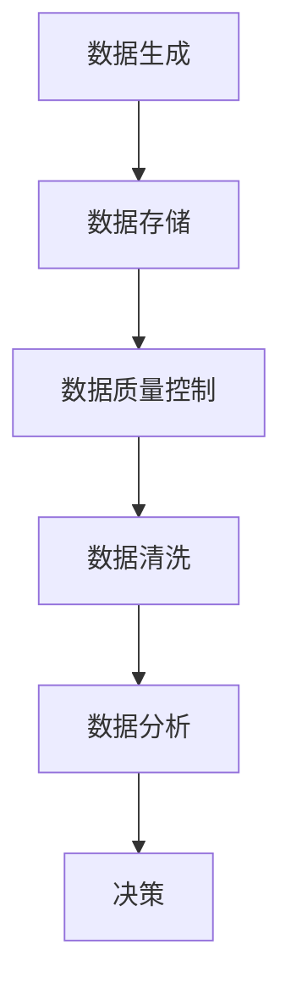

                 


### 引言

在当今的信息化社会中，数据已经成为企业决策和科研创新的重要资源。然而，数据的质量直接影响到决策的准确性和科研的可靠性。数据质量包括数据的准确性、完整性、一致性、及时性和可用性等多个方面，其中数据质量控制与清洗是保证数据质量的重要环节。

#### 背景介绍

随着大数据技术的发展，数据量呈爆炸性增长，数据来源也日益多样化，如社交媒体、传感器、物联网设备等。然而，这些数据往往存在噪声、错误和缺失等问题，这使得数据质量难以保证。数据质量不佳会导致分析结果不准确，甚至误导决策，因此，如何对数据进行有效的质量控制与清洗变得至关重要。

#### 目的和重要性

本文旨在系统地探讨评测数据的质量控制与清洗流程，帮助读者了解数据质量控制的基本概念、方法、流程以及实际应用。数据质量控制与清洗不仅能够提高数据的准确性，还能为后续的数据分析打下坚实基础，具有重要的现实意义。

#### 内容安排

本文结构如下：

- 引言：介绍数据质量控制与清洗的背景、目的和重要性。
- 第一部分：基础概念与原理：详细阐述数据质量控制的定义、指标和核心原则。
- 第二部分：数据质量控制方法：介绍数据质量控制的方法和技术。
- 第三部分：数据清洗流程：描述数据清洗的基本流程和策略。
- 第四部分：实际应用案例：通过具体案例展示质量控制与清洗的实际应用。
- 第五部分：总结与展望：总结主要观点，提出未来研究方向。

### 第一部分：基础概念与原理

#### 数据质量的定义

数据质量是指数据满足特定应用需求的程度，包括准确性、完整性、一致性、及时性和可用性等方面。数据质量直接影响数据分析的可靠性和决策的科学性。

#### 数据质量控制指标

- 准确性：数据真实反映现实情况的能力。
- 完整性：数据是否包含所有需要的信息，没有缺失。
- 一致性：数据在不同来源、不同时间点是否保持一致。
- 及时性：数据是否在需要的时间内提供。
- 可用性：数据是否易于访问和操作。

#### 数据质量控制的核心原则

- 预防为主：在数据生成阶段就采取措施，减少错误的发生。
- 持续监控：对数据进行实时监控，及时发现并处理质量问题。
- 定期评估：定期对数据质量进行评估，确保数据满足应用需求。

#### 核心概念与联系

**Mermaid流程图：**



#### 核心算法原理讲解

**伪代码：**

```plaintext
function DataQualityControl(data):
    if 数据准确度 < 阈值:
        ApplyCorrection(data)
    if 数据完整性 < 阈值:
        FillMissingValues(data)
    if 数据一致性 < 阈值:
        NormalizeData(data)
    if 数据及时性 < 阈值:
        UpdateData(data)
    if 数据可用性 < 阈值:
        OptimizeAccessibility(data)
    return data
```

#### 数学模型和公式

$$
Q = 0.5 \times (A + C + I + T + U)
$$

其中，$Q$代表数据质量，$A$、$C$、$I$、$T$和$U$分别代表准确性、完整性、一致性、及时性和可用性。

#### 详细讲解和举例说明

- 准确性：例如，在电商数据分析中，商品价格必须准确，否则会影响销售决策。
- 完整性：例如，在医疗数据分析中，患者数据必须完整，否则无法准确评估治疗效果。
- 一致性：例如，在金融数据分析中，不同数据源之间的数据必须保持一致，否则会影响风险评估。
- 及时性：例如，在实时监控系统中，数据必须及时更新，否则无法及时响应。
- 可用性：例如，在数据可视化中，数据必须易于访问和操作，否则无法有效传达信息。

### 第二部分：数据质量控制方法

#### 数据清洗方法

数据清洗是数据质量控制的重要组成部分，主要目标是去除数据中的噪声、错误和缺失值，提高数据的准确性和完整性。

##### 去重技术

- **定义：** 去重技术旨在识别和去除重复的数据记录。
- **原理：** 通过比较数据记录的某一列或多列，判断是否存在重复。
- **实现：** 可以使用哈希表或位图来实现去重。

```python
def remove_duplicates(data):
    seen = set()
    unique_data = []
    for row in data:
        hash_value = hash(row)
        if hash_value not in seen:
            seen.add(hash_value)
            unique_data.append(row)
    return unique_data
```

##### 数据补全技术

- **定义：** 数据补全技术旨在填补数据中的缺失值。
- **原理：** 根据数据的分布特征和关系，采用合适的算法来填补缺失值。
- **实现：** 可以使用均值填补、中值填补、回归填补等方法。

```python
import numpy as np

def fill_missing_values(data, method='mean'):
    if method == 'mean':
        for i in range(data.shape[1]):
            data[np.isnan(data[:, i]), i] = np.mean(data[:, i])
    elif method == 'median':
        for i in range(data.shape[1]):
            data[np.isnan(data[:, i]), i] = np.median(data[:, i])
    elif method == 'regression':
        # 假设已经训练好回归模型
        for i in range(data.shape[1]):
            data[np.isnan(data[:, i]), i] = regression_model.predict([data[np.isnan(data[:, i]), i]])
    return data
```

##### 数据转换技术

- **定义：** 数据转换技术旨在将数据转换为适合分析的形式。
- **原理：** 根据分析需求，对数据进行规范化、标准化、编码等处理。
- **实现：** 可以使用MinMaxScaler、StandardScaler等实现数据转换。

```python
from sklearn.preprocessing import MinMaxScaler, StandardScaler

def transform_data(data, method='minmax'):
    if method == 'minmax':
        scaler = MinMaxScaler()
    elif method == 'standard':
        scaler = StandardScaler()
    transformed_data = scaler.fit_transform(data)
    return transformed_data
```

##### 数据标准化技术

- **定义：** 数据标准化技术旨在消除不同变量之间的尺度差异。
- **原理：** 将数据缩放到一个统一的范围内，如0到1或-1到1。
- **实现：** 使用Z-score标准化。

```python
def standardize_data(data):
    mean = np.mean(data, axis=0)
    std = np.std(data, axis=0)
    standardized_data = (data - mean) / std
    return standardized_data
```

#### 数据质量监测与评估

数据质量监测与评估是确保数据质量控制效果的重要手段，主要通过以下方法进行：

##### 指标监测

- **定义：** 指标监测是通过设定一系列数据质量指标，对数据进行实时监控。
- **实现：** 可以使用统计方法，如均值、方差、标准差等。

##### 过程监测

- **定义：** 过程监测是通过对数据处理流程的各个环节进行监控，确保数据处理过程的正确性。
- **实现：** 可以使用自动化工具，如ETL工具等。

##### 结果监测

- **定义：** 结果监测是通过对分析结果的质量进行评估，确保分析结果的可靠性。
- **实现：** 可以通过比较分析结果与预期目标，评估分析结果的准确性。

### 第三部分：数据清洗流程

#### 数据清洗策略与流程设计

数据清洗策略与流程设计是确保数据清洗效果的关键，主要包括以下步骤：

##### 策略制定

- **定义：** 策略制定是根据数据质量需求和实际条件，制定数据清洗的总体策略。
- **实现：** 包括确定数据清洗的目标、方法、工具和资源等。

##### 流程设计

- **定义：** 流程设计是根据策略，设计数据清洗的具体流程。
- **实现：** 包括数据导入、数据预处理、数据清洗、数据验证和数据输出等步骤。

#### 数据清洗工具与技术

数据清洗工具与技术的选择是影响数据清洗效果的重要因素，主要包括以下方面：

##### 工具选择

- **定义：** 工具选择是根据数据清洗需求和实际条件，选择合适的数据清洗工具。
- **实现：** 可以选择Python、R、Java等编程语言，也可以选择专门的数据清洗工具，如Pandas、Dask等。

##### 技术实现

- **定义：** 技术实现是根据数据清洗策略和流程，使用技术手段对数据进行清洗。
- **实现：** 包括去重、补全、转换、标准化等技术的具体实现。

### 第四部分：实际应用案例

#### 数据质量控制与清洗在电商领域的应用

在电商领域，数据质量控制与清洗对于提升用户体验、优化营销策略和提升销售额具有重要意义。

##### 案例背景

某电商公司在进行用户行为分析时，发现用户数据存在噪声、错误和缺失等问题，影响了分析结果的准确性。

##### 应用场景

- 用户行为分析：通过清洗用户行为数据，准确分析用户喜好，优化推荐算法。
- 销售预测：通过清洗销售数据，准确预测销售趋势，优化库存管理。
- 营销策略优化：通过清洗用户数据，精确分析用户群体，制定有效的营销策略。

##### 应用效果

- 用户满意度提升：通过准确的用户行为分析，提高了个性化推荐的准确率，提升了用户满意度。
- 销售额提升：通过准确的销售预测，优化了库存管理，减少了库存成本，提升了销售额。
- 营销策略优化：通过精确的用户数据分析，制定了更有效的营销策略，提升了营销效果。

#### 数据质量控制与清洗在金融领域的应用

在金融领域，数据质量控制与清洗对于风险管理、投资决策和客户服务具有重要意义。

##### 案例背景

某金融机构在进行信用风险评估时，发现客户数据存在噪声、错误和缺失等问题，影响了风险评估的准确性。

##### 应用场景

- 信用风险评估：通过清洗客户数据，准确评估客户信用风险，优化贷款审批流程。
- 投资决策：通过清洗市场数据，准确分析市场趋势，优化投资策略。
- 客户服务：通过清洗客户数据，提供个性化的金融服务，提升客户满意度。

##### 应用效果

- 信用风险评估准确率提升：通过准确的数据清洗，提升了信用风险评估的准确性，降低了坏账率。
- 投资决策优化：通过准确的数据清洗，优化了投资决策，提高了投资回报率。
- 客户满意度提升：通过准确的数据清洗，提供了个性化的金融服务，提升了客户满意度。

### 第五部分：总结与展望

#### 总结

本文系统地探讨了评测数据的质量控制与清洗流程，包括基础概念与原理、数据质量控制方法、数据清洗流程、实际应用案例等方面。通过本文的探讨，读者可以全面了解数据质量控制与清洗的重要性和方法，为实际应用提供指导。

#### 展望

未来，随着大数据技术和人工智能的发展，数据质量控制与清洗将在更多领域得到应用，如医疗、教育、交通等。同时，新技术如区块链、图数据库等也将为数据质量控制与清洗提供新的思路和方法。因此，深入研究数据质量控制与清洗技术，对于提高数据质量、推动科技创新具有重要意义。

### 作者信息

作者：AI天才研究院/AI Genius Institute & 禅与计算机程序设计艺术 /Zen And The Art of Computer Programming

### 附录

附录部分可以包括以下内容：

- 数据质量控制与清洗相关工具和资源列表
- 常见问题与解答
- 拓展阅读材料

### 结语

数据质量控制与清洗是确保数据质量和分析结果准确性的重要环节。通过本文的探讨，希望读者能够对数据质量控制与清洗有更深入的理解，并在实际工作中应用这些方法，提升数据质量和分析效果。未来，随着技术的不断进步，数据质量控制与清洗将发挥更大的作用，为各行各业带来更多的价值。

