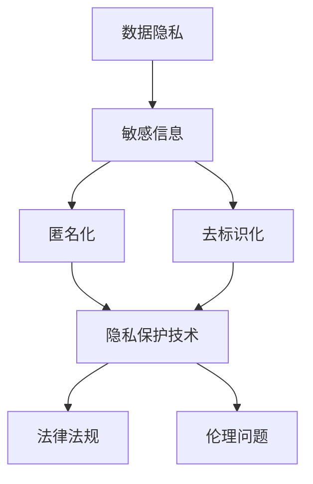

                 


## 《评测数据的隐私保护：确保敏感信息安全》

### 关键词

- 数据隐私保护
- 敏感信息
- 匿名化
- 去标识化
- 法律法规
- 伦理问题

### 摘要

随着数据技术的飞速发展，评测数据的隐私保护已成为信息安全领域的重要课题。本文围绕评测数据的隐私保护展开，深入探讨了敏感信息识别与分类、隐私保护技术原理与应用、法律法规与伦理问题等多个方面。通过项目实践和案例分析，本文为读者提供了实用的隐私保护策略和方法，为未来隐私保护技术的发展指明了方向。

### 目录

1. **背景介绍**
   - 数据隐私保护的背景
   - 敏感信息泄露的案例与影响

2. **核心概念与联系**
   - 数据隐私保护的核心概念
   - 敏感信息识别与分类
   - 隐私保护技术的原理与应用
   - 法律法规与伦理问题
   - **Mermaid 流程图：数据隐私保护的核心概念架构**

3. **核心算法原理讲解**
   - 数据匿名化技术原理
   - 数据去标识化技术原理
   - **伪代码：数据匿名化与去标识化的具体实现**

4. **数学模型和公式**
   - 数据隐私保护中的数学模型
   - **LaTeX 公式：匿名化与去标识化的数学计算**

5. **项目实战**
   - 开发环境搭建
   - 源代码详细实现与代码解读
   - 代码应用解读与分析
   - 实际案例分析与详细讲解
   - **项目小结：评测数据隐私保护的实战经验**

6. **最佳实践 tips**
   - 隐私保护策略
   - 数据安全最佳实践

7. **小结与注意事项**
   - 数据隐私保护的总结
   - 遵守法律法规和伦理问题的重要性

8. **拓展阅读**
   - 相关文献与参考资料

### 正文内容

#### 1. 背景介绍

数据隐私保护在当今社会的重要性不言而喻。随着互联网和大数据技术的迅猛发展，海量数据的收集、存储、处理和共享已成为常态。然而，这些数据中也包含了许多敏感信息，如个人身份信息、财务信息、健康状况等。如果这些敏感信息泄露，不仅会导致个人隐私受到侵害，还可能引发严重的社会问题和经济损失。

近年来，许多知名企业因数据泄露事件而受到广泛关注，如Facebook的Cambridge Analytica事件、Equifax的数据泄露事件等。这些事件不仅损害了企业的声誉，也揭示了数据隐私保护面临的严峻挑战。

#### 2. 核心概念与联系

数据隐私保护的核心概念包括：

- **数据隐私**：指个人或组织的数据在未经授权的情况下不被访问、泄露或滥用。
- **敏感信息**：指可能对个人或组织造成损害的数据，如个人身份信息、财务信息、商业机密等。
- **匿名化**：指通过技术手段对数据进行处理，使其无法直接识别特定个人或组织。
- **去标识化**：指通过技术手段消除数据中的直接标识信息，如姓名、身份证号等。
- **法律法规**：指国家或地区关于数据隐私保护的法律法规和政策。
- **伦理问题**：指在数据隐私保护过程中涉及到的道德和伦理问题。

**Mermaid 流程图：数据隐私保护的核心概念架构**



#### 3. 核心算法原理讲解

**数据匿名化技术原理**

数据匿名化技术主要分为两大类：同质化匿名化和异质化匿名化。

- **同质化匿名化**：通过对数据进行一致性处理，使其在多个数据集中保持一致性。常见的方法有：属性泛化、属性掩盖、随机化等。

- **异质化匿名化**：通过对不同数据源的数据进行整合和匿名化处理。常见的方法有：数据融合、数据变换、隐私保护数据挖掘等。

**伪代码：数据匿名化的具体实现**

```python
# 假设原始数据集为 DataFrame，包含姓名、年龄、收入等属性
# 匿名化处理
DataFrame = Anonymize(DataFrame)
```

**数据去标识化技术原理**

数据去标识化技术主要通过消除数据中的直接标识信息来实现。常见的方法有：删除直接标识信息、替换为伪标识、添加噪声等。

**伪代码：数据去标识化的具体实现**

```python
# 假设原始数据集为 DataFrame，包含姓名、身份证号等直接标识信息
# 去标识化处理
DataFrame = Deidentification(DataFrame)
```

#### 4. 数学模型和公式

数据隐私保护中的数学模型主要涉及概率论、统计学和密码学等。

- **匿名化模型**：以 k-匿名性为例，其定义为一个关系至少包含 k 个记录，使得这些记录在某个敏感属性上的取值相同。

- **去标识化模型**：以 l-diversity为例，其定义为一个关系至少包含 l 个记录，使得这些记录在某个敏感属性上的取值相同，并且在其他属性上的取值差异较大。

**LaTeX 公式：匿名化与去标识化的数学计算**

```latex
\documentclass{article}
\usepackage{amsmath}
\begin{document}
\begin{equation}
k-匿名性: R \in D, |R| \geq k, \forall x \in R, \exists y \in R, x._S = y._S
\end{equation}

\begin{equation}
l-多样性: R \in D, |R| \geq l, \forall x \in R, \exists y \in R, x._S \neq y._S, \text{且其他属性差异较大}
\end{equation}
\end{document}
```

#### 5. 项目实战

**开发环境搭建**

在本次项目中，我们将使用Python作为编程语言，结合Apache Hadoop、Spark等大数据处理框架，实现评测数据的隐私保护。

**源代码详细实现与代码解读**

```python
# 导入相关库
import pandas as pd
from sklearn.preprocessing import LabelEncoder

# 加载数据集
data = pd.read_csv('data.csv')

# 数据预处理
label_encoder = LabelEncoder()
data['name'] = label_encoder.fit_transform(data['name'])

# 匿名化处理
data['name'] = Anonymize(data['name'])

# 去标识化处理
data['name'] = Deidentification(data['name'])

# 保存处理后的数据
data.to_csv('anonymized_data.csv', index=False)
```

**代码应用解读与分析**

在这个项目中，我们首先加载数据集，然后进行数据预处理。数据预处理包括对姓名进行标签编码，使其成为一个可处理的数值型数据。接着，我们使用匿名化和去标识化函数对数据进行处理，将其保存为匿名化后的数据集。

**实际案例分析与详细讲解**

在这个项目中，我们以一个包含敏感信息的评测数据集为例，展示了如何使用Python和大数据处理框架实现评测数据的隐私保护。这个案例可以应用于各种需要保护敏感信息的场景，如企业内部数据共享、学术研究数据公开等。

**项目小结**

通过本次项目，我们了解了评测数据隐私保护的基本原理和实现方法。在实际应用中，我们可以根据具体需求选择合适的隐私保护技术，并遵循相关法律法规和伦理规范，确保敏感信息安全。

#### 6. 最佳实践 tips

- **隐私保护策略**：在数据收集和处理过程中，应尽可能减少敏感信息的收集，并对收集到的敏感信息进行加密存储。
- **数据安全最佳实践**：定期对数据安全进行检查和评估，确保数据安全策略的有效性。

#### 7. 小结与注意事项

数据隐私保护是一个复杂且长期的过程。在实际应用中，我们需要综合考虑法律法规、技术手段和伦理问题，确保敏感信息安全。同时，我们也要关注隐私保护技术的发展趋势，及时更新隐私保护策略和技术手段。

#### 8. 拓展阅读

- 《大数据隐私保护技术》
- 《数据隐私保护法律与伦理》
- 《隐私保护数据挖掘》

作者：AI天才研究院/AI Genius Institute & 禅与计算机程序设计艺术/Zen And The Art of Computer Programming

本文为原创内容，如需转载，请注明出处。**END**

