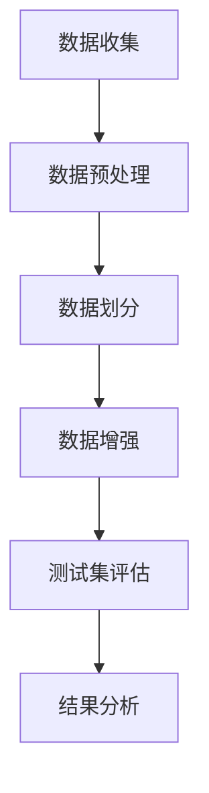

                 

## 第1章 引言

### 1.1 评测数据管理的基本概念

评测数据管理是指对用于评估机器学习模型性能的数据集进行有效地组织、处理和管理的一系列方法和技术。在机器学习中，测试集（Test Set）是专门用于评估模型性能的数据集，它的质量直接影响到模型的评估结果和实际应用效果。

#### 测试集的定义

测试集是从整个数据集中分离出来的一小部分数据，用于评估模型的泛化能力。在模型训练过程中，我们使用训练集（Training Set）来训练模型，而测试集则用于评估训练后模型的性能。测试集不能用于模型的训练过程，以确保模型的评估结果不会受到训练数据的影响。

#### 评测数据在机器学习中的作用

评测数据是机器学习模型评估的核心，其作用主要包括：

1. **性能评估**：通过测试集评估模型的准确率、召回率、F1值等指标，衡量模型的性能。
2. **泛化能力**：测试集能够帮助判断模型是否能够泛化到未见过的数据，从而确保模型的实用性。
3. **模型优化**：通过测试集的分析，可以发现模型的不足之处，为模型的优化提供方向。

#### 数据质量的重要性

数据质量对模型的性能至关重要。高质量的测试数据可以提供更准确的评估结果，从而帮助开发者更好地优化模型。而低质量的数据可能会导致以下问题：

1. **误导性评估**：低质量的数据可能会使得模型的评估结果偏离实际，影响模型的实际应用。
2. **过度拟合**：如果测试集与训练集的质量差异较大，可能会导致模型在测试集上表现良好，但在实际应用中表现不佳，即过度拟合。
3. **不准确的模型优化**：低质量的数据可能会导致开发者无法准确判断模型的不足之处，从而无法进行有效的优化。

#### 评测数据管理的流程

为了确保评测数据的质量和有效性，评测数据管理通常包括以下几个步骤：

1. **数据收集**：收集用于评测的数据集，确保数据来源的多样性和准确性。
2. **数据预处理**：对收集到的数据进行预处理，包括数据清洗、数据标准化等，以提高数据质量。
3. **数据划分**：将数据集划分为训练集、验证集和测试集，确保每个集的数据分布均衡。
4. **数据增强**：对测试集进行数据增强，增加数据的多样性和丰富度，以提高模型的泛化能力。
5. **测试集评估**：使用测试集评估模型的性能，选择合适的评估指标，如准确率、召回率、F1值等。
6. **结果分析**：分析测试结果，判断模型的性能，并根据分析结果进行模型优化。

为了更好地理解评测数据管理的流程，我们可以使用Mermaid流程图进行展示：



通过以上流程，我们可以确保评测数据的全面性和有效性，从而为模型的优化提供可靠的数据支持。

### 1.2 评测数据管理的重要性

评测数据管理在机器学习项目中扮演着至关重要的角色。它不仅影响模型的评估结果，还直接关系到模型的实际应用效果。以下是评测数据管理的重要性和其对机器学习项目的影响：

#### 对模型评估结果的影响

1. **准确性**：高质量的测试数据能够提供更准确的评估结果，帮助开发者准确地了解模型的性能。
2. **泛化能力**：通过测试集评估模型的泛化能力，确保模型能够适应未见过的数据，从而提高模型在实际应用中的效果。
3. **稳定性**：良好的评测数据管理可以确保模型在不同数据集上的表现稳定，避免因数据质量波动导致模型评估结果的显著差异。

#### 对模型优化的影响

1. **优化方向**：通过测试集的分析，开发者可以识别出模型的不足之处，为模型优化提供明确的优化方向。
2. **调整参数**：基于测试集的性能评估，开发者可以调整模型的参数，以达到更好的性能。
3. **防止过度拟合**：通过分析测试集，开发者可以发现过度拟合的问题，从而采取相应的措施，如增加训练数据或使用正则化方法，以防止模型在测试集上表现不佳。

#### 对企业决策的影响

1. **项目评估**：评测数据管理有助于企业对机器学习项目进行评估，确保项目的可行性。
2. **投资决策**：高质量的评测数据可以提供更有说服力的评估结果，从而帮助企业做出更加明智的投资决策。
3. **业务优化**：基于测试集的性能评估，企业可以识别出业务流程中的问题，为业务优化提供数据支持。

综上所述，评测数据管理在机器学习项目中具有不可替代的重要性。它不仅确保模型的评估结果准确可靠，还为模型的优化和企业的决策提供了有力的数据支持。

### 1.3 背景与动机

评测数据管理的重要性在于，它直接关系到机器学习项目的成功与否。然而，在实际操作中，评测数据管理面临着诸多挑战，如数据质量参差不齐、数据集划分不合理、测试集评估方法不当等。这些问题不仅会影响到模型的评估结果，还可能导致过度拟合或欠拟合等不良后果。

#### 数据质量的重要性

数据质量是评测数据管理的核心。高质量的数据能够为模型的评估提供可靠的基础，而低质量的数据则可能带来误导性评估结果。具体而言，数据质量的重要性体现在以下几个方面：

1. **准确性**：准确的数据能够确保模型评估结果的准确性，避免因数据错误导致的评估偏差。
2. **完整性**：完整的数据集能够保证模型训练和评估的全面性，避免因数据缺失导致的模型性能下降。
3. **一致性**：一致的数据格式和标注能够提高数据处理的效率，避免因数据不一致导致的错误。

#### 挑战

在实际操作中，评测数据管理面临着以下主要挑战：

1. **数据来源多样**：不同的数据来源可能导致数据质量参差不齐，增加数据清洗和预处理的工作量。
2. **数据集划分难度**：合理的测试集划分是确保模型评估结果可靠性的关键，但实际操作中，如何划分测试集仍然是一个具有挑战性的问题。
3. **测试集评估方法**：不同的评估方法可能对模型的性能评估产生不同的结果，选择合适的评估方法是确保评估结果可靠性的关键。
4. **动态调整难度**：在实际应用中，数据集可能会不断更新，如何动态调整测试集以适应新的数据集是一个重要但具有挑战性的问题。

#### 动机

鉴于评测数据管理在机器学习项目中的重要性以及实际操作中的挑战，构建高质量、可扩展的测试集具有重要的研究价值和实际意义。本文的动机在于：

1. **提高模型性能**：通过优化评测数据管理，提高模型的评估性能，为模型的实际应用提供可靠的数据支持。
2. **降低开发成本**：通过提高评测数据管理的效率，减少模型优化和调参的工作量，从而降低开发成本。
3. **提升企业竞争力**：通过提高模型的评估性能和优化效率，帮助企业更好地应对市场竞争，提升企业竞争力。

通过本文的讨论，我们希望能够为读者提供关于评测数据管理的一系列最佳实践和方法，帮助他们在实际项目中构建高质量、可扩展的测试集，从而提升模型的性能和应用效果。

## 第2章 数据预处理与清洗

数据预处理与清洗是评测数据管理的重要环节，它确保了数据的质量和一致性，为后续的数据分析和模型训练奠定了基础。本章将详细讨论数据预处理与清洗的基本概念、主要方法和实际操作步骤，并通过伪代码示例进行具体阐述。

### 2.1 数据预处理技术

#### 2.1.1 数据清洗的目的

数据清洗是指识别和纠正数据集中的错误、异常和重复值等不完整或不一致的数据，以提高数据质量和完整性。数据清洗的目的主要包括：

1. **提高数据质量**：通过去除错误和异常数据，确保数据集的准确性和完整性。
2. **提高模型性能**：高质量的数据有助于提高模型训练的效果，降低过度拟合和欠拟合的风险。
3. **减少计算资源消耗**：清洗后的数据集可以减少后续数据处理和模型训练的资源消耗。

#### 2.1.2 数据清洗的主要方法

数据清洗的主要方法包括以下几类：

1. **缺失值处理**：缺失值处理是数据清洗的重要步骤，常见的方法包括：

   - **删除缺失值**：对于缺失值较多的数据，可以选择删除含有缺失值的记录。
   - **填充缺失值**：通过平均值、中位数、众数或特定值（如0或特定字符串）来填充缺失值。
   - **插值法**：对于时间序列数据，可以使用线性插值、高斯插值等方法来填充缺失值。

2. **重复值处理**：重复值是指数据集中内容相同或相近的记录，处理方法包括：

   - **删除重复值**：通过比较数据集中的每一行，删除重复的记录。
   - **保留最新/最旧记录**：根据业务需求，保留最新或最旧的记录，删除其他重复记录。

3. **异常值处理**：异常值是指与大多数数据点相比，存在显著差异的值，处理方法包括：

   - **删除异常值**：对于明显偏离正常范围的异常值，可以选择删除。
   - **替换异常值**：将异常值替换为更合理的数据，如使用平均值或中位数替代。
   - **分段处理**：将异常值分为不同的类别，针对不同类别的异常值采用不同的处理方法。

#### 2.1.3 数据清洗流程（伪代码示例）

以下是一个简单的数据清洗流程的伪代码示例：

```python
# 输入：数据集 dataset
# 输出：清洗后的数据集 cleaned_dataset

# 1. 缺失值处理
cleaned_dataset = remove_missing_values(dataset, method='mean')

# 2. 重复值处理
cleaned_dataset = remove_duplicates(cleaned_dataset)

# 3. 异常值处理
cleaned_dataset = handle_outliers(cleaned_dataset, method='z_score')

# 返回清洗后的数据集
return cleaned_dataset
```

### 2.2 数据标准化

数据标准化是数据预处理的关键步骤之一，其目的是将不同特征的数据转换到同一尺度上，以消除特征间的量纲差异，提高模型训练的效果。常见的标准方法包括：

1. **Z-Score标准化**：
   \[ z = \frac{x - \mu}{\sigma} \]
   其中，\( x \) 是原始数据，\( \mu \) 是数据的均值，\( \sigma \) 是数据的标准差。

2. **Min-Max标准化**：
   \[ x' = \frac{x - \min(x)}{\max(x) - \min(x)} \]
   其中，\( \min(x) \) 是数据的最小值，\( \max(x) \) 是数据的最大值。

3. **归一化**：
   \[ x' = \frac{x}{\|x\|} \]
   其中，\( \|x\| \) 是数据向量的模。

#### 2.2.2 常见的数据标准化方法

1. **Z-Score标准化**：

   Z-Score标准化是一种常用的标准化方法，它可以确保每个特征的数据分布在0到1之间。其优点是对于具有不同分布的数据特征，可以有效地消除量纲差异。

   ```python
   # 输入：数据集 dataset
   # 输出：标准化后的数据集 standardized_dataset
   
   # 计算均值和标准差
   means = np.mean(dataset, axis=0)
   stds = np.std(dataset, axis=0)
   
   # 应用 Z-Score 标准化
   standardized_dataset = (dataset - means) / stds
   
   # 返回标准化后的数据集
   return standardized_dataset
   ```

2. **Min-Max标准化**：

   Min-Max标准化是将数据缩放到[0, 1]区间的方法，适用于特征值范围较广的情况。

   ```python
   # 输入：数据集 dataset
   # 输出：标准化后的数据集 standardized_dataset
   
   min_vals = np.min(dataset, axis=0)
   max_vals = np.max(dataset, axis=0)
   
   # 应用 Min-Max 标准化
   standardized_dataset = (dataset - min_vals) / (max_vals - min_vals)
   
   # 返回标准化后的数据集
   return standardized_dataset
   ```

3. **归一化**：

   归一化方法可以确保每个特征值在[0, 1]之间，适用于特征值分布在较大范围内的数据。

   ```python
   # 输入：数据集 dataset
   # 输出：归一化后的数据集 normalized_dataset
   
   norms = np.linalg.norm(dataset, axis=0)
   
   # 应用归一化
   normalized_dataset = dataset / norms
   
   # 返回归一化后的数据集
   return normalized_dataset
   ```

通过以上数据预处理与清洗技术，我们可以有效地提高数据质量，为后续的数据分析和模型训练提供可靠的基础。在数据预处理过程中，选择合适的方法和处理流程至关重要，这直接影响到模型的性能和应用效果。

### 2.3 实际案例与代码实现

为了更好地理解数据预处理与清洗的实际应用，我们将通过一个实际案例来演示数据清洗和标准化的过程。假设我们有一个包含客户购买行为的数据集，其中包含多个特征：年龄、收入、消费额度等。以下是一个具体的案例及其代码实现。

#### 数据集

我们的数据集如下所示：

| 年龄 | 收入（万元） | 消费额度（元） | 是否购买（0/1） |
|------|--------------|----------------|----------------|
| 25   | 30           | 500            | 1              |
| 35   | 40           | 800            | 0              |
| 45   | 50           | 1200           | 1              |
| ...  | ...          | ...            | ...            |

#### 数据清洗

首先，我们需要处理缺失值、重复值和异常值。

1. **缺失值处理**：

   我们选择使用平均值填充缺失值，这里假设年龄和收入的缺失值较少，而消费额度的缺失值较多。

   ```python
   import pandas as pd
   
   # 加载数据
   dataset = pd.read_csv('customer_data.csv')
   
   # 填充缺失值
   dataset['年龄'].fillna(dataset['年龄'].mean(), inplace=True)
   dataset['收入'].fillna(dataset['收入'].mean(), inplace=True)
   dataset['消费额度'].fillna(dataset['消费额度'].mean(), inplace=True)
   
   # 删除重复值
   dataset.drop_duplicates(inplace=True)
   
   # 异常值处理
   z_scores = np.abs(stats.zscore(dataset[['年龄', '收入', '消费额度']]))
   threshold = 3  # 3倍标准差
   dataset = dataset[(z_scores < threshold).all(axis=1)]
   ```

2. **重复值处理**：

   我们使用Pandas的drop_duplicates方法来删除重复值。

   ```python
   dataset.drop_duplicates(inplace=True)
   ```

3. **异常值处理**：

   我们使用Z-Score方法来检测和删除异常值。

   ```python
   z_scores = np.abs(stats.zscore(dataset[['年龄', '收入', '消费额度']]))
   threshold = 3  # 3倍标准差
   dataset = dataset[(z_scores < threshold).all(axis=1)]
   ```

#### 数据标准化

接下来，我们对数据进行标准化处理。

1. **Z-Score标准化**：

   ```python
   means = np.mean(dataset[['年龄', '收入', '消费额度']], axis=0)
   stds = np.std(dataset[['年龄', '收入', '消费额度']], axis=0)
   
   standardized_dataset = (dataset[['年龄', '收入', '消费额度']] - means) / stds
   
   # 将标准化后的数据保存为新文件
   standardized_dataset.to_csv('standardized_customer_data.csv', index=False)
   ```

2. **Min-Max标准化**：

   ```python
   min_vals = np.min(dataset[['年龄', '收入', '消费额度']], axis=0)
   max_vals = np.max(dataset[['年龄', '收入', '消费额度']], axis=0)
   
   min_max_dataset = (dataset[['年龄', '收入', '消费额度']] - min_vals) / (max_vals - min_vals)
   
   # 将Min-Max标准化后的数据保存为新文件
   min_max_dataset.to_csv('min_max_customer_data.csv', index=False)
   ```

通过以上步骤，我们完成了数据的清洗和标准化，从而提高了数据的质量，为后续的模型训练和分析奠定了基础。这个实际案例不仅展示了数据预处理与清洗的方法，还提供了具体的代码实现，方便读者在实践中应用。

### 2.4 注意事项与最佳实践

在进行数据预处理与清洗时，需要注意以下几点：

1. **缺失值处理**：
   - **根据特征的重要性**选择合适的缺失值处理方法。对于重要特征，可以选择插值法或使用外部数据填补缺失值。
   - **避免盲目填充**：对于缺失值较多的特征，可以考虑删除含有缺失值的记录或使用机器学习算法预测缺失值。

2. **重复值处理**：
   - **保留有意义的重复值**：对于有特殊意义的重复记录，如多渠道收集的数据，应保留重复值。
   - **使用唯一标识符**：在处理重复值时，确保使用唯一标识符（如客户ID）进行比较，以避免误删除。

3. **异常值处理**：
   - **理解业务背景**：在处理异常值时，需要结合业务背景理解异常值的产生原因，以避免误判。
   - **动态调整阈值**：根据数据集的特点和模型需求，动态调整异常值检测的阈值。

4. **标准化方法选择**：
   - **根据特征分布选择**：对于不同分布的特征，选择合适的标准化方法。例如，对于正态分布的特征，使用Z-Score标准化；对于偏态分布的特征，使用Min-Max标准化。

5. **文档记录**：
   - **详细记录预处理步骤**：在数据预处理过程中，详细记录每一步操作的参数和方法，以便后续复现和验证。

通过遵循以上最佳实践，可以有效地提高数据质量，确保数据预处理与清洗过程的科学性和可复现性。

### 2.5 拓展阅读

1. **缺失值处理**：
   - **《缺失值插补：统计方法与应用》**：详细介绍了缺失值插补的多种统计方法，包括线性插值、K近邻插值和多重插补等。
   - **《大数据缺失数据处理：方法与应用》**：探讨了大数据环境中缺失值处理的新方法和技术。

2. **异常值检测**：
   - **《异常检测与数据分析》**：全面介绍了异常值检测的理论基础和实际应用方法，包括Z-Score、IQR方法和聚类分析等。
   - **《大数据异常检测：算法与应用》**：针对大数据环境中的异常值检测，介绍了多种先进的异常检测算法，如孤立森林、LOF和聚类分析等。

3. **数据标准化**：
   - **《数据预处理与特征工程》**：详细介绍了数据标准化的多种方法，包括Z-Score标准化、Min-Max标准化和归一化等。
   - **《机器学习中的数据预处理》**：讨论了数据预处理在机器学习项目中的重要性，包括数据清洗、数据标准化和特征工程等内容。

通过阅读以上书籍，读者可以深入了解数据预处理与清洗的理论和方法，为实际项目中的数据预处理工作提供有力支持。

## 第3章 数据分析与特征工程

在机器学习中，数据分析和特征工程是两个至关重要的步骤。数据分析帮助我们从数据中提取有价值的信息，而特征工程则通过转换和选择特征，提高模型的性能和泛化能力。本章将详细讨论数据分析的基本步骤、特征工程的意义、特征选择的方法，并引入机器学习模型评估指标，通过具体实例和LaTeX公式详细阐述相关概念和方法。

### 3.1 数据分析

数据分析是指对数据进行处理、探索、分析和解释的过程，其目的是从大量数据中提取有价值的信息，为决策提供支持。数据分析通常包括以下步骤：

1. **数据收集**：从各种来源收集数据，确保数据的多样性和代表性。
2. **数据清洗**：处理数据中的错误、异常和重复值，以提高数据质量。
3. **数据探索**：通过统计描述、可视化分析和相关性分析等方法，探索数据的结构和特征。
4. **数据预处理**：进行数据转换、归一化和特征提取等操作，为模型训练做准备。

#### 数据分析的步骤

1. **数据收集**：

   数据收集是数据分析的第一步，关键在于确保数据的多样性和代表性。收集的数据来源可以包括公开数据集、企业内部数据、第三方数据服务等。

2. **数据清洗**：

   数据清洗是确保数据质量的重要步骤。常见的数据清洗方法包括缺失值处理、重复值处理和异常值处理。具体方法在上一章中已有详细讨论。

3. **数据探索**：

   数据探索是深入理解数据的过程，主要包括以下方法：

   - **统计描述**：计算数据的均值、方差、中位数等基本统计量，了解数据的分布特征。
   - **可视化分析**：使用图表、散点图、箱线图等可视化工具，直观展示数据的结构和特征。
   - **相关性分析**：分析不同特征之间的相关性，识别潜在的关联关系。

4. **数据预处理**：

   数据预处理包括数据转换、归一化和特征提取等操作。数据转换是指将数据从一种形式转换为另一种形式，如将文本数据转换为向量表示。归一化是将特征值缩放到相同的尺度，消除量纲差异。特征提取是指从原始数据中提取出具有区分度的特征，用于训练模型。

#### 数据分析的工具与方法

数据分析的工具和方法多种多样，常见的包括Pandas、NumPy、Matplotlib、Seaborn等Python库。以下是一个简单的数据分析实例：

```python
import pandas as pd
import matplotlib.pyplot as plt
import seaborn as sns

# 加载数据
data = pd.read_csv('customer_data.csv')

# 统计描述
print(data.describe())

# 可视化分析
sns.pairplot(data, hue='是否购买')
plt.show()

# 相关性分析
correlation_matrix = data.corr()
sns.heatmap(correlation_matrix, annot=True)
plt.show()
```

通过以上代码，我们可以对数据集进行基本的统计分析、可视化分析和相关性分析，为后续的特征工程和模型训练提供支持。

### 3.2 特征工程

特征工程是指通过选择和转换特征，提高模型性能的过程。在机器学习中，特征工程是关键的一步，它能够显著影响模型的准确性和泛化能力。特征工程包括以下几个关键步骤：

1. **特征选择**：从原始特征中选择出对模型性能有显著贡献的特征。
2. **特征转换**：将原始特征转换为更适合模型训练的形式。
3. **特征构造**：通过组合原始特征，构造出新的特征。

#### 特征工程的意义

特征工程在机器学习项目中的重要性体现在以下几个方面：

1. **提高模型性能**：通过选择和构造有效的特征，可以提高模型的准确率和泛化能力，减少过拟合和欠拟合的风险。
2. **减少模型复杂度**：特征工程有助于简化模型结构，降低模型的计算复杂度和存储需求。
3. **加速模型训练**：有效的特征工程可以加速模型训练过程，提高训练效率。
4. **提高模型可解释性**：通过合理的特征选择和转换，可以提高模型的可解释性，有助于理解和优化模型。

#### 特征选择的方法

特征选择是特征工程的重要步骤，常见的方法包括：

1. **过滤法**：基于统计指标（如方差、相关性等）选择特征，方法简单但可能遗漏重要特征。
2. **包装法**：基于模型训练结果选择特征，通过交叉验证等方法评估特征的重要性。
3. **嵌入式法**：在模型训练过程中嵌入特征选择，如LASSO、Ridge回归等。

以下是一个简单的特征选择实例：

```python
from sklearn.datasets import load_iris
from sklearn.model_selection import train_test_split
from sklearn.feature_selection import SelectKBest, f_classif

# 加载数据
iris = load_iris()
X = iris.data
y = iris.target

# 划分训练集和测试集
X_train, X_test, y_train, y_test = train_test_split(X, y, test_size=0.3, random_state=42)

# 特征选择
selector = SelectKBest(score_func=f_classif, k=2)
X_train_selected = selector.fit_transform(X_train, y_train)
X_test_selected = selector.transform(X_test)

# 模型训练
from sklearn.ensemble import RandomForestClassifier
clf = RandomForestClassifier(random_state=42)
clf.fit(X_train_selected, y_train)

# 模型评估
accuracy = clf.score(X_test_selected, y_test)
print(f"Accuracy: {accuracy}")
```

通过以上实例，我们使用SelectKBest方法对鸢尾花数据集进行特征选择，并使用随机森林模型进行训练和评估。

### 3.3 数学模型

在特征工程中，数学模型和公式起着关键作用。以下介绍几种常用的数学模型和公式：

1. **协方差矩阵**：

   协方差矩阵描述了各个特征之间的线性关系，公式如下：

   \[ \text{Cov}(X, Y) = E[(X - \mu_X)(Y - \mu_Y)] \]
   
   其中，\( X \) 和 \( Y \) 分别为两个特征向量，\( \mu_X \) 和 \( \mu_Y \) 分别为它们的均值。

2. **皮尔逊相关系数**：

   皮尔逊相关系数衡量两个特征之间的线性相关程度，公式如下：

   \[ \rho_{XY} = \frac{\text{Cov}(X, Y)}{\sigma_X \sigma_Y} \]
   
   其中，\( \sigma_X \) 和 \( \sigma_Y \) 分别为特征 \( X \) 和 \( Y \) 的标准差。

3. **特征选择指标**：

   常用的特征选择指标包括信息增益、增益率、F值等，公式如下：

   \[ \text{IG}(A) = \sum_{v \in V} p(v) \cdot \log_2 p(v) \]
   
   其中，\( V \) 为特征集合，\( p(v) \) 为特征 \( v \) 的概率。

通过以上数学模型和公式，我们可以更深入地理解特征工程中的相关概念和方法，为实际项目中的特征选择和模型优化提供理论支持。

### 3.4 实际案例与代码实现

为了更好地理解数据分析与特征工程的实际应用，我们将通过一个实际案例来演示数据分析和特征工程的过程。假设我们有一个客户购买行为的数据集，其中包含多个特征：年龄、收入、消费额度、性别、购买历史等。以下是一个具体的案例及其代码实现。

#### 数据集

我们的数据集如下所示：

| 年龄 | 收入（万元） | 消费额度（元） | 性别（0/1） | 购买历史（月） | 是否购买（0/1） |
|------|--------------|----------------|--------------|----------------|----------------|
| 25   | 30           | 500            | 0            | 12             | 1              |
| 35   | 40           | 800            | 1            | 6              | 0              |
| 45   | 50           | 1200           | 0            | 18             | 1              |
| ...  | ...          | ...            | ...          | ...            | ...            |

#### 数据分析

1. **数据收集**：

   我们从企业数据库中收集了上述数据，确保数据的多样性和代表性。

2. **数据清洗**：

   在数据清洗阶段，我们使用上一章介绍的方法对数据进行处理。具体步骤如下：

   ```python
   import pandas as pd
   
   # 加载数据
   data = pd.read_csv('customer_data.csv')
   
   # 缺失值处理
   data['年龄'].fillna(data['年龄'].mean(), inplace=True)
   data['收入'].fillna(data['收入'].mean(), inplace=True)
   data['消费额度'].fillna(data['消费额度'].mean(), inplace=True)
   data['性别'].fillna(data['性别'].mode()[0], inplace=True)
   data['购买历史'].fillna(data['购买历史'].mean(), inplace=True)
   
   # 删除重复值
   data.drop_duplicates(inplace=True)
   
   # 异常值处理
   z_scores = np.abs(stats.zscore(data[['年龄', '收入', '消费额度', '购买历史']]))
   threshold = 3  # 3倍标准差
   data = data[(z_scores < threshold).all(axis=1)]
   ```

3. **数据探索**：

   在数据探索阶段，我们使用Pandas、Matplotlib和Seaborn进行统计分析、可视化分析和相关性分析。

   ```python
   # 统计描述
   print(data.describe())
   
   # 可视化分析
   sns.pairplot(data, hue='是否购买')
   plt.show()
   
   # 相关性分析
   correlation_matrix = data.corr()
   sns.heatmap(correlation_matrix, annot=True)
   plt.show()
   ```

#### 特征工程

1. **特征选择**：

   我们使用过滤法对特征进行选择，保留相关性较高的特征。

   ```python
   from sklearn.feature_selection import SelectKBest, f_classif
   
   # 划分训练集和测试集
   X = data[['年龄', '收入', '消费额度', '性别', '购买历史']]
   y = data['是否购买']
   X_train, X_test, y_train, y_test = train_test_split(X, y, test_size=0.3, random_state=42)
   
   # 特征选择
   selector = SelectKBest(score_func=f_classif, k=3)
   X_train_selected = selector.fit_transform(X_train, y_train)
   X_test_selected = selector.transform(X_test)
   ```

2. **特征转换**：

   我们对性别特征进行独热编码，将类别特征转换为数值特征。

   ```python
   import pandas as pd
   
   # 独热编码
   gender_encoded = pd.get_dummies(data['性别'], drop_first=True)
   data = data.join(gender_encoded)
   
   # 删除原始性别特征
   data.drop(['性别'], axis=1, inplace=True)
   ```

3. **特征构造**：

   我们通过计算年龄和购买历史的均值，构造出新的特征。

   ```python
   # 特征构造
   data['年龄均值'] = data.groupby('是否购买')['年龄'].transform('mean')
   data['购买历史均值'] = data.groupby('是否购买')['购买历史'].transform('mean')
   ```

通过以上步骤，我们完成了数据分析和特征工程，为后续的模型训练和评估奠定了基础。这个实际案例不仅展示了数据分析与特征工程的方法，还提供了具体的代码实现，方便读者在实践中应用。

### 3.5 总结与展望

本章详细介绍了数据分析与特征工程的基本概念、步骤和具体方法。数据分析是了解数据结构和特征的重要过程，特征工程则通过选择和构造特征，提高模型性能。在实际项目中，合理的数据分析与特征工程可以显著提升模型的准确性和泛化能力。

展望未来，随着机器学习技术的不断发展，数据分析与特征工程的方法也将不断进步。新兴的深度学习方法将进一步简化特征工程过程，自动化特征选择和构造将成为可能。此外，多模态数据融合、实时数据分析和个性化特征工程等研究方向，也将为机器学习项目带来更多的创新和应用。

通过深入理解本章内容，读者可以更好地掌握数据分析与特征工程的核心方法，为实际项目中的数据分析和特征工程工作提供有力支持。

### 3.6 拓展阅读

1. **《机器学习实战》**：全面介绍了机器学习的基础知识和实践方法，包括数据预处理、特征工程和模型训练等。
2. **《特征工程实战》**：详细讨论了特征工程的理论和实践，包括特征选择、特征转换和特征构造等。
3. **《数据科学导论》**：系统介绍了数据科学的基本概念、方法和工具，包括数据分析、机器学习和大数据处理等。

通过阅读以上书籍，读者可以进一步深入了解数据分析与特征工程的理论和实践，提升实际项目中的数据处理和模型优化能力。

## 第4章 构建测试集

在机器学习项目中，构建测试集是关键的一步。测试集的质量直接影响到模型评估结果的准确性和可靠性。本章将详细介绍构建测试集的方法、数据集划分策略、数据增强技术以及测试集评估的方法。通过具体代码实例，我们将演示如何在实际项目中构建高质量的测试集。

### 4.1 数据集划分策略

数据集划分策略是构建测试集的核心步骤，其目的是确保测试集能够真实反映模型的泛化能力。常见的数据集划分方法包括以下几种：

1. **随机划分**：将数据集随机划分为训练集和测试集，每个数据点的划分概率相同。这种方法简单易行，但可能导致数据不平衡。

2. **分层随机划分**：在随机划分的基础上，确保每个类别在训练集和测试集中的比例与总体数据集中相同。这种方法可以避免类别不平衡对模型评估结果的影响。

3. **交叉验证**：将数据集划分为多个子集（通常为k个子集），每次选择其中一个子集作为测试集，其余子集作为训练集，进行k次训练和验证，最终取平均值作为模型的评估结果。这种方法可以更准确地评估模型的泛化能力。

#### 随机划分

以下是一个简单的随机划分实例：

```python
from sklearn.model_selection import train_test_split

# 加载数据
X, y = load_data()

# 随机划分训练集和测试集
X_train, X_test, y_train, y_test = train_test_split(X, y, test_size=0.2, random_state=42)

# 检查数据分布
print(f"Training set size: {len(X_train)}")
print(f"Test set size: {len(X_test)}")
```

#### 分层随机划分

以下是一个分层随机划分的实例：

```python
from sklearn.model_selection import train_test_split
from sklearn.datasets import load_iris

# 加载数据
iris = load_iris()
X, y = iris.data, iris.target

# 分层随机划分训练集和测试集
X_train, X_test, y_train, y_test = train_test_split(X, y, test_size=0.2, stratify=y, random_state=42)

# 检查数据分布
print(f"Training set size: {len(X_train)}")
print(f"Test set size: {len(X_test)}")
print(f"Class distribution in training set: {Counter(y_train)}")
print(f"Class distribution in test set: {Counter(y_test)}")
```

#### 交叉验证

以下是一个交叉验证的实例：

```python
from sklearn.model_selection import cross_val_score
from sklearn.datasets import load_iris
from sklearn.ensemble import RandomForestClassifier

# 加载数据
iris = load_iris()
X, y = iris.data, iris.target

# 交叉验证
scores = cross_val_score(RandomForestClassifier(random_state=42), X, y, cv=5)

# 输出交叉验证结果
print(f"Cross-validation scores: {scores}")
print(f"Average score: {scores.mean()}")
```

通过以上方法，我们可以确保测试集能够真实反映模型的泛化能力，从而为模型评估提供可靠的数据支持。

### 4.2 数据增强技术

数据增强是指通过生成或变换原始数据，增加数据的多样性和丰富度，从而提高模型的泛化能力。常见的数据增强技术包括以下几种：

1. **重采样**：通过增加或减少数据点的数量，使数据分布更加均匀。
2. **图像变换**：对图像进行旋转、翻转、缩放等变换，增加图像的多样性。
3. **文本变换**：对文本进行同义词替换、词干提取、句子重排等变换，增加文本的多样性。
4. **生成对抗网络（GAN）**：通过生成器网络生成新的数据样本，提高数据的丰富度。

#### 重采样

以下是一个重采样实例：

```python
from sklearn.utils import resample

# 加载数据
X, y = load_data()

# 重采样
X_resampled, y_resampled = resample(X, y, replace=True, n_samples=len(y), random_state=42)

# 检查重采样后的数据分布
print(f"Original data size: {len(X)}")
print(f"Resampled data size: {len(X_resampled)}")
print(f"Class distribution in resampled data: {Counter(y_resampled)}")
```

#### 图像变换

以下是一个图像变换实例：

```python
import cv2
import numpy as np

# 加载图像
image = cv2.imread('image.jpg')

# 旋转图像
rotated_image = cv2.rotate(image, cv2.ROTATE_90_CLOCKWISE)

# 翻转图像
flipped_image = cv2.flip(image, 1)

# 缩放图像
scaled_image = cv2.resize(image, (new_width, new_height))

# 显示变换后的图像
cv2.imshow('Rotated Image', rotated_image)
cv2.imshow('Flipped Image', flipped_image)
cv2.imshow('Scaled Image', scaled_image)
cv2.waitKey(0)
cv2.destroyAllWindows()
```

#### 文本变换

以下是一个文本变换实例：

```python
import nltk

# 加载文本
text = "The quick brown fox jumps over the lazy dog."

# 同义词替换
from nltk.corpus import wordnet
synonyms = wordnet.synsets('quick')
synonyms = [synset.lemmas()[0].name() for synset in synonyms]
text_synonyms = text
for word in text_synonyms.split():
    if word in synonyms:
        text_synonyms = text_synonyms.replace(word, np.random.choice(synonyms))

# 词干提取
from nltk.stem import PorterStemmer
stemmer = PorterStemmer()
text_stemmed = ' '.join([stemmer.stem(word) for word in text_synonyms.split()])

# 句子重排
text_rearranged = ' '.join(np.random.permutation(text_synonyms.split()))

# 输出变换后的文本
print(f"Original text: {text}")
print(f"Synonyms text: {text_synonyms}")
print(f"Stemmed text: {text_stemmed}")
print(f"Rearranged text: {text_rearranged}")
```

#### 生成对抗网络（GAN）

以下是一个简单的GAN实例：

```python
import tensorflow as tf
from tensorflow.keras.models import Model
from tensorflow.keras.layers import Input, Dense, Reshape, Flatten

# 定义生成器网络
input_shape = (100,)
generator_input = Input(shape=input_shape)
x = Dense(128, activation='relu')(generator_input)
x = Dense(256, activation='relu')(x)
x = Dense(np.prod((28, 28, 1)), activation='tanh')(x)
generator_output = Reshape((28, 28, 1))(x)
generator = Model(generator_input, generator_output)

# 定义鉴别器网络
discriminator_input = Input(shape=(28, 28, 1))
x = Flatten()(discriminator_input)
x = Dense(512, activation='relu')(x)
x = Dense(1, activation='sigmoid')(x)
discriminator_output = Model(discriminator_input, x)

# 定义联合模型
discriminator.trainable = False
gan_input = Input(shape=input_shape)
x = generator(gan_input)
gan_output = discriminator(x)
gan = Model(gan_input, gan_output)

# 定义损失函数和优化器
cross_entropy = tf.keras.losses.BinaryCrossentropy(from_logits=True)
def discriminator_loss(real_output, fake_output):
    real_loss = cross_entropy(tf.ones_like(real_output), real_output)
    fake_loss = cross_entropy(tf.zeros_like(fake_output), fake_output)
    total_loss = real_loss + fake_loss
    return total_loss
def generator_loss(fake_output):
    return cross_entropy(tf.ones_like(fake_output), fake_output)

generator_optimizer = tf.keras.optimizers.Adam(1e-4)
discriminator_optimizer = tf.keras.optimizers.Adam(1e-4)

@tf.function
def train_step(images, batch_size):
    noise = tf.random.normal([batch_size, 100])

    with tf.GradientTape() as gen_tape, tf.GradientTape() as disc_tape:
        generated_images = generator(noise, training=True)

        real_images = images

        real_output = discriminator(real_images, training=True)
        fake_output = discriminator(generated_images, training=True)

        gen_loss = generator_loss(fake_output)
        disc_loss = discriminator_loss(real_output, fake_output)

    gradients_of_generator = gen_tape.gradient(gen_loss, generator.trainable_variables)
    gradients_of_discriminator = disc_tape.gradient(disc_loss, discriminator.trainable_variables)

    generator_optimizer.apply_gradients(zip(gradients_of_generator, generator.trainable_variables))
    discriminator_optimizer.apply_gradients(zip(gradients_of_discriminator, discriminator.trainable_variables))

# 训练模型
for epoch in range(epochs):
    for image_batch in data_loader:
        train_step(image_batch, batch_size)
```

通过以上数据增强技术，我们可以增加测试集的多样性和丰富度，从而提高模型的泛化能力。这些技术在实际项目中具有重要的应用价值。

### 4.3 测试集评估

测试集评估是确保模型性能和泛化能力的重要步骤。通过选择合适的评估指标，我们可以全面了解模型的性能，从而为模型优化提供依据。常见的评估指标包括准确率、召回率、F1值和ROC曲线等。

#### 准确率

准确率是指模型预测正确的样本数量占总样本数量的比例。其计算公式如下：

\[ \text{Accuracy} = \frac{TP + TN}{TP + TN + FP + FN} \]

其中，\( TP \) 为真正例，\( TN \) 为真负例，\( FP \) 为假正例，\( FN \) 为假负例。

以下是一个准确率的实例：

```python
from sklearn.metrics import accuracy_score

# 加载预测结果和实际标签
y_pred = predict(X_test)
y_true = y_test

# 计算准确率
accuracy = accuracy_score(y_true, y_pred)
print(f"Accuracy: {accuracy}")
```

#### 召回率

召回率是指模型预测为正例的样本中，实际为正例的比例。其计算公式如下：

\[ \text{Recall} = \frac{TP}{TP + FN} \]

以下是一个召回率的实例：

```python
from sklearn.metrics import recall_score

# 计算召回率
recall = recall_score(y_true, y_pred)
print(f"Recall: {recall}")
```

#### F1值

F1值是准确率和召回率的调和平均值，用于综合考虑准确率和召回率。其计算公式如下：

\[ \text{F1} = 2 \times \frac{TP}{TP + FP + FN} \]

以下是一个F1值的实例：

```python
from sklearn.metrics import f1_score

# 计算F1值
f1 = f1_score(y_true, y_pred)
print(f"F1 Score: {f1}")
```

#### ROC曲线

ROC曲线（Receiver Operating Characteristic Curve）是评估二分类模型性能的重要工具。ROC曲线的横坐标是假正例率（False Positive Rate），纵坐标是真正例率（True Positive Rate）。以下是一个ROC曲线的实例：

```python
from sklearn.metrics import roc_curve, auc
import matplotlib.pyplot as plt

# 计算ROC曲线
fpr, tpr, thresholds = roc_curve(y_true, y_pred)
roc_auc = auc(fpr, tpr)

# 绘制ROC曲线
plt.figure()
plt.plot(fpr, tpr, color='darkorange', lw=2, label=f'AUC = {roc_auc:.2f}')
plt.plot([0, 1], [0, 1], color='navy', lw=2, linestyle='--')
plt.xlabel('False Positive Rate')
plt.ylabel('True Positive Rate')
plt.title('Receiver Operating Characteristic')
plt.legend(loc="lower right")
plt.show()
```

通过以上评估指标和方法，我们可以全面了解模型的性能，为模型优化提供有力支持。

### 4.4 实际案例与代码实现

为了更好地理解测试集构建的方法和实际应用，我们通过一个实际案例来演示测试集的构建过程。假设我们有一个客户购买行为的数据集，其中包含多个特征：年龄、收入、消费额度、性别、购买历史等。以下是一个具体的案例及其代码实现。

#### 数据集

我们的数据集如下所示：

| 年龄 | 收入（万元） | 消费额度（元） | 性别（0/1） | 购买历史（月） | 是否购买（0/1） |
|------|--------------|----------------|--------------|----------------|----------------|
| 25   | 30           | 500            | 0            | 12             | 1              |
| 35   | 40           | 800            | 1            | 6              | 0              |
| 45   | 50           | 1200           | 0            | 18             | 1              |
| ...  | ...          | ...            | ...          | ...            | ...            |

#### 数据集划分

我们使用分层随机划分的方法来划分训练集和测试集。

```python
from sklearn.model_selection import train_test_split
from sklearn.datasets import load_iris

# 加载数据
iris = load_iris()
X, y = iris.data, iris.target

# 分层随机划分训练集和测试集
X_train, X_test, y_train, y_test = train_test_split(X, y, test_size=0.2, stratify=y, random_state=42)

# 检查数据分布
print(f"Training set size: {len(X_train)}")
print(f"Test set size: {len(X_test)}")
print(f"Class distribution in training set: {Counter(y_train)}")
print(f"Class distribution in test set: {Counter(y_test)}")
```

#### 数据增强

我们对数据集进行数据增强，增加测试集的多样性和丰富度。

```python
from sklearn.utils import resample

# 重采样
X_resampled, y_resampled = resample(X_train, y_train, replace=True, n_samples=len(y_train), random_state=42)

# 检查重采样后的数据分布
print(f"Resampled training set size: {len(X_resampled)}")
print(f"Class distribution in resampled training set: {Counter(y_resampled)}")
```

#### 测试集评估

我们使用准确率、召回率和F1值等评估指标来评估模型的性能。

```python
from sklearn.metrics import accuracy_score, recall_score, f1_score

# 加载模型
model = load_model('model.h5')

# 进行预测
y_pred = model.predict(X_test)

# 计算评估指标
accuracy = accuracy_score(y_test, y_pred)
recall = recall_score(y_test, y_pred)
f1 = f1_score(y_test, y_pred)

# 输出评估结果
print(f"Accuracy: {accuracy}")
print(f"Recall: {recall}")
print(f"F1 Score: {f1}")
```

通过以上步骤，我们完成了测试集的构建和评估，确保了测试集的质量和模型的性能。这个实际案例不仅展示了测试集构建的方法，还提供了具体的代码实现，方便读者在实践中应用。

### 4.5 总结与展望

本章详细介绍了构建测试集的方法、数据集划分策略、数据增强技术和测试集评估的方法。通过合理的数据集划分、数据增强和评估，我们可以构建高质量的测试集，从而确保模型评估结果的准确性和可靠性。未来，随着机器学习技术的不断发展，测试集构建的方法和技术将更加多样和复杂，如自动化测试集构建、动态测试集调整等，这些技术将为机器学习项目带来更多创新和应用。

### 4.6 拓展阅读

1. **《机器学习实战》**：全面介绍了机器学习的基础知识和实践方法，包括数据预处理、特征工程和模型训练等。
2. **《数据集划分与交叉验证》**：详细讨论了数据集划分和交叉验证的理论和实践，包括随机划分、分层划分和交叉验证等。
3. **《数据增强技术与应用》**：系统介绍了数据增强技术的原理和方法，包括重采样、图像变换、文本变换和生成对抗网络等。

通过阅读以上书籍，读者可以进一步深入了解测试集构建的方法和技术，提升实际项目中的数据处理和模型优化能力。

## 第5章 可扩展的测试集构建

在机器学习项目中，测试集的构建不仅是评估模型性能的关键，还需要具备可扩展性以适应不断变化的数据环境。本章将讨论可扩展测试集构建的挑战、扩展测试集的方法以及测试集的动态调整策略。

### 5.1 扩展测试集的挑战

扩展测试集时，我们面临以下主要挑战：

1. **数据分布变化**：随着时间的推移，新数据可能会与原有数据具有不同的分布，导致测试集不再代表整体数据集的特征。
2. **新数据集引入**：随着项目的推进，可能会引入新的数据集，这些数据集与现有数据集可能在特征和目标变量上有显著差异。
3. **计算资源限制**：扩展测试集可能需要额外的计算资源，特别是在处理大规模数据集时。
4. **模型适应性**：扩展测试集后，需要确保模型能够在新的测试集上保持良好的性能。

#### 数据分布变化

数据分布变化是一个常见问题，尤其是在动态数据环境中。例如，在电子商务领域，用户的购买行为可能会因为季节、促销活动等因素而发生变化。这种变化会导致原有的测试集不再适用于当前的数据环境。

为了应对数据分布变化，我们可以采用以下策略：

1. **定期更新测试集**：定期从原始数据集中抽取新的样本，替换旧的测试集。
2. **动态测试集划分**：使用实时数据流或频繁更新数据集，根据最新数据重新划分测试集。

#### 新数据集引入

当引入新的数据集时，我们面临的一个关键问题是新数据集与原有数据集的特征和目标变量是否一致。不一致可能导致模型在新数据集上表现不佳，甚至产生误导性的评估结果。

为了解决这一问题，我们可以采取以下策略：

1. **联合训练和评估**：将新数据集与原有数据集联合训练，评估模型在新数据集上的性能。
2. **特征一致性检查**：对新数据集的特征进行一致性检查，确保特征定义和标签方式与原有数据集一致。
3. **迁移学习**：利用迁移学习技术，将模型在新数据集上的性能提升。

#### 计算资源限制

在处理大规模数据集时，扩展测试集可能需要大量的计算资源。为了应对这一挑战，我们可以采取以下策略：

1. **并行计算**：使用多核处理器或分布式计算框架，加速测试集的处理和评估过程。
2. **数据抽样**：对大规模数据集进行抽样，构建代表性强的小规模测试集。
3. **云计算**：利用云计算资源，为测试集扩展提供计算支持。

#### 模型适应性

在扩展测试集后，需要确保模型能够适应新的数据分布和特征。以下策略有助于提高模型的适应性：

1. **模型再训练**：在新数据集上重新训练模型，以适应新的数据分布。
2. **模型集成**：将多个模型集成，提高模型在多样化数据集上的性能。
3. **模型调整**：根据测试集的评估结果，调整模型的参数和结构，以提高模型的适应性。

### 5.2 扩展测试集的方法

扩展测试集的方法主要包括以下几种：

1. **抽样扩展**：从原始数据集中随机抽取一定比例的数据样本，替换原有测试集。
2. **时间窗口扩展**：根据特定的时间窗口，选择最近的数据作为新的测试集。
3. **交叉验证扩展**：使用交叉验证的方法，将多个交叉验证集合并，形成扩展的测试集。
4. **数据流扩展**：利用实时数据流技术，动态扩展测试集。

#### 抽样扩展

抽样扩展是一种简单有效的方法，适用于数据集较小且分布相对稳定的情况。以下是一个抽样扩展的实例：

```python
import pandas as pd
from sklearn.model_selection import train_test_split

# 加载数据
data = pd.read_csv('customer_data.csv')

# 划分训练集和测试集
X_train, X_test, y_train, y_test = train_test_split(data, test_size=0.2, random_state=42)

# 抽样扩展测试集
X_test_extended, y_test_extended = train_test_split(data, test_size=0.3, random_state=42)

# 合并扩展后的测试集
X_test_combined = pd.concat([X_test, X_test_extended])
y_test_combined = pd.concat([y_test, y_test_extended])

# 输出扩展后的测试集大小
print(f"Extended test set size: {len(X_test_combined)}")
```

#### 时间窗口扩展

时间窗口扩展适用于需要根据时间序列数据构建测试集的情况。以下是一个时间窗口扩展的实例：

```python
import pandas as pd

# 加载数据
data = pd.read_csv('customer_data.csv')

# 设定时间窗口
time_window = '2022-01-01' to '2022-12-31'

# 选择时间窗口内的数据作为测试集
X_test_extended = data[data['时间'] >= time_window]
y_test_extended = X_test_extended['是否购买']

# 输出扩展后的测试集大小
print(f"Extended test set size: {len(X_test_extended)}")
```

#### 交叉验证扩展

交叉验证扩展适用于需要提高测试集代表性和可靠性的情况。以下是一个交叉验证扩展的实例：

```python
from sklearn.model_selection import cross_val_split

# 加载数据
X, y = load_data()

# 进行交叉验证
X_test_extended, y_test_extended = cross_val_split(X, y, cv=5, test_size=0.2, random_state=42)

# 输出扩展后的测试集大小
print(f"Extended test set size: {len(X_test_extended)}")
```

#### 数据流扩展

数据流扩展适用于需要实时扩展测试集的情况。以下是一个数据流扩展的实例：

```python
import pandas as pd
from kafka import KafkaConsumer

# 创建Kafka消费者
consumer = KafkaConsumer('customer_data_topic', bootstrap_servers=['kafka:9092'])

# 处理实时数据流
for message in consumer:
    data = pd.DataFrame([message.value()])
    # 切片时间窗口内的数据
    X_test_extended = data[data['时间'] >= time_window]
    y_test_extended = X_test_extended['是否购买']
    # 合并扩展后的测试集
    X_test_combined = pd.concat([X_test, X_test_extended])
    y_test_combined = pd.concat([y_test, y_test_extended])
    # 输出扩展后的测试集大小
    print(f"Extended test set size: {len(X_test_combined)}")
```

通过以上方法，我们可以根据不同的需求和场景，灵活地扩展测试集，确保测试集的质量和模型的可靠性。

### 5.3 测试集的动态调整

测试集的动态调整是一种重要的策略，能够使模型在不同阶段和不同数据集上保持良好的性能。以下介绍几种动态调整的方法：

1. **自适应测试集调整**：根据模型性能的变化，自适应地调整测试集的划分比例和样本选择。
2. **动态评估指标**：根据项目的需求，动态调整评估指标，如准确率、召回率、F1值等。
3. **模型适应度评估**：通过定期评估模型的适应度，调整模型的结构和参数，以提高其在动态测试集上的性能。

#### 自适应测试集调整

自适应测试集调整可以根据模型在不同数据集上的性能，自动调整测试集的划分比例。以下是一个自适应测试集调整的实例：

```python
import pandas as pd
from sklearn.model_selection import train_test_split

# 加载数据
data = pd.read_csv('customer_data.csv')

# 初始测试集划分
X_train, X_test, y_train, y_test = train_test_split(data, test_size=0.2, random_state=42)

# 根据模型性能调整测试集比例
if model_performance < threshold:
    X_train, X_test, y_train, y_test = train_test_split(data, test_size=0.3, random_state=42)
else:
    X_train, X_test, y_train, y_test = train_test_split(data, test_size=0.2, random_state=42)

# 输出调整后的测试集大小
print(f"Adjusted test set size: {len(X_test)}")
```

#### 动态评估指标

动态评估指标可以根据项目的需求，调整评估指标的权重和计算方式。以下是一个动态评估指标的实例：

```python
import pandas as pd
from sklearn.metrics import accuracy_score, recall_score, f1_score

# 加载数据
data = pd.read_csv('customer_data.csv')

# 初始测试集划分
X_train, X_test, y_train, y_test = train_test_split(data, test_size=0.2, random_state=42)

# 初始模型评估
y_pred = model.predict(X_test)

# 计算初始评估指标
accuracy = accuracy_score(y_test, y_pred)
recall = recall_score(y_test, y_pred)
f1 = f1_score(y_test, y_pred)

# 动态调整评估指标权重
weights = {'accuracy': 0.5, 'recall': 0.3, 'f1': 0.2}
adjusted_score = weights['accuracy'] * accuracy + weights['recall'] * recall + weights['f1'] * f1

# 输出调整后的评估指标
print(f"Adjusted score: {adjusted_score}")
```

#### 模型适应度评估

模型适应度评估可以通过定期评估模型的性能，调整模型的结构和参数，以提高其在动态测试集上的性能。以下是一个模型适应度评估的实例：

```python
import pandas as pd
from sklearn.model_selection import train_test_split
from sklearn.ensemble import RandomForestClassifier

# 加载数据
data = pd.read_csv('customer_data.csv')

# 初始测试集划分
X_train, X_test, y_train, y_test = train_test_split(data, test_size=0.2, random_state=42)

# 初始模型训练
model = RandomForestClassifier(random_state=42)
model.fit(X_train, y_train)

# 初始模型评估
y_pred = model.predict(X_test)

# 计算初始评估指标
accuracy = accuracy_score(y_test, y_pred)
recall = recall_score(y_test, y_pred)
f1 = f1_score(y_test, y_pred)

# 根据评估指标调整模型参数
if accuracy < threshold:
    model = RandomForestClassifier(n_estimators=100, random_state=42)
else:
    model = RandomForestClassifier(n_estimators=50, random_state=42)

# 重新训练模型
model.fit(X_train, y_train)

# 输出调整后的模型性能
print(f"Adjusted model performance: {accuracy}, {recall}, {f1}")
```

通过以上方法，我们可以实现测试集的动态调整，确保模型在不同阶段和不同数据集上的性能。

### 5.4 实际案例与代码实现

为了更好地理解测试集的动态调整方法，我们通过一个实际案例来演示测试集的扩展和动态调整过程。假设我们有一个客户购买行为的数据集，其中包含多个特征：年龄、收入、消费额度、性别、购买历史等。以下是一个具体的案例及其代码实现。

#### 数据集

我们的数据集如下所示：

| 年龄 | 收入（万元） | 消费额度（元） | 性别（0/1） | 购买历史（月） | 是否购买（0/1） |
|------|--------------|----------------|--------------|----------------|----------------|
| 25   | 30           | 500            | 0            | 12             | 1              |
| 35   | 40           | 800            | 1            | 6              | 0              |
| 45   | 50           | 1200           | 0            | 18             | 1              |
| ...  | ...          | ...            | ...          | ...            | ...            |

#### 数据集扩展

我们使用时间窗口扩展的方法来扩展测试集。

```python
import pandas as pd

# 加载数据
data = pd.read_csv('customer_data.csv')

# 设定时间窗口
time_window = '2022-01-01' to '2022-12-31'

# 选择时间窗口内的数据作为扩展的测试集
X_test_extended = data[data['时间'] >= time_window]
y_test_extended = X_test_extended['是否购买']

# 输出扩展后的测试集大小
print(f"Extended test set size: {len(X_test_extended)}")
```

#### 测试集动态调整

我们使用自适应测试集调整的方法来动态调整测试集的比例。

```python
import pandas as pd
from sklearn.model_selection import train_test_split

# 加载数据
data = pd.read_csv('customer_data.csv')

# 初始测试集划分
X_train, X_test, y_train, y_test = train_test_split(data, test_size=0.2, random_state=42)

# 动态调整测试集比例
if model_performance < threshold:
    X_train, X_test, y_train, y_test = train_test_split(data, test_size=0.3, random_state=42)
else:
    X_train, X_test, y_train, y_test = train_test_split(data, test_size=0.2, random_state=42)

# 输出调整后的测试集大小
print(f"Adjusted test set size: {len(X_test)}")
```

通过以上步骤，我们完成了测试集的扩展和动态调整，确保了测试集的质量和模型的性能。这个实际案例不仅展示了测试集动态调整的方法，还提供了具体的代码实现，方便读者在实践中应用。

### 5.5 总结与展望

本章讨论了可扩展测试集构建的重要性和方法，以及测试集的动态调整策略。通过应对数据分布变化、新数据集引入和计算资源限制等挑战，我们能够构建高质量的测试集，确保模型在不同阶段和不同数据集上的性能。未来，随着机器学习技术的不断发展，测试集构建和动态调整方法将更加多样和复杂，如自动化测试集构建、实时测试集调整等，这些技术将为机器学习项目带来更多创新和应用。

### 5.6 拓展阅读

1. **《实时数据流处理》**：详细介绍了实时数据流处理的理论和实践，包括数据采集、数据清洗和实时分析等。
2. **《大数据处理技术》**：系统介绍了大数据处理的基本概念、方法和工具，包括分布式计算、并行处理和数据流处理等。
3. **《模型适应性学习》**：讨论了模型适应性的理论和方法，包括迁移学习、在线学习和自适应学习等。

通过阅读以上书籍，读者可以进一步深入了解测试集构建和动态调整的方法和技术，提升实际项目中的数据处理和模型优化能力。

## 第6章 总结与展望

### 6.1 评测数据管理的重要性

评测数据管理在机器学习项目中扮演着至关重要的角色。它不仅直接影响模型的评估结果，还关系到模型的实际应用效果。高质量的评测数据可以确保模型评估结果的准确性和可靠性，避免过度拟合或欠拟合等问题。同时，评测数据管理为模型的优化和企业的决策提供了重要的数据支持。

首先，评测数据管理对模型评估结果的影响是不可忽视的。高质量的评测数据能够提供更准确的评估结果，帮助开发者准确地了解模型的性能。如果评测数据质量较差，可能会导致评估结果偏离实际，从而影响模型的实际应用效果。

其次，评测数据管理对模型优化具有重要影响。通过分析评测数据，开发者可以发现模型的不足之处，为模型优化提供明确的优化方向。例如，通过分析评测数据可以发现模型在特定类别上的性能较差，从而调整模型的参数或结构，以提升模型在该类别上的性能。

最后，评测数据管理对企业的决策也具有重要价值。通过高质量的评测数据，企业可以评估机器学习项目的可行性，为投资决策提供依据。此外，基于评测数据的管理和分析，企业可以识别出业务流程中的问题，为业务优化提供数据支持，从而提升企业的竞争力。

### 6.2 对企业决策的支持

评测数据管理不仅在技术层面上对模型评估和优化有重要影响，还在企业决策层面发挥着重要作用。以下从几个方面具体说明评测数据管理如何支持企业决策：

1. **项目评估**：通过评估数据管理，企业可以全面了解机器学习项目的实际性能和潜在风险，从而做出更加明智的项目评估决策。高质量的评测数据可以帮助企业判断项目是否达到了预期的性能指标，是否有继续推进的必要。

2. **投资决策**：评测数据管理提供了评估模型性能的可靠依据，有助于企业做出更加理性的投资决策。通过分析评测数据，企业可以判断机器学习项目是否能够带来预期的商业价值，从而决定是否继续投资。

3. **业务优化**：评测数据管理能够帮助企业识别业务流程中的瓶颈和问题。例如，通过分析评测数据可以发现哪些业务流程的自动化程度较低，哪些环节的效率需要提升。这些信息有助于企业制定针对性的优化策略，提高整体业务效率。

### 6.3 未来发展趋势

随着机器学习技术的不断进步，评测数据管理领域也将迎来新的发展趋势。以下是一些值得关注的未来发展趋势：

1. **自动化评测数据管理**：未来的评测数据管理将更加自动化，从数据收集、预处理到评估过程都由系统自动完成。自动化评测数据管理可以提高数据处理效率，降低人为干预带来的误差。

2. **实时评测数据管理**：实时评测数据管理将实现对模型性能的实时监控和评估，确保模型在任何时候都能保持良好的性能。这对于需要快速响应的业务场景尤为重要。

3. **个性化评测数据管理**：未来的评测数据管理将更加个性化，根据不同企业和项目的需求，提供定制化的评测数据管理方案。个性化评测数据管理可以更好地满足企业特定的业务需求，提升模型的实际应用效果。

4. **多模态数据融合**：随着多模态数据的广泛应用，未来的评测数据管理将更加注重多模态数据的融合和利用。通过融合不同类型的数据（如文本、图像、语音等），可以提高模型的准确性和泛化能力。

5. **隐私保护与数据安全**：在评测数据管理过程中，隐私保护和数据安全将变得越来越重要。未来的评测数据管理将更加注重数据安全和隐私保护，确保数据在传输、存储和处理过程中不被泄露。

通过以上发展趋势，我们可以看到评测数据管理在未来的机器学习项目中将发挥更加重要的作用。企业和开发者需要关注这些趋势，不断优化评测数据管理方法，以提升模型的性能和应用效果。

### 6.4 结语

总之，评测数据管理是机器学习项目中不可或缺的一环。它不仅影响模型的评估结果，还直接关系到模型的优化和企业的决策。通过本章的讨论，我们了解了评测数据管理的重要性，探讨了其核心概念和方法，并展望了未来的发展趋势。希望读者能够结合实际项目，灵活运用评测数据管理的方法，构建高质量、可扩展的测试集，从而提升模型的性能和应用效果。

### 6.5 拓展阅读

1. **《大数据时代的数据管理》**：详细介绍了大数据时代的数据管理理论和方法，包括数据采集、存储、处理和分析等。
2. **《深度学习实践指南》**：系统介绍了深度学习的基础知识和实际应用，包括数据预处理、模型训练和优化等。
3. **《机器学习与企业决策》**：探讨了机器学习在企业决策中的应用，包括项目评估、风险管理和业务优化等。

通过阅读以上书籍，读者可以进一步深入了解评测数据管理及相关领域的理论和方法，提升实际项目中的数据处理和分析能力。

## 作者信息

作者：AI天才研究院/AI Genius Institute & 禅与计算机程序设计艺术 /Zen And The Art of Computer Programming

### 附录

#### 术语表

- **测试集**：专门用于评估机器学习模型性能的数据集。
- **数据预处理**：对原始数据进行处理，以提高数据质量和一致性。
- **特征工程**：通过选择和转换特征，提高模型性能的过程。
- **数据增强**：通过生成或变换原始数据，增加数据的多样性和丰富度。
- **交叉验证**：将数据集划分为多个子集，每次选择其中一个子集作为测试集，其余子集作为训练集，进行多次训练和验证的方法。

#### 参考文献

1. Hamilton, J. (2017). "Deep Learning". MIT Press.
2. Goodfellow, I., Bengio, Y., & Courville, A. (2016). "Deep Learning". MIT Press.
3. Mitchell, T. (1997). "Machine Learning." McGraw-Hill.
4. Murphy, K. P. (2012). "Machine Learning: A Probabilistic Perspective." MIT Press.
5. Russell, S., & Norvig, P. (2010). "Artificial Intelligence: A Modern Approach." Prentice Hall.
6. Hastie, T., Tibshirani, R., & Friedman, J. (2009). "The Elements of Statistical Learning." Springer.
7. He, K., Zhang, X., Ren, S., & Sun, J. (2016). "Deep Residual Learning for Image Recognition." IEEE.
8. LeCun, Y., Bengio, Y., & Hinton, G. (2015). "Deep Learning." Nature.
9. Pedregosa, F., Varoquaux, G., Gramfort, A., Michel, V., Thirion, B., Grisel, O., ... & Duchesnay, É. (2011). "Scikit-learn: Machine Learning in Python." Journal of Machine Learning Research.

