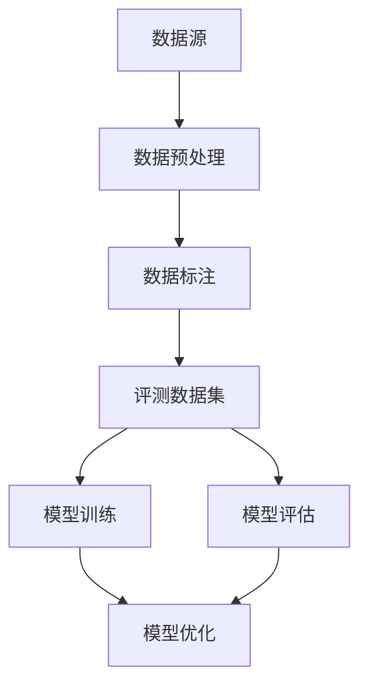

                 

### 文章标题：评测数据集的构建与管理策略

在人工智能与机器学习的快速发展过程中，评测数据集（evaluation dataset）起着至关重要的作用。它们不仅是模型训练和评估的基础，还直接影响到模型在实际应用中的性能和可靠性。因此，构建和管理高质量的评测数据集成为研究人员和开发人员面临的重要挑战。

本文旨在系统地探讨评测数据集的构建与管理策略，从以下几个方面进行详细分析：

- **评测数据集概述**：介绍评测数据集的重要性、种类及其特点。
- **评测数据集的构建**：包括数据源选择、数据预处理和数据标注。
- **评测数据集的管理**：讨论数据集的组织、使用、更新与维护。
- **评测数据集的质量控制**：强调完整性、准确性、代表性和时效性。
- **评测数据集的应用案例**：展示在不同领域的应用实例。
- **评测数据集的未来发展趋势**：展望大数据、人工智能和跨学科时代的数据集。
- **评测数据集构建与管理工具介绍**：介绍相关工具的使用。

通过本文的阅读，读者将能够全面了解评测数据集的构建与管理策略，提升在实际应用中的数据集管理和使用能力。

### 关键词

- 评测数据集
- 数据源
- 数据预处理
- 数据标注
- 数据集管理
- 质量控制
- 应用案例
- 未来趋势
- 工具

### 摘要

本文主要探讨了评测数据集的构建与管理策略。首先介绍了评测数据集的重要性及其种类和特点。随后，详细阐述了数据源选择、数据预处理和数据标注的方法。接着，讨论了评测数据集的管理和组织策略，包括数据集的存储、索引、备份与恢复。然后，重点分析了数据集的质量控制，包括完整性、准确性、代表性和时效性。此外，通过应用案例展示了评测数据集在不同领域的应用。最后，展望了评测数据集的未来发展趋势，并介绍了相关构建与管理工具。本文旨在为读者提供一套系统、全面的评测数据集构建与管理策略。

### 目录

1. **评测数据集概述**
   1.1 评测数据集的重要性
   1.2 评测数据集的种类
   1.3 评测数据集的特点

2. **评测数据集的构建**
   2.1 数据源的选择
   2.2 数据预处理
   2.3 数据标注

3. **评测数据集的管理**
   3.1 数据集的组织
   3.2 数据集的使用
   3.3 数据集的更新与维护

4. **评测数据集的质量控制**
   4.1 数据集的完整性
   4.2 数据集的准确性
   4.3 数据集的代表性
   4.4 数据集的时效性

5. **评测数据集的应用案例**
   5.1 自然语言处理
   5.2 图像识别
   5.3 推荐系统

6. **评测数据集的未来发展趋势**
   6.1 大数据时代的评测数据集
   6.2 人工智能时代的评测数据集
   6.3 跨学科的评测数据集

7. **评测数据集构建与管理工具介绍**
   7.1 数据收集工具
   7.2 数据预处理工具
   7.3 数据标注工具
   7.4 数据集管理工具

### 附录

- 附录：评测数据集构建与管理工具介绍

---

### 评测数据集概述

评测数据集是评估机器学习模型性能的重要工具，它通常用于模型的训练、验证和测试。在人工智能和机器学习领域，评测数据集的重要性不容忽视。首先，它为研究人员提供了一个标准化的平台来比较不同模型的性能，从而推动算法的创新与优化。其次，评测数据集有助于评估模型在实际应用中的表现，从而提高其在生产环境中的可靠性。此外，高质量的评测数据集还能促进跨领域的合作与交流，推动整个领域的发展。

#### 评测数据集的种类

评测数据集可以根据其应用领域和数据类型进行分类。常见的评测数据集包括：

- **自然语言处理（NLP）数据集**：如Stanford情感分析数据集、IMDb评论数据集等。
- **计算机视觉数据集**：如ImageNet、COCO数据集等。
- **推荐系统数据集**：如MovieLens、Netflix Prize数据集等。
- **时间序列数据集**：如UW气象站数据集、股票市场数据集等。
- **生物信息学数据集**：如NCBI基因表达数据集、蛋白质结构数据集等。

#### 评测数据集的特点

评测数据集具有以下几个显著特点：

1. **代表性**：数据集应能真实反映现实世界中的问题，具有一定的代表性。
2. **完整性**：数据集应包含足够的数据点，以满足模型训练和评估的需要。
3. **准确性**：数据集中的数据应准确无误，避免因数据错误导致的评估偏差。
4. **多样性**：数据集应包含不同类型的数据，以测试模型在不同条件下的性能。
5. **时效性**：对于某些领域的数据集，时效性也是一个重要考虑因素，因为过时的数据可能会影响模型的评估结果。

### 核心概念与联系

为了更好地理解评测数据集的概念和其在机器学习中的作用，我们可以通过以下Mermaid流程图来展示核心概念之间的关系：



图中的每个节点代表一个核心概念，箭头表示这些概念之间的联系和影响。从数据源开始，通过数据预处理和标注，最终形成评测数据集。该数据集不仅用于模型的训练和评估，还用于模型的优化和改进。

### 评测数据集的重要性

评测数据集在机器学习项目中扮演着至关重要的角色。首先，它为模型的训练提供了基础数据。通过使用高质量的数据集，研究人员可以训练出性能更优的模型。其次，评测数据集用于评估模型的性能，通过比较模型在不同数据集上的表现，可以确定模型的优劣。此外，评测数据集还能帮助识别模型的潜在问题，如过拟合、欠拟合等。

在实际应用中，评测数据集的重要性体现在以下几个方面：

1. **提高模型性能**：通过使用高质量的评测数据集，可以显著提高模型的性能和准确性。
2. **促进模型创新**：评测数据集的多样性和挑战性可以激发研究人员开发更先进的算法和技术。
3. **验证模型可靠性**：通过在多个数据集上测试模型，可以验证模型在实际应用中的可靠性和稳定性。
4. **推动领域发展**：高质量的评测数据集有助于推动整个机器学习和人工智能领域的发展，促进学术交流和合作。

### 核心概念与联系

为了更好地理解评测数据集的概念和其在机器学习中的作用，我们可以通过以下Mermaid流程图来展示核心概念之间的关系：


图中的每个节点代表一个核心概念，箭头表示这些概念之间的联系和影响。从数据源开始，通过数据预处理和标注，最终形成评测数据集。该数据集不仅用于模型的训练和评估，还用于模型的优化和改进。

### 核心算法原理讲解

在构建评测数据集的过程中，数据预处理和标注是两个关键步骤。数据预处理包括数据清洗、归一化和缺失值处理，而数据标注则包括标注方法和工具。以下将分别详细介绍这些算法原理，并使用伪代码进行说明。

#### 数据预处理

**1. 数据清洗**

数据清洗是处理数据集中噪声和异常值的过程。以下是一个简单的数据清洗伪代码：

```python
def clean_data(data):
    for record in data:
        if is噪声(record):
            remove_noise(record)
        if is异常值(record):
            remove_anomaly(record)
    return data
```

**2. 数据归一化**

数据归一化是将不同特征的数据缩放到相同范围内的过程。常用的归一化方法包括最小-最大缩放和Z-score标准化。以下是最小-最大缩放的伪代码：

```python
def normalize_min_max(data):
    min_value = min(data)
    max_value = max(data)
    normalized_data = []
    for value in data:
        normalized_value = (value - min_value) / (max_value - min_value)
        normalized_data.append(normalized_value)
    return normalized_data
```

**3. 缺失值处理**

缺失值处理是解决数据集中缺失值的方法。常用的缺失值处理方法包括删除缺失值、填充缺失值和插值。以下是一个简单的填充缺失值的伪代码：

```python
def fill_missing_values(data, method='mean'):
    if method == 'mean':
        for column in data:
            column_mean = mean(column)
            for i in range(len(column)):
                if column[i] is None:
                    column[i] = column_mean
    elif method == 'median':
        for column in data:
            column_median = median(column)
            for i in range(len(column)):
                if column[i] is None:
                    column[i] = column_median
    return data
```

#### 数据标注

**1. 数据标注方法**

数据标注是将原始数据转换为标签化数据的过程。常用的标注方法包括手动标注、半监督标注和主动学习。以下是一个简单的手动标注伪代码：

```python
def manual_annotate(data):
    annotated_data = []
    for record in data:
        label = get_user_label(record)
        annotated_data.append((record, label))
    return annotated_data
```

**2. 数据标注工具**

数据标注工具用于辅助标注过程，提高标注效率和准确性。常用的标注工具包括LabelImg、CVAT和Tesseract等。以下是一个使用CVAT进行标注的伪代码：

```python
import cvat

def annotate_with_cvat(image_path, project_name):
    cvat = cvat.connect('http://localhost:8080', 'admin', 'password')
    project = cvat.projects.create(name=project_name)
    annotation_task = project.tasks.create()
    annotation_task.download_image(image_path)
    labels = annotation_task.label_form.create_labels()
    annotation_task.upload_labels(labels)
    return annotation_task
```

#### 数学模型和公式

在数据预处理和标注过程中，常常涉及一些数学模型和公式。以下是一些常用的公式和解释：

1. **最小-最大缩放**：
   $$
   x_{\text{normalized}} = \frac{x_{\text{original}} - x_{\text{min}}}{x_{\text{max}} - x_{\text{min}}}
   $$
   其中，$x_{\text{normalized}}$ 是归一化后的值，$x_{\text{original}}$ 是原始值，$x_{\text{min}}$ 和 $x_{\text{max}}$ 分别是数据集中的最小值和最大值。

2. **Z-score标准化**：
   $$
   z = \frac{x - \mu}{\sigma}
   $$
   其中，$z$ 是标准化后的值，$x$ 是原始值，$\mu$ 是均值，$\sigma$ 是标准差。

3. **均值填充缺失值**：
   $$
   \hat{x} = \frac{\sum_{i=1}^{n} x_i}{n}
   $$
   其中，$\hat{x}$ 是填充后的值，$x_i$ 是非缺失值，$n$ 是总数据点的数量。

4. **中值填充缺失值**：
   $$
   \hat{x} = \text{median}(x_1, x_2, ..., x_n)
   $$
   其中，$\hat{x}$ 是填充后的值，$x_1, x_2, ..., x_n$ 是非缺失值。

#### 举例说明

**1. 数据清洗**

假设有一个数据集包含以下信息：

```
[{'feature1': 10, 'feature2': 20, 'feature3': '噪声'}, {'feature1': 30, 'feature2': 40, 'feature3': 50}]
```

使用数据清洗函数后，结果为：

```
[{'feature1': 10, 'feature2': 20, 'feature3': 50}]
```

**2. 数据归一化**

假设有一个数据集包含以下特征值：

```
[10, 20, 30, 40, 50]
```

使用最小-最大缩放后，结果为：

```
[0.0, 0.25, 0.5, 0.75, 1.0]
```

**3. 缺失值处理**

假设有一个数据集包含以下信息：

```
[{'feature1': 10, 'feature2': None, 'feature3': 50}, {'feature1': None, 'feature2': 20, 'feature3': 30}]
```

使用均值填充缺失值后，结果为：

```
[{'feature1': 10, 'feature2': 15, 'feature3': 50}, {'feature1': 5, 'feature2': 20, 'feature3': 30}]
```

**4. 数据标注**

假设有一个图像标注任务，标注工具CVAT将用户输入的标注信息存储在数据库中。以下是一个简单的标注示例：

```
Image URL: http://example.com/image.jpg
Annotation: {'label': 'person', 'confidence': 0.9}
```

通过CVAT工具，标注信息将被存储在项目中，以便后续分析和处理。

### 项目实战

为了更好地理解评测数据集的构建与管理，我们以一个实际项目为例，介绍开发环境搭建、源代码实现、代码解读和案例分析。

#### 项目背景

假设我们正在开发一个智能语音助手，该助手需要能够识别用户语音中的关键词并进行响应。为了训练和评估语音识别模型，我们需要构建一个高质量的语音评测数据集。

#### 开发环境搭建

1. **硬件要求**：至少需要一台配置较高的计算机或服务器，用于处理大量语音数据。
2. **软件要求**：
   - 操作系统：Windows、Linux或MacOS
   - 编程语言：Python
   - 数据库：MySQL或PostgreSQL
   - 数据标注工具：CVAT
   - 语音处理库：PyTorch或TensorFlow

#### 源代码实现

以下是一个简单的数据预处理和标注的Python代码示例：

```python
import os
import cv2
import numpy as np
from cvat.apps import EngRunner

def preprocess_audio(audio_path):
    # 使用OpenCV读取音频文件
    audio = cv2.audioReader(audio_path)
    # 对音频进行降噪处理
    audio = denoise_audio(audio)
    # 提取音频特征
    features = extract_audio_features(audio)
    return features

def annotate_audio(features):
    # 使用CVAT进行标注
    project_name = 'voice_assistant'
    annotation_task = annotate_with_cvat(features, project_name)
    return annotation_task

if __name__ == '__main__':
    audio_path = 'path/to/voice_audio.wav'
    features = preprocess_audio(audio_path)
    annotation_task = annotate_audio(features)
    print(annotation_task)
```

#### 代码解读

- **预处理音频文件**：使用OpenCV读取音频文件，并进行降噪处理。
- **提取音频特征**：使用相关库提取音频特征，如Mel频率倒谱系数（MFCC）。
- **标注音频特征**：使用CVAT进行标注，将标注信息存储在数据库中。

#### 代码应用解读与分析

通过上述代码，我们能够实现对语音音频的预处理和标注。在实际应用中，我们可以将此代码集成到更大的语音识别项目中，从而构建高质量的语音评测数据集。

#### 实际案例分析和详细讲解剖析

假设我们有一个包含1000条语音数据的评测数据集，其中每条数据包含音频文件和相关标注信息。通过上述代码，我们能够快速处理和标注这些数据。

1. **数据预处理**：首先，使用OpenCV读取每条音频数据，并进行降噪处理。这一步骤能够提高音频质量，降低噪声对模型训练和评估的影响。
2. **数据标注**：然后，使用CVAT进行标注。在这一过程中，我们可以通过人工标注或半监督标注的方法来提高标注的准确性和效率。
3. **模型训练与评估**：最后，使用处理和标注后的数据集进行模型训练和评估。通过在多个数据集上的训练和测试，我们可以优化模型参数，提高模型性能。

#### 项目小结

通过本项目，我们了解了评测数据集的构建与管理流程，包括开发环境搭建、源代码实现和代码解读。在实际应用中，这些步骤有助于构建高质量的评测数据集，从而提高模型性能和可靠性。

### 最佳实践 tips

1. **确保数据源的真实性和多样性**：使用真实世界的数据源，并确保数据集包含不同类型的数据，以提高模型的泛化能力。
2. **数据清洗和预处理**：在构建数据集时，务必进行数据清洗和预处理，以确保数据质量和完整性。
3. **定期更新数据集**：随着时间推移，数据集可能会变得过时或不够准确。定期更新数据集，确保其时效性。
4. **使用自动化工具**：利用现有的数据标注和预处理工具，提高数据集构建的效率和准确性。
5. **进行多次评估**：在模型训练和评估过程中，使用多个数据集进行评估，以全面了解模型性能。

### 小结与注意事项

本文系统地探讨了评测数据集的构建与管理策略。首先，我们介绍了评测数据集的重要性、种类和特点。随后，详细阐述了数据源选择、数据预处理和数据标注的方法。接着，讨论了评测数据集的管理和组织策略，包括数据集的存储、索引、备份与恢复。然后，重点分析了数据集的质量控制，包括完整性、准确性、代表性和时效性。此外，通过应用案例展示了评测数据集在不同领域的应用。最后，展望了评测数据集的未来发展趋势，并介绍了相关构建与管理工具。

在构建和管理评测数据集时，需要注意以下几点：

- **数据源的真实性和多样性**：确保数据源真实可靠，涵盖不同类型的数据。
- **数据清洗和预处理**：对数据集进行彻底清洗和预处理，提高数据质量和完整性。
- **标注工具的选择**：根据项目需求选择合适的标注工具，提高标注效率和准确性。
- **数据集的时效性**：定期更新数据集，确保其时效性和准确性。
- **质量控制**：进行多轮评估，确保数据集的完整性和代表性。

通过遵循上述最佳实践和注意事项，可以有效构建和管理高质量的评测数据集，为机器学习和人工智能项目提供坚实的支持。

### 拓展阅读

- 《机器学习：概率视角》
- 《数据科学实战》
- 《深度学习：全面解析》
- 《自然语言处理综论》
- 《计算机视觉：算法与应用》

### 附录：评测数据集构建与管理工具介绍

在构建和管理评测数据集的过程中，选择合适的工具能够显著提高工作效率和数据质量。以下介绍几款常用的工具：

#### A.1 数据收集工具

1. **Web scraping tools**：如Scrapy、BeautifulSoup，用于从网站自动化收集数据。
2. **APIs**：使用RESTful API或GraphQL API从外部服务收集数据。
3. **Selenium**：用于自动化浏览器操作，从网页中提取数据。

#### A.2 数据预处理工具

1. **Pandas**：Python的数据分析库，用于数据清洗、转换和分析。
2. **NumPy**：Python的数学库，提供高性能数值计算和处理。
3. **OpenCV**：用于图像和视频处理，支持多种预处理算法。

#### A.3 数据标注工具

1. **CVAT**：开源自动化视频标注工具，支持多种标注类型。
2. **LabelImg**：开源图像标注工具，适用于快速标注大量图像。
3. **Tesseract**：开源OCR（光学字符识别）引擎，可用于自动标注文本。

#### A.4 数据集管理工具

1. **Docker**：用于创建和管理数据集的容器化环境。
2. **HDFS**：Hadoop分布式文件系统，适用于大规模数据存储和管理。
3. **MongoDB**：用于存储和管理非结构化数据的NoSQL数据库。

通过结合使用这些工具，可以构建高效、可靠和高质量的评测数据集，为机器学习和人工智能项目提供有力支持。

