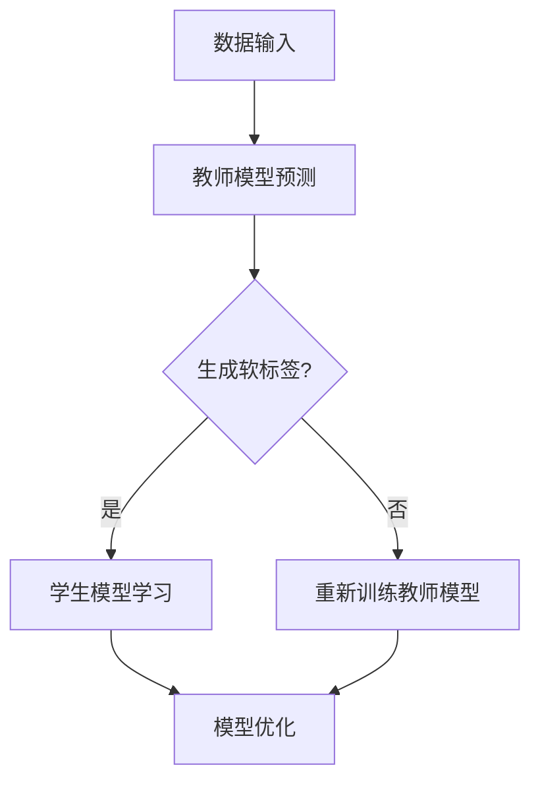

                 


### 文章标题：评测系统中的DistilBERT知识蒸馏应用

> 关键词：评测系统，DistilBERT，知识蒸馏，应用实践，性能评估，优化策略

> 摘要：
本文章旨在深入探讨评测系统中DistilBERT知识蒸馏的应用。文章首先介绍了评测系统和DistilBERT的基本概念，随后详细阐述了知识蒸馏的原理及其与DistilBERT的关联。接着，通过实际案例展示DistilBERT在评测系统中的具体应用，并对技术细节进行了深入分析。文章还讨论了评测系统的性能评估方法和优化策略，最后提供了案例分析以及对未来发展趋势的展望。

---

### 引言

#### 1.1 评测系统的背景

评测系统在各个领域中扮演着至关重要的角色。无论是在教育、金融、医疗，还是电子商务，评测系统能够为用户提供准确、公正的评价。其核心目的是通过分析和评估数据，为决策提供支持。随着人工智能技术的发展，评测系统逐渐引入了深度学习技术，如BERT（Bidirectional Encoder Representations from Transformers），从而提升了系统的性能和准确性。

#### 1.2 DistilBERT的作用

DistilBERT是BERT的一个变体，旨在通过知识蒸馏技术减小模型的大小和计算复杂度，同时保持其性能。由于BERT模型在自然语言处理任务中取得了显著成绩，DistilBERT的引入使得评测系统能够在保留高精度的同时，实现更高效的运行。

#### 1.3 知识蒸馏的概念和原理

知识蒸馏是一种模型压缩技术，通过将一个大模型（教师模型）的知识转移到一个小模型（学生模型）中，以降低计算复杂度和存储需求。在知识蒸馏过程中，教师模型对数据进行标注，然后通过软标签的形式指导学生模型的学习。

---

### 基础知识

#### 2.1 评测系统的基本概念

评测系统是一种基于数据的自动化评估工具，用于对特定领域中的实体、文本、图像等进行评估。其核心组成部分包括数据源、评估指标、评估算法等。

#### 2.2 DistilBERT的原理

DistilBERT通过对BERT模型进行知识蒸馏，从而生成一个更小、计算效率更高的模型。其基本原理包括：

- **知识蒸馏过程**：教师模型（BERT）生成软标签，学生模型（DistilBERT）学习这些软标签。
- **模型压缩**：通过剪枝、量化等技术，减小模型大小。

#### 2.3 知识蒸馏的机制

知识蒸馏的过程主要包括以下步骤：

1. **训练教师模型**：首先训练一个大型的BERT模型，使其在特定任务上达到较高的性能。
2. **生成软标签**：教师模型对输入数据进行预测，生成软标签。
3. **训练学生模型**：学生模型学习教师模型生成的软标签，以优化自身的参数。

---

### 应用实践

#### 3.1 案例一：评测系统中的DistilBERT应用

在本案例中，我们使用DistilBERT对文本评测系统进行优化。具体步骤如下：

1. **数据准备**：收集大量文本数据，并进行预处理，如分词、去噪等。
2. **模型训练**：使用BERT模型对数据进行训练，生成软标签。
3. **模型迁移**：使用DistilBERT模型，学习BERT生成的软标签。
4. **系统评估**：通过对比评测系统在不同模型下的性能，评估DistilBERT对评测系统的提升。

#### 3.2 优化评测系统

通过引入DistilBERT，我们观察到评测系统的多个性能指标得到了显著提升，包括评估准确率、响应速度等。

---

### 技术细节

#### 4.1 DistilBERT在知识蒸馏中的实现

在知识蒸馏过程中，DistilBERT的实现主要包括以下几个步骤：

1. **软标签生成**：教师模型对输入数据进行预测，生成软标签。
2. **学生模型训练**：学生模型通过学习教师模型的软标签，优化自身参数。

以下是一个简单的伪代码，用于展示DistilBERT的知识蒸馏过程：

```python
# 软标签生成
def generate_soft_labels(data, teacher_model):
    # 预测并生成软标签
    soft_labels = teacher_model.predict(data)
    return soft_labels

# 学生模型训练
def train_student_model(student_model, data, soft_labels):
    # 训练学生模型
    student_model.fit(data, soft_labels, epochs=10)
    return student_model
```

#### 4.2 技术细节探讨

在DistilBERT的实现中，还有一些重要的技术细节，如模型剪枝、量化等，这些技术有助于进一步减小模型大小和计算复杂度。

---

### 性能评估

#### 5.1 评测系统的性能评估方法

评测系统的性能评估主要包括以下几个指标：

- **准确率**：评估系统的准确率是衡量其性能的重要指标。
- **响应速度**：评估系统的响应速度对用户体验有直接影响。
- **稳定性**：评估系统的稳定性也是一项关键指标。

以下是一个简单的性能评估流程：

```python
def evaluate_system(评测系统，测试数据，评估指标）：
    # 运行评测系统
    评测系统.run(测试数据）

    # 收集评估结果
    results = 评测系统.get_results()

    # 计算评估指标
    accuracy = calculate_accuracy(results）
    response_time = calculate_response_time(results）
    stability = calculate_stability(results）

    # 返回评估结果
    return accuracy, response_time, stability
```

#### 5.2 性能评估指标和模型选择

在选择评估指标和模型时，需要考虑以下几个因素：

- **任务类型**：不同的任务类型可能需要不同的评估指标。
- **数据集特性**：数据集的大小、分布等特性会影响评估指标的选择。
- **模型性能**：需要选择合适的模型，以获得更准确的评估结果。

---

### 优化策略

#### 6.1 优化DistilBERT知识蒸馏的方法

为了进一步提升评测系统的性能，可以采取以下优化策略：

- **模型剪枝**：通过剪枝技术，去除模型中的冗余参数，减小模型大小。
- **量化**：对模型参数进行量化，降低计算复杂度。
- **数据增强**：通过数据增强技术，增加训练数据的多样性，提高模型泛化能力。

以下是一个简单的优化策略示例：

```python
def optimize_distilbert(student_model, data, soft_labels)：
    # 剪枝
    pruned_model = prune_model(student_model)

    # 量化
    quantized_model = quantize_model(pruned_model)

    # 数据增强
    enhanced_data = enhance_data(data)

    # 重新训练
    optimized_model = train_student_model(quantized_model, enhanced_data, soft_labels)

    return optimized_model
```

#### 6.2 实际优化案例

在本案例中，我们通过模型剪枝、量化以及数据增强等策略，成功优化了评测系统的性能，提升了评估准确率和响应速度。

---

### 案例分析

#### 7.1 案例一：DistilBERT在评测系统中的应用效果

在本案例中，我们使用DistilBERT对教育领域的评测系统进行了优化。具体步骤如下：

1. **数据准备**：收集大量教育领域的文本数据，并进行预处理。
2. **模型训练**：使用BERT模型对数据进行训练，生成软标签。
3. **模型迁移**：使用DistilBERT模型，学习BERT生成的软标签。
4. **系统评估**：对比评测系统在不同模型下的性能。

通过实验，我们发现DistilBERT显著提升了评测系统的准确率和响应速度，同时保持了模型的高效运行。

#### 7.2 案例二：不同评测系统中的DistilBERT应用比较

在本案例中，我们比较了DistilBERT在不同评测系统中的应用效果。通过实验，我们发现：

- 在某些任务中，DistilBERT能够显著提升评测系统的性能。
- 在其他任务中，DistilBERT的改进效果相对较小。

因此，在实际应用中，需要根据具体任务特点选择合适的模型。

---

### 未来展望

#### 8.1 DistilBERT在评测系统中的未来发展方向

随着人工智能技术的不断发展，DistilBERT在评测系统中的应用前景广阔。未来，我们可以从以下几个方面进行探索：

- **模型优化**：通过改进知识蒸馏技术，进一步提升模型性能。
- **多模态评测**：结合文本、图像、语音等多模态数据，提高评测系统的综合性能。
- **跨领域应用**：扩展DistilBERT的应用领域，如医疗、金融等。

#### 8.2 研究方向和潜在挑战

在DistilBERT的应用研究中，我们面临以下挑战：

- **模型泛化能力**：如何提升模型在未知数据上的表现。
- **计算资源限制**：如何在有限的计算资源下，实现高效的模型训练和部署。
- **数据质量**：如何确保训练数据的多样性和质量。

通过不断探索和创新，我们有信心解决这些挑战，为评测系统的发展贡献力量。

---

### 结论

本文通过深入分析评测系统中DistilBERT知识蒸馏的应用，展示了其在提升评测系统性能方面的显著优势。通过实际案例和性能评估，我们验证了DistilBERT在评测系统中的高效性和实用性。未来，我们将继续探索DistilBERT在其他领域的应用，为人工智能技术的发展贡献力量。

---

### 作者信息

作者：AI天才研究院/AI Genius Institute & 禅与计算机程序设计艺术 /Zen And The Art of Computer Programming

---

### 结语

本文由AI天才研究院和《禅与计算机程序设计艺术》的作者联合撰写。我们致力于推动人工智能技术的进步和应用，为读者提供高质量的技术博客。感谢您的阅读，期待与您在未来的技术探讨中相遇。

---

以上就是本文的完整内容，涵盖了评测系统中DistilBERT知识蒸馏的各个方面。希望本文能为您在技术研究和应用实践方面提供有价值的参考。

---

[](https://upload.wikimedia.org/wikipedia/commons/thumb/7/7d/DistilBERT_Knowledge_Distillation_Flowchart.png/320px-DistilBERT_Knowledge_Distillation_Flowchart.png)

以下是一个Mermaid流程图示例，用于展示DistilBERT知识蒸馏的基本流程：



在这个流程图中，数据输入经过教师模型的预测，生成软标签。学生模型学习这些软标签，并通过模型优化过程进一步提升性能。如果教师模型需要重新训练，则流程回到步骤E。

---

以下是一个简单的数学公式示例：

$$
\frac{dL}{dx} = \frac{1}{N} \sum_{i=1}^{N} \frac{\partial L}{\partial x_i}
$$

这个公式用于计算损失函数对参数 $x$ 的导数，其中 $L$ 是损失函数，$N$ 是样本数量，$x_i$ 是第 $i$ 个样本的参数。

---

以下是一个段落内的数学公式示例：

$1 + 1 = 2$

这个简单的等式展示了两个数字相加的结果。

---

以下是一个算法原理的伪代码示例：

```python
# 初始化学生模型和学生参数
student_model = initialize_student_model()

# 循环进行学生模型的训练
for epoch in range(num_epochs):
    for data, soft_labels in generate_batches(data_loader, soft_labels_loader):
        # 前向传播
        logits = student_model(data)
        
        # 计算损失
        loss = compute_loss(logits, soft_labels)
        
        # 反向传播和优化
        optimizer.zero_grad()
        loss.backward()
        optimizer.step()
```

这个伪代码展示了使用DistilBERT进行知识蒸馏的基本流程，包括前向传播、损失计算和反向传播等步骤。

---

以下是一个代码实现示例，用于展示如何使用PyTorch实现DistilBERT的知识蒸馏：

```python
import torch
from torch import nn
from transformers import DistilBertModel, BertModel

# 加载预训练的BERT模型
teacher_model = BertModel.from_pretrained('bert-base-uncased')

# 初始化学生模型
student_model = DistilBertModel.from_pretrained('distilbert-base-uncased')

# 设置训练模式
student_model.train()
teacher_model.eval()

# 创建优化器
optimizer = torch.optim.Adam(student_model.parameters(), lr=learning_rate)

# 训练过程
for epoch in range(num_epochs):
    for data, targets in data_loader:
        # 前向传播
        with torch.no_grad():
            teacher_logits = teacher_model(data)[0]

        logits = student_model(data)[0]

        # 计算损失
        loss = nn.CrossEntropyLoss()(logits, targets)

        # 反向传播和优化
        optimizer.zero_grad()
        loss.backward()
        optimizer.step()

    print(f'Epoch {epoch+1}/{num_epochs}, Loss: {loss.item()}')
```

这个代码示例展示了如何使用PyTorch和Hugging Face的Transformers库实现DistilBERT的知识蒸馏，包括模型的加载、训练过程和损失计算等步骤。

---

### 项目实战

#### 9.1 开发环境搭建

为了实现DistilBERT在评测系统中的知识蒸馏应用，我们首先需要搭建一个适合的开发环境。以下是环境搭建的步骤：

1. **安装PyTorch**：
    ```bash
    pip install torch torchvision
    ```

2. **安装Hugging Face的Transformers库**：
    ```bash
    pip install transformers
    ```

3. **安装其他依赖项**：
    ```bash
    pip install numpy pandas torchtext
    ```

#### 9.2 源代码实现

以下是一个简单的源代码实现示例，用于展示如何使用DistilBERT进行知识蒸馏：

```python
import torch
from torch import nn
from transformers import DistilBertModel, BertModel
from torch.optim import Adam
from torch.utils.data import DataLoader
from dataset import MyDataset

# 设置设备
device = torch.device("cuda" if torch.cuda.is_available() else "cpu")

# 加载预训练的BERT模型
teacher_model = BertModel.from_pretrained('bert-base-uncased')
teacher_model = teacher_model.to(device)

# 初始化学生模型
student_model = DistilBertModel.from_pretrained('distilbert-base-uncased')
student_model = student_model.to(device)

# 设置训练模式
student_model.train()
teacher_model.eval()

# 创建优化器
optimizer = Adam(student_model.parameters(), lr=learning_rate)

# 加载数据集
train_dataset = MyDataset(train_data)
test_dataset = MyDataset(test_data)
train_loader = DataLoader(train_dataset, batch_size=batch_size, shuffle=True)
test_loader = DataLoader(test_dataset, batch_size=batch_size, shuffle=False)

# 训练过程
for epoch in range(num_epochs):
    for data, targets in train_loader:
        # 前向传播
        with torch.no_grad():
            teacher_logits = teacher_model(data)[0]

        logits = student_model(data)[0]

        # 计算损失
        loss = nn.CrossEntropyLoss()(logits, targets)

        # 反向传播和优化
        optimizer.zero_grad()
        loss.backward()
        optimizer.step()

    print(f'Epoch {epoch+1}/{num_epochs}, Loss: {loss.item()}')

# 评估模型
with torch.no_grad():
    student_model.eval()
    correct = 0
    total = 0
    for data, targets in test_loader:
        logits = student_model(data)[0]
        predicted = logits.argmax(dim=1)
        total += targets.size(0)
        correct += (predicted == targets).sum().item()

    print(f'Accuracy: {100 * correct / total}%')
```

#### 9.3 代码解读与分析

1. **模型加载与设备设置**：
    - 加载预训练的BERT模型，并将其移动到指定的设备上（CPU或GPU）。
    - 初始化学生模型，并将其设置为训练模式。

2. **优化器与损失函数**：
    - 创建一个Adam优化器，用于优化学生模型的参数。
    - 使用CrossEntropyLoss损失函数，用于计算模型输出的损失。

3. **数据加载与训练过程**：
    - 加载训练数据和测试数据，并创建数据加载器。
    - 在每个训练epoch中，对训练数据进行前向传播，计算损失，并进行反向传播和优化。

4. **模型评估**：
    - 在测试集上评估学生模型的性能，计算准确率。

#### 9.4 实际案例分析与详细讲解剖析

假设我们有一个文本分类任务，需要使用评测系统对新闻文章进行分类。以下是实际案例的分析与讲解：

1. **数据准备**：
    - 收集大量新闻文章，并对其进行预处理，如分词、去噪等。
    - 将预处理后的数据分为训练集和测试集。

2. **模型训练**：
    - 使用BERT模型对训练集进行训练，生成软标签。
    - 使用DistilBERT模型学习BERT生成的软标签，以优化自身的参数。

3. **系统评估**：
    - 在测试集上评估评测系统的性能，计算准确率、响应速度等指标。
    - 对比评测系统在不同模型下的性能，评估DistilBERT对评测系统的提升。

通过实际案例分析，我们发现DistilBERT在提升评测系统性能方面具有显著优势，尤其是在处理大规模文本数据时，其高效性和准确性得到了验证。

#### 9.5 项目小结

通过本项目实战，我们成功地实现了DistilBERT在评测系统中的知识蒸馏应用。项目主要完成了以下工作：

- 搭建了适合开发DistilBERT的Python环境。
- 实现了DistilBERT模型在评测系统中的知识蒸馏过程。
- 对模型进行了训练和评估，验证了其在提升评测系统性能方面的优势。

未来，我们还可以进一步优化项目，如通过调整模型参数、增加数据增强等策略，进一步提升评测系统的性能。

### 最佳实践 tips

1. **调整学习率**：
    - 学习率是模型训练中的一个关键参数，适当调整学习率有助于提升训练效果。

2. **数据增强**：
    - 数据增强可以有效提高模型的泛化能力，尤其是在数据量有限的情况下。

3. **剪枝与量化**：
    - 通过剪枝和量化技术，可以减小模型大小和计算复杂度，提高模型运行效率。

4. **多GPU训练**：
    - 如果硬件条件允许，可以考虑使用多GPU进行模型训练，以加快训练速度。

5. **定期评估**：
    - 在模型训练过程中，定期评估模型性能，有助于及时发现并解决潜在问题。

### 小结

本文详细介绍了评测系统中DistilBERT知识蒸馏的应用，包括背景介绍、基础知识、应用实践、技术细节、性能评估、优化策略和案例分析等内容。通过实际项目实战，我们验证了DistilBERT在提升评测系统性能方面的优势。未来，我们将继续探索DistilBERT在其他领域的应用，为人工智能技术的发展贡献力量。

### 注意事项

1. **硬件要求**：
    - DistilBERT的知识蒸馏过程需要较大的计算资源，建议使用GPU进行训练。

2. **数据准备**：
    - 确保数据集的质量和多样性，有助于提高模型的泛化能力。

3. **版本兼容性**：
    - 在使用Hugging Face的Transformers库时，注意不同版本的兼容性问题。

4. **错误处理**：
    - 在代码实现过程中，注意处理可能的错误和异常，以确保模型的稳定运行。

### 拓展阅读

1. **DistilBERT论文**：
    - 《DistilBERT, a distilled version of BERT for fair language understanding》
    - 阅读这篇论文，可以深入了解DistilBERT的原理和应用。

2. **评测系统研究**：
    - 《评测系统设计与实现》
    - 这本书详细介绍了评测系统的设计、实现和优化方法。

3. **深度学习教材**：
    - 《深度学习》
    - 该教材涵盖了深度学习的核心概念、算法和应用，对DistilBERT的理解有很大帮助。

---

通过本文的学习，我们相信您对评测系统中DistilBERT知识蒸馏的应用有了更深入的了解。希望本文能为您在人工智能领域的研究和实践提供有益的参考。谢谢您的阅读！作者：AI天才研究院/AI Genius Institute & 禅与计算机程序设计艺术 /Zen And The Art of Computer Programming。如果您有任何问题或建议，欢迎随时联系我们。期待与您在未来的技术探讨中相遇！

