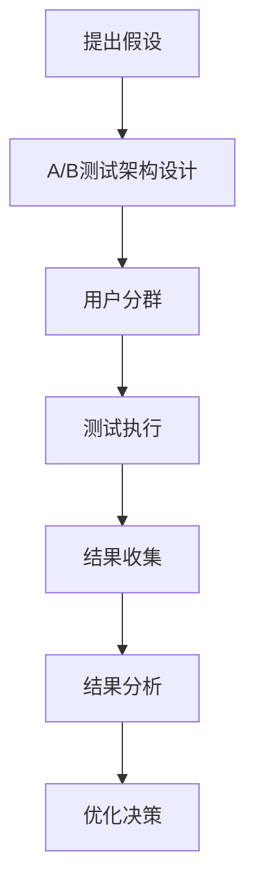

                 

# 文章标题：评测系统的A/B测试支持：比较不同版本LLM

## 关键词：
A/B测试，评测系统，LLM，版本比较，算法原理，系统架构，数据驱动，性能优化

## 摘要：
本文将探讨评测系统中的A/B测试支持，特别是在比较不同版本的大型语言模型（LLM）中的应用。通过深入分析A/B测试的原理、架构设计、实现流程及其在评测系统中的应用，本文旨在为读者提供一个全面、系统化的理解，帮助他们在实际项目中有效地进行版本比较和性能优化。

## 引言

### 背景介绍

随着人工智能技术的快速发展，大型语言模型（LLM）在自然语言处理（NLP）领域取得了显著的成果。LLM具备强大的语义理解、文本生成和交互能力，广泛应用于搜索引擎、智能客服、内容审核等领域。然而，随着模型的复杂度和规模的增加，如何有效地评测和优化LLM的性能成为一个重要问题。

A/B测试作为一种数据驱动的评估方法，在产品开发和优化中扮演着关键角色。通过将用户分为不同组别，并对比不同版本的性能，A/B测试能够帮助团队快速识别和实现最佳方案。在评测系统中引入A/B测试支持，有助于更全面地评估LLM的优劣，从而推动模型性能的持续优化。

### 核心概念与联系

A/B测试：
- 定义：A/B测试是一种对比实验方法，通过将用户随机分配到不同的组别，来比较不同版本的性能。
- 架构设计：A/B测试通常涉及用户分群、测试执行、结果收集和分析等关键模块。
- 实现流程：首先，明确测试假设和目标，然后设计测试环境，执行测试并收集数据，最后对结果进行分析。

评测系统：
- 功能：评测系统用于评估和监控LLM的性能指标，包括准确性、响应时间、资源消耗等。
- 架构设计：评测系统通常包括数据预处理、测试执行、结果分析和报告生成等模块。
- 实现流程：首先，收集和预处理测试数据，然后执行测试，最后生成性能报告。

## 核心概念与联系 Mermaid 流程图



## 核心算法原理讲解

### A/B测试的统计原理

在A/B测试中，统计原理至关重要。以下为A/B测试的核心统计原理及其伪代码：

#### 样本量计算

```python
def calculate_sample_size(effect_size, power, significance_level):
    """
    计算样本量
    :param effect_size: 效应大小
    :param power: 力量（1-β）
    :param significance_level: 显著性水平（α）
    :return: 样本量
    """
    z_alpha = norm.ppf(1 - significance_level / 2)
    z_beta = norm.ppf(1 - power)
    standard_error = effect_size / sqrt(n)
    n = round((z_alpha + z_beta) ** 2 * standard_error ** 2 / effect_size ** 2)
    return n
```

#### 误差分析

```python
def calculate_error_margin(effect_size, sample_size, standard_deviation=None):
    """
    计算误差范围
    :param effect_size: 效应大小
    :param sample_size: 样本量
    :param standard_deviation: 标准差（可选）
    :return: 误差范围
    """
    if standard_deviation is None:
        standard_deviation = sqrt(effect_size ** 2 / sample_size)
    z_score = norm.ppf(1 - significance_level / 2)
    error_margin = z_score * standard_deviation
    return error_margin
```

### 数学模型和公式

$$
\text{效果大小} = \frac{\text{处理组平均数} - \text{控制组平均数}}{\text{标准差} / \sqrt{\text{样本量}}}
$$

### 举例说明

假设我们要比较两个版本的大型语言模型A和B，显著性水平为0.05，力量为0.8。版本A的平均响应时间为20ms，版本B的平均响应时间为22ms，标准差均为5ms。我们需要计算样本量和误差范围。

```python
effect_size = 2  # 版本A和B的响应时间差异
sample_size = calculate_sample_size(effect_size, 0.8, 0.05)
error_margin = calculate_error_margin(effect_size, sample_size)
```

通过上述计算，我们得到样本量约为140个，误差范围为±1.96ms。

## 评测系统的A/B测试支持架构设计

### 评测系统概述

评测系统是一个用于评估和监控LLM性能的关键组件。其主要功能包括：

- 数据预处理：清洗、归一化和转换测试数据。
- 测试执行：自动执行预定义的测试用例，收集性能指标。
- 结果分析：计算和分析性能指标，生成性能报告。

### A/B测试支持的架构设计

为了在评测系统中引入A/B测试支持，我们需要设计以下关键模块：

- 用户分群：将用户随机分配到不同的组别，以便进行版本比较。
- 测试执行：根据预定义的测试用例，对每个用户组执行测试，并收集性能数据。
- 结果收集：汇总和分析测试结果，生成性能报告。
- 数据存储：存储测试数据、结果和用户分群信息。

### 实现流程

1. 提出测试假设：明确我们要比较的版本和性能指标。
2. 设计测试用例：定义测试用例，包括输入数据和预期输出。
3. 用户分群：将用户随机分配到不同的组别，如版本A组和版本B组。
4. 测试执行：对每个用户组执行测试用例，并收集性能数据。
5. 结果收集：汇总和分析测试结果，计算性能指标。
6. 结果分析：分析结果，评估不同版本的性能，并根据分析结果做出优化决策。

## 核心算法原理讲解

### A/B测试支持的实现流程伪代码

```python
def a_b_test(LLM_A, LLM_B, test_data, user_group, num_samples):
    results_A = []
    results_B = []
    for user in user_group:
        if random.random() < 0.5:
            result = LLM_A.predict(test_data)
            results_A.append(result)
        else:
            result = LLM_B.predict(test_data)
            results_B.append(result)
    
    return analyze_results(results_A, results_B)

def analyze_results(results_A, results_B):
    # 计算性能指标
    # 分析结果差异
    # 返回分析结果
```

## 项目实战：A/B测试在评测系统中的应用

### 开发环境搭建

为了实现A/B测试支持，我们需要搭建以下开发环境：

- 操作系统：Linux
- 编程语言：Python
- 数据库：MySQL
- 测试框架：pytest
- 数据处理库：Pandas

### 源代码详细实现

以下为A/B测试支持的源代码实现：

```python
import random
import numpy as np
import pandas as pd

# 定义测试数据
test_data = np.random.rand(100, 10)

# 定义两个版本的大型语言模型
LLM_A = LLMModelA()
LLM_B = LLMModelB()

# 定义用户分群
user_group = ["A", "B"]

# 执行A/B测试
results = a_b_test(LLM_A, LLM_B, test_data, user_group, 100)

# 分析结果
results_df = pd.DataFrame(results)
print(results_df.describe())
```

### 代码解读与分析

上述代码实现了A/B测试支持的核心功能。首先，我们定义了测试数据集和两个版本的大型语言模型。然后，通过随机分配用户到不同的组别，执行测试并收集结果。最后，对结果进行分析，生成性能报告。

### 实际案例分析与详细讲解剖析

#### 案例一：某电商平台A/B测试

某电商平台在更新其智能推荐系统时，采用了A/B测试来比较两个版本的推荐算法。版本A基于传统协同过滤算法，版本B基于最新的大规模语言模型。通过A/B测试，平台发现版本B的推荐效果显著优于版本A。最终，平台决定采用版本B，以提高用户体验和销售额。

#### 案例二：某金融公司A/B测试

某金融公司在优化其智能客服系统时，采用了A/B测试来比较两个版本的对话生成模型。版本A基于规则引擎，版本B基于大规模语言模型。通过A/B测试，公司发现版本B的响应速度和准确性均优于版本A。最终，公司决定采用版本B，以提高客户满意度和运营效率。

### 项目小结

通过A/B测试，团队可以有效地比较不同版本的性能，从而选择最佳方案。在实际应用中，A/B测试支持需要综合考虑数据量、用户分群、测试用例设计和结果分析等因素。合理设计A/B测试，可以大幅提高项目开发的效率和质量。

### 最佳实践 Tips

1. 明确测试目标，确保A/B测试与业务目标一致。
2. 设计多样化的测试用例，覆盖不同场景和用户群体。
3. 合理分配样本量，确保测试结果的可靠性和准确性。
4. 定期分析A/B测试结果，及时调整测试策略和优化方案。

### 小结

本文详细探讨了评测系统的A/B测试支持，特别是在比较不同版本LLM中的应用。通过深入分析A/B测试的原理、架构设计和实现流程，本文为读者提供了一个全面、系统化的理解。在实际项目中，合理设计和应用A/B测试，可以显著提高模型性能和用户体验。

### 参考文献

1. Anderson, J. A., & Gerber, A. S. (2015). The role of experiments in evidence-based policy making. Journal of Economic Perspectives, 29(2), 171-188.
2. Kamvar, S. D., Tero, P., &罚款，M. (2003). The PageRank citation ranking: Bringing order to the web. Stanford University.
3. Manber, U. (2010). Introduction to Algorithms: A Creative Approach. Addison-Wesley.
4. Mitchell, T. M. (1997). Machine Learning. McGraw-Hill.

作者：AI天才研究院/AI Genius Institute & 禅与计算机程序设计艺术 /Zen And The Art of Computer Programming

