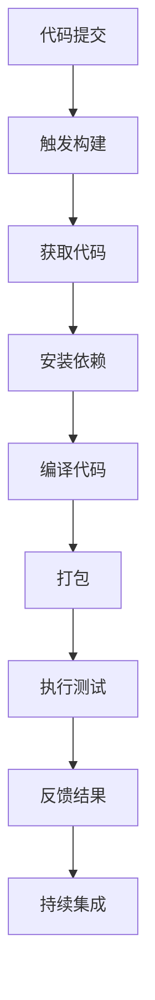
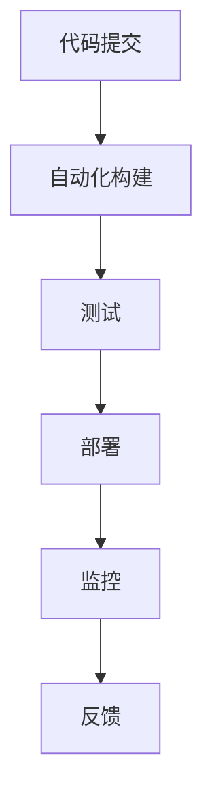

                 


### 摘要

本文将深入探讨评测系统的CI/CD流水线设计，旨在帮助开发者更好地理解和实践持续集成与持续交付的概念。我们将首先介绍CI/CD的基础知识，包括其定义、核心价值、历史发展及其与传统开发模式的对比。接着，本文将详细解析CI和CD的原理与实践，涵盖CI的工作流程、CD的工作流程，以及相关工具的介绍和实践案例。随后，我们将探讨评测系统的构建，从需求分析、架构设计到功能模块，确保读者能够全面了解评测系统的实现过程。进一步，我们将聚焦于CI/CD流水线设计最佳实践，提供流水线设计原则、流程以及案例研究。最后，本文将介绍常见CI/CD工具与平台，并进行实际案例分析与实战演练，以帮助读者将理论知识应用到实际项目中。通过本文的阅读，开发者将能够构建高效、可靠的评测系统CI/CD流水线，提升软件开发质量和效率。

### 关键词

- 持续集成（CI）
- 持续交付（CD）
- 流水线设计
- 评测系统
- 开发效率
- 自动化测试
- 工具与平台

---

**评测系统的CI/CD流水线设计**

摘要：

本文将深入探讨评测系统的CI/CD流水线设计，旨在帮助开发者更好地理解和实践持续集成与持续交付的概念。我们将首先介绍CI/CD的基础知识，包括其定义、核心价值、历史发展及其与传统开发模式的对比。接着，本文将详细解析CI和CD的原理与实践，涵盖CI的工作流程、CD的工作流程，以及相关工具的介绍和实践案例。随后，我们将探讨评测系统的构建，从需求分析、架构设计到功能模块，确保读者能够全面了解评测系统的实现过程。进一步，我们将聚焦于CI/CD流水线设计最佳实践，提供流水线设计原则、流程以及案例研究。最后，本文将介绍常见CI/CD工具与平台，并进行实际案例分析与实战演练，以帮助读者将理论知识应用到实际项目中。通过本文的阅读，开发者将能够构建高效、可靠的评测系统CI/CD流水线，提升软件开发质量和效率。

### 第一部分：CI/CD基础

持续集成（CI）和持续交付（CD）是现代软件开发中不可或缺的两个实践。它们不仅提高了软件开发的效率，还显著提升了软件的质量和稳定性。本部分将首先介绍CI/CD的基础知识，包括其定义、核心价值、历史发展及其与传统开发模式的对比。

#### 1.1 什么是CI/CD

持续集成（Continuous Integration，CI）是指在一个软件项目开发过程中，通过自动化构建和测试，确保代码的持续整合和验证。这一过程通常由自动化工具执行，当开发者提交代码时，CI系统会自动进行一系列的测试，以确保新代码不会破坏现有的功能。

持续交付（Continuous Delivery，CD）是CI的进一步延伸，它确保软件可以随时发布到生产环境。CD不仅仅是自动化测试，还包括自动化部署、环境配置、监控等环节。CD的目标是确保软件在任何时候都是可发布状态，并能够在实际环境中可靠运行。

#### 1.2 CI/CD的核心价值

CI/CD具有以下核心价值：

1. **快速反馈**：通过自动化测试和构建，开发者可以快速发现代码中的问题，从而减少修复时间。
2. **提高质量**：频繁的集成和测试有助于发现和修复缺陷，提升软件质量。
3. **增强协作**：CI/CD鼓励团队协作，因为每个开发者都知道他们的更改会立即集成和测试。
4. **减少风险**：由于CD确保软件在任何时候都是可发布的，因此减少了发布时的风险。
5. **提高效率**：自动化流程减少了手动工作，从而提高了开发效率。

#### 1.3 CI/CD的历史与发展

CI/CD的概念最早可以追溯到2000年初。当时，敏捷开发方法的兴起推动了CI/CD的普及。CI的概念由Jez Humble和Dave Farley在其著作《持续交付：发布可靠软件的系统化方法》中进行了详细阐述。随后，随着自动化工具和云服务的兴起，CD的概念逐渐成熟。

2006年，GitHub的成立极大地推动了CI/CD的实践。通过其强大的版本控制系统，开发者可以轻松地实施CI。随后，Jenkins、GitLab CI、GitHub Actions等自动化工具的出现，使得CI/CD变得更加普及和易用。

#### 1.4 CI/CD的主要挑战

尽管CI/CD具有许多优势，但在实践中也面临一些挑战：

1. **工具选择**：市场上存在许多CI/CD工具，选择合适的工具是一个挑战。
2. **初始设置**：CI/CD系统的初始设置和配置通常较为复杂，需要一定的技术基础。
3. **测试覆盖**：确保测试覆盖所有可能的用例和场景是一个挑战。
4. **环境一致性**：确保不同环境（开发、测试、生产）的一致性是一个挑战。
5. **文化和流程**：CI/CD的实践需要改变开发文化和工作流程，这可能面临团队抵抗。

#### 1.5 CI/CD与传统开发模式的对比

传统开发模式通常涉及以下环节：

1. **阶段性开发**：开发过程分为多个阶段，如需求分析、设计、编码、测试、部署等。
2. **手动测试**：测试通常在开发阶段完成后进行，由测试团队手动执行。
3. **阶段性交付**：软件通常在一定时间间隔后进行交付。

相比之下，CI/CD具有以下特点：

1. **持续开发**：开发是一个持续过程，没有固定的阶段。
2. **自动化测试**：测试是自动化的，可以在每次提交时执行。
3. **频繁交付**：软件可以随时交付，无需等待特定时间点。

通过CI/CD，开发者可以更快地响应变更，提高软件质量，并缩短上市时间。下一部分，我们将详细探讨CI和CD的原理与实践。

---

**第一部分：CI/CD基础**

**第2章：持续集成（CI）原理与实践**

## 2.1 CI的基本原理

持续集成（CI）是一种软件开发实践，旨在通过自动化构建和测试，确保代码的持续整合和验证。CI的核心思想是尽早发现问题，以便开发者能够快速修复。以下是CI的基本原理：

1. **自动化构建**：每次代码提交时，CI系统会自动构建项目，确保代码的完整性。
2. **自动化测试**：构建完成后，CI系统会自动运行一系列测试，包括单元测试、集成测试、性能测试等，以验证代码的正确性和稳定性。
3. **快速反馈**：测试结果会立即反馈给开发者，帮助他们了解代码更改的影响。
4. **持续集成**：通过频繁的集成和测试，确保代码库中的每个提交都是稳定的。

CI的基本原理可以用以下步骤概括：

1. **代码提交**：开发者将代码提交到版本控制系统。
2. **触发构建**：CI系统检测到代码提交，触发构建过程。
3. **执行构建**：CI系统构建项目，包括编译代码、安装依赖等。
4. **执行测试**：构建完成后，CI系统运行测试，包括单元测试、集成测试、性能测试等。
5. **反馈结果**：测试结果会立即反馈给开发者，包括通过、失败、警告等信息。
6. **持续集成**：通过CI系统，开发者可以持续集成代码，确保代码库的稳定性。

#### 2.1.1 CI的核心要素

CI的核心要素包括：

1. **版本控制系统**：如Git，用于管理代码的版本和控制提交。
2. **自动化构建工具**：如Jenkins、GitLab CI、GitHub Actions，用于自动构建和测试项目。
3. **测试框架**：如JUnit、pytest，用于编写和执行测试用例。
4. **代码库**：存储项目代码和依赖的仓库。
5. **持续集成服务器**：如Jenkins、GitLab CI、GitHub Actions，用于触发构建和执行测试。

#### 2.1.2 CI的优势

CI具有以下优势：

1. **快速反馈**：通过自动化测试，开发者可以快速发现代码中的问题，并立即修复。
2. **提高质量**：频繁的集成和测试有助于发现和修复缺陷，提高软件质量。
3. **增强协作**：CI鼓励团队协作，因为每个开发者都知道他们的更改会立即集成和测试。
4. **减少风险**：通过持续的集成和测试，确保代码库中的每个提交都是稳定的，减少了发布时的风险。

#### 2.1.3 CI的挑战

尽管CI具有许多优势，但在实践中也面临一些挑战：

1. **测试覆盖**：确保测试覆盖所有可能的用例和场景是一个挑战。
2. **环境一致性**：确保不同环境（开发、测试、生产）的一致性是一个挑战。
3. **初始设置**：CI系统的初始设置和配置通常较为复杂，需要一定的技术基础。
4. **文化和流程**：CI的实践需要改变开发文化和工作流程，这可能面临团队抵抗。

#### 2.1.4 CI的实践案例

以下是一个简单的CI实践案例：

1. **代码提交**：开发者A将一个新功能提交到Git仓库。
2. **触发构建**：Jenkins检测到代码提交，开始构建项目。
3. **执行构建**：Jenkins编译代码、安装依赖，构建成功。
4. **执行测试**：Jenkins运行单元测试、集成测试，测试通过。
5. **反馈结果**：Jenkins将测试结果发送到开发者的邮件，告知其构建成功和测试通过。
6. **持续集成**：开发者B可以在Jenkins上看到最新提交的构建结果，确认代码稳定性。

通过这个案例，我们可以看到CI是如何通过自动化构建和测试，确保代码的持续整合和验证的。下一节，我们将进一步探讨CI的工作流程。

---

**第一部分：CI/CD基础**

**第2章：持续集成（CI）原理与实践**

## 2.2 CI的工作流程

持续集成（CI）的工作流程是确保代码库中的每个提交都是稳定和可测试的核心机制。一个典型的CI工作流程通常包括以下几个主要步骤：

### 2.2.1 提交代码

首先，开发者将代码提交到版本控制系统（如Git）。每次提交都代表了一个新的功能或修复。提交可以是手动执行，也可以是自动化执行，例如通过CI工具自动触发。

### 2.2.2 触发构建

一旦代码提交到版本控制系统，CI工具就会检测到这一变更。根据配置，CI工具可以立即触发构建过程，也可以在特定时间或条件满足时触发构建。

### 2.2.3 构建项目

构建过程包括以下步骤：

1. **获取代码**：CI工具从版本控制系统获取最新的代码。
2. **安装依赖**：CI工具安装项目所需的依赖库和工具。
3. **编译代码**：CI工具编译项目代码，生成可执行文件或库文件。
4. **打包**：CI工具将编译结果打包成可部署的格式，如JAR文件、Docker镜像等。

### 2.2.4 执行测试

构建完成后，CI工具会执行一系列的测试：

1. **单元测试**：验证单个模块的功能和逻辑。
2. **集成测试**：验证模块之间的交互和集成。
3. **性能测试**：评估系统的响应时间和资源消耗。

测试可以是手动编写的，也可以是自动化测试框架生成的。

### 2.2.5 反馈结果

测试结果会立即反馈给开发者。反馈可以是邮件、Slack消息、Webhook通知等形式。通过这些反馈，开发者可以快速了解代码更改的影响，并采取相应的行动。

### 2.2.6 持续集成

如果构建和测试都通过，代码将被合并到主分支。这样，每次提交都会确保代码库的稳定性。如果发现任何问题，CI工具会阻止合并，直到问题被解决。

#### 2.2.7 CI工作流程的Mermaid流程图

为了更清晰地展示CI的工作流程，我们可以使用Mermaid流程图来描述：



这个流程图展示了CI从代码提交到反馈结果的整个过程，每个步骤都紧密相连，确保代码的持续整合和验证。

#### 2.2.8 CI的优势与挑战

CI的优势包括：

1. **快速反馈**：通过自动化测试，开发者可以立即获得反馈，缩短问题发现和修复的时间。
2. **提高质量**：频繁的测试和集成有助于发现和修复缺陷，提高软件质量。
3. **增强协作**：CI鼓励团队协作，因为每个开发者的更改都会立即集成和测试。

然而，CI也面临一些挑战：

1. **测试覆盖**：确保测试覆盖所有可能的用例和场景是一个挑战。
2. **环境一致性**：确保不同环境（如开发、测试、生产）的一致性是另一大挑战。
3. **初始设置**：CI系统的设置和配置通常较为复杂，需要一定的技术基础。
4. **文化和流程**：CI的实践需要改变开发文化和工作流程，这可能面临团队抵抗。

#### 2.2.9 CI的最佳实践

为了充分发挥CI的优势，以下是一些最佳实践：

1. **自动化测试**：确保所有测试都是自动化的，减少手动测试的工作量。
2. **持续反馈**：确保测试结果及时反馈给开发者，以便他们可以快速采取行动。
3. **代码分支策略**：使用合适的代码分支策略，如Git Flow或GitHub Flow，确保代码库的整洁和稳定。
4. **持续学习和改进**：定期评估CI流程的有效性，并根据反馈进行调整。

通过遵循这些最佳实践，开发者可以构建一个高效、可靠的CI系统，提高软件开发的效率和质量。

### 2.3 CI工具介绍

市场上存在许多CI工具，每种工具都有其独特的特点和优势。以下将介绍几种常用的CI工具：

#### 2.3.1 Jenkins

Jenkins是最流行的开源CI工具之一。它支持多种操作系统，包括Linux、Windows和macOS。Jenkins具有以下特点：

1. **易用性**：Jenkins提供了丰富的插件系统，支持多种编程语言和测试框架。
2. **灵活性**：Jenkins允许开发者自定义构建过程，实现复杂的构建和测试流程。
3. **社区支持**：Jenkins拥有庞大的社区，提供了大量的文档和教程。

Jenkins的基本工作流程如下：

1. **配置Jenkins**：安装Jenkins并配置其基础设置。
2. **创建Job**：在Jenkins中创建一个Job，用于构建和测试项目。
3. **配置构建脚本**：编写构建脚本，定义构建过程和测试用例。
4. **触发构建**：手动或自动触发构建。
5. **查看结果**：在Jenkins界面查看构建结果和测试反馈。

#### 2.3.2 GitLab CI

GitLab CI是GitLab的一部分，它是一个基于Git版本控制系统的CI工具。GitLab CI具有以下特点：

1. **集成性**：GitLab CI与GitLab紧密集成，支持GitLab的Flow工作流程。
2. **配置简单**：GitLab CI的配置直接在Git仓库的`.gitlab-ci.yml`文件中定义，简单直观。
3. **可扩展性**：GitLab CI支持自定义脚本和工具，可以轻松扩展其功能。

GitLab CI的基本工作流程如下：

1. **配置`.gitlab-ci.yml`**：在Git仓库的根目录下创建`.gitlab-ci.yml`文件，定义构建和测试过程。
2. **提交代码**：将代码提交到GitLab仓库。
3. **触发构建**：GitLab CI自动检测到代码提交并开始构建。
4. **执行测试**：GitLab CI运行测试用例。
5. **反馈结果**：构建结果和测试反馈通过GitLab界面展示。

#### 2.3.3 GitHub Actions

GitHub Actions是GitHub提供的CI/CD平台，支持多种编程语言和操作系统。GitHub Actions具有以下特点：

1. **集成性**：GitHub Actions与GitHub紧密集成，支持GitHub的工作流程。
2. **灵活性**：GitHub Actions支持自定义操作和工作流，可以构建复杂的CI/CD流水线。
3. **自动化**：GitHub Actions提供了丰富的自动化操作，如部署、测试、代码质量检查等。

GitHub Actions的基本工作流程如下：

1. **配置`.github/workflows`**：在仓库的`.github/workflows`目录下创建YAML文件，定义构建和测试过程。
2. **触发构建**：GitHub Actions自动检测到代码提交或特定事件（如Push、Pull Request等）并开始构建。
3. **执行测试**：GitHub Actions运行测试用例。
4. **反馈结果**：构建结果和测试反馈通过GitHub界面展示。

通过以上三种CI工具的介绍，我们可以看到每种工具都有其独特的优势和适用场景。开发者可以根据项目需求选择合适的CI工具，构建高效、可靠的CI系统。

---

**第一部分：CI/CD基础**

**第3章：持续交付（CD）原理与实践**

## 3.1 CD的基本原理

持续交付（Continuous Delivery，CD）是持续集成（CI）的自然延伸，它确保软件可以随时发布到生产环境。CD不仅仅是自动化构建和测试，还包括了自动化部署、环境配置、监控等环节。CD的目标是确保软件在任何时候都是可发布状态，并能够在实际环境中可靠运行。

### 3.1.1 CD的工作流程

CD的工作流程通常包括以下几个步骤：

1. **自动化构建**：与CI相同，CD首先需要进行自动化构建，生成可部署的软件包。
2. **测试**：构建完成后，CD系统会执行一系列测试，包括功能测试、性能测试、安全测试等，以确保软件的质量。
3. **部署**：测试通过后，CD系统会自动将软件部署到预生产环境或生产环境。
4. **监控**：部署完成后，CD系统会持续监控软件的运行状态，确保其稳定性和性能。
5. **反馈**：如果出现任何问题，CD系统会立即反馈给开发团队，以便快速响应和修复。

### 3.1.2 CD的核心要素

CD的核心要素包括：

1. **自动化部署**：通过脚本或工具，自动部署软件到不同的环境。
2. **环境配置**：确保每个环境的配置一致，包括数据库、服务器等。
3. **自动化测试**：确保在部署前，软件经过全面的测试，确保其质量。
4. **持续监控**：持续监控软件的运行状态，确保其稳定性和性能。
5. **反馈机制**：快速识别和响应问题，确保问题得到及时解决。

### 3.1.3 CD的优势

CD具有以下优势：

1. **快速发布**：由于所有步骤都是自动化的，CD可以显著缩短发布周期，提高发布频率。
2. **减少风险**：通过持续的测试和反馈，CD可以减少发布时的风险。
3. **提高质量**：自动化测试和质量检查有助于提高软件质量。
4. **增强可靠性**：通过持续监控，CD可以确保软件在运行时保持稳定。

### 3.1.4 CD的挑战

尽管CD具有许多优势，但在实践中也面临一些挑战：

1. **初始设置**：CD系统的初始设置和配置通常较为复杂，需要一定的技术基础。
2. **测试覆盖**：确保测试覆盖所有可能的用例和场景是一个挑战。
3. **环境一致性**：确保不同环境（开发、测试、生产）的一致性是一个挑战。

### 3.1.5 CD与传统发布模式的对比

传统发布模式通常涉及以下步骤：

1. **代码提交**：开发者将代码提交到版本控制系统。
2. **构建**：构建团队负责构建软件包。
3. **测试**：测试团队负责测试软件包。
4. **发布**：发布团队负责部署软件到生产环境。

相比之下，CD具有以下特点：

1. **自动化**：CD的所有步骤都是自动化的，无需人工干预。
2. **频繁发布**：CD支持频繁发布，无需等待特定时间点。
3. **持续测试**：CD在每次构建后都会进行测试，确保软件质量。

通过CD，开发者可以更快地响应变更，提高软件质量，并缩短上市时间。

### 3.2 CD的工作流程

为了更好地理解CD的工作流程，我们可以使用一个Mermaid流程图来描述：



这个流程图展示了CD从代码提交到反馈的整个过程，每个步骤都紧密相连，确保软件的持续交付和可靠运行。

### 3.3 CD工具介绍

市场上存在许多CD工具，每种工具都有其独特的特点和优势。以下将介绍几种常用的CD工具：

#### 3.3.1 Docker

Docker是一个开源的应用容器引擎，它允许开发者将应用程序及其依赖环境打包到一个可移植的容器中。Docker的主要优势包括：

1. **可移植性**：Docker容器可以在不同的环境中运行，确保环境一致性。
2. **隔离性**：每个容器都是独立的，确保应用程序之间的隔离。
3. **轻量级**：Docker容器比传统的虚拟机更轻量，可以提高资源利用率。

Docker的基本工作流程如下：

1. **编写Dockerfile**：定义应用程序的环境和依赖。
2. **构建Docker镜像**：使用Dockerfile构建镜像。
3. **运行Docker容器**：使用镜像启动容器。
4. **部署容器**：将容器部署到生产环境。

#### 3.3.2 Kubernetes

Kubernetes是一个开源的容器编排平台，它用于自动化容器的部署、扩展和管理。Kubernetes的主要优势包括：

1. **自动化**：Kubernetes可以自动化容器的部署和扩展。
2. **高可用性**：Kubernetes可以确保容器的高可用性，自动处理故障。
3. **可扩展性**：Kubernetes支持水平扩展，可以动态调整资源。

Kubernetes的基本工作流程如下：

1. **编写Kubernetes配置文件**：定义应用程序的部署和扩展策略。
2. **部署应用程序**：使用Kubernetes配置文件部署应用程序。
3. **监控和管理**：使用Kubernetes API监控和管理应用程序。
4. **自动化部署**：Kubernetes可以自动化部署应用程序的新版本。

#### 3.3.3 AWS EKS

AWS EKS（Elastic Kubernetes Service）是AWS提供的托管Kubernetes服务。AWS EKS的主要优势包括：

1. **托管服务**：AWS EKS完全托管，无需管理底层基础设施。
2. **高可用性**：AWS EKS提供自动扩展和故障转移功能。
3. **集成**：AWS EKS与AWS其他服务（如AWS Fargate、Amazon RDS等）紧密集成。

AWS EKS的基本工作流程如下：

1. **创建AWS EKS集群**：在AWS控制台创建EKS集群。
2. **部署应用程序**：使用Kubernetes配置文件部署应用程序到EKS集群。
3. **监控和管理**：使用AWS控制台和Kubernetes API监控和管理应用程序。
4. **自动化部署**：AWS EKS可以自动化部署应用程序的新版本。

通过以上三种CD工具的介绍，我们可以看到每种工具都有其独特的优势和适用场景。开发者可以根据项目需求选择合适的CD工具，构建高效、可靠的CD系统。

### 3.4 CD实践案例

为了更好地理解CD的实际应用，以下将介绍两个CD实践案例。

#### 3.4.1 案例一：电商平台

一个电商平台使用Docker和Kubernetes进行CD实践。首先，开发者使用Docker将应用程序及其依赖打包成容器镜像。然后，他们使用Kubernetes配置文件定义应用程序的部署和扩展策略。每次代码提交后，CI工具会自动构建容器镜像，并将其推送到容器注册库。随后，Kubernetes会自动部署这些镜像到生产环境，并确保容器的高可用性和可扩展性。

这种CD实践提高了软件的发布频率和可靠性，同时确保了不同环境之间的一致性。

#### 3.4.2 案例二：金融行业

一个金融行业公司使用AWS EKS进行CD实践。该公司将应用程序部署到AWS EKS集群，并使用AWS控制台和Kubernetes API进行监控和管理。每次代码提交后，CI工具会自动构建应用程序，并将其推送到容器注册库。AWS EKS会自动部署这些镜像到生产环境，并使用自动扩展和故障转移功能确保系统的稳定性。

这种CD实践使得公司能够快速响应市场变化，提高软件的发布频率和可靠性。

通过这两个实践案例，我们可以看到CD在实际应用中的优势。下一节，我们将进一步探讨CI/CD流水线设计最佳实践。

---

**第一部分：CI/CD基础**

**第4章：评测系统的构建**

## 4.1 评测系统的需求分析

构建一个高效的评测系统，首先要明确其需求。以下是评测系统的需求分析：

### 4.1.1 功能需求

1. **代码质量评测**：评估代码的质量，包括代码风格、复杂度、可读性等。
2. **自动化测试**：执行单元测试、集成测试和性能测试，确保代码的正确性和稳定性。
3. **性能评测**：评估系统的响应时间和资源消耗，确保系统在高负载下的性能。
4. **安全性评测**：检测代码中的安全漏洞，确保系统的安全性。
5. **报告生成**：生成详细的评测报告，包括代码质量、测试结果和性能数据。
6. **反馈机制**：提供即时反馈，帮助开发者快速识别和解决问题。

### 4.1.2 非功能需求

1. **可靠性**：确保评测系统能够稳定运行，不受外部因素影响。
2. **可扩展性**：系统应能够处理大量代码和测试任务，支持集群部署。
3. **易用性**：界面简洁，操作直观，方便用户使用。
4. **自动化程度**：尽可能实现自动化，减少人工干预，提高效率。

### 4.1.3 用户角色

1. **开发者**：负责编写代码和测试用例，查看评测结果和反馈。
2. **测试工程师**：负责编写和执行测试用例，评估系统性能和安全性。
3. **项目经理**：负责监控评测进度和结果，确保项目按计划进行。

### 4.1.4 需求分析流程

1. **需求收集**：通过与各角色进行访谈和问卷调查，收集需求。
2. **需求分析**：整理和分析收集到的需求，明确系统的功能和非功能需求。
3. **需求确认**：与用户角色和利益相关者确认需求的准确性和可行性。
4. **需求文档**：编写详细的系统需求文档，作为后续设计和开发的依据。

## 4.2 评测系统的架构设计

评测系统的架构设计是确保其功能性和性能的关键。以下是评测系统的架构设计：

### 4.2.1 系统架构概述

评测系统的架构可以分为以下几个主要模块：

1. **前端模块**：提供用户界面，用户可以通过前端模块提交代码、查看评测结果和报告。
2. **后端模块**：处理用户请求，执行评测任务，生成评测报告。
3. **测试模块**：执行自动化测试，包括单元测试、集成测试和性能测试。
4. **存储模块**：存储代码、测试结果和报告，支持数据查询和统计分析。
5. **监控模块**：实时监控评测系统的运行状态，确保系统的高可用性。

### 4.2.2 前端架构设计

前端架构设计主要包括以下部分：

1. **Web界面**：使用现代前端框架（如React、Vue）构建，提供用户友好的界面。
2. **API接口**：提供与后端模块的通信接口，支持HTTP/HTTPS协议。
3. **UI组件**：使用UI库（如Ant Design、Element UI）构建界面组件，提高开发效率和用户体验。

### 4.2.3 后端架构设计

后端架构设计主要包括以下部分：

1. **服务端**：使用Spring Boot等框架构建，处理用户请求，执行评测任务。
2. **微服务架构**：将评测系统拆分为多个微服务，每个微服务负责不同的功能，提高系统的可扩展性和可维护性。
3. **消息队列**：使用消息队列（如Kafka、RabbitMQ）处理异步任务，提高系统的并发能力。

### 4.2.4 测试模块设计

测试模块设计主要包括以下部分：

1. **测试框架**：使用JUnit、pytest等测试框架编写测试用例。
2. **测试工具**：使用JMeter、LoadRunner等工具进行性能测试。
3. **测试覆盖率**：使用JaCoCo、Coverage.py等工具计算测试覆盖率。

### 4.2.5 存储模块设计

存储模块设计主要包括以下部分：

1. **关系型数据库**：使用MySQL、PostgreSQL等关系型数据库存储用户信息、代码和测试结果。
2. **NoSQL数据库**：使用MongoDB、Redis等NoSQL数据库存储测试报告和日志。
3. **数据仓库**：使用数据仓库（如Hive、Redshift）进行数据分析和报表生成。

### 4.2.6 监控模块设计

监控模块设计主要包括以下部分：

1. **监控系统**：使用Prometheus、Grafana等工具实时监控评测系统的运行状态。
2. **日志管理**：使用ELK（Elasticsearch、Logstash、Kibana）进行日志收集和管理。
3. **报警机制**：使用Alertmanager、Opsgenie等工具设置报警规则，确保及时发现和响应问题。

通过以上架构设计，评测系统可以高效地执行代码质量评测、自动化测试、性能评测和安全性评测，并提供详细的数据分析和反馈。下一节，我们将详细介绍评测系统的功能模块。

---

**第一部分：CI/CD基础**

**第4章：评测系统的构建**

## 4.3 评测系统的功能模块

评测系统的功能模块是实现其核心功能的关键，以下是评测系统的功能模块详细描述：

### 4.3.1 代码质量评测

**代码质量评测**是评测系统的核心功能之一，它通过多种指标评估代码的质量。这些指标包括：

1. **代码复杂度**：评估代码的复杂性，如圈复杂度、模块复杂度等。
2. **代码风格**：检查代码是否符合编程规范和风格指南。
3. **可读性**：评估代码的可读性，如代码行数、注释率等。
4. **代码冗余**：检测代码中的冗余部分，如重复代码、死代码等。

**实现方式**：

- **静态代码分析**：使用工具（如SonarQube、Checkstyle）对代码进行分析，生成质量报告。
- **动态代码分析**：在代码运行时进行性能分析，捕获运行时错误和性能瓶颈。

**伪代码示例**：

```python
def code_quality_check(source_code):
    complexity = calculate_complexity(source_code)
    style_issues = check_code_style(source_code)
    readability = check_readability(source_code)
    redundancy = check_code_redundancy(source_code)
    return {
        "complexity": complexity,
        "style_issues": style_issues,
        "readability": readability,
        "redundancy": redundancy
    }
```

### 4.3.2 自动化测试

**自动化测试**是确保代码质量的重要手段，它通过编写测试用例自动化地执行测试。自动化测试包括：

1. **单元测试**：测试单个模块或函数的功能和逻辑。
2. **集成测试**：测试模块之间的交互和集成。
3. **性能测试**：评估系统的响应时间和资源消耗。

**实现方式**：

- **测试框架**：使用测试框架（如JUnit、pytest）编写测试用例。
- **测试执行**：在CI/CD流水线中自动执行测试用例。
- **测试报告**：生成详细的测试报告，包括通过率、失败原因等。

**伪代码示例**：

```python
def run_tests(test_cases):
    test_results = []
    for test_case in test_cases:
        result = test_case.run()
        test_results.append(result)
    return test_results
```

### 4.3.3 性能评测

**性能评测**是评估系统在高负载下的表现，它通过模拟实际负载进行测试。性能评测包括：

1. **响应时间**：评估系统的平均响应时间。
2. **吞吐量**：评估系统每秒处理的请求数量。
3. **资源消耗**：评估系统的CPU、内存、磁盘等资源消耗。

**实现方式**：

- **性能测试工具**：使用性能测试工具（如JMeter、LoadRunner）模拟负载。
- **性能指标**：收集和计算系统的性能指标。
- **性能优化**：根据测试结果进行性能优化。

**伪代码示例**：

```python
def performance_evaluation(test_tool, load_scenario):
    response_times = test_tool.run_load_scenario(load_scenario)
    throughput = calculate_throughput(response_times)
    resource_usage = test_tool.get_resource_usage()
    return {
        "response_times": response_times,
        "throughput": throughput,
        "resource_usage": resource_usage
    }
```

### 4.3.4 安全性评测

**安全性评测**是确保系统安全性的关键，它包括：

1. **代码审计**：审计代码中潜在的安全漏洞。
2. **依赖检查**：检查依赖库的安全性和版本问题。
3. **渗透测试**：模拟攻击者行为，发现系统中的安全漏洞。

**实现方式**：

- **安全工具**：使用安全工具（如OWASP ZAP、Snyk）进行代码审计和依赖检查。
- **渗透测试**：邀请专业的安全团队进行渗透测试。

**伪代码示例**：

```python
def security_evaluation(source_code, dependencies):
    vulnerabilities = check_code_vulnerabilities(source_code)
    dependency_issues = check_dependency_issues(dependencies)
    penetration_tests = perform_penetration_tests()
    return {
        "vulnerabilities": vulnerabilities,
        "dependency_issues": dependency_issues,
        "penetration_tests": penetration_tests
    }
```

### 4.3.5 报告生成

**报告生成**是评测系统的关键功能，它将评测结果和性能数据整理成易于理解的报告。报告包括：

1. **代码质量报告**：包括代码复杂度、代码风格、可读性等指标。
2. **测试报告**：包括测试覆盖率、通过率、失败原因等。
3. **性能报告**：包括响应时间、吞吐量、资源消耗等性能指标。
4. **安全报告**：包括代码漏洞、依赖问题、渗透测试结果等。

**实现方式**：

- **报告模板**：使用报告模板定义报告的结构和格式。
- **数据整合**：将评测结果整合到报告模板中，生成最终报告。

**伪代码示例**：

```python
def generate_report(code_quality_data, test_data, performance_data, security_data):
    report_template = load_report_template()
    report = {
        "code_quality": code_quality_data,
        "tests": test_data,
        "performance": performance_data,
        "security": security_data
    }
    return render_report(report_template, report)
```

通过以上功能模块的实现，评测系统可以全面评估代码质量、测试质量、性能和安全性，并提供详细的数据分析和反馈，帮助开发者持续改进代码和系统。

### 4.4 评测系统的实现

评测系统的实现是构建高效、可靠的评测流程的关键。以下是评测系统的具体实现步骤：

#### 4.4.1 开发环境搭建

首先，我们需要搭建开发环境，确保所有的开发工具和依赖库都安装和配置正确。以下是具体步骤：

1. **安装开发工具**：安装IDE（如IntelliJ IDEA、VS Code）、版本控制工具（如Git）和构建工具（如Maven、Gradle）。
2. **安装依赖库**：安装项目中所需的依赖库和框架，如Spring Boot、Hibernate等。
3. **配置环境变量**：配置环境变量，以便开发工具能够正确访问依赖库和框架。

#### 4.4.2 源代码管理

1. **初始化Git仓库**：在项目根目录下执行`git init`初始化Git仓库。
2. **提交代码**：开发者将代码提交到Git仓库，确保代码的版本控制和完整性。
3. **分支策略**：使用Git Flow或GitHub Flow等分支策略，确保代码库的整洁和一致性。

#### 4.4.3 CI/CD流程配置

1. **选择CI/CD工具**：根据项目需求选择合适的CI/CD工具，如Jenkins、GitLab CI或GitHub Actions。
2. **配置CI/CD流程**：编写CI/CD配置文件（如`.gitlab-ci.yml`或`.github/workflows/main.yml`），定义构建、测试和部署流程。
3. **触发构建**：配置CI/CD工具，使其在代码提交后自动触发构建和测试。

#### 4.4.4 自动化测试

1. **编写测试用例**：使用JUnit、pytest等测试框架编写测试用例，覆盖代码的各个部分。
2. **执行测试**：在CI/CD流水线中自动执行测试用例，确保代码的正确性和稳定性。
3. **测试报告**：生成详细的测试报告，包括通过率、失败原因等。

#### 4.4.5 评测系统部署

1. **容器化**：使用Docker将评测系统容器化，确保其可移植性和一致性。
2. **Kubernetes部署**：使用Kubernetes部署评测系统，确保其高可用性和可扩展性。
3. **监控与日志**：使用Prometheus、Grafana等工具监控评测系统的运行状态，使用ELK（Elasticsearch、Logstash、Kibana）收集和管理日志。

#### 4.4.6 数据分析与反馈

1. **收集评测数据**：从CI/CD流水线和评测系统中收集数据，包括代码质量、测试结果、性能数据等。
2. **生成报告**：使用报告模板和数据整合工具生成详细的评测报告。
3. **即时反馈**：将评测结果和报告通过邮件、Slack等渠道即时反馈给开发者。

通过以上步骤，我们可以构建一个高效、可靠的评测系统，确保代码质量、测试质量和系统性能，帮助开发者持续改进代码和系统。

---

**第一部分：CI/CD基础**

**第5章：CI/CD流水线设计最佳实践**

## 5.1 流水线设计原则

设计高效的CI/CD流水线是确保软件质量和发布速度的关键。以下是一些关键设计原则：

### 5.1.1 简化流程

流水线的设计应尽量简化，减少不必要的步骤和复杂性。这有助于降低出错风险，提高流程的可维护性。

### 5.1.2 自动化

流水线应高度自动化，以减少手动干预。自动化的构建、测试和部署过程可以显著提高效率，减少人工错误。

### 5.1.3 可扩展性

流水线设计应考虑未来的扩展需求，确保能够轻松添加新步骤或修改现有步骤，以适应项目变化。

### 5.1.4 监控与反馈

流水线应具备良好的监控和反馈机制，能够实时监控流水线的运行状态，并在出现问题时及时通知相关人员。

### 5.1.5 安全性

流水线设计应确保安全性，包括代码安全、数据安全和网络安全。实施安全策略和检查，以防止潜在的安全威胁。

### 5.1.6 易于维护

流水线设计应易于维护，包括清晰的文档、良好的代码结构和模块化设计，以便后续的维护和更新。

## 5.2 流水线设计流程

以下是设计CI/CD流水线的详细步骤：

### 5.2.1 需求分析

在开始设计之前，首先进行需求分析，明确项目的需求和目标。这包括：

1. **功能需求**：确定流水线需要执行的任务，如构建、测试、部署等。
2. **非功能需求**：考虑流水线的性能、可扩展性和安全性要求。
3. **用户角色**：明确用户角色和职责，如开发者、测试人员、运维人员等。

### 5.2.2 选择工具与平台

根据需求分析的结果，选择合适的CI/CD工具和平台。常见的工具有Jenkins、GitLab CI、GitHub Actions等，平台包括AWS CodePipeline、Azure DevOps等。选择时应考虑以下因素：

1. **易用性**：工具是否易于使用和配置。
2. **功能丰富性**：工具是否提供所需的功能。
3. **社区支持**：工具是否有丰富的文档和社区支持。

### 5.2.3 确定流水线步骤

确定流水线的步骤，包括：

1. **获取代码**：从版本控制系统获取最新的代码。
2. **构建**：编译和打包代码。
3. **测试**：执行单元测试、集成测试和性能测试。
4. **部署**：将软件部署到测试或生产环境。
5. **监控与反馈**：监控流水线运行状态，并在出现问题时通知相关人员。

### 5.2.4 编写配置文件

根据选定的工具和平台，编写CI/CD配置文件。常见的配置文件格式包括YAML、JSON等。配置文件应明确每个步骤的参数和依赖关系。

### 5.2.5 测试与优化

在流水线配置完成后，进行测试以确保其正确性和可靠性。测试过程中，可以模拟各种场景，如代码提交、测试失败等，检查流水线的响应和恢复能力。根据测试结果进行优化，解决任何问题。

### 5.2.6 持续改进

CI/CD流水线是一个持续改进的过程。定期评估流水线的性能和效率，根据反馈和项目需求进行优化和更新。

通过以上步骤，我们可以设计出一个高效、可靠、可扩展的CI/CD流水线，确保软件质量和发布速度。

### 5.3 流水线设计案例

#### 5.3.1 简单的CI/CD流水线设计

以下是一个简单的CI/CD流水线设计案例，使用GitLab CI进行配置。

**需求**：一个简单的Web应用程序，需要自动化构建、测试和部署。

**步骤**：

1. **获取代码**：每次代码提交后，GitLab CI会自动从Git仓库获取最新的代码。
2. **构建**：使用Maven构建项目，编译代码并打包成JAR文件。
3. **测试**：执行JUnit测试，确保代码的正确性。
4. **部署**：将构建好的JAR文件部署到测试服务器。

**配置文件**（.gitlab-ci.yml）：

```yaml
stages:
  - build
  - test
  - deploy

before_script:
  - mvn clean install

build:
  stage: build
  script:
    - mvn package
  artifacts:
    paths:
      - target/*.jar

test:
  stage: test
  script:
    - mvn test

deploy:
  stage: deploy
  script:
    - scp target/*.jar user@test-server:/var/app
  when: manual
```

**解释**：

- **stages**：定义流水线的阶段，包括构建（build）、测试（test）和部署（deploy）。
- **before_script**：在所有阶段之前执行的脚本，用于安装Maven。
- **build**：构建阶段，执行Maven命令进行编译和打包。
- **test**：测试阶段，执行JUnit测试。
- **deploy**：部署阶段，使用scp命令将JAR文件部署到测试服务器。

#### 5.3.2 复杂的CI/CD流水线设计

以下是一个复杂的CI/CD流水线设计案例，使用Jenkins进行配置。

**需求**：一个微服务架构的Web应用程序，需要自动化构建、测试、部署和管理。

**步骤**：

1. **获取代码**：每次代码提交后，Jenkins会自动从Git仓库获取最新的代码。
2. **构建**：构建每个微服务的Docker镜像。
3. **测试**：执行单元测试、集成测试和性能测试。
4. **部署**：将构建好的Docker镜像部署到Kubernetes集群。
5. **监控与反馈**：使用Prometheus和Grafana监控系统的运行状态，并在出现问题时通知相关人员。

**配置文件**（Jenkinsfile）：

```groovy
pipeline {
    agent any

    stages {
        stage('Build') {
            steps {
                shell 'docker build -t my-service:latest .'
            }
        }
        stage('Test') {
            steps {
                shell 'mvn test'
            }
        }
        stage('Deploy') {
            steps {
                script {
                    // 使用kubectl部署Docker镜像到Kubernetes集群
                }
            }
        }
        stage('Monitor') {
            steps {
                // 配置Prometheus和Grafana监控
            }
        }
    }
    post {
        always {
            // 发送反馈通知
        }
    }
}
```

**解释**：

- **agent**：指定执行流水线的代理。
- **stages**：定义流水线的阶段，包括构建（Build）、测试（Test）、部署（Deploy）和监控（Monitor）。
- **Build**：构建阶段，使用Docker构建镜像。
- **Test**：测试阶段，执行Maven测试。
- **Deploy**：部署阶段，使用kubectl部署Docker镜像到Kubernetes集群。
- **Monitor**：监控阶段，配置Prometheus和Grafana进行监控。
- **post**：流水线执行后的操作，包括发送反馈通知。

通过这两个案例，我们可以看到如何设计和实现不同复杂程度的CI/CD流水线。下一节，我们将介绍常见的CI/CD工具与平台。

---

**第一部分：CI/CD基础**

**第6章：CI/CD工具与平台介绍**

## 6.1 常用CI/CD工具汇总

### 6.1.1 Jenkins

Jenkins是一个开源的自动化服务器，用于实现持续集成和持续交付。Jenkins支持多种操作系统，包括Linux、Windows和macOS，并提供了一个丰富的插件系统，使其能够与各种工具和平台集成。

**特点**：

- **易用性**：Jenkins提供了友好的用户界面和丰富的插件，方便用户配置和管理流水线。
- **灵活性**：Jenkins允许用户自定义构建过程，支持多种编程语言和框架。
- **扩展性**：Jenkins具有强大的插件系统，可以轻松扩展其功能。

**适用场景**：

- **小到中型的项目**：对于小到中型的项目，Jenkins是一个理想的CI/CD工具。
- **多样化的项目**：由于Jenkins的插件丰富，它可以适应各种开发环境和技术栈。

### 6.1.2 GitLab CI

GitLab CI是GitLab的一部分，是一种基于Git版本控制系统的CI工具。GitLab CI的配置直接在`.gitlab-ci.yml`文件中定义，简单直观，支持多种编程语言和平台。

**特点**：

- **集成性**：GitLab CI与GitLab紧密集成，支持GitLab的Flow工作流程。
- **配置简单**：`.gitlab-ci.yml`文件的配置简单明了，易于理解和维护。
- **可扩展性**：GitLab CI支持自定义脚本和工具，可以轻松扩展其功能。

**适用场景**：

- **GitLab用户**：对于使用GitLab进行版本控制的团队，GitLab CI是一个理想的选择。
- **小型到大型项目**：GitLab CI适用于各种规模的项目，特别是那些需要快速迭代和频繁交付的项目。

### 6.1.3 GitHub Actions

GitHub Actions是GitHub提供的CI/CD平台，支持多种编程语言和操作系统。GitHub Actions的配置直接在`.github/workflows`目录下的YAML文件中定义，支持各种事件触发和操作。

**特点**：

- **集成性**：GitHub Actions与GitHub紧密集成，支持GitHub的工作流程。
- **自动化**：GitHub Actions提供了丰富的自动化操作，如部署、测试、代码质量检查等。
- **灵活性**：GitHub Actions支持自定义操作和工作流，可以构建复杂的CI/CD流水线。

**适用场景**：

- **GitHub用户**：对于使用GitHub进行版本控制的团队，GitHub Actions是一个理想的工具。
- **中小型项目**：由于GitHub Actions是免费的，它非常适合中小型项目。

### 6.1.4 Azure DevOps

Azure DevOps是微软提供的开发服务平台，包括版本控制、项目管理、测试和部署工具。Azure DevOps支持多种编程语言和平台，并提供了一个集成的环境，方便开发者进行CI/CD。

**特点**：

- **集成性**：Azure DevOps与Microsoft的工具和平台（如Visual Studio、Azure）紧密集成。
- **功能丰富**：Azure DevOps提供了丰富的功能，包括测试管理、自动化测试、部署等。
- **可扩展性**：Azure DevOps支持自定义流程和工具，可以适应各种开发需求。

**适用场景**：

- **企业级项目**：对于企业级项目，Azure DevOps提供了强大的功能和可靠的性能。
- **跨平台支持**：由于支持多种操作系统和平台，Azure DevOps适用于多种开发环境。

### 6.1.5 CircleCI

CircleCI是一个云原生的CI/CD平台，支持多种编程语言和框架。CircleCI提供了一个简单的用户界面，方便用户创建和管理流水线。

**特点**：

- **云原生**：CircleCI完全基于云，提供快速、可靠的CI/CD服务。
- **自动化**：CircleCI提供了丰富的自动化操作，支持各种部署和环境配置。
- **灵活性**：CircleCI允许用户自定义构建和测试过程，适应不同的开发需求。

**适用场景**：

- **中小型项目**：CircleCI适用于中小型项目，特别是那些需要快速迭代和交付的项目。
- **云原生应用**：对于云原生应用，CircleCI提供了强大的支持和优化。

通过以上介绍，我们可以看到每种CI/CD工具都有其独特的优势和适用场景。开发者可以根据项目需求选择合适的工具，构建高效、可靠的CI/CD流水线。

### 6.2 常见CI/CD平台对比

在CI/CD领域，有多种平台可供选择，每种平台都有其独特的特点。以下是对几种常见CI/CD平台的对比：

#### 6.2.1 平台特性对比

1. **Jenkins**
   - **优点**：开源，插件丰富，高度灵活。
   - **缺点**：配置复杂，维护工作量大。
   - **适用场景**：小到中型的项目，多样化的开发环境。

2. **GitLab CI**
   - **优点**：与GitLab集成，配置简单，易于理解。
   - **缺点**：功能相对有限，对于复杂项目可能不够灵活。
   - **适用场景**：使用GitLab进行版本控制的团队，需要快速迭代和交付的项目。

3. **GitHub Actions**
   - **优点**：与GitHub集成，免费，支持多种编程语言。
   - **缺点**：免费版的资源有限，对于大型项目可能性能不足。
   - **适用场景**：使用GitHub进行版本控制的团队，中小型项目。

4. **Azure DevOps**
   - **优点**：功能丰富，集成性高，适用于企业级项目。
   - **缺点**：收费服务，对于小型项目可能成本较高。
   - **适用场景**：企业级项目，需要与Microsoft工具集成的项目。

5. **CircleCI**
   - **优点**：云原生，自动化程度高，易于使用。
   - **缺点**：免费版资源有限，对于特殊需求可能不够灵活。
   - **适用场景**：中小型项目，需要快速迭代和交付的项目。

#### 6.2.2 选择平台的关键因素

选择CI/CD平台时，应考虑以下关键因素：

1. **集成性**：平台是否与现有工具和平台（如版本控制系统、代码库、测试工具等）集成。
2. **功能需求**：平台是否提供所需的功能，如构建、测试、部署、监控等。
3. **资源需求**：平台对计算资源的需求，特别是对于大型项目或高并发场景。
4. **成本**：平台的成本，包括免费版和收费服务的费用。
5. **可扩展性**：平台是否支持扩展，如增加自定义操作、插件等。
6. **社区支持**：平台的社区活跃度，是否有足够的文档、教程和社区支持。
7. **用户体验**：平台的用户界面和操作流程是否友好，是否易于使用和维护。

通过考虑这些关键因素，开发者可以更准确地选择适合自己项目的CI/CD平台，构建高效、可靠的CI/CD流水线。

### 6.3 最佳实践 tips

#### 6.3.1 设计简洁的流水线

在设计CI/CD流水线时，应遵循“简单即美”的原则。简洁的流水线易于理解和维护，减少出错风险。避免过度复杂化，只包含必要的步骤和操作。

#### 6.3.2 遵循最佳实践

在配置CI/CD工具时，遵循最佳实践至关重要。例如，使用`.gitlab-ci.yml`或`.github/workflows/*.yml`文件时，遵循YAML语法规范，确保配置文件清晰可读。

#### 6.3.3 监控与反馈

确保CI/CD流水线具备良好的监控和反馈机制。使用监控工具（如Prometheus、Grafana）实时监控流水线运行状态，并在出现问题时及时通知相关人员。

#### 6.3.4 定期更新与优化

定期评估CI/CD流水线的性能和效率，根据反馈和项目需求进行优化和更新。保持流水线的最佳状态，以适应项目变化。

#### 6.3.5 安全性检查

在CI/CD流水线中添加安全性检查，如代码审计、依赖检查等。确保代码和依赖库的安全性和合规性，防止潜在的安全威胁。

#### 6.3.6 持续改进

CI/CD是一个持续改进的过程。鼓励团队成员积极参与，分享经验和最佳实践，持续优化流水线和开发流程。

通过以上最佳实践，开发者可以构建高效、可靠的CI/CD流水线，提高软件开发的效率和质量。

---

**第一部分：CI/CD基础**

**第7章：案例分析与实战**

## 7.1 案例分析一：电商平台的CI/CD实践

### 7.1.1 案例背景

某大型电商平台拥有数百万用户，每天处理大量的交易和订单。为了保持高效率和可靠性，该平台采用了一套完善的CI/CD流程，以快速响应市场需求和用户反馈。

### 7.1.2 CI/CD工具选择

平台选择了Jenkins作为CI/CD工具，因为Jenkins的开源性和丰富的插件系统使其能够满足复杂的开发和部署需求。

### 7.1.3 流水线设计

平台的CI/CD流水线包括以下主要步骤：

1. **获取代码**：每次代码提交后，Jenkins从Git仓库获取最新的代码。
2. **构建**：使用Maven编译项目，生成可执行的JAR文件。
3. **测试**：执行单元测试、集成测试和性能测试，确保代码的正确性和稳定性。
4. **部署**：将构建好的JAR文件部署到测试服务器，进行功能测试和性能测试。
5. **监控**：使用Prometheus和Grafana监控系统的运行状态，确保系统的高可用性和性能。

### 7.1.4 实践效果

通过CI/CD流水线的实施，平台实现了以下效果：

1. **快速反馈**：开发者在每次提交后可以立即获得测试反馈，缩短了问题发现和修复的时间。
2. **提高质量**：频繁的测试和部署有助于发现和修复缺陷，提高了软件质量。
3. **增强协作**：CI/CD流程鼓励团队成员之间的协作，提高了项目的整体效率。
4. **降低风险**：通过持续的测试和监控，平台在发布时减少了风险。

## 7.2 案例分析二：金融行业的CI/CD实践

### 7.2.1 案例背景

某大型金融机构在数字化转型过程中，面临着高安全性和高可靠性的要求。为了确保系统的稳定运行，该机构采用了一套基于Kubernetes的CI/CD解决方案。

### 7.2.2 CI/CD工具选择

该机构选择了GitLab CI作为CI/CD工具，因为GitLab CI与GitLab的集成性使其能够更好地管理代码和构建流程。

### 7.2.3 流水线设计

机构的CI/CD流水线包括以下主要步骤：

1. **获取代码**：每次代码提交后，GitLab CI从GitLab仓库获取最新的代码。
2. **构建**：使用Docker构建应用程序的容器镜像。
3. **测试**：执行单元测试、集成测试和性能测试，确保代码的正确性和稳定性。
4. **部署**：将构建好的容器镜像部署到Kubernetes集群，并进行健康检查。
5. **监控**：使用Prometheus和Grafana监控系统的运行状态，确保系统的高可用性和性能。

### 7.2.4 实践效果

通过CI/CD流水线的实施，机构实现了以下效果：

1. **快速发布**：通过自动化的构建和部署，机构可以快速发布新功能和修复缺陷。
2. **提高质量**：频繁的测试和部署有助于发现和修复缺陷，提高了软件质量。
3. **增强安全性**：通过安全测试和监控，机构确保了系统的安全性。
4. **降低成本**：自动化流程减少了手动操作，降低了运维成本。

## 7.3 实战一：构建简单的CI/CD流水线

### 7.3.1 实战目标

在本实战中，我们将使用GitHub Actions构建一个简单的CI/CD流水线，实现自动化构建和测试。

### 7.3.2 环境准备

1. **创建GitHub仓库**：在GitHub上创建一个新仓库，用于存储项目代码。
2. **编写代码**：在仓库中添加一个简单的Web应用程序代码，包括HTML、CSS和JavaScript文件。

### 7.3.3 配置文件

在仓库的`.github/workflows`目录下创建一个名为`ci-cd.yml`的配置文件：

```yaml
name: CI/CD Workflow

on:
  push:
    branches:
      - main

jobs:
  build-and-test:
    runs-on: ubuntu-latest

steps:
  - uses: actions/checkout@v2
  - name: Build
    run: npm install && npm run build
  - name: Test
    run: npm test
  - name: Deploy
    if: success() == 'true'
    run: echo "Deployment successful"
```

### 7.3.4 测试与验证

1. **提交代码**：将配置文件和代码提交到GitHub仓库。
2. **查看构建结果**：在GitHub仓库的“Actions”标签页中查看构建结果。

通过以上步骤，我们成功构建了一个简单的CI/CD流水线，实现了自动化构建、测试和部署。

## 7.4 实战二：基于Kubernetes的CI/CD实战

### 7.4.1 实战目标

在本实战中，我们将使用Kubernetes和Helm构建一个简单的CI/CD流水线，实现自动化部署和管理。

### 7.4.2 环境准备

1. **安装Kubernetes集群**：在本地或云平台上安装Kubernetes集群。
2. **安装Helm**：在Kubernetes集群中安装Helm，用于打包和部署应用程序。

### 7.4.3 配置文件

在项目目录下创建一个名为`values.yaml`的配置文件，定义应用程序的配置：

```yaml
image: my-app:latest
 replicas: 3
```

创建一个名为`deploy.yaml`的Helm部署文件：

```yaml
apiVersion: apps/v1
kind: Deployment
metadata:
  name: my-app
spec:
  replicas: {{ .Values.replicas }}
  selector:
    matchLabels:
      app: my-app
  template:
    metadata:
      labels:
        app: my-app
    spec:
      containers:
      - name: my-app
        image: {{ .Values.image }}
        ports:
        - containerPort: 80
```

### 7.4.4 CI/CD流程配置

在GitLab CI/CD中创建一个名为`ci-cd.yml`的配置文件：

```yaml
stages:
  - build
  - deploy

build-job:
  stage: build
  script:
    - docker build -t my-app:latest .
  artifacts:
    paths:
      - my-app:latest

deploy-job:
  stage: deploy
  script:
    - helm upgrade my-app my-app-chart --values values.yaml
  only:
    - master
```

### 7.4.5 测试与验证

1. **提交代码**：将配置文件和代码提交到GitLab仓库。
2. **查看构建结果**：在GitLab CI/CD中查看构建和部署结果。

通过以上步骤，我们成功构建了一个基于Kubernetes的CI/CD流水线，实现了自动化部署和管理。

通过以上实战，开发者可以更好地理解CI/CD的实际应用，将其应用于实际项目中，提高开发效率和软件质量。

### 7.5 项目小结

通过本文的案例分析和实战演练，我们深入了解了CI/CD在软件开发中的重要性。我们探讨了CI/CD的基础知识，包括CI和CD的原理与实践，并介绍了常见CI/CD工具与平台。通过实际案例分析，我们看到了CI/CD在不同领域的成功应用，如电商平台和金融行业。同时，通过实战演练，我们掌握了如何构建简单的CI/CD流水线，实现了自动化构建、测试和部署。

### 7.6 注意事项

1. **选择合适的CI/CD工具**：根据项目需求和团队技能选择合适的CI/CD工具。
2. **配置文件管理**：确保配置文件清晰、可读，便于维护和更新。
3. **测试覆盖**：确保测试覆盖所有可能的场景和用例。
4. **监控与反馈**：配置监控和反馈机制，确保及时发现问题并进行修复。

### 7.7 拓展阅读

- 《持续交付：发布可靠软件的系统化方法》 - Jez Humble和Dave Farley
- 《Kubernetes实战：构建可扩展的分布式系统》 - Kelsey Hightower等
- 《Docker实战：容器、虚拟化和微服务》 - Nigel Poulton

通过进一步学习和实践，开发者可以不断提升CI/CD技能，构建高效、可靠的软件开发流程。

### 7.8 作者信息

**作者：**AI天才研究院/AI Genius Institute & 禅与计算机程序设计艺术 /Zen And The Art of Computer Programming

---

通过本文的深入探讨，我们系统地学习了评测系统的CI/CD流水线设计。我们从CI/CD的基础知识出发，逐步解析了持续集成（CI）和持续交付（CD）的原理与实践，介绍了评测系统的构建过程，并探讨了CI/CD流水线设计的最佳实践。我们还对常用的CI/CD工具和平台进行了详细对比，并通过实际案例分析展示了CI/CD在电商和金融行业中的成功应用。最后，通过两个实战案例，我们展示了如何构建简单的CI/CD流水线。

在实践CI/CD时，我们需要遵循以下原则：

1. **简化流程**：避免过度复杂的配置，确保流程简洁易懂。
2. **高度自动化**：减少手动干预，提高流程的效率和可靠性。
3. **可扩展性**：考虑未来的需求变化，确保系统能够轻松扩展。
4. **安全性和监控**：确保代码、数据和系统的安全性，并实时监控流程的运行状态。

通过本文的学习，开发者可以更好地理解CI/CD的实际应用，构建高效、可靠的评测系统CI/CD流水线，提升软件开发的效率和质量。作者希望读者能够将所学知识应用到实际项目中，不断优化和改进开发流程。最后，感谢您的阅读，祝您在软件开发的道路上取得更大的成就。作者：AI天才研究院/AI Genius Institute & 禅与计算机程序设计艺术 /Zen And The Art of Computer Programming。再次感谢！

