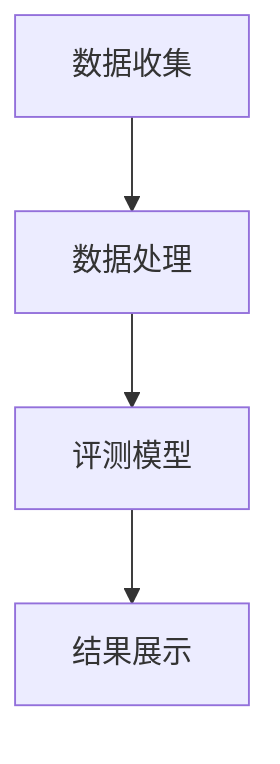
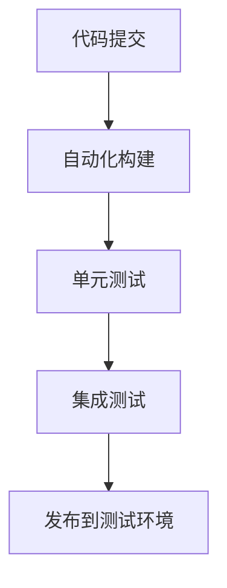
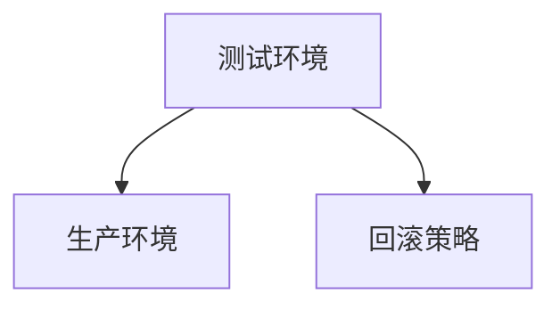
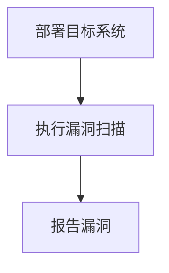
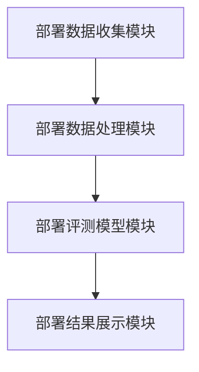

                 

## 文章标题：评测系统的DevOps最佳实践

### 关键词：DevOps、评测系统、持续集成、持续部署、自动化测试、基础设施即代码

#### 摘要：

本文旨在探讨评测系统在DevOps环境下的最佳实践。通过深入解析DevOps的核心原则，以及它们如何应用于评测系统的设计、实现和部署，我们提供了一套系统化的方法，帮助读者理解并实施DevOps在评测系统开发中的重要性。文章将分为三个主要部分：第一部分介绍DevOps的理论基础和最佳实践；第二部分探讨评测系统的架构设计、数据收集与预处理、以及评测模型的设计与优化；第三部分则聚焦于DevOps在评测系统开发中的应用，包括持续集成与持续部署、自动化测试、基础设施即代码等实践方法。最后，通过实际案例和资源分享，帮助读者将理论知识转化为实际操作，提升评测系统的开发效率和质量。

## 第一部分：DevOps与评测系统基础

### 第1章：DevOps概述与最佳实践

#### 1.1 DevOps基本概念与历史发展

**1.1.1 DevOps的定义**

DevOps是一种文化和实践方法，旨在通过加强软件开发（Development）与信息技术运营（Operations）之间的协作，来加速产品交付和提升整体系统的可靠性。DevOps强调自动化、协作和持续改进，通过消除开发和运维之间的壁垒，实现快速反馈和持续交付。

**1.1.2 DevOps与传统运维的比较**

传统运维主要关注系统运行和硬件管理，强调稳定性和安全性。而DevOps则更加关注系统交付的速度和质量，注重自动化和持续交付。传统运维依赖于手动操作和脚本，而DevOps则强调使用自动化工具和流程来提高效率和减少错误。

#### 1.2 DevOps的核心原则与实践方法

**1.2.1 持续集成与持续部署（CI/CD）**

持续集成（CI）是一种软件开发实践，通过将代码定期合并到主干分支，自动执行构建和测试流程，以确保代码库始终处于可运行状态。持续部署（CD）则进一步将成功通过的构建自动部署到生产环境。CI/CD能够显著缩短产品交付周期，提高代码质量和稳定性。

**1.2.2 漏洞扫描与自动化测试**

漏洞扫描是一种自动化工具，用于检测系统中的安全漏洞。自动化测试则是通过编写测试脚本，自动执行测试用例，以确保系统功能符合预期。这两种实践能够快速发现和修复问题，减少手动测试的工作量，提高测试效率。

**1.2.3 Infrastructure as Code（基础设施即代码）**

基础设施即代码（IaC）是一种将基础设施配置和管理作为代码进行管理的方法。通过使用脚本和自动化工具，IaC能够实现基础设施的快速部署和配置管理，提高资源利用率，减少人为错误。

## 第二部分：评测系统设计与实现

### 第2章：评测系统架构与设计

#### 2.1 评测系统总体架构

**2.1.1 评测系统核心组件**

评测系统的核心组件通常包括数据收集模块、数据处理模块、评测模型模块和结果展示模块。每个模块都需要与其他模块紧密集成，以确保系统能够高效地运行。

**2.1.2 Mermaid流程图：评测系统架构**



#### 2.2 数据收集与预处理

**2.2.1 数据源类型**

数据源可以分为内部数据和外部数据。内部数据通常来源于企业内部的业务系统，如数据库、日志等。外部数据则可以从第三方数据源获取，如公共数据集、API接口等。

**2.2.2 数据预处理算法**

数据预处理是评测系统中的关键步骤，包括数据清洗、数据转换和数据集成。常用的数据预处理算法有缺失值处理、异常值检测、数据标准化和数据归一化等。

#### 2.3 评测模型设计与优化

**2.3.1 评测模型选择**

评测模型的选择取决于具体的应用场景和数据类型。常见的评测模型包括机器学习模型、深度学习模型和统计模型等。

**2.3.2 伪代码：评测模型设计过程**

```python
# 伪代码：评测模型设计过程
def evaluate_model(data):
    # 数据预处理
    processed_data = preprocess_data(data)
    
    # 选择模型
    model = select_model(processed_data)
    
    # 训练模型
    trained_model = train_model(model, processed_data)
    
    # 评估模型
    evaluation_result = evaluate_model(trained_model, processed_data)
    
    return evaluation_result
```

**2.3.3 数学模型与公式解释**

评测系统的数学模型通常包括损失函数、优化算法和评价指标等。以下是一个简单的线性回归模型的数学模型：

$$
y = \beta_0 + \beta_1x + \epsilon
$$

其中，\(y\) 是预测结果，\(x\) 是输入特征，\(\beta_0\) 和 \(\beta_1\) 是模型参数，\(\epsilon\) 是误差项。

损失函数通常采用均方误差（MSE）：

$$
MSE = \frac{1}{n}\sum_{i=1}^{n}(y_i - \hat{y}_i)^2
$$

其中，\(n\) 是样本数量，\(\hat{y}_i\) 是预测结果，\(y_i\) 是真实值。

## 第三部分：DevOps在评测系统中的应用

### 第3章：DevOps在评测系统开发中的应用

#### 3.1 CI/CD在评测系统中的应用

**3.1.1 持续集成流程设计**

持续集成（CI）是将代码定期合并到主干分支，自动执行构建和测试流程，以确保代码库始终处于可运行状态。以下是一个简单的CI流程设计：



**3.1.2 持续部署策略**

持续部署（CD）是将成功通过的构建自动部署到生产环境。以下是一个简单的CD策略：



#### 3.2 自动化测试与漏洞扫描

**3.2.1 自动化测试框架选择**

自动化测试框架的选择取决于具体的应用场景和技术栈。常用的自动化测试框架有Selenium、Appium、JUnit等。

**3.2.2 漏洞扫描工具应用**

漏洞扫描工具可以自动检测系统中的安全漏洞，如Nessus、OpenVAS等。以下是一个简单的漏洞扫描流程：



#### 3.3 Infrastructure as Code（IaC）实践

**3.3.1 常见IaC工具使用**

常见的IaC工具包括Terraform、Ansible、Chef等。以下是一个简单的Terraform应用示例：

```hcl
# Terraform配置文件
provider "aws" {
  region = "us-east-1"
}

resource "aws_ec2_instance" "example" {
  provider = "aws"
  instance_type = "t2.micro"
  ami = "ami-0c94855d8e1efaa1e"
}
```

**3.3.2 IaC在评测系统部署中的应用**

IaC可以用于自动化部署评测系统的各个组件，如数据收集模块、数据处理模块、评测模型模块和结果展示模块。以下是一个简单的IaC应用示例：



## 第四部分：实战案例与资源

### 第4章：评测系统实战案例

#### 4.1 案例一：电商平台用户行为分析评测系统

**4.1.1 案例背景**

某电商平台希望通过分析用户行为，提升用户留存率和销售额。为此，他们开发了一套用户行为分析评测系统。

**4.1.2 系统设计与实现**

系统采用分布式架构，包括数据收集模块、数据处理模块、评测模型模块和结果展示模块。数据收集模块使用Flume和Kafka进行实时数据收集；数据处理模块使用Spark进行数据清洗和转换；评测模型模块使用TensorFlow进行模型训练和预测；结果展示模块使用ECharts进行数据可视化。

**4.1.3 代码解读与分析**

```python
# 伪代码：用户行为分析评测模型
import tensorflow as tf

# 数据预处理
def preprocess_data(data):
    # 数据清洗、归一化等操作
    return processed_data

# 构建模型
def build_model(input_shape):
    model = tf.keras.Sequential([
        tf.keras.layers.Dense(128, activation='relu', input_shape=input_shape),
        tf.keras.layers.Dense(64, activation='relu'),
        tf.keras.layers.Dense(1, activation='sigmoid')
    ])
    model.compile(optimizer='adam', loss='binary_crossentropy', metrics=['accuracy'])
    return model

# 训练模型
def train_model(model, data):
    # 数据划分、模型训练等操作
    model.fit(x_train, y_train, epochs=10, batch_size=32)
    return model

# 评估模型
def evaluate_model(model, data):
    # 模型评估操作
    evaluation_result = model.evaluate(x_test, y_test)
    return evaluation_result
```

#### 4.2 案例二：金融风控评测系统

**4.2.1 案例背景**

某金融机构希望通过分析用户行为和交易数据，识别潜在风险，提升风险控制能力。为此，他们开发了一套金融风控评测系统。

**4.2.2 系统设计与实现**

系统采用分布式架构，包括数据收集模块、数据处理模块、评测模型模块和结果展示模块。数据收集模块使用Flume和Kafka进行实时数据收集；数据处理模块使用Spark进行数据清洗和转换；评测模型模块使用XGBoost进行模型训练和预测；结果展示模块使用Tableau进行数据可视化。

**4.2.3 代码解读与分析**

```python
# 伪代码：金融风控评测模型
import xgboost as xgb

# 数据预处理
def preprocess_data(data):
    # 数据清洗、特征工程等操作
    return processed_data

# 构建模型
def build_model():
    model = xgb.XGBClassifier(use_label_encoder=False, eval_metric='logloss')
    return model

# 训练模型
def train_model(model, data):
    # 数据划分、模型训练等操作
    model.fit(x_train, y_train)
    return model

# 评估模型
def evaluate_model(model, data):
    # 模型评估操作
    evaluation_result = model.evaluate(x_test, y_test)
    return evaluation_result
```

### 第5章：评测系统开发资源与工具

#### 5.1 常用评测系统开发工具

**5.1.1 开源工具介绍**

- **Kafka**：用于实时数据收集和传输。
- **Spark**：用于大规模数据处理和分析。
- **TensorFlow**：用于构建和训练深度学习模型。
- **XGBoost**：用于构建和训练机器学习模型。

**5.1.2 商业工具对比**

- **AWS**：提供全面的数据处理和分析服务。
- **Azure**：提供强大的云计算和机器学习服务。
- **Google Cloud**：提供高效的数据存储和计算服务。

#### 5.2 资源与学习指南

**5.2.1 在线学习资源**

- **Coursera**：提供专业的DevOps和机器学习课程。
- **Udemy**：提供丰富的编程和数据分析课程。
- **edX**：提供免费的计算机科学和数据分析课程。

**5.2.2 社区与论坛**

- **Stack Overflow**：解决编程和技术问题。
- **GitHub**：分享开源代码和项目。
- **Reddit**：讨论最新的技术和趋势。

## 作者信息

作者：AI天才研究院/AI Genius Institute & 禅与计算机程序设计艺术 /Zen And The Art of Computer Programming

---

本文旨在探讨评测系统在DevOps环境下的最佳实践。通过深入解析DevOps的核心原则，以及它们如何应用于评测系统的设计、实现和部署，我们提供了一套系统化的方法，帮助读者理解并实施DevOps在评测系统开发中的重要性。文章分为三个主要部分：第一部分介绍DevOps的理论基础和最佳实践；第二部分探讨评测系统的架构设计、数据收集与预处理、以及评测模型的设计与优化；第三部分则聚焦于DevOps在评测系统开发中的应用，包括持续集成与持续部署、自动化测试、基础设施即代码等实践方法。最后，通过实际案例和资源分享，帮助读者将理论知识转化为实际操作，提升评测系统的开发效率和质量。

