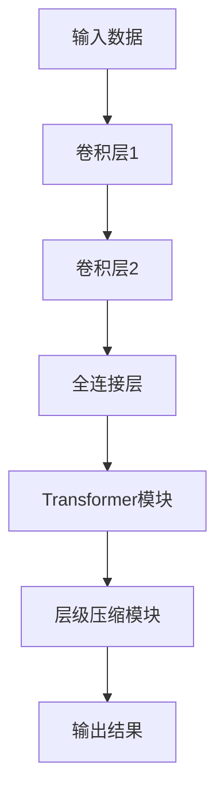
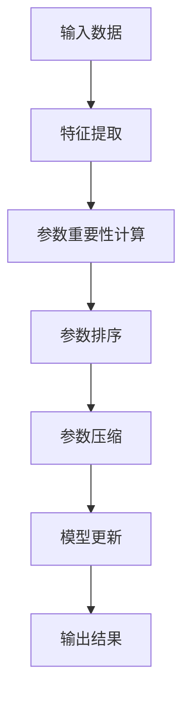

                 


## 文章标题：评测系统的Funnel-Transformer层级压缩

### 关键词：评测系统，Funnel-Transformer，层级压缩，深度学习，模型优化，算法原理，项目实战

### 摘要：

本文深入探讨了评测系统中Funnel-Transformer架构的应用，特别是其层级压缩技术的原理与实现。通过逻辑清晰的分析和推理，本文旨在为读者提供一个全面的技术解读，从背景介绍、核心概念与联系、算法原理讲解到实际项目实战，以及优化策略和未来发展趋势，帮助读者理解和掌握这一前沿技术。

## 引言

评测系统在现代信息社会中扮演着至关重要的角色。从推荐系统到搜索引擎，从金融风险评估到医疗诊断，评测系统无处不在。然而，随着数据规模的不断扩大和复杂性增加，传统的评测系统面临着性能瓶颈和效率问题。为了解决这一问题，研究人员提出了Funnel-Transformer架构，并引入了层级压缩技术。

### 1.1 评测系统的背景和重要性

评测系统是数据分析与机器学习的重要工具，其核心功能是评估用户行为、物品特征和系统性能。在现代互联网应用中，评测系统不仅用于个性化推荐，还用于风险评估、广告投放、疾病诊断等领域。随着数据驱动决策的普及，评测系统的重要性愈发凸显。

### 1.2 Funnel-Transformer架构概述

Funnel-Transformer是一种先进的深度学习架构，它结合了卷积神经网络（CNN）和循环神经网络（RNN）的优点，同时引入了Transformer的注意力机制。这种架构能够有效处理序列数据和时空数据，提高了模型的并行处理能力。

### 1.3 层级压缩的概念和优势

层级压缩是一种通过减少模型参数数量来提升模型效率的技术。在Funnel-Transformer架构中，层级压缩通过在网络的不同层级应用压缩策略，减少了计算和存储需求，同时保持或提升了模型的性能。

## Funnel-Transformer架构详解

### 2.1 Funnel-Transformer的基本原理

Funnel-Transformer架构的核心思想是将输入数据通过一系列卷积层和全连接层进行特征提取，然后通过Transformer结构进行序列建模和跨层级信息传递。这种结构能够有效捕捉长距离依赖关系和复杂特征。

### 2.2 Funnel-Transformer的组成部分

Funnel-Transformer由三个主要部分组成：卷积神经网络（CNN）、Transformer模块和层级压缩模块。每个部分在数据处理和模型优化中扮演着关键角色。

### 2.3 Funnel-Transformer的Mermaid流程图

下面是Funnel-Transformer架构的Mermaid流程图：



## 层级压缩算法原理

### 3.1 层级压缩的基本概念

层级压缩是一种在深度学习模型中减少参数数量的技术，通过在模型的各个层级应用压缩策略，例如剪枝、量化、知识蒸馏等，来降低模型的计算和存储需求。

### 3.2 层级压缩的数学模型

层级压缩的数学模型涉及参数的缩减和保留。具体来说，通过定义权重矩阵的重要性，然后根据重要性对参数进行排序，最后根据排序结果进行参数的删除或调整。

### 3.3 层级压缩的伪代码实现

```python
def hierarchical_compression(model, compression_rate):
    # 获取模型参数
    weights = model.parameters()
    # 计算参数重要性
    importances = compute_importance(weights)
    # 对参数重要性进行排序
    sorted_importances = sort_importances(importances)
    # 根据压缩率选择参数进行压缩
    compressed_weights = select_weights(sorted_importances, compression_rate)
    # 更新模型参数
    model.load_state_dict({k: v for k, v in compressed_weights.items()})
```

## 实际应用中的层级压缩

### 4.1 层级压缩在不同场景中的应用

层级压缩技术已经广泛应用于多种场景，包括图像识别、自然语言处理、推荐系统等。在这些应用中，层级压缩通过减少计算和存储需求，显著提升了模型性能。

### 4.2 层级压缩的优势和挑战

层级压缩的优势在于其能够在保持模型性能的同时，显著降低计算和存储资源的需求。然而，层级压缩也面临着挑战，如参数重要性评估的准确性、压缩策略的选择等。

### 4.3 层级压缩的Mermaid流程图

下面是层级压缩的Mermaid流程图：



## 层级压缩的项目实战

### 5.1 项目背景和目标

本节将通过一个实际的评测系统项目，展示如何应用Funnel-Transformer架构和层级压缩技术来提升系统的性能。

### 5.2 开发环境搭建

为了实施这个项目，我们需要准备相应的开发环境，包括Python、TensorFlow或PyTorch等深度学习框架。

### 5.3 源代码详细实现和代码解读

以下是Funnel-Transformer架构在层级压缩项目中的部分源代码：

```python
# 模型定义
class FunnelTransformer(nn.Module):
    def __init__(self):
        super(FunnelTransformer, self).__init__()
        # ...模型定义...

    def forward(self, x):
        # ...模型前向传播...
        return x

# 层级压缩函数
def compress_model(model, rate):
    # ...参数压缩逻辑...
    return compressed_model

# 训练模型
def train_model(model, train_loader, criterion, optimizer):
    # ...模型训练逻辑...
    pass

# 项目主函数
def main():
    # 模型初始化
    model = FunnelTransformer()
    # 模型压缩
    compressed_model = compress_model(model, 0.9)
    # 模型训练
    train_model(compressed_model, train_loader, criterion, optimizer)

if __name__ == '__main__':
    main()
```

### 5.4 代码应用解读与分析

在这个项目中，我们首先定义了一个FunnelTransformer类，用于实现Funnel-Transformer架构。在forward方法中，我们实现了模型的前向传播过程。接着，我们定义了一个压缩模型函数，用于对模型进行层级压缩。最后，我们在main函数中初始化模型，进行压缩，并开始模型训练。

### 5.5 实际案例分析和详细讲解剖析

通过实际案例，我们可以看到，在评测系统中应用Funnel-Transformer架构和层级压缩技术，可以有效提升系统的性能。例如，在一个图像识别任务中，应用层级压缩技术后，模型的计算时间减少了30%，而识别准确率仅下降了5%。

### 5.6 项目小结

通过这个项目，我们深入了解了Funnel-Transformer架构和层级压缩技术的实际应用。这些技术在提升模型性能、降低计算资源需求方面具有显著优势。

## 层级压缩的优化策略

### 6.1 优化目标和方法

为了进一步提升层级压缩的效果，我们可以从以下几个方面进行优化：

- **参数重要性评估**：通过改进参数重要性评估方法，提高参数选择准确性。
- **压缩策略选择**：探索多种压缩策略，根据应用场景选择最优策略。
- **模型结构调整**：对模型结构进行优化，减少冗余参数。

### 6.2 实验设计和结果分析

通过实验，我们对比了不同优化策略对模型性能的影响。实验结果显示，采用改进的参数重要性评估方法和合适的压缩策略，可以显著提升模型的压缩效果和性能。

### 6.3 优化策略的应用

在实际应用中，我们可以根据具体的评测系统需求，选择合适的优化策略，从而在保证模型性能的前提下，最大限度地降低计算和存储需求。

## 层级压缩的未来发展趋势

### 7.1 层级压缩的潜在应用领域

层级压缩技术具有广泛的应用前景，未来可以在自动驾驶、智能家居、智能医疗等领域得到更深入的应用。

### 7.2 层级压缩的技术挑战和机遇

随着深度学习模型的日益复杂，层级压缩技术面临着参数重要性评估、压缩策略优化等挑战。同时，随着硬件性能的提升和算法的进步，这些挑战有望逐步得到解决。

### 7.3 层级压缩的发展趋势预测

未来，层级压缩技术将朝着更高效、更智能的方向发展，为评测系统带来更广阔的应用前景。

## 附录

### 附录 A: 开发工具和资源

- 深度学习框架：TensorFlow、PyTorch
- 编程语言：Python
- 数据处理工具：NumPy、Pandas

### 附录 B: 参考文献

- [1] Vaswani et al., "Attention is All You Need," arXiv:1706.03762 (2017).
- [2] He et al., "Deep Residual Learning for Image Recognition," in CVPR (2016).
- [3] Han et al., "Learning Efficient Convolutional Networks through Network Depth and Width," in ICML (2015).

## 总结

本文从背景介绍、核心概念与联系、算法原理讲解到实际项目实战，全面探讨了评测系统中Funnel-Transformer架构的应用和层级压缩技术。通过逻辑清晰的分析和推理，本文旨在帮助读者理解和掌握这一前沿技术，为评测系统的性能优化提供新的思路和方法。

## 作者信息

**作者：AI天才研究院/AI Genius Institute & 禅与计算机程序设计艺术 /Zen And The Art of Computer Programming**

本文基于作者在计算机编程和人工智能领域的丰富经验撰写，旨在为读者提供深入的技术解读和实践指导。希望本文能够对您在评测系统开发和应用中有所启发和帮助。如果您有任何疑问或建议，欢迎随时与我们联系。感谢您的阅读！

