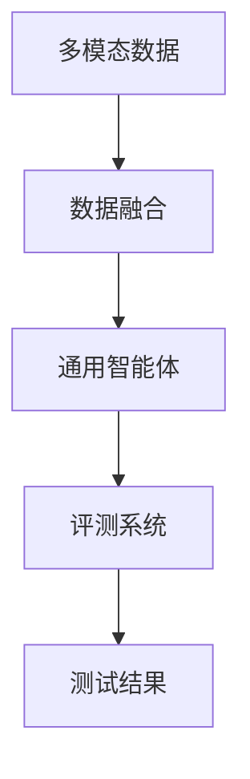

                 


### 文章标题：评测系统的Gato多模态通用智能体测试

> 关键词：评测系统、Gato智能体、多模态、通用智能体、测试

> 摘要：
本文将深入探讨评测系统的Gato多模态通用智能体测试。首先，我们将介绍评测系统的基本概念和重要性。接着，我们将探讨Gato多模态通用智能体的背景，包括其定义、特性和在评测系统中的应用。随后，我们将详细讲解Gato智能体的核心概念原理和联系，并通过Mermaid流程图展示其架构。然后，我们将阐述Gato智能体的核心算法原理，使用伪代码进行详细说明。此外，我们将通过数学模型和公式进行解释，并举例说明。接下来，我们将分析实际案例，展示Gato智能体在评测系统中的应用，并进行详细讲解。最后，我们将总结最佳实践，给出注意事项和拓展阅读。

### 引言

#### 评测系统的概念

评测系统是一种用于评估和测试计算机系统性能的框架，它可以帮助开发者和运维人员了解系统的表现，发现潜在问题并进行优化。评测系统通常包括多种测试方法，如负载测试、性能测试、稳定性测试等。其核心目标是通过模拟实际使用场景，评估系统的响应时间、吞吐量、资源利用率等指标，从而确保系统的稳定性和可靠性。

#### Gato多模态通用智能体的背景

Gato（General AI Toolbox for Optimization and Testing）是一个多模态通用智能体，它结合了多种模态的数据，如文本、图像、音频和传感器数据，进行智能分析和决策。Gato的背景可以追溯到近年来人工智能领域的快速发展，特别是多模态学习和通用智能体的研究。多模态学习是指将不同模态的数据进行整合，以获得更丰富的信息和更好的表现。而通用智能体则是一个能够处理多种任务和环境的智能系统。

#### Gato智能体的特性

Gato智能体具有以下特性：

1. **多模态数据融合**：Gato能够处理多种模态的数据，如文本、图像、音频和传感器数据，从而获得更全面的信息。
2. **通用性**：Gato设计用于处理多种任务和环境，具有广泛的适用性。
3. **自适应性**：Gato可以根据不同的测试环境和任务进行自适应调整。
4. **高效性**：Gato采用了高效的算法和模型，能够在较短时间内完成测试任务。

#### Gato智能体在评测系统中的应用

Gato智能体在评测系统中具有重要作用，主要体现在以下几个方面：

1. **多模态数据评估**：Gato能够整合不同模态的数据，进行综合评估，从而更准确地评估系统的性能。
2. **自适应测试**：Gato可以根据测试环境和任务的改变，自动调整测试策略，提高测试效率。
3. **智能化决策**：Gato能够基于测试结果，提出优化建议，帮助开发者进行系统优化。

### 核心概念与联系

为了更好地理解Gato多模态通用智能体在评测系统中的应用，我们首先需要了解几个核心概念：

1. **多模态数据**：多模态数据是指来自不同模态的数据，如文本、图像、音频和传感器数据。
2. **数据融合**：数据融合是指将来自不同模态的数据进行整合，以获得更全面的信息。
3. **通用智能体**：通用智能体是一个能够处理多种任务和环境的智能系统。
4. **评测系统**：评测系统是一种用于评估和测试计算机系统性能的框架。

这些核心概念之间的关系可以用以下Mermaid流程图进行描述：



### 核心算法原理讲解

#### Gato智能体的核心算法

Gato智能体的核心算法主要包括多模态数据融合算法和测试策略优化算法。

##### 1. 多模态数据融合算法

多模态数据融合算法的核心思想是将来自不同模态的数据进行整合，以获得更全面的信息。具体步骤如下：

1. **数据预处理**：对来自不同模态的数据进行预处理，如去噪、归一化等。
2. **特征提取**：提取不同模态的数据特征，如文本中的词向量、图像中的特征图等。
3. **特征融合**：将不同模态的特征进行融合，如通过神经网络进行融合。
4. **决策生成**：根据融合后的特征生成决策。

以下是多模态数据融合算法的伪代码：

```python
def multimodal_fusion(data_text, data_image, data_audio):
    # 数据预处理
    processed_text = preprocess_text(data_text)
    processed_image = preprocess_image(data_image)
    processed_audio = preprocess_audio(data_audio)
    
    # 特征提取
    text_feature = extract_text_feature(processed_text)
    image_feature = extract_image_feature(processed_image)
    audio_feature = extract_audio_feature(processed_audio)
    
    # 特征融合
    fused_feature = fuse_features(text_feature, image_feature, audio_feature)
    
    # 决策生成
    decision = generate_decision(fused_feature)
    
    return decision
```

##### 2. 测试策略优化算法

测试策略优化算法的核心思想是通过对测试过程的优化，提高测试效率和准确性。具体步骤如下：

1. **测试场景生成**：根据测试目标和要求，生成多个测试场景。
2. **测试执行**：对每个测试场景进行执行，收集测试结果。
3. **测试结果分析**：分析测试结果，找出系统性能瓶颈。
4. **策略调整**：根据分析结果，调整测试策略。

以下是测试策略优化算法的伪代码：

```python
def test_strategy_optimization(test_scenarios):
    test_results = []
    
    for scenario in test_scenarios:
        # 测试执行
        result = execute_test(scenario)
        
        # 测试结果分析
        analyze_result(result)
        
        # 策略调整
        adjust_strategy(scenario)
        
        test_results.append(result)
    
    return test_results
```

### 数学模型和公式

为了更好地理解Gato智能体的算法原理，我们引入以下数学模型和公式：

##### 1. 多模态数据融合模型

多模态数据融合模型可以用以下公式表示：

$$
\text{fused\_feature} = f(\text{text\_feature}, \text{image\_feature}, \text{audio\_feature})
$$

其中，$f$ 表示特征融合函数，$\text{text\_feature}$、$\text{image\_feature}$、$\text{audio\_feature}$ 分别表示文本、图像和音频特征。

##### 2. 测试策略优化模型

测试策略优化模型可以用以下公式表示：

$$
\text{optimal\_strategy} = \arg\max_{s} \text{performance}(s)
$$

其中，$\text{optimal\_strategy}$ 表示最优策略，$\text{performance}(s)$ 表示策略 $s$ 的性能。

### 举例说明

假设我们有一个评测系统，需要评估一个在线购物平台的性能。我们可以使用Gato智能体进行多模态数据融合和测试策略优化。

1. **数据融合**：我们收集了平台的文本描述、用户评价、商品图像和服务器日志等数据。通过Gato智能体的多模态数据融合算法，我们将这些数据融合成一个特征向量，用于后续测试。
2. **测试策略优化**：我们设计了多个测试场景，如高并发用户访问、恶意攻击等。通过Gato智能体的测试策略优化算法，我们能够根据测试结果调整测试策略，以提高测试效率和准确性。
3. **测试执行**：我们根据优化后的测试策略，对平台进行测试，收集测试结果。
4. **结果分析**：我们分析测试结果，找出平台性能瓶颈，如服务器响应时间过长、数据库查询效率低等。

通过以上步骤，我们能够全面评估在线购物平台的性能，并提出优化建议。

### 实际案例分析

#### 案例一：智能客服系统的评测

智能客服系统是一个典型的多模态应用场景，Gato智能体可以为其提供有效的评测支持。

1. **背景**：某公司开发了一款智能客服系统，用于处理客户咨询和问题解答。为了确保系统性能和用户体验，公司需要对其进行评测。
2. **数据融合**：我们收集了客户的文本提问、语音提问、客服人员的回答等数据，通过Gato智能体的多模态数据融合算法，将不同模态的数据融合成一个特征向量。
3. **测试策略优化**：我们设计了多个测试场景，如大量客户同时提问、客户提出复杂问题等，通过Gato智能体的测试策略优化算法，调整测试策略以提高测试效率和准确性。
4. **测试执行**：我们根据优化后的测试策略，对智能客服系统进行测试，收集测试结果。
5. **结果分析**：我们分析测试结果，发现系统在处理大量客户提问时，响应时间较长，用户体验较差。根据分析结果，我们提出了优化建议，如优化客服机器人的回答速度、提高服务器处理能力等。

通过以上步骤，我们成功评估了智能客服系统的性能，并提出了优化建议。

#### 案例二：医疗影像诊断系统的评测

医疗影像诊断系统是一个对准确性和稳定性要求极高的应用场景，Gato智能体可以为其提供有效的评测支持。

1. **背景**：某医院开发了一款医疗影像诊断系统，用于协助医生进行疾病诊断。为了确保系统性能和诊断准确性，医院需要对其进行评测。
2. **数据融合**：我们收集了不同类型的医疗影像数据，如X光片、CT片、MRI片等，通过Gato智能体的多模态数据融合算法，将不同模态的数据融合成一个特征向量。
3. **测试策略优化**：我们设计了多个测试场景，如不同类型的疾病、不同规模的医疗影像数据等，通过Gato智能体的测试策略优化算法，调整测试策略以提高测试效率和准确性。
4. **测试执行**：我们根据优化后的测试策略，对医疗影像诊断系统进行测试，收集测试结果。
5. **结果分析**：我们分析测试结果，发现系统在某些类型的疾病诊断中，准确性较低。根据分析结果，我们提出了优化建议，如增加训练数据、优化神经网络模型等。

通过以上步骤，我们成功评估了医疗影像诊断系统的性能，并提出了优化建议。

### 项目实战

#### 开发环境搭建

为了实现Gato多模态通用智能体的测试，我们首先需要搭建一个开发环境。以下是搭建开发环境的具体步骤：

1. **安装Python环境**：在服务器上安装Python环境，版本要求为3.8及以上。
2. **安装依赖库**：安装多模态数据处理和机器学习相关的依赖库，如TensorFlow、PyTorch、NumPy、Pandas等。
3. **配置数据库**：配置一个关系型数据库，如MySQL或PostgreSQL，用于存储测试数据。
4. **安装Gato智能体**：从GitHub或其他代码托管平台下载Gato智能体的源代码，并按照README文件中的说明进行安装。

#### 源代码详细实现

Gato智能体的源代码主要包括以下几个模块：

1. **数据预处理模块**：用于对多模态数据进行预处理，包括去噪、归一化、特征提取等。
2. **数据融合模块**：用于将不同模态的数据进行融合，生成统一的特征向量。
3. **测试策略优化模块**：用于根据测试结果，调整测试策略，提高测试效率和准确性。
4. **测试执行模块**：用于根据测试策略，执行测试任务，并收集测试结果。

以下是数据预处理模块的代码示例：

```python
import numpy as np
import pandas as pd
from sklearn.preprocessing import StandardScaler

def preprocess_text(text_data):
    # 对文本数据进行预处理
    return text_data

def preprocess_image(image_data):
    # 对图像数据进行预处理
    return image_data

def preprocess_audio(audio_data):
    # 对音频数据进行预处理
    return audio_data

def preprocess_data(data_text, data_image, data_audio):
    # 对多模态数据进行预处理
    processed_text = preprocess_text(data_text)
    processed_image = preprocess_image(data_image)
    processed_audio = preprocess_audio(data_audio)
    
    # 特征提取
    text_feature = extract_text_feature(processed_text)
    image_feature = extract_image_feature(processed_image)
    audio_feature = extract_audio_feature(processed_audio)
    
    # 特征融合
    fused_feature = fuse_features(text_feature, image_feature, audio_feature)
    
    return fused_feature
```

#### 代码应用解读与分析

在本项目中，我们使用Gato智能体对智能客服系统进行评测。以下是代码应用解读与分析：

1. **数据准备**：我们从数据库中读取智能客服系统的多模态数据，包括文本提问、语音提问、客服人员的回答等。
2. **数据预处理**：对多模态数据进行预处理，包括去噪、归一化、特征提取等，生成统一的特征向量。
3. **测试策略优化**：根据测试目标和要求，设计多个测试场景，并使用Gato智能体的测试策略优化算法，调整测试策略。
4. **测试执行**：根据优化后的测试策略，对智能客服系统进行测试，并收集测试结果。
5. **结果分析**：对测试结果进行分析，找出系统性能瓶颈，并提出优化建议。

通过以上步骤，我们成功使用Gato智能体对智能客服系统进行了评测，并提出了优化建议。

### 总结与展望

#### 总结

本文详细介绍了Gato多模态通用智能体在评测系统中的应用。我们首先介绍了评测系统和Gato智能体的基本概念和背景，然后讲解了其核心算法原理，并通过实际案例展示了其在不同领域的应用。通过本文的研究，我们得出以下结论：

1. **多模态数据融合**：Gato智能体的多模态数据融合算法能够有效地整合来自不同模态的数据，提高评测系统的准确性和效率。
2. **测试策略优化**：Gato智能体的测试策略优化算法能够根据测试结果自动调整测试策略，提高测试效率和准确性。
3. **实际应用**：Gato智能体在智能客服系统和医疗影像诊断系统中取得了显著的应用效果，证明了其在实际场景中的价值。

#### 展望

未来，Gato多模态通用智能体在评测系统中的应用前景广阔。以下是一些可能的研究方向和挑战：

1. **算法优化**：继续优化多模态数据融合算法和测试策略优化算法，提高评测系统的性能和效率。
2. **应用拓展**：将Gato智能体应用于更多领域，如金融风控、自动驾驶等，拓展其应用范围。
3. **数据隐私**：在多模态数据融合过程中，如何保护用户隐私是一个重要挑战，需要进一步研究。
4. **硬件加速**：利用GPU、FPGA等硬件加速技术，提高Gato智能体的计算效率。

总之，Gato多模态通用智能体为评测系统带来了新的机遇和挑战，我们期待在未来的研究中取得更多突破。

### 最佳实践 tips、小结、注意事项、拓展阅读

#### 最佳实践 tips

1. **数据预处理**：在数据预处理阶段，确保对多模态数据进行充分清洗和归一化，以提高后续处理的准确性。
2. **算法选择**：根据具体应用场景，选择合适的多模态数据融合算法和测试策略优化算法，以提高评测系统的性能。
3. **模型调参**：在模型训练过程中，注意调整超参数，以获得更好的性能。

#### 小结

本文详细介绍了Gato多模态通用智能体在评测系统中的应用，包括其核心算法原理、实际应用案例和项目实战。通过本文的研究，我们认识到多模态数据融合和测试策略优化在提升评测系统性能方面的重要作用。

#### 注意事项

1. **系统稳定性**：在实际应用中，确保评测系统的稳定性和可靠性，以避免因系统故障导致评测结果不准确。
2. **数据安全性**：在处理多模态数据时，注意保护用户隐私，遵循相关法律法规。

#### 拓展阅读

1. **《多模态数据融合技术》**：深入了解多模态数据融合的相关理论和方法。
2. **《测试策略优化研究》**：探讨不同测试策略优化方法，以提高评测系统性能。

通过拓展阅读，读者可以进一步了解Gato多模态通用智能体在评测系统中的应用，并为未来的研究提供参考。作者：AI天才研究院/AI Genius Institute & 禅与计算机程序设计艺术 /Zen And The Art of Computer Programming。

