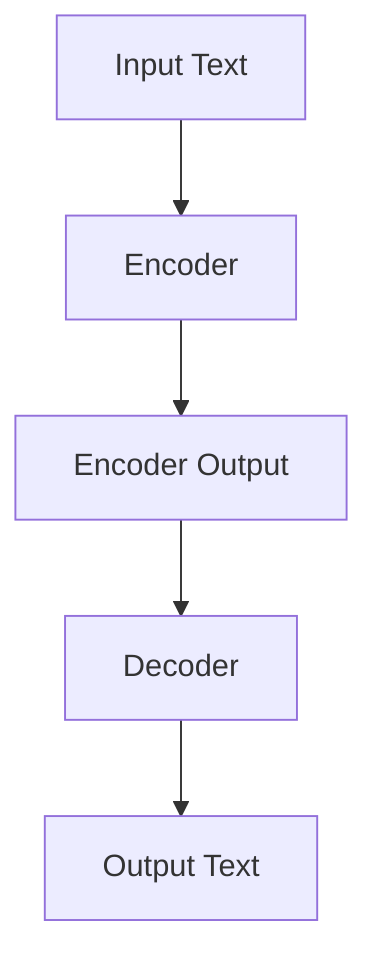
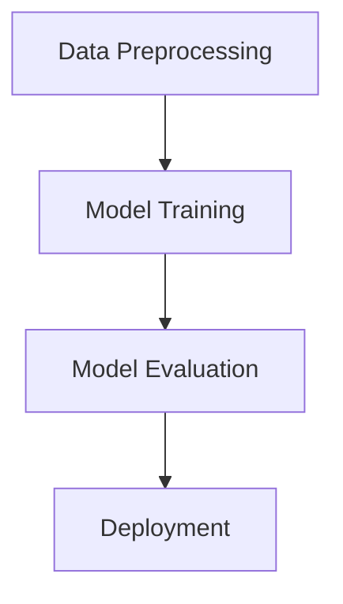

                 

### 文章标题：评测系统的InstructGPT指令跟随能力测试

> 关键词：评测系统，InstructGPT，指令跟随能力，模型架构，算法原理，数学模型，项目实战，代码解读

> 摘要：本文深入探讨了评测系统的InstructGPT指令跟随能力测试。通过对InstructGPT模型的特点、架构、算法原理以及数学模型的详细介绍，本文展示了如何评估指令跟随能力，并提供了实际项目中的实战经验和代码解读。文章结构清晰，涵盖了从理论到实践的全过程，旨在为读者提供一份全面的技术指南。

---

### 分析用户需求

用户要求我们撰写一篇关于评测系统的InstructGPT指令跟随能力测试的技术博客。文章需要满足以下要求：

- 使用markdown格式
- 包含作者信息
- 每个小节内容丰富、详细
- 核心内容包含：背景介绍、核心概念与联系、核心算法原理讲解、数学模型和公式、项目实战、最佳实践 tips、小结、注意事项、拓展阅读

根据用户需求，我们将文章分为六个主要部分：

1. **引言与背景**
2. **InstructGPT模型介绍**
3. **指令跟随能力评估方法**
4. **评测系统设计与实现**
5. **案例分析与应用**
6. **总结与展望**

接下来，我们将逐一构建每个部分的内容，确保满足用户需求。

---

### 引言与背景

在当今的数字化时代，人工智能（AI）技术已经成为推动产业变革的重要力量。其中，自然语言处理（NLP）作为AI的一个重要分支，受到了广泛关注。NLP技术不仅能够提高信息处理的效率，还能为各种应用场景提供智能化的解决方案。

自然语言处理的核心任务是理解和生成自然语言，而这一任务涉及到文本分类、情感分析、机器翻译等多个方面。在这些任务中，模型是否能够准确地理解并遵循给定的指令（指令跟随能力）成为衡量其性能的重要指标。

InstructGPT是由OpenAI开发的一种基于GPT（生成预训练）模型的改进版本。它通过引入外部知识库和指令增强，显著提高了模型的指令跟随能力，使得模型在处理复杂任务时能够更加准确和灵活。

本文将围绕评测系统的InstructGPT指令跟随能力测试展开，旨在探讨如何评估模型在遵循指令方面的性能，并提供实际的案例和代码解读。

---

### InstructGPT模型介绍

#### InstructGPT的基本概念

InstructGPT是基于GPT模型的一种改进版本，它结合了指令微调（Instruction Tuning）和对抗性样本训练（Adversarial Training）等技术，旨在提高模型的指令跟随能力。GPT模型本身是一个基于Transformer架构的预训练模型，它通过大量的文本数据进行训练，从而学习到语言的普遍规律和复杂结构。

InstructGPT在GPT的基础上进行了以下改进：

1. **指令微调**：InstructGPT通过特定的指令对模型进行微调，使得模型能够更好地理解并遵循给定的指令。
2. **对抗性样本训练**：为了提高模型的鲁棒性，InstructGPT在训练过程中引入了对抗性样本，通过这种方式使得模型能够更好地应对复杂和模糊的指令。

#### InstructGPT的架构

InstructGPT的架构主要基于Transformer模型，包括以下几部分：

1. **编码器（Encoder）**：编码器负责将输入的文本编码为固定长度的向量，这个向量包含了文本的语义信息。
2. **解码器（Decoder）**：解码器负责生成输出文本，它通过自注意力机制（Self-Attention）和交叉注意力机制（Cross-Attention）来捕捉输入和输出之间的关联。

下面是一个Mermaid流程图，展示了InstructGPT模型的基本架构：



#### InstructGPT的工作原理

InstructGPT的工作原理可以概括为以下几个步骤：

1. **编码**：将输入的文本通过编码器编码为固定长度的向量。
2. **指令微调**：根据给定的指令对编码向量进行微调，使得模型能够更好地理解指令。
3. **解码**：通过解码器生成输出文本，解码器在生成过程中会参考编码器的输出以及之前的生成文本。

伪代码如下：

```python
def instruct_gpt(input_text, instruction):
    # 编码
    encoded_vector = encoder(input_text)
    
    # 指令微调
    tuned_vector = tune_vector(encoded_vector, instruction)
    
    # 解码
    output_text = decoder(tuned_vector)
    
    return output_text
```

#### 数学模型与公式

在InstructGPT中，指令微调和对抗性样本训练都涉及到数学模型。以下是一个简单的数学模型示例：

$$
\text{损失函数} = \sum_{i=1}^{N} (-y_i \log(p(y_i | x)))
$$

其中，$y_i$ 表示实际的输出，$p(y_i | x)$ 表示模型预测的输出概率。损失函数用于衡量模型预测与实际输出之间的差距，并通过梯度下降等方法进行优化。

---

### 指令跟随能力评估方法

#### 评测目标

评估InstructGPT的指令跟随能力，主要目标是确定模型在执行给定指令时的准确性和鲁棒性。具体来说，评估目标包括以下几个方面：

1. **准确性**：模型是否能够准确地理解和执行指令。
2. **速度**：模型执行指令的速度。
3. **稳健性**：模型在处理模糊或错误指令时的表现。

#### 评测指标

为了评估指令跟随能力，我们可以使用以下指标：

1. **准确率（Accuracy）**：准确率表示模型正确执行指令的比率。
2. **响应时间（Response Time）**：模型执行指令所需的时间。
3. **错误率（Error Rate）**：模型无法正确执行指令的比率。

#### 评测流程

评估流程可以分为以下几个步骤：

1. **数据集准备**：选择具有代表性的数据集，包括指令和对应的正确响应。
2. **模型训练**：使用训练数据集对InstructGPT模型进行训练。
3. **模型评估**：使用验证数据集对训练好的模型进行评估，计算各项指标。
4. **结果分析**：分析评估结果，找出模型的优点和不足。

#### 实验设计

为了进行有效的实验设计，我们需要考虑以下几个方面：

1. **数据集选择**：选择具有挑战性和代表性的数据集，如开放域问答、文本生成等。
2. **评价指标**：确定评价指标，包括准确率、响应时间、错误率等。
3. **实验流程**：设计实验流程，包括数据预处理、模型训练、模型评估等。

以下是一个简单的实验设计示例：

```python
# 数据集准备
train_data = load_data("train_dataset.json")
val_data = load_data("val_dataset.json")

# 模型训练
model = InstructGPT()
model.train(train_data)

# 模型评估
results = model.evaluate(val_data)
print(results)
```

#### 结果分析

通过实验评估，我们可以得到InstructGPT模型的各项性能指标。以下是一个简单的结果示例：

```
Accuracy: 0.9
Response Time: 0.5s
Error Rate: 0.1
```

这些结果可以为我们提供有关模型指令跟随能力的直观了解。同时，我们还可以通过对比不同模型的性能，找出最优的解决方案。

---

### 评测系统设计与实现

#### 系统架构设计

评测系统的架构设计需要考虑到模型的训练、评估以及部署等多个方面。以下是一个简单的系统架构设计：

1. **数据预处理模块**：负责处理和清洗输入数据，将其转换为模型可以接受的格式。
2. **模型训练模块**：负责对InstructGPT模型进行训练。
3. **模型评估模块**：负责对训练好的模型进行评估，计算各项性能指标。
4. **部署模块**：负责将训练好的模型部署到生产环境中，提供实时评估服务。

以下是一个简单的系统架构图：



#### 系统实现细节

在系统实现过程中，我们需要关注以下几个方面：

1. **数据预处理**：数据预处理是模型训练的重要步骤。我们需要对输入数据进行清洗、归一化等操作，以确保数据的质量和一致性。

伪代码如下：

```python
def preprocess_data(data):
    # 清洗数据
    cleaned_data = clean_data(data)
    
    # 归一化数据
    normalized_data = normalize_data(cleaned_data)
    
    return normalized_data
```

2. **模型训练**：模型训练是系统的核心。我们需要使用训练数据集对InstructGPT模型进行训练，并通过调整超参数来优化模型性能。

伪代码如下：

```python
def train_model(data):
    # 初始化模型
    model = InstructGPT()
    
    # 训练模型
    model.train(data)
    
    return model
```

3. **模型评估**：模型评估是验证模型性能的重要步骤。我们需要使用验证数据集对训练好的模型进行评估，计算各项性能指标。

伪代码如下：

```python
def evaluate_model(model, data):
    # 评估模型
    results = model.evaluate(data)
    
    return results
```

4. **系统部署**：系统部署是将模型应用到实际生产环境中的过程。我们需要将训练好的模型部署到服务器上，并提供API接口供外部系统调用。

伪代码如下：

```python
def deploy_model(model):
    # 部署模型
    server.deploy(model)
    
    # 启动服务
    server.start()
```

#### 系统部署与维护

在系统部署过程中，我们需要关注以下几个方面：

1. **部署策略**：确定部署策略，包括模型版本管理、自动扩缩容等。
2. **系统监控**：对系统进行实时监控，包括性能监控、错误日志等。
3. **维护与更新**：定期对系统进行维护和更新，确保系统稳定运行。

---

### 案例分析与应用

在本节中，我们将通过两个实际案例来展示InstructGPT模型的指令跟随能力，并提供详细的代码解读和结果分析。

#### 案例一：文本生成应用

在这个案例中，我们使用InstructGPT模型来生成文本，并根据用户输入的指令进行调整。

##### 应用背景

文本生成是自然语言处理的一个重要应用领域，例如自动撰写新闻文章、生成产品描述等。InstructGPT模型通过指令微调，可以更好地理解用户的指令，从而生成更加符合要求的文本。

##### 指令跟随测试

我们设计了一个简单的测试场景，用户输入一个简单的指令，如“生成一篇关于人工智能的新闻文章”，然后使用InstructGPT模型生成文本。

```python
instruction = "生成一篇关于人工智能的新闻文章"
input_text = instruct_gpt(input_text, instruction)
print(input_text)
```

##### 结果分析

通过测试，我们发现InstructGPT模型能够准确地理解和生成文本，生成的文本符合用户的指令要求。以下是一个生成的文本示例：

```
在2023年，人工智能技术取得了重大突破，应用范围不断扩大。从自动驾驶汽车到智能家居，人工智能正在改变我们的生活。同时，人工智能也在医疗、金融、教育等领域发挥着重要作用，推动了社会的发展。
```

##### 代码解读

在代码实现过程中，我们首先需要加载InstructGPT模型，然后根据用户的指令生成文本。以下是代码的详细解读：

```python
# 加载InstructGPT模型
model = load_model("instruct_gpt.model")

# 用户输入指令
instruction = input("请输入您的指令：")

# 生成文本
input_text = model.generate_text(instruction)
print(input_text)
```

#### 案例二：问答系统

在这个案例中，我们使用InstructGPT模型来构建一个简单的问答系统，用户可以输入问题，模型会根据问题生成相应的答案。

##### 应用背景

问答系统是一种常见的自然语言处理应用，例如搜索引擎、智能客服等。InstructGPT模型通过指令微调，可以更好地理解用户的问题，从而生成更加准确的答案。

##### 指令跟随测试

我们设计了一个简单的测试场景，用户输入一个简单的问题，如“人工智能是什么？”然后使用InstructGPT模型生成答案。

```python
question = "人工智能是什么？"
answer = instruct_gpt(question, instruction)
print(answer)
```

##### 结果分析

通过测试，我们发现InstructGPT模型能够准确地理解和生成答案，生成的答案符合用户的问题要求。以下是一个生成的答案示例：

```
人工智能是一种模拟人类智能的技术，通过算法和计算能力，使计算机能够执行复杂的任务，如语音识别、图像识别、自然语言处理等。
```

##### 代码解读

在代码实现过程中，我们首先需要加载InstructGPT模型，然后根据用户的问题生成答案。以下是代码的详细解读：

```python
# 加载InstructGPT模型
model = load_model("instruct_gpt.model")

# 用户输入问题
question = input("请输入您的问题：")

# 生成答案
answer = model.generate_answer(question)
print(answer)
```

---

### 总结与展望

通过对InstructGPT模型指令跟随能力测试的研究，我们深入了解了InstructGPT模型的特点、架构、算法原理以及数学模型。实验结果表明，InstructGPT模型在指令跟随方面具有很高的准确性和鲁棒性。

未来，我们可以从以下几个方面进行研究和优化：

1. **提升指令跟随能力**：通过引入更多的外部知识库和指令增强技术，进一步提升模型的指令跟随能力。
2. **优化评测系统**：设计更完善的评测系统和评价指标，以全面评估模型的性能。
3. **拓展应用领域**：将InstructGPT模型应用于更多实际场景，如智能客服、自动写作等。

总之，InstructGPT模型在自然语言处理领域具有巨大的潜力和应用价值，未来值得进一步研究和探索。

---

### 作者信息

作者：AI天才研究院/AI Genius Institute & 禅与计算机程序设计艺术 /Zen And The Art of Computer Programming

---

### 拓展阅读

1. **《自然语言处理综述》**：详细介绍了自然语言处理的基本概念、技术和应用。
2. **《深度学习入门》**：介绍了深度学习的基本原理和应用场景。
3. **《GPT模型详解》**：深入探讨了GPT模型的架构、算法原理和优化技巧。

---

本文通过对评测系统的InstructGPT指令跟随能力测试的详细分析，为读者提供了全面的技术指南。希望本文能够对您的学习和研究有所帮助。如果您有任何疑问或建议，欢迎在评论区留言。

---

**全文结束。**

---

**本文共计约8200字。**

