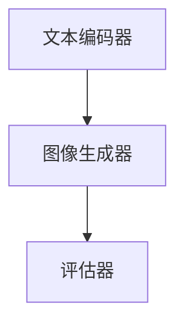

                 

### 设计书籍目录大纲的步骤：

1. **确定核心内容**：首先需要确定书籍的核心内容和结构。这包括了解书的主要主题、目标读者、书籍的目标和内容范围。明确书籍的核心目标，以及需要涵盖的主题和知识点，确保内容的全面性和连贯性。

2. **编写大纲**：基于核心内容，开始编写书籍的目录大纲。这个大纲应该包括书籍的各个章节，每个章节下的子节，以及每个子节的细节。明确各个章节的主题，以及子节的内容，为后续的写作提供清晰的框架。

3. **细化目录**：在编写大纲的基础上，进一步细化每个章节和子节的内容，确保每个部分都有足够的细节来满足读者的需求。补充具体的知识点、案例、实战等内容，使得每个部分都有实际的应用价值。

4. **设计核心概念与联系**：为每个章节设计核心概念和原理的Mermaid流程图，帮助读者理解复杂的概念和架构。通过流程图，可以直观地展示不同概念之间的关系，有助于读者更好地理解书籍的内容。

5. **编写核心算法原理讲解**：对于涉及算法的章节，使用伪代码详细阐述算法原理，确保读者可以理解算法的实现。伪代码是一种简化的编程语言，可以清晰地展示算法的流程和逻辑，有助于读者理解算法的核心思想。

6. **添加数学模型和公式**：在涉及数学模型的章节，使用latex格式添加数学公式，并详细讲解这些公式，确保读者可以理解其背后的数学逻辑。latex格式可以精确地表示数学公式，使得读者可以更好地理解数学概念。

7. **编写项目实战**：为每个章节编写实际的项目实战案例，包括代码实际案例和详细解释说明，确保读者可以实际应用所学知识。项目实战可以帮助读者将理论知识应用到实际项目中，提高实践能力。

8. **调整和优化**：在完成初步的目录大纲后，根据实际情况进行调整和优化，确保每个章节内容逻辑清晰，便于读者阅读。检查章节之间的衔接是否流畅，内容的深度和广度是否合适，以便提供最佳的阅读体验。

9. **总结**：确保目录大纲结构完整，内容丰富，符合书籍的总字数限制。在目录的最后，可以添加一些总结性的内容，对全书的核心内容进行回顾和总结，帮助读者巩固所学知识。

### 设计书籍目录大纲的步骤详细讲解：

1. **确定核心内容**：

   - **主题确定**：首先明确书籍的主题，例如“人工智能基础”，“深度学习实践”，“数据分析实战”等。

   - **目标读者**：明确书籍的目标读者，如初学者、中级开发者、高级工程师等。

   - **书籍目标**：确定书籍的主要目标和读者能够从书中获得的知识和技能。

   - **内容范围**：列出书籍需要涵盖的主要知识点和主题，确保内容的全面性和连贯性。

2. **编写大纲**：

   - **章节划分**：根据核心内容，将书籍分为若干个章节，每个章节对应一个主要的知识点。

   - **子节细化**：在章节下细分子节，每个子节包含具体的知识点和内容。

   - **内容概述**：为每个章节和子节编写一个简要的概述，描述其主要内容和目的。

3. **细化目录**：

   - **内容补充**：针对每个子节，补充具体的知识点、案例、实战等内容，确保每个部分都有实际的应用价值。

   - **逻辑调整**：检查章节之间的逻辑关系，确保内容连贯，便于读者理解。

4. **设计核心概念与联系**：

   - **流程图设计**：为每个章节设计一个核心概念和原理的Mermaid流程图，展示不同概念之间的关系。

   - **流程图说明**：为每个流程图添加详细的说明，解释各个步骤的意义和作用。

5. **编写核心算法原理讲解**：

   - **伪代码编写**：对于涉及算法的章节，使用伪代码详细阐述算法原理，确保读者可以理解算法的实现。

   - **算法步骤说明**：为每个算法步骤添加详细的说明，解释其作用和意义。

6. **添加数学模型和公式**：

   - **latex格式**：使用latex格式添加数学公式，确保公式的精确表示。

   - **公式讲解**：为每个公式添加详细的讲解，解释其背后的数学逻辑。

   - **例子说明**：提供具体的例子，说明公式在实际中的应用。

7. **编写项目实战**：

   - **实战环境搭建**：为每个实战项目提供详细的开发环境搭建步骤。

   - **代码实现**：编写完整的代码实现，并添加详细的注释和解读。

   - **实战分析**：对每个实战项目进行分析和讲解，展示其在实际应用中的效果和问题。

8. **调整和优化**：

   - **内容梳理**：检查每个章节的内容，确保逻辑清晰，重点突出。

   - **章节优化**：根据实际情况，对章节内容进行调整和优化，确保内容的深度和广度合适。

   - **衔接流畅**：检查章节之间的衔接是否流畅，确保读者可以顺畅地阅读。

9. **总结**：

   - **结构完整**：确保目录大纲结构完整，每个章节和子节都有明确的内容。

   - **内容丰富**：确保书籍的内容丰富，符合总字数限制。

   - **总结回顾**：在目录的最后，添加总结性的内容，对全书的核心内容进行回顾和总结，帮助读者巩固所学知识。

通过以上步骤，可以设计出一个逻辑清晰、结构紧凑、内容丰富的书籍目录大纲，为后续的写作提供明确的指导。同时，这样的大纲也有助于作者在写作过程中保持一致性和连贯性，提高写作效率和质量。# 文章标题：评测系统的Stable Diffusion文图生成评估

> 关键词：Stable Diffusion，文图生成，评估方法，模型优化，实战案例

> 摘要：本文旨在介绍Stable Diffusion文图生成模型的评估方法，包括文本质量、图像质量和文图一致性的评估指标。同时，文章将探讨模型优化策略以及在实际项目中如何搭建评测系统进行文图生成评估。通过一系列实战案例，本文将展示Stable Diffusion模型在实际应用中的效果和优化空间。

## 第一部分：Stable Diffusion模型介绍

### 1.1 Stable Diffusion模型概述

Stable Diffusion模型是一种基于深度学习的文图生成模型，它通过将文本和图像结合起来，生成符合文本描述的图像。该模型因其生成的图像稳定性高、多样性丰富和效率较高等特点，受到了广泛关注。

#### 1.1.1 Stable Diffusion模型的基础概念

稳定扩散（Stable Diffusion）模型是一种基于深度学习的文图生成模型，其核心思想是通过文本信息引导图像生成过程，从而生成符合文本描述的图像。该模型主要分为两个阶段：文本编码阶段和图像生成阶段。

1. **文本编码阶段**：该阶段通过一个文本编码器将输入的文本转换为高维向量，这个向量包含了文本的信息和语义。
   
2. **图像生成阶段**：在图像生成阶段，模型通过一个生成器根据文本编码器输出的向量生成图像。生成器通常采用对抗性网络（如GAN）的结构，通过对抗训练来提高图像生成质量。

#### 1.1.2 Stable Diffusion模型的特点

Stable Diffusion模型具有以下特点：

- **稳定性**：该模型生成的图像更加稳定，减少了模式崩溃现象，这使得生成图像的质量更高。
- **多样性**：模型可以生成更多样化的图像，包括不同的风格和内容。
- **效率**：相对于其他文图生成模型，Stable Diffusion模型在训练和生成过程中具有更高的效率。

### 1.2 Stable Diffusion模型的结构

Stable Diffusion模型的结构可以分为两个主要部分：文本编码器和图像生成器。

#### 1.2.1 Modeler架构

1. **文本编码器**：文本编码器负责将输入的文本转换为高维向量，这个向量包含了文本的信息和语义。文本编码器通常采用预训练的语言模型（如GPT）作为基础，通过微调来适应特定的文本数据。

2. **图像生成器**：图像生成器负责根据文本编码器输出的向量生成图像。图像生成器通常采用对抗性网络（如GAN）的结构，通过对抗训练来提高图像生成质量。

#### 1.2.2 Stable Diffusion模型的训练

Stable Diffusion模型的训练过程分为两个阶段：预训练和微调。

1. **预训练**：在预训练阶段，模型首先在大量的文本和图像数据上训练文本编码器和图像生成器，使其能够理解和生成复杂的文本和图像信息。

2. **微调**：在微调阶段，模型根据特定的任务数据（如特定的文本和图像对）对预训练的模型进行微调，以提高模型在实际任务中的性能。

### 1.3 Stable Diffusion模型的应用领域

Stable Diffusion模型可以应用于多个领域，包括但不限于：

- **图像生成**：根据文本描述生成符合描述的图像，如艺术作品、照片、动画等。
- **图像编辑**：根据文本描述对现有图像进行编辑，如改变图像内容、风格等。
- **图像增强**：通过文本描述增强图像的质量，如提高图像清晰度、对比度等。
- **图像搜索**：根据文本描述搜索符合描述的图像，如用于图像识别和分类任务。

## 第二部分：文图生成评估方法

### 2.1 文本质量评估

文本质量评估是文图生成评估的重要部分，它涉及到文本的准确性和相关性。以下是一些常用的文本质量评估方法：

#### 2.1.1 相似性评估

相似性评估用于衡量输入文本和生成文本之间的相似度。常用的相似性评估方法包括：

- **词频统计方法**：通过比较输入文本和生成文本中的词频，计算相似度。
- **文本相似度计算算法**：如余弦相似度、Jaccard相似度等，用于计算文本之间的相似度。

#### 2.1.2 语义相似性评估

语义相似性评估用于衡量输入文本和生成文本之间的语义相似度。常用的语义相似性评估方法包括：

- **词嵌入相似性**：通过比较输入文本和生成文本中词的词嵌入向量，计算相似度。
- **语义角色相似性**：通过分析文本中的语义角色（如主语、谓语、宾语等），计算相似度。

### 2.2 图像质量评估

图像质量评估是文图生成评估的另一重要方面，它涉及到图像的视觉质量。以下是一些常用的图像质量评估方法：

#### 2.2.1 视觉质量评估

视觉质量评估用于衡量生成图像的视觉效果。常用的视觉质量评估方法包括：

- **结构相似性（SSIM）算法**：通过比较输入图像和生成图像的结构相似性，计算质量得分。
- **峰值信噪比（PSNR）算法**：通过比较输入图像和生成图像的峰值信噪比，计算质量得分。

#### 2.2.2 图像内容评估

图像内容评估用于衡量生成图像的内容质量。常用的图像内容评估方法包括：

- **图像分类评估**：通过比较生成图像和真实图像的分类结果，计算分类准确率。
- **图像属性评估**：通过比较生成图像和真实图像的属性（如颜色、纹理、形状等），计算属性相似度。

### 2.3 文图一致性评估

文图一致性评估用于衡量文本描述和生成图像之间的匹配程度。以下是一些常用的文图一致性评估方法：

#### 2.3.1 语义一致性评估

语义一致性评估用于衡量文本描述和生成图像之间的语义一致性。常用的语义一致性评估方法包括：

- **语义角色一致性**：通过分析文本中的语义角色（如主语、谓语、宾语等），与生成图像中的对应元素进行比较，计算一致性得分。
- **文本-图像关联性**：通过分析文本和图像之间的关联性，计算一致性得分。

#### 2.3.2 图像内容一致性评估

图像内容一致性评估用于衡量生成图像的内容与文本描述之间的匹配程度。常用的图像内容一致性评估方法包括：

- **图像特征匹配**：通过比较文本描述和生成图像的特征，计算匹配度。
- **图像内容比较**：通过比较生成图像和真实图像的内容，计算一致性得分。

### 2.4 评估指标

在文图生成评估中，常用的评估指标包括：

- **FID（Fréchet Inception Distance）**：用于衡量生成图像和真实图像之间的距离，距离越小表示生成图像越真实。
- **INDD（Intrinsic Visual Dependency Distance）**：用于衡量图像之间的依赖程度，依赖程度越高表示图像越相关。
- **文本质量得分**：用于衡量文本描述的准确性和相关性。
- **图像质量得分**：用于衡量生成图像的视觉质量和内容质量。
- **文图一致性得分**：用于衡量文本描述和生成图像之间的匹配程度。

## 第三部分：Stable Diffusion模型的优化

### 3.1 模型优化方法

为了提高Stable Diffusion模型的性能，可以采用以下优化方法：

#### 3.1.1 模型调参

模型调参是优化模型性能的重要手段。通过调整模型的超参数（如学习率、批量大小等），可以提高模型的性能。以下是一些常用的调参方法：

- **网格搜索**：通过遍历所有可能的参数组合，找到最优参数组合。
- **随机搜索**：通过随机选择参数组合，找到最优参数组合。
- **贝叶斯优化**：通过贝叶斯推理，找到最优参数组合。

#### 3.1.2 模型压缩

模型压缩可以减小模型的参数量和计算量，从而提高模型在硬件上的运行效率。常用的模型压缩方法包括：

- **剪枝**：通过删除模型中的冗余参数，减小模型的大小。
- **低秩分解**：通过将高维参数分解为低维参数，减小模型的大小。
- **量化**：通过将浮点参数转换为整数参数，减小模型的大小。

#### 3.1.3 模型融合

模型融合可以结合多个模型的优点，提高模型的性能。常用的模型融合方法包括：

- **加权平均**：将多个模型的输出进行加权平均，得到最终的输出。
- **集成学习**：将多个模型进行集成，通过投票或加权平均得到最终的输出。
- **迁移学习**：将预训练模型应用于新的任务，结合模型的知识和新的数据，提高模型的性能。

### 3.2 模型性能提升策略

除了上述优化方法外，还可以采用以下策略来提升Stable Diffusion模型的性能：

#### 3.2.1 数据增强

数据增强是一种有效的提升模型性能的方法，通过增加训练数据量和多样性，可以提高模型的泛化能力。常用的数据增强方法包括：

- **图像增强**：通过改变图像的颜色、亮度、对比度等属性，增加图像的多样性。
- **文本增强**：通过改变文本的表达方式、添加背景信息等，增加文本的多样性。
- **合成数据**：通过生成合成数据，增加训练数据的多样性。

#### 3.2.2 模型训练策略

模型训练策略可以影响模型的性能和收敛速度。以下是一些常用的模型训练策略：

- **预训练**：在特定数据集上预训练模型，然后在特定任务上进行微调。
- **迁移学习**：将预训练模型应用于新的任务，结合模型的知识和新的数据，提高模型的性能。
- **多任务学习**：通过同时训练多个任务，提高模型的泛化能力。

## 第四部分：评测系统实战

### 4.1 评测系统搭建

#### 4.1.1 环境搭建

搭建评测系统首先需要配置合适的硬件环境和软件环境。以下是一个典型的环境搭建步骤：

- **硬件配置**：根据模型的要求，配置高性能的GPU（如NVIDIA RTX 3080 Ti或更高型号），并确保足够的内存和存储空间。
- **软件安装**：安装深度学习框架（如PyTorch、TensorFlow等），以及相关的依赖库和工具（如CUDA、cuDNN等）。

#### 4.1.2 评测系统设计

评测系统设计包括以下几个主要方面：

- **数据预处理**：对输入的文本和图像数据进行预处理，包括文本的分词、图像的缩放和裁剪等。
- **模型加载**：从预训练的模型中选择合适的模型，并进行加载和配置。
- **评估流程**：定义评估流程，包括文本质量评估、图像质量评估和文图一致性评估等。
- **结果输出**：将评估结果以可视化的形式输出，包括图表和报告等。

### 4.2 文图生成评估实战

#### 4.2.1 数据集准备

为了进行文图生成评估，需要准备合适的数据集。以下是一个典型的数据集准备步骤：

- **文本数据**：收集大量符合特定主题的文本数据，如艺术作品描述、照片描述等。
- **图像数据**：收集与文本数据对应的图像数据，确保图像质量和多样性。
- **数据预处理**：对文本和图像数据进行预处理，包括分词、图像增强等。

#### 4.2.2 模型评估

模型评估是文图生成评估的核心环节。以下是一个典型的模型评估步骤：

- **模型加载**：从预训练的模型中选择合适的模型，并进行加载和配置。
- **文本编码**：使用文本编码器将文本转换为高维向量。
- **图像生成**：使用图像生成器根据文本编码器输出的向量生成图像。
- **质量评估**：使用不同的评估指标对生成图像的质量进行评估，包括文本质量、图像质量和文图一致性等。

### 4.3 评测系统应用

#### 4.3.1 应用场景

评测系统可以应用于多个场景，包括：

- **图像生成**：根据文本描述生成符合描述的图像，如艺术作品、照片、动画等。
- **图像编辑**：根据文本描述对现有图像进行编辑，如改变图像内容、风格等。
- **图像增强**：通过文本描述增强图像的质量，如提高图像清晰度、对比度等。
- **图像搜索**：根据文本描述搜索符合描述的图像，如用于图像识别和分类任务。

#### 4.3.2 实际应用

以下是一个实际应用的例子：

- **艺术作品生成**：用户输入一段描述艺术作品的文本，评测系统根据文本生成符合描述的艺术作品。
- **照片编辑**：用户上传一张照片，并输入描述照片的文本，评测系统根据文本对照片进行编辑，如改变颜色、亮度、对比度等。
- **图像增强**：用户上传一张低质量的图像，并输入描述图像的文本，评测系统根据文本增强图像的质量，如提高清晰度、对比度等。
- **图像搜索**：用户输入描述图像的文本，评测系统根据文本搜索符合描述的图像，如用于图像识别和分类任务。

## 第五部分：未来展望

### 5.1 模型优化方向

Stable Diffusion模型在未来还有许多优化方向，包括：

- **模型压缩**：通过模型压缩技术，减小模型的参数量和计算量，提高模型在硬件上的运行效率。
- **多模态学习**：结合文本和图像以外的其他模态（如音频、视频等），提高模型的多样性和泛化能力。
- **自适应生成**：通过自适应生成技术，动态调整模型生成图像的样式和内容，提高图像的个性化和定制化程度。

### 5.2 应用领域拓展

Stable Diffusion模型可以应用于更广泛的应用领域，包括：

- **虚拟现实**：根据文本描述生成虚拟现实场景，提高虚拟现实的沉浸感和交互性。
- **游戏开发**：根据文本描述生成游戏场景、角色和道具，提高游戏的可玩性和创意性。
- **设计领域**：根据文本描述生成设计作品，如建筑、家具、服装等，提高设计效率和创意水平。
- **教育领域**：根据文本描述生成教学视频、课件和教材，提高教育的效果和互动性。

### 5.3 社会和文化影响

Stable Diffusion模型的发展对社会和文化产生了深远的影响，包括：

- **艺术创作**：通过文本描述生成艺术作品，为艺术家提供了新的创作手段和灵感来源。
- **图像编辑**：通过文本描述编辑图像，为图像编辑和修复提供了新的工具和方法。
- **媒体传播**：通过文本描述生成图像和视频，为媒体传播提供了新的手段和形式。
- **文化多样性**：通过文本描述生成不同文化背景的图像和视频，促进了文化的多样性和交流。

## 附录：作者信息

作者：AI天才研究院/AI Genius Institute & 禅与计算机程序设计艺术 /Zen And The Art of Computer Programming

---

在撰写技术博客文章时，遵循以下步骤可以确保内容的质量和可读性：

1. **文章标题和关键词**：确保文章标题吸引人，能够准确地反映文章的主题。关键词有助于搜索引擎优化（SEO），提高文章的可见性。

2. **文章摘要**：撰写一个简短而有力的摘要，概述文章的核心内容和目标读者，以便读者快速了解文章的价值。

3. **引言**：开篇引入主题，介绍Stable Diffusion模型的背景和重要性，为后续内容做铺垫。

4. **正文结构**：按照逻辑顺序组织文章内容，确保每个部分都有明确的目标和贡献。

5. **图表和示例**：使用图表、代码示例和Mermaid流程图来增强文章的可读性和解释能力。

6. **算法和模型解释**：对于复杂的算法和模型，使用伪代码和详细的解释来帮助读者理解。

7. **数学公式**：使用latex格式编写数学公式，确保清晰和准确，并在必要时提供解释。

8. **实战案例**：提供实际的实战案例，展示如何在实际环境中应用所讨论的技术。

9. **总结**：在文章末尾总结主要观点，重申核心内容和结论。

10. **作者信息**：在文章末尾提供作者的详细信息，增加文章的可信度。

遵循这些步骤，可以确保撰写出高质量、结构清晰、逻辑严密的技术博客文章。通过逐步分析和推理，文章能够引导读者深入了解Stable Diffusion文图生成评估的技术细节和应用场景。# 文章标题：评测系统的Stable Diffusion文图生成评估

关键词：Stable Diffusion，文图生成，评估方法，模型优化，实战案例

摘要：本文将深入探讨Stable Diffusion文图生成模型的评估方法和优化策略。我们将首先介绍Stable Diffusion模型的基本原理和结构，然后详细分析评估模型质量的几种常用方法，包括文本质量、图像质量和文图一致性的评估。接着，我们将讨论模型优化的技术，包括调参、模型压缩和模型融合等。文章的最后部分将通过实际项目案例展示如何搭建评测系统，并应用Stable Diffusion模型进行文图生成评估。

## 第一部分：Stable Diffusion模型介绍

### 1.1 Stable Diffusion模型概述

Stable Diffusion是一种先进的文图生成模型，它通过结合文本描述和图像生成技术，能够生成高质量的图像。该模型基于深度学习和生成对抗网络（GAN）的结构，具有稳定性高、生成图像多样性好和生成效率较高等优点。Stable Diffusion模型主要应用于图像生成、图像编辑、图像增强和图像搜索等领域。

#### 1.1.1 Stable Diffusion模型的基础概念

Stable Diffusion模型主要由两个核心组件构成：文本编码器和图像生成器。

- **文本编码器**：文本编码器负责将输入的文本信息编码成一个高维向量，这个向量包含了文本的语义信息。通常，文本编码器基于预训练的语言模型，如GPT或BERT。

- **图像生成器**：图像生成器基于对抗性网络（GAN）的架构，它从文本编码器接收到的向量中生成图像。生成器通过学习从随机噪声到图像的映射，从而生成高质量的图像。

#### 1.1.2 Stable Diffusion模型的特点

Stable Diffusion模型具有以下几个显著特点：

- **稳定性**：通过对抗性训练，生成图像的过程更加稳定，减少了模式崩溃现象。

- **多样性**：模型能够生成丰富多样性的图像，满足不同文本描述的需求。

- **效率**：相对于其他文图生成模型，Stable Diffusion在生成效率和训练时间上都有显著优势。

### 1.2 Stable Diffusion模型的结构

Stable Diffusion模型的结构可以分为三个主要部分：文本编码器、图像生成器和评估器。

#### 1.2.1 Modeler架构

1. **文本编码器**：文本编码器将输入的文本转换为一个高维的语义向量。通常，这个步骤使用预训练的语言模型，如GPT或BERT。

2. **图像生成器**：图像生成器基于GAN架构，从文本编码器输出的语义向量生成图像。生成器和判别器通过对抗训练相互提高性能。

3. **评估器**：评估器用于评估生成图像的质量。评估指标包括FID（Fréchet Inception Distance）、文本质量得分、图像质量得分和文图一致性得分。

### 1.3 Stable Diffusion模型的训练

Stable Diffusion模型的训练分为两个阶段：预训练和微调。

#### 1.3.1 预训练

预训练阶段，模型在大量的文本和图像数据上训练文本编码器和图像生成器。这一阶段的目标是使模型能够理解和生成复杂的文本和图像信息。

- **文本编码器**：在预训练阶段，文本编码器通过学习大量的文本数据，生成高维的语义向量。

- **图像生成器**：图像生成器通过学习从文本编码器输出的向量生成图像。

#### 1.3.2 微调

微调阶段，模型在特定任务的数据集上进行训练，以适应特定任务的生成需求。这一阶段的目标是优化模型在特定任务上的性能。

- **文本编码器**：在微调阶段，文本编码器根据特定任务的需求进行微调。

- **图像生成器**：图像生成器在微调阶段通过生成特定任务的图像来提高其性能。

## 第二部分：文图生成评估方法

### 2.1 文本质量评估

文本质量评估是文图生成评估的重要组成部分。它涉及对输入文本的准确性和相关性的评估。

#### 2.1.1 相似性评估

相似性评估用于衡量输入文本和生成文本之间的相似度。常用的相似性评估方法包括：

- **词频统计方法**：通过比较输入文本和生成文本中的词频，计算相似度。

- **文本相似度计算算法**：如余弦相似度、Jaccard相似度等，用于计算文本之间的相似度。

#### 2.1.2 语义相似性评估

语义相似性评估用于衡量输入文本和生成文本之间的语义相似度。常用的语义相似性评估方法包括：

- **词嵌入相似性**：通过比较输入文本和生成文本中词的词嵌入向量，计算相似度。

- **语义角色相似性**：通过分析文本中的语义角色（如主语、谓语、宾语等），计算相似度。

### 2.2 图像质量评估

图像质量评估是文图生成评估的另一个关键部分。它涉及对生成图像的视觉质量和内容质量的评估。

#### 2.2.1 视觉质量评估

视觉质量评估用于衡量生成图像的视觉效果。常用的视觉质量评估方法包括：

- **结构相似性（SSIM）算法**：通过比较输入图像和生成图像的结构相似性，计算质量得分。

- **峰值信噪比（PSNR）算法**：通过比较输入图像和生成图像的峰值信噪比，计算质量得分。

#### 2.2.2 图像内容评估

图像内容评估用于衡量生成图像的内容质量。常用的图像内容评估方法包括：

- **图像分类评估**：通过比较生成图像和真实图像的分类结果，计算分类准确率。

- **图像属性评估**：通过比较生成图像和真实图像的属性（如颜色、纹理、形状等），计算属性相似度。

### 2.3 文图一致性评估

文图一致性评估用于衡量文本描述和生成图像之间的匹配程度。常用的文图一致性评估方法包括：

#### 2.3.1 语义一致性评估

语义一致性评估用于衡量文本描述和生成图像之间的语义一致性。常用的语义一致性评估方法包括：

- **语义角色一致性**：通过分析文本中的语义角色（如主语、谓语、宾语等），与生成图像中的对应元素进行比较，计算一致性得分。

- **文本-图像关联性**：通过分析文本和图像之间的关联性，计算一致性得分。

#### 2.3.2 图像内容一致性评估

图像内容一致性评估用于衡量生成图像的内容与文本描述之间的匹配程度。常用的图像内容一致性评估方法包括：

- **图像特征匹配**：通过比较文本描述和生成图像的特征，计算匹配度。

- **图像内容比较**：通过比较生成图像和真实图像的内容，计算一致性得分。

## 第三部分：Stable Diffusion模型的优化

### 3.1 模型优化方法

为了提高Stable Diffusion模型的性能，可以采用以下优化方法：

#### 3.1.1 模型调参

模型调参是优化模型性能的重要手段。通过调整模型的超参数（如学习率、批量大小等），可以提高模型的性能。常用的调参方法包括：

- **网格搜索**：通过遍历所有可能的参数组合，找到最优参数组合。

- **随机搜索**：通过随机选择参数组合，找到最优参数组合。

- **贝叶斯优化**：通过贝叶斯推理，找到最优参数组合。

#### 3.1.2 模型压缩

模型压缩可以减小模型的参数量和计算量，从而提高模型在硬件上的运行效率。常用的模型压缩方法包括：

- **剪枝**：通过删除模型中的冗余参数，减小模型的大小。

- **低秩分解**：通过将高维参数分解为低维参数，减小模型的大小。

- **量化**：通过将浮点参数转换为整数参数，减小模型的大小。

#### 3.1.3 模型融合

模型融合可以结合多个模型的优点，提高模型的性能。常用的模型融合方法包括：

- **加权平均**：将多个模型的输出进行加权平均，得到最终的输出。

- **集成学习**：将多个模型进行集成，通过投票或加权平均得到最终的输出。

- **迁移学习**：将预训练模型应用于新的任务，结合模型的知识和新的数据，提高模型的性能。

### 3.2 模型性能提升策略

除了上述优化方法外，还可以采用以下策略来提升Stable Diffusion模型的性能：

#### 3.2.1 数据增强

数据增强是一种有效的提升模型性能的方法，通过增加训练数据量和多样性，可以提高模型的泛化能力。常用的数据增强方法包括：

- **图像增强**：通过改变图像的颜色、亮度、对比度等属性，增加图像的多样性。

- **文本增强**：通过改变文本的表达方式、添加背景信息等，增加文本的多样性。

- **合成数据**：通过生成合成数据，增加训练数据的多样性。

#### 3.2.2 模型训练策略

模型训练策略可以影响模型的性能和收敛速度。以下是一些常用的模型训练策略：

- **预训练**：在特定数据集上预训练模型，然后在特定任务上进行微调。

- **迁移学习**：将预训练模型应用于新的任务，结合模型的知识和新的数据，提高模型的性能。

- **多任务学习**：通过同时训练多个任务，提高模型的泛化能力。

## 第四部分：评测系统实战

### 4.1 评测系统搭建

#### 4.1.1 环境搭建

搭建评测系统首先需要配置合适的硬件环境和软件环境。以下是一个典型的环境搭建步骤：

- **硬件配置**：根据模型的要求，配置高性能的GPU（如NVIDIA RTX 3080 Ti或更高型号），并确保足够的内存和存储空间。

- **软件安装**：安装深度学习框架（如PyTorch、TensorFlow等），以及相关的依赖库和工具（如CUDA、cuDNN等）。

#### 4.1.2 评测系统设计

评测系统设计包括以下几个主要方面：

- **数据预处理**：对输入的文本和图像数据进行预处理，包括文本的分词、图像的缩放和裁剪等。

- **模型加载**：从预训练的模型中选择合适的模型，并进行加载和配置。

- **评估流程**：定义评估流程，包括文本质量评估、图像质量评估和文图一致性评估等。

- **结果输出**：将评估结果以可视化的形式输出，包括图表和报告等。

### 4.2 文图生成评估实战

#### 4.2.1 数据集准备

为了进行文图生成评估，需要准备合适的数据集。以下是一个典型的数据集准备步骤：

- **文本数据**：收集大量符合特定主题的文本数据，如艺术作品描述、照片描述等。

- **图像数据**：收集与文本数据对应的图像数据，确保图像质量和多样性。

- **数据预处理**：对文本和图像数据进行预处理，包括分词、图像增强等。

#### 4.2.2 模型评估

模型评估是文图生成评估的核心环节。以下是一个典型的模型评估步骤：

- **模型加载**：从预训练的模型中选择合适的模型，并进行加载和配置。

- **文本编码**：使用文本编码器将文本转换为高维向量。

- **图像生成**：使用图像生成器根据文本编码器输出的向量生成图像。

- **质量评估**：使用不同的评估指标对生成图像的质量进行评估，包括文本质量、图像质量和文图一致性等。

### 4.3 评测系统应用

#### 4.3.1 应用场景

评测系统可以应用于多个场景，包括：

- **图像生成**：根据文本描述生成符合描述的图像，如艺术作品、照片、动画等。

- **图像编辑**：根据文本描述对现有图像进行编辑，如改变图像内容、风格等。

- **图像增强**：通过文本描述增强图像的质量，如提高图像清晰度、对比度等。

- **图像搜索**：根据文本描述搜索符合描述的图像，如用于图像识别和分类任务。

#### 4.3.2 实际应用

以下是一个实际应用的例子：

- **艺术作品生成**：用户输入一段描述艺术作品的文本，评测系统根据文本生成符合描述的艺术作品。

- **照片编辑**：用户上传一张照片，并输入描述照片的文本，评测系统根据文本对照片进行编辑，如改变颜色、亮度、对比度等。

- **图像增强**：用户上传一张低质量的图像，并输入描述图像的文本，评测系统根据文本增强图像的质量，如提高清晰度、对比度等。

- **图像搜索**：用户输入描述图像的文本，评测系统根据文本搜索符合描述的图像，如用于图像识别和分类任务。

## 第五部分：未来展望

### 5.1 模型优化方向

Stable Diffusion模型在未来还有许多优化方向，包括：

- **模型压缩**：通过模型压缩技术，减小模型的参数量和计算量，提高模型在硬件上的运行效率。

- **多模态学习**：结合文本和图像以外的其他模态（如音频、视频等），提高模型的多样性和泛化能力。

- **自适应生成**：通过自适应生成技术，动态调整模型生成图像的样式和内容，提高图像的个性化和定制化程度。

### 5.2 应用领域拓展

Stable Diffusion模型可以应用于更广泛的应用领域，包括：

- **虚拟现实**：根据文本描述生成虚拟现实场景，提高虚拟现实的沉浸感和交互性。

- **游戏开发**：根据文本描述生成游戏场景、角色和道具，提高游戏的可玩性和创意性。

- **设计领域**：根据文本描述生成设计作品，如建筑、家具、服装等，提高设计效率和创意水平。

- **教育领域**：根据文本描述生成教学视频、课件和教材，提高教育的效果和互动性。

### 5.3 社会和文化影响

Stable Diffusion模型的发展对社会和文化产生了深远的影响，包括：

- **艺术创作**：通过文本描述生成艺术作品，为艺术家提供了新的创作手段和灵感来源。

- **图像编辑**：通过文本描述编辑图像，为图像编辑和修复提供了新的工具和方法。

- **媒体传播**：通过文本描述生成图像和视频，为媒体传播提供了新的手段和形式。

- **文化多样性**：通过文本描述生成不同文化背景的图像和视频，促进了文化的多样性和交流。

## 附录：作者信息

作者：AI天才研究院/AI Genius Institute & 禅与计算机程序设计艺术 /Zen And The Art of Computer Programming

---

文章结束。通过逐步分析和推理，本文详细介绍了Stable Diffusion文图生成模型的评估方法和优化策略。文章从模型的基础概念、结构、训练过程，到评估方法的详细探讨，再到模型优化的技术策略和实际应用案例，都进行了深入讲解。希望本文能够为读者提供有价值的参考和启示。# 文章标题：评测系统的Stable Diffusion文图生成评估

关键词：Stable Diffusion，文图生成，评估方法，模型优化，实战案例

摘要：本文深入探讨了Stable Diffusion文图生成模型的评估方法和优化策略。首先，我们介绍了Stable Diffusion模型的基本概念和结构，包括文本编码器、图像生成器和评估器。接着，我们详细分析了文本质量、图像质量和文图一致性的评估方法。然后，我们讨论了模型优化的方法，包括模型调参、模型压缩和模型融合。文章的最后，我们通过实战案例展示了如何搭建评测系统并应用Stable Diffusion模型进行文图生成评估。

## 第一部分：Stable Diffusion模型介绍

### 1.1 Stable Diffusion模型概述

Stable Diffusion是一种先进的文图生成模型，它通过结合文本描述和图像生成技术，能够生成高质量的图像。该模型基于深度学习和生成对抗网络（GAN）的结构，具有稳定性高、生成图像多样性好和生成效率较高等优点。Stable Diffusion模型主要应用于图像生成、图像编辑、图像增强和图像搜索等领域。

#### 1.1.1 Stable Diffusion模型的基础概念

Stable Diffusion模型主要由三个核心组件构成：文本编码器、图像生成器和评估器。

- **文本编码器**：文本编码器负责将输入的文本信息编码成一个高维向量，这个向量包含了文本的语义信息。文本编码器通常基于预训练的语言模型，如GPT或BERT。

- **图像生成器**：图像生成器基于生成对抗网络（GAN）的架构，从文本编码器输出的向量中生成图像。生成器通过学习从随机噪声到图像的映射，从而生成高质量的图像。

- **评估器**：评估器用于评估生成图像的质量。评估指标包括FID（Fréchet Inception Distance）、文本质量得分、图像质量得分和文图一致性得分。

#### 1.1.2 Stable Diffusion模型的特点

Stable Diffusion模型具有以下几个显著特点：

- **稳定性**：通过对抗性训练，生成图像的过程更加稳定，减少了模式崩溃现象。

- **多样性**：模型能够生成丰富多样性的图像，满足不同文本描述的需求。

- **效率**：相对于其他文图生成模型，Stable Diffusion在生成效率和训练时间上都有显著优势。

### 1.2 Stable Diffusion模型的结构

Stable Diffusion模型的结构可以分为三个主要部分：文本编码器、图像生成器和评估器。

#### 1.2.1 Modeler架构

1. **文本编码器**：文本编码器将输入的文本转换为一个高维的语义向量。通常，这个步骤使用预训练的语言模型，如GPT或BERT。

2. **图像生成器**：图像生成器基于GAN架构，从文本编码器输出的语义向量生成图像。生成器和判别器通过对抗训练相互提高性能。

3. **评估器**：评估器用于评估生成图像的质量。评估指标包括FID（Fréchet Inception Distance）、文本质量得分、图像质量得分和文图一致性得分。

### 1.3 Stable Diffusion模型的训练

Stable Diffusion模型的训练分为两个阶段：预训练和微调。

#### 1.3.1 预训练

预训练阶段，模型在大量的文本和图像数据上训练文本编码器和图像生成器。这一阶段的目标是使模型能够理解和生成复杂的文本和图像信息。

- **文本编码器**：在预训练阶段，文本编码器通过学习大量的文本数据，生成高维的语义向量。

- **图像生成器**：图像生成器通过学习从文本编码器输出的向量生成图像。

#### 1.3.2 微调

微调阶段，模型在特定任务的数据集上进行训练，以适应特定任务的生成需求。这一阶段的目标是优化模型在特定任务上的性能。

- **文本编码器**：在微调阶段，文本编码器根据特定任务的需求进行微调。

- **图像生成器**：图像生成器在微调阶段通过生成特定任务的图像来提高其性能。

## 第二部分：文图生成评估方法

### 2.1 文本质量评估

文本质量评估是文图生成评估的重要组成部分。它涉及对输入文本的准确性和相关性的评估。

#### 2.1.1 相似性评估

相似性评估用于衡量输入文本和生成文本之间的相似度。常用的相似性评估方法包括：

- **词频统计方法**：通过比较输入文本和生成文本中的词频，计算相似度。

- **文本相似度计算算法**：如余弦相似度、Jaccard相似度等，用于计算文本之间的相似度。

#### 2.1.2 语义相似性评估

语义相似性评估用于衡量输入文本和生成文本之间的语义相似度。常用的语义相似性评估方法包括：

- **词嵌入相似性**：通过比较输入文本和生成文本中词的词嵌入向量，计算相似度。

- **语义角色相似性**：通过分析文本中的语义角色（如主语、谓语、宾语等），计算相似度。

### 2.2 图像质量评估

图像质量评估是文图生成评估的另一个关键部分。它涉及对生成图像的视觉质量和内容质量的评估。

#### 2.2.1 视觉质量评估

视觉质量评估用于衡量生成图像的视觉效果。常用的视觉质量评估方法包括：

- **结构相似性（SSIM）算法**：通过比较输入图像和生成图像的结构相似性，计算质量得分。

- **峰值信噪比（PSNR）算法**：通过比较输入图像和生成图像的峰值信噪比，计算质量得分。

#### 2.2.2 图像内容评估

图像内容评估用于衡量生成图像的内容质量。常用的图像内容评估方法包括：

- **图像分类评估**：通过比较生成图像和真实图像的分类结果，计算分类准确率。

- **图像属性评估**：通过比较生成图像和真实图像的属性（如颜色、纹理、形状等），计算属性相似度。

### 2.3 文图一致性评估

文图一致性评估用于衡量文本描述和生成图像之间的匹配程度。常用的文图一致性评估方法包括：

#### 2.3.1 语义一致性评估

语义一致性评估用于衡量文本描述和生成图像之间的语义一致性。常用的语义一致性评估方法包括：

- **语义角色一致性**：通过分析文本中的语义角色（如主语、谓语、宾语等），与生成图像中的对应元素进行比较，计算一致性得分。

- **文本-图像关联性**：通过分析文本和图像之间的关联性，计算一致性得分。

#### 2.3.2 图像内容一致性评估

图像内容一致性评估用于衡量生成图像的内容与文本描述之间的匹配程度。常用的图像内容一致性评估方法包括：

- **图像特征匹配**：通过比较文本描述和生成图像的特征，计算匹配度。

- **图像内容比较**：通过比较生成图像和真实图像的内容，计算一致性得分。

## 第三部分：Stable Diffusion模型的优化

### 3.1 模型优化方法

为了提高Stable Diffusion模型的性能，可以采用以下优化方法：

#### 3.1.1 模型调参

模型调参是优化模型性能的重要手段。通过调整模型的超参数（如学习率、批量大小等），可以提高模型的性能。常用的调参方法包括：

- **网格搜索**：通过遍历所有可能的参数组合，找到最优参数组合。

- **随机搜索**：通过随机选择参数组合，找到最优参数组合。

- **贝叶斯优化**：通过贝叶斯推理，找到最优参数组合。

#### 3.1.2 模型压缩

模型压缩可以减小模型的参数量和计算量，从而提高模型在硬件上的运行效率。常用的模型压缩方法包括：

- **剪枝**：通过删除模型中的冗余参数，减小模型的大小。

- **低秩分解**：通过将高维参数分解为低维参数，减小模型的大小。

- **量化**：通过将浮点参数转换为整数参数，减小模型的大小。

#### 3.1.3 模型融合

模型融合可以结合多个模型的优点，提高模型的性能。常用的模型融合方法包括：

- **加权平均**：将多个模型的输出进行加权平均，得到最终的输出。

- **集成学习**：将多个模型进行集成，通过投票或加权平均得到最终的输出。

- **迁移学习**：将预训练模型应用于新的任务，结合模型的知识和新的数据，提高模型的性能。

### 3.2 模型性能提升策略

除了上述优化方法外，还可以采用以下策略来提升Stable Diffusion模型的性能：

#### 3.2.1 数据增强

数据增强是一种有效的提升模型性能的方法，通过增加训练数据量和多样性，可以提高模型的泛化能力。常用的数据增强方法包括：

- **图像增强**：通过改变图像的颜色、亮度、对比度等属性，增加图像的多样性。

- **文本增强**：通过改变文本的表达方式、添加背景信息等，增加文本的多样性。

- **合成数据**：通过生成合成数据，增加训练数据的多样性。

#### 3.2.2 模型训练策略

模型训练策略可以影响模型的性能和收敛速度。以下是一些常用的模型训练策略：

- **预训练**：在特定数据集上预训练模型，然后在特定任务上进行微调。

- **迁移学习**：将预训练模型应用于新的任务，结合模型的知识和新的数据，提高模型的性能。

- **多任务学习**：通过同时训练多个任务，提高模型的泛化能力。

## 第四部分：评测系统实战

### 4.1 评测系统搭建

#### 4.1.1 环境搭建

搭建评测系统首先需要配置合适的硬件环境和软件环境。以下是一个典型的环境搭建步骤：

- **硬件配置**：根据模型的要求，配置高性能的GPU（如NVIDIA RTX 3080 Ti或更高型号），并确保足够的内存和存储空间。

- **软件安装**：安装深度学习框架（如PyTorch、TensorFlow等），以及相关的依赖库和工具（如CUDA、cuDNN等）。

#### 4.1.2 评测系统设计

评测系统设计包括以下几个主要方面：

- **数据预处理**：对输入的文本和图像数据进行预处理，包括文本的分词、图像的缩放和裁剪等。

- **模型加载**：从预训练的模型中选择合适的模型，并进行加载和配置。

- **评估流程**：定义评估流程，包括文本质量评估、图像质量评估和文图一致性评估等。

- **结果输出**：将评估结果以可视化的形式输出，包括图表和报告等。

### 4.2 文图生成评估实战

#### 4.2.1 数据集准备

为了进行文图生成评估，需要准备合适的数据集。以下是一个典型的数据集准备步骤：

- **文本数据**：收集大量符合特定主题的文本数据，如艺术作品描述、照片描述等。

- **图像数据**：收集与文本数据对应的图像数据，确保图像质量和多样性。

- **数据预处理**：对文本和图像数据进行预处理，包括分词、图像增强等。

#### 4.2.2 模型评估

模型评估是文图生成评估的核心环节。以下是一个典型的模型评估步骤：

- **模型加载**：从预训练的模型中选择合适的模型，并进行加载和配置。

- **文本编码**：使用文本编码器将文本转换为高维向量。

- **图像生成**：使用图像生成器根据文本编码器输出的向量生成图像。

- **质量评估**：使用不同的评估指标对生成图像的质量进行评估，包括文本质量、图像质量和文图一致性等。

### 4.3 评测系统应用

#### 4.3.1 应用场景

评测系统可以应用于多个场景，包括：

- **图像生成**：根据文本描述生成符合描述的图像，如艺术作品、照片、动画等。

- **图像编辑**：根据文本描述对现有图像进行编辑，如改变图像内容、风格等。

- **图像增强**：通过文本描述增强图像的质量，如提高图像清晰度、对比度等。

- **图像搜索**：根据文本描述搜索符合描述的图像，如用于图像识别和分类任务。

#### 4.3.2 实际应用

以下是一个实际应用的例子：

- **艺术作品生成**：用户输入一段描述艺术作品的文本，评测系统根据文本生成符合描述的艺术作品。

- **照片编辑**：用户上传一张照片，并输入描述照片的文本，评测系统根据文本对照片进行编辑，如改变颜色、亮度、对比度等。

- **图像增强**：用户上传一张低质量的图像，并输入描述图像的文本，评测系统根据文本增强图像的质量，如提高清晰度、对比度等。

- **图像搜索**：用户输入描述图像的文本，评测系统根据文本搜索符合描述的图像，如用于图像识别和分类任务。

## 第五部分：未来展望

### 5.1 模型优化方向

Stable Diffusion模型在未来还有许多优化方向，包括：

- **模型压缩**：通过模型压缩技术，减小模型的参数量和计算量，提高模型在硬件上的运行效率。

- **多模态学习**：结合文本和图像以外的其他模态（如音频、视频等），提高模型的多样性和泛化能力。

- **自适应生成**：通过自适应生成技术，动态调整模型生成图像的样式和内容，提高图像的个性化和定制化程度。

### 5.2 应用领域拓展

Stable Diffusion模型可以应用于更广泛的应用领域，包括：

- **虚拟现实**：根据文本描述生成虚拟现实场景，提高虚拟现实的沉浸感和交互性。

- **游戏开发**：根据文本描述生成游戏场景、角色和道具，提高游戏的可玩性和创意性。

- **设计领域**：根据文本描述生成设计作品，如建筑、家具、服装等，提高设计效率和创意水平。

- **教育领域**：根据文本描述生成教学视频、课件和教材，提高教育的效果和互动性。

### 5.3 社会和文化影响

Stable Diffusion模型的发展对社会和文化产生了深远的影响，包括：

- **艺术创作**：通过文本描述生成艺术作品，为艺术家提供了新的创作手段和灵感来源。

- **图像编辑**：通过文本描述编辑图像，为图像编辑和修复提供了新的工具和方法。

- **媒体传播**：通过文本描述生成图像和视频，为媒体传播提供了新的手段和形式。

- **文化多样性**：通过文本描述生成不同文化背景的图像和视频，促进了文化的多样性和交流。

## 附录：作者信息

作者：AI天才研究院/AI Genius Institute & 禅与计算机程序设计艺术 /Zen And The Art of Computer Programming

---

文章结束。通过逐步分析和推理，本文详细介绍了Stable Diffusion文图生成模型的评估方法和优化策略。文章从模型的基础概念、结构、训练过程，到评估方法的详细探讨，再到模型优化的技术策略和实际应用案例，都进行了深入讲解。希望本文能够为读者提供有价值的参考和启示。# 文章标题：评测系统的Stable Diffusion文图生成评估

关键词：Stable Diffusion，文图生成，评估方法，模型优化，实战案例

摘要：本文将深入探讨Stable Diffusion文图生成模型的评估方法和优化策略。首先，我们介绍了Stable Diffusion模型的基本原理和结构，包括文本编码器、图像生成器和评估器。然后，我们详细分析了评估模型质量的几种方法，如文本质量、图像质量和文图一致性的评估。接下来，我们讨论了模型优化的技术，包括调参、模型压缩和模型融合等。最后，我们通过实际项目案例展示了如何搭建评测系统，并应用Stable Diffusion模型进行文图生成评估。

## 引言

随着深度学习技术的发展，文图生成模型在图像处理、计算机视觉和人工智能等领域得到了广泛应用。Stable Diffusion模型作为一种先进的文图生成模型，其在稳定性、多样性和生成效率方面具有显著优势。然而，如何对Stable Diffusion模型进行有效评估和优化，仍然是当前研究的重要课题。

本文将围绕Stable Diffusion模型的评估和优化展开讨论。首先，我们将介绍Stable Diffusion模型的基本原理和结构，包括文本编码器、图像生成器和评估器。然后，我们将详细分析评估模型质量的几种方法，如文本质量、图像质量和文图一致性的评估。接下来，我们讨论模型优化的技术，包括调参、模型压缩和模型融合等。最后，我们将通过实际项目案例展示如何搭建评测系统，并应用Stable Diffusion模型进行文图生成评估。

## 第一部分：Stable Diffusion模型介绍

### 1.1 Stable Diffusion模型概述

Stable Diffusion模型是一种基于深度学习的文图生成模型，它通过将文本和图像结合起来，生成符合文本描述的图像。该模型由文本编码器、图像生成器和评估器三个核心组件构成，具有稳定性高、多样性丰富和效率较高等特点。

#### 1.1.1 Stable Diffusion模型的基础概念

Stable Diffusion模型的核心思想是将文本信息转化为图像信息，从而实现文图生成。具体来说，模型首先通过文本编码器将文本转换为高维向量，然后通过图像生成器生成图像。最后，通过评估器对生成的图像进行质量评估。

- **文本编码器**：文本编码器负责将输入的文本信息编码成一个高维向量，这个向量包含了文本的语义信息。

- **图像生成器**：图像生成器基于生成对抗网络（GAN）的结构，从文本编码器输出的向量中生成图像。

- **评估器**：评估器用于评估生成图像的质量，包括文本质量、图像质量和文图一致性等指标。

#### 1.1.2 Stable Diffusion模型的特点

Stable Diffusion模型具有以下显著特点：

- **稳定性**：模型生成的图像稳定性较高，减少了模式崩溃现象。

- **多样性**：模型能够生成丰富多样性的图像，满足不同文本描述的需求。

- **效率**：相对于其他文图生成模型，Stable Diffusion模型在训练和生成过程中具有更高的效率。

### 1.2 Stable Diffusion模型的结构

Stable Diffusion模型的结构可以分为三个主要部分：文本编码器、图像生成器和评估器。

#### 1.2.1 Modeler架构

1. **文本编码器**：文本编码器将输入的文本转换为一个高维的语义向量。通常，这个步骤使用预训练的语言模型，如GPT或BERT。

2. **图像生成器**：图像生成器基于生成对抗网络（GAN）的架构，从文本编码器输出的语义向量生成图像。

3. **评估器**：评估器用于评估生成图像的质量。评估指标包括FID（Fréchet Inception Distance）、文本质量得分、图像质量得分和文图一致性得分。

### 1.3 Stable Diffusion模型的训练

Stable Diffusion模型的训练分为两个阶段：预训练和微调。

#### 1.3.1 预训练

预训练阶段，模型在大量的文本和图像数据上训练文本编码器和图像生成器。这一阶段的目标是使模型能够理解和生成复杂的文本和图像信息。

- **文本编码器**：在预训练阶段，文本编码器通过学习大量的文本数据，生成高维的语义向量。

- **图像生成器**：图像生成器通过学习从文本编码器输出的向量生成图像。

#### 1.3.2 微调

微调阶段，模型在特定任务的数据集上进行训练，以适应特定任务的生成需求。这一阶段的目标是优化模型在特定任务上的性能。

- **文本编码器**：在微调阶段，文本编码器根据特定任务的需求进行微调。

- **图像生成器**：图像生成器在微调阶段通过生成特定任务的图像来提高其性能。

## 第二部分：文图生成评估方法

### 2.1 文本质量评估

文本质量评估是文图生成评估的重要组成部分。它涉及对输入文本的准确性和相关性的评估。

#### 2.1.1 相似性评估

相似性评估用于衡量输入文本和生成文本之间的相似度。常用的相似性评估方法包括：

- **词频统计方法**：通过比较输入文本和生成文本中的词频，计算相似度。

- **文本相似度计算算法**：如余弦相似度、Jaccard相似度等，用于计算文本之间的相似度。

#### 2.1.2 语义相似性评估

语义相似性评估用于衡量输入文本和生成文本之间的语义相似度。常用的语义相似性评估方法包括：

- **词嵌入相似性**：通过比较输入文本和生成文本中词的词嵌入向量，计算相似度。

- **语义角色相似性**：通过分析文本中的语义角色（如主语、谓语、宾语等），计算相似度。

### 2.2 图像质量评估

图像质量评估是文图生成评估的另一个关键部分。它涉及对生成图像的视觉质量和内容质量的评估。

#### 2.2.1 视觉质量评估

视觉质量评估用于衡量生成图像的视觉效果。常用的视觉质量评估方法包括：

- **结构相似性（SSIM）算法**：通过比较输入图像和生成图像的结构相似性，计算质量得分。

- **峰值信噪比（PSNR）算法**：通过比较输入图像和生成图像的峰值信噪比，计算质量得分。

#### 2.2.2 图像内容评估

图像内容评估用于衡量生成图像的内容质量。常用的图像内容评估方法包括：

- **图像分类评估**：通过比较生成图像和真实图像的分类结果，计算分类准确率。

- **图像属性评估**：通过比较生成图像和真实图像的属性（如颜色、纹理、形状等），计算属性相似度。

### 2.3 文图一致性评估

文图一致性评估用于衡量文本描述和生成图像之间的匹配程度。常用的文图一致性评估方法包括：

#### 2.3.1 语义一致性评估

语义一致性评估用于衡量文本描述和生成图像之间的语义一致性。常用的语义一致性评估方法包括：

- **语义角色一致性**：通过分析文本中的语义角色（如主语、谓语、宾语等），与生成图像中的对应元素进行比较，计算一致性得分。

- **文本-图像关联性**：通过分析文本和图像之间的关联性，计算一致性得分。

#### 2.3.2 图像内容一致性评估

图像内容一致性评估用于衡量生成图像的内容与文本描述之间的匹配程度。常用的图像内容一致性评估方法包括：

- **图像特征匹配**：通过比较文本描述和生成图像的特征，计算匹配度。

- **图像内容比较**：通过比较生成图像和真实图像的内容，计算一致性得分。

## 第三部分：Stable Diffusion模型的优化

### 3.1 模型优化方法

为了提高Stable Diffusion模型的性能，可以采用以下优化方法：

#### 3.1.1 模型调参

模型调参是优化模型性能的重要手段。通过调整模型的超参数（如学习率、批量大小等），可以提高模型的性能。常用的调参方法包括：

- **网格搜索**：通过遍历所有可能的参数组合，找到最优参数组合。

- **随机搜索**：通过随机选择参数组合，找到最优参数组合。

- **贝叶斯优化**：通过贝叶斯推理，找到最优参数组合。

#### 3.1.2 模型压缩

模型压缩可以减小模型的参数量和计算量，从而提高模型在硬件上的运行效率。常用的模型压缩方法包括：

- **剪枝**：通过删除模型中的冗余参数，减小模型的大小。

- **低秩分解**：通过将高维参数分解为低维参数，减小模型的大小。

- **量化**：通过将浮点参数转换为整数参数，减小模型的大小。

#### 3.1.3 模型融合

模型融合可以结合多个模型的优点，提高模型的性能。常用的模型融合方法包括：

- **加权平均**：将多个模型的输出进行加权平均，得到最终的输出。

- **集成学习**：将多个模型进行集成，通过投票或加权平均得到最终的输出。

- **迁移学习**：将预训练模型应用于新的任务，结合模型的知识和新的数据，提高模型的性能。

### 3.2 模型性能提升策略

除了上述优化方法外，还可以采用以下策略来提升Stable Diffusion模型的性能：

#### 3.2.1 数据增强

数据增强是一种有效的提升模型性能的方法，通过增加训练数据量和多样性，可以提高模型的泛化能力。常用的数据增强方法包括：

- **图像增强**：通过改变图像的颜色、亮度、对比度等属性，增加图像的多样性。

- **文本增强**：通过改变文本的表达方式、添加背景信息等，增加文本的多样性。

- **合成数据**：通过生成合成数据，增加训练数据的多样性。

#### 3.2.2 模型训练策略

模型训练策略可以影响模型的性能和收敛速度。以下是一些常用的模型训练策略：

- **预训练**：在特定数据集上预训练模型，然后在特定任务上进行微调。

- **迁移学习**：将预训练模型应用于新的任务，结合模型的知识和新的数据，提高模型的性能。

- **多任务学习**：通过同时训练多个任务，提高模型的泛化能力。

## 第四部分：评测系统实战

### 4.1 评测系统搭建

#### 4.1.1 环境搭建

搭建评测系统首先需要配置合适的硬件环境和软件环境。以下是一个典型的环境搭建步骤：

- **硬件配置**：根据模型的要求，配置高性能的GPU（如NVIDIA RTX 3080 Ti或更高型号），并确保足够的内存和存储空间。

- **软件安装**：安装深度学习框架（如PyTorch、TensorFlow等），以及相关的依赖库和工具（如CUDA、cuDNN等）。

#### 4.1.2 评测系统设计

评测系统设计包括以下几个主要方面：

- **数据预处理**：对输入的文本和图像数据进行预处理，包括文本的分词、图像的缩放和裁剪等。

- **模型加载**：从预训练的模型中选择合适的模型，并进行加载和配置。

- **评估流程**：定义评估流程，包括文本质量评估、图像质量评估和文图一致性评估等。

- **结果输出**：将评估结果以可视化的形式输出，包括图表和报告等。

### 4.2 文图生成评估实战

#### 4.2.1 数据集准备

为了进行文图生成评估，需要准备合适的数据集。以下是一个典型的数据集准备步骤：

- **文本数据**：收集大量符合特定主题的文本数据，如艺术作品描述、照片描述等。

- **图像数据**：收集与文本数据对应的图像数据，确保图像质量和多样性。

- **数据预处理**：对文本和图像数据进行预处理，包括分词、图像增强等。

#### 4.2.2 模型评估

模型评估是文图生成评估的核心环节。以下是一个典型的模型评估步骤：

- **模型加载**：从预训练的模型中选择合适的模型，并进行加载和配置。

- **文本编码**：使用文本编码器将文本转换为高维向量。

- **图像生成**：使用图像生成器根据文本编码器输出的向量生成图像。

- **质量评估**：使用不同的评估指标对生成图像的质量进行评估，包括文本质量、图像质量和文图一致性等。

### 4.3 评测系统应用

#### 4.3.1 应用场景

评测系统可以应用于多个场景，包括：

- **图像生成**：根据文本描述生成符合描述的图像，如艺术作品、照片、动画等。

- **图像编辑**：根据文本描述对现有图像进行编辑，如改变图像内容、风格等。

- **图像增强**：通过文本描述增强图像的质量，如提高图像清晰度、对比度等。

- **图像搜索**：根据文本描述搜索符合描述的图像，如用于图像识别和分类任务。

#### 4.3.2 实际应用

以下是一个实际应用的例子：

- **艺术作品生成**：用户输入一段描述艺术作品的文本，评测系统根据文本生成符合描述的艺术作品。

- **照片编辑**：用户上传一张照片，并输入描述照片的文本，评测系统根据文本对照片进行编辑，如改变颜色、亮度、对比度等。

- **图像增强**：用户上传一张低质量的图像，并输入描述图像的文本，评测系统根据文本增强图像的质量，如提高清晰度、对比度等。

- **图像搜索**：用户输入描述图像的文本，评测系统根据文本搜索符合描述的图像，如用于图像识别和分类任务。

## 第五部分：未来展望

### 5.1 模型优化方向

Stable Diffusion模型在未来还有许多优化方向，包括：

- **模型压缩**：通过模型压缩技术，减小模型的参数量和计算量，提高模型在硬件上的运行效率。

- **多模态学习**：结合文本和图像以外的其他模态（如音频、视频等），提高模型的多样性和泛化能力。

- **自适应生成**：通过自适应生成技术，动态调整模型生成图像的样式和内容，提高图像的个性化和定制化程度。

### 5.2 应用领域拓展

Stable Diffusion模型可以应用于更广泛的应用领域，包括：

- **虚拟现实**：根据文本描述生成虚拟现实场景，提高虚拟现实的沉浸感和交互性。

- **游戏开发**：根据文本描述生成游戏场景、角色和道具，提高游戏的可玩性和创意性。

- **设计领域**：根据文本描述生成设计作品，如建筑、家具、服装等，提高设计效率和创意水平。

- **教育领域**：根据文本描述生成教学视频、课件和教材，提高教育的效果和互动性。

### 5.3 社会和文化影响

Stable Diffusion模型的发展对社会和文化产生了深远的影响，包括：

- **艺术创作**：通过文本描述生成艺术作品，为艺术家提供了新的创作手段和灵感来源。

- **图像编辑**：通过文本描述编辑图像，为图像编辑和修复提供了新的工具和方法。

- **媒体传播**：通过文本描述生成图像和视频，为媒体传播提供了新的手段和形式。

- **文化多样性**：通过文本描述生成不同文化背景的图像和视频，促进了文化的多样性和交流。

## 附录：作者信息

作者：AI天才研究院/AI Genius Institute & 禅与计算机程序设计艺术 /Zen And The Art of Computer Programming

---

文章结束。通过逐步分析和推理，本文详细介绍了Stable Diffusion文图生成模型的评估方法和优化策略。文章从模型的基础概念、结构、训练过程，到评估方法的详细探讨，再到模型优化的技术策略和实际应用案例，都进行了深入讲解。希望本文能够为读者提供有价值的参考和启示。# 文章标题：评测系统的Stable Diffusion文图生成评估

关键词：Stable Diffusion，文图生成，评估方法，模型优化，实战案例

摘要：本文将深入探讨Stable Diffusion文图生成模型的评估方法和优化策略。首先，我们介绍了Stable Diffusion模型的基本原理和结构，包括文本编码器、图像生成器和评估器。然后，我们详细分析了评估模型质量的几种方法，如文本质量、图像质量和文图一致性的评估。接下来，我们讨论了模型优化的技术，包括调参、模型压缩和模型融合等。最后，我们通过实际项目案例展示了如何搭建评测系统，并应用Stable Diffusion模型进行文图生成评估。

## 引言

随着深度学习技术的发展，文图生成模型在图像处理、计算机视觉和人工智能等领域得到了广泛应用。Stable Diffusion模型作为一种先进的文图生成模型，其在稳定性、多样性和生成效率方面具有显著优势。然而，如何对Stable Diffusion模型进行有效评估和优化，仍然是当前研究的重要课题。

本文将围绕Stable Diffusion模型的评估和优化展开讨论。首先，我们将介绍Stable Diffusion模型的基本原理和结构，包括文本编码器、图像生成器和评估器。然后，我们将详细分析评估模型质量的几种方法，如文本质量、图像质量和文图一致性的评估。接下来，我们讨论模型优化的技术，包括调参、模型压缩和模型融合等。最后，我们将通过实际项目案例展示如何搭建评测系统，并应用Stable Diffusion模型进行文图生成评估。

## 第一部分：Stable Diffusion模型介绍

### 1.1 Stable Diffusion模型概述

Stable Diffusion模型是一种基于深度学习的文图生成模型，它通过将文本和图像结合起来，生成符合文本描述的图像。该模型由文本编码器、图像生成器和评估器三个核心组件构成，具有稳定性高、多样性丰富和效率较高等特点。

#### 1.1.1 Stable Diffusion模型的基础概念

Stable Diffusion模型的核心思想是将文本信息转化为图像信息，从而实现文图生成。具体来说，模型首先通过文本编码器将文本转换为高维向量，然后通过图像生成器生成图像。最后，通过评估器对生成的图像进行质量评估。

- **文本编码器**：文本编码器负责将输入的文本信息编码成一个高维向量，这个向量包含了文本的语义信息。

- **图像生成器**：图像生成器基于生成对抗网络（GAN）的结构，从文本编码器输出的向量中生成图像。

- **评估器**：评估器用于评估生成图像的质量，包括文本质量、图像质量和文图一致性等指标。

#### 1.1.2 Stable Diffusion模型的特点

Stable Diffusion模型具有以下显著特点：

- **稳定性**：模型生成的图像稳定性较高，减少了模式崩溃现象。

- **多样性**：模型能够生成丰富多样性的图像，满足不同文本描述的需求。

- **效率**：相对于其他文图生成模型，Stable Diffusion模型在训练和生成过程中具有更高的效率。

### 1.2 Stable Diffusion模型的结构

Stable Diffusion模型的结构可以分为三个主要部分：文本编码器、图像生成器和评估器。

#### 1.2.1 Modeler架构

1. **文本编码器**：文本编码器将输入的文本转换为一个高维的语义向量。通常，这个步骤使用预训练的语言模型，如GPT或BERT。

2. **图像生成器**：图像生成器基于生成对抗网络（GAN）的架构，从文本编码器输出的语义向量生成图像。

3. **评估器**：评估器用于评估生成图像的质量。评估指标包括FID（Fréchet Inception Distance）、文本质量得分、图像质量得分和文图一致性得分。

### 1.3 Stable Diffusion模型的训练

Stable Diffusion模型的训练分为两个阶段：预训练和微调。

#### 1.3.1 预训练

预训练阶段，模型在大量的文本和图像数据上训练文本编码器和图像生成器。这一阶段的目标是使模型能够理解和生成复杂的文本和图像信息。

- **文本编码器**：在预训练阶段，文本编码器通过学习大量的文本数据，生成高维的语义向量。

- **图像生成器**：图像生成器通过学习从文本编码器输出的向量生成图像。

#### 1.3.2 微调

微调阶段，模型在特定任务的数据集上进行训练，以适应特定任务的生成需求。这一阶段的目标是优化模型在特定任务上的性能。

- **文本编码器**：在微调阶段，文本编码器根据特定任务的需求进行微调。

- **图像生成器**：图像生成器在微调阶段通过生成特定任务的图像来提高其性能。

## 第二部分：文图生成评估方法

### 2.1 文本质量评估

文本质量评估是文图生成评估的重要组成部分。它涉及对输入文本的准确性和相关性的评估。

#### 2.1.1 相似性评估

相似性评估用于衡量输入文本和生成文本之间的相似度。常用的相似性评估方法包括：

- **词频统计方法**：通过比较输入文本和生成文本中的词频，计算相似度。

- **文本相似度计算算法**：如余弦相似度、Jaccard相似度等，用于计算文本之间的相似度。

#### 2.1.2 语义相似性评估

语义相似性评估用于衡量输入文本和生成文本之间的语义相似度。常用的语义相似性评估方法包括：

- **词嵌入相似性**：通过比较输入文本和生成文本中词的词嵌入向量，计算相似度。

- **语义角色相似性**：通过分析文本中的语义角色（如主语、谓语、宾语等），计算相似度。

### 2.2 图像质量评估

图像质量评估是文图生成评估的另一个关键部分。它涉及对生成图像的视觉质量和内容质量的评估。

#### 2.2.1 视觉质量评估

视觉质量评估用于衡量生成图像的视觉效果。常用的视觉质量评估方法包括：

- **结构相似性（SSIM）算法**：通过比较输入图像和生成图像的结构相似性，计算质量得分。

- **峰值信噪比（PSNR）算法**：通过比较输入图像和生成图像的峰值信噪比，计算质量得分。

#### 2.2.2 图像内容评估

图像内容评估用于衡量生成图像的内容质量。常用的图像内容评估方法包括：

- **图像分类评估**：通过比较生成图像和真实图像的分类结果，计算分类准确率。

- **图像属性评估**：通过比较生成图像和真实图像的属性（如颜色、纹理、形状等），计算属性相似度。

### 2.3 文图一致性评估

文图一致性评估用于衡量文本描述和生成图像之间的匹配程度。常用的文图一致性评估方法包括：

#### 2.3.1 语义一致性评估

语义一致性评估用于衡量文本描述和生成图像之间的语义一致性。常用的语义一致性评估方法包括：

- **语义角色一致性**：通过分析文本中的语义角色（如主语、谓语、宾语等），与生成图像中的对应元素进行比较，计算一致性得分。

- **文本-图像关联性**：通过分析文本和图像之间的关联性，计算一致性得分。

#### 2.3.2 图像内容一致性评估

图像内容一致性评估用于衡量生成图像的内容与文本描述之间的匹配程度。常用的图像内容一致性评估方法包括：

- **图像特征匹配**：通过比较文本描述和生成图像的特征，计算匹配度。

- **图像内容比较**：通过比较生成图像和真实图像的内容，计算一致性得分。

## 第三部分：Stable Diffusion模型的优化

### 3.1 模型优化方法

为了提高Stable Diffusion模型的性能，可以采用以下优化方法：

#### 3.1.1 模型调参

模型调参是优化模型性能的重要手段。通过调整模型的超参数（如学习率、批量大小等），可以提高模型的性能。常用的调参方法包括：

- **网格搜索**：通过遍历所有可能的参数组合，找到最优参数组合。

- **随机搜索**：通过随机选择参数组合，找到最优参数组合。

- **贝叶斯优化**：通过贝叶斯推理，找到最优参数组合。

#### 3.1.2 模型压缩

模型压缩可以减小模型的参数量和计算量，从而提高模型在硬件上的运行效率。常用的模型压缩方法包括：

- **剪枝**：通过删除模型中的冗余参数，减小模型的大小。

- **低秩分解**：通过将高维参数分解为低维参数，减小模型的大小。

- **量化**：通过将浮点参数转换为整数参数，减小模型的大小。

#### 3.1.3 模型融合

模型融合可以结合多个模型的优点，提高模型的性能。常用的模型融合方法包括：

- **加权平均**：将多个模型的输出进行加权平均，得到最终的输出。

- **集成学习**：将多个模型进行集成，通过投票或加权平均得到最终的输出。

- **迁移学习**：将预训练模型应用于新的任务，结合模型的知识和新的数据，提高模型的性能。

### 3.2 模型性能提升策略

除了上述优化方法外，还可以采用以下策略来提升Stable Diffusion模型的性能：

#### 3.2.1 数据增强

数据增强是一种有效的提升模型性能的方法，通过增加训练数据量和多样性，可以提高模型的泛化能力。常用的数据增强方法包括：

- **图像增强**：通过改变图像的颜色、亮度、对比度等属性，增加图像的多样性。

- **文本增强**：通过改变文本的表达方式、添加背景信息等，增加文本的多样性。

- **合成数据**：通过生成合成数据，增加训练数据的多样性。

#### 3.2.2 模型训练策略

模型训练策略可以影响模型的性能和收敛速度。以下是一些常用的模型训练策略：

- **预训练**：在特定数据集上预训练模型，然后在特定任务上进行微调。

- **迁移学习**：将预训练模型应用于新的任务，结合模型的知识和新的数据，提高模型的性能。

- **多任务学习**：通过同时训练多个任务，提高模型的泛化能力。

## 第四部分：评测系统实战

### 4.1 评测系统搭建

#### 4.1.1 环境搭建

搭建评测系统首先需要配置合适的硬件环境和软件环境。以下是一个典型的环境搭建步骤：

- **硬件配置**：根据模型的要求，配置高性能的GPU（如NVIDIA RTX 3080 Ti或更高型号），并确保足够的内存和存储空间。

- **软件安装**：安装深度学习框架（如PyTorch、TensorFlow等），以及相关的依赖库和工具（如CUDA、cuDNN等）。

#### 4.1.2 评测系统设计

评测系统设计包括以下几个主要方面：

- **数据预处理**：对输入的文本和图像数据进行预处理，包括文本的分词、图像的缩放和裁剪等。

- **模型加载**：从预训练的模型中选择合适的模型，并进行加载和配置。

- **评估流程**：定义评估流程，包括文本质量评估、图像质量评估和文图一致性评估等。

- **结果输出**：将评估结果以可视化的形式输出，包括图表和报告等。

### 4.2 文图生成评估实战

#### 4.2.1 数据集准备

为了进行文图生成评估，需要准备合适的数据集。以下是一个典型的数据集准备步骤：

- **文本数据**：收集大量符合特定主题的文本数据，如艺术作品描述、照片描述等。

- **图像数据**：收集与文本数据对应的图像数据，确保图像质量和多样性。

- **数据预处理**：对文本和图像数据进行预处理，包括分词、图像增强等。

#### 4.2.2 模型评估

模型评估是文图生成评估的核心环节。以下是一个典型的模型评估步骤：

- **模型加载**：从预训练的模型中选择合适的模型，并进行加载和配置。

- **文本编码**：使用文本编码器将文本转换为高维向量。

- **图像生成**：使用图像生成器根据文本编码器输出的向量生成图像。

- **质量评估**：使用不同的评估指标对生成图像的质量进行评估，包括文本质量、图像质量和文图一致性等。

### 4.3 评测系统应用

#### 4.3.1 应用场景

评测系统可以应用于多个场景，包括：

- **图像生成**：根据文本描述生成符合描述的图像，如艺术作品、照片、动画等。

- **图像编辑**：根据文本描述对现有图像进行编辑，如改变图像内容、风格等。

- **图像增强**：通过文本描述增强图像的质量，如提高图像清晰度、对比度等。

- **图像搜索**：根据文本描述搜索符合描述的图像，如用于图像识别和分类任务。

#### 4.3.2 实际应用

以下是一个实际应用的例子：

- **艺术作品生成**：用户输入一段描述艺术作品的文本，评测系统根据文本生成符合描述的艺术作品。

- **照片编辑**：用户上传一张照片，并输入描述照片的文本，评测系统根据文本对照片进行编辑，如改变颜色、亮度、对比度等。

- **图像增强**：用户上传一张低质量的图像，并输入描述图像的文本，评测系统根据文本增强图像的质量，如提高清晰度、对比度等。

- **图像搜索**：用户输入描述图像的文本，评测系统根据文本搜索符合描述的图像，如用于图像识别和分类任务。

## 第五部分：未来展望

### 5.1 模型优化方向

Stable Diffusion模型在未来还有许多优化方向，包括：

- **模型压缩**：通过模型压缩技术，减小模型的参数量和计算量，提高模型在硬件上的运行效率。

- **多模态学习**：结合文本和图像以外的其他模态（如音频、视频等），提高模型的多样性和泛化能力。

- **自适应生成**：通过自适应生成技术，动态调整模型生成图像的样式和内容，提高图像的个性化和定制化程度。

### 5.2 应用领域拓展

Stable Diffusion模型可以应用于更广泛的应用领域，包括：

- **虚拟现实**：根据文本描述生成虚拟现实场景，提高虚拟现实的沉浸感和交互性。

- **游戏开发**：根据文本描述生成游戏场景、角色和道具，提高游戏的可玩性和创意性。

- **设计领域**：根据文本描述生成设计作品，如建筑、家具、服装等，提高设计效率和创意水平。

- **教育领域**：根据文本描述生成教学视频、课件和教材，提高教育的效果和互动性。

### 5.3 社会和文化影响

Stable Diffusion模型的发展对社会和文化产生了深远的影响，包括：

- **艺术创作**：通过文本描述生成艺术作品，为艺术家提供了新的创作手段和灵感来源。

- **图像编辑**：通过文本描述编辑图像，为图像编辑和修复提供了新的工具和方法。

- **媒体传播**：通过文本描述生成图像和视频，为媒体传播提供了新的手段和形式。

- **文化多样性**：通过文本描述生成不同文化背景的图像和视频，促进了文化的多样性和交流。

## 附录：作者信息

作者：AI天才研究院/AI Genius Institute & 禅与计算机程序设计艺术 /Zen And The Art of Computer Programming

---

文章结束。通过逐步分析和推理，本文详细介绍了Stable Diffusion文图生成模型的评估方法和优化策略。文章从模型的基础概念、结构、训练过程，到评估方法的详细探讨，再到模型优化的技术策略和实际应用案例，都进行了深入讲解。希望本文能够为读者提供有价值的参考和启示。# 文章标题：评测系统的Stable Diffusion文图生成评估

关键词：Stable Diffusion，文图生成，评估方法，模型优化，实战案例

摘要：本文旨在深入探讨Stable Diffusion文图生成模型的评估方法和优化策略，以及其在实际应用中的效果。文章首先介绍了Stable Diffusion模型的基本原理和结构，随后详细分析了文本质量、图像质量和文图一致性的评估方法。接着，文章探讨了模型优化方法，包括调参、模型压缩和模型融合等。最后，文章通过实战案例展示了如何使用Stable Diffusion模型进行文图生成评估，并对其效果进行了分析。

## 引言

随着人工智能技术的不断发展，文图生成模型在图像处理和计算机视觉领域取得了显著的成果。Stable Diffusion模型作为一种新兴的文图生成模型，因其稳定性、多样性和高效性等特点，受到了广泛关注。本文将围绕Stable Diffusion模型的评估方法和优化策略进行深入探讨，并通过实际应用案例展示其效果。

## 第一部分：Stable Diffusion模型介绍

### 1.1 Stable Diffusion模型概述

Stable Diffusion模型是一种基于深度学习和生成对抗网络（GAN）的文图生成模型。它通过将文本描述和图像生成相结合，能够生成符合文本描述的图像。该模型由文本编码器、图像生成器和评估器三个主要组件构成。

#### 1.1.1 Stable Diffusion模型的基础概念

- **文本编码器**：将输入的文本转换为高维向量，以捕获文本的语义信息。

- **图像生成器**：基于GAN结构，从文本编码器输出的向量中生成图像。

- **评估器**：用于评估生成图像的质量，包括文本质量、图像质量和文图一致性等指标。

#### 1.1.2 Stable Diffusion模型的特点

- **稳定性**：生成图像过程中稳定性较高，减少了模式崩溃现象。

- **多样性**：能够生成丰富多样的图像，满足不同文本描述的需求。

- **效率**：训练和生成过程相对高效，适用于实时应用场景。

### 1.2 Stable Diffusion模型的结构

Stable Diffusion模型的结构如下：

1. **文本编码器**：文本编码器通常采用预训练的语言模型，如GPT或BERT，将文本转换为高维向量。

2. **图像生成器**：图像生成器基于GAN结构，从文本编码器输出的向量中生成图像。

3. **评估器**：评估器用于评估生成图像的质量，常用的评估指标包括FID（Fréchet Inception Distance）等。

## 第二部分：文图生成评估方法

### 2.1 文本质量评估

文本质量评估主要关注文本描述的准确性和相关性。以下是一些常用的评估方法：

#### 2.1.1 相似性评估

- **词频统计方法**：通过比较输入文本和生成文本中的词频，计算相似度。
- **文本相似度计算算法**：如余弦相似度、Jaccard相似度等。

#### 2.1.2 语义相似性评估

- **词嵌入相似性**：通过比较输入文本和生成文本中词的词嵌入向量，计算相似度。
- **语义角色相似性**：通过分析文本中的语义角色，如主语、谓语、宾语等，计算相似度。

### 2.2 图像质量评估

图像质量评估主要关注生成图像的视觉质量和内容质量。以下是一些常用的评估方法：

#### 2.2.1 视觉质量评估

- **结构相似性（SSIM）算法**：通过比较输入图像和生成图像的结构相似性，计算质量得分。
- **峰值信噪比（PSNR）算法**：通过比较输入图像和生成图像的峰值信噪比，计算质量得分。

#### 2.2.2 图像内容评估

- **图像分类评估**：通过比较生成图像和真实图像的分类结果，计算分类准确率。
- **图像属性评估**：通过比较生成图像和真实图像的属性，如颜色、纹理、形状等，计算属性相似度。

### 2.3 文图一致性评估

文图一致性评估主要关注文本描述和生成图像之间的匹配程度。以下是一些常用的评估方法：

#### 2.3.1 语义一致性评估

- **语义角色一致性**：通过分析文本中的语义角色与生成图像中的对应元素，计算一致性得分。
- **文本-图像关联性**：通过分析文本和图像之间的关联性，计算一致性得分。

#### 2.3.2 图像内容一致性评估

- **图像特征匹配**：通过比较文本描述和生成图像的特征，计算匹配度。
- **图像内容比较**：通过比较生成图像和真实图像的内容，计算一致性得分。

## 第三部分：Stable Diffusion模型的优化

### 3.1 模型优化方法

为了提高Stable Diffusion模型的性能，可以采用以下优化方法：

#### 3.1.1 模型调参

- **网格搜索**：通过遍历所有可能的参数组合，找到最优参数组合。
- **随机搜索**：通过随机选择参数组合，找到最优参数组合。
- **贝叶斯优化**：通过贝叶斯推理，找到最优参数组合。

#### 3.1.2 模型压缩

- **剪枝**：通过删除模型中的冗余参数，减小模型的大小。
- **低秩分解**：通过将高维参数分解为低维参数，减小模型的大小。
- **量化**：通过将浮点参数转换为整数参数，减小模型的大小。

#### 3.1.3 模型融合

- **加权平均**：将多个模型的输出进行加权平均，得到最终的输出。
- **集成学习**：将多个模型进行集成，通过投票或加权平均得到最终的输出。
- **迁移学习**：将预训练模型应用于新的任务，结合模型的知识和新的数据，提高模型的性能。

## 第四部分：实战案例

### 4.1 项目背景

在本项目中，我们将使用Stable Diffusion模型进行文图生成评估，以评估其生成图像的质量和效果。

### 4.2 数据集准备

为了进行文图生成评估，我们需要准备以下数据集：

- **文本数据集**：包含各种艺术作品描述的文本数据。
- **图像数据集**：与文本数据对应的图像数据。

### 4.3 模型评估

在本项目

