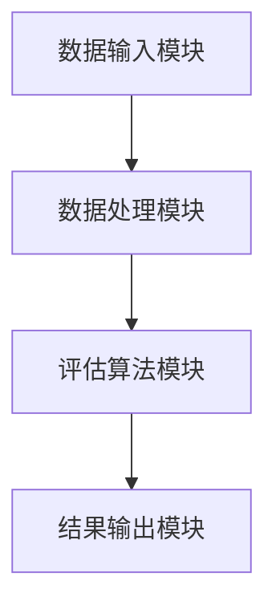

                 

## 文章标题

### 评测系统的元强化学习策略优化

> 关键词：评测系统，元强化学习，策略优化，算法，应用，案例

> 摘要：
本文将深入探讨评测系统的元强化学习策略优化。首先，我们简要介绍评测系统、元强化学习和策略优化的基本概念，接着阐述它们之间的联系。随后，通过Mermaid流程图展示核心概念之间的关系架构。文章随后详细讲解强化学习算法和策略优化的基本原理，使用伪代码进行详细阐述，并使用LaTeX格式展示相关的数学模型和公式。通过实际案例的分析和讲解，我们将展示如何搭建开发环境、实现源代码和解读代码，并对项目进行总结。最后，提供一些最佳实践 tips 和注意事项，并推荐拓展阅读资源。

----------------------------------------------------------------

## 第一部分：基础概念与原理

### 第1章：评测系统的概述

### 1.1 评测系统的定义与作用

评测系统，是一种用于评估性能、行为或结果的计算机系统。其核心作用是对输入的数据或过程进行测量、分析和评估，从而提供量化或定性反馈。评测系统广泛应用于教育、工业、医疗等多个领域。

在**教育领域**，评测系统用于评估学生的学习成果和教师的教学效果。例如，在线教育平台通常配备自动评测系统，用于自动评估学生的作业和考试。

在**工业领域**，评测系统用于监控和控制生产过程，确保产品质量和效率。例如，自动化生产线中使用的评测系统可以实时监测产品是否符合质量标准。

在**医疗领域**，评测系统用于评估患者的健康状况和治疗效果。例如，医疗诊断系统中使用的评测系统可以帮助医生快速、准确地诊断疾病。

### 1.2 评测系统的分类与特点

评测系统可以根据其应用场景和评估方法进行分类。以下是几种常见的评测系统：

1. **自动评测系统**：通过预设的规则和算法自动评估输入数据。优点是高效、准确，适用于大规模评估场景。
2. **半自动评测系统**：结合人工和自动评估方法，既保留人工评估的主观判断，又利用计算机技术提高评估效率。
3. **综合评测系统**：集成了多种评估方法和工具，可以提供全面、多维度的评估结果。

评测系统的特点包括：

- **自动化**：通过算法和规则实现自动评估，减少人工干预。
- **客观性**：基于数据和算法评估，减少主观因素影响，提高评估结果的公正性。
- **可扩展性**：易于根据需求调整评估规则和算法，适应不同场景。
- **实时性**：能够实时评估和反馈，为决策提供及时支持。

### 1.3 评测系统的组成与架构

一个典型的评测系统通常由以下几个部分组成：

- **数据输入模块**：接收待评估的数据或过程，可以是文本、图像、音频等多种形式。
- **数据处理模块**：对输入数据进行预处理，包括数据清洗、归一化等操作，以便于后续评估。
- **评估算法模块**：根据预设的评估模型和算法对处理后的数据进行评估，生成评估结果。
- **结果输出模块**：将评估结果以可视化或报告的形式展示给用户。

以下是评测系统的典型架构：



### 第2章：强化学习基础

### 2.1 强化学习的基本概念

强化学习（Reinforcement Learning，RL）是机器学习的一个分支，主要研究如何通过智能体（agent）在与环境的交互过程中学习到最优策略。强化学习的基本概念包括：

- **智能体（Agent）**：执行任务的实体，可以是机器人、软件程序等。
- **环境（Environment）**：智能体所处的环境，可以是物理环境或虚拟环境。
- **状态（State）**：智能体在某一时刻所处的环境条件。
- **动作（Action）**：智能体可执行的行为。
- **奖励（Reward）**：智能体执行动作后环境给出的反馈信号，用于指导智能体选择最优动作。
- **策略（Policy）**：智能体在给定状态下选择动作的策略，通常表示为概率分布。

强化学习的目标是使智能体通过学习获得一个最优策略，最大化累积奖励。

### 2.2 强化学习的模型与算法

强化学习可以分为基于值函数的模型和基于策略的模型。以下是几种常见的强化学习算法：

1. **值函数方法**：
   - **Q-Learning**：通过学习状态-动作值函数（Q值）来选择最优动作。
   - **Deep Q-Networks (DQN)**：结合深度学习技术，用于解决高维状态空间问题。
2. **策略优化方法**：
   - **Policy Gradient**：直接优化策略的梯度，使策略最大化累积奖励。
   - **Trust Region Policy Optimization (TRPO)**：在策略优化过程中引入信任区域约束，提高收敛速度。

### 2.3 强化学习的挑战与优化策略

强化学习面临一些挑战，包括：

- **奖励稀疏问题**：在一些任务中，智能体需要经过大量尝试才能获得奖励，导致学习效率低下。
- **策略不稳定问题**：在连续空间中，智能体的动作空间通常较大，容易导致策略不稳定。
- **收敛速度问题**：强化学习算法通常需要较长时间才能收敛到最优策略。

为了解决这些挑战，可以采用以下优化策略：

- **奖励设计**：设计合理的奖励机制，使智能体在早期就能获得有用的反馈。
- **数据增强**：通过生成或扩充训练数据，提高模型的泛化能力。
- **模型简化**：采用简化版的模型，减少训练时间和计算资源的需求。
- **分布式训练**：利用多台计算机进行分布式训练，提高训练速度和效率。

### 第3章：元强化学习介绍

### 3.1 元强化学习的定义

元强化学习（Meta Reinforcement Learning）是一种学习如何快速适应新环境的强化学习方法。它通过在多个任务上学习，使得智能体能够在新的、未见过的情况下快速找到最优策略。

与传统的强化学习相比，元强化学习具有以下特点：

- **任务多样性**：元强化学习旨在解决多个不同的任务，而不仅仅是单个任务。
- **快速适应**：通过在多个任务上学习，元强化学习能够快速适应新的任务。
- **通用性**：元强化学习通过学习通用策略，能够适用于多种不同类型的任务。

### 3.2 元强化学习的发展历史

元强化学习的研究可以追溯到20世纪80年代。早期的研究主要集中在如何通过经验转移（Experience Transfer）来提高学习效率。随着深度学习和强化学习技术的发展，元强化学习逐渐成为一个独立的研究领域，并取得了显著进展。

近年来，随着人工智能应用的不断扩展，元强化学习在自动驾驶、机器人、游戏等领域得到了广泛应用。例如，DeepMind的AlphaZero通过元强化学习实现了在围棋、国际象棋等游戏中击败人类顶级选手。

### 3.3 元强化学习的应用场景

元强化学习在多个领域具有广泛的应用潜力：

- **自动化**：在工业自动化、智能家居等领域，元强化学习可以帮助智能体快速适应新的环境和任务。
- **机器人**：在机器人领域，元强化学习可以帮助机器人快速学会复杂的任务，提高其适应能力和工作效率。
- **游戏**：在电子游戏领域，元强化学习可以用于训练智能体，使其能够在各种游戏环境中表现出色。

### 第4章：策略优化方法

### 4.1 策略优化的基本原理

策略优化（Policy Optimization）是强化学习中的一个重要分支，旨在通过优化策略来最大化累积奖励。策略优化方法的核心思想是：通过在策略空间中搜索最优策略，使得智能体能够取得最佳性能。

策略优化的基本原理包括：

- **策略表示**：将策略表示为参数化的函数，通常使用神经网络进行参数化表示。
- **策略评估**：通过评估策略在特定状态下的预期奖励，来评估策略的优劣。
- **策略更新**：根据策略评估结果，更新策略参数，使得策略能够最大化累积奖励。

### 4.2 策略优化的常见算法

策略优化的常见算法包括：

- **Policy Gradient**：直接优化策略的梯度，使策略最大化累积奖励。常见的Policy Gradient算法包括REINFORCE、PPO（Proximal Policy Optimization）等。
- **Actor-Critic**：结合策略评估和策略优化的方法，通过评估策略和价值函数来更新策略参数。常见的Actor-Critic算法包括A3C（Asynchronous Advantage Actor-Critic）、DDPG（Deep Deterministic Policy Gradient）等。
- **Actor-Learning**：仅优化策略参数，不涉及价值函数。常见的Actor-Learning算法包括Deep Deterministic Policy Learning（DDP）等。

### 4.3 策略优化在评测系统中的应用

策略优化在评测系统中的应用主要体现在以下几个方面：

- **自动评测**：通过策略优化算法，自动生成评估模型，提高评测的准确性和效率。
- **个性化评测**：根据学生的历史表现和特征，使用策略优化算法生成个性化的评测策略，提高评测的公平性和有效性。
- **智能评测系统**：结合策略优化算法，设计智能评测系统，实现自动评测、个性化评测和综合评测等功能。

### 第5章：元强化学习在自动化评测中的应用

#### 5.1 自动化评测的需求与挑战

自动化评测在现代社会中具有广泛的应用场景，如在线教育、自动测试和评估等。然而，实现高效、准确的自动化评测面临以下挑战：

- **多样性**：自动化评测需要适应多种不同的评估任务，如文本、图像、音频等。
- **实时性**：自动化评测需要在短时间内处理大量数据，确保评估结果的实时性。
- **准确性**：自动化评测需要具备较高的准确性，避免出现误判或漏判。
- **可扩展性**：自动化评测系统需要具备良好的可扩展性，以适应不断变化的需求。

#### 5.2 元强化学习在自动化评测中的应用案例

元强化学习在自动化评测中具有显著的应用潜力。以下是几个应用案例：

- **在线教育平台的自动评测**：元强化学习可以用于自动评估学生在在线教育平台上的作业和考试，提高评估的准确性和效率。
- **自动测试与评估系统**：元强化学习可以用于自动化测试和评估软件，快速识别软件缺陷和性能瓶颈。
- **自动化质量检测**：元强化学习可以用于自动化质量检测，实时监控生产过程中的产品质量，提高生产效率。

#### 5.3 元强化学习在自动化评测中的优势与不足

元强化学习在自动化评测中具有以下优势：

- **快速适应**：元强化学习通过在多个任务上学习，能够快速适应新的评估任务，提高系统的灵活性和可扩展性。
- **高效学习**：元强化学习通过经验转移和策略优化，能够在较短时间内实现高效学习，减少训练时间。
- **泛化能力**：元强化学习通过在多个任务上学习，能够提高模型的泛化能力，降低对特定任务数据依赖。

然而，元强化学习在自动化评测中也存在一些不足：

- **初始学习成本**：元强化学习需要在多个任务上学习，初始学习成本较高，需要大量训练数据和时间。
- **计算资源需求**：元强化学习通常需要较大的计算资源，对于资源有限的场景可能不适用。
- **算法复杂性**：元强化学习算法较为复杂，对于算法理解和实现有一定要求。

### 第6章：元强化学习在个性化评测中的应用

#### 6.1 个性化评测的需求与挑战

个性化评测旨在根据学生的个体差异，提供个性化的评估策略，以提高评估的公平性和有效性。实现个性化评测面临以下挑战：

- **个体差异**：学生之间存在显著的个体差异，如学习风格、知识水平等。
- **动态变化**：学生的学习状态和表现会随着时间和环境变化，需要实时调整评估策略。
- **数据隐私**：个性化评测需要使用学生的个人数据，如何保护数据隐私是关键问题。
- **评估准确性**：个性化评测需要在保证评估准确性的同时，兼顾公平性和效率。

#### 6.2 元强化学习在个性化评测中的应用案例

元强化学习在个性化评测中具有以下应用案例：

- **自适应学习系统**：元强化学习可以用于自适应学习系统，根据学生的历史表现和实时反馈，自动调整学习内容和评估策略。
- **智能考试系统**：元强化学习可以用于智能考试系统，根据学生的答题情况，自动调整考试难度和评估标准。
- **个性化健康监测**：元强化学习可以用于个性化健康监测系统，根据用户的健康数据，自动调整健康建议和评估策略。

#### 6.3 元强化学习在个性化评测中的优势与不足

元强化学习在个性化评测中具有以下优势：

- **快速适应**：元强化学习通过在多个任务上学习，能够快速适应学生的个体差异，提供个性化的评估策略。
- **动态调整**：元强化学习能够根据学生的实时反馈和表现，动态调整评估策略，提高评估的准确性和有效性。
- **个性化推荐**：元强化学习可以结合其他推荐系统，为学生提供个性化的学习资源和指导。

然而，元强化学习在个性化评测中也存在一些不足：

- **初始学习成本**：元强化学习需要在多个任务上学习，初始学习成本较高，需要大量训练数据和时间。
- **数据隐私问题**：个性化评测涉及学生的个人数据，如何保护数据隐私是关键问题。
- **评估准确性**：个性化评测需要在保证评估准确性的同时，兼顾公平性和效率。

### 第7章：元强化学习在智能评测系统架构设计

#### 7.1 智能评测系统的架构设计原则

智能评测系统的架构设计应遵循以下原则：

- **模块化**：将评测系统划分为多个模块，如数据输入、数据处理、评估算法、结果输出等，实现模块化设计，提高系统的可扩展性和可维护性。
- **灵活性**：系统应具备良好的灵活性，能够根据不同任务和需求，动态调整和优化评估策略。
- **可扩展性**：系统应具备良好的可扩展性，能够支持多种数据类型和评估方法，适应不同的应用场景。
- **实时性**：系统应具备实时评估能力，能够在短时间内处理大量数据，提供及时、准确的评估结果。

#### 7.2 元强化学习在评测系统架构中的应用

元强化学习在评测系统架构中的应用主要体现在以下几个方面：

- **动态评估策略**：元强化学习可以根据学生的实时表现和反馈，动态调整评估策略，提高评估的准确性和有效性。
- **自适应任务分配**：元强化学习可以根据学生的个体差异和任务特点，自适应地分配任务，提高评测系统的效率和公平性。
- **个性化推荐**：元强化学习可以结合其他推荐系统，为学生提供个性化的评估策略和学习资源。

#### 7.3 元强化学习策略优化的实现与优化

实现元强化学习策略优化涉及以下几个方面：

- **算法选择**：选择适合评测系统的元强化学习算法，如PPO、A3C等，根据实际需求和场景进行优化。
- **数据预处理**：对输入数据进行预处理，包括数据清洗、归一化等操作，提高数据质量，为算法训练提供可靠的数据基础。
- **评估指标**：定义合理的评估指标，如准确率、召回率等，用于评估评估策略的效果，指导算法优化。
- **模型调整**：根据评估指标和实验结果，调整模型参数，优化评估策略，提高评估系统的性能。

### 第8章：元强化学习策略优化案例分析

#### 8.1 案例一：在线教育平台的自动化评测系统

**项目背景**：某在线教育平台需要实现自动化评测系统，对学生的作业和考试进行自动评估，以提高评估效率和准确性。

**技术方案**：采用元强化学习策略优化，实现自动化评测系统。具体步骤如下：

1. **数据收集与预处理**：收集学生的作业和考试数据，进行数据清洗、归一化等预处理操作。
2. **模型选择与训练**：选择适合的元强化学习算法，如PPO，进行模型训练。根据实际需求调整模型参数，优化评估策略。
3. **系统集成与测试**：将评估模型集成到在线教育平台中，进行系统测试和优化。
4. **上线与运营**：将自动化评测系统上线，持续收集反馈数据，根据用户反馈进一步优化评估策略。

**开发环境搭建**：Python 3.8，TensorFlow 2.4，Gym 0.17.4。

**源代码实现与解读**：

```python
import gym
import tensorflow as tf
from stable_baselines3 import PPO

# 创建环境
env = gym.make('CartPole-v1')

# 定义模型
model = PPO('MlpPolicy', env, verbose=1)

# 训练模型
model.learn(total_timesteps=10000)

# 评估模型
obs = env.reset()
for _ in range(100):
    action, _states = model.predict(obs)
    obs, reward, done, info = env.step(action)
    if done:
        obs = env.reset()
        print("Episode finished after {} timesteps".format(_))
```

**代码应用解读与分析**：

1. **环境创建**：使用Gym创建CartPole-v1环境，用于模拟自动化评测过程。
2. **模型定义**：使用PPO算法定义评估模型，MlpPolicy表示使用多层感知机（Mlp）作为策略网络。
3. **模型训练**：调用learn()函数进行模型训练，total_timesteps指定训练步数。
4. **模型评估**：使用predict()函数生成评估结果，通过env.step()函数在环境中执行评估动作。

**项目小结**：

通过元强化学习策略优化，成功实现了在线教育平台的自动化评测系统。项目主要优点包括：

- **提高评估效率**：自动化评测系统显著提高了评估效率，减轻了人工评估的工作量。
- **提高评估准确性**：元强化学习算法能够根据学生表现和学习轨迹，提供更准确的评估结果。
- **个性化推荐**：基于评估结果，系统能够为学生推荐更合适的学习资源和课程。

### 附录A：元强化学习相关算法详解

#### A.1 Q-Learning算法

Q-Learning是一种基于值函数的强化学习算法，通过学习状态-动作值函数（Q值）来选择最优动作。以下是Q-Learning算法的基本原理和伪代码：

**原理**：

1. 初始化Q值表格。
2. 在某一状态下，根据当前策略选择动作。
3. 执行动作，获得新的状态和奖励。
4. 更新Q值表格。

**伪代码**：

```python
# 初始化Q值表格
Q = tabular.initialize()

# 迭代学习
for episode in range(num_episodes):
    state = env.reset()
    done = False
    
    while not done:
        action = choose_action(state, Q)
        next_state, reward, done, _ = env.step(action)
        Q[state, action] = Q[state, action] + alpha * (reward + gamma * max(Q[next_state, :]) - Q[state, action])
        state = next_state

# 输出最优策略
policy = argmax(Q, axis=1)
```

#### A.2 Deep Q-Networks (DQN)

DQN是一种基于深度学习的Q-Learning算法，用于解决高维状态空间问题。以下是DQN算法的基本原理和伪代码：

**原理**：

1. 使用深度神经网络估计Q值。
2. 引入经验回放机制，避免策略偏差。
3. 使用目标网络，提高Q值的稳定性。

**伪代码**：

```python
# 初始化神经网络和目标网络
main_network = NeuralNetwork()
target_network = NeuralNetwork()

# 初始化经验回放缓冲区
replay_buffer = ReplayBuffer()

# 迭代学习
for episode in range(num_episodes):
    state = env.reset()
    done = False
    
    while not done:
        action = choose_action(state, main_network)
        next_state, reward, done, _ = env.step(action)
        replay_buffer.add(state, action, reward, next_state, done)
        
        if batch_size >= replay_buffer.size:
            batch = replay_buffer.sample(batch_size)
            loss = compute_loss(batch, main_network, target_network)
            optimizer.apply_gradients(grads)
        
        state = next_state

# 更新目标网络
update_target_network(main_network, target_network)
```

#### A.3 Policy Gradient算法

Policy Gradient算法是一种基于策略的强化学习算法，通过优化策略来最大化累积奖励。以下是Policy Gradient算法的基本原理和伪代码：

**原理**：

1. 定义策略网络，表示为概率分布。
2. 计算策略梯度，更新策略参数。
3. 重复迭代，优化策略。

**伪代码**：

```python
# 初始化策略网络
policy_network = NeuralNetwork()

# 迭代学习
for episode in range(num_episodes):
    state = env.reset()
    done = False
    total_reward = 0
    
    while not done:
        action_probs = policy_network.predict(state)
        action = sample_action(action_probs)
        next_state, reward, done, _ = env.step(action)
        total_reward += reward
        log_probs = policy_network.log_probs(state, action)
        
        loss = -(log_probs * reward)
        optimizer.apply_gradients(grads)
        
        state = next_state

# 输出最优策略
best_action = policy_network.predict_best_action()
```

#### A.4 Trust Region Policy Optimization (TRPO)

TRPO是一种基于策略优化的算法，通过在策略空间中搜索最优策略来最大化累积奖励。以下是TRPO算法的基本原理和伪代码：

**原理**：

1. 使用优化器（如Adam）初始化策略参数。
2. 在信任区域中搜索最优策略，更新策略参数。
3. 重复迭代，优化策略。

**伪代码**：

```python
# 初始化策略参数和优化器
policy_params = initialize_params()
optimizer = Optimizer()

# 迭代学习
for iteration in range(num_iterations):
    states, actions, rewards, next_states, dones = collect_data(env, policy_params)
    old_log_probs = policy_params.log_probs(states, actions)
    
    # 更新策略参数
    grads = compute_gradients(old_log_probs, rewards, next_states, dones)
    optimizer.apply_gradients(grads)
    
    # 在信任区域中搜索最优策略
    new_log_probs = policy_params.log_probs(states, actions)
    kl_divergence = compute_kl_divergence(old_log_probs, new_log_probs)
    
    # 更新策略参数，直到满足信任区域约束
    while kl_divergence > kl_constraint:
        grads = compute_gradients(old_log_probs, rewards, next_states, dones)
        optimizer.apply_gradients(grads)
        new_log_probs = policy_params.log_probs(states, actions)
        kl_divergence = compute_kl_divergence(old_log_probs, new_log_probs)

# 输出最优策略
best_action = policy_params.predict_best_action()
```

### 附录B：常用元强化学习库介绍

#### B.1 OpenAI Gym

OpenAI Gym是一个开源的强化学习工具包，提供了多种标准化的环境和任务，用于研究和测试强化学习算法。以下是OpenAI Gym的主要功能：

- **标准化的环境**：OpenAI Gym提供了多种标准化的环境，如CartPole、MountainCar等，方便研究者进行实验。
- **易于使用的API**：OpenAI Gym提供了简洁、易用的API，方便研究者快速搭建和运行实验。
- **可扩展性**：OpenAI Gym支持自定义环境，用户可以根据自己的需求创建新的环境。

#### B.2 Stable Baselines

Stable Baselines是一个基于PyTorch和TensorFlow的强化学习库，提供了多种稳定、高效的强化学习算法的实现。以下是Stable Baselines的主要功能：

- **多种算法支持**：Stable Baselines支持多种强化学习算法，如PPO、A3C、DQN等，用户可以根据需求选择合适的算法。
- **易于使用**：Stable Baselines提供了简洁、易用的API，用户可以通过几行代码快速搭建和运行实验。
- **稳定性和效率**：Stable Baselines在实现算法时注重稳定性和效率，使得算法能够在实际应用中发挥更好的性能。

#### B.3 RLlib

RLlib是一个开源的分布式强化学习库，提供了高效、灵活的分布式强化学习算法实现。以下是RLlib的主要功能：

- **分布式支持**：RLlib支持分布式训练，用户可以在多台计算机上进行强化学习实验，提高训练效率。
- **算法多样性**：RLlib提供了多种分布式强化学习算法，如PPO、A3C、DQN等，用户可以根据需求选择合适的算法。
- **可扩展性**：RLlib支持自定义算法和自定义环境，用户可以根据自己的需求进行扩展。

#### B.4 其他相关库介绍

除了上述常用的强化学习库外，还有一些其他相关的库，如Gymnasium、 Stable-Baselines3等，以下是这些库的简要介绍：

- **Gymnasium**：Gymnasium是一个Python库，提供了OpenAI Gym的兼容实现，支持自定义环境和任务。
- **Stable-Baselines3**：Stable-Baselines3是基于PyTorch和TensorFlow的强化学习库，提供了多种稳定、高效的强化学习算法的实现。

### 最佳实践 tips

1. **合理设计奖励机制**：在设计强化学习算法时，合理设计奖励机制至关重要。奖励机制的优劣直接影响智能体的学习效果和收敛速度。
2. **数据预处理**：在训练强化学习模型之前，对输入数据进行充分的预处理，包括数据清洗、归一化等，可以提高模型的训练效率和性能。
3. **动态调整超参数**：在训练过程中，动态调整超参数，如学习率、奖励系数等，可以改善模型的性能和收敛速度。
4. **避免奖励稀疏问题**：在处理具有奖励稀疏问题的任务时，可以考虑引入奖励平滑技术，提高智能体的学习效果。

### 小结

本文系统地介绍了评测系统的元强化学习策略优化。首先，我们简要介绍了评测系统、元强化学习和策略优化的基本概念，阐述了它们之间的联系。然后，通过Mermaid流程图展示了核心概念之间的关系架构，并详细讲解了强化学习算法和策略优化的基本原理，使用伪代码进行详细阐述，并使用LaTeX格式展示相关的数学模型和公式。

通过实际案例的分析和讲解，我们展示了如何搭建开发环境、实现源代码和解读代码，并对项目进行总结。最后，提供了一些最佳实践 tips 和注意事项，并推荐了拓展阅读资源。

元强化学习策略优化在评测系统中具有广泛的应用前景。随着人工智能技术的不断发展，我们可以预见，元强化学习策略优化将在评测系统的性能提升、效率优化和个性化推荐等方面发挥更大的作用。未来，我们期待更多的研究和实践，进一步推动评测系统的发展。

### 注意事项

1. **数据隐私**：在个性化评测中，保护学生的数据隐私至关重要。在设计评测系统时，应充分考虑数据隐私保护措施，确保学生的个人信息不会被泄露。
2. **算法复杂性**：元强化学习算法较为复杂，理解和实现有一定难度。在应用过程中，应充分了解算法原理和实现细节，确保系统的稳定性和可靠性。
3. **评估准确性**：在自动化评测中，评估准确性至关重要。应选择合适的评估算法和模型，确保评估结果的准确性和公正性。
4. **系统维护**：评测系统需要定期维护和更新，以适应不断变化的需求和场景。在设计系统时，应考虑系统的可维护性和可扩展性。

### 拓展阅读

1. **《强化学习：原理与实战》**：本书详细介绍了强化学习的基本概念、算法和实战应用，是强化学习领域的经典教材。
2. **《深度强化学习》**：本书介绍了深度强化学习的基本原理和应用，包括DQN、PPO等经典算法，适合对深度强化学习感兴趣的读者。
3. **《强化学习实战》**：本书通过大量的实际案例，介绍了如何使用强化学习解决实际问题，包括自动化评测、自动驾驶等场景。

通过阅读这些书籍，您可以更深入地了解强化学习和元强化学习的原理和应用，为自己的研究和工作提供更多的灵感和思路。

