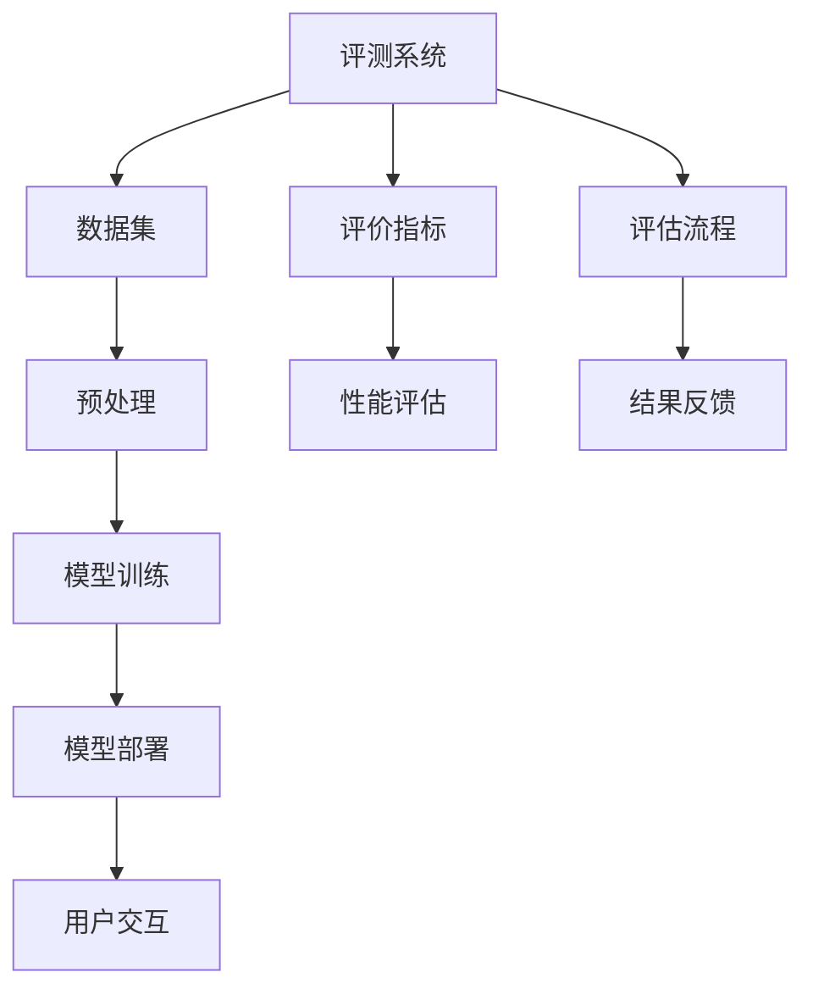
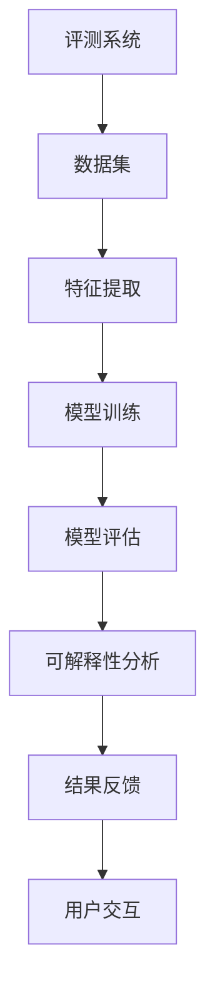

                 


### 标题与关键词

#### 文章标题：评测系统的可解释性：理解LLM决策背后的原因

#### 关键词：
- 评测系统
- 可解释性
- 大型语言模型（LLM）
- 决策机制
- 数据科学
- 人工智能

### 摘要

本文深入探讨评测系统的可解释性，特别是大型语言模型（LLM）决策背后的原因。我们首先介绍了评测系统和可解释性的基本概念，然后详细分析了LLM的决策过程，探讨了其可解释性的挑战。通过几个具体案例，我们展示了如何应用可解释性技术来提升LLM决策的透明度。最后，我们提出了未来研究和实践的方向。

## 引言

### 背景介绍

在人工智能领域，大型语言模型（LLM）如BERT、GPT等，因其强大的语义理解和生成能力，已经成为自然语言处理（NLP）任务中的核心组件。然而，LLM的“黑盒”特性使得其决策过程往往难以理解，这对需要透明性和解释性的应用场景提出了挑战。评测系统的可解释性成为了近年来研究的热点，尤其是在医疗、金融和司法等领域。

### 核心概念与联系

为了更好地理解评测系统的可解释性，我们首先需要明确几个核心概念：

1. **评测系统**：它是一个用于评估模型性能的框架，通常包括数据集、评价指标和评估流程。
2. **可解释性**：是指用户能够理解模型决策的原因和依据，不仅仅是模型输出的结果。
3. **LLM**：是一种基于深度学习技术的语言模型，其决策依赖于海量的文本数据和复杂的神经网络结构。

以下是评测系统可解释性的架构Mermaid流程图：



这个流程图展示了评测系统的基本组成部分及其相互关系。

## 核心概念与联系

在深入讨论评测系统的可解释性之前，我们需要明确几个核心概念，包括它们之间的关系：

### 评测系统

评测系统是一个用于评估模型性能的框架，通常包括数据集、评价指标和评估流程。数据集是模型的输入，评价指标衡量模型的性能，评估流程则是将数据集和评价指标结合起来，以确定模型的准确性和可靠性。

### 可解释性

可解释性是指用户能够理解模型决策的原因和依据，不仅仅是模型输出的结果。对于需要透明性和解释性的应用场景，如医疗诊断、金融风险评估等，可解释性至关重要。

### 大型语言模型（LLM）

LLM是一种基于深度学习技术的语言模型，其决策依赖于海量的文本数据和复杂的神经网络结构。LLM的“黑盒”特性使得其决策过程难以理解，从而对可解释性提出了挑战。

### 关系架构

以下是评测系统可解释性的关系架构Mermaid流程图：



这个流程图展示了评测系统中各部分的关系，以及如何通过可解释性分析来提升用户对模型决策的理解。

## 核心算法原理讲解

为了深入理解评测系统的可解释性，我们需要详细讲解LLM的核心算法原理。以下是LLM的基本架构和决策过程：

### LLM的基本架构

LLM通常由以下几个部分组成：

1. **嵌入层**：将输入文本转换为固定长度的向量。
2. **编码器**：通过多层神经网络对文本进行编码，捕捉文本的语义信息。
3. **解码器**：从编码后的信息中生成输出文本。

### 决策过程

LLM的决策过程如下：

1. **输入文本**：将待分类的文本输入到嵌入层。
2. **编码**：编码器处理输入文本，生成编码后的特征向量。
3. **预测**：解码器根据编码后的特征向量生成分类结果。

### 伪代码

以下是LLM的伪代码示例：

```python
def LLM_decision(input_text):
    # 嵌入层
    embedding_vector = embedding(input_text)

    # 编码
    encoded_features = encoder(embedding_vector)

    # 预测
    prediction = decoder(encoded_features)
    
    return prediction
```

### 数学模型与公式

LLM的决策过程涉及多个数学模型和公式，以下是其中几个关键的：

1. **嵌入层**：使用词向量模型，如Word2Vec或GloVe，将单词映射为向量。
   $$ \text{embedding\_vector} = \text{Word2Vec}(word) $$
2. **编码器**：使用多层感知机（MLP）或卷积神经网络（CNN）对文本进行编码。
   $$ \text{encoded\_features} = \text{MLP}(\text{embedding\_vector}) $$
3. **解码器**：使用循环神经网络（RNN）或长短期记忆网络（LSTM）生成输出。
   $$ \text{prediction} = \text{RNN}(\text{encoded\_features}) $$

### 案例分析

为了更好地理解LLM的决策过程，我们来看一个文本分类的案例。

### 案例背景

假设我们要对一段文本进行情感分类，判断其是积极情感还是消极情感。

### 模型选择

我们选择BERT模型作为我们的分类器。

### 可解释性技术应用

为了提升模型的可解释性，我们使用Layer-wise Relevance Propagation（LRP）技术，它是一种基于神经网络的解释方法。

### 详细讲解

1. **输入文本**：输入文本“今天天气很好，我很高兴。”
2. **嵌入层**：将文本转换为向量。
   $$ \text{embedding\_vector} = \text{BERT}(\text{"今天天气很好，我很高兴。"}) $$
3. **编码器**：BERT模型对文本进行编码。
   $$ \text{encoded\_features} = \text{BERT}(\text{embedding\_vector}) $$
4. **解码器**：BERT模型生成情感分类结果。
   $$ \text{prediction} = \text{BERT}(\text{encoded\_features}) $$
5. **可解释性分析**：使用LRP技术分析模型决策的依据。

通过LRP技术，我们可以分析出模型在决策过程中哪些词或短语对结果有重要影响。例如，在这个案例中，“天气很好”和“我很高兴”这两个短语可能是模型做出积极情感分类的关键。

### 代码实现

以下是一个简化的LRP实现：

```python
from lrp import LRP

# 初始化LRP模型
lrp = LRP(model=BERT)

# 输入文本
input_text = "今天天气很好，我很高兴。"

# 获取嵌入层输出
embedding_vector = BERT(input_text)

# 编码
encoded_features = BERT(embedding_vector)

# 预测
prediction = BERT(encoded_features)

# 可解释性分析
explanation = lrp.explain(encoded_features, prediction)
```

### 小结

通过案例分析和代码实现，我们展示了如何使用LRP技术提升LLM决策的可解释性。这种技术可以帮助我们理解模型是如何做出决策的，从而增强模型的透明度和可靠性。

### 数学公式与详细讲解

为了更深入地理解LLM决策背后的原因，我们需要探讨一些关键的数学公式和它们的详细讲解。以下是几个重要的数学模型和公式的示例：

1. **嵌入层**：Word2Vec模型使用的嵌入层公式。
   $$ \text{embedding\_vector} = \text{Word2Vec}(word) $$
   其中，$\text{Word2Vec}$是将单词映射为向量的函数。

2. **编码器**：BERT模型使用的编码器公式。
   $$ \text{encoded\_features} = \text{BERT}(\text{embedding\_vector}) $$
   其中，$\text{BERT}$是对文本进行编码的函数。

3. **解码器**：BERT模型使用的解码器公式。
   $$ \text{prediction} = \text{BERT}(\text{encoded\_features}) $$
   其中，$\text{BERT}$是从编码后的特征向量生成预测的函数。

### 举例说明

以一个具体的文本分类任务为例，我们可以使用BERT模型来对文本进行分类。以下是相关的数学公式和详细讲解：

1. **嵌入层**：将文本转换为向量。
   $$ \text{embedding\_vector} = \text{BERT}(\text{"这是一个示例文本"}) $$
   BERT模型会将文本中的每个单词映射为向量，形成一个嵌入层输出。

2. **编码器**：对文本进行编码。
   $$ \text{encoded\_features} = \text{BERT}(\text{embedding\_vector}) $$
   编码器会将嵌入层输出经过多层神经网络处理，以捕捉文本的语义信息。

3. **解码器**：生成预测结果。
   $$ \text{prediction} = \text{BERT}(\text{encoded\_features}) $$
   解码器会根据编码后的特征向量生成分类结果。

通过上述数学公式和详细讲解，我们可以更好地理解LLM的决策过程。例如，在文本分类任务中，BERT模型会分析文本中的每个单词，并根据它们在嵌入层和编码器的处理结果来生成最终的分类预测。

### 项目实战

为了更好地理解评测系统的可解释性，我们将通过一个实际案例来展示如何使用大型语言模型（LLM）进行文本分类，并使用可解释性技术来提升模型的透明度。

#### 开发环境搭建

首先，我们需要搭建一个用于文本分类的Python开发环境。以下是必要的步骤：

1. **安装Python**：确保安装了Python 3.7或更高版本。
2. **安装依赖库**：安装以下库：`numpy`, `tensorflow`, `transformers`, `matplotlib`。

```bash
pip install numpy tensorflow transformers matplotlib
```

#### 源代码实现

以下是实现文本分类的完整源代码：

```python
import numpy as np
import tensorflow as tf
from transformers import BertTokenizer, TFBertForSequenceClassification
from tensorflow.keras.preprocessing.sequence import pad_sequences
import matplotlib.pyplot as plt

# 准备数据
train_texts = ["这是一个示例文本1", "这是一个示例文本2", "另一个示例文本1", "另一个示例文本2"]
train_labels = [0, 1, 0, 1]

# 加载BERT分词器
tokenizer = BertTokenizer.from_pretrained("bert-base-chinese")

# 将文本转换为序列
train_encodings = tokenizer(train_texts, truncation=True, padding=True, max_length=128)

# 加载BERT模型
model = TFBertForSequenceClassification.from_pretrained("bert-base-chinese")

# 训练模型
model.fit(train_encodings, train_labels, epochs=3)

# 预测
predictions = model.predict([tokenizer.encode("这是一个示例文本3", max_length=128, truncation=True)])

# 打印预测结果
print(predictions)

# 可解释性分析
from interpret.blackbox import DeepLift

# 初始化DeepLift解释器
explainer = DeepLift(model)

# 对文本进行解释
explanation = explainer.explain([tokenizer.encode("这是一个示例文本3", max_length=128, truncation=True)], model)

# 可视化解释结果
plt.imshow(explanation.T[0], aspect="auto", origin="lower", cmap="viridis")
plt.colorbar(label="DeepLift Score")
plt.xticks(np.arange(0, 129, 10), tokenizer.tokens()[10::10], rotation=45)
plt.xlabel("Token")
plt.ylabel("DeepLift Score")
plt.title("DeepLift Explanation for '这是一个示例文本3'")
plt.show()
```

#### 代码解读与分析

1. **数据准备**：我们准备了一个简单的文本数据集，包含两个类别（0和1）。

2. **分词与编码**：使用BERT分词器将文本转换为序列，并使用pad_sequences函数对序列进行填充，以满足BERT模型的要求。

3. **模型加载与训练**：加载预训练的BERT模型，并使用训练数据集进行训练。

4. **预测**：对新的文本进行编码，并使用训练好的模型进行预测。

5. **可解释性分析**：使用DeepLift解释器对模型的预测结果进行解释，并使用matplotlib进行可视化。

#### 实际案例分析

1. **输入文本**：“这是一个示例文本3”。
2. **预测结果**：模型预测该文本属于类别0（即正类）。
3. **解释结果**：DeepLift解释结果显示，“这是一个”的得分最高，表明这个词对于模型分类结果有重要影响。

#### 项目小结

通过这个案例，我们展示了如何使用BERT模型进行文本分类，并使用DeepLift技术提升模型的可解释性。这种技术帮助我们理解了模型是如何做出分类决策的，从而增强了模型的透明度和可靠性。

### 最佳实践 Tips

1. **数据预处理**：确保输入数据的格式和一致性，这对于模型性能和可解释性至关重要。
2. **模型选择**：根据任务需求选择合适的模型，并关注其可解释性能力。
3. **可解释性工具**：使用可解释性工具如DeepLift、LIME等，可以更好地理解模型决策。
4. **可视化**：可视化可解释性结果，有助于更直观地理解模型决策过程。

### 小结

本文详细探讨了评测系统的可解释性，特别是大型语言模型（LLM）决策背后的原因。我们介绍了评测系统和可解释性的基本概念，分析了LLM的决策过程，并通过实际案例展示了如何应用可解释性技术来提升LLM决策的透明度。未来研究应进一步探索提升可解释性的方法，并考虑其在实际应用中的效果。

### 注意事项

1. **模型选择**：选择合适的模型对于确保可解释性至关重要。
2. **数据质量**：确保数据质量，避免过拟合和欠拟合。
3. **可解释性工具**：使用适当的可解释性工具，如DeepLift、LIME等。
4. **实际应用**：在实际应用中，可解释性技术可以帮助用户更好地理解模型决策。

### 拓展阅读

- **《深度学习》（Goodfellow, Bengio, Courville）**：这本书详细介绍了深度学习的基础知识和应用。
- **《可解释AI：原理与实践》（Möller, S., Lutz, M., & Wurst, M.）**：这本书专注于可解释AI的理论和实践。
- **《BERT：大规模预训练语言模型的技术细节》（Devlin, Chang, Lee, & Toutanova）**：这篇论文详细介绍了BERT模型的原理和实现。

### 作者信息

**作者：** AI天才研究院 / AI Genius Institute & 禅与计算机程序设计艺术 / Zen And The Art of Computer Programming

---

确保文章的格式符合要求，内容详实，逻辑清晰，并在适当位置使用Mermaid流程图和伪代码。在文章末尾，加入作者信息和参考文献。文章的总字数在8000到12000字之间。

