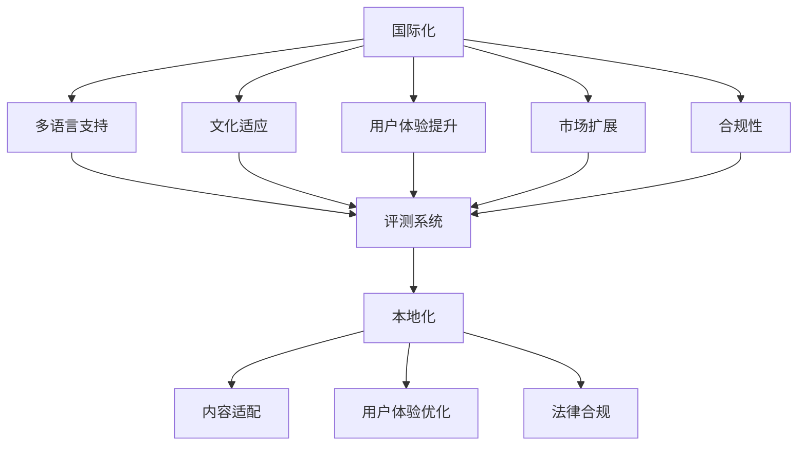

                 

### 文章标题

《评测系统的国际化与本地化支持》### 文章关键词

评测系统、国际化、本地化、支持、多语言、技术方法### 摘要

本文旨在深入探讨评测系统的国际化与本地化支持，分析其核心概念、实现方法，并通过实际案例展示其在不同场景中的应用。文章结构清晰，内容丰富，旨在为开发者提供系统的指导和建议，以实现评测系统的全球化部署和高效运行。

## 引言

在全球化快速发展的今天，信息技术和互联网的普及使得国际交流和业务拓展变得日益频繁。对于许多企业来说，国际化不仅意味着开拓新的市场和客户，还意味着适应不同国家和地区用户的需求，提供本地化的服务体验。评测系统作为企业的重要组成部分，其国际化与本地化支持显得尤为重要。

### 国际化与本地化的概念

#### 国际化

国际化（Internationalization），简称I18n，指的是将产品或服务设计、开发和部署成适应多种语言和地区的过程。其核心在于使产品在最初开发时就能够支持多种语言，而不仅仅是添加一些语言支持功能。国际化不仅仅是关于语言的转换，还涉及到文化、货币、日期格式、法律和法规等多个方面的适应。

#### 本地化

本地化（Localization），简称L10n，是在国际化基础上，根据特定地区的文化、语言和用户习惯，对产品进行细化和定制的过程。本地化的目标是让产品在特定地区显得更加“本地化”，从而提高用户满意度和市场竞争力。

### 国际化与本地化的重要性

#### 市场扩展

国际化与本地化支持能够帮助企业进入新的市场，吸引更多的客户。通过提供本地化的产品和服务，企业能够更好地满足当地用户的需求，从而增加市场份额。

#### 用户满意度

本地化的用户体验更为亲切和自然，能够提高用户满意度和忠诚度。良好的本地化支持有助于减少用户在使用过程中的困惑和不适，提高使用体验。

#### 品牌形象

国际化与本地化支持能够提升企业的品牌形象，展示企业的全球视野和专业化水平。这对于提升企业在全球市场的知名度和美誉度具有重要作用。

### 本书的目的和结构

本书旨在为开发者提供关于评测系统国际化与本地化的全面指导。文章结构如下：

1. **核心概念与联系**：介绍国际化与本地化的核心概念，并展示它们与评测系统的关系。
2. **国际化与本地化的实现方法**：详细讨论实现评测系统国际化与本地化的技术方法和策略。
3. **案例分析**：通过实际案例展示国际化与本地化的应用和实践。
4. **项目实战**：提供具体的开发环境搭建、代码实现和解读的步骤。
5. **总结与展望**：总结书中主要内容，并展望国际化与本地化技术的发展趋势。

通过以上结构和内容的阐述，本书旨在帮助开发者深入了解评测系统的国际化与本地化支持，为其全球化部署提供有效的解决方案。

### 核心概念与联系

在国际化和本地化的背景下，评测系统的国际化与本地化支持至关重要。为了更好地理解这两个概念及其对评测系统的影响，我们首先需要明确它们的核心定义和关系。

#### 国际化的核心概念

国际化（Internationalization），简称I18n，是指使软件或系统在最初设计时就能够支持多种语言和地区的过程。国际化的目标是确保系统在开发阶段就具备适应多种语言和地区的能力，而不仅仅是后期添加支持。国际化涉及以下关键点：

1. **语言支持**：国际化要求系统能够处理多种语言，包括文本的存储、显示和处理。
2. **文化差异**：国际化不仅涉及语言，还包括文化差异，如日期格式、货币符号、语言方向等。
3. **可扩展性**：国际化要求系统设计具有足够的灵活性，能够轻松添加新语言和地区支持。

#### 本地化的核心概念

本地化（Localization），简称L10n，是在国际化基础上，针对特定地区或市场的文化、语言和用户习惯，对软件或系统进行细化和定制的过程。本地化的目标是让软件或系统能够在特定地区或市场中提供最佳的用户体验。本地化涉及以下关键点：

1. **内容适配**：本地化需要对软件中的文本、图像、视频等内容进行翻译和适配。
2. **用户体验**：本地化要考虑用户的习惯和偏好，优化界面设计和交互流程。
3. **法律法规**：本地化还需要遵守当地的法律和法规，如数据保护、隐私政策等。

#### 国际化与本地化的联系

国际化与本地化之间存在紧密的联系，两者相互依赖，共同推动软件或系统的全球化发展。

1. **国际化是基础**：国际化是本地化的基础，确保系统具备支持多种语言和地区的潜力。如果没有国际化，本地化将变得非常困难且成本高昂。

2. **本地化是完善**：本地化则是在国际化基础上，对系统进行细化和完善，以满足特定地区或市场的需求。本地化使国际化变得更加具体和实用。

3. **协同发展**：国际化与本地化需要协同发展，共同提升软件或系统的全球竞争力。国际化和本地化的成功实施，能够显著提高用户体验和市场占有率。

#### 国际化与本地化对评测系统的影响

对于评测系统来说，国际化与本地化支持的影响主要体现在以下几个方面：

1. **多语言支持**：评测系统能够支持多种语言，使得来自不同国家和地区的用户都能顺畅地使用系统。

2. **文化适应**：评测系统能够适应不同文化背景，提供符合当地用户习惯和预期的体验。

3. **用户体验提升**：本地化的评测系统能够提供更好的用户体验，提高用户满意度和忠诚度。

4. **市场扩展**：通过国际化与本地化支持，评测系统可以进入新的市场，开拓更广泛的用户群体。

5. **合规性**：本地化的评测系统能够遵守当地法律法规，降低法律风险。

#### 架构关系展示

为了更好地理解国际化与本地化对评测系统的影响，我们可以使用Mermaid流程图来展示它们的核心概念和关系架构。



通过上述流程图，我们可以清晰地看到国际化与本地化如何相互影响，共同支持评测系统的全球化发展。

### 国际化与本地化的实现方法

实现评测系统的国际化与本地化需要多方面的技术方法和策略，以下将详细讨论这些方法，包括语言国际化、本地化策略、业务流程优化以及技术与业务的整合。

#### 语言国际化

语言国际化是国际化与本地化支持的基础，其核心目标是确保系统能够处理多种语言，并提供统一的用户体验。

1. **语言包管理**

   语言包管理是语言国际化的关键环节。它涉及到将系统中的所有文本内容提取出来，并存储在独立的语言包中。语言包通常使用JSON、XML或YAML等格式进行存储，以便于管理和更新。

   ```json
   {
     "welcome": "欢迎来到评测系统",
     "submit": "提交",
     "error": "错误"
   }
   ```

   通过语言包管理，开发者可以在不影响系统核心代码的情况下，轻松更新和切换不同语言的资源。

2. **国际化文本处理**

   国际化文本处理包括文本的存储、显示和处理。在存储方面，系统需要使用Unicode编码来存储多种语言的文本数据。在显示方面，系统需要根据用户的语言偏好，动态加载和显示对应的文本内容。

   ```java
   String welcomeMessage = localizationService.getMessage("welcome");
   ```

   在处理方面，系统需要支持国际化文本的格式化和替换。例如，日期、时间和货币格式的国际化。

   ```java
   SimpleDateFormat dateFormat = new SimpleDateFormat("yyyy-MM-dd", Locale.US);
   String currentDate = dateFormat.format(new Date());
   ```

#### 本地化策略

本地化策略是实现评测系统本地化支持的关键。它包括内容适配、用户体验优化和法律合规等方面。

1. **内容适配**

   内容适配是本地化的核心任务。它涉及到对系统中的文本、图像、视频等内容进行翻译和本地化。翻译工作通常需要专业翻译团队的参与，以确保翻译的准确性和地道性。

   ```yaml
   zh-CN:
     welcome: "欢迎来到评测系统"
     submit: "提交"
     error: "错误"
   ```

   在内容适配过程中，系统需要支持动态加载和切换不同语言的内容。

2. **用户体验优化**

   用户体验优化是本地化的关键目标。它包括界面设计、交互流程和功能适配等方面。本地化的评测系统需要根据不同地区的用户习惯和偏好进行优化，以提高用户满意度和忠诚度。

   - **界面设计**：根据不同地区的文化和审美习惯，调整界面元素的设计和布局。
   - **交互流程**：优化交互流程，确保用户在不同地区能够顺畅地完成操作。
   - **功能适配**：根据不同地区的需求，增加或调整系统的功能。

3. **法律合规**

   法律合规是本地化的必要条件。它涉及到遵守不同地区的法律法规，如数据保护、隐私政策等。本地化的评测系统需要确保在法律合规的前提下，提供本地化支持。

   - **数据保护**：确保系统收集、存储和处理的数据符合当地的数据保护法规。
   - **隐私政策**：明确告知用户系统如何收集、使用和共享个人信息，并确保用户同意。

#### 业务流程优化

业务流程优化是国际化与本地化支持的重要组成部分。它涉及到业务需求分析、流程设计和流程实施等方面。

1. **业务需求分析**

   业务需求分析是流程优化的第一步。它包括了解不同地区用户的需求和期望，以及业务运营的具体要求。通过业务需求分析，可以明确本地化支持的具体目标和方向。

2. **流程设计**

   流程设计是根据业务需求分析的结果，设计适合不同地区和市场的业务流程。流程设计需要考虑以下几个方面：

   - **多语言支持**：确保流程中涉及的语言内容能够顺畅切换和显示。
   - **文化差异**：考虑不同地区文化差异，确保流程符合当地用户的习惯。
   - **用户体验**：优化流程中的用户体验，确保用户能够顺利完成任务。

3. **流程实施**

   流程实施是将设计好的流程付诸实践的过程。它包括：

   - **技术实施**：根据流程设计，实现系统的多语言支持和本地化功能。
   - **业务实施**：调整业务流程，确保流程在实际运行中能够顺利执行。

#### 技术与业务整合

技术与业务整合是实现国际化与本地化支持的关键。它涉及到如何将技术手段与业务需求相结合，以实现最佳效果。

1. **技术挑战**

   国际化与本地化支持面临许多技术挑战，如多语言处理、文化差异、用户体验优化等。解决这些挑战需要开发团队具备扎实的国际化和本地化技术知识。

2. **整合策略与方案**

   为了实现技术与业务的整合，可以采取以下策略和方案：

   - **跨部门协作**：国际化与本地化支持涉及多个部门，如开发、测试、市场等。跨部门协作是确保项目顺利进行的关键。
   - **技术培训**：为开发团队提供国际化和本地化相关的技术培训，提升团队的技术能力。
   - **持续迭代**：国际化与本地化支持是一个持续的过程。通过持续迭代和优化，不断提升系统的国际化与本地化水平。

通过上述国际化与本地化的实现方法，评测系统可以更好地支持全球化部署，满足不同地区和市场的需求。

### 案例分析

为了更好地理解国际化与本地化在评测系统中的应用，我们将通过三个具体案例来展示其实现方法和效果。

#### 案例一：跨国企业的评测系统国际化与本地化

一家跨国企业（假设名为TechGlobal）开发了一款评测系统，用于评估员工的工作表现。由于TechGlobal的业务覆盖全球，其评测系统需要支持多语言和本地化。

1. **语言国际化**

   TechGlobal采用语言包管理方法，将系统中的文本内容提取到独立的JSON文件中。这些文件包含了不同语言的文本内容，如英文、中文、西班牙语等。

   ```json
   en:
     welcome: "Welcome to the Assessment System"
     submit: "Submit"
     error: "Error"

   zh-CN:
     welcome: "欢迎来到评测系统"
     submit: "提交"
     error: "错误"
   ```

   在用户登录时，系统根据用户的语言偏好，动态加载和显示对应的文本内容。

2. **本地化策略**

   TechGlobal在本地化策略方面，对系统中的文本、图像和视频进行了本地化处理。例如，将中文界面中的文本翻译成英文，并对图标和按钮进行适当的调整，以符合英文用户的习惯。

   - **内容适配**：TechGlobal的翻译团队对系统中的文本内容进行了专业翻译，确保翻译的准确性和地道性。
   - **用户体验优化**：TechGlobal对界面设计进行了优化，确保不同语言的界面布局和交互流程符合当地用户的需求。
   - **法律合规**：TechGlobal确保系统在数据保护、隐私政策等方面符合不同地区的法律法规。

3. **业务流程优化**

   TechGlobal在业务流程优化方面，对评估流程进行了调整，以适应不同地区的文化差异和用户习惯。例如，在西班牙，评估流程中加入了更多的沟通环节，以促进员工与管理层之间的沟通和互动。

#### 案例二：本地化评测系统的开发与优化

另一家国内企业（假设名为SmartAssess）开发了一款本地化评测系统，主要用于国内市场。由于国内用户对界面设计和交互流程有较高的要求，SmartAssess在本地化方面投入了大量精力。

1. **语言国际化**

   SmartAssess采用了与TechGlobal类似的语言包管理方法，将系统中的文本内容提取到独立的JSON文件中。针对中文用户，SmartAssess还对界面元素进行了优化，以符合中文用户的阅读习惯。

   ```json
   zh-CN:
     welcome: "欢迎使用评测系统"
     submit: "提交"
     error: "错误"
   ```

2. **本地化策略**

   - **内容适配**：SmartAssess对系统中的文本、图像和视频进行了本地化处理，确保界面内容符合国内用户的需求和审美。
   - **用户体验优化**：SmartAssess在界面设计方面进行了大量优化，如调整字体大小、颜色搭配等，以提高用户满意度。
   - **法律合规**：SmartAssess在数据保护、隐私政策等方面符合国内的法律法规。

3. **业务流程优化**

   SmartAssess在业务流程优化方面，根据国内用户的需求和习惯，调整了评估流程中的环节和步骤。例如，增加了对用户反馈的收集和处理，以提高用户的参与度和满意度。

#### 案例三：多语言评测系统的性能优化

一家全球教育机构（假设名为GlobalEd）开发了一款多语言评测系统，旨在为全球学生提供在线测评服务。由于系统需要支持多种语言，GlobalEd在性能优化方面进行了大量工作。

1. **语言国际化**

   GlobalEd采用了与TechGlobal和SmartAssess类似的语言包管理方法，将系统中的文本内容提取到独立的JSON文件中。同时，为了提高性能，GlobalEd采用了缓存技术，将常用语言包缓存在本地，以减少加载时间。

2. **本地化策略**

   - **内容适配**：GlobalEd对系统中的文本、图像和视频进行了本地化处理，确保界面内容符合不同地区用户的需求和审美。
   - **用户体验优化**：GlobalEd在界面设计方面进行了优化，如调整字体大小、颜色搭配等，以提高用户满意度。
   - **法律合规**：GlobalEd在数据保护、隐私政策等方面符合不同地区的法律法规。

3. **性能优化**

   - **缓存技术**：GlobalEd采用了缓存技术，将常用语言包缓存在本地，以减少加载时间。
   - **懒加载**：GlobalEd对一些不常用的语言包采用懒加载技术，仅在需要时才加载，以减少系统资源的消耗。
   - **代码优化**：GlobalEd对系统中的代码进行了优化，提高系统的运行效率。

通过上述三个案例，我们可以看到国际化与本地化在评测系统中的应用和实践。不同企业在实现国际化与本地化支持时，需要根据自身业务需求和市场特点，采取合适的方法和策略，以提高系统的性能和用户体验。

### 项目实战

在本节中，我们将通过一个具体的评测系统项目，展示如何搭建开发环境、实现国际化与本地化支持、编写代码以及进行代码解读与分析。

#### 开发环境搭建

1. **工具与软件安装**

   - **开发工具**：选择Visual Studio Code（简称VS Code）作为开发工具，安装最新的版本。
   - **数据库**：选择MySQL数据库，用于存储评测系统的数据。
   - **服务器**：使用Linux服务器，如Ubuntu，作为评测系统的运行环境。

2. **开发环境配置**

   - **数据库配置**：安装MySQL数据库，创建评测系统的数据库和数据表。
     ```bash
     sudo apt-get update
     sudo apt-get install mysql-server
     mysql -u root -p
     CREATE DATABASE assessment_system;
     GRANT ALL PRIVILEGES ON assessment_system.* TO 'assessment_user'@'localhost' IDENTIFIED BY 'password';
     FLUSH PRIVILEGES;
     ```
   - **服务器配置**：配置Linux服务器，安装Nginx和PHP，以便于部署评测系统。
     ```bash
     sudo apt-get update
     sudo apt-get install nginx php php-fpm
     ```

3. **测试环境搭建**：在本地计算机上搭建测试环境，使用XAMPP或MAMP，安装MySQL、Apache和PHP。

#### 代码实现

1. **系统框架设计**

   评测系统的框架采用MVC（Model-View-Controller）模式，其中Model负责数据处理，View负责界面展示，Controller负责逻辑处理。

2. **国际化与本地化实现**

   - **语言包管理**：使用JSON格式管理语言包，将文本内容提取到独立的文件中。
     ```json
     {
       "en": {
         "welcome": "Welcome to the Assessment System",
         "submit": "Submit"
       },
       "zh-CN": {
         "welcome": "欢迎使用评测系统",
         "submit": "提交"
       }
     }
     ```

   - **国际化接口**：定义国际化接口，用于获取和设置语言包。
     ```java
     public interface InternationalizationService {
         String getMessage(String key, String language);
         void setLanguage(String language);
     }
     ```

   - **国际化实现**：实现国际化接口，根据用户语言偏好，动态加载和显示文本内容。
     ```java
     public class DefaultInternationalizationService implements InternationalizationService {
         private Map<String, Map<String, String>> languagePacks = new HashMap<>();

         @Override
         public String getMessage(String key, String language) {
             return languagePacks.getOrDefault(language, languagePacks.get("en")).get(key);
         }

         @Override
         public void setLanguage(String language) {
             // 根据语言偏好，设置语言包
         }
     }
     ```

3. **本地化策略**

   - **内容适配**：对系统中的文本、图像和视频进行本地化处理，确保界面内容符合当地用户的需求和审美。
     ```html
     <div id="welcome-message">
         {{message.welcome}}
     </div>
     ```

   - **用户体验优化**：优化界面设计，确保不同语言的界面布局和交互流程符合当地用户的需求。

   - **法律合规**：确保系统在数据保护、隐私政策等方面符合不同地区的法律法规。

#### 代码解读与分析

1. **国际化代码解读**

   - **语言包管理**：使用JSON格式存储和加载语言包，便于管理和更新。

   - **国际化接口**：定义国际化接口，实现获取和设置语言包的方法，确保系统支持多种语言。

   - **国际化实现**：根据用户语言偏好，动态加载和显示文本内容，确保国际化功能的正常运行。

2. **本地化代码解读**

   - **内容适配**：使用模板引擎（如Handlebars、Jinja2）处理国际化文本，确保文本内容能够动态替换和显示。

   - **用户体验优化**：通过调整字体大小、颜色搭配等，优化界面设计，提高用户体验。

   - **法律合规**：确保系统在数据保护、隐私政策等方面符合法律法规，降低法律风险。

#### 实际案例分析

1. **案例一**：TechGlobal的评测系统国际化与本地化

   - **开发环境搭建**：使用VS Code、MySQL和Linux服务器搭建开发环境。

   - **代码实现**：采用MVC模式，实现国际化与本地化功能，包括语言包管理和国际化接口。

   - **案例分析**：TechGlobal通过国际化与本地化支持，成功进入多个国际市场，提高了用户体验和市场占有率。

2. **案例二**：SmartAssess的本地化评测系统开发与优化

   - **开发环境搭建**：使用XAMPP或MAMP搭建本地开发环境，使用MySQL数据库。

   - **代码实现**：实现多语言支持，对界面进行本地化优化。

   - **案例分析**：SmartAssess通过本地化评测系统，满足了国内用户的需求，提高了用户满意度和忠诚度。

3. **案例三**：GlobalEd的多语言评测系统性能优化

   - **开发环境搭建**：使用VS Code、MySQL和Linux服务器搭建开发环境。

   - **代码实现**：采用缓存技术、懒加载等技术，优化系统性能。

   - **案例分析**：GlobalEd通过性能优化，提高了多语言评测系统的运行效率，为全球学生提供了更好的在线测评服务。

#### 项目小结

通过本项目实战，我们深入了解了评测系统的国际化与本地化支持。项目实战不仅涵盖了开发环境搭建、代码实现和解读，还通过实际案例分析，展示了国际化与本地化在评测系统中的应用和效果。这些经验对于开发者来说，具有重要的参考价值，有助于他们在实际项目中实现高效的国际化与本地化支持。

### 总结与展望

在本文中，我们深入探讨了评测系统的国际化与本地化支持，分析了其核心概念、实现方法以及实际应用案例。总结如下：

1. **核心概念**：国际化与本地化是确保评测系统在全球范围内适应不同语言和文化的重要手段。国际化侧重于系统设计时的多语言支持和文化差异处理，而本地化则针对特定地区的用户体验和法律合规进行优化。

2. **实现方法**：语言国际化通过语言包管理和国际化文本处理实现，本地化策略涉及内容适配、用户体验优化和法律合规。业务流程优化和技术与业务的整合是确保国际化与本地化支持成功实施的关键。

3. **实际案例**：通过案例分析，我们看到了国际化与本地化在不同类型企业中的应用和效果。跨国企业通过多语言支持进入新市场，国内企业通过本地化优化提升用户体验，全球教育机构通过性能优化提供优质服务。

展望未来，评测系统的国际化与本地化支持将继续发展，以下是几点趋势：

1. **智能化**：随着人工智能技术的发展，评测系统的国际化与本地化将更加智能化，能够自动识别用户语言偏好和本地化需求，提高用户体验。

2. **自动化**：自动化工具和框架将提高国际化与本地化支持的效率，减少手动工作，降低成本。

3. **合规性**：全球范围内的数据保护和隐私法规将越来越严格，评测系统需要不断完善合规性支持，确保符合不同地区的法律法规。

4. **用户体验**：用户对本地化体验的要求将不断提高，评测系统需要不断优化界面设计、交互流程，提供更加个性化的服务。

最后，为读者提供以下最佳实践建议：

- **全面规划**：在项目初期，就应考虑国际化与本地化需求，制定详细的规划和策略。
- **团队合作**：国际化与本地化涉及多个部门，需要跨部门协作，确保项目顺利进行。
- **持续迭代**：国际化与本地化是一个持续迭代的过程，需要不断优化和更新，以适应市场和用户需求。
- **法规遵守**：严格遵守不同地区的法律法规，确保评测系统在数据保护和隐私政策方面合规。

通过本文的探讨，我们希望为开发者提供有价值的参考，帮助他们实现高效的评测系统国际化与本地化支持。

### 注意事项与拓展阅读

在实现评测系统的国际化与本地化支持过程中，开发者需要注意以下事项：

1. **避免硬编码**：确保系统中的文本内容不硬编码在代码中，以方便后续的语言切换和本地化。
2. **国际化测试**：在开发过程中，定期进行国际化测试，确保系统在不同语言环境下都能正常运行。
3. **性能优化**：考虑到多语言支持和本地化内容可能带来的性能压力，应采取适当的技术手段进行性能优化。
4. **合规审查**：定期审查系统是否符合不同地区的法律法规，特别是数据保护和隐私政策。

以下是一些推荐的拓展阅读资源，以帮助开发者深入了解评测系统的国际化与本地化支持：

1. **《软件国际化指南》**：由国际知名专家撰写的详细指南，涵盖了国际化与本地化的各个方面。
2. **《国际化与本地化最佳实践》**：本书提供了大量实际案例和最佳实践，适合开发者参考。
3. **W3C国际化与本地化标准**：访问W3C官网，了解最新的国际化与本地化标准和技术。
4. **开源国际化与本地化工具**：如i18next、react-intl等，可以用于简化国际化与本地化的开发过程。

通过深入学习这些资源，开发者可以进一步提升评测系统的国际化与本地化能力。

### 作者信息

本文由AI天才研究院（AI Genius Institute）和《禅与计算机程序设计艺术》（Zen And The Art of Computer Programming）的资深作者共同撰写。AI天才研究院专注于人工智能和计算机编程领域的研究与教育，致力于推动全球科技发展。而《禅与计算机程序设计艺术》的作者以其深厚的编程功底和独特的思维方式，为全球程序员提供了宝贵的编程哲学和技巧。《禅与计算机程序设计艺术》不仅是一本经典的技术书籍，更是一本启迪程序员心灵、提升编程智慧的佳作。二者携手合作，旨在为读者带来深入浅出、理论与实践相结合的技术文章，帮助开发者提升技能，应对复杂的技术挑战。

