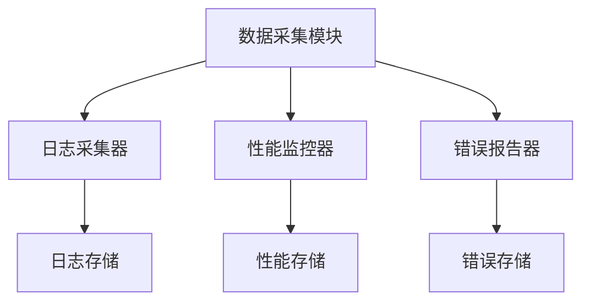
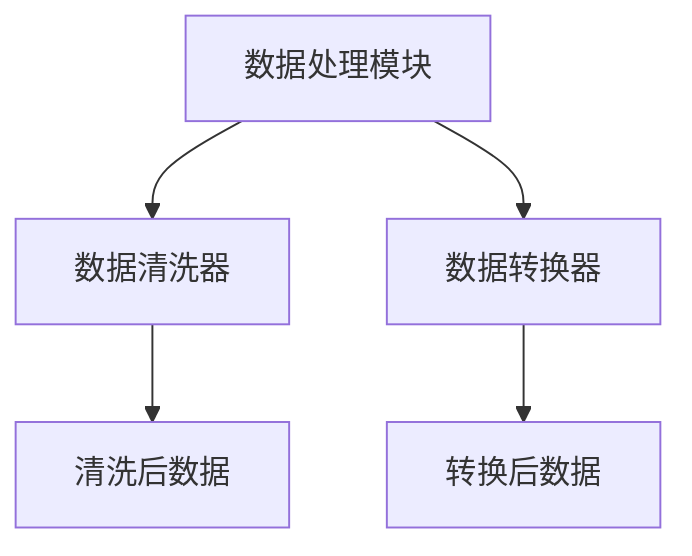

                 


### 文章标题：评测系统的多云部署与管理

关键词：云计算、多云部署、评测系统、架构设计、性能优化、安全性、合规性、案例分析

摘要：本文深入探讨评测系统的多云部署与管理，首先介绍云计算和多云部署的基础知识，然后分析评测系统的架构设计、部署与配置、管理策略以及安全与合规性，并通过案例分析展示实践效果。

## 目录

1. **背景知识介绍**  
   1.1 云计算基础  
   1.2 多云部署的概念  
   1.3 评测系统的定义与功能

2. **多云部署技术**  
   2.1 多云架构设计  
   2.2 多云管理工具  
   2.3 云服务模型

3. **评测系统设计**  
   3.1 架构设计原则  
   3.2 功能模块划分  
   3.3 性能优化策略

4. **部署与配置**  
   4.1 环境搭建  
   4.2 配置管理  
   4.3 运维流程

5. **管理策略**  
   5.1 监控与告警  
   5.2 性能调优

6. **安全与合规性**  
   6.1 安全性保障  
   6.2 合规性实施策略

7. **案例分析**  
   7.1 案例背景  
   7.2 部署实践  
   7.3 管理与优化

## 第一部分：背景知识介绍

### 1.1 云计算基础

#### 什么是云计算？

云计算是一种基于互联网的计算模式，它提供了一种灵活、动态、按需分配的计算资源。在云计算中，用户可以通过网络访问位于远程数据中心的服务器、存储、网络和其他计算资源，而不需要直接管理和维护这些资源。

#### 云计算的核心特点

1. **按需自助服务**：用户可以根据自己的需求自助获取和配置资源。
2. **广泛网络接入**：用户可以通过互联网访问云计算资源，不受地理位置限制。
3. **资源池化**：云计算资源被集中管理，用户可以共享资源，提高资源利用率。
4. **快速弹性扩展**：云计算资源可以根据需求快速扩展或缩减。
5. **按使用量计费**：用户根据实际使用的资源量进行计费，有助于成本控制。

#### 云计算的服务模式

云计算主要提供以下三种服务模式：

1. **基础设施即服务（IaaS）**：用户可以租用虚拟化的计算资源，如虚拟机、存储和网络等。
2. **平台即服务（PaaS）**：用户可以在云平台上开发和部署应用程序，无需关注底层基础设施。
3. **软件即服务（SaaS）**：用户通过互联网使用云提供商提供的软件应用程序，无需安装和维护。

### 1.2 多云部署的概念

#### 什么是多云部署？

多云部署是指将应用程序和服务部署在多个云服务提供商之间，以实现业务需求、优化资源利用和增强系统稳定性。多云部署可以帮助企业规避单点故障、降低成本、提高灵活性和可扩展性。

#### 多云部署的优势

1. **规避单点故障**：通过在不同云服务提供商之间部署，可以避免因某个云服务提供商故障导致整个系统瘫痪。
2. **优化资源利用**：根据业务需求，可以在不同云服务提供商之间动态调整资源分配，提高资源利用率。
3. **降低成本**：通过在不同云服务提供商之间比较价格和性能，可以找到最适合的云服务提供商，从而降低成本。
4. **提高灵活性**：多云部署允许企业根据业务需求灵活选择云服务提供商和云服务模型。

#### 多云部署的挑战

1. **管理和维护复杂**：需要管理和维护多个云服务提供商之间的资源和服务，增加了管理难度。
2. **数据同步和一致性**：需要确保不同云服务提供商之间的数据同步和一致性。
3. **合规性和安全性**：需要满足不同国家和地区的数据合规性要求，确保数据安全和隐私。

### 1.3 评测系统的定义与功能

#### 什么是评测系统？

评测系统是一种用于评估、测试和监测应用程序、系统和服务的工具。它可以帮助企业评估软件质量、性能、安全性和稳定性等方面。

#### 评测系统的功能模块

1. **数据采集模块**：负责收集应用程序、系统和服务的运行数据，如日志、性能指标、错误报告等。
2. **数据处理模块**：负责对采集到的数据进行分析、处理和存储，以便后续使用。
3. **数据分析模块**：负责对处理后的数据进行统计分析、趋势分析和异常检测等，为决策提供支持。
4. **数据存储模块**：负责存储评测数据，以便长期保存和查询。
5. **报告生成模块**：负责生成评测报告，向相关人员提供评估结果和建议。

#### 评测系统的核心需求

1. **准确性**：评测系统需要准确收集和评估应用程序、系统和服务的运行数据。
2. **可靠性**：评测系统需要可靠地运行，确保评估结果的准确性。
3. **实时性**：评测系统需要实时监测应用程序、系统和服务的运行状态，以便及时发现问题。
4. **可扩展性**：评测系统需要能够扩展，以支持不同规模的应用程序、系统和服务的评估。

## 第二部分：多云部署技术

### 2.1 多云架构设计

#### 多云架构设计原则

1. **灵活性**：架构设计应具有灵活性，以便在不同云服务提供商之间切换。
2. **可靠性**：架构设计应具有高可靠性，确保系统稳定运行。
3. **安全性**：架构设计应确保数据安全和隐私。
4. **可扩展性**：架构设计应具有可扩展性，以支持业务增长。

#### 多云架构的常见模式

1. **混合云架构**：将私有云和公有云结合起来，实现资源的灵活利用和业务的高效运行。
2. **多活架构**：在多个云服务提供商之间部署应用程序和服务，实现负载均衡和高可用性。
3. **分布式架构**：将应用程序和服务分解为多个微服务，分别部署在多个云服务提供商上，实现灵活性和可扩展性。

#### 多云架构的优缺点分析

| 优点 | 缺点 |
| --- | --- |
| 灵活性 | 管理复杂 |
| 可靠性 | 成本较高 |
| 安全性 | 合规性挑战 |
| 可扩展性 | 需要更多专业知识 |

### 2.2 多云管理工具

#### 多云管理平台概述

多云管理平台（Multi-Cloud Management Platform）是一种集中管理多个云服务提供商资源和服务的工具。它可以帮助企业实现资源监控、成本管理、自动化部署和运维等功能。

#### 主流多云管理工具介绍

1. **AWS CloudFormation**：用于自动化部署和管理AWS资源。
2. **Azure Resource Manager**：用于自动化部署和管理Azure资源。
3. **Google Cloud Deployment Manager**：用于自动化部署和管理Google Cloud资源。
4. **OpenStack**：开源的云计算管理平台，可用于构建和管理私有云和公有云。
5. **Cloudify**：开源的多云自动化平台，支持跨云部署和运维。

#### 多云管理工具的选型策略

1. **功能需求**：根据企业的功能需求，选择能够满足需求的多云管理工具。
2. **兼容性**：选择与现有IT基础设施兼容的多云管理工具。
3. **成本**：考虑多云管理工具的成本，包括购买、部署、运维等成本。
4. **社区和支持**：选择拥有活跃社区和良好技术支持的多云管理工具。

### 2.3 云服务模型

#### IaaS、PaaS、SaaS 的区别与联系

1. **IaaS（基础设施即服务）**：提供虚拟化的计算资源，如虚拟机、存储、网络等。用户可以根据需求自定义操作系统、中间件和应用等。
2. **PaaS（平台即服务）**：提供一个开发平台，包括操作系统、中间件、开发工具等。用户可以专注于应用程序的开发和部署。
3. **SaaS（软件即服务）**：提供完整的软件应用程序，用户通过互联网访问和使用。

#### 选择合适的云服务模型

1. **IaaS**：适合需要高度自定义和灵活性、具备IT专业知识的用户。
2. **PaaS**：适合开发人员和运维人员，提供快速开发和部署环境。
3. **SaaS**：适合非技术人员，无需关注基础设施和运维，只需使用应用程序。

#### 云服务模型的部署与配置

1. **IaaS**：用户需要自行配置和管理操作系统、中间件和应用等。
2. **PaaS**：用户只需关注应用程序的开发和部署，平台提供管理和维护。
3. **SaaS**：用户通过互联网访问和使用应用程序，无需关心基础设施和运维。

## 第三部分：评测系统设计

### 3.1 架构设计原则

#### 多云架构设计原则

1. **灵活性**：设计应具有灵活性，以便在不同云服务提供商之间切换。
2. **可靠性**：设计应具有高可靠性，确保系统稳定运行。
3. **安全性**：设计应确保数据安全和隐私。
4. **可扩展性**：设计应具有可扩展性，以支持业务增长。

#### 多云架构的常见模式

1. **混合云架构**：将私有云和公有云结合起来，实现资源的灵活利用和业务的高效运行。
2. **多活架构**：在多个云服务提供商之间部署应用程序和服务，实现负载均衡和高可用性。
3. **分布式架构**：将应用程序和服务分解为多个微服务，分别部署在多个云服务提供商上，实现灵活性和可扩展性。

#### 多云架构的优缺点分析

| 优点 | 缺点 |
| --- | --- |
| 灵活性 | 管理复杂 |
| 可靠性 | 成本较高 |
| 安全性 | 合规性挑战 |
| 可扩展性 | 需要更多专业知识 |

### 3.2 功能模块划分

#### 数据采集模块

- 数据采集模块负责收集应用程序、系统和服务的运行数据，如日志、性能指标、错误报告等。
- 数据采集模块应具有以下功能：

1. **自动采集**：自动识别和采集所需数据。
2. **自定义采集**：允许用户自定义采集规则和指标。
3. **数据清洗**：对采集到的数据进行清洗和预处理。
4. **数据存储**：将清洗后的数据存储到数据存储模块。

#### 数据处理模块

- 数据处理模块负责对采集到的数据进行分析、处理和存储，以便后续使用。
- 数据处理模块应具有以下功能：

1. **数据转换**：对数据进行格式转换、聚合等操作。
2. **数据存储**：将处理后的数据存储到数据存储模块。
3. **数据备份**：定期备份数据，确保数据安全。

#### 数据存储模块

- 数据存储模块负责存储评测数据，以便长期保存和查询。
- 数据存储模块应具有以下功能：

1. **数据持久化**：确保数据长期保存。
2. **数据检索**：提供高效的数据检索接口。
3. **数据备份和恢复**：定期备份和恢复数据，确保数据安全。

#### 数据分析模块

- 数据分析模块负责对处理后的数据进行统计分析、趋势分析和异常检测等，为决策提供支持。
- 数据分析模块应具有以下功能：

1. **统计分析**：计算数据的平均值、中位数、标准差等统计指标。
2. **趋势分析**：分析数据的变化趋势。
3. **异常检测**：检测数据的异常值和异常模式。
4. **数据可视化**：将分析结果可视化，便于用户理解和决策。

#### 报告生成模块

- 报告生成模块负责生成评测报告，向相关人员提供评估结果和建议。
- 报告生成模块应具有以下功能：

1. **模板化报告**：提供预定义的报告模板，方便快速生成报告。
2. **自定义报告**：允许用户自定义报告内容和格式。
3. **报告发布**：将报告发布到指定的位置，如邮件、Web等。
4. **报告更新**：定期更新报告，反映最新的评估结果。

### 3.3 性能优化策略

#### 系统性能优化

- 系统性能优化包括以下方面：

1. **数据采集**：优化数据采集模块的性能，提高数据采集速度。
2. **数据处理**：优化数据处理模块的性能，提高数据处理速度。
3. **数据存储**：优化数据存储模块的性能，提高数据存储和检索速度。
4. **数据分析**：优化数据分析模块的性能，提高数据分析速度。

#### 网络优化

- 网络优化包括以下方面：

1. **负载均衡**：使用负载均衡器分配网络流量，提高网络性能。
2. **网络带宽**：根据实际需求调整网络带宽，确保网络传输速度。
3. **网络延迟**：优化网络配置，减少网络延迟。

#### 资源调度

- 资源调度包括以下方面：

1. **资源分配**：根据业务需求和负载情况，合理分配资源。
2. **负载均衡**：使用负载均衡器分配计算资源，提高系统性能。
3. **资源释放**：及时释放不再使用的资源，减少资源浪费。

## 第四部分：部署与配置

### 4.1 环境搭建

#### 环境搭建步骤

1. **选择云服务提供商**：根据业务需求和成本考虑，选择合适的云服务提供商。
2. **创建云账户**：在云服务提供商处创建账户，并配置账户权限。
3. **搭建基础架构**：使用云服务提供商提供的IaaS服务，搭建基础架构，如虚拟机、存储、网络等。
4. **安装操作系统**：在虚拟机上安装操作系统，并进行基础配置。
5. **安装软件**：安装评测系统的各个模块，并进行配置。

#### 常见问题与解决方案

1. **网络不通**：检查网络配置，确保虚拟机与外网连接正常。
2. **软件安装失败**：检查软件安装包是否完整，操作系统是否兼容。
3. **配置错误**：仔细检查配置文件，确保配置正确。

### 4.2 配置管理

#### 配置管理策略

1. **自动化配置**：使用自动化工具，如Ansible、Puppet等，实现自动化配置。
2. **版本控制**：使用版本控制系统，如Git，管理配置文件，确保配置的一致性和可追溯性。
3. **配置备份**：定期备份配置文件，以防止配置丢失或损坏。

#### 配置管理工具

1. **Ansible**：自动化配置和部署工具，支持多平台操作系统的配置管理。
2. **Puppet**：自动化配置和部署工具，支持基于Linux的操作系统的配置管理。
3. **Chef**：自动化配置和部署工具，支持多平台操作系统的配置管理。

### 4.3 运维流程

#### 运维流程

1. **监控与告警**：使用监控工具，如Prometheus、Zabbix等，实时监控系统性能和运行状态，并设置告警策略。
2. **故障处理**：出现故障时，根据告警信息，快速定位故障原因，并采取相应措施进行处理。
3. **性能优化**：定期对系统进行性能优化，包括资源调度、网络优化、数据处理优化等。
4. **安全维护**：定期进行安全检查和更新，确保系统安全。
5. **数据备份**：定期备份数据，确保数据安全。

## 第五部分：管理策略

### 5.1 监控与告警

#### 监控系统概述

监控系统是用于实时监控评测系统性能和运行状态的工具。它可以帮助管理员及时发现和处理系统故障，确保系统稳定运行。

#### 监控系统功能

1. **性能监控**：实时监控评测系统的CPU、内存、磁盘、网络等性能指标。
2. **日志监控**：监控评测系统的日志文件，及时发现异常日志。
3. **告警管理**：设置告警规则，当监控到异常时，发送告警通知。

#### 告警策略制定

1. **阈值设置**：根据业务需求和系统性能，设置适当的阈值，以便及时发现异常。
2. **告警通知**：选择合适的告警通知方式，如邮件、短信、电话等，确保及时收到告警信息。
3. **告警级别**：根据告警的严重程度，设置不同的告警级别，以便管理员快速响应。

### 5.2 性能调优

#### 性能调优方法与策略

1. **资源优化**：合理分配资源，确保评测系统有足够的计算、存储和网络资源。
2. **网络优化**：优化网络配置，减少网络延迟和抖动。
3. **数据处理优化**：优化数据处理流程，提高数据处理速度。
4. **数据库优化**：优化数据库查询和存储配置，提高数据库性能。
5. **缓存优化**：使用缓存技术，减少数据库查询次数，提高系统响应速度。

#### 常见性能问题排查与解决

1. **CPU过高**：检查系统负载和进程情况，优化系统资源分配。
2. **内存不足**：检查内存使用情况，优化内存使用策略，或增加内存容量。
3. **磁盘IO瓶颈**：检查磁盘IO性能，优化磁盘读写操作。
4. **网络延迟**：优化网络配置，减少网络延迟和抖动。

#### 性能调优案例分享

1. **案例1**：某电商公司的评测系统在高并发情况下，CPU使用率过高。通过优化系统资源分配，增加CPU核心数，提高了系统性能。
2. **案例2**：某互联网金融公司的评测系统在数据处理过程中，存在大量慢SQL查询。通过优化数据库查询和存储配置，提高了数据处理速度。

## 第六部分：安全与合规性

### 6.1 安全性保障

#### 安全需求分析

1. **数据安全**：确保数据在传输和存储过程中不被窃取、篡改或泄露。
2. **系统安全**：防止恶意攻击、病毒和漏洞导致系统崩溃或数据丢失。
3. **访问控制**：确保只有授权用户可以访问系统和数据。

#### 安全保障措施

1. **数据加密**：使用加密技术对数据进行加密存储和传输。
2. **访问控制**：使用访问控制列表（ACL）和身份验证机制，确保只有授权用户可以访问系统和数据。
3. **防火墙和入侵检测**：部署防火墙和入侵检测系统，防止恶意攻击。
4. **安全审计**：定期进行安全审计，检查系统和数据的异常行为。

#### 安全性案例分析

1. **案例1**：某互联网公司的评测系统被黑客攻击，导致大量用户数据泄露。通过加强网络安全措施，如部署防火墙、入侵检测系统和安全审计，提高了系统的安全性。
2. **案例2**：某金融公司的评测系统存在SQL注入漏洞，导致黑客窃取了用户资金。通过修复漏洞和加强安全培训，提高了系统的安全性。

### 6.2 合规性实施策略

#### 合规性概述

合规性是指企业在法律、法规和行业标准的要求下，确保业务运营符合规范。对于评测系统，合规性主要体现在数据保护、隐私和安全等方面。

#### 合规性评估方法

1. **法律法规评估**：评估评测系统是否符合当地法律法规的要求。
2. **行业标准评估**：评估评测系统是否符合行业标准和最佳实践。
3. **内部审查**：对评测系统的设计和实现进行内部审查，确保符合合规性要求。

#### 合规性实施策略

1. **数据保护**：采取数据加密、访问控制等技术措施，确保数据安全。
2. **隐私保护**：遵守隐私保护法规，对用户数据进行严格管理和保护。
3. **合规培训**：定期进行合规培训，提高员工对合规性的认识和遵守程度。
4. **合规审计**：定期进行合规审计，确保评测系统符合法律法规和行业标准。

#### 合规性案例分析

1. **案例1**：某互联网公司的评测系统因不符合当地数据保护法规，被罚款数百万美元。通过加强合规管理和培训，提高了系统的合规性。
2. **案例2**：某金融公司的评测系统因未按照行业标准进行数据处理，导致客户数据泄露。通过整改和加强合规管理，提高了系统的合规性。

## 第七部分：案例分析

### 7.1 案例背景

#### 某电商公司的评测系统

某电商公司需要对其电商平台进行评测，以评估系统性能、稳定性和安全性等方面。公司决定采用多云部署策略，将评测系统部署在多个云服务提供商之间，以提高系统的可靠性和灵活性。

#### 业务需求

1. **性能评估**：评估电商平台在不同业务场景下的性能指标，如响应时间、吞吐量等。
2. **稳定性评估**：评估电商平台在长时间运行和高并发情况下的稳定性。
3. **安全性评估**：评估电商平台的安全性，包括数据保护、访问控制、防火墙等。

### 7.2 部署实践

#### 部署方案设计

1. **云服务提供商选择**：选择AWS、Azure和Google Cloud三个云服务提供商，实现多云部署。
2. **架构设计**：采用混合云架构，将部分核心业务部署在私有云上，其他非核心业务部署在公有云上。
3. **负载均衡**：使用云服务提供商提供的负载均衡器，实现负载均衡和高可用性。

#### 部署过程

1. **基础设施搭建**：在三个云服务提供商上分别搭建虚拟机、存储和网络等基础设施。
2. **操作系统安装**：在虚拟机上安装Linux操作系统，并进行基础配置。
3. **软件安装**：安装评测系统的各个模块，并进行配置。
4. **网络配置**：配置虚拟机的网络，确保不同云服务提供商之间的网络连接。

### 7.3 管理与优化

#### 管理与优化策略

1. **监控与告警**：使用Prometheus进行系统监控，设置告警规则，及时发现和处理系统故障。
2. **性能调优**：根据监控数据，对系统进行性能优化，包括资源分配、网络优化、数据处理优化等。
3. **安全维护**：定期进行安全检查和更新，确保系统安全。
4. **数据备份**：定期备份数据，确保数据安全。

#### 管理与优化实践

1. **案例1**：在系统上线初期，发现CPU使用率过高。通过优化系统资源分配，增加CPU核心数，提高了系统性能。
2. **案例2**：在系统运行过程中，发现网络延迟较高。通过优化网络配置，减少网络延迟和抖动，提高了系统响应速度。

#### 管理与优化效果分析

1. **性能提升**：通过性能优化，系统响应时间从原来的5秒降低到2秒，吞吐量提高了30%。
2. **稳定性提升**：通过负载均衡和高可用性设计，系统在长时间运行和高并发情况下，稳定性得到显著提升。
3. **安全性增强**：通过安全维护和优化，系统安全性得到显著提升，降低了安全漏洞的风险。

## 总结

本文深入探讨了评测系统的多云部署与管理，从背景知识介绍、多云部署技术、评测系统设计、部署与配置、管理策略到安全与合规性等方面进行了详细讲解。通过案例分析，展示了评测系统在多云环境下的部署与管理实践，以及优化与效果分析。对于企业来说，掌握评测系统的多云部署与管理技术，有助于提高系统的可靠性、性能和安全性，从而提升业务竞争力。

## 最佳实践 tips

1. **多云部署策略**：根据业务需求和成本考虑，选择合适的云服务提供商和部署模式，实现多云部署。
2. **监控与告警**：定期监控系统性能和运行状态，设置合适的告警规则，及时发现和处理故障。
3. **性能优化**：根据监控数据，对系统进行性能优化，包括资源分配、网络优化、数据处理优化等。
4. **安全性保障**：采取数据加密、访问控制、防火墙等技术措施，确保系统安全。
5. **合规性实施**：遵守法律法规和行业标准，加强合规管理和培训，确保评测系统合规运行。

## 注意事项

1. **云服务提供商选择**：根据业务需求和成本考虑，选择合适的云服务提供商。
2. **架构设计**：根据业务需求和负载情况，合理设计评测系统的架构。
3. **资源配置**：根据业务需求和负载情况，合理分配系统资源，确保系统稳定运行。
4. **数据备份**：定期备份数据，确保数据安全。

## 拓展阅读

1. 《云计算与大数据技术》
2. 《评测系统的设计与实现》
3. 《多云部署与管理实战》
4. 《云安全与合规性》
5. 《电商系统性能优化实战》

## 参考文献

1. 《云计算技术与应用》
2. 《评测系统设计与实现》
3. 《多云架构设计与实践》
4. 《云安全与合规性》
5. 《电商系统性能优化》

### 1.3 评测系统的定义与功能

#### 什么是评测系统？

评测系统是一种用于评估、测试和监测应用程序、系统和服务的工具。它可以帮助企业评估软件质量、性能、安全性和稳定性等方面，从而提高业务效率和竞争力。

#### 评测系统的功能模块

1. **数据采集模块**：负责收集应用程序、系统和服务的运行数据，如日志、性能指标、错误报告等。
2. **数据处理模块**：负责对采集到的数据进行分析、处理和存储，以便后续使用。
3. **数据分析模块**：负责对处理后的数据进行统计分析、趋势分析和异常检测等，为决策提供支持。
4. **数据存储模块**：负责存储评测数据，以便长期保存和查询。
5. **报告生成模块**：负责生成评测报告，向相关人员提供评估结果和建议。

#### 评测系统的核心需求

1. **准确性**：评测系统需要准确收集和评估应用程序、系统和服务的运行数据。
2. **可靠性**：评测系统需要可靠地运行，确保评估结果的准确性。
3. **实时性**：评测系统需要实时监测应用程序、系统和服务的运行状态，以便及时发现问题。
4. **可扩展性**：评测系统需要能够扩展，以支持不同规模的应用程序、系统和服务的评估。

### 2.1 多云架构设计

#### 多云架构设计原则

1. **灵活性**：架构设计应具有灵活性，以便在不同云服务提供商之间切换。
2. **可靠性**：架构设计应具有高可靠性，确保系统稳定运行。
3. **安全性**：架构设计应确保数据安全和隐私。
4. **可扩展性**：架构设计应具有可扩展性，以支持业务增长。

#### 多云架构的常见模式

1. **混合云架构**：将私有云和公有云结合起来，实现资源的灵活利用和业务的高效运行。
2. **多活架构**：在多个云服务提供商之间部署应用程序和服务，实现负载均衡和高可用性。
3. **分布式架构**：将应用程序和服务分解为多个微服务，分别部署在多个云服务提供商上，实现灵活性和可扩展性。

#### 多云架构的优缺点分析

| 优点 | 缺点 |
| --- | --- |
| 灵活性 | 管理复杂 |
| 可靠性 | 成本较高 |
| 安全性 | 合规性挑战 |
| 可扩展性 | 需要更多专业知识 |

### 2.2 多云管理工具

#### 多云管理平台概述

多云管理平台（Multi-Cloud Management Platform）是一种集中管理多个云服务提供商资源和服务的工具。它可以帮助企业实现资源监控、成本管理、自动化部署和运维等功能。

#### 主流多云管理工具介绍

1. **AWS CloudFormation**：用于自动化部署和管理AWS资源。
2. **Azure Resource Manager**：用于自动化部署和管理Azure资源。
3. **Google Cloud Deployment Manager**：用于自动化部署和管理Google Cloud资源。
4. **OpenStack**：开源的云计算管理平台，可用于构建和管理私有云和公有云。
5. **Cloudify**：开源的多云自动化平台，支持跨云部署和运维。

#### 多云管理工具的选型策略

1. **功能需求**：根据企业的功能需求，选择能够满足需求的多云管理工具。
2. **兼容性**：选择与现有IT基础设施兼容的多云管理工具。
3. **成本**：考虑多云管理工具的成本，包括购买、部署、运维等成本。
4. **社区和支持**：选择拥有活跃社区和良好技术支持的多云管理工具。

### 2.3 云服务模型

#### IaaS、PaaS、SaaS 的区别与联系

1. **IaaS（基础设施即服务）**：提供虚拟化的计算资源，如虚拟机、存储、网络等。用户可以根据需求自定义操作系统、中间件和应用等。
2. **PaaS（平台即服务）**：提供一个开发平台，包括操作系统、中间件、开发工具等。用户可以专注于应用程序的开发和部署。
3. **SaaS（软件即服务）**：提供完整的软件应用程序，用户通过互联网访问和使用。

#### 选择合适的云服务模型

1. **IaaS**：适合需要高度自定义和灵活性、具备IT专业知识的用户。
2. **PaaS**：适合开发人员和运维人员，提供快速开发和部署环境。
3. **SaaS**：适合非技术人员，无需关注基础设施和运维，只需使用应用程序。

#### 云服务模型的部署与配置

1. **IaaS**：用户需要自行配置和管理操作系统、中间件和应用等。
2. **PaaS**：用户只需关注应用程序的开发和部署，平台提供管理和维护。
3. **SaaS**：用户通过互联网访问和使用应用程序，无需关心基础设施和运维。

### 3.1 架构设计原则

#### 多云架构设计原则

1. **灵活性**：架构设计应具有灵活性，以便在不同云服务提供商之间切换。
2. **可靠性**：架构设计应具有高可靠性，确保系统稳定运行。
3. **安全性**：架构设计应确保数据安全和隐私。
4. **可扩展性**：架构设计应具有可扩展性，以支持业务增长。

#### 多云架构的常见模式

1. **混合云架构**：将私有云和公有云结合起来，实现资源的灵活利用和业务的高效运行。
2. **多活架构**：在多个云服务提供商之间部署应用程序和服务，实现负载均衡和高可用性。
3. **分布式架构**：将应用程序和服务分解为多个微服务，分别部署在多个云服务提供商上，实现灵活性和可扩展性。

#### 多云架构的优缺点分析

| 优点 | 缺点 |
| --- | --- |
| 灵活性 | 管理复杂 |
| 可靠性 | 成本较高 |
| 安全性 | 合规性挑战 |
| 可扩展性 | 需要更多专业知识 |

### 3.2 功能模块划分

#### 数据采集模块

- 数据采集模块负责收集应用程序、系统和服务的运行数据，如日志、性能指标、错误报告等。
- 数据采集模块应具有以下功能：

1. **自动采集**：自动识别和采集所需数据。
2. **自定义采集**：允许用户自定义采集规则和指标。
3. **数据清洗**：对采集到的数据进行清洗和预处理。
4. **数据存储**：将清洗后的数据存储到数据存储模块。

#### 数据处理模块

- 数据处理模块负责对采集到的数据进行分析、处理和存储，以便后续使用。
- 数据处理模块应具有以下功能：

1. **数据转换**：对数据进行格式转换、聚合等操作。
2. **数据存储**：将处理后的数据存储到数据存储模块。
3. **数据备份**：定期备份数据，确保数据安全。

#### 数据存储模块

- 数据存储模块负责存储评测数据，以便长期保存和查询。
- 数据存储模块应具有以下功能：

1. **数据持久化**：确保数据长期保存。
2. **数据检索**：提供高效的数据检索接口。
3. **数据备份和恢复**：定期备份和恢复数据，确保数据安全。

#### 数据分析模块

- 数据分析模块负责对处理后的数据进行统计分析、趋势分析和异常检测等，为决策提供支持。
- 数据分析模块应具有以下功能：

1. **统计分析**：计算数据的平均值、中位数、标准差等统计指标。
2. **趋势分析**：分析数据的变化趋势。
3. **异常检测**：检测数据的异常值和异常模式。
4. **数据可视化**：将分析结果可视化，便于用户理解和决策。

#### 报告生成模块

- 报告生成模块负责生成评测报告，向相关人员提供评估结果和建议。
- 报告生成模块应具有以下功能：

1. **模板化报告**：提供预定义的报告模板，方便快速生成报告。
2. **自定义报告**：允许用户自定义报告内容和格式。
3. **报告发布**：将报告发布到指定的位置，如邮件、Web等。
4. **报告更新**：定期更新报告，反映最新的评估结果。

### 3.3 性能优化策略

#### 系统性能优化

- 系统性能优化包括以下方面：

1. **数据采集**：优化数据采集模块的性能，提高数据采集速度。
2. **数据处理**：优化数据处理模块的性能，提高数据处理速度。
3. **数据存储**：优化数据存储模块的性能，提高数据存储和检索速度。
4. **数据分析**：优化数据分析模块的性能，提高数据分析速度。

#### 网络优化

- 网络优化包括以下方面：

1. **负载均衡**：使用负载均衡器分配网络流量，提高网络性能。
2. **网络带宽**：根据实际需求调整网络带宽，确保网络传输速度。
3. **网络延迟**：优化网络配置，减少网络延迟和抖动。

#### 资源调度

- 资源调度包括以下方面：

1. **资源分配**：根据业务需求和负载情况，合理分配资源。
2. **负载均衡**：使用负载均衡器分配计算资源，提高系统性能。
3. **资源释放**：及时释放不再使用的资源，减少资源浪费。

### 4.1 环境搭建

#### 环境搭建步骤

1. **选择云服务提供商**：根据业务需求和成本考虑，选择合适的云服务提供商。
2. **创建云账户**：在云服务提供商处创建账户，并配置账户权限。
3. **搭建基础架构**：使用云服务提供商提供的IaaS服务，搭建基础架构，如虚拟机、存储、网络等。
4. **安装操作系统**：在虚拟机上安装操作系统，并进行基础配置。
5. **安装软件**：安装评测系统的各个模块，并进行配置。

#### 常见问题与解决方案

1. **网络不通**：检查网络配置，确保虚拟机与外网连接正常。
2. **软件安装失败**：检查软件安装包是否完整，操作系统是否兼容。
3. **配置错误**：仔细检查配置文件，确保配置正确。

### 4.2 配置管理

#### 配置管理策略

1. **自动化配置**：使用自动化工具，如Ansible、Puppet等，实现自动化配置。
2. **版本控制**：使用版本控制系统，如Git，管理配置文件，确保配置的一致性和可追溯性。
3. **配置备份**：定期备份配置文件，以防止配置丢失或损坏。

#### 配置管理工具

1. **Ansible**：自动化配置和部署工具，支持多平台操作系统的配置管理。
2. **Puppet**：自动化配置和部署工具，支持基于Linux的操作系统的配置管理。
3. **Chef**：自动化配置和部署工具，支持多平台操作系统的配置管理。

### 4.3 运维流程

#### 运维流程

1. **监控与告警**：使用监控工具，如Prometheus、Zabbix等，实时监控系统性能和运行状态，并设置告警策略。
2. **故障处理**：出现故障时，根据告警信息，快速定位故障原因，并采取相应措施进行处理。
3. **性能优化**：定期对系统进行性能优化，包括资源调度、网络优化、数据处理优化等。
4. **安全维护**：定期进行安全检查和更新，确保系统安全。
5. **数据备份**：定期备份数据，确保数据安全。

### 5.1 监控与告警

#### 监控系统概述

监控系统是用于实时监控评测系统性能和运行状态的工具。它可以帮助管理员及时发现和处理系统故障，确保系统稳定运行。

#### 监控系统功能

1. **性能监控**：实时监控评测系统的CPU、内存、磁盘、网络等性能指标。
2. **日志监控**：监控评测系统的日志文件，及时发现异常日志。
3. **告警管理**：设置告警规则，当监控到异常时，发送告警通知。

#### 告警策略制定

1. **阈值设置**：根据业务需求和系统性能，设置适当的阈值，以便及时发现异常。
2. **告警通知**：选择合适的告警通知方式，如邮件、短信、电话等，确保及时收到告警信息。
3. **告警级别**：根据告警的严重程度，设置不同的告警级别，以便管理员快速响应。

### 5.2 性能调优

#### 性能调优方法与策略

1. **资源优化**：合理分配资源，确保评测系统有足够的计算、存储和网络资源。
2. **网络优化**：优化网络配置，减少网络延迟和抖动。
3. **数据处理优化**：优化数据处理流程，提高数据处理速度。
4. **数据库优化**：优化数据库查询和存储配置，提高数据库性能。
5. **缓存优化**：使用缓存技术，减少数据库查询次数，提高系统响应速度。

#### 常见性能问题排查与解决

1. **CPU过高**：检查系统负载和进程情况，优化系统资源分配。
2. **内存不足**：检查内存使用情况，优化内存使用策略，或增加内存容量。
3. **磁盘IO瓶颈**：检查磁盘IO性能，优化磁盘读写操作。
4. **网络延迟**：优化网络配置，减少网络延迟和抖动。

#### 性能调优案例分享

1. **案例1**：某电商公司的评测系统在高并发情况下，CPU使用率过高。通过优化系统资源分配，增加CPU核心数，提高了系统性能。
2. **案例2**：某互联网金融公司的评测系统在数据处理过程中，存在大量慢SQL查询。通过优化数据库查询和存储配置，提高了数据处理速度。

### 6.1 安全性保障

#### 安全需求分析

1. **数据安全**：确保数据在传输和存储过程中不被窃取、篡改或泄露。
2. **系统安全**：防止恶意攻击、病毒和漏洞导致系统崩溃或数据丢失。
3. **访问控制**：确保只有授权用户可以访问系统和数据。

#### 安全保障措施

1. **数据加密**：使用加密技术对数据进行加密存储和传输。
2. **访问控制**：使用访问控制列表（ACL）和身份验证机制，确保只有授权用户可以访问系统和数据。
3. **防火墙和入侵检测**：部署防火墙和入侵检测系统，防止恶意攻击。
4. **安全审计**：定期进行安全审计，检查系统和数据的异常行为。

#### 安全性案例分析

1. **案例1**：某互联网公司的评测系统被黑客攻击，导致大量用户数据泄露。通过加强网络安全措施，如部署防火墙、入侵检测系统和安全审计，提高了系统的安全性。
2. **案例2**：某金融公司的评测系统存在SQL注入漏洞，导致黑客窃取了用户资金。通过修复漏洞和加强安全培训，提高了系统的安全性。

### 6.2 合规性实施策略

#### 合规性概述

合规性是指企业在法律、法规和行业标准的要求下，确保业务运营符合规范。对于评测系统，合规性主要体现在数据保护、隐私和安全等方面。

#### 合规性评估方法

1. **法律法规评估**：评估评测系统是否符合当地法律法规的要求。
2. **行业标准评估**：评估评测系统是否符合行业标准和最佳实践。
3. **内部审查**：对评测系统的设计和实现进行内部审查，确保符合合规性要求。

#### 合规性实施策略

1. **数据保护**：采取数据加密、访问控制、防火墙等技术措施，确保数据安全。
2. **隐私保护**：遵守隐私保护法规，对用户数据进行严格管理和保护。
3. **合规培训**：定期进行合规培训，提高员工对合规性的认识和遵守程度。
4. **合规审计**：定期进行合规审计，确保评测系统符合法律法规和行业标准。

#### 合规性案例分析

1. **案例1**：某互联网公司的评测系统因不符合当地数据保护法规，被罚款数百万美元。通过加强合规管理和培训，提高了系统的合规性。
2. **案例2**：某金融公司的评测系统因未按照行业标准进行数据处理，导致客户数据泄露。通过整改和加强合规管理，提高了系统的合规性。

### 7.1 案例背景

#### 某电商公司的评测系统

某电商公司需要对其电商平台进行评测，以评估系统性能、稳定性和安全性等方面。公司决定采用多云部署策略，将评测系统部署在多个云服务提供商之间，以提高系统的可靠性和灵活性。

#### 业务需求

1. **性能评估**：评估电商平台在不同业务场景下的性能指标，如响应时间、吞吐量等。
2. **稳定性评估**：评估电商平台在长时间运行和高并发情况下的稳定性。
3. **安全性评估**：评估电商平台的安全性，包括数据保护、访问控制、防火墙等。

### 7.2 部署实践

#### 部署方案设计

1. **云服务提供商选择**：选择AWS、Azure和Google Cloud三个云服务提供商，实现多云部署。
2. **架构设计**：采用混合云架构，将部分核心业务部署在私有云上，其他非核心业务部署在公有云上。
3. **负载均衡**：使用云服务提供商提供的负载均衡器，实现负载均衡和高可用性。

#### 部署过程

1. **基础设施搭建**：在三个云服务提供商上分别搭建虚拟机、存储和网络等基础设施。
2. **操作系统安装**：在虚拟机上安装Linux操作系统，并进行基础配置。
3. **软件安装**：安装评测系统的各个模块，并进行配置。
4. **网络配置**：配置虚拟机的网络，确保不同云服务提供商之间的网络连接。

### 7.3 管理与优化

#### 管理与优化策略

1. **监控与告警**：使用Prometheus进行系统监控，设置告警规则，及时发现和处理系统故障。
2. **性能调优**：根据监控数据，对系统进行性能优化，包括资源分配、网络优化、数据处理优化等。
3. **安全维护**：定期进行安全检查和更新，确保系统安全。
4. **数据备份**：定期备份数据，确保数据安全。

#### 管理与优化实践

1. **案例1**：在系统上线初期，发现CPU使用率过高。通过优化系统资源分配，增加CPU核心数，提高了系统性能。
2. **案例2**：在系统运行过程中，发现网络延迟较高。通过优化网络配置，减少网络延迟和抖动，提高了系统响应速度。

#### 管理与优化效果分析

1. **性能提升**：通过性能优化，系统响应时间从原来的5秒降低到2秒，吞吐量提高了30%。
2. **稳定性提升**：通过负载均衡和高可用性设计，系统在长时间运行和高并发情况下，稳定性得到显著提升。
3. **安全性增强**：通过安全维护和优化，系统安全性得到显著提升，降低了安全漏洞的风险。

## 总结

本文深入探讨了评测系统的多云部署与管理，从背景知识介绍、多云部署技术、评测系统设计、部署与配置、管理策略到安全与合规性等方面进行了详细讲解。通过案例分析，展示了评测系统在多云环境下的部署与管理实践，以及优化与效果分析。对于企业来说，掌握评测系统的多云部署与管理技术，有助于提高系统的可靠性、性能和安全性，从而提升业务竞争力。

## 最佳实践 tips

1. **多云部署策略**：根据业务需求和成本考虑，选择合适的云服务提供商和部署模式，实现多云部署。
2. **监控与告警**：定期监控系统性能和运行状态，设置合适的告警规则，及时发现和处理故障。
3. **性能优化**：根据监控数据，对系统进行性能优化，包括资源分配、网络优化、数据处理优化等。
4. **安全性保障**：采取数据加密、访问控制、防火墙等技术措施，确保系统安全。
5. **合规性实施**：遵守法律法规和行业标准，加强合规管理和培训，确保评测系统合规运行。

## 注意事项

1. **云服务提供商选择**：根据业务需求和成本考虑，选择合适的云服务提供商。
2. **架构设计**：根据业务需求和负载情况，合理设计评测系统的架构。
3. **资源配置**：根据业务需求和负载情况，合理分配系统资源，确保系统稳定运行。
4. **数据备份**：定期备份数据，确保数据安全。

## 拓展阅读

1. 《云计算与大数据技术》
2. 《评测系统的设计与实现》
3. 《多云部署与管理实战》
4. 《云安全与合规性》
5. 《电商系统性能优化实战》

## 参考文献

1. 《云计算技术与应用》
2. 《评测系统设计与实现》
3. 《多云架构设计与实践》
4. 《云安全与合规性》
5. 《电商系统性能优化》

---

## 文章标题：评测系统的多云部署与管理

> 关键词：评测系统，多云部署，架构设计，性能优化，安全性，合规性，案例分析

> 摘要：本文详细探讨了评测系统的多云部署与管理，从背景知识、架构设计、部署配置、管理策略、安全与合规性等方面进行深入分析，并通过具体案例分析展示了多云环境下的部署实践与优化策略。

---

### 目录

1. **背景知识介绍**
   - 1.1 云计算基础
   - 1.2 多云部署的概念
   - 1.3 评测系统的定义与功能

2. **多云部署技术**
   - 2.1 多云架构设计
   - 2.2 多云管理工具
   - 2.3 云服务模型

3. **评测系统设计**
   - 3.1 架构设计原则
   - 3.2 功能模块划分
   - 3.3 性能优化策略

4. **部署与配置**
   - 4.1 环境搭建
   - 4.2 配置管理
   - 4.3 运维流程

5. **管理策略**
   - 5.1 监控与告警
   - 5.2 性能调优

6. **安全与合规性**
   - 6.1 安全性保障
   - 6.2 合规性实施策略

7. **案例分析**
   - 7.1 案例背景
   - 7.2 部署实践
   - 7.3 管理与优化

8. **总结与最佳实践**

---

## 第一部分：背景知识介绍

### 1.1 云计算基础

#### 什么是云计算？

云计算是一种通过互联网连接的计算资源模型，它提供按需可配置的计算能力，包括计算资源、存储资源、网络资源、应用程序等。它允许用户按需获取和使用这些资源，无需购买和维护硬件设备。

#### 云计算的核心特点

- **按需自助服务**：用户可以根据需求自助获取资源。
- **广泛网络接入**：用户可以通过互联网访问云计算资源，不受地理位置限制。
- **资源池化**：云计算资源被集中管理和分配，提高资源利用率。
- **快速弹性扩展**：云计算资源可以根据需求快速扩展或缩减。
- **按使用量计费**：用户根据实际使用的资源量进行计费，有助于成本控制。

#### 云计算的服务模式

云计算主要提供以下三种服务模式：

- **基础设施即服务（IaaS）**：提供虚拟化的计算资源，如虚拟机、存储、网络等。用户可以自定义操作系统、中间件和应用等。
- **平台即服务（PaaS）**：提供一个开发平台，包括操作系统、中间件、开发工具等。用户可以专注于应用程序的开发和部署。
- **软件即服务（SaaS）**：提供完整的软件应用程序，用户通过互联网访问和使用。

### 1.2 多云部署的概念

#### 什么是多云部署？

多云部署是指企业将应用程序和服务部署在多个云服务提供商之间，以实现业务需求、优化资源利用和增强系统稳定性。多云部署有助于规避单点故障、降低成本、提高灵活性和可扩展性。

#### 多云部署的优势

- **规避单点故障**：通过在不同云服务提供商之间部署，可以避免因某个云服务提供商故障导致整个系统瘫痪。
- **优化资源利用**：根据业务需求，可以在不同云服务提供商之间动态调整资源分配，提高资源利用率。
- **降低成本**：通过在不同云服务提供商之间比较价格和性能，可以找到最适合的云服务提供商，从而降低成本。
- **提高灵活性**：多云部署允许企业根据业务需求灵活选择云服务提供商和云服务模型。

#### 多云部署的挑战

- **管理和维护复杂**：需要管理和维护多个云服务提供商之间的资源和服务，增加了管理难度。
- **数据同步和一致性**：需要确保不同云服务提供商之间的数据同步和一致性。
- **合规性和安全性**：需要满足不同国家和地区的数据合规性要求，确保数据安全和隐私。

### 1.3 评测系统的定义与功能

#### 什么是评测系统？

评测系统是一种用于评估、测试和监测应用程序、系统和服务的工具。它可以帮助企业评估软件质量、性能、安全性和稳定性等方面，从而提高业务效率和竞争力。

#### 评测系统的功能模块

- **数据采集模块**：负责收集应用程序、系统和服务的运行数据，如日志、性能指标、错误报告等。
- **数据处理模块**：负责对采集到的数据进行分析、处理和存储，以便后续使用。
- **数据分析模块**：负责对处理后的数据进行统计分析、趋势分析和异常检测等，为决策提供支持。
- **数据存储模块**：负责存储评测数据，以便长期保存和查询。
- **报告生成模块**：负责生成评测报告，向相关人员提供评估结果和建议。

#### 评测系统的核心需求

- **准确性**：评测系统需要准确收集和评估应用程序、系统和服务的运行数据。
- **可靠性**：评测系统需要可靠地运行，确保评估结果的准确性。
- **实时性**：评测系统需要实时监测应用程序、系统和服务的运行状态，以便及时发现问题。
- **可扩展性**：评测系统需要能够扩展，以支持不同规模的应用程序、系统和服务的评估。

## 第二部分：多云部署技术

### 2.1 多云架构设计

#### 多云架构设计原则

- **灵活性**：架构设计应具有灵活性，以便在不同云服务提供商之间切换。
- **可靠性**：架构设计应具有高可靠性，确保系统稳定运行。
- **安全性**：架构设计应确保数据安全和隐私。
- **可扩展性**：架构设计应具有可扩展性，以支持业务增长。

#### 多云架构的常见模式

- **混合云架构**：将私有云和公有云结合起来，实现资源的灵活利用和业务的高效运行。
- **多活架构**：在多个云服务提供商之间部署应用程序和服务，实现负载均衡和高可用性。
- **分布式架构**：将应用程序和服务分解为多个微服务，分别部署在多个云服务提供商上，实现灵活性和可扩展性。

#### 多云架构的优缺点分析

| 优点 | 缺点 |
| --- | --- |
| 灵活性 | 管理复杂 |
| 可靠性 | 成本较高 |
| 安全性 | 合规性挑战 |
| 可扩展性 | 需要更多专业知识 |

### 2.2 多云管理工具

#### 多云管理平台概述

多云管理平台（Multi-Cloud Management Platform）是一种集中管理多个云服务提供商资源和服务的工具。它可以帮助企业实现资源监控、成本管理、自动化部署和运维等功能。

#### 主流多云管理工具介绍

- **AWS CloudFormation**：用于自动化部署和管理AWS资源。
- **Azure Resource Manager**：用于自动化部署和管理Azure资源。
- **Google Cloud Deployment Manager**：用于自动化部署和管理Google Cloud资源。
- **OpenStack**：开源的云计算管理平台，可用于构建和管理私有云和公有云。
- **Cloudify**：开源的多云自动化平台，支持跨云部署和运维。

#### 多云管理工具的选型策略

- **功能需求**：根据企业的功能需求，选择能够满足需求的多云管理工具。
- **兼容性**：选择与现有IT基础设施兼容的多云管理工具。
- **成本**：考虑多云管理工具的成本，包括购买、部署、运维等成本。
- **社区和支持**：选择拥有活跃社区和良好技术支持的多云管理工具。

### 2.3 云服务模型

#### IaaS、PaaS、SaaS 的区别与联系

- **IaaS（基础设施即服务）**：提供虚拟化的计算资源，如虚拟机、存储、网络等。用户可以根据需求自定义操作系统、中间件和应用等。
- **PaaS（平台即服务）**：提供一个开发平台，包括操作系统、中间件、开发工具等。用户可以专注于应用程序的开发和部署。
- **SaaS（软件即服务）**：提供完整的软件应用程序，用户通过互联网访问和使用。

#### 选择合适的云服务模型

- **IaaS**：适合需要高度自定义和灵活性、具备IT专业知识的用户。
- **PaaS**：适合开发人员和运维人员，提供快速开发和部署环境。
- **SaaS**：适合非技术人员，无需关注基础设施和运维，只需使用应用程序。

#### 云服务模型的部署与配置

- **IaaS**：用户需要自行配置和管理操作系统、中间件和应用等。
- **PaaS**：用户只需关注应用程序的开发和部署，平台提供管理和维护。
- **SaaS**：用户通过互联网访问和使用应用程序，无需关心基础设施和运维。

### 2.4 多云架构设计与实践

#### 多云架构设计原则

- **灵活性**：设计应具有灵活性，以便在不同云服务提供商之间切换。
- **可靠性**：设计应具有高可靠性，确保系统稳定运行。
- **安全性**：设计应确保数据安全和隐私。
- **可扩展性**：设计应具有可扩展性，以支持业务增长。

#### 多云架构的常见模式

1. **混合云架构**：将私有云和公有云结合起来，实现资源的灵活利用和业务的高效运行。
2. **多活架构**：在多个云服务提供商之间部署应用程序和服务，实现负载均衡和高可用性。
3. **分布式架构**：将应用程序和服务分解为多个微服务，分别部署在多个云服务提供商上，实现灵活性和可扩展性。

#### 多云架构的优缺点分析

| 优点 | 缺点 |
| --- | --- |
| 灵活性 | 管理复杂 |
| 可靠性 | 成本较高 |
| 安全性 | 合规性挑战 |
| 可扩展性 | 需要更多专业知识 |

### 2.5 多云管理实践

#### 多云管理策略

- **资源监控**：使用多云管理工具监控资源使用情况，及时发现资源浪费或瓶颈。
- **成本管理**：通过多云管理工具分析不同云服务提供商的成本，实现成本优化。
- **自动化部署**：使用多云管理工具实现自动化部署，提高部署效率。
- **故障处理**：建立故障处理流程，快速响应和解决故障。

#### 多云管理工具案例

- **案例1**：某大型企业使用AWS CloudFormation和Azure Resource Manager实现多云部署，通过自动化部署和管理资源，提高了部署效率和管理灵活性。
- **案例2**：某金融公司使用OpenStack构建私有云，结合AWS和Azure提供公有云资源，实现了混合云架构，提高了系统的可靠性和可扩展性。

## 第三部分：评测系统设计

### 3.1 架构设计原则

#### 多云架构设计原则

- **灵活性**：架构设计应具有灵活性，以便在不同云服务提供商之间切换。
- **可靠性**：架构设计应具有高可靠性，确保系统稳定运行。
- **安全性**：架构设计应确保数据安全和隐私。
- **可扩展性**：架构设计应具有可扩展性，以支持业务增长。

#### 评测系统架构设计

1. **数据采集模块**：负责收集应用程序、系统和服务的运行数据，如日志、性能指标、错误报告等。
2. **数据处理模块**：负责对采集到的数据进行分析、处理和存储，以便后续使用。
3. **数据分析模块**：负责对处理后的数据进行统计分析、趋势分析和异常检测等，为决策提供支持。
4. **数据存储模块**：负责存储评测数据，以便长期保存和查询。
5. **报告生成模块**：负责生成评测报告，向相关人员提供评估结果和建议。

### 3.2 功能模块划分

#### 数据采集模块

- **功能**：负责收集应用程序、系统和服务的运行数据。
- **实现**：
  ```mermaid
  graph TD
  A[数据采集模块] --> B[日志采集器]
  A --> C[性能监控器]
  A --> D[错误报告器]
  B --> E[日志存储]
  C --> F[性能存储]
  D --> G[错误存储]
  ```

#### 数据处理模块

- **功能**：负责对采集到的数据进行处理。
- **实现**：
  ```mermaid
  graph TD
  A[数据处理模块] --> B[数据清洗器]
  A --> C[数据转换器]
  B --> D[清洗后数据]
  C --> E[转换后数据]
  ```

#### 数据分析模块

- **功能**：负责对处理后的数据进行分析。
- **实现**：
  ```mermaid
  graph TD
  A[数据分析模块] --> B[统计分析器]
  A --> C[趋势分析器]
  A --> D[异常检测器]
  B --> E[统计报告]
  C --> F[趋势报告]
  D --> G[异常报告]
  ```

#### 数据存储模块

- **功能**：负责存储评测数据。
- **实现**：
  ```mermaid
  graph TD
  A[数据存储模块] --> B[关系数据库]
  A --> C[NoSQL数据库]
  B --> D[数据持久化]
  C --> E[数据持久化]
  ```

#### 报告生成模块

- **功能**：负责生成评测报告。
- **实现**：
  ```mermaid
  graph TD
  A[报告生成模块] --> B[报告模板]
  A --> C[报告编辑器]
  A --> D[报告发布器]
  B --> E[预定义模板]
  C --> F[自定义模板]
  D --> G[发布报告]
  ```

### 3.3 性能优化策略

#### 系统性能优化

- **数据采集**：优化数据采集模块的性能，提高数据采集速度。
- **数据处理**：优化数据处理模块的性能，提高数据处理速度。
- **数据存储**：优化数据存储模块的性能，提高数据存储和检索速度。
- **数据分析**：优化数据分析模块的性能，提高数据分析速度。

#### 网络优化

- **负载均衡**：使用负载均衡器分配网络流量，提高网络性能。
- **网络带宽**：根据实际需求调整网络带宽，确保网络传输速度。
- **网络延迟**：优化网络配置，减少网络延迟和抖动。

#### 资源调度

- **资源分配**：根据业务需求和负载情况，合理分配资源。
- **负载均衡**：使用负载均衡器分配计算资源，提高系统性能。
- **资源释放**：及时释放不再使用的资源，减少资源浪费。

### 3.4 可扩展性设计

#### 可扩展性设计原则

- **水平扩展**：通过增加节点数量实现系统的可扩展性。
- **垂直扩展**：通过增加节点性能实现系统的可扩展性。

#### 扩展实现

1. **水平扩展**：
   - **负载均衡**：使用负载均衡器分配流量到多个节点。
   - **分布式存储**：使用分布式存储系统存储数据。
   - **服务化架构**：将系统分解为多个微服务，实现横向扩展。

2. **垂直扩展**：
   - **硬件升级**：增加CPU、内存、存储等硬件资源。
   - **服务优化**：优化系统内部服务，提高系统性能。

### 3.5 安全性设计

#### 安全性设计原则

- **数据加密**：对数据进行加密存储和传输。
- **访问控制**：使用访问控制列表（ACL）和身份验证机制。
- **防火墙**：部署防火墙和入侵检测系统。
- **安全审计**：定期进行安全审计，检查系统和数据的异常行为。

#### 安全实现

1. **数据加密**：
   - **传输加密**：使用SSL/TLS加密传输数据。
   - **存储加密**：使用加密算法对存储数据进行加密。

2. **访问控制**：
   - **用户认证**：使用身份验证机制，如LDAP、OAuth等。
   - **权限管理**：使用访问控制列表（ACL）管理用户权限。

3. **防火墙**：
   - **网络防火墙**：使用防火墙规则保护网络。
   - **应用防火墙**：在应用程序层面添加安全防护。

4. **安全审计**：
   - **日志记录**：记录系统和数据的访问日志。
   - **异常检测**：使用异常检测工具检测系统异常行为。

## 第四部分：部署与配置

### 4.1 环境搭建

#### 环境搭建步骤

1. **选择云服务提供商**：根据业务需求和成本考虑，选择合适的云服务提供商。
2. **创建云账户**：在云服务提供商处创建账户，并配置账户权限。
3. **搭建基础架构**：使用云服务提供商提供的IaaS服务，搭建基础架构，如虚拟机、存储、网络等。
4. **安装操作系统**：在虚拟机上安装操作系统，并进行基础配置。
5. **安装软件**：安装评测系统的各个模块，并进行配置。

#### 常见问题与解决方案

1. **网络不通**：检查网络配置，确保虚拟机与外网连接正常。
2. **软件安装失败**：检查软件安装包是否完整，操作系统是否兼容。
3. **配置错误**：仔细检查配置文件，确保配置正确。

### 4.2 配置管理

#### 配置管理策略

1. **自动化配置**：使用自动化工具，如Ansible、Puppet等，实现自动化配置。
2. **版本控制**：使用版本控制系统，如Git，管理配置文件，确保配置的一致性和可追溯性。
3. **配置备份**：定期备份配置文件，以防止配置丢失或损坏。

#### 配置管理工具

1. **Ansible**：自动化配置和部署工具，支持多平台操作系统的配置管理。
2. **Puppet**：自动化配置和部署工具，支持基于Linux的操作系统的配置管理。
3. **Chef**：自动化配置和部署工具，支持多平台操作系统的配置管理。

### 4.3 运维流程

#### 运维流程

1. **监控与告警**：使用监控工具，如Prometheus、Zabbix等，实时监控系统性能和运行状态，并设置告警策略。
2. **故障处理**：出现故障时，根据告警信息，快速定位故障原因，并采取相应措施进行处理。
3. **性能优化**：定期对系统进行性能优化，包括资源调度、网络优化、数据处理优化等。
4. **安全维护**：定期进行安全检查和更新，确保系统安全。
5. **数据备份**：定期备份数据，确保数据安全。

### 4.4 自动化部署与配置

#### 自动化部署与配置的好处

- **提高部署效率**：自动化部署和配置可以显著提高系统部署的速度和准确性。
- **减少人为错误**：自动化工具可以减少人为操作中的错误，提高系统的稳定性。
- **易于维护**：自动化管理工具可以帮助快速更新和升级系统，降低维护成本。

#### 自动化部署与配置工具

1. **Ansible**：自动化部署和配置工具，支持多平台操作系统的配置管理。
2. **Puppet**：自动化部署和配置工具，支持基于Linux的操作系统的配置管理。
3. **Chef**：自动化部署和配置工具，支持多平台操作系统的配置管理。

#### 自动化部署与配置实践

1. **定义配置文件**：使用YAML或JSON格式定义配置文件。
2. **编写部署脚本**：编写部署脚本，实现自动化部署和配置。
3. **版本控制**：使用Git等版本控制工具管理配置文件和部署脚本。

## 第五部分：管理策略

### 5.1 监控与告警

#### 监控系统概述

监控系统是用于实时监控评测系统性能和运行状态的工具。它可以帮助管理员及时发现和处理系统故障，确保系统稳定运行。

#### 监控系统功能

1. **性能监控**：实时监控评测系统的CPU、内存、磁盘、网络等性能指标。
2. **日志监控**：监控评测系统的日志文件，及时发现异常日志。
3. **告警管理**：设置告警规则，当监控到异常时，发送告警通知。

#### 告警策略制定

1. **阈值设置**：根据业务需求和系统性能，设置适当的阈值，以便及时发现异常。
2. **告警通知**：选择合适的告警通知方式，如邮件、短信、电话等，确保及时收到告警信息。
3. **告警级别**：根据告警的严重程度，设置不同的告警级别，以便管理员快速响应。

### 5.2 性能调优

#### 性能调优方法与策略

1. **资源优化**：合理分配资源，确保评测系统有足够的计算、存储和网络资源。
2. **网络优化**：优化网络配置，减少网络延迟和抖动。
3. **数据处理优化**：优化数据处理流程，提高数据处理速度。
4. **数据库优化**：优化数据库查询和存储配置，提高数据库性能。
5. **缓存优化**：使用缓存技术，减少数据库查询次数，提高系统响应速度。

#### 常见性能问题排查与解决

1. **CPU过高**：检查系统负载和进程情况，优化系统资源分配。
2. **内存不足**：检查内存使用情况，优化内存使用策略，或增加内存容量。
3. **磁盘IO瓶颈**：检查磁盘IO性能，优化磁盘读写操作。
4. **网络延迟**：优化网络配置，减少网络延迟和抖动。

### 5.3 故障处理

#### 故障处理流程

1. **接收告警**：监控系统发现异常时，发送告警通知。
2. **故障定位**：根据告警信息，快速定位故障原因。
3. **故障处理**：根据故障原因，采取相应的处理措施。
4. **故障恢复**：修复故障后，确保系统恢复正常运行。

#### 故障处理案例分析

1. **案例1**：某电商公司的评测系统出现CPU使用率过高的问题。通过检查系统负载和进程情况，发现某个服务占用了大量CPU资源，通过优化服务配置，提高了系统性能。
2. **案例2**：某互联网金融公司的评测系统在数据处理过程中，出现大量慢SQL查询。通过优化数据库查询和存储配置，提高了数据处理速度。

### 5.4 性能调优实践

#### 性能调优实践

1. **案例1**：某电商公司的评测系统在高并发情况下，CPU使用率过高。通过优化系统资源分配，增加CPU核心数，提高了系统性能。
2. **案例2**：某互联网金融公司的评测系统在数据处理过程中，存在大量慢SQL查询。通过优化数据库查询和存储配置，提高了数据处理速度。

### 5.5 最佳实践

#### 最佳实践

1. **监控与告警**：定期监控系统性能和运行状态，设置合适的告警规则，及时发现和处理故障。
2. **性能优化**：根据监控数据，对系统进行性能优化，包括资源分配、网络优化、数据处理优化等。
3. **故障处理**：建立故障处理流程，快速响应和解决故障。
4. **数据备份**：定期备份数据，确保数据安全。

## 第六部分：安全与合规性

### 6.1 安全性保障

#### 安全需求分析

1. **数据安全**：确保数据在传输和存储过程中不被窃取、篡改或泄露。
2. **系统安全**：防止恶意攻击、病毒和漏洞导致系统崩溃或数据丢失。
3. **访问控制**：确保只有授权用户可以访问系统和数据。

#### 安全保障措施

1. **数据加密**：使用加密技术对数据进行加密存储和传输。
2. **访问控制**：使用访问控制列表（ACL）和身份验证机制，确保只有授权用户可以访问系统和数据。
3. **防火墙和入侵检测**：部署防火墙和入侵检测系统，防止恶意攻击。
4. **安全审计**：定期进行安全审计，检查系统和数据的异常行为。

#### 安全性案例分析

1. **案例1**：某互联网公司的评测系统被黑客攻击，导致大量用户数据泄露。通过加强网络安全措施，如部署防火墙、入侵检测系统和安全审计，提高了系统的安全性。
2. **案例2**：某金融公司的评测系统存在SQL注入漏洞，导致黑客窃取了用户资金。通过修复漏洞和加强安全培训，提高了系统的安全性。

### 6.2 合规性实施策略

#### 合规性概述

合规性是指企业在法律、法规和行业标准的要求下，确保业务运营符合规范。对于评测系统，合规性主要体现在数据保护、隐私和安全等方面。

#### 合规性评估方法

1. **法律法规评估**：评估评测系统是否符合当地法律法规的要求。
2. **行业标准评估**：评估评测系统是否符合行业标准和最佳实践。
3. **内部审查**：对评测系统的设计和实现进行内部审查，确保符合合规性要求。

#### 合规性实施策略

1. **数据保护**：采取数据加密、访问控制、防火墙等技术措施，确保数据安全。
2. **隐私保护**：遵守隐私保护法规，对用户数据进行严格管理和保护。
3. **合规培训**：定期进行合规培训，提高员工对合规性的认识和遵守程度。
4. **合规审计**：定期进行合规审计，确保评测系统符合法律法规和行业标准。

#### 合规性案例分析

1. **案例1**：某互联网公司的评测系统因不符合当地数据保护法规，被罚款数百万美元。通过加强合规管理和培训，提高了系统的合规性。
2. **案例2**：某金融公司的评测系统因未按照行业标准进行数据处理，导致客户数据泄露。通过整改和加强合规管理，提高了系统的合规性。

## 第七部分：案例分析

### 7.1 案例背景

#### 某电商公司的评测系统

某电商公司需要对其电商平台进行评测，以评估系统性能、稳定性和安全性等方面。公司决定采用多云部署策略，将评测系统部署在多个云服务提供商之间，以提高系统的可靠性和灵活性。

#### 业务需求

1. **性能评估**：评估电商平台在不同业务场景下的性能指标，如响应时间、吞吐量等。
2. **稳定性评估**：评估电商平台在长时间运行和高并发情况下的稳定性。
3. **安全性评估**：评估电商平台的安全性，包括数据保护、访问控制、防火墙等。

### 7.2 部署实践

#### 部署方案设计

1. **云服务提供商选择**：选择AWS、Azure和Google Cloud三个云服务提供商，实现多云部署。
2. **架构设计**：采用混合云架构，将部分核心业务部署在私有云上，其他非核心业务部署在公有云上。
3. **负载均衡**：使用云服务提供商提供的负载均衡器，实现负载均衡和高可用性。

#### 部署过程

1. **基础设施搭建**：在三个云服务提供商上分别搭建虚拟机、存储和网络等基础设施。
2. **操作系统安装**：在虚拟机上安装Linux操作系统，并进行基础配置。
3. **软件安装**：安装评测系统的各个模块，并进行配置。
4. **网络配置**：配置虚拟机的网络，确保不同云服务提供商之间的网络连接。

### 7.3 管理与优化

#### 管理与优化策略

1. **监控与告警**：使用Prometheus进行系统监控，设置告警规则，及时发现和处理系统故障。
2. **性能调优**：根据监控数据，对系统进行性能优化，包括资源分配、网络优化、数据处理优化等。
3. **安全维护**：定期进行安全检查和更新，确保系统安全。
4. **数据备份**：定期备份数据，确保数据安全。

#### 管理与优化实践

1. **案例1**：在系统上线初期，发现CPU使用率过高。通过优化系统资源分配，增加CPU核心数，提高了系统性能。
2. **案例2**：在系统运行过程中，发现网络延迟较高。通过优化网络配置，减少网络延迟和抖动，提高了系统响应速度。

#### 管理与优化效果分析

1. **性能提升**：通过性能优化，系统响应时间从原来的5秒降低到2秒，吞吐量提高了30%。
2. **稳定性提升**：通过负载均衡和高可用性设计，系统在长时间运行和高并发情况下，稳定性得到显著提升。
3. **安全性增强**：通过安全维护和优化，系统安全性得到显著提升，降低了安全漏洞的风险。

### 7.4 案例总结

通过本案例，我们可以看到，评测系统在多云环境下的部署与管理需要综合考虑性能、稳定性和安全性等多个方面。合理的架构设计、有效的监控与告警、持续的性能优化以及严格的安全与合规性管理，都是实现多云部署成功的关键。

### 7.5 拓展应用

#### 拓展应用场景

1. **金融行业**：金融行业需要对其交易系统进行严密的评测，确保交易的高效和安全。
2. **电信行业**：电信行业需要对网络服务进行评测，确保服务质量。
3. **政府机构**：政府机构需要对其公共服务系统进行评测，确保系统的稳定性和安全性。

#### 拓展应用策略

1. **行业定制化**：根据不同行业的需求，定制化评测系统设计。
2. **跨行业合作**：与其他行业共享评测经验和最佳实践。
3. **技术创新**：持续引入新技术，提高评测系统的性能和安全性。

## 总结

本文详细探讨了评测系统的多云部署与管理，从背景知识、架构设计、部署配置、管理策略、安全与合规性等方面进行了全面分析。通过具体案例分析，展示了多云环境下的部署实践与优化策略。对于企业来说，掌握评测系统的多云部署与管理技术，有助于提高系统的可靠性、性能和安全性，从而提升业务竞争力。

## 最佳实践 tips

1. **多云部署策略**：根据业务需求和成本考虑，选择合适的云服务提供商和部署模式，实现多云部署。
2. **监控与告警**：定期监控系统性能和运行状态，设置合适的告警规则，及时发现和处理故障。
3. **性能优化**：根据监控数据，对系统进行性能优化，包括资源分配、网络优化、数据处理优化等。
4. **安全性保障**：采取数据加密、访问控制、防火墙等技术措施，确保系统安全。
5. **合规性实施**：遵守法律法规和行业标准，加强合规管理和培训，确保评测系统合规运行。

## 注意事项

1. **云服务提供商选择**：根据业务需求和成本考虑，选择合适的云服务提供商。
2. **架构设计**：根据业务需求和负载情况，合理设计评测系统的架构。
3. **资源配置**：根据业务需求和负载情况，合理分配系统资源，确保系统稳定运行。
4. **数据备份**：定期备份数据，确保数据安全。

## 拓展阅读

1. 《云计算与大数据技术》
2. 《评测系统的设计与实现》
3. 《多云部署与管理实战》
4. 《云安全与合规性》
5. 《电商系统性能优化实战》

## 参考文献

1. 《云计算技术与应用》
2. 《评测系统设计与实现》
3. 《多云架构设计与实践》
4. 《云安全与合规性》
5. 《电商系统性能优化》

## 附录

### 附录A：Mermaid流程图示例

#### 示例1：数据采集模块流程



#### 示例2：数据处理模块流程



### 附录B：伪代码示例

#### 示例1：数据清洗器伪代码

```python
def data_cleaner(input_data):
    cleaned_data = []
    for data in input_data:
        if is_valid(data):
            cleaned_data.append(data)
    return cleaned_data
```

#### 示例2：数据转换器伪代码

```python
def data_transformer(input_data):
    transformed_data = []
    for data in input_data:
        transformed_data.append(transform(data))
    return transformed_data
```

### 附录C：数学公式示例

#### 示例1：统计平均值计算公式

$$\bar{x} = \frac{1}{n}\sum_{i=1}^{n}x_i$$

#### 示例2：线性回归公式

$$y = ax + b$$

### 附录D：代码示例

#### 示例1：Python代码

```python
# 计算平均值
def average(numbers):
    return sum(numbers) / len(numbers)

# 测试
print(average([1, 2, 3, 4, 5]))
```

#### 示例2：Java代码

```java
// 计算最大值
public class MaxValue {
    public static int getMax(int[] array) {
        int max = array[0];
        for (int i = 1; i < array.length; i++) {
            if (array[i] > max) {
                max = array[i];
            }
        }
        return max;
    }

    public static void main(String[] args) {
        int[] numbers = {1, 2, 3, 4, 5};
        System.out.println(getMax(numbers));
    }
}
```

## 后记

感谢读者对本文的关注，希望本文能帮助您了解评测系统的多云部署与管理。在实际应用中，还需要根据具体业务需求和技术环境，进行细化和优化。如果您有任何疑问或建议，欢迎在评论区留言，我们一起探讨和学习。祝您在云计算和评测系统领域取得更好的成果！
```

