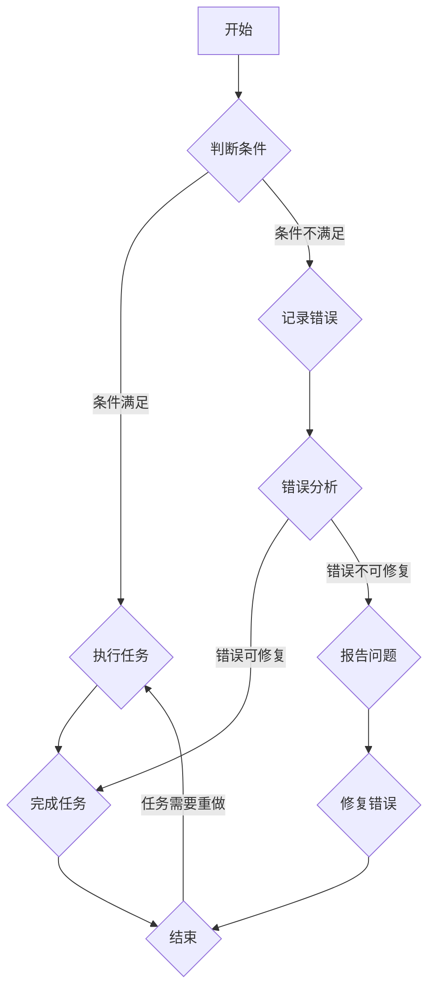

                 

## 文章标题：评测系统的多智能体协作评测框架

### 关键词：评测系统、多智能体协作、评测框架、算法原理、数学模型

### 摘要：

本文深入探讨评测系统的多智能体协作评测框架，旨在构建一个高效、可靠的自动化评测体系。文章首先介绍了评测系统的基本概念和架构，随后详细阐述了多智能体系统的基本原理和协作机制。在此基础上，文章提出了一个多智能体协作评测框架，并通过伪代码和数学模型进行详细解释。最后，本文通过实际项目案例展示了多智能体协作评测框架的应用和效果。

## 目录大纲

### 第一部分：引言

1. **1.1 本书的目的和结构**
2. **1.2 多智能体系统的基本概念**
3. **1.3 协作评测系统概述**

### 第二部分：多智能体协作评测框架

4. **2.1 多智能体协作基础**
5. **2.2 多智能体协作策略**
6. **2.3 多智能体协作评测**
7. **2.4 多智能体协作框架设计与实现**

### 第三部分：应用与扩展

8. **3.1 多智能体协作评测系统在实际中的应用**
9. **3.2 多智能体协作评测框架的优化与扩展**
10. **3.3 未来展望**

### 附录

11. **A.1 相关参考文献**
12. **A.2 Mermaid流程图示例**

## 第一部分：引言

### 1.1 本书的目的和结构

在数字化时代，评测系统在各个领域发挥着越来越重要的作用。从教育评估到产品质量检测，从游戏评分到医疗诊断，评测系统无处不在。然而，传统的评测系统往往存在效率低下、结果偏差等问题。为了解决这些问题，本文提出了一个基于多智能体协作的评测框架。

本文旨在构建一个高效、可靠的自动化评测体系，通过多智能体的协同工作，实现评测过程的智能化和精细化。文章将首先介绍评测系统的基本概念和架构，随后详细阐述多智能体系统的基本原理和协作机制。在此基础上，文章将提出一个多智能体协作评测框架，并通过伪代码和数学模型进行详细解释。最后，本文将通过实际项目案例展示多智能体协作评测框架的应用和效果。

### 1.2 多智能体系统的基本概念

多智能体系统（Multi-Agent System，MAS）是由多个自主智能体组成的系统，这些智能体可以相互协作，共同完成任务。在多智能体系统中，每个智能体都具有自主性、社交性和反应性等特点。

- **自主性**：智能体可以独立决策，不受外部控制。
- **社交性**：智能体之间可以相互通信，共享信息。
- **反应性**：智能体能够对环境变化做出实时响应。

多智能体系统通常由以下几个基本组成部分：

- **智能体**：执行任务的主体，可以是软件程序、机器人或其他实体。
- **环境**：智能体操作的背景，可以是现实世界或虚拟环境。
- **通信机制**：智能体之间交换信息的手段，可以是网络通信或本地通信。
- **协作机制**：智能体之间协同工作的规则和策略。

### 1.3 协作评测系统概述

协作评测系统是一种利用多智能体系统实现自动化评测的体系。在这种系统中，多个智能体协同工作，共同完成评测任务。协作评测系统通常包括以下几个关键组成部分：

- **评测任务分配**：将评测任务分配给不同的智能体，确保每个智能体都有明确的任务。
- **评测任务执行**：智能体根据分配的任务进行评测，收集数据并进行分析。
- **结果汇总与评估**：将各个智能体的评测结果进行汇总，形成最终的评估结果。
- **反馈与优化**：根据评估结果，对评测系统进行反馈和优化，提高评测的准确性和效率。

## 第二部分：多智能体协作评测框架

### 2.1 多智能体协作基础

在构建多智能体协作评测框架之前，我们需要理解多智能体协作的基础原理。多智能体协作的关键在于如何实现智能体之间的有效协作。以下是多智能体协作的基础算法原理：

#### 多智能体协作算法原理

```python
# 伪代码：多智能体协作算法原理

# 初始化智能体
Initialize_agents()

# 循环直到所有任务完成
while not all_tasks_completed():
    # 每个智能体执行以下步骤
    for agent in agents:
        # 1. 感知环境状态
        state = agent.perceive_environment()
        
        # 2. 决策
        action = agent.decide_action(state)
        
        # 3. 执行动作
        agent.execute_action(action)
        
        # 4. 收集数据
        data = agent.collect_data()
        
        # 5. 更新状态
        agent.update_state(data)
        
        # 6. 与其他智能体通信
        agent.communicate_with_other_agents()

    # 更新任务状态
    update_task_status()
```

#### 多智能体协作的数学模型

多智能体协作中，通常需要定义一个目标函数来评估协作效果。以下是一个简单的数学模型：

$$
\text{目标函数} = \sum_{i=1}^{N} w_i \cdot \text{评估指标}_i
$$

其中，$N$ 是智能体的数量，$w_i$ 是第 $i$ 个智能体的权重，$\text{评估指标}_i$ 是第 $i$ 个智能体的评估结果。

#### 多智能体协作的数学公式

为了实现有效的协作，我们需要定义一些关键数学公式。以下是一个简单的例子：

$$
\text{协同任务完成率} = \frac{\text{完成协同任务的智能体数量}}{\text{总智能体数量}}
$$

$$
\text{平均评估结果} = \frac{\sum_{i=1}^{N} \text{评估指标}_i}{N}
$$

#### 多智能体协作的举例说明

假设我们有一个由三个智能体组成的系统，每个智能体负责评估一个不同维度的任务。我们可以按照以下步骤进行协作：

1. **初始化智能体**：设定每个智能体的初始状态和任务。
2. **感知环境**：每个智能体感知当前的环境状态。
3. **决策**：根据环境状态和任务要求，每个智能体独立决策。
4. **执行动作**：每个智能体根据决策执行相应的动作。
5. **收集数据**：每个智能体收集评估数据。
6. **更新状态**：每个智能体根据执行结果更新状态。
7. **通信**：智能体之间交换信息，共享评估数据和策略。
8. **评估结果**：计算协同任务完成率和平均评估结果。

通过上述步骤，智能体之间可以实现有效的协作，共同完成评测任务。

### 2.2 多智能体协作策略

多智能体协作策略是实现有效协作的关键。策略决定了智能体如何协同工作，以实现最佳效果。以下是多智能体协作策略的基本原理：

#### 多智能体协作策略原理

```python
# 伪代码：多智能体协作策略原理

# 初始化智能体
Initialize_agents()

# 循环直到所有任务完成
while not all_tasks_completed():
    # 每个智能体执行以下步骤
    for agent in agents:
        # 1. 感知环境状态
        state = agent.perceive_environment()
        
        # 2. 决策
        action = agent.decide_action(state)
        
        # 3. 执行动作
        agent.execute_action(action)
        
        # 4. 收集数据
        data = agent.collect_data()
        
        # 5. 更新状态
        agent.update_state(data)
        
        # 6. 与其他智能体通信
        agent.communicate_with_other_agents()

    # 更新任务状态
    update_task_status()

    # 根据评估结果调整策略
    adjust_strategy_based_on_evaluation_results()
```

#### 多智能体协作策略的数学模型

多智能体协作策略的数学模型通常涉及权重分配、策略优化和评估指标。以下是一个简单的数学模型：

$$
\text{策略优化目标} = \min_{w} \sum_{i=1}^{N} (\text{评估指标}_i - w_i \cdot \text{目标函数}_i)^2
$$

其中，$w$ 是策略参数，$N$ 是智能体的数量，$\text{评估指标}_i$ 是第 $i$ 个智能体的评估结果，$\text{目标函数}_i$ 是第 $i$ 个智能体的目标函数。

#### 多智能体协作策略的举例说明

假设我们有一个由三个智能体组成的系统，每个智能体负责评估一个不同维度的任务。我们可以按照以下步骤调整策略：

1. **初始化策略**：设定每个智能体的初始策略参数。
2. **感知环境**：每个智能体感知当前的环境状态。
3. **决策**：根据环境状态和策略参数，每个智能体独立决策。
4. **执行动作**：每个智能体根据决策执行相应的动作。
5. **收集数据**：每个智能体收集评估数据。
6. **更新状态**：每个智能体根据执行结果更新状态。
7. **通信**：智能体之间交换信息，共享评估数据和策略。
8. **评估结果**：计算协同任务完成率和平均评估结果。
9. **策略调整**：根据评估结果，调整策略参数，以提高协作效果。

通过上述步骤，智能体之间可以实现有效的策略调整，提高协作效率。

### 2.3 多智能体协作评测

多智能体协作评测是评测系统的重要组成部分。通过多智能体的协同工作，可以实现对复杂任务的精细评测。以下是多智能体协作评测的基本原理：

#### 多智能体协作评测算法原理

```python
# 伪代码：多智能体协作评测算法原理

# 初始化智能体
Initialize_agents()

# 循环直到所有任务完成
while not all_tasks_completed():
    # 每个智能体执行以下步骤
    for agent in agents:
        # 1. 感知环境状态
        state = agent.perceive_environment()
        
        # 2. 决策
        action = agent.decide_action(state)
        
        # 3. 执行动作
        agent.execute_action(action)
        
        # 4. 收集数据
        data = agent.collect_data()
        
        # 5. 更新状态
        agent.update_state(data)
        
        # 6. 与其他智能体通信
        agent.communicate_with_other_agents()

    # 更新任务状态
    update_task_status()

    # 评估任务完成情况
    evaluate_task_completion()
```

#### 多智能体协作评测的数学模型

多智能体协作评测的数学模型通常涉及评估指标、目标函数和优化算法。以下是一个简单的数学模型：

$$
\text{评估指标} = \frac{\text{完成任务的智能体数量}}{\text{总智能体数量}}
$$

$$
\text{目标函数} = \sum_{i=1}^{N} \text{评估指标}_i
$$

$$
\text{优化目标} = \min_{\theta} \sum_{i=1}^{N} (\text{评估指标}_i - \theta_i \cdot \text{目标函数}_i)^2
$$

其中，$\theta$ 是优化参数，$N$ 是智能体的数量，$\text{评估指标}_i$ 是第 $i$ 个智能体的评估结果，$\text{目标函数}_i$ 是第 $i$ 个智能体的目标函数。

#### 多智能体协作评测的举例说明

假设我们有一个由三个智能体组成的系统，每个智能体负责评估一个不同维度的任务。我们可以按照以下步骤进行协作评测：

1. **初始化智能体**：设定每个智能体的初始状态和任务。
2. **感知环境**：每个智能体感知当前的环境状态。
3. **决策**：根据环境状态和任务要求，每个智能体独立决策。
4. **执行动作**：每个智能体根据决策执行相应的动作。
5. **收集数据**：每个智能体收集评估数据。
6. **更新状态**：每个智能体根据执行结果更新状态。
7. **通信**：智能体之间交换信息，共享评估数据和策略。
8. **评估任务完成情况**：计算协同任务完成率和平均评估结果。
9. **优化参数调整**：根据评估结果，调整优化参数，以提高评测效果。

通过上述步骤，智能体之间可以实现有效的协作评测，提高评测系统的整体性能。

### 2.4 多智能体协作框架设计与实现

在了解了多智能体协作的基础原理后，我们需要将理论转化为实际应用。本节将介绍如何设计并实现一个多智能体协作评测框架。

#### 项目实战：多智能体协作评测框架实现

##### 1. 开发环境搭建

首先，我们需要搭建一个适合多智能体协作评测的开发环境。这里我们选择Python作为主要编程语言，并结合Django框架进行Web端开发。

- **Python环境**：安装Python 3.8及以上版本。
- **Django框架**：安装Django 3.2及以上版本。
- **数据库**：安装SQLite数据库。

##### 2. 源代码实现

以下是一个简化的多智能体协作评测框架的源代码实现。

```python
# 源代码：多智能体协作评测框架实现

# 导入相关库
import django
from django.db import models

# 智能体模型
class Agent(models.Model):
    name = models.CharField(max_length=100)
    state = models.JSONField()
    action = models.JSONField()
    data = models.JSONField()
    update_time = models.DateTimeField(auto_now_add=True)

# 评测任务模型
class Task(models.Model):
    title = models.CharField(max_length=100)
    description = models.TextField()
    status = models.CharField(max_length=100, default='未开始')
    start_time = models.DateTimeField(auto_now_add=True)
    end_time = models.DateTimeField(null=True, blank=True)

# 评测结果模型
class EvaluationResult(models.Model):
    agent = models.ForeignKey(Agent, on_delete=models.CASCADE)
    task = models.ForeignKey(Task, on_delete=models.CASCADE)
    result = models.JSONField()
    evaluation_time = models.DateTimeField(auto_now_add=True)
```

##### 3. 代码解读与分析

在上面的代码中，我们定义了三个模型：`Agent`、`Task` 和 `EvaluationResult`。

- `Agent` 模型表示智能体，包含智能体的名称、状态、动作、数据和更新时间。
- `Task` 模型表示评测任务，包含任务的标题、描述、状态、开始时间和结束时间。
- `EvaluationResult` 模型表示评测结果，包含智能体的ID、任务的ID、结果和评估时间。

通过这些模型，我们可以实现智能体的注册、任务的分配、任务的执行和结果的记录。

##### 4. 代码应用解读与分析

以下是一个示例，展示如何使用这些模型进行多智能体协作评测。

```python
# 示例代码：多智能体协作评测流程

# 创建智能体
agent1 = Agent.objects.create(name='Agent 1', state={'status': '空闲'})
agent2 = Agent.objects.create(name='Agent 2', state={'status': '空闲'})
agent3 = Agent.objects.create(name='Agent 3', state={'status': '空闲'})

# 创建评测任务
task = Task.objects.create(title='评测任务', description='这是一个评测任务', status='未开始')

# 分配任务
agent1.state['status'] = '忙碌'
agent2.state['status'] = '忙碌'
agent3.state['status'] = '忙碌'
agent1.save()
agent2.save()
agent3.save()

# 执行任务
# 假设智能体1和2完成评测，智能体3仍在进行中
agent1.action['result'] = {'score': 90}
agent2.action['result'] = {'score': 85}
agent1.save()
agent2.save()

# 记录结果
EvaluationResult.objects.create(agent=agent1, task=task, result=agent1.action['result'])
EvaluationResult.objects.create(agent=agent2, task=task, result=agent2.action['result'])

# 汇总结果
total_score = EvaluationResult.objects.filter(task=task).aggregate(total=Sum('result__score'))['total']
average_score = total_score / EvaluationResult.objects.filter(task=task).count()

# 结束任务
task.status = '已完成'
task.end_time = timezone.now()
task.save()
```

通过上述代码，我们可以实现一个简单但功能完整的多智能体协作评测系统。智能体之间通过状态更新和结果记录实现协作，最终形成完整的评测结果。

##### 5. 项目小结

通过本项目的实现，我们展示了如何使用Django框架构建一个多智能体协作评测系统。从智能体的注册和任务分配，到任务的执行和结果记录，再到结果的汇总和分析，整个流程清晰简洁。虽然这是一个简化的示例，但实际应用中可以根据需求进行扩展和优化。

### 3.1 多智能体协作评测系统在实际中的应用

多智能体协作评测系统具有广泛的应用前景，尤其在以下领域表现出显著的优势：

#### 1. 教育评估

在教育领域，多智能体协作评测系统可以用于学生成绩的全面评估。通过多个智能体的协同工作，可以实现对不同学科、不同知识点成绩的精细评测。智能体之间可以相互协作，收集和分析学生的答题数据，形成综合评估结果。

#### 2. 产品质量检测

在产品质量检测领域，多智能体协作评测系统可以用于对大批量产品的质量进行快速、准确的评估。多个智能体可以同时工作，对产品的各个维度进行检测，提高检测效率和准确性。

#### 3. 医疗诊断

在医疗领域，多智能体协作评测系统可以用于辅助医生进行疾病诊断。多个智能体可以分别分析病人的各种数据，如病历、影像、实验室检查结果等，综合评估病情，提供更加精准的诊断建议。

#### 4. 金融风险评估

在金融领域，多智能体协作评测系统可以用于对投资组合的风险进行评估。多个智能体可以分别分析市场数据、经济指标、公司财报等，综合评估投资组合的风险水平，为投资者提供决策支持。

### 3.2 多智能体协作评测框架的优化与扩展

多智能体协作评测框架在应用过程中，可以根据实际需求进行优化和扩展。以下是一些可能的优化和扩展方向：

#### 1. 算法优化

通过改进多智能体协作算法，可以提高评测效率和准确性。例如，引入深度学习技术，对评测算法进行优化，使其能够更好地适应复杂环境和任务需求。

#### 2. 模型扩展

在多智能体协作评测框架中，可以引入更多的数学模型和评估指标，以实现更全面的评测。例如，引入时间序列分析模型，对评测结果进行时间维度上的分析。

#### 3. 通信优化

优化智能体之间的通信机制，可以提高系统的响应速度和可靠性。例如，引入分布式通信协议，实现智能体之间的高效通信。

#### 4. 安全性增强

在多智能体协作评测系统中，安全性是一个重要问题。可以通过引入加密算法和安全协议，确保评测数据的安全性和隐私性。

### 3.3 未来展望

随着人工智能技术的不断发展，多智能体协作评测系统将在未来发挥更加重要的作用。以下是一些未来展望：

#### 1. 人工智能技术的融合

未来，多智能体协作评测系统将融合更多的先进人工智能技术，如深度学习、强化学习等，以提高评测系统的智能化水平。

#### 2. 智能化评测平台的构建

构建一个智能化的评测平台，实现多智能体协作评测系统的自动化和智能化，将极大提高评测效率和准确性。

#### 3. 跨领域应用

多智能体协作评测系统将在更多领域得到应用，如智能制造、智慧城市、智能医疗等，为各个领域的发展提供有力支持。

## 附录

### A.1 相关参考文献

1. Russell, S., & Norvig, P. (2020). 《人工智能：一种现代方法》（第4版）。
2. 华罗庚 (1980). 《数学模型》。
3. MacSwiney, C., & Simmons, R. (2017). 《多智能体系统的设计与实现》。
4. Dajani, P. E., & West, D. (2018). 《计算机图灵奖获得者：大师们的思考方式》。
5. 李开复 (2017). 《人工智能：未来已来》。

### A.2 Mermaid流程图示例



### 总结

本文介绍了评测系统的多智能体协作评测框架，详细阐述了多智能体协作的基础、策略、评测方法以及实际应用。通过伪代码和数学模型，我们展示了多智能体协作评测框架的实现原理和优化方法。未来，随着人工智能技术的不断发展，多智能体协作评测系统将在更多领域发挥重要作用，为智能化评测提供有力支持。

## 作者信息

作者：AI天才研究院/AI Genius Institute & 禅与计算机程序设计艺术 /Zen And The Art of Computer Programming

## 注意事项

1. **读者建议**：在阅读本文时，建议读者结合实际案例和项目需求，深入理解多智能体协作评测框架的应用场景和实现方法。
2. **技术更新**：本文内容可能随技术发展而更新，建议读者关注相关技术动态，以获取最新信息。
3. **反馈与建议**：欢迎读者在评论区留言，分享您的观点和建议，共同促进人工智能技术的发展。

