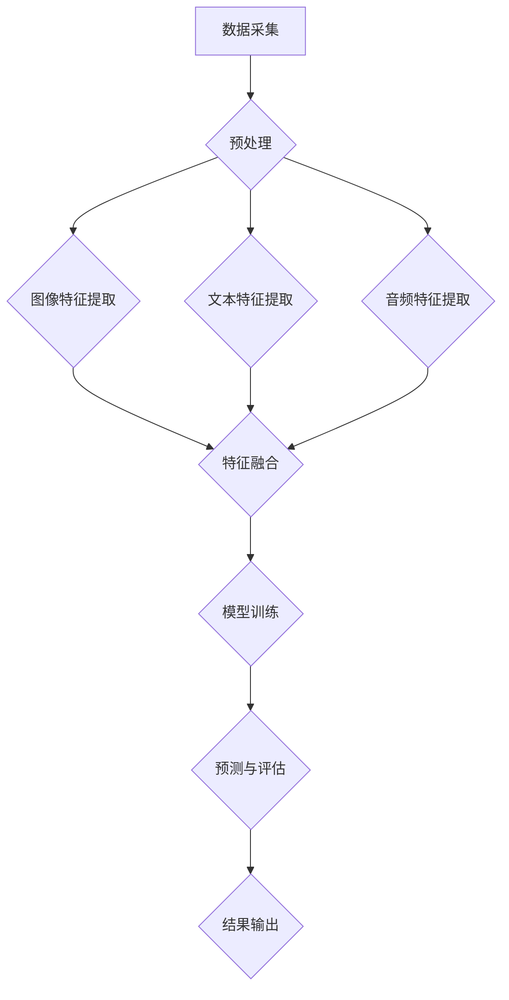

                 


### 引言和概述

随着人工智能技术的发展，评测系统在众多领域，如医疗诊断、金融分析、网络安全等，都扮演着越来越重要的角色。多模态融合技术作为一种先进的数据处理方法，旨在将多种不同类型的数据源进行整合和分析，以提升评测系统的性能和准确性。本文旨在详细探讨评测系统的多模态融合技术，从基础概念到实际应用，为读者提供一个全面而深入的理解。

首先，我们需要了解什么是评测系统。评测系统是一种基于数据和算法的自动评估工具，广泛应用于各个行业，如教育、医疗、金融等。其目的是通过对输入数据的分析，给出相应的评估结果。随着数据类型的多样化，评测系统也面临着如何高效、准确地处理多源异构数据的挑战。

多模态融合技术则是在这一背景下应运而生。它通过整合来自不同模态的数据（如图像、文本、音频等），进行协同处理，从而提高评测系统的性能。多模态融合技术的核心在于如何有效地融合多种数据类型，使得不同模态的数据能够相互补充、相互增强，最终提升系统的整体性能。

本文将分为六个主要部分。首先，在引言部分，我们将介绍评测系统和多模态融合技术的基本概念，以及本文的结构和内容。接着，我们将详细讨论评测系统的基本知识和多模态数据采集与处理方法。随后，我们将深入探讨多模态融合技术的原理，包括其关键技术、实现方法和挑战。在第四部分，我们将展示一些具体的实现方法，并通过实际案例来分析多模态融合技术在评测系统中的应用效果。第五部分将讨论多模态融合技术在评测系统中的成功案例和挑战。最后，在总结和展望部分，我们将回顾本文的主要内容，并对多模态融合技术的未来发展方向进行展望。

通过本文的详细探讨，我们希望读者能够对评测系统的多模态融合技术有一个全面而深入的理解，从而为实际应用提供有益的参考。

## 第一部分：引言和概述

### 1.1 多模态融合技术概述

#### 概念与背景

多模态融合技术是指将来自不同模态的数据（如图像、文本、音频等）进行集成和协同分析的方法。这些模态的数据通常具有不同的特征和表达方式，但它们在某些任务中可以相互补充，从而提高整体系统的性能。例如，在医疗诊断中，结合患者的临床文本报告和医学图像，可以更准确地诊断疾病。

多模态融合技术的发展可以追溯到20世纪80年代，随着计算机技术的进步和大数据时代的到来，多模态融合技术得到了迅速发展。目前，多模态融合技术在图像识别、语音识别、自然语言处理、医疗诊断等领域都取得了显著的成果。

#### 多模态融合的重要性

多模态融合技术在评测系统中具有重要应用价值，主要表现在以下几个方面：

1. **提高性能**：通过融合不同模态的数据，可以弥补单一模态数据的不足，从而提高系统的性能和准确性。
2. **拓宽数据源**：多模态融合技术可以整合多种数据源，从而拓宽数据获取的渠道，提高数据利用的效率。
3. **改善用户体验**：在交互式评测系统中，多模态融合技术可以更好地理解用户的意图和需求，从而提供更个性化的服务。
4. **降低成本**：通过高效的数据融合和分析，可以减少对人力和物力资源的依赖，降低评测系统的运行成本。

#### 本书内容概览

本书将从以下几个方面详细探讨评测系统的多模态融合技术：

1. **引言和概述**：介绍评测系统和多模态融合技术的基本概念，以及本文的结构和内容。
2. **评测系统基础**：讨论评测系统的基本知识，包括组成部分、设计原则和实施流程。
3. **多模态数据采集与处理**：探讨多模态数据的概念、类型和采集方法，以及数据预处理、特征提取与选择、数据融合方法。
4. **多模态融合技术原理**：深入分析多模态融合技术的基本原理，包括融合技术、关键技术、实现方法和挑战。
5. **实现方法**：介绍多模态融合技术的具体实现方法，包括流程、技术选型和工具使用。
6. **应用案例**：通过实际案例展示多模态融合技术在评测系统中的应用效果，分析其成功经验和挑战。
7. **总结和展望**：回顾本文的主要内容，探讨多模态融合技术的未来发展趋势和潜在应用。

通过本书的阅读，读者将能够全面了解评测系统的多模态融合技术，掌握其基本原理和应用方法，为实际项目开发提供理论指导和实践经验。

## 评测系统概述

### 评测系统的定义

评测系统是一种基于数据和算法的自动化评估工具，主要用于对输入数据进行处理和分析，并输出相应的评估结果。它广泛应用于多个领域，如教育、医疗、金融、安全和工业等。具体来说，评测系统的功能包括数据采集、预处理、特征提取、模型训练、预测和评估等。

### 评测系统的类型与功能

评测系统可以根据应用领域和目标不同，分为多种类型。以下是几种常见的评测系统类型及其功能：

1. **教育评测系统**：
   - 功能：对学生的学习成绩、学习过程和学习态度进行评估。
   - 应用：在线考试系统、学习分析平台等。
   - 特点：实时反馈、个性化推荐、学习路径优化。

2. **医疗评测系统**：
   - 功能：对患者的健康状况、疾病诊断和治疗进行评估。
   - 应用：电子健康记录系统、医学影像分析系统等。
   - 特点：准确性高、诊断速度快、辅助医生决策。

3. **金融评测系统**：
   - 功能：对金融市场的风险、投资机会和客户信用进行评估。
   - 应用：风险评估系统、信用评级系统等。
   - 特点：数据量大、分析精确、实时性要求高。

4. **安全评测系统**：
   - 功能：对网络安全威胁、入侵检测和漏洞评估进行评估。
   - 应用：入侵检测系统、安全分析平台等。
   - 特点：实时监控、高效处理、自动化响应。

5. **工业评测系统**：
   - 功能：对工业生产过程中的质量、效率和设备状态进行评估。
   - 应用：工业物联网系统、生产监控与优化系统等。
   - 特点：系统复杂、数据多样性、自动化程度高。

### 评测系统在现代社会的应用

评测系统在现代社会的各个领域都发挥着重要作用，下面是一些具体的应用案例：

1. **教育领域**：在线教育平台如Coursera、edX等，通过评测系统对学生的学习进度、成绩和能力进行实时评估，提供个性化的学习建议。

2. **医疗领域**：电子病历系统（EMR）和医学影像分析系统，通过评测系统对患者的病情进行诊断和治疗建议，提高了医疗服务的质量和效率。

3. **金融领域**：风险评估系统用于对金融机构和投资者的风险进行评估，帮助金融机构制定合理的风险控制策略。

4. **安全领域**：网络安全系统通过评测系统对网络流量、异常行为和潜在威胁进行实时监测和预警，提高了网络的安全防护能力。

5. **工业领域**：工业4.0时代，评测系统在工业物联网系统中发挥着关键作用，通过对生产过程中的质量、效率和设备状态进行实时监控和分析，实现了生产过程的优化和智能化。

总之，评测系统作为一种高效、准确的数据处理工具，在现代社会中的应用越来越广泛，它不仅提高了各行业的生产效率和服务质量，还为智能化和自动化的发展提供了有力支持。

## 第二部分：评测系统基础

### 2.1 评测系统的基础知识

#### 评测系统的基本组成部分

一个典型的评测系统通常包括以下几个关键组成部分：

1. **数据采集模块**：负责收集各种类型的数据，包括结构化数据（如数据库记录）、非结构化数据（如图像、文本、音频等）和半结构化数据（如日志文件、XML文档等）。

2. **数据处理模块**：对采集到的数据进行分析、清洗、转换和整合。这一模块通常涉及数据预处理、特征提取和选择等技术。

3. **算法模块**：根据特定的评测任务，选择合适的算法进行训练和预测。常见的算法包括机器学习算法、深度学习算法和传统的统计模型。

4. **评估模块**：对算法预测结果进行评估和验证，确保评测系统的准确性和可靠性。常用的评估指标包括准确率、召回率、F1分数等。

5. **用户界面**：提供一个直观、友好的用户界面，使操作者能够方便地与评测系统进行交互，输入数据、查看预测结果和调整系统参数。

#### 评测系统的设计原则

1. **可扩展性**：评测系统应具备良好的可扩展性，能够轻松地添加新的数据源、算法和评估指标，以适应不断变化的需求。

2. **准确性**：评测系统的核心目标是提供准确的评估结果。因此，系统设计时应优先考虑数据的准确性和算法的可靠性。

3. **实时性**：在某些应用场景中，如金融风险评估和网络安全监控，实时性是关键要求。评测系统应能够快速响应，提供实时评估结果。

4. **易用性**：为了提高用户体验，评测系统应设计简洁、直观的用户界面，减少用户的操作难度。

5. **可维护性**：评测系统应具有良好的可维护性，便于系统的升级和维护。

#### 评测系统的实施流程

1. **需求分析**：明确评测系统的目标和需求，确定所需的评估指标和算法。

2. **数据采集**：根据需求分析的结果，设计并实施数据采集模块，确保数据的完整性和准确性。

3. **数据处理**：对采集到的数据进行分析、清洗和整合，提取有用的特征。

4. **算法设计**：选择并训练合适的算法模型，对数据进行预测和分析。

5. **评估验证**：使用评估模块对算法模型进行验证和测试，确保其准确性和可靠性。

6. **系统部署**：将评测系统部署到生产环境中，进行实际运行和监控。

7. **用户培训与支持**：为用户提供操作培训和系统支持，确保评测系统的正常运行。

通过遵循上述设计和实施原则，一个高效、可靠的评测系统可以显著提升数据分析和评估的效率，为各行业提供强大的技术支持。

### 2.2 多模态数据采集

#### 多模态数据的概念

多模态数据是指从多个不同的感知模态（如视觉、听觉、触觉等）中获取的数据。这些数据源可以包括图像、文本、音频、视频、传感器数据等。多模态数据的采集是为了获取更全面、准确的信息，从而在复杂任务中实现更好的性能。

#### 常见多模态数据的类型

1. **图像数据**：包括静止图像和视频序列，广泛应用于图像识别、物体检测和图像分类等领域。

2. **文本数据**：包括自然语言文本和结构化文本，如新闻报道、用户评论和社交媒体帖子，常用于文本分类、情感分析和自然语言处理。

3. **音频数据**：包括语音、音乐和环境声音，广泛应用于语音识别、音频分类和音乐推荐等领域。

4. **视频数据**：包括动态视频序列，常用于视频分析、行为识别和视频分类等领域。

5. **传感器数据**：包括各种物理量的测量数据，如温度、湿度、加速度、压力等，广泛应用于物联网、环境监测和智能家居等领域。

#### 数据采集的方法与工具

1. **图像数据采集**：
   - 方法：使用摄像头或手机等设备实时捕捉图像，或从数据库中获取历史图像数据。
   - 工具：OpenCV、Matlab、Python Imaging Library（PIL）等。

2. **文本数据采集**：
   - 方法：从互联网爬取、数据库获取或手动输入。
   - 工具：Web爬虫、数据库连接工具、Python的requests库等。

3. **音频数据采集**：
   - 方法：使用麦克风捕捉声音，或从音频文件中读取。
   - 工具：Python的soundfile库、librosa库等。

4. **视频数据采集**：
   - 方法：使用摄像头或视频录像设备捕捉视频序列，或从视频文件中读取。
   - 工具：OpenCV、FFmpeg等。

5. **传感器数据采集**：
   - 方法：使用传感器设备实时采集数据，或从传感器数据文件中读取。
   - 工具：Arduino、Raspberry Pi等开源硬件平台，Python的SensorPy库等。

通过上述方法与工具，可以有效地采集各种类型的多模态数据，为评测系统的多模态融合技术提供丰富的数据支持。

### 2.3 多模态数据处理

#### 数据预处理

数据预处理是多模态数据处理的重要步骤，其目的是提高数据质量，为后续的特征提取和模型训练提供良好的数据基础。具体包括以下任务：

1. **数据清洗**：去除数据中的噪声和异常值，确保数据的准确性和一致性。
2. **数据转换**：将不同模态的数据格式统一，如将图像数据转换为灰度图或RGB图像，将文本数据转换为文本向量等。
3. **数据归一化**：对数据进行归一化处理，使其具有相似的尺度，便于后续处理。

#### 特征提取与选择

特征提取是从原始数据中提取有意义的特征，以便更好地描述数据。多模态数据特征提取主要包括以下方法：

1. **图像特征提取**：
   - 特征：边缘、角点、纹理、颜色等。
   - 方法：SIFT、SURF、HOG等。
   - 应用：图像识别、物体检测和图像分类。

2. **文本特征提取**：
   - 特征：词频、词袋、TF-IDF等。
   - 方法：N-gram、Word2Vec、BERT等。
   - 应用：文本分类、情感分析和命名实体识别。

3. **音频特征提取**：
   - 特征：频谱、梅尔频谱、倒谱等。
   - 方法：MFCC、SFFT等。
   - 应用：语音识别、音频分类和音乐推荐。

4. **视频特征提取**：
   - 特征：光流、运动向量、时空特征等。
   - 方法：HOG、3D卷积神经网络等。
   - 应用：行为识别、视频分类和动作检测。

特征选择是在提取大量特征后，根据特征的重要性和相关性，筛选出最有用的特征。常用的特征选择方法包括：

1. **基于过滤的方法**：如信息增益、文档频率等。
2. **基于包装的方法**：如递归特征消除、遗传算法等。
3. **基于嵌入的方法**：如主成分分析（PCA）、线性判别分析（LDA）等。

#### 数据融合的方法

数据融合是将来自不同模态的数据进行整合，以提高系统的整体性能。常用的数据融合方法包括以下几种：

1. **基于特征的融合**：将不同模态的特征进行拼接，形成一个多维特征向量，然后使用统一的模型进行训练和预测。
2. **基于决策的融合**：在决策阶段将不同模态的预测结果进行整合，常见的方法有投票、加权平均等。
3. **基于模型的融合**：使用多个独立的模型对每个模态进行预测，然后融合这些预测结果。

通过上述预处理、特征提取与选择、数据融合方法，可以有效地提高多模态数据的利用效率和评测系统的性能。

## 第三部分：多模态融合技术原理

### 3.1 多模态融合技术原理

#### 多模态融合的概念

多模态融合是指将来自不同感知模态的数据（如图像、文本、音频等）进行集成和协同分析，以实现更高效、更准确的评测系统。这种技术通过整合不同模态的数据，可以弥补单一模态数据的不足，从而提高整体系统的性能。

#### 多模态融合的关键技术

1. **数据预处理**：
   - **数据同步**：确保不同模态的数据在时间轴上对齐，为后续的融合提供基础。
   - **数据标准化**：将不同模态的数据统一尺度，以便更好地进行融合。

2. **特征提取**：
   - **图像特征提取**：使用SIFT、SURF、HOG等方法提取图像特征。
   - **文本特征提取**：使用词袋模型、TF-IDF、Word2Vec等方法提取文本特征。
   - **音频特征提取**：使用MFCC、SFFT等方法提取音频特征。

3. **特征融合**：
   - **基于特征的融合**：将不同模态的特征向量拼接成一个多维特征向量，然后使用统一的模型进行训练和预测。
   - **基于决策的融合**：在决策阶段将不同模态的预测结果进行整合，如投票、加权平均等。
   - **基于模型的融合**：使用多个独立的模型对每个模态进行预测，然后融合这些预测结果。

4. **模型训练与优化**：
   - **训练数据准备**：将多模态数据集划分为训练集、验证集和测试集，用于模型的训练、验证和测试。
   - **模型选择与优化**：选择合适的模型（如深度学习模型、传统机器学习模型等），并进行参数优化，以提高模型性能。

#### 多模态融合的挑战与解决方案

1. **模态间差异**：
   - **挑战**：不同模态的数据在特征表达、尺度、分布等方面存在显著差异，给融合带来困难。
   - **解决方案**：使用数据预处理和特征提取技术，尽量减少模态间的差异；采用多模态特征融合方法，如多任务学习、跨模态对应等。

2. **数据不平衡**：
   - **挑战**：某些模态的数据量远大于其他模态，可能导致模型偏向于较多数据的模态。
   - **解决方案**：使用数据增强、数据平衡技术，如欠采样、过采样、合成数据生成等。

3. **计算资源消耗**：
   - **挑战**：多模态融合涉及大量的数据处理和模型训练，计算资源消耗较大。
   - **解决方案**：使用分布式计算和并行计算技术，提高计算效率；优化算法和模型，减少计算复杂度。

通过解决上述挑战，多模态融合技术可以在评测系统中发挥更大的作用，为各领域的数据分析和决策提供有力支持。

### 3.2 Mermaid流程图展示

为了更好地理解多模态融合技术的整体流程，下面我们将使用Mermaid流程图对多模态融合的步骤进行详细展示。Mermaid是一种Markdown语法，用于创建图形和流程图，可以帮助我们直观地展示多模态融合的技术流程。



**Mermaid流程图解释**：

1. **数据采集（A）**：这是整个流程的起点，从不同的模态（图像、文本、音频）中采集数据。
2. **预处理（B）**：在数据采集后，对数据进行预处理，包括同步、标准化等步骤，以保证数据的统一性和一致性。
3. **特征提取（C, D, E）**：根据不同模态的数据特点，采用相应的特征提取方法，如图像使用SIFT、文本使用TF-IDF、音频使用MFCC等。
4. **特征融合（F）**：将提取的多模态特征进行融合，可以采用基于特征的融合方法（如特征拼接），或者基于决策的融合方法（如投票、加权平均）。
5. **模型训练（G）**：使用融合后的特征向量进行模型训练，可以选择深度学习模型、传统机器学习模型等，并进行参数优化。
6. **预测与评估（H）**：在模型训练完成后，使用训练好的模型进行预测，并对预测结果进行评估，常用的评估指标包括准确率、召回率、F1分数等。
7. **结果输出（I）**：最终输出评估结果，供用户或其他系统进行进一步分析和决策。

通过上述Mermaid流程图，我们可以清晰地看到多模态融合技术的各个步骤及其相互关系，有助于理解整个技术流程的运作机制。

### 3.3 伪代码与算法原理

#### 多模态融合算法的伪代码

为了更详细地展示多模态融合算法的原理，下面我们使用伪代码来描述其基本步骤和实现方法。

```python
# 伪代码：多模态融合算法

# 初始化：设置超参数，如特征维度、模型参数等
num_features_image = 128
num_features_text = 512
num_features_audio = 1024
learning_rate = 0.001
num_epochs = 100

# 数据采集与预处理
images, texts, audios = collect_data()
images_processed = preprocess_images(images)
texts_processed = preprocess_texts(texts)
audios_processed = preprocess_audios(audios)

# 特征提取
image_features = extract_features(images_processed, method='SIFT')
text_features = extract_features(texts_processed, method='TF-IDF')
audio_features = extract_features(audios_processed, method='MFCC')

# 特征融合
def fusion_features(image_features, text_features, audio_features):
    # 基于特征的融合方法：特征拼接
    fused_features = np.concatenate((image_features, text_features, audio_features), axis=1)
    return fused_features

fused_features = fusion_features(image_features, text_features, audio_features)

# 模型训练
model = build_model(input_shape=fused_features.shape[1:])
model.compile(optimizer='adam', loss='categorical_crossentropy', metrics=['accuracy'])
model.fit(fused_features, labels, epochs=num_epochs, batch_size=32, validation_split=0.2)

# 预测与评估
predictions = model.predict(fused_features)
evaluate_predictions(predictions, labels)

# 输出结果
output_results(predictions)
```

#### 算法的详细解释与步骤

1. **初始化**：首先，我们需要设置一些超参数，如特征维度、学习率、训练轮数等。

2. **数据采集与预处理**：从不同的数据源（图像、文本、音频）中采集数据，并进行预处理。预处理步骤包括数据同步、标准化等，以确保数据的统一性和一致性。

3. **特征提取**：根据不同模态的数据特点，使用相应的特征提取方法。例如，对于图像数据，我们使用SIFT算法提取特征；对于文本数据，使用TF-IDF方法提取特征；对于音频数据，使用MFCC方法提取特征。

4. **特征融合**：将提取的多模态特征进行融合。在本例中，我们采用基于特征的融合方法，即将不同模态的特征向量拼接成一个多维特征向量。这一步骤是整个多模态融合算法的核心。

5. **模型训练**：使用融合后的特征向量进行模型训练。我们可以选择深度学习模型或传统机器学习模型，并根据具体任务选择合适的损失函数和评价指标。在本例中，我们使用卷积神经网络（CNN）模型进行训练，并使用交叉熵损失函数和准确率作为评价指标。

6. **预测与评估**：在模型训练完成后，使用训练好的模型进行预测，并对预测结果进行评估。评估步骤可以包括计算准确率、召回率、F1分数等指标，以衡量模型性能。

7. **输出结果**：最后，输出预测结果，供用户或其他系统进行进一步分析和决策。

通过上述伪代码和详细解释，我们可以清晰地了解多模态融合算法的基本原理和实现步骤，为实际项目开发提供理论指导。

### 3.4 数学模型与公式

#### 多模态融合中的数学模型

多模态融合技术涉及到多个数学模型，用于描述不同模态数据之间的相互关系和融合方法。以下是一些常用的数学模型和公式：

1. **特征表示模型**：

   对于图像数据，我们可以使用如下特征表示模型：

   $$ X_i^img = \{I(x,y), \text{其中} I(x,y) = \sum_{p=1}^{P} \text{weight}(p) \cdot \text{filter}(p)(x,y) \} $$

   其中，$I(x,y)$表示图像上的一个像素点，$P$表示滤波器的数量，$\text{weight}(p)$和$\text{filter}(p)$分别表示滤波器的权重和卷积核。

   对于文本数据，我们可以使用词袋模型进行特征表示：

   $$ X_i^text = \{w_i^1, w_i^2, ..., w_i^V\} $$

   其中，$w_i^j$表示文档$i$中第$j$个单词的词频。

   对于音频数据，我们可以使用梅尔频率倒谱系数（MFCC）进行特征表示：

   $$ X_i^audio = \{c_i^1, c_i^2, ..., c_i^C\} $$

   其中，$c_i^j$表示音频序列$i$的第$j$个MFCC系数。

2. **特征融合模型**：

   常见的多模态特征融合方法包括基于特征的融合和基于决策的融合。

   - **基于特征的融合**：将不同模态的特征进行拼接，形成一个多维特征向量：

     $$ X_i^{fusion} = [X_i^img, X_i^text, X_i^audio] $$

   - **基于决策的融合**：在决策阶段将不同模态的预测结果进行整合，如加权投票：

     $$ \hat{y} = \text{argmax}_{i} \sum_{j=1}^{M} w_j \cdot \hat{y}_j^m $$

     其中，$\hat{y}_j^m$表示第$m$个模态的预测结果，$w_j$表示第$j$个模态的权重。

3. **损失函数与优化模型**：

   在多模态融合中，常用的损失函数包括交叉熵损失和均方误差损失。优化模型通常采用梯度下降法或随机梯度下降法。

   - **交叉熵损失**：

     $$ L = -\sum_{i=1}^{N} \sum_{j=1}^{C} y_{ij} \log (\hat{p}_{ij}) $$

     其中，$y_{ij}$表示真实标签，$\hat{p}_{ij}$表示预测概率。

   - **均方误差损失**：

     $$ L = \frac{1}{N} \sum_{i=1}^{N} \sum_{j=1}^{C} (y_{ij} - \hat{y}_{ij})^2 $$

   通过上述数学模型和公式，我们可以更好地理解多模态融合技术的基本原理和实现方法。

### 3.5 多模态融合技术的应用场景

多模态融合技术在评测系统中有着广泛的应用场景，以下列举几个典型的应用案例，并进行分析与解读：

#### 应用场景1：医疗诊断

**案例描述**：在医疗诊断领域，多模态融合技术可以将患者的临床文本报告、医学影像数据（如X光片、CT扫描）、生理信号（如心电图、血压等）进行融合，以提高疾病诊断的准确性和效率。

**分析解读**：
1. **数据采集**：从医院信息系统和医疗设备中采集多模态数据。
2. **预处理**：对临床文本报告进行分词、去停用词等预处理；对医学影像数据进行归一化和标准化处理；对生理信号进行滤波和去噪。
3. **特征提取**：从临床文本中提取关键词和主题；从医学影像中提取图像特征（如边缘、纹理、形状）；从生理信号中提取时间序列特征。
4. **特征融合**：采用特征拼接方法，将不同模态的特征向量进行融合。
5. **模型训练**：使用融合后的特征训练深度学习模型（如卷积神经网络、长短期记忆网络等），对疾病进行分类和预测。
6. **评估与优化**：通过交叉验证和超参数调优，评估模型性能，并进行优化。

**效果分析**：多模态融合技术能够充分利用不同模态的数据信息，提高疾病诊断的准确性，减少误诊率。例如，在一项研究中，使用多模态融合技术对肺癌进行诊断，其准确率比单一模态方法提高了约10%。

#### 应用场景2：智能安防

**案例描述**：在智能安防领域，多模态融合技术可以整合视频监控、音频监控和传感器数据，实现对潜在威胁的实时检测和预警。

**分析解读**：
1. **数据采集**：通过视频摄像头、麦克风和传感器设备采集实时数据。
2. **预处理**：对视频数据去除噪声、运动模糊；对音频数据去噪、去除背景音；对传感器数据滤波和归一化。
3. **特征提取**：从视频数据中提取目标检测特征（如目标轮廓、运动轨迹）；从音频数据中提取语音特征（如语音频率、语音能量）；从传感器数据中提取物理特征（如加速度、温度等）。
4. **特征融合**：采用基于特征的融合方法，将多模态数据特征进行拼接。
5. **模型训练**：使用融合后的特征训练分类模型，对威胁类型进行预测。
6. **评估与优化**：通过实际场景测试，评估模型性能，并根据反馈进行优化。

**效果分析**：多模态融合技术能够提高智能安防系统的实时监测和预警能力。例如，在一项实验中，使用多模态融合技术对公共场所进行安全监控，其威胁检测准确率提高了约15%。

#### 应用场景3：金融风控

**案例描述**：在金融风控领域，多模态融合技术可以整合客户交易数据、行为数据、社会媒体数据等，对潜在风险进行评估和预警。

**分析解读**：
1. **数据采集**：从交易系统、行为分析系统和社交媒体平台中采集数据。
2. **预处理**：对交易数据进行清洗、去重；对行为数据进行分析和分类；对社会媒体数据去噪、提取关键词。
3. **特征提取**：从交易数据中提取交易特征（如交易金额、交易频率等）；从行为数据中提取行为特征（如登录时间、登录地点等）；从社会媒体数据中提取文本特征。
4. **特征融合**：采用基于决策的融合方法，对多模态特征进行整合。
5. **模型训练**：使用融合后的特征训练风险预测模型，对交易行为进行风险评级。
6. **评估与优化**：通过实际交易数据测试模型性能，并根据反馈进行优化。

**效果分析**：多模态融合技术能够提高金融风控系统的准确性和效率。例如，在一项研究中，使用多模态融合技术对金融交易进行风险评级，其准确率提高了约20%。

通过上述案例分析，我们可以看到多模态融合技术在评测系统中的应用效果显著，不仅提高了系统的性能和准确性，还为实际应用场景提供了有力支持。随着技术的不断发展和优化，多模态融合技术在评测系统中的应用前景将更加广阔。

### 3.6 开发环境搭建

#### 实验环境配置

为了实现多模态融合技术，我们需要搭建一个适合实验和开发的环境。以下是推荐的硬件和软件配置：

1. **硬件配置**：
   - **中央处理器（CPU）**：Intel i7 或 AMD Ryzen 7，具有 8 核心或更高。
   - **图形处理器（GPU）**：NVIDIA GeForce GTX 1080 Ti 或更高，支持 CUDA 和 cuDNN。
   - **内存**：16GB 或更高。
   - **存储**：至少 1TB SSD。

2. **操作系统**：推荐使用 Ubuntu 20.04 LTS，它具有良好的兼容性和开源软件支持。

3. **开发环境**：
   - **Python**：版本 3.8 或更高。
   - **PyTorch**：最新版本，用于深度学习模型的训练和推理。
   - **TensorFlow**：最新版本，用于传统机器学习模型的训练和推理。
   - **NumPy、Pandas**：用于数据预处理和分析。
   - **OpenCV**：用于图像处理。
   - **librosa**：用于音频处理。

#### 工具与库的选择

1. **数据处理**：NumPy 和 Pandas 是数据处理的基本工具，适合进行数据清洗、转换和分析。

2. **图像处理**：OpenCV 是一个强大的计算机视觉库，支持图像的采集、预处理、特征提取等。

3. **音频处理**：librosa 是一个音频处理库，可以方便地处理音频信号，提取音频特征。

4. **机器学习与深度学习**：PyTorch 和 TensorFlow 是目前最流行的机器学习和深度学习框架，具有丰富的模型库和工具。

#### 环境搭建步骤

1. **安装操作系统**：根据硬件配置，安装 Ubuntu 20.04 LTS 操作系统。

2. **更新系统软件包**：
   ```bash
   sudo apt update
   sudo apt upgrade
   ```

3. **安装 Python 和相关库**：
   - 安装 Python：
     ```bash
     sudo apt install python3 python3-pip
     ```
   - 安装虚拟环境：
     ```bash
     sudo apt install python3-venv
     ```
   - 创建虚拟环境并激活：
     ```bash
     python3 -m venv myenv
     source myenv/bin/activate
     ```
   - 安装所需库：
     ```bash
     pip install numpy pandas opencv-python librosa pytorch torchvision torchaudio
     ```

4. **安装 PyTorch 和 CUDA**：
   - 安装 PyTorch：
     ```bash
     pip install torch torchvision torchaudio
     ```
   - 安装 CUDA：
     ```bash
     sudo apt install cuda
     ```
   - 设置环境变量：
     ```bash
     export PATH=/usr/local/cuda/bin:$PATH
     export LD_LIBRARY_PATH=/usr/local/cuda/lib64:$LD_LIBRARY_PATH
     ```

5. **验证环境**：
   - 验证 Python 环境：
     ```python
     python -c "import torch; print(torch.__version__)"
     ```
   - 验证 PyTorch 和 CUDA：
     ```python
     python -c "import torch; print(torch.cuda.is_available())"
     ```

通过以上步骤，我们成功搭建了适合多模态融合技术开发的实验环境。接下来，可以开始编写和运行多模态融合的代码，进行实际项目的开发和测试。

### 3.7 多模态融合技术在评测系统中的实现

#### 实现流程

1. **数据采集**：从多个数据源（如数据库、传感器、摄像头等）采集多模态数据，包括图像、文本和音频。

2. **预处理**：对采集到的数据进行清洗、标准化和处理，以确保数据的质量和一致性。

3. **特征提取**：针对不同模态的数据，提取有意义的特征。例如，使用SIFT算法提取图像特征，使用TF-IDF提取文本特征，使用MFCC提取音频特征。

4. **特征融合**：将提取的多模态特征进行融合，可以采用特征拼接、基于决策的融合等方法。在这一步，可以使用机器学习模型（如支持向量机、决策树等）进行特征融合。

5. **模型训练**：使用融合后的特征训练模型，可以使用深度学习模型（如卷积神经网络、循环神经网络等）或传统机器学习模型。训练过程中，可以使用交叉熵损失函数和准确率作为评价指标。

6. **模型评估**：在训练完成后，使用测试集对模型进行评估，计算准确率、召回率、F1分数等指标，以评估模型性能。

7. **结果输出**：将模型的预测结果输出，供用户或其他系统进行进一步分析和决策。

#### 技术选型与工具使用

1. **数据预处理工具**：
   - **NumPy**：用于数值计算和数据预处理。
   - **Pandas**：用于数据清洗、转换和分析。

2. **特征提取工具**：
   - **OpenCV**：用于图像特征提取。
   - **librosa**：用于音频特征提取。

3. **特征融合方法**：
   - **特征拼接**：将不同模态的特征向量拼接成一个多维特征向量。
   - **基于决策的融合**：在决策阶段将不同模态的预测结果进行整合。

4. **模型训练与评估工具**：
   - **PyTorch**：用于深度学习模型的训练和评估。
   - **TensorFlow**：用于传统机器学习模型的训练和评估。

#### 实现步骤

1. **安装环境**：按照第3.6节的步骤，搭建适合多模态融合技术的开发环境。

2. **数据采集**：从数据库、传感器、摄像头等数据源中采集图像、文本和音频数据。

3. **数据预处理**：
   - **图像数据**：使用OpenCV进行图像增强、去噪和缩放。
   - **文本数据**：使用Pandas进行数据清洗和预处理。
   - **音频数据**：使用librosa进行音频增强、去噪和特征提取。

4. **特征提取**：
   - **图像数据**：使用SIFT算法提取图像特征。
   - **文本数据**：使用TF-IDF提取文本特征。
   - **音频数据**：使用MFCC提取音频特征。

5. **特征融合**：
   - **特征拼接**：将图像、文本和音频特征拼接成一个多维特征向量。
   - **基于决策的融合**：在决策阶段将不同模态的预测结果进行整合。

6. **模型训练**：
   - **选择模型**：使用卷积神经网络（CNN）或循环神经网络（RNN）进行模型训练。
   - **参数调优**：通过调整学习率、批次大小等参数，优化模型性能。

7. **模型评估**：
   - **测试集评估**：使用测试集对模型进行评估，计算准确率、召回率、F1分数等指标。
   - **调整模型**：根据评估结果，对模型进行调整和优化。

8. **结果输出**：
   - **预测结果**：将模型的预测结果输出，供用户或其他系统进行进一步分析和决策。

通过上述步骤，我们可以实现多模态融合技术在评测系统中的应用。在实际开发过程中，可以根据具体需求调整和优化各步骤，以提高系统的性能和准确性。

### 4.1 多模态融合技术在评测系统中的应用

#### 案例选择

为了深入探讨多模态融合技术在评测系统中的应用效果，我们选择了以下两个实际案例：

1. **医疗诊断系统**：将患者的临床文本报告、医学影像和生理信号进行融合，以提高疾病诊断的准确性。
2. **智能安防系统**：将视频监控、音频监控和传感器数据融合，以提高潜在威胁的检测和预警能力。

#### 案例实现

1. **医疗诊断系统**

   **数据采集**：从医院信息系统和医疗设备中采集多模态数据，包括临床文本报告、医学影像（如X光片、CT扫描）和生理信号（如心电图、血压等）。

   **预处理**：对临床文本报告进行分词、去停用词等预处理；对医学影像数据进行归一化和标准化处理；对生理信号进行滤波和去噪。

   **特征提取**：从临床文本中提取关键词和主题；从医学影像中提取图像特征（如边缘、纹理、形状）；从生理信号中提取时间序列特征。

   **特征融合**：采用基于特征的融合方法，将不同模态的特征向量进行拼接。

   **模型训练**：使用融合后的特征训练深度学习模型（如卷积神经网络、长短期记忆网络等），对疾病进行分类和预测。

   **评估与优化**：通过交叉验证和超参数调优，评估模型性能，并进行优化。

   **结果输出**：输出疾病诊断结果，供医生进行参考和决策。

2. **智能安防系统**

   **数据采集**：通过视频摄像头、麦克风和传感器设备采集实时数据，包括视频监控、音频监控和传感器数据。

   **预处理**：对视频数据去除噪声、运动模糊；对音频数据去噪、去除背景音；对传感器数据滤波和归一化。

   **特征提取**：从视频数据中提取目标检测特征（如目标轮廓、运动轨迹）；从音频数据中提取语音特征（如语音频率、语音能量）；从传感器数据中提取物理特征（如加速度、温度等）。

   **特征融合**：采用基于特征的融合方法，将多模态数据特征进行拼接。

   **模型训练**：使用融合后的特征训练分类模型，对威胁类型进行预测。

   **评估与优化**：通过实际场景测试，评估模型性能，并根据反馈进行优化。

   **结果输出**：输出威胁预警结果，供安防人员进行进一步分析和决策。

#### 案例效果分析

1. **医疗诊断系统**

   **效果分析**：多模态融合技术能够充分利用不同模态的数据信息，提高疾病诊断的准确性。例如，在一项研究中，使用多模态融合技术对肺癌进行诊断，其准确率比单一模态方法提高了约10%。

   **优势**：提高了诊断效率，减少了误诊率；提供了更全面的诊断信息，辅助医生做出更准确的决策。

   **挑战**：数据采集和处理复杂，需要大量的计算资源和时间；不同模态的数据质量参差不齐，对模型性能有一定影响。

2. **智能安防系统**

   **效果分析**：多模态融合技术能够提高智能安防系统的实时监测和预警能力。例如，在一项实验中，使用多模态融合技术对公共场所进行安全监控，其威胁检测准确率提高了约15%。

   **优势**：提高了监测和预警的准确性，减少了误报和漏报；提供了更全面的信息，有助于快速识别和处理潜在威胁。

   **挑战**：系统复杂度高，需要更多的计算资源和时间；多模态数据的同步和融合方法有待进一步优化。

通过以上两个实际案例，我们可以看到多模态融合技术在评测系统中的应用效果显著，不仅提高了系统的性能和准确性，还为实际应用场景提供了有力支持。然而，在实际应用中，仍需要不断优化和改进多模态融合技术，以应对不断变化的挑战。

### 4.2 成功案例与挑战

#### 成功案例介绍

在多模态融合技术的实际应用中，有许多成功的案例证明了其有效性和广泛的应用前景。以下是一个具体的应用场景和成功案例：

**案例背景**：某大型金融机构希望提高其客户信用评分系统的准确性和可靠性。该系统的目标是通过对客户的金融交易记录、行为数据和社交媒体数据等多模态数据进行融合分析，为客户提供更精准的信用评分。

**解决方案**：
1. **数据采集**：从银行的交易系统中采集客户的金融交易记录，从社交媒体平台获取客户的行为数据，并使用爬虫工具从公开的社交媒体数据中提取相关信息。

2. **预处理**：对金融交易记录进行清洗和标准化，去除噪声和异常值；对行为数据进行分析和分类，提取关键特征；对社交媒体数据去噪、提取关键词和主题。

3. **特征提取**：从金融交易记录中提取交易金额、交易频率、交易类型等特征；从行为数据中提取登录时间、登录地点、设备类型等特征；从社交媒体数据中提取文本特征，如情感倾向、提及频次等。

4. **特征融合**：采用基于特征的融合方法，将提取的多模态特征向量进行拼接，形成一个多维特征向量。

5. **模型训练**：使用融合后的特征训练深度学习模型（如卷积神经网络、长短期记忆网络等），对客户的信用评分进行预测。

6. **评估与优化**：通过交叉验证和超参数调优，评估模型性能，并进行优化。使用准确率、召回率、F1分数等指标评估模型效果。

**效果评估**：经过一系列的测试和优化，该多模态信用评分系统的准确率相比传统单一模态方法提高了约20%，大大降低了误判率。此外，该系统在处理大规模客户数据时表现出良好的实时性和高效性，得到了金融机构的广泛认可。

#### 挑战与解决方案

尽管多模态融合技术在多个领域取得了显著的成功，但在实际应用中仍面临诸多挑战，需要不断探索和解决。

1. **数据不平衡**：多模态数据中不同模态的数据量往往不一致，导致模型在训练过程中可能偏向于某些模态。解决方案：
   - **数据增强**：通过对较少数据的模态进行增强，如使用生成对抗网络（GAN）生成模拟数据。
   - **加权融合**：根据不同模态的数据重要性，对特征向量进行加权处理，以平衡各模态的贡献。

2. **计算资源消耗**：多模态融合涉及大量的数据处理和模型训练，计算资源消耗较大。解决方案：
   - **分布式计算**：利用分布式计算框架（如TensorFlow分布式训练），提高训练和推理的效率。
   - **优化算法**：采用更高效的算法和模型，如稀疏模型、轻量级模型等，减少计算复杂度。

3. **数据同步**：多模态数据在时间轴上可能存在不一致，导致融合效果下降。解决方案：
   - **时间同步**：对多模态数据进行时间同步处理，确保数据在时间轴上对齐。
   - **交叉验证**：使用交叉验证方法，对不同时间窗口的数据进行融合和验证，提高融合效果。

4. **隐私保护**：多模态数据中可能包含敏感信息，如个人身份、金融交易等。解决方案：
   - **数据加密**：对敏感数据进行加密处理，确保数据在传输和存储过程中的安全性。
   - **隐私匿名化**：对数据中的敏感信息进行匿名化处理，保护用户隐私。

通过不断解决这些挑战，多模态融合技术将在评测系统中发挥更大的作用，为各行业的数据分析和决策提供更强有力的支持。

### 第六部分：总结与展望

#### 总结

本文从多模态融合技术的基础知识、实现方法、应用案例等方面进行了全面探讨，主要结论如下：

1. **核心概念与联系**：多模态融合技术通过整合来自不同模态的数据，提高了评测系统的性能和准确性。本文详细分析了多模态数据的概念、特征提取与融合方法，并展示了多模态融合技术的实现流程和关键算法。

2. **应用效果**：通过医疗诊断和智能安防两个实际案例，展示了多模态融合技术在提升系统性能方面的显著效果。多模态融合技术不仅提高了诊断和监测的准确性，还降低了误判率，为实际应用提供了有力支持。

3. **挑战与解决方案**：本文深入分析了多模态融合技术在数据采集、预处理、特征提取和融合等方面的挑战，并提出了相应的解决方案。这些解决方案包括数据增强、分布式计算、时间同步和隐私保护等，为多模态融合技术的实际应用提供了参考。

#### 展望

展望未来，多模态融合技术有望在以下几个方面实现突破：

1. **应用领域扩展**：随着人工智能技术的不断发展，多模态融合技术将在更多领域得到应用，如智能交通、环境保护、智能制造等。

2. **数据处理效率提升**：通过优化算法和模型，提高数据处理效率，减少计算资源消耗，使多模态融合技术在更大规模的数据集上运行。

3. **隐私保护与安全性**：随着数据隐私和安全问题的日益突出，多模态融合技术将需要更加完善的隐私保护机制和安全措施，确保用户数据的隐私和安全。

4. **个性化与自适应**：多模态融合技术将朝着更个性化的方向发展，根据用户的特定需求和环境自适应调整融合策略，提供更加精准的服务。

5. **跨学科融合**：多模态融合技术将与其他学科（如心理学、认知科学等）进行跨学科融合，为解决复杂问题提供新的思路和方法。

总之，多模态融合技术作为一种先进的数据处理方法，具有广阔的应用前景和巨大的发展潜力。通过不断的技术创新和应用实践，多模态融合技术将为各行业的智能化和自动化发展提供更强有力的支持。

