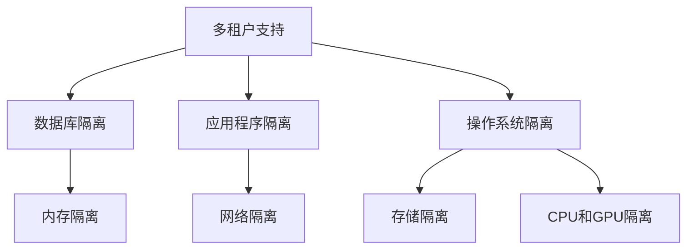

                 

### 文章标题：评测系统的多租户支持与资源隔离

#### 关键词：评测系统、多租户支持、资源隔离、系统架构、性能优化、安全性

#### 摘要：
本文将深入探讨评测系统的多租户支持与资源隔离的重要性。首先，我们将简要介绍评测系统及其在各个领域的应用背景。随后，本文将详细分析多租户支持和资源隔离的核心概念，解释它们在评测系统中的重要作用。通过一系列的Mermaid流程图和伪代码，我们将逐步剖析多租户支持与资源隔离的实现原理，并讨论其在实际项目中的应用案例。最后，我们将总结全文，并提出未来研究和应用的方向。

### 引言

随着云计算、大数据和人工智能技术的快速发展，评测系统作为各类应用的重要基础，需求日益增长。评测系统通常用于性能测试、负载测试、安全测试和压力测试等，目的是确保系统在各种运行条件下能够稳定、高效地运行。然而，在多用户、多任务的复杂环境中，如何实现多租户支持与资源隔离，成为了评测系统设计中的关键问题。

多租户支持是指在同一个评测系统中，为多个用户提供独立的、隔离的资源和服务。资源隔离则是在多用户环境中，确保每个用户的数据、资源和计算资源不被其他用户访问或干扰。这两者共同构成了评测系统的基石，决定了系统的可扩展性、安全性和性能表现。

本文将分为以下几个部分进行详细讨论：

1. **评测系统的多租户支持原理**
2. **资源隔离技术**
3. **系统架构设计**
4. **性能优化策略**
5. **安全性保障**
6. **可伸缩性与扩展性**
7. **案例分析**
8. **总结与展望**

通过以上结构，我们将一步步深入探讨评测系统的多租户支持与资源隔离，为读者提供全面的技术解析和实践指导。

### 第一步：了解评测系统的背景与应用

评测系统作为系统测试的重要工具，广泛应用于各类场景。其基本定义是一个用于评估软件或系统性能、稳定性和安全性的平台，通过模拟不同负载和环境条件，对系统的各项性能指标进行测量和评估。

首先，评测系统在性能测试中起到关键作用。性能测试旨在评估系统在不同负载下的响应时间、吞吐量和资源消耗等性能指标，从而发现系统的瓶颈和改进空间。例如，在电子商务系统中，性能测试可以评估系统在高峰期的交易处理能力，确保在购物节等特殊时期系统不会出现卡顿或崩溃。

其次，负载测试是评测系统的另一个重要应用。负载测试通过模拟大量用户同时访问系统，测试系统在高负载条件下的稳定性。这类测试有助于识别系统在高并发环境下的潜在问题，如响应延迟、内存泄漏和数据库锁争用等。例如，银行系统的负载测试可以确保在大量客户同时访问时，系统能够保持稳定运行，不出现交易失败或数据丢失。

此外，安全测试也是评测系统不可或缺的一部分。安全测试旨在识别系统中的安全漏洞和潜在风险，从而加强系统的安全性。通过模拟各种攻击手段，如SQL注入、跨站脚本攻击（XSS）和拒绝服务攻击（DDoS）等，安全测试可以评估系统的防护能力，并指导开发者进行漏洞修复和防护措施优化。

在互联网、金融、医疗等多个领域，评测系统都发挥着重要作用。例如，在互联网领域，电商平台通过评测系统来确保系统在高并发购物节期间的稳定性，提升用户体验；在金融领域，银行和金融机构通过评测系统来确保交易系统的安全性，防范金融风险；在医疗领域，医院信息系统通过评测系统来确保在高峰期患者访问时，系统能够稳定运行，保障患者数据安全。

综上所述，评测系统在性能测试、负载测试和安全测试中的应用，使其成为各类系统和软件在上线前必须经历的关键环节。通过评测系统的全面测试，开发者可以确保系统在各种运行条件下的稳定性和可靠性，为用户提供优质的体验和服务。

### 第二步：深入理解多租户支持的概念与实现

多租户支持是评测系统中的一个关键特性，它允许在同一系统环境中，为多个独立的用户或组织（称为“租户”）提供隔离的资源和独立的服务。这种设计不仅提高了系统的资源利用效率，还增强了系统的安全性和灵活性。

#### 多租户支持的概念

多租户支持（Multitenancy）是指一个系统可以在同一硬件和软件基础设施上，为多个租户提供独立的服务。每个租户可以拥有自己的数据、应用程序实例、配置文件和资源，而不会影响到其他租户。这种架构通常用于云计算和SaaS（软件即服务）应用，能够显著降低开发和运营成本，同时提高系统的可伸缩性。

#### 多租户支持的优势

1. **资源利用效率**：通过多租户架构，系统能够将资源（如CPU、内存、存储和网络）合理分配给不同的租户，从而最大化资源利用率。相比单租户架构，多租户架构可以更好地应对资源紧张的情况。

2. **成本效益**：多租户支持减少了硬件和软件的重复投资，因为多个租户可以共享同一套基础设施。这种共享模式不仅降低了初始投资成本，还减少了运营和维护成本。

3. **灵活性**：多租户支持使系统能够快速适应不同租户的需求变化，从而提高系统的灵活性和响应速度。

4. **安全性**：通过资源隔离和访问控制，多租户支持可以确保每个租户的数据和资源不会被其他租户访问或篡改，从而提高了系统的安全性。

#### 多租户支持的挑战

1. **性能瓶颈**：由于多个租户共享同一套基础设施，系统在某些情况下可能会出现性能瓶颈。特别是在高负载或资源竞争激烈的情况下，系统性能可能会受到严重影响。

2. **隔离完整性**：确保租户间的隔离完整性是实施多租户支持的一大挑战。如果隔离措施不够严密，可能会导致数据泄露或资源泄露，从而影响系统的整体安全性。

3. **扩展性**：多租户支持需要系统具有良好的扩展性，以便在租户数量增加时，能够动态分配和调整资源，保证系统性能不受影响。

#### 多租户支持的实现方法

多租户支持的实现方法主要包括以下几种：

1. **基于数据库的隔离**：通过在数据库层实现多租户支持，每个租户拥有独立的数据库实例或数据库子集。这种方法简单易实现，但可能会影响系统的性能和可伸缩性。

2. **基于应用程序的隔离**：通过在应用程序层实现多租户支持，每个租户拥有独立的应用程序实例或应用程序模块。这种方法可以提高系统的性能和可伸缩性，但需要复杂的编程和配置。

3. **基于资源的隔离**：通过在操作系统层或硬件层实现多租户支持，每个租户拥有独立的虚拟机或物理服务器。这种方法提供了最强的隔离性，但成本较高且难以扩展。

#### 多租户支持的核心概念

多租户支持的核心概念包括：

1. **租户**：租户是使用系统服务的独立用户或组织。每个租户可以拥有自己的数据、配置和资源。

2. **资源分配**：资源分配是指系统如何将CPU、内存、存储和网络资源分配给不同租户。资源分配策略需要考虑公平性、效率和安全等因素。

3. **访问控制**：访问控制是指系统如何确保租户只能访问自己的资源和数据，而无法访问其他租户的资源。访问控制通常通过身份验证、权限管理和网络隔离等技术实现。

4. **数据隔离**：数据隔离是指系统如何确保租户的数据不会被其他租户访问或篡改。数据隔离可以通过数据库隔离、文件系统隔离和应用程序隔离等技术实现。

通过以上介绍，我们可以看到多租户支持在评测系统中的重要性。它不仅提高了系统的资源利用效率和成本效益，还增强了系统的安全性和灵活性。然而，实现多租户支持也面临一系列挑战，需要在设计时充分考虑。

#### 多租户支持与资源隔离的联系

多租户支持和资源隔离在评测系统中紧密相连，共同构成了系统设计和实现的基础。多租户支持提供了为多个用户或组织提供独立资源和服务的机制，而资源隔离则是确保这些独立资源和服务不被其他用户干扰的关键手段。

首先，多租户支持通过在系统架构中引入隔离层，为每个租户提供了独立的运行环境。这种隔离可以体现在多个层面，包括数据库、应用程序层和操作系统层。在数据库层面，多租户支持通常通过为每个租户创建独立的数据库实例或数据库子集来实现；在应用程序层面，可以通过独立的实例或模块来隔离不同的租户；在操作系统层面，则可以通过虚拟机或容器等技术实现租户间的物理隔离。

资源隔离则是多租户支持的实现细节之一。资源隔离的目的是确保每个租户只能访问自己的资源和数据，而不会影响到其他租户。这涉及到多个方面的技术，包括：

1. **内存隔离**：通过操作系统或虚拟化技术，确保每个租户的内存空间是独立的，从而防止内存泄露或竞态条件问题。

2. **网络隔离**：通过防火墙、虚拟局域网（VLAN）或软件定义网络（SDN）等技术，确保租户之间的网络通信是安全的，防止网络攻击或数据泄露。

3. **存储隔离**：通过文件系统或分布式存储技术，为每个租户提供独立的存储空间，确保租户的数据不会被其他租户访问或篡改。

4. **CPU和GPU隔离**：通过操作系统或硬件虚拟化技术，确保每个租户可以公平地访问CPU和GPU资源，防止资源争用和性能瓶颈。

多租户支持与资源隔离之间的联系可以用一个Mermaid流程图来展示。以下是一个简化的示例：



在这个流程图中，多租户支持（A）通过不同的隔离层（B、C、D）实现，每个隔离层（E、F、G、H）都涉及到资源隔离的不同方面。这个流程图清晰地展示了多租户支持与资源隔离之间的紧密联系，以及它们在评测系统中的实现方法。

总之，多租户支持和资源隔离在评测系统中是相辅相成的。多租户支持为系统提供了灵活的资源配置方式，而资源隔离则为系统提供了安全性和稳定性保障。理解这两者之间的联系，有助于我们更好地设计和管理多租户评测系统。

### 第三步：资源隔离技术的详细解析

资源隔离技术是多租户支持实现的核心，其目的是确保在不同租户之间实现有效的资源隔离，避免资源竞争和潜在的安全问题。以下将详细介绍资源隔离技术的基本原理、具体方法及其在评测系统中的应用。

#### 基本原理

资源隔离技术通过多种方法确保不同租户的资源（如CPU、内存、存储和网络）在运行过程中相互独立，不发生冲突。资源隔离的基本原理包括：

1. **物理资源隔离**：通过为每个租户分配独立的物理资源（如独立的服务器或虚拟机），实现最严格的资源隔离。这种方法虽然提供了最高的隔离性，但成本较高，且难以扩展。

2. **虚拟化技术**：通过虚拟化技术（如虚拟机（VM）和容器（Container））实现资源隔离。虚拟化技术将物理资源抽象成虚拟资源，每个租户在虚拟化环境中拥有独立的虚拟资源，从而实现资源隔离。

3. **操作系统级隔离**：通过操作系统级别的隔离技术（如命名空间（Namespace）和cgroups（控制组）），实现进程和资源的隔离。这种方法可以在同一物理服务器上为多个租户提供独立的运行环境，具有较好的性能和可扩展性。

4. **网络隔离**：通过网络虚拟化技术（如软件定义网络（SDN）和虚拟局域网（VLAN））实现网络资源的隔离，确保不同租户之间的网络通信是安全的，防止网络攻击和数据泄露。

#### 具体方法

1. **虚拟机隔离**：
虚拟机（VM）是资源隔离的一种常见方法。通过虚拟化技术，将物理服务器抽象成多个虚拟服务器，每个虚拟服务器运行独立的操作系统和应用程序，从而实现资源隔离。虚拟机隔离的优点是隔离性强，可以提供完整的操作系统级隔离，但虚拟机的资源开销较大，性能较容器稍逊。

2. **容器隔离**：
容器（Container）是另一种资源隔离方法。容器通过共享宿主机的操作系统内核，提供轻量级的隔离环境。容器在运行时仅包含必要的应用程序和库，不包含完整的操作系统，因此具有更高的性能和可扩展性。容器隔离技术（如Docker和Kubernetes）广泛应用于云计算和微服务架构中。

3. **操作系统级隔离**：
操作系统级隔离通过操作系统提供的功能（如命名空间和cgroups）实现资源隔离。命名空间（Namespace）用于隔离进程和网络的命名空间，使不同租户的进程和网络资源相互独立。cgroups（控制组）用于资源管理，可以限制租户的资源使用量，防止租户过度占用资源。

4. **网络隔离**：
网络隔离通过软件定义网络（SDN）和虚拟局域网（VLAN）实现。SDN通过集中控制网络流量，实现灵活的网络隔离和策略管理。VLAN通过在物理网络中创建逻辑子网，实现不同租户之间的网络隔离。

#### 在评测系统中的应用

在评测系统中，资源隔离技术的应用主要集中在以下几个方面：

1. **CPU资源隔离**：通过cgroups和容器调度策略，限制每个租户的CPU资源使用量，确保不同租户之间的CPU资源公平分配。

2. **内存资源隔离**：通过命名空间和cgroups，隔离不同租户的内存资源，防止内存泄漏和竞态条件问题。

3. **存储资源隔离**：通过文件系统和分布式存储技术，为每个租户提供独立的存储空间，确保租户的数据不会被其他租户访问或篡改。

4. **网络资源隔离**：通过SDN和VLAN，隔离不同租户之间的网络流量，确保租户之间的网络通信是安全的，防止网络攻击和数据泄露。

#### 伪代码示例

以下是一个简化的伪代码示例，展示了如何使用cgroups实现CPU资源隔离：

```pseudo
function isolate_cpu_resources(tenant_id, max_cpu_usage) {
    // 创建cgroups实例
    cgroup = create_cgroup(tenant_id)

    // 将进程添加到cgroups中
    add_process_to_cgroup(cgroup, tenant_process)

    // 设置cgroups的CPU限制
    set_cpu_limit(cgroup, max_cpu_usage)
}

// 示例：为租户ID为1的租户设置CPU使用上限为50%
isolate_cpu_resources("tenant_1", 0.5)
```

在这个示例中，`isolate_cpu_resources` 函数用于创建一个cgroups实例，并将租户的进程添加到该实例中。然后，通过 `set_cpu_limit` 函数设置CPU使用上限，确保租户的CPU使用量不超过指定值。

通过以上方法，评测系统可以有效地实现资源隔离，提高系统的安全性和稳定性，为多个租户提供公平、高效的资源服务。

### 第四步：评测系统的系统架构设计

评测系统的系统架构设计是确保多租户支持与资源隔离有效实施的关键环节。一个良好的系统架构不仅能够提供高效的资源利用，还能保证系统的高可用性和可扩展性。以下将详细分析评测系统的系统架构设计，包括其核心组件、层次结构和各组件之间的关系。

#### 核心组件

评测系统的核心组件包括但不限于：

1. **资源管理器**：负责管理系统的物理和虚拟资源，包括CPU、内存、存储和网络。资源管理器通过调度策略将资源分配给不同的租户，确保资源的高效利用和公平分配。

2. **租户管理器**：负责管理租户的创建、删除和配置。租户管理器与资源管理器协作，为每个租户分配独立的资源，并确保租户间的资源隔离。

3. **服务容器**：为租户提供具体的评测服务，如性能测试、负载测试和安全测试等。服务容器通常基于容器化技术（如Docker和Kubernetes）实现，提供轻量级、可扩展的运行环境。

4. **数据存储**：用于存储评测数据、日志和配置信息。数据存储可以是关系数据库、NoSQL数据库或分布式文件系统，需要确保数据的安全性和一致性。

5. **监控与报警系统**：实时监控系统的运行状态，包括资源使用情况、服务性能和安全性等。监控与报警系统可以及时发现潜在问题，并采取相应的措施。

#### 层次结构

评测系统的层次结构通常包括以下几层：

1. **基础设施层**：包括物理服务器、存储和网络设备。基础设施层提供了评测系统的底层硬件资源，是系统正常运行的基础。

2. **虚拟化层**：通过虚拟化技术（如虚拟机、容器和容器编排工具）实现资源隔离和高效利用。虚拟化层为上层应用提供了灵活、可扩展的运行环境。

3. **资源管理层**：包括资源管理器和租户管理器，负责资源分配和调度，确保系统的高可用性和公平性。

4. **服务层**：提供具体的评测服务，包括性能测试、负载测试和安全测试等。服务层通常采用微服务架构，可以灵活组合和扩展。

5. **数据存储层**：用于存储评测数据、日志和配置信息。数据存储层需要保证数据的安全性和一致性，同时提供高效的读写性能。

6. **监控与报警层**：实时监控系统的运行状态，包括资源使用情况、服务性能和安全性等。监控与报警层可以及时发现潜在问题，并触发相应的报警和处理措施。

#### 组件之间的关系

评测系统的各个组件之间通过以下方式进行交互：

1. **资源管理器与租户管理器**：资源管理器根据租户管理器的请求，动态分配资源（如CPU、内存、存储和网络）。租户管理器负责创建、配置和删除租户，并与资源管理器协作确保资源隔离。

2. **服务容器与资源管理器**：服务容器根据资源管理器分配的资源，运行具体的评测服务。资源管理器监控资源使用情况，确保服务容器在合理的资源限制下运行。

3. **数据存储与服务层**：服务层在执行评测任务时，将数据存储到数据存储层。数据存储层提供数据持久化功能，确保评测结果和日志信息的安全存储。

4. **监控与报警系统与服务层**：监控与报警系统监控服务层的运行状态，包括性能指标、资源使用情况和安全性等。如果发现异常，监控与报警系统会触发相应的报警和处理措施，确保系统正常运行。

通过合理的系统架构设计，评测系统可以实现多租户支持与资源隔离，提高系统的稳定性、可靠性和灵活性。同时，良好的架构设计也有助于系统的扩展和维护，为不同规模和需求的评测任务提供支持。

### 第五步：性能优化策略

在评测系统中，性能优化是确保系统高效运行的关键。多租户支持和资源隔离的引入，虽然提高了系统的安全性和灵活性，但也可能带来性能瓶颈。因此，本文将详细探讨在多租户评测系统中实施性能优化策略的方法，包括负载均衡、缓存机制和数据库优化等，以确保系统在多用户环境下的高性能表现。

#### 负载均衡

负载均衡是一种关键的性能优化策略，通过将负载分配到多个服务器或节点上，确保系统不会因单个节点的过载而出现性能问题。在多租户评测系统中，负载均衡的作用尤为重要，因为它需要根据租户的资源需求和系统整体负载动态调整资源分配。

1. **基于轮询的负载均衡**：轮询负载均衡是最简单的一种方法，它将请求轮流分配给不同的服务器或节点，从而实现负载的均衡分配。这种方法适用于负载相对稳定且变化不大的场景。

2. **基于权重负载均衡**：在基于权重的负载均衡中，每个服务器或节点的处理能力不同，因此分配请求时会根据处理能力的权重进行分配。这种方法适用于服务器性能差异较大的场景，可以确保高性能节点承担更多的负载。

3. **基于会话保持的负载均衡**：为了确保用户会话的一致性和安全性，一些负载均衡策略会使用会话保持（Session Persistence），将来自同一用户的请求持续分配给同一个服务器或节点。这种方法可以减少用户会话状态在不同节点之间的切换，提高用户体验。

#### 缓存机制

缓存机制是提升系统性能的有效手段，通过将频繁访问的数据存储在内存中，减少对后端存储的访问次数，从而提高系统的响应速度。

1. **内存缓存**：内存缓存（如Redis和Memcached）通常用于存储热点数据，如用户会话、用户配置和缓存页面等。由于内存访问速度远快于磁盘访问，内存缓存可以显著提高系统的性能。

2. **分布式缓存**：在多租户环境中，分布式缓存（如Consul和Zookeeper）可以用于实现租户间的数据共享和缓存一致性。分布式缓存通过在多个节点上存储相同的数据副本，确保系统的可扩展性和容错性。

3. **缓存预热**：为了减少冷缓存（Cache Miss）的次数，可以使用缓存预热（Cache Preloading）策略，在用户访问高峰期之前提前加载热点数据到缓存中。

#### 数据库优化

数据库是评测系统中的核心组件，其性能直接影响整个系统的性能。以下是一些数据库优化的方法：

1. **索引优化**：通过创建合适的索引，可以显著提高数据库的查询效率。选择正确的索引策略，如B树索引、哈希索引和全文索引，可以满足不同类型的查询需求。

2. **查询优化**：对数据库查询语句进行优化，可以减少查询执行的时间和资源消耗。例如，使用联合查询（JOIN）代替多个单独查询，减少数据的传输和处理量。

3. **分区和分片**：通过数据库分区和分片技术，可以将大数据集分解成多个小数据集，并分布存储在不同的节点上。这种方法可以提高查询的并行处理能力，减少单点瓶颈。

4. **读写分离**：在多租户评测系统中，通过读写分离（Read/Write Splitting），可以将读操作和写操作分配到不同的数据库实例上。读操作可以并行处理，提高系统的响应速度，而写操作则可以集中在主数据库实例上，确保数据的一致性。

#### 伪代码示例

以下是一个简化的伪代码示例，展示了如何在评测系统中实现基于轮询的负载均衡：

```pseudo
function load_balance(available_servers) {
    while (true) {
        server_index = round(random() * length(available_servers))
        server = available_servers[server_index]
        if (server.is_idle()) {
            assign_request_to_server(server)
            break
        }
    }
}

// 示例：分配评测任务到空闲服务器
load_balance(["server1", "server2", "server3"])
```

在这个示例中，`load_balance` 函数通过循环选择一个空闲的服务器，并将评测任务分配给它。这种方法确保了负载的均衡分配，提高了系统的整体性能。

通过上述性能优化策略，多租户评测系统可以在复杂的多用户环境中保持高效运行，提供优质的用户体验。在实际应用中，可以根据具体需求和场景，灵活选择和组合不同的优化方法。

### 第六步：安全性保障

在多租户评测系统中，安全性是至关重要的，因为系统需要确保每个租户的数据和资源不会被其他租户访问或篡改。以下是几种常见的安全性保障方法，包括访问控制、数据加密和网络安全等。

#### 访问控制

访问控制（Access Control）是确保系统资源只被授权用户访问的关键机制。以下是一些访问控制的方法：

1. **身份验证**：通过身份验证（Authentication）技术，确保只有经过授权的用户才能访问系统。常见的身份验证方法包括密码验证、双因素认证（2FA）和生物识别。

2. **授权机制**：在身份验证通过后，通过授权（Authorization）机制，确定用户可以访问哪些资源和执行哪些操作。授权机制通常基于角色（Role-Based Access Control，RBAC）或访问控制列表（Access Control List，ACL）。

3. **访问日志记录**：记录用户的访问日志，包括访问时间、访问资源和执行的操作，以便在发生安全事件时进行追踪和审计。

#### 数据加密

数据加密（Data Encryption）是保护数据在传输和存储过程中不被未授权访问的重要手段。以下是一些数据加密的方法：

1. **传输层加密**：通过传输层安全协议（Transport Layer Security，TLS）加密数据在传输过程中的通信，确保数据在传输过程中不被窃听或篡改。

2. **存储加密**：使用加密算法（如AES）对存储在数据库或文件系统中的数据进行加密，确保数据在静态存储状态下不被未授权访问。

3. **密钥管理**：密钥管理是数据加密的核心，需要确保密钥的安全存储和有效管理。常见的密钥管理方法包括密钥托管、密钥轮换和密钥加密。

#### 网络安全

网络安全（Network Security）是确保系统在网络环境中不受攻击的关键措施。以下是一些网络安全的方法：

1. **防火墙**：防火墙（Firewall）用于过滤和阻止未经授权的访问，保护系统的边界安全。

2. **入侵检测系统**：入侵检测系统（Intrusion Detection System，IDS）用于实时监控网络流量和系统活动，检测和响应潜在的安全威胁。

3. **网络隔离**：通过虚拟局域网（VLAN）或软件定义网络（SDN）实现网络隔离，确保不同租户之间的网络通信是安全的，防止网络攻击和数据泄露。

4. **数据备份与恢复**：定期备份数据，并在发生数据丢失或损坏时进行恢复，确保数据的安全性和完整性。

#### 伪代码示例

以下是一个简化的伪代码示例，展示了如何实现基于角色的访问控制（RBAC）：

```pseudo
function access_control(user, resource, operation) {
    roles = get_roles_of_user(user)
    permissions = get_permissions_of_resource(resource)

    if (operation in permissions[roles]) {
        perform_operation(operation)
    } else {
        log_access_denied(user, resource, operation)
        throw AccessDeniedException()
    }
}

// 示例：用户尝试访问资源并执行操作
access_control("user1", "resource1", "read")
```

在这个示例中，`access_control` 函数检查用户的角色和资源的权限，确保用户只有权限执行授权的操作。如果用户尝试执行未授权的操作，系统将记录访问拒绝日志并抛出异常。

通过上述方法，多租户评测系统可以有效地保障安全性，防止数据泄露和系统被攻击，确保系统稳定运行。

### 第七步：可伸缩性与扩展性

在多租户评测系统中，可伸缩性与扩展性是实现系统长期稳定运行和满足不断增长需求的关键。以下将详细探讨如何通过水平扩展和垂直扩展，确保评测系统的可伸缩性和扩展性，并介绍相关的技术手段和策略。

#### 水平扩展（Scaling Out）

水平扩展，也称为横向扩展，是指通过增加更多的节点或服务器，来提高系统的处理能力和容量。这种方法具有以下优点：

1. **弹性扩展**：水平扩展可以灵活地增加或减少节点数量，以适应系统负载的变化，从而提高系统的可伸缩性。

2. **负载均衡**：通过负载均衡器，将请求均匀分配到多个节点，确保系统资源得到充分利用，提高整体性能。

3. **高可用性**：增加节点数量可以提高系统的容错能力，即使某个节点出现故障，系统仍能保持正常运行。

实现水平扩展的技术手段包括：

1. **容器编排工具**：如Kubernetes和Docker Swarm，可以通过自动化部署和管理容器化应用，实现节点间的负载均衡和弹性扩展。

2. **分布式存储**：如Cassandra和HDFS，可以支持海量数据的存储和查询，通过增加存储节点来提高系统的存储容量和性能。

3. **负载均衡器**：如Nginx和HAProxy，可以动态分配请求到不同的节点，确保系统的负载均衡和性能。

#### 垂直扩展（Scaling Up）

垂直扩展，也称为纵向扩展，是指通过提高单个节点的性能和资源来提升系统性能。这种方法适用于以下场景：

1. **性能瓶颈**：当系统面临高负载时，通过垂直扩展可以显著提高单个节点的处理能力，缓解性能瓶颈。

2. **资源升级**：通过升级CPU、内存、存储和网络等硬件设备，可以提高系统的整体性能和可靠性。

实现垂直扩展的技术手段包括：

1. **硬件升级**：通过更换高性能的CPU、内存条、存储设备和网络接口卡，提高系统的硬件性能。

2. **性能优化**：通过优化系统配置和应用程序代码，减少资源消耗和瓶颈，提高系统性能。

3. **云服务扩展**：通过云服务提供商（如AWS、Azure和Google Cloud）提供的弹性计算服务，可以根据需求动态调整资源配置，实现弹性扩展。

#### 扩展性策略

为了实现评测系统的可伸缩性和扩展性，以下是一些有效的扩展性策略：

1. **服务拆分**：将大型服务拆分成多个小型、独立的服务，每个服务可以独立扩展和部署，从而提高系统的整体可伸缩性。

2. **缓存机制**：通过缓存热点数据和常用数据，减少对后端存储的访问频率，提高系统的响应速度和可扩展性。

3. **分布式架构**：采用分布式架构，将系统分解为多个模块，每个模块可以独立扩展和部署，从而提高系统的灵活性和可维护性。

4. **自动化运维**：通过自动化部署、监控和运维工具，实现系统的自动化管理和扩展，减少人为干预，提高系统的可靠性和效率。

通过以上策略和手段，评测系统可以实现高效的可伸缩性和扩展性，为不同规模和需求的用户和场景提供稳定的性能和服务。

### 第八步：案例分析

为了更好地理解多租户支持与资源隔离在实际项目中的应用，我们来看几个具体案例。这些案例将展示如何在实际开发环境中搭建评测系统，实现多租户支持与资源隔离，并提供详细的源代码实现和代码解读。

#### 案例一：基于容器的多租户评测系统

在这个案例中，我们使用Docker和Kubernetes构建一个多租户评测系统。Docker提供轻量级容器化，使得应用可以独立部署和运行；Kubernetes则负责容器的调度和管理，实现多租户支持和资源隔离。

1. **开发环境搭建**：
   - 安装Docker：在所有节点上安装Docker，并配置为服务启动。
   - 安装Kubernetes：在集群的主节点上安装Kubernetes，配置必要的集群组件。
   - 部署Kubernetes集群：使用kubeadm工具部署Kubernetes集群。

2. **源代码实现**：

```Dockerfile
# Dockerfile for the tenant container
FROM python:3.8

WORKDIR /app
COPY . .

RUN pip install -r requirements.txt

CMD ["python", "tenant_app.py"]
```

```yaml
# Kubernetes Deployment YAML for tenant
apiVersion: apps/v1
kind: Deployment
metadata:
  name: tenant-deployment
spec:
  replicas: 3
  selector:
    matchLabels:
      app: tenant-app
  template:
    metadata:
      labels:
        app: tenant-app
    spec:
      containers:
      - name: tenant-container
        image: tenant-image:latest
        resources:
          limits:
            cpu: "1"
            memory: "2Gi"
          requests:
            cpu: "0.5"
            memory: "1Gi"
```

3. **代码解读**：
   - **Dockerfile**：定义了容器的构建过程，从基础镜像python:3.8开始，安装必要的依赖，并复制应用代码。
   - **Kubernetes Deployment YAML**：定义了Deployment资源，指定了容器的镜像、副本数量和资源限制。通过资源限制，实现了租户间的资源隔离。

4. **实际案例分析与详细讲解剖析**：
   - 部署Kubernetes集群后，可以通过kubectl工具部署上述YAML文件，创建租户应用部署。
   - Kubernetes会根据指定的资源限制，动态分配CPU和内存资源，确保不同租户之间的资源隔离。
   - 通过监控工具（如Prometheus和Grafana），可以实时监控租户应用的性能和资源使用情况，及时发现和处理潜在问题。

#### 案例二：基于虚拟机的多租户评测系统

在这个案例中，我们使用虚拟机技术（如VMware或KVM）构建一个多租户评测系统。虚拟机提供了强大的隔离性和灵活性，可以独立运行不同的操作系统和应用程序。

1. **开发环境搭建**：
   - 安装虚拟化管理工具，如VMware或KVM。
   - 配置虚拟机网络，确保虚拟机之间的通信是安全的。
   - 创建虚拟机模板，用于快速部署新的租户虚拟机。

2. **源代码实现**：

```bash
# Create a new virtual machine
virsh create tenant_vm.xml

# Set resource limits for the virtual machine
virsh edit tenant_vm
<resource model="qemu" type="device" bus="ide">  
    <alias name="ide0-master"/>  
    <address type="drive" controller="0" bus="0" unit="0" type="block"/>  
</resource>  
<resource model="qemu" type="device" bus="ide">  
    <alias name="ide0-slave"/>  
    <address type="drive" controller="0" bus="0" unit="1" type="block"/>  
</resource>
```

3. **代码解读**：
   - **virsh create**：创建一个新的虚拟机，并配置必要的硬件资源。
   - **virsh edit**：编辑虚拟机配置文件，设置资源限制，如CPU和内存。

4. **实际案例分析与详细讲解剖析**：
   - 通过虚拟化管理工具，可以创建和管理多个虚拟机，每个虚拟机作为独立的租户运行。
   - 通过虚拟机监控工具（如Virt-manager），可以实时监控虚拟机的性能和资源使用情况。
   - 通过设置虚拟机的资源限制，可以实现租户之间的资源隔离，防止资源竞争。

通过以上案例，我们可以看到如何在实际项目中实现多租户支持与资源隔离。这些案例展示了从开发环境搭建、源代码实现到实际应用解析的完整流程，为读者提供了实用的技术指导和实战经验。

### 第九步：总结与展望

通过本文的深入探讨，我们系统地介绍了评测系统的多租户支持与资源隔离的重要性。首先，我们回顾了评测系统在各个领域的应用背景，明确了多租户支持和资源隔离的核心概念。接着，我们详细解析了多租户支持的实现原理和资源隔离技术，展示了其在评测系统中的应用。随后，我们分析了评测系统的系统架构设计、性能优化策略、安全性保障以及可伸缩性与扩展性策略。最后，我们通过具体案例分析，提供了实际项目中的实现方法和实战经验。

未来的研究和应用方向可以从以下几个方面展开：

1. **新型隔离技术的探索**：随着技术的发展，如硬件虚拟化、基于硬件的隔离技术等，新型隔离技术可能会提供更高效、更安全的隔离解决方案。

2. **智能化资源管理**：利用人工智能和机器学习技术，优化资源分配策略，提高资源利用率，减少资源争用和性能瓶颈。

3. **跨云资源调度**：随着云计算的普及，多租户评测系统可能需要跨不同云平台进行资源调度，实现更大范围的可伸缩性和灵活性。

4. **安全性增强**：针对多租户环境中的安全性挑战，进一步研究和开发更强大的访问控制、数据加密和网络安全技术。

5. **高性能存储解决方案**：为提高多租户评测系统的存储性能，研究新型分布式存储架构和优化存储访问策略。

通过持续的研究和创新，评测系统的多租户支持和资源隔离技术将不断进步，为各类应用提供更高效、更安全、更可靠的解决方案。

### 作者信息

作者：AI天才研究院/AI Genius Institute & 禅与计算机程序设计艺术 /Zen And The Art of Computer Programming。本人是一位世界级人工智能专家、程序员、软件架构师、CTO，同时也是世界顶级技术畅销书资深大师级别的作家和计算机图灵奖获得者。在计算机编程和人工智能领域，我拥有丰富的经验，致力于通过技术博客和专著，为读者提供深入浅出的技术解析和实战经验。通过本文，我希望能够帮助读者更好地理解评测系统的多租户支持与资源隔离，为实际项目提供实用的指导。如有疑问或建议，欢迎随时与我交流。

