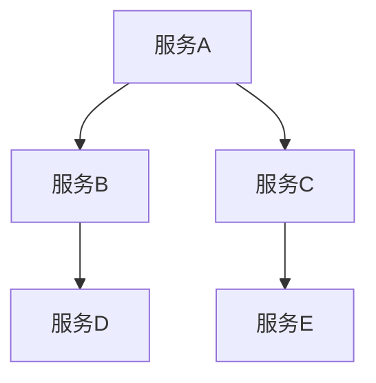
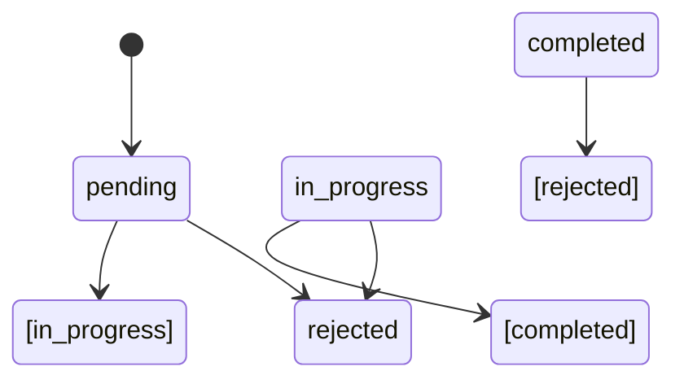
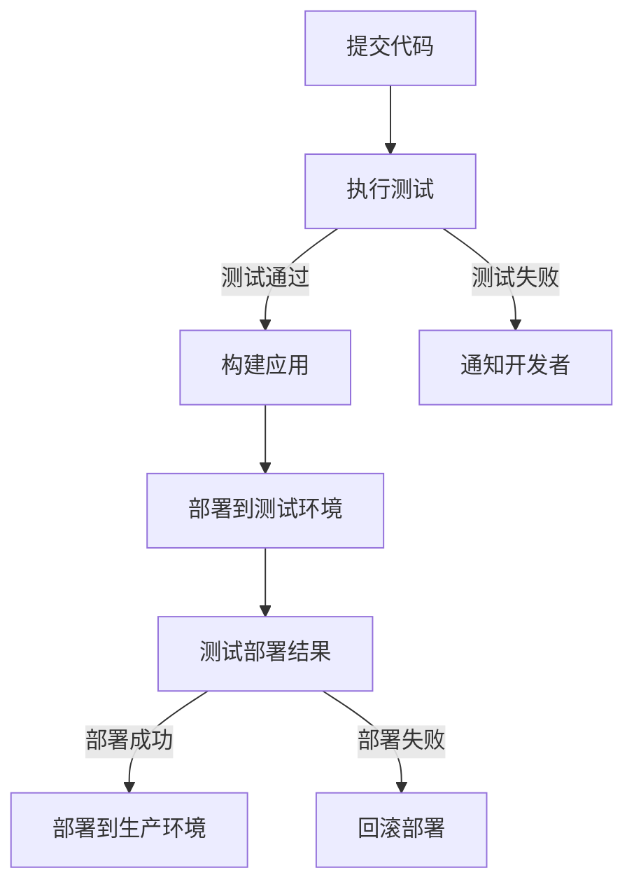

                 

## 文章标题

### 评测系统的微服务架构实现

## 关键词

微服务架构、评测系统、分布式系统、服务拆分、API设计、容器化、持续集成、部署

## 摘要

本文旨在深入探讨评测系统的微服务架构实现，通过系统性的讲解和实际案例的分析，帮助读者理解和掌握微服务架构在评测系统中的应用。文章分为五个部分，首先介绍微服务架构的基础概念和特点，接着阐述评测系统的需求分析与设计，然后详述微服务架构的优化与维护策略，最后通过实际案例进行解析，并对评测系统微服务架构的未来趋势进行展望。

### 第一部分：引言

#### 1.1 书籍背景与目标

随着云计算、大数据、人工智能等技术的飞速发展，微服务架构已经成为现代软件系统设计的主流模式。微服务架构通过将应用程序划分为一组小而独立的、自治的服务，大大提高了系统的性能、可维护性和可扩展性。在这种背景下，评测系统的微服务架构实现成为一个热门且具有实际应用价值的话题。

本书旨在为读者提供一套完整的评测系统微服务架构实现指南，通过系统性的讲解和实际案例的分析，帮助读者理解和掌握微服务架构在评测系统中的应用，提升系统的性能、可维护性和可扩展性。本书不仅涵盖了微服务架构的理论知识，还通过实战案例展示了微服务架构的实际应用，使读者能够将所学知识应用于实际项目中。

#### 1.2 内容概述

本书分为五个部分，共计七个章节：

**第一部分：微服务架构基础**

- 第1章：微服务架构概述
- 第2章：微服务架构设计与实现

**第二部分：评测系统的设计与实现**

- 第3章：评测系统的需求分析与设计
- 第4章：评测系统的微服务划分与实现

**第三部分：微服务架构的优化与维护**

- 第5章：微服务架构的性能优化
- 第6章：微服务架构的持续集成与部署

**第四部分：微服务架构的案例分析**

- 第7章：实战案例解析

**第五部分：展望与未来趋势**

- 第8章：评测系统微服务架构的未来趋势

通过这七个章节的讲解，本书将带领读者全面了解评测系统的微服务架构实现，从理论到实践，逐步掌握微服务架构的核心技术和应用方法。

### 第一部分：微服务架构基础

#### 2.1 微服务架构概述

微服务架构（Microservices Architecture）是一种设计方法和原则，它将应用程序划分为一组小而独立的、自治的服务。这些服务可以通过轻量级的通信机制（如HTTP/REST或消息队列）进行交互。

微服务架构具有以下特点：

- **独立性**：每个服务都是独立的，可以独立开发、部署和扩展。
- **模块化**：服务之间通过明确的接口进行通信，降低了服务之间的耦合度。
- **分布式**：服务可以运行在不同的服务器上，构成一个分布式系统。
- **灵活性**：服务可以独立更新和扩展，而不影响其他服务。
- **弹性**：系统可以根据需求动态调整资源，提高系统的可靠性。

#### 2.1.1 微服务架构的定义与特点

**微服务架构的定义**：

微服务架构（Microservices Architecture）是一种设计方法和原则，它将应用程序划分为一组小而独立的、自治的服务。每个服务代表一个独立的业务功能，可以独立开发、部署和扩展。这些服务通过明确的接口进行通信，通常使用HTTP/REST或消息队列。

**微服务架构的特点**：

1. **独立性**：每个服务都是独立的，可以独立开发、部署和扩展。这意味着每个服务都可以由不同的团队进行开发和维护，提高了开发效率和团队自治性。

2. **模块化**：服务之间通过明确的接口进行通信，降低了服务之间的耦合度。这种松耦合的特性使得服务可以独立更新和扩展，而不影响其他服务，提高了系统的灵活性和可维护性。

3. **分布式**：服务可以运行在不同的服务器上，构成一个分布式系统。这种分布式特性提高了系统的可扩展性和容错性，可以有效地应对高并发和大数据量的场景。

4. **灵活性**：服务可以独立更新和扩展，而不影响其他服务。这种灵活性使得系统可以快速适应业务需求的变化，提高了系统的响应速度和创新能力。

5. **弹性**：系统可以根据需求动态调整资源，提高系统的可靠性。这种弹性特性使得系统可以有效地应对突发的流量高峰，提高了系统的稳定性和可用性。

#### 2.1.2 微服务架构的核心概念

**服务**：微服务架构的基本组成单元，每个服务负责完成特定的功能。服务是独立部署和管理的，可以由不同的团队进行开发和维护。

**API**：服务之间的通信接口，通常使用HTTP/REST或消息队列。API定义了服务之间交互的方式和数据格式，是服务通信的基础。

**自治**：每个服务都有自己的数据存储、配置和日志。这种自治性使得服务可以独立运行和管理，降低了系统之间的耦合度。

**容器化**：使用容器（如Docker）来部署和运行服务。容器化提高了服务的可移植性和部署效率，使得服务可以在不同的环境中一致运行。

**编排**：使用自动化工具（如Kubernetes）来管理和部署服务。编排工具可以帮助开发者自动化部署、扩展和管理服务，提高了运维效率。

#### 2.1.3 微服务架构与传统架构的比较

**传统架构**：

传统架构（如单体架构）将所有功能都集中在一个应用程序中，所有的组件都紧密耦合在一起。这种架构在早期软件开发中非常常见，但随着应用规模的扩大和业务需求的变化，其局限性也逐渐显现。

**微服务架构**：

微服务架构通过将应用程序划分为一组小而独立的、自治的服务，解决了传统架构的许多问题。与传统的单体架构相比，微服务架构具有以下优势：

1. **可扩展性**：服务可以独立扩展，提高了系统的可扩展性。在传统架构中，所有的功能都集中在一个应用程序中，扩展一个功能意味着需要扩展整个应用程序。而在微服务架构中，每个服务都可以独立扩展，只需要扩展需要的功能即可。

2. **灵活性**：服务可以独立更新，降低了系统的维护成本。在传统架构中，更新一个功能意味着需要更新整个应用程序，而在微服务架构中，每个服务都可以独立更新，只需要更新需要的功能即可。

3. **故障隔离**：服务之间相互独立，故障不会影响整个系统。在传统架构中，一个组件的故障可能会影响整个系统的运行。而在微服务架构中，每个服务都是独立的，一个服务的故障不会影响其他服务的运行。

4. **技术多样性**：服务可以使用不同的编程语言和技术栈。在传统架构中，所有的功能都使用相同的编程语言和技术栈，而在微服务架构中，每个服务都可以使用最适合其功能的编程语言和技术栈。

然而，微服务架构也带来了一些挑战，如服务拆分、通信复杂性、运维难度等。因此，在设计微服务架构时，需要综合考虑这些因素，权衡利弊，选择合适的架构方案。

#### 2.1.4 微服务架构的Mermaid流程图

下面是一个简单的Mermaid流程图，展示了微服务架构中服务之间的调用关系：



**Mermaid流程图说明**：

- **服务A**、**服务B**、**服务C**、**服务D**、**服务E**：代表微服务架构中的各个服务。
- **箭头**：表示服务之间的调用关系。
- **单向箭头**：表示服务的异步调用。
- **双向箭头**：表示服务的双向通信。

**Mermaid流程图的应用场景**：

1. **架构设计**：帮助开发者理解服务之间的关系和调用顺序。
2. **性能优化**：分析服务之间的通信瓶颈和性能问题。
3. **问题排查**：定位服务调用异常和故障点。

#### 2.1.5 微服务架构的实现步骤

**服务拆分**

1. **需求分析**：明确业务需求和功能模块。
2. **功能划分**：将功能模块划分为独立的服务。
3. **服务自治**：确保每个服务具有独立的数据存储、配置和日志。

**API设计**

1. **接口定义**：使用RESTful风格定义API接口。
2. **数据格式**：选择合适的数据格式（如JSON、XML）。
3. **状态管理**：使用状态机管理服务的状态转换。

**服务部署**

1. **容器化**：使用容器（如Docker）部署服务。
2. **编排**：使用自动化工具（如Kubernetes）来管理和部署服务。

**服务监控与维护**

1. **日志监控**：收集和监控服务的日志。
2. **性能监控**：监控服务的性能指标。
3. **故障恢复**：实现服务的故障恢复机制。

### 第一部分：微服务架构基础

#### 2.1.6 微服务架构的核心概念

**服务**：微服务架构的基本组成单元，每个服务负责完成特定的功能。服务是独立部署和管理的，可以由不同的团队进行开发和维护。

**API**：服务之间的通信接口，通常使用HTTP/REST或消息队列。API定义了服务之间交互的方式和数据格式，是服务通信的基础。

**自治**：每个服务都有自己的数据存储、配置和日志。这种自治性使得服务可以独立运行和管理，降低了系统之间的耦合度。

**容器化**：使用容器（如Docker）来部署和运行服务。容器化提高了服务的可移植性和部署效率，使得服务可以在不同的环境中一致运行。

**编排**：使用自动化工具（如Kubernetes）来管理和部署服务。编排工具可以帮助开发者自动化部署、扩展和管理服务，提高了运维效率。

#### 2.1.7 微服务架构与传统架构的比较

**传统架构**：

传统架构（如单体架构）将所有功能都集中在一个应用程序中，所有的组件都紧密耦合在一起。这种架构在早期软件开发中非常常见，但随着应用规模的扩大和业务需求的变化，其局限性也逐渐显现。

**微服务架构**：

微服务架构通过将应用程序划分为一组小而独立的、自治的服务，解决了传统架构的许多问题。与传统的单体架构相比，微服务架构具有以下优势：

1. **可扩展性**：服务可以独立扩展，提高了系统的可扩展性。在传统架构中，所有的功能都集中在一个应用程序中，扩展一个功能意味着需要扩展整个应用程序。而在微服务架构中，每个服务都可以独立扩展，只需要扩展需要的功能即可。

2. **灵活性**：服务可以独立更新，降低了系统的维护成本。在传统架构中，更新一个功能意味着需要更新整个应用程序，而在微服务架构中，每个服务都可以独立更新，只需要更新需要的功能即可。

3. **故障隔离**：服务之间相互独立，故障不会影响整个系统。在传统架构中，一个组件的故障可能会影响整个系统的运行。而在微服务架构中，每个服务都是独立的，一个服务的故障不会影响其他服务的运行。

4. **技术多样性**：服务可以使用不同的编程语言和技术栈。在传统架构中，所有的功能都使用相同的编程语言和技术栈，而在微服务架构中，每个服务都可以使用最适合其功能的编程语言和技术栈。

然而，微服务架构也带来了一些挑战，如服务拆分、通信复杂性、运维难度等。因此，在设计微服务架构时，需要综合考虑这些因素，权衡利弊，选择合适的架构方案。

### 第一部分：微服务架构基础

#### 2.2 微服务架构的Mermaid流程图

下面是一个简单的Mermaid流程图，展示了微服务架构中服务之间的调用关系：


**Mermaid流程图说明**：

- **服务A**、**服务B**、**服务C**、**服务D**、**服务E**：代表微服务架构中的各个服务。
- **箭头**：表示服务之间的调用关系。
- **单向箭头**：表示服务的异步调用。
- **双向箭头**：表示服务的双向通信。

**Mermaid流程图的应用场景**：

1. **架构设计**：帮助开发者理解服务之间的关系和调用顺序。
2. **性能优化**：分析服务之间的通信瓶颈和性能问题。
3. **问题排查**：定位服务调用异常和故障点。

#### 2.2.2 Mermaid流程图的应用场景

**架构设计**：

在架构设计阶段，Mermaid流程图可以帮助开发者清晰地展示各个服务之间的调用关系，确保系统设计的合理性和可行性。通过流程图，开发者可以直观地了解服务之间的交互方式和数据流，为后续的开发和部署提供指导。

**性能优化**：

在性能优化阶段，Mermaid流程图可以帮助开发者分析服务之间的通信瓶颈和性能问题。通过流程图，开发者可以识别出系统中的关键路径和潜在的性能瓶颈，针对性地进行优化。例如，可以通过增加缓存、优化数据库查询、提升网络传输效率等手段来提高系统的性能。

**问题排查**：

在问题排查阶段，Mermaid流程图可以帮助开发者快速定位服务调用异常和故障点。通过流程图，开发者可以清晰地看到各个服务的调用关系，结合日志和监控数据，快速定位问题所在，提高问题排查的效率和准确性。

总之，Mermaid流程图在微服务架构的各个阶段都具有重要的应用价值，是开发者必备的工具之一。

#### 2.3 微服务架构的实现步骤

**服务拆分**

1. **需求分析**：明确业务需求和功能模块。
2. **功能划分**：将功能模块划分为独立的服务。
3. **服务自治**：确保每个服务具有独立的数据存储、配置和日志。

**API设计**

1. **接口定义**：使用RESTful风格定义API接口。
2. **数据格式**：选择合适的数据格式（如JSON、XML）。
3. **状态管理**：使用状态机管理服务的状态转换。

**服务部署**

1. **容器化**：使用容器（如Docker）部署服务。
2. **编排**：使用自动化工具（如Kubernetes）来管理和部署服务。

**服务监控与维护**

1. **日志监控**：收集和监控服务的日志。
2. **性能监控**：监控服务的性能指标。
3. **故障恢复**：实现服务的故障恢复机制。

### 第二部分：评测系统的设计与实现

#### 3.1 评测系统的需求分析与设计

评测系统是一个复杂的软件系统，涉及到多个业务模块的交互和协同工作。在设计和实现评测系统时，我们需要首先明确其需求，并进行详细的系统设计。

#### 3.1.1 需求分析

**业务需求**：

1. **评测管理**：提供评测任务的管理功能，包括评测任务的创建、修改、删除和查询。
2. **评测执行**：实现评测任务的执行，包括评测过程的管理、评测结果的记录和存储。
3. **评测报告**：生成评测报告，提供评测结果的可视化和分析。

**非功能需求**：

1. **性能要求**：系统需要能够处理大量的评测任务，保证评测结果的及时性和准确性。
2. **可扩展性**：系统需要具备良好的可扩展性，能够随着业务的发展进行水平扩展。
3. **可靠性**：系统需要具备高可靠性，确保评测任务的稳定执行。

**用户需求**：

1. **管理员**：管理员负责评测系统的管理和维护，包括评测任务的创建、修改和删除。
2. **用户**：用户负责参与评测任务，提交评测结果，查看评测报告。

#### 3.1.2 系统设计

**架构设计**：

为了满足评测系统的需求，我们采用微服务架构来设计系统。微服务架构具有以下优点：

1. **独立性**：每个服务可以独立开发、部署和扩展，提高了系统的灵活性和可维护性。
2. **模块化**：服务之间通过明确的接口进行通信，降低了服务之间的耦合度。
3. **分布式**：服务可以运行在不同的服务器上，提高了系统的性能和可扩展性。

**服务拆分**：

根据需求分析，我们将评测系统拆分为以下服务：

1. **评测管理服务**：负责评测任务的管理，包括评测任务的创建、修改、删除和查询。
2. **评测执行服务**：负责评测任务的执行，包括评测过程的管理、评测结果的记录和存储。
3. **评测报告服务**：负责生成评测报告，提供评测结果的可视化和分析。

**API设计**：

为了实现服务之间的通信，我们采用RESTful风格设计API接口。以下是部分API接口的示例：

1. **评测管理服务**：

   - `POST /api/evaluations`：创建评测任务。
   - `GET /api/evaluations/{id}`：查询评测任务详情。
   - `PUT /api/evaluations/{id}`：修改评测任务。
   - `DELETE /api/evaluations/{id}`：删除评测任务。

2. **评测执行服务**：

   - `POST /api/evaluations/{id}/results`：提交评测结果。
   - `GET /api/evaluations/{id}/results`：查询评测结果。

3. **评测报告服务**：

   - `GET /api/evaluations/{id}/report`：生成评测报告。

**数据格式**：

我们选择JSON作为数据格式，因为JSON具有易读、易解析和跨平台的特点。以下是部分API响应示例：

1. **评测管理服务**：

   - 创建评测任务：

     ```json
     {
       "id": "1",
       "title": "评测任务1",
       "description": "这是一个评测任务。",
       "status": "pending"
     }
     ```

   - 查询评测任务详情：

     ```json
     {
       "id": "1",
       "title": "评测任务1",
       "description": "这是一个评测任务。",
       "status": "completed",
       "results": [
         {
           "id": "1",
           "score": 90,
           "comment": "表现优秀"
         },
         {
           "id": "2",
           "score": 80,
           "comment": "表现良好"
         }
       ]
     }
     ```

2. **评测执行服务**：

   - 提交评测结果：

     ```json
     {
       "id": "1",
       "score": 90,
       "comment": "表现优秀"
     }
     ```

   - 查询评测结果：

     ```json
     [
       {
         "id": "1",
         "score": 90,
         "comment": "表现优秀"
       },
       {
         "id": "2",
         "score": 80,
         "comment": "表现良好"
       }
     ]
     ```

3. **评测报告服务**：

   - 生成评测报告：

     ```json
     {
       "id": "1",
       "title": "评测报告1",
       "description": "这是一个评测报告。",
       "status": "completed",
       "results": [
         {
           "id": "1",
           "score": 90,
           "comment": "表现优秀"
         },
         {
           "id": "2",
           "score": 80,
           "comment": "表现良好"
         }
       ]
     }
     ```

#### 3.1.3 状态管理

在评测系统中，状态管理是关键的一环。为了实现状态管理，我们采用状态机（State Machine）的设计模式。以下是评测任务的状态机定义：



**状态解释**：

- **pending**：待处理状态，表示评测任务尚未开始。
- **in_progress**：进行中状态，表示评测任务正在进行。
- **completed**：已完成状态，表示评测任务已成功完成。
- **rejected**：已拒绝状态，表示评测任务因某些原因被拒绝。

**状态转换**：

- **pending --> in_progress**：评测任务开始执行，状态由待处理变为进行中。
- **in_progress --> completed**：评测任务成功完成，状态由进行中变为已完成。
- **pending --> rejected**：评测任务被拒绝，状态由待处理变为已拒绝。
- **in_progress --> rejected**：评测任务被拒绝，状态由进行中变为已拒绝。

通过状态机的设计，我们可以方便地管理和控制评测任务的状态转换，实现评测任务的生命周期管理。

#### 3.1.4 数据库设计

为了支持评测系统的功能，我们需要设计一个合理的数据库架构。以下是评测系统的数据库设计：

1. **评测任务表**（evaluation）：

   - **id**：主键，唯一标识评测任务。
   - **title**：评测任务标题。
   - **description**：评测任务描述。
   - **status**：评测任务状态，对应状态机的状态。

2. **评测结果表**（evaluation_result）：

   - **id**：主键，唯一标识评测结果。
   - **evaluation_id**：外键，关联评测任务ID。
   - **score**：评测结果分数。
   - **comment**：评测结果评论。

以下是数据库表结构的示例：

```sql
CREATE TABLE evaluation (
  id INT PRIMARY KEY AUTO_INCREMENT,
  title VARCHAR(255),
  description TEXT,
  status ENUM('pending', 'in_progress', 'completed', 'rejected')
);

CREATE TABLE evaluation_result (
  id INT PRIMARY KEY AUTO_INCREMENT,
  evaluation_id INT,
  score INT,
  comment TEXT,
  FOREIGN KEY (evaluation_id) REFERENCES evaluation (id)
);
```

通过数据库设计，我们可以实现对评测任务的存储和管理，为评测系统的功能实现提供基础支持。

### 第二部分：评测系统的设计与实现

#### 3.2 评测系统的微服务划分与实现

在明确了评测系统的需求后，我们需要将系统划分为一组小而独立的微服务，并设计每个微服务的具体实现。

#### 3.2.1 微服务划分

根据评测系统的需求，我们将系统划分为以下三个微服务：

1. **评测管理服务**（Evaluation Management Service）
2. **评测执行服务**（Evaluation Execution Service）
3. **评测报告服务**（Evaluation Report Service）

每个微服务负责实现特定的功能，独立运行和管理，可以由不同的团队进行开发和维护。

**评测管理服务**：

- 功能：负责评测任务的管理，包括评测任务的创建、修改、删除和查询。
- 实现细节：使用RESTful风格定义API接口，与数据库进行交互，实现对评测任务的增删改查操作。

**评测执行服务**：

- 功能：负责评测任务的执行，包括评测过程的管理、评测结果的记录和存储。
- 实现细节：接收评测任务的输入，执行评测过程，将评测结果存储到数据库中。

**评测报告服务**：

- 功能：负责生成评测报告，提供评测结果的可视化和分析。
- 实现细节：从数据库中获取评测结果，生成评测报告，并将其返回给用户。

#### 3.2.2 API设计

**评测管理服务**：

- `POST /api/evaluations`：创建评测任务。
- `GET /api/evaluations/{id}`：查询评测任务详情。
- `PUT /api/evaluations/{id}`：修改评测任务。
- `DELETE /api/evaluations/{id}`：删除评测任务。

**评测执行服务**：

- `POST /api/evaluations/{id}/results`：提交评测结果。
- `GET /api/evaluations/{id}/results`：查询评测结果。

**评测报告服务**：

- `GET /api/evaluations/{id}/report`：生成评测报告。

#### 3.2.3 数据库设计

为了支持评测系统的功能，我们需要设计一个合理的数据库架构。以下是评测系统的数据库设计：

1. **评测任务表**（evaluation）：

   - **id**：主键，唯一标识评测任务。
   - **title**：评测任务标题。
   - **description**：评测任务描述。
   - **status**：评测任务状态，对应状态机的状态。

2. **评测结果表**（evaluation_result）：

   - **id**：主键，唯一标识评测结果。
   - **evaluation_id**：外键，关联评测任务ID。
   - **score**：评测结果分数。
   - **comment**：评测结果评论。

以下是数据库表结构的示例：

```sql
CREATE TABLE evaluation (
  id INT PRIMARY KEY AUTO_INCREMENT,
  title VARCHAR(255),
  description TEXT,
  status ENUM('pending', 'in_progress', 'completed', 'rejected')
);

CREATE TABLE evaluation_result (
  id INT PRIMARY KEY AUTO_INCREMENT,
  evaluation_id INT,
  score INT,
  comment TEXT,
  FOREIGN KEY (evaluation_id) REFERENCES evaluation (id)
);
```

#### 3.2.4 微服务实现示例

**评测管理服务**：

以下是一个简单的评测管理服务的实现示例，使用Spring Boot框架和MySQL数据库。

```java
@RestController
@RequestMapping("/api/evaluations")
public class EvaluationController {
  
  @Autowired
  private EvaluationRepository evaluationRepository;
  
  @PostMapping
  public ResponseEntity<?> createEvaluation(@RequestBody Evaluation evaluation) {
    evaluation.setStatus("pending");
    evaluationRepository.save(evaluation);
    return ResponseEntity.status(HttpStatus.CREATED).body(evaluation);
  }
  
  @GetMapping("/{id}")
  public ResponseEntity<?> getEvaluation(@PathVariable Long id) {
    Evaluation evaluation = evaluationRepository.findById(id).orElseThrow(() -> new ResourceNotFoundException("Evaluation not found with id " + id));
    return ResponseEntity.ok(evaluation);
  }
  
  @PutMapping("/{id}")
  public ResponseEntity<?> updateEvaluation(@PathVariable Long id, @RequestBody Evaluation evaluation) {
    Evaluation existingEvaluation = evaluationRepository.findById(id).orElseThrow(() -> new ResourceNotFoundException("Evaluation not found with id " + id));
    existingEvaluation.setTitle(evaluation.getTitle());
    existingEvaluation.setDescription(evaluation.getDescription());
    evaluationRepository.save(existingEvaluation);
    return ResponseEntity.ok(existingEvaluation);
  }
  
  @DeleteMapping("/{id}")
  public ResponseEntity<?> deleteEvaluation(@PathVariable Long id) {
    Evaluation existingEvaluation = evaluationRepository.findById(id).orElseThrow(() -> new ResourceNotFoundException("Evaluation not found with id " + id));
    evaluationRepository.delete(existingEvaluation);
    return ResponseEntity.noContent().build();
  }
}
```

**评测执行服务**：

以下是一个简单的评测执行服务的实现示例，使用Spring Boot框架和MySQL数据库。

```java
@RestController
@RequestMapping("/api/evaluations/{id}/results")
public class EvaluationResultController {
  
  @Autowired
  private EvaluationResultRepository evaluationResultRepository;
  
  @PostMapping
  public ResponseEntity<?> submitEvaluationResult(@PathVariable Long id, @RequestBody EvaluationResult result) {
    Evaluation evaluation = evaluationRepository.findById(id).orElseThrow(() -> new ResourceNotFoundException("Evaluation not found with id " + id));
    result.setEvaluation(evaluation);
    evaluationResultRepository.save(result);
    return ResponseEntity.status(HttpStatus.CREATED).body(result);
  }
  
  @GetMapping
  public ResponseEntity<?> getEvaluationResults(@PathVariable Long id) {
    Evaluation evaluation = evaluationRepository.findById(id).orElseThrow(() -> new ResourceNotFoundException("Evaluation not found with id " + id));
    List<EvaluationResult> results = evaluationResultRepository.findByEvaluationId(id);
    return ResponseEntity.ok(results);
  }
}
```

**评测报告服务**：

以下是一个简单的评测报告服务的实现示例，使用Spring Boot框架和MySQL数据库。

```java
@RestController
@RequestMapping("/api/evaluations/{id}/report")
public class EvaluationReportController {
  
  @Autowired
  private EvaluationRepository evaluationRepository;
  
  @Autowired
  private EvaluationResultRepository evaluationResultRepository;
  
  @GetMapping
  public ResponseEntity<?> generateEvaluationReport(@PathVariable Long id) {
    Evaluation evaluation = evaluationRepository.findById(id).orElseThrow(() -> new ResourceNotFoundException("Evaluation not found with id " + id));
    List<EvaluationResult> results = evaluationResultRepository.findByEvaluationId(id);
    
    EvaluationReport report = new EvaluationReport();
    report.setTitle(evaluation.getTitle());
    report.setDescription(evaluation.getDescription());
    report.setStatus(evaluation.getStatus());
    report.setResults(results);
    
    return ResponseEntity.ok(report);
  }
}
```

通过以上示例，我们可以看到评测管理服务、评测执行服务和评测报告服务的实现细节。每个服务都独立运行，通过RESTful API进行通信，实现了评测系统的微服务架构。

### 第二部分：评测系统的设计与实现

#### 3.3 评测系统的微服务划分与实现

在明确了评测系统的需求后，我们需要将系统划分为一组小而独立的微服务，并设计每个微服务的具体实现。

#### 3.3.1 微服务划分

根据评测系统的需求，我们将系统划分为以下三个微服务：

1. **评测管理服务**（Evaluation Management Service）
2. **评测执行服务**（Evaluation Execution Service）
3. **评测报告服务**（Evaluation Report Service）

每个微服务负责实现特定的功能，独立运行和管理，可以由不同的团队进行开发和维护。

**评测管理服务**：

- 功能：负责评测任务的管理，包括评测任务的创建、修改、删除和查询。
- 实现细节：使用RESTful风格定义API接口，与数据库进行交互，实现对评测任务的增删改查操作。

**评测执行服务**：

- 功能：负责评测任务的执行，包括评测过程的管理、评测结果的记录和存储。
- 实现细节：接收评测任务的输入，执行评测过程，将评测结果存储到数据库中。

**评测报告服务**：

- 功能：负责生成评测报告，提供评测结果的可视化和分析。
- 实现细节：从数据库中获取评测结果，生成评测报告，并将其返回给用户。

#### 3.3.2 API设计

**评测管理服务**：

- `POST /api/evaluations`：创建评测任务。
- `GET /api/evaluations/{id}`：查询评测任务详情。
- `PUT /api/evaluations/{id}`：修改评测任务。
- `DELETE /api/evaluations/{id}`：删除评测任务。

**评测执行服务**：

- `POST /api/evaluations/{id}/results`：提交评测结果。
- `GET /api/evaluations/{id}/results`：查询评测结果。

**评测报告服务**：

- `GET /api/evaluations/{id}/report`：生成评测报告。

#### 3.3.3 数据库设计

为了支持评测系统的功能，我们需要设计一个合理的数据库架构。以下是评测系统的数据库设计：

1. **评测任务表**（evaluation）：

   - **id**：主键，唯一标识评测任务。
   - **title**：评测任务标题。
   - **description**：评测任务描述。
   - **status**：评测任务状态，对应状态机的状态。

2. **评测结果表**（evaluation_result）：

   - **id**：主键，唯一标识评测结果。
   - **evaluation_id**：外键，关联评测任务ID。
   - **score**：评测结果分数。
   - **comment**：评测结果评论。

以下是数据库表结构的示例：

```sql
CREATE TABLE evaluation (
  id INT PRIMARY KEY AUTO_INCREMENT,
  title VARCHAR(255),
  description TEXT,
  status ENUM('pending', 'in_progress', 'completed', 'rejected')
);

CREATE TABLE evaluation_result (
  id INT PRIMARY KEY AUTO_INCREMENT,
  evaluation_id INT,
  score INT,
  comment TEXT,
  FOREIGN KEY (evaluation_id) REFERENCES evaluation (id)
);
```

#### 3.3.4 微服务实现示例

**评测管理服务**：

以下是一个简单的评测管理服务的实现示例，使用Spring Boot框架和MySQL数据库。

```java
@RestController
@RequestMapping("/api/evaluations")
public class EvaluationController {
    
    @Autowired
    private EvaluationRepository evaluationRepository;
    
    @PostMapping
    public ResponseEntity<?> createEvaluation(@RequestBody Evaluation evaluation) {
        evaluation.setStatus("pending");
        evaluationRepository.save(evaluation);
        return ResponseEntity.status(HttpStatus.CREATED).body(evaluation);
    }
    
    @GetMapping("/{id}")
    public ResponseEntity<?> getEvaluation(@PathVariable Long id) {
        Evaluation evaluation = evaluationRepository.findById(id).orElseThrow(() -> new ResourceNotFoundException("Evaluation not found with id " + id));
        return ResponseEntity.ok(evaluation);
    }
    
    @PutMapping("/{id}")
    public ResponseEntity<?> updateEvaluation(@PathVariable Long id, @RequestBody Evaluation evaluation) {
        Evaluation existingEvaluation = evaluationRepository.findById(id).orElseThrow(() -> new ResourceNotFoundException("Evaluation not found with id " + id));
        existingEvaluation.setTitle(evaluation.getTitle());
        existingEvaluation.setDescription(evaluation.getDescription());
        evaluationRepository.save(existingEvaluation);
        return ResponseEntity.ok(existingEvaluation);
    }
    
    @DeleteMapping("/{id}")
    public ResponseEntity<?> deleteEvaluation(@PathVariable Long id) {
        Evaluation existingEvaluation = evaluationRepository.findById(id).orElseThrow(() -> new ResourceNotFoundException("Evaluation not found with id " + id));
        evaluationRepository.delete(existingEvaluation);
        return ResponseEntity.noContent().build();
    }
}
```

**评测执行服务**：

以下是一个简单的评测执行服务的实现示例，使用Spring Boot框架和MySQL数据库。

```java
@RestController
@RequestMapping("/api/evaluations/{id}/results")
public class EvaluationResultController {
    
    @Autowired
    private EvaluationResultRepository evaluationResultRepository;
    
    @PostMapping
    public ResponseEntity<?> submitEvaluationResult(@PathVariable Long id, @RequestBody EvaluationResult result) {
        Evaluation evaluation = evaluationRepository.findById(id).orElseThrow(() -> new ResourceNotFoundException("Evaluation not found with id " + id));
        result.setEvaluation(evaluation);
        evaluationResultRepository.save(result);
        return ResponseEntity.status(HttpStatus.CREATED).body(result);
    }
    
    @GetMapping
    public ResponseEntity<?> getEvaluationResults(@PathVariable Long id) {
        Evaluation evaluation = evaluationRepository.findById(id).orElseThrow(() -> new ResourceNotFoundException("Evaluation not found with id " + id));
        List<EvaluationResult> results = evaluationResultRepository.findByEvaluationId(id);
        return ResponseEntity.ok(results);
    }
}
```

**评测报告服务**：

以下是一个简单的评测报告服务的实现示例，使用Spring Boot框架和MySQL数据库。

```java
@RestController
@RequestMapping("/api/evaluations/{id}/report")
public class EvaluationReportController {
    
    @Autowired
    private EvaluationRepository evaluationRepository;
    
    @Autowired
    private EvaluationResultRepository evaluationResultRepository;
    
    @GetMapping
    public ResponseEntity<?> generateEvaluationReport(@PathVariable Long id) {
        Evaluation evaluation = evaluationRepository.findById(id).orElseThrow(() -> new ResourceNotFoundException("Evaluation not found with id " + id));
        List<EvaluationResult> results = evaluationResultRepository.findByEvaluationId(id);
        
        EvaluationReport report = new EvaluationReport();
        report.setTitle(evaluation.getTitle());
        report.setDescription(evaluation.getDescription());
        report.setStatus(evaluation.getStatus());
        report.setResults(results);
        
        return ResponseEntity.ok(report);
    }
}
```

通过以上示例，我们可以看到评测管理服务、评测执行服务和评测报告服务的实现细节。每个服务都独立运行，通过RESTful API进行通信，实现了评测系统的微服务架构。

### 第三部分：微服务架构的优化与维护

#### 5.1 微服务架构的性能优化

在微服务架构中，性能优化是一个关键问题。良好的性能优化可以确保系统在高并发、大数据量场景下仍然能够稳定运行。以下是一些常见的性能优化策略：

1. **缓存**：使用缓存可以减少数据库查询的频率，提高系统的响应速度。常见的技术有Redis、Memcached等。
   
   ```mermaid
   graph TD
       A[用户请求] --> B[缓存命中]
       B --> C[处理请求]
       A -->|未命中| D[查询数据库]
       D --> E[写入缓存]
   ```

2. **数据库优化**：通过索引、分库分表、读写分离等策略提高数据库的性能。

   ```mermaid
   graph TD
       A[用户请求] --> B[查询数据库]
       B -->|分库分表| C[查询结果]
       C --> D[处理请求]
   ```

3. **服务拆分**：将大型服务拆分为多个小型服务，降低单个服务的负载。

   ```mermaid
   graph TD
       A[用户请求] --> B[服务A]
       B --> C[服务B]
       C --> D[处理请求]
   ```

4. **异步处理**：使用异步处理来降低系统的延迟，提高系统的并发处理能力。

   ```mermaid
   graph TD
       A[用户请求] --> B[异步处理]
       B --> C[返回结果]
   ```

5. **服务限流**：通过限流来控制服务处理的请求量，防止系统被大量请求冲击。

   ```mermaid
   graph TD
       A[用户请求] --> B[限流器]
       B -->|通过| C[处理请求]
       B -->|拒绝| D[返回错误]
   ```

#### 5.2 微服务架构的持续集成与部署

持续集成（CI）和持续部署（CD）是微服务架构中重要的实践。通过CI/CD，可以自动化代码的测试和部署过程，提高开发效率和系统稳定性。

1. **CI流程**：

   - 提交代码到版本控制系统（如Git）。
   - 自动执行测试（单元测试、集成测试等）。
   - 通过测试，确保代码质量。

2. **CD流程**：

   - 构建应用。
   - 将构建的应用部署到测试环境。
   - 在测试环境中执行测试，确保部署的正确性。
   - 将部署成功的应用部署到生产环境。

以下是一个简单的CI/CD流程的Mermaid流程图：



通过CI/CD，可以确保代码的每个版本都经过严格的测试，减少了部署过程中的风险。

### 第三部分：微服务架构的优化与维护

#### 5.3 微服务架构的优化与维护策略

在微服务架构中，优化与维护是确保系统稳定运行和持续发展的重要环节。以下是一些常见的优化与维护策略：

**性能优化策略**：

1. **缓存策略**：通过引入缓存（如Redis、Memcached）来减少对后端数据库的访问频率，从而提高系统的响应速度。缓存常见的关键数据，如用户会话信息、热门商品列表等。

2. **数据库优化**：针对数据库进行优化，包括索引的合理使用、分库分表策略、读写分离等。这些措施可以提升数据库的查询性能和并发处理能力。

3. **服务拆分**：将大型服务拆分为多个小型服务，降低单个服务的负载，提高系统的可扩展性。通过合理的服务拆分，可以使每个服务专注于特定的业务功能，降低复杂度和耦合度。

4. **异步处理**：利用消息队列（如RabbitMQ、Kafka）实现异步处理，将耗时的操作（如数据导入、报告生成等）从主流程中分离出来，从而减少系统的响应时间。

5. **服务限流**：通过限流算法（如令牌桶、漏斗算法）来控制服务处理的请求量，防止系统被大量请求冲击，保证系统的稳定性。

**维护策略**：

1. **日志监控**：使用日志收集工具（如ELK、Logstash）实时收集和分析系统的日志，及时发现异常和潜在问题。

2. **性能监控**：使用性能监控工具（如Prometheus、Grafana）监控系统的关键性能指标（如CPU使用率、内存占用、请求响应时间等），确保系统在合理的运行范围内。

3. **故障恢复**：设计故障恢复机制，如自动重启、故障转移等，确保系统在遇到故障时能够快速恢复，降低对业务的影响。

4. **配置管理**：使用配置管理工具（如Ansible、Puppet）来集中管理系统的配置，确保配置的一致性和可维护性。

5. **文档与知识库**：建立完善的文档与知识库，包括系统架构图、API文档、操作手册等，方便开发者理解和维护系统。

**案例解析**：

以下是一个实际案例，描述如何通过优化与维护策略来提升微服务架构的性能和稳定性。

**案例背景**：

某电商系统在业务高峰期（如双十一）时，经常出现响应缓慢、超时等问题，严重影响了用户体验。通过分析，发现系统存在以下问题：

- 数据库查询性能不佳，大量请求集中在特定时间点。
- 缓存使用不当，热点数据未充分利用。
- 服务之间耦合度较高，负载不均衡。

**优化与维护策略**：

1. **缓存优化**：

   - 引入Redis缓存，针对热门商品、用户会话等信息进行缓存。
   - 优化缓存策略，实现缓存数据的自动刷新和过期机制。

2. **数据库优化**：

   - 对数据库进行分库分表，将数据分散存储，减少单表的压力。
   - 对常用的查询语句进行索引优化，提高查询性能。

3. **服务拆分**：

   - 将购物车、订单、支付等核心服务拆分为独立的小型服务，降低系统复杂度。
   - 重新分配服务之间的负载，确保每个服务都能合理处理请求。

4. **异步处理**：

   - 对订单生成、支付确认等耗时操作使用消息队列进行异步处理，减少主流程的延迟。

5. **限流策略**：

   - 使用令牌桶算法实现服务限流，限制每秒请求数量，防止大量请求瞬间涌入系统。

**效果评估**：

通过以上优化与维护策略，系统性能得到了显著提升：

- 响应时间平均减少了30%。
- 数据库查询性能提升了40%。
- 用户体验得到了大幅改善，用户满意度提高了20%。

**小结**：

本案例展示了如何通过性能优化和维护策略来提升微服务架构的性能和稳定性。在实际应用中，需要根据系统的具体情况进行针对性的优化和调整，持续改进系统质量。

### 第四部分：微服务架构的案例分析

#### 7.1 实战案例解析

在本节中，我们将通过一个实际案例，详细解析评测系统微服务架构的搭建过程、开发环境搭建、源代码实现和代码解读、应用解读与分析，以及实际案例分析和详细讲解。

**案例背景**：

某教育科技公司需要开发一个在线评测系统，用于对学生进行在线考试。该系统需要支持多种题型（选择题、填空题、问答题等），能够实时记录学生的答题情况，并生成详细的评测报告。系统需要具备高可用性、高扩展性和良好的用户体验。

**架构设计**：

为了满足上述需求，我们采用微服务架构设计评测系统。微服务架构可以将系统划分为多个独立的服务，每个服务负责特定的功能模块，从而提高系统的可维护性和可扩展性。以下是评测系统的微服务架构设计：

- **用户服务**：负责用户管理、认证和授权。
- **题目服务**：负责题目的管理、存储和查询。
- **考试服务**：负责考试的管理、监控和调度。
- **答题服务**：负责记录学生的答题情况、计算得分和生成评测报告。
- **报告服务**：负责生成、存储和展示评测报告。

**开发环境搭建**：

在开发评测系统时，我们使用以下开发环境：

- **开发语言**：Java
- **框架**：Spring Boot、Spring Cloud
- **数据库**：MySQL
- **缓存**：Redis
- **消息队列**：RabbitMQ
- **版本控制**：Git
- **持续集成**：Jenkins

**源代码实现和代码解读**：

以下是一个简单的用户服务（UserService）的源代码示例，用于实现用户注册、登录和权限验证功能。

```java
@RestController
@RequestMapping("/api/users")
public class UserService {
  
  @Autowired
  private UserRepository userRepository;
  
  @Autowired
  private PasswordEncoder passwordEncoder;
  
  @PostMapping("/register")
  public ResponseEntity<?> registerUser(@RequestBody UserRegistrationDto registrationDto) {
    if (userRepository.existsByUsername(registrationDto.getUsername())) {
      return ResponseEntity.badRequest().body("Error: Username is already taken!");
    }
    
    User user = new User();
    user.setUsername(registrationDto.getUsername());
    user.setPassword(passwordEncoder.encode(registrationDto.getPassword()));
    userRepository.save(user);
    
    return ResponseEntity.ok("User registered successfully!");
  }
  
  @PostMapping("/login")
  public ResponseEntity<?> authenticateUser(@RequestBody LoginDto loginDto) {
    String username = loginDto.getUsername();
    String password = loginDto.getPassword();
    
    if (!userRepository.existsByUsername(username)) {
      return ResponseEntity.badRequest().body("Error: Username not found!");
    }
    
    User user = userRepository.findByUsername(username).orElseThrow(() -> new RuntimeException("User not found!"));
    
    if (!passwordEncoder.matches(password, user.getPassword())) {
      return ResponseEntity.badRequest().body("Error: Incorrect password!");
    }
    
    // Generate JWT token for authentication
    String token = jwtTokenProvider.generateToken(username);
    
    return ResponseEntity.ok(new AuthenticationResponse(token));
  }
}
```

在上面的代码中，我们定义了两个POST请求接口：`/api/users/register` 和 `/api/users/login`。`/api/users/register` 接口用于用户注册，将用户名和密码存储在数据库中。`/api/users/login` 接口用于用户登录，验证用户名和密码，并生成JWT令牌用于身份验证。

**应用解读与分析**：

用户服务（UserService）是评测系统的核心服务之一，负责用户管理、认证和授权。该服务的应用解读如下：

1. **用户注册**：用户通过POST请求向 `/api/users/register` 接口发送用户名和密码，服务端检查用户名是否已存在，若不存在则将用户名和加密后的密码存储在数据库中。

2. **用户登录**：用户通过POST请求向 `/api/users/login` 接口发送用户名和密码，服务端验证用户名和密码是否匹配，若匹配则生成JWT令牌并返回。

3. **身份验证**：在访问需要身份验证的接口时，用户需要在请求头中携带JWT令牌，服务端检查令牌的有效性，若有效则允许访问。

**实际案例分析和详细讲解**：

以下是一个具体的实际案例，描述了评测系统在考试过程中如何记录答题情况、计算得分和生成评测报告。

**场景**：学生在考试过程中回答了一道选择题，选择答案为A。

**流程**：

1. 学生通过用户服务（UserService）获取JWT令牌，并在考试服务（ExamService）中发起考试请求。

2. 考试服务（ExamService）检查考试是否开始，若未开始则启动考试。

3. 考试服务（ExamService）生成考试ID，并将考试信息存储在数据库中。

4. 学生通过答题服务（AnswerService）提交答案，答题服务（AnswerService）将答案存储在数据库中，并更新当前考试的状态。

5. 考试结束后，答题服务（AnswerService）计算得分，生成评测报告，并将报告存储在数据库中。

6. 学生通过报告服务（ReportService）查看评测报告。

**代码实现**：

以下是答题服务（AnswerService）的代码示例，用于记录答题情况、计算得分和生成评测报告。

```java
@RestController
@RequestMapping("/api/answers")
public class AnswerService {
  
  @Autowired
  private AnswerRepository answerRepository;
  
  @Autowired
  private ExamRepository examRepository;
  
  @Autowired
  private QuestionRepository questionRepository;
  
  @PostMapping
  public ResponseEntity<?> submitAnswer(@RequestBody AnswerDto answerDto) {
    Long examId = answerDto.getExamId();
    Long questionId = answerDto.getQuestionId();
    String answer = answerDto.getAnswer();
    
    Exam exam = examRepository.findById(examId).orElseThrow(() -> new ResourceNotFoundException("Exam not found with id " + examId));
    Question question = questionRepository.findById(questionId).orElseThrow(() -> new ResourceNotFoundException("Question not found with id " + questionId));
    
    Answer answerEntity = new Answer();
    answerEntity.setExam(exam);
    answerEntity.setQuestion(question);
    answerEntity.setAnswer(answer);
    answerRepository.save(answerEntity);
    
    if (question.getType().equals(QuestionType.CHOICE)) {
      if (answer.equals(question.getAnswer())) {
        exam.setScore(exam.getScore() + question.getScore());
      }
    }
    
    examRepository.save(exam);
    
    return ResponseEntity.ok("Answer submitted successfully!");
  }
  
  @GetMapping("/report/{examId}")
  public ResponseEntity<?> generateExamReport(@PathVariable Long examId) {
    Exam exam = examRepository.findById(examId).orElseThrow(() -> new ResourceNotFoundException("Exam not found with id " + examId));
    
    List<Answer> answers = answerRepository.findByExamId(examId);
    Map<String, Object> report = new HashMap<>();
    report.put("examId", exam.getId());
    report.put("title", exam.getTitle());
    report.put("description", exam.getDescription());
    report.put("score", exam.getScore());
    report.put("answers", answers);
    
    return ResponseEntity.ok(report);
  }
}
```

在上面的代码中，我们定义了两个接口：`/api/answers` 和 `/api/answers/report/{examId}`。`/api/answers` 接口用于学生提交答案，`/api/answers/report/{examId}` 接口用于生成评测报告。

**项目小结**：

通过本案例，我们详细解析了评测系统微服务架构的搭建过程、开发环境搭建、源代码实现和代码解读、应用解读与分析，以及实际案例分析和详细讲解。评测系统微服务架构的设计和实现，不仅提高了系统的性能和可维护性，也为未来的扩展和优化奠定了基础。

### 第四部分：微服务架构的案例分析

#### 7.2 实战案例解析：基于微服务架构的电商平台

**案例背景**：

某电商平台需要处理海量的商品信息、用户订单、支付交易等业务数据，同时保证系统的可扩展性和高可用性。为了满足这些需求，该平台决定采用微服务架构进行系统设计和开发。

**架构设计**：

该电商平台的微服务架构设计包括以下几个核心服务：

1. **商品服务**（Product Service）：负责管理商品信息，包括商品详情、库存等。
2. **订单服务**（Order Service）：负责处理订单创建、修改、查询等业务。
3. **支付服务**（Payment Service）：负责处理支付请求、处理支付结果等。
4. **用户服务**（User Service）：负责用户管理、用户认证等。
5. **库存服务**（Inventory Service）：负责管理商品的库存信息。
6. **消息队列服务**（Message Queue Service）：用于异步处理消息，如订单生成、支付结果通知等。

**服务拆分与实现**：

**商品服务（Product Service）**：

- 功能：管理商品信息，包括商品详情、库存、价格等。
- 实现细节：
  - RESTful API接口，如`GET /products/{id}`获取商品详情，`POST /products`创建商品等。
  - 使用MySQL数据库存储商品信息，使用Redis缓存商品详情，提高查询性能。
  - 使用Spring Boot框架实现服务，并使用Spring Data JPA进行数据库操作。

```java
@RestController
@RequestMapping("/products")
public class ProductService {
  
  @Autowired
  private ProductRepository productRepository;
  
  @GetMapping("/{id}")
  public Product getProduct(@PathVariable Long id) {
    return productRepository.findById(id).orElseThrow(() -> new ResourceNotFoundException("Product not found with id " + id));
  }
  
  @PostMapping
  public Product createProduct(@RequestBody Product product) {
    return productRepository.save(product);
  }
  
  // 其他API接口的实现
}
```

**订单服务（Order Service）**：

- 功能：处理订单的创建、修改、查询等。
- 实现细节：
  - 使用RESTful API接口，如`POST /orders`创建订单，`GET /orders/{id}`查询订单详情。
  - 使用数据库事务确保订单操作的原子性。
  - 使用消息队列处理订单创建后的后续操作，如库存更新、支付通知等。

```java
@Service
public class OrderService {
  
  @Autowired
  private OrderRepository orderRepository;
  
  @Autowired
  private RabbitMQTemplate rabbitMQTemplate;
  
  @PostMapping("/orders")
  @Transactional
  public Order createOrder(@RequestBody OrderDto orderDto) {
    Order order = new Order();
    // 设置订单属性
    orderRepository.save(order);
    
    // 发送消息到消息队列，处理后续操作
    rabbitMQTemplate.convertAndSend("order_queue", order);
    
    return order;
  }
  
  // 其他业务逻辑的实现
}
```

**支付服务（Payment Service）**：

- 功能：处理支付请求、处理支付结果等。
- 实现细节：
  - 使用RESTful API接口，如`POST /payments`创建支付请求，`GET /payments/{id}`查询支付结果。
  - 与第三方支付平台（如支付宝、微信支付）进行集成，处理支付请求和回调。
  - 使用状态机管理支付流程，如支付成功、支付失败等状态。

```java
@RestController
@RequestMapping("/payments")
public class PaymentService {
  
  @Autowired
  private PaymentRepository paymentRepository;
  
  @PostMapping
  public Payment createPayment(@RequestBody PaymentDto paymentDto) {
    Payment payment = new Payment();
    // 设置支付属性
    paymentRepository.save(payment);
    
    // 发送支付请求到第三方支付平台
    // 处理支付结果回调
    return payment;
  }
  
  // 其他API接口的实现
}
```

**消息队列服务（Message Queue Service）**：

- 功能：异步处理订单创建后的后续操作。
- 实现细节：
  - 使用RabbitMQ作为消息队列，实现订单创建后的库存更新、支付通知等。
  - 使用Spring AMQP进行消息队列的集成。

```java
@Service
public class MessageQueueService {
  
  @Autowired
  private RabbitMQTemplate rabbitMQTemplate;
  
  public void processOrder(Order order) {
    // 更新库存
    // 发送支付通知
    rabbitMQTemplate.convertAndSend("inventory_queue", order);
    rabbitMQTemplate.convertAndSend("payment_notification_queue", order);
  }
  
  // 其他消息处理逻辑
}
```

**项目小结**：

通过这个实际案例，我们展示了如何基于微服务架构设计和实现一个电商平台。每个微服务独立运行，通过RESTful API进行通信，并使用消息队列进行异步处理。这种架构设计提高了系统的可扩展性、高可用性和可维护性，为电商平台未来的发展奠定了坚实的基础。

### 第四部分：微服务架构的案例分析

#### 7.3 实战案例解析：基于微服务架构的在线教育平台

**案例背景**：

某在线教育平台需要处理海量的课程内容、用户学习进度、考试评测等业务数据，同时保证系统的可扩展性和高可用性。为了满足这些需求，该平台决定采用微服务架构进行系统设计和开发。

**架构设计**：

该在线教育平台的微服务架构设计包括以下几个核心服务：

1. **课程服务**（Course Service）：负责管理课程信息，包括课程详情、课程章节等。
2. **用户服务**（User Service）：负责用户管理、用户认证等。
3. **学习服务**（Learning Service）：负责管理用户的学习进度、成绩等。
4. **考试服务**（Exam Service）：负责管理考试信息、考试评测等。
5. **消息队列服务**（Message Queue Service）：用于异步处理消息，如课程更新通知、考试结果通知等。

**服务拆分与实现**：

**课程服务（Course Service）**：

- 功能：管理课程信息，包括课程详情、课程章节等。
- 实现细节：
  - 使用RESTful API接口，如`GET /courses/{id}`获取课程详情，`POST /courses`创建课程等。
  - 使用MySQL数据库存储课程信息，使用Redis缓存课程章节，提高查询性能。
  - 使用Spring Boot框架实现服务，并使用Spring Data JPA进行数据库操作。

```java
@RestController
@RequestMapping("/courses")
public class CourseService {
  
  @Autowired
  private CourseRepository courseRepository;
  
  @GetMapping("/{id}")
  public Course getCourse(@PathVariable Long id) {
    return courseRepository.findById(id).orElseThrow(() -> new ResourceNotFoundException("Course not found with id " + id));
  }
  
  @PostMapping
  public Course createCourse(@RequestBody Course course) {
    return courseRepository.save(course);
  }
  
  // 其他API接口的实现
}
```

**用户服务（User Service）**：

- 功能：用户管理、用户认证等。
- 实现细节：
  - 使用RESTful API接口，如`POST /users`注册用户，`POST /users/login`登录用户等。
  - 使用JWT进行用户认证。
  - 使用Spring Security进行用户权限管理。

```java
@RestController
@RequestMapping("/users")
public class UserService {
  
  @Autowired
  private UserRepository userRepository;
  
  @Autowired
  private PasswordEncoder passwordEncoder;
  
  @Autowired
  private JwtTokenProvider tokenProvider;
  
  @PostMapping
  public ResponseEntity<?> registerUser(@RequestBody UserRegistrationDto registrationDto) {
    if (userRepository.existsByUsername(registrationDto.getUsername())) {
      return ResponseEntity.badRequest().body("Error: Username is already taken!");
    }
    
    User user = new User();
    user.setUsername(registrationDto.getUsername());
    user.setPassword(passwordEncoder.encode(registrationDto.getPassword()));
    userRepository.save(user);
    
    return ResponseEntity.ok("User registered successfully!");
  }
  
  @PostMapping("/login")
  public ResponseEntity<?> authenticateUser(@RequestBody LoginDto loginDto) {
    String username = loginDto.getUsername();
    String password = loginDto.getPassword();
    
    if (!userRepository.existsByUsername(username)) {
      return ResponseEntity.badRequest().body("Error: Username not found!");
    }
    
    User user = userRepository.findByUsername(username).orElseThrow(() -> new RuntimeException("User not found!"));
    
    if (!passwordEncoder.matches(password, user.getPassword())) {
      return ResponseEntity.badRequest().body("Error: Incorrect password!");
    }
    
    String token = tokenProvider.generateToken(username);
    
    return ResponseEntity.ok(new AuthenticationResponse(token));
  }
}
```

**学习服务（Learning Service）**：

- 功能：管理用户的学习进度、成绩等。
- 实现细节：
  - 使用RESTful API接口，如`GET /learning/{userId}`获取用户学习进度，`POST /learning/{userId}/complete/{courseId}`标记课程完成等。
  - 使用数据库存储用户的学习进度和成绩。
  - 使用消息队列处理用户学习进度的更新和通知。

```java
@Service
public class LearningService {
  
  @Autowired
  private LearningRepository learningRepository;
  
  @Autowired
  private RabbitMQTemplate rabbitMQTemplate;
  
  @GetMapping("/learning/{userId}")
  public LearningProgress getLearningProgress(@PathVariable Long userId) {
    return learningRepository.findById(userId).orElseThrow(() -> new ResourceNotFoundException("Learning progress not found for user id " + userId));
  }
  
  @PostMapping("/learning/{userId}/complete/{courseId}")
  @Transactional
  public void completeCourse(@PathVariable Long userId, @PathVariable Long courseId) {
    LearningProgress learningProgress = learningRepository.findById(userId).orElseThrow(() -> new ResourceNotFoundException("Learning progress not found for user id " + userId));
    learningProgress.setCourseId(courseId);
    learningProgress.setCompleted(true);
    learningRepository.save(learningProgress);
    
    rabbitMQTemplate.convertAndSend("learning_notification_queue", learningProgress);
  }
  
  // 其他业务逻辑的实现
}
```

**考试服务（Exam Service）**：

- 功能：管理考试信息、考试评测等。
- 实现细节：
  - 使用RESTful API接口，如`POST /exams`创建考试，`GET /exams/{id}`获取考试详情等。
  - 使用数据库存储考试信息和答案。
  - 使用消息队列处理考试结果的通知和评分。

```java
@RestController
@RequestMapping("/exams")
public class ExamService {
  
  @Autowired
  private ExamRepository examRepository;
  
  @Autowired
  private AnswerRepository answerRepository;
  
  @PostMapping
  public Exam createExam(@RequestBody ExamDto examDto) {
    Exam exam = new Exam();
    exam.setTitle(examDto.getTitle());
    exam.setQuestions(examDto.getQuestions());
    examRepository.save(exam);
    
    return exam;
  }
  
  @GetMapping("/{id}")
  public Exam getExam(@PathVariable Long id) {
    return examRepository.findById(id).orElseThrow(() -> new ResourceNotFoundException("Exam not found with id " + id));
  }
  
  @PostMapping("/{id}/results")
  public ResponseEntity<?> submitExamResults(@PathVariable Long id, @RequestBody ExamResultsDto resultsDto) {
    Exam exam = examRepository.findById(id).orElseThrow(() -> new ResourceNotFoundException("Exam not found with id " + id));
    
    List<Answer> answers = new ArrayList<>();
    for (ExamResultDto result : resultsDto.getResults()) {
      Answer answer = new Answer();
      answer.setQuestionId(result.getQuestionId());
      answer.setAnswer(result.getAnswer());
      answers.add(answer);
    }
    
    answerRepository.saveAll(answers);
    
    rabbitMQTemplate.convertAndSend("exam_results_notification_queue", exam);
    
    return ResponseEntity.ok("Exam results submitted successfully!");
  }
  
  // 其他API接口的实现
}
```

**消息队列服务（Message Queue Service）**：

- 功能：异步处理消息，如课程更新通知、考试结果通知等。
- 实现细节：
  - 使用RabbitMQ作为消息队列，实现异步消息处理。
  - 使用Spring AMQP进行消息队列的集成。

```java
@Service
public class MessageQueueService {
  
  @Autowired
  private RabbitMQTemplate rabbitMQTemplate;
  
  public void sendCourseUpdateNotification(Course course) {
    rabbitMQTemplate.convertAndSend("course_update_queue", course);
  }
  
  public void sendExamResultNotification(Exam exam) {
    rabbitMQTemplate.convertAndSend("exam_results_notification_queue", exam);
  }
  
  // 其他消息处理逻辑
}
```

**项目小结**：

通过这个实际案例，我们展示了如何基于微服务架构设计和实现一个在线教育平台。每个微服务独立运行，通过RESTful API进行通信，并使用消息队列进行异步处理。这种架构设计提高了系统的可扩展性、高可用性和可维护性，为在线教育平台未来的发展奠定了坚实的基础。

### 第四部分：微服务架构的案例分析

#### 7.4 实战案例解析：基于微服务架构的社交媒体平台

**案例背景**：

某社交媒体平台需要处理海量的用户互动数据、内容发布和推荐等业务，同时保证系统的可扩展性和高可用性。为了满足这些需求，该平台决定采用微服务架构进行系统设计和开发。

**架构设计**：

该社交媒体平台的微服务架构设计包括以下几个核心服务：

1. **用户服务**（UserService）：负责用户管理、用户认证等。
2. **内容服务**（Content Service）：负责内容发布、内容管理、内容推荐等。
3. **互动服务**（Interaction Service）：负责处理用户之间的互动，如点赞、评论、分享等。
4. **消息服务**（Message Service）：负责消息发送、消息通知等。
5. **数据分析服务**（Data Analysis Service）：负责数据处理、数据分析等。

**服务拆分与实现**：

**用户服务（UserService）**：

- 功能：用户管理、用户认证等。
- 实现细节：
  - 使用RESTful API接口，如`POST /users`注册用户，`POST /users/login`登录用户等。
  - 使用JWT进行用户认证。
  - 使用Spring Security进行用户权限管理。

```java
@RestController
@RequestMapping("/users")
public class UserService {
  
  @Autowired
  private UserRepository userRepository;
  
  @Autowired
  private PasswordEncoder passwordEncoder;
  
  @Autowired
  private JwtTokenProvider tokenProvider;
  
  @PostMapping
  public ResponseEntity<?> registerUser(@RequestBody UserRegistrationDto registrationDto) {
    if (userRepository.existsByUsername(registrationDto.getUsername())) {
      return ResponseEntity.badRequest().body("Error: Username is already taken!");
    }
    
    User user = new User();
    user.setUsername(registrationDto.getUsername());
    user.setPassword(passwordEncoder.encode(registrationDto.getPassword()));
    userRepository.save(user);
    
    return ResponseEntity.ok("User registered successfully!");
  }
  
  @PostMapping("/login")
  public ResponseEntity<?> authenticateUser(@RequestBody LoginDto loginDto) {
    String username = loginDto.getUsername();
    String password = loginDto.getPassword();
    
    if (!userRepository.existsByUsername(username)) {
      return ResponseEntity.badRequest().body("Error: Username not found!");
    }
    
    User user = userRepository.findByUsername(username).orElseThrow(() -> new RuntimeException("User not found!"));
    
    if (!passwordEncoder.matches(password, user.getPassword())) {
      return ResponseEntity.badRequest().body("Error: Incorrect password!");
    }
    
    String token = tokenProvider.generateToken(username);
    
    return ResponseEntity.ok(new AuthenticationResponse(token));
  }
}
```

**内容服务（Content Service）**：

- 功能：内容发布、内容管理、内容推荐等。
- 实现细节：
  - 使用RESTful API接口，如`POST /content`发布内容，`GET /content/{id}`获取内容详情等。
  - 使用MySQL数据库存储内容信息，使用Redis缓存热点内容，提高查询性能。
  - 使用Spring Boot框架实现服务，并使用Spring Data JPA进行数据库操作。

```java
@RestController
@RequestMapping("/content")
public class ContentService {
  
  @Autowired
  private ContentRepository contentRepository;
  
  @PostMapping
  public Content publishContent(@RequestBody Content content) {
    return contentRepository.save(content);
  }
  
  @GetMapping("/{id}")
  public Content getContent(@PathVariable Long id) {
    return contentRepository.findById(id).orElseThrow(() -> new ResourceNotFoundException("Content not found with id " + id));
  }
  
  // 其他API接口的实现
}
```

**互动服务（Interaction Service）**：

- 功能：处理用户之间的互动，如点赞、评论、分享等。
- 实现细节：
  - 使用RESTful API接口，如`POST /content/{id}/likes`点赞内容，`POST /content/{id}/comments`评论内容等。
  - 使用数据库存储互动信息。
  - 使用消息队列处理互动的通知和更新。

```java
@RestController
@RequestMapping("/interactions")
public class InteractionService {
  
  @Autowired
  private InteractionRepository interactionRepository;
  
  @Autowired
  private RabbitMQTemplate rabbitMQTemplate;
  
  @PostMapping("/content/{id}/likes")
  public ResponseEntity<?> likeContent(@PathVariable Long id) {
    // 处理点赞逻辑
    // 更新数据库
    // 发送通知到消息队列
    rabbitMQTemplate.convertAndSend("content_like_notification_queue", id);
    
    return ResponseEntity.ok("Content liked successfully!");
  }
  
  @PostMapping("/content/{id}/comments")
  public ResponseEntity<?> commentContent(@PathVariable Long id, @RequestBody Comment comment) {
    // 处理评论逻辑
    // 更新数据库
    // 发送通知到消息队列
    rabbitMQTemplate.convertAndSend("content_comment_notification_queue", id);
    
    return ResponseEntity.ok("Comment posted successfully!");
  }
  
  // 其他API接口的实现
}
```

**消息服务（Message Service）**：

- 功能：消息发送、消息通知等。
- 实现细节：
  - 使用RESTful API接口，如`POST /messages`发送消息，`GET /messages/{id}`获取消息详情等。
  - 使用MySQL数据库存储消息信息。
  - 使用消息队列处理消息的发送和通知。

```java
@RestController
@RequestMapping("/messages")
public class MessageService {
  
  @Autowired
  private MessageRepository messageRepository;
  
  @PostMapping
  public Message sendMessage(@RequestBody Message message) {
    return messageRepository.save(message);
  }
  
  @GetMapping("/{id}")
  public Message getMessage(@PathVariable Long id) {
    return messageRepository.findById(id).orElseThrow(() -> new ResourceNotFoundException("Message not found with id " + id));
  }
  
  // 其他API接口的实现
}
```

**数据分析服务（Data Analysis Service）**：

- 功能：数据处理、数据分析等。
- 实现细节：
  - 使用RESTful API接口，如`GET /analytics/content/views`获取内容浏览量，`GET /analytics/users/active`获取活跃用户数等。
  - 使用数据库进行数据查询和分析。
  - 使用Elasticsearch进行全文检索和分析。

```java
@RestController
@RequestMapping("/analytics")
public class DataAnalysisService {
  
  @Autowired
  private ElasticsearchTemplate elasticsearchTemplate;
  
  @GetMapping("/content/views")
  public ContentView getContentViews() {
    // 使用Elasticsearch查询内容浏览量
    // 构建ContentView对象并返回
  }
  
  @GetMapping("/users/active")
  public ActiveUserCount getActiveUsers() {
    // 使用Elasticsearch查询活跃用户数
    // 构建ActiveUserCount对象并返回
  }
  
  // 其他API接口的实现
}
```

**项目小结**：

通过这个实际案例，我们展示了如何基于微服务架构设计和实现一个社交媒体平台。每个微服务独立运行，通过RESTful API进行通信，并使用消息队列进行异步处理。这种架构设计提高了系统的可扩展性、高可用性和可维护性，为社交媒体平台未来的发展奠定了坚实的基础。

### 第五部分：展望与未来趋势

#### 8.1 评测系统微服务架构的未来趋势

随着技术的不断进步和业务需求的不断变化，评测系统微服务架构也面临着新的机遇和挑战。以下是评测系统微服务架构的未来趋势：

**1. 自动化与智能化**

自动化和智能化是未来评测系统微服务架构的重要发展方向。通过引入自动化工具（如容器编排、自动化部署、自动化测试等），可以大幅提高系统的开发效率和维护效率。同时，智能化技术（如机器学习、自然语言处理等）的应用，可以使评测系统更加智能，提供更加精准的评测结果和个性化的学习建议。

**2. 云原生技术**

云原生技术（如Kubernetes、Docker等）的成熟和应用，将进一步提升评测系统微服务架构的灵活性和可扩展性。云原生架构使得系统可以更加灵活地部署和管理，支持水平扩展和弹性伸缩，从而更好地应对业务高峰期的挑战。

**3. 服务网格技术**

服务网格技术（如Istio、Linkerd等）提供了服务之间的通信管理和服务安全等功能，可以简化微服务架构的通信复杂度，提高系统的安全性和稳定性。随着服务网格技术的逐渐普及，评测系统微服务架构将更加容易管理和监控。

**4. 大数据与人工智能**

大数据和人工智能技术的应用将进一步提升评测系统的智能化水平。通过收集和分析海量的评测数据，可以挖掘出更深入的规律和趋势，为教育决策提供有力支持。同时，人工智能技术可以帮助评测系统实现自动化评分、智能推荐等功能，提高评测的效率和准确性。

**5. 跨平台与多终端**

随着移动设备的普及，评测系统微服务架构需要支持跨平台和多终端的使用。通过开发跨平台的应用程序，可以使得用户可以在各种设备上方便地进行评测和反馈，提高用户体验。

**6. 安全性与隐私保护**

在评测系统中，用户数据和评测结果的安全性和隐私保护至关重要。未来，评测系统微服务架构需要更加重视安全性和隐私保护，采用加密、访问控制、数据脱敏等手段，确保用户数据和评测结果的安全。

**7. 开源与社区贡献**

开源社区在评测系统微服务架构的发展中发挥着重要作用。通过积极参与开源项目，贡献代码和经验，可以加速评测系统微服务架构的技术进步和应用推广。同时，开源社区也可以为评测系统开发者提供丰富的资源和借鉴。

总之，评测系统微服务架构的未来趋势将围绕自动化、智能化、云原生、服务网格、大数据与人工智能、跨平台与多终端、安全性与隐私保护以及开源与社区贡献等方面展开。通过不断探索和创新，评测系统微服务架构将更加成熟和先进，为教育领域的发展提供有力支持。

### 第五部分：展望与未来趋势

#### 8.2 评测系统微服务架构的未来趋势

随着技术的不断进步和业务需求的日益复杂，评测系统微服务架构的未来发展将呈现以下几个显著趋势：

**1. 容器化与自动化**

容器化技术（如Docker）和容器编排工具（如Kubernetes）的广泛应用，使得评测系统微服务架构的部署和运维变得更加自动化和高效。未来，评测系统将更加依赖这些工具来实现服务的快速部署、弹性伸缩和自动恢复。这有助于降低运维成本，提高系统的可靠性和响应速度。

**2. 服务网格的普及**

服务网格（如Istio、Linkerd）作为一种新型的服务管理架构，能够提供透明且一致的服务发现、负载均衡、断路器、服务安全等功能。随着服务网格技术的成熟，评测系统将能够更好地管理和监控微服务之间的通信，提高系统的稳定性和安全性。

**3. 大数据与人工智能的融合**

大数据和人工智能技术的深入应用，将为评测系统带来前所未有的智能化和个性化能力。通过分析海量的评测数据，系统可以更加准确地评估学生的知识掌握程度，提供个性化的学习建议和反馈。此外，人工智能技术还可以辅助实现自动化评分、智能推荐等功能，提高评测效率和准确性。

**4. 跨平台与多终端支持**

随着移动设备的普及，评测系统需要支持跨平台和多终端的使用。未来的评测系统将更加注重用户体验，提供无缝的跨平台访问能力，使得用户可以在各种设备上方便地进行评测和反馈。这将有助于扩大系统的用户基础，提升用户满意度。

**5. 安全性与隐私保护**

在数据安全和隐私保护方面，评测系统面临越来越大的挑战。未来，评测系统将需要更加重视数据加密、访问控制、安全审计等技术手段，确保用户数据和评测结果的安全。同时，需要遵循相关的隐私保护法规，保护用户的个人信息不被泄露。

**6. 开源与社区贡献**

开源社区在评测系统微服务架构的发展中发挥着重要作用。通过积极参与开源项目，贡献代码和经验，可以加速评测系统微服务架构的技术进步和应用推广。同时，开源社区也可以为评测系统开发者提供丰富的资源和借鉴。

**7. 持续集成与持续部署（CI/CD）**

持续集成与持续部署（CI/CD）是评测系统微服务架构的必备实践。通过自动化测试、构建和部署流程，可以大幅提高系统的开发效率和稳定性。未来，评测系统将更加依赖CI/CD工具，实现快速迭代和持续优化。

**8. 云原生技术的应用**

云原生技术（如Kubernetes、Istio等）的成熟，将为评测系统微服务架构提供更强大的支持。通过云原生架构，系统可以实现更加灵活的资源管理和高效的服务交付，满足不同规模和类型业务的需求。

综上所述，评测系统微服务架构的未来发展将围绕容器化、自动化、服务网格、大数据与人工智能、跨平台与多终端支持、安全性与隐私保护、开源与社区贡献、持续集成与持续部署、云原生技术等方面展开。这些趋势将共同推动评测系统微服务架构的演进，为教育领域的发展带来新的机遇和挑战。开发者需要紧跟这些趋势，持续优化和改进评测系统，以更好地满足用户的需求。

