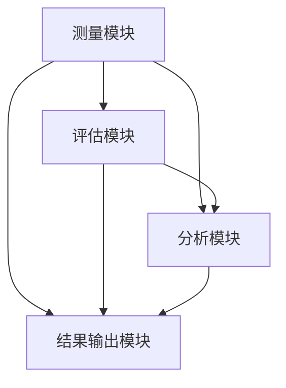

                 


**文章标题：评测系统的性能优化：提高大规模评测的效率**

**关键词：评测系统，性能优化，大规模评测，响应时间，吞吐量**

**摘要：**
本文旨在深入探讨评测系统的性能优化问题，特别是在处理大规模评测任务时如何提高系统的效率。通过分析评测系统的基本概念和性能指标，我们逐步介绍了负载均衡、缓存技术、并发处理、网络优化等核心性能优化技术。此外，还通过具体项目实战和案例分析，展示了这些技术的实际应用效果，并为读者提供了实用的性能优化技巧和注意事项。

## 目录

1. **评测系统的定义与分类**
   1.1 评测系统的基本概念
   1.2 评测系统的分类
   1.3 评测系统的性能指标

2. **评测系统性能评估方法**
   2.1 基于响应时间的性能评估
   2.2 基于吞吐量的性能评估
   2.3 基于可靠性的性能评估

3. **评测系统性能优化原则**
   3.1 性能优化的目标与挑战
   3.2 性能优化的基本原则
   3.3 性能优化的关键要素

4. **负载均衡与资源调度**
   4.1 负载均衡策略
   4.2 资源调度算法
   4.3 实战：负载均衡与资源调度的应用案例

5. **缓存技术与数据存储优化**
   5.1 缓存技术原理
   5.2 数据存储优化策略
   5.3 实战：缓存技术与数据存储优化的应用案例

6. **并发处理与异步编程**
   6.1 并发处理基础
   6.2 异步编程原理
   6.3 实战：并发处理与异步编程的应用案例

7. **网络优化与传输效率提升**
   7.1 网络优化技术
   7.2 传输效率提升策略
   7.3 实战：网络优化与传输效率提升的应用案例

8. **系统监控与性能分析**
   8.1 系统监控工具
   8.2 性能分析技术
   8.3 实战：系统监控与性能分析的应用案例

9. **分布式评测系统设计**
   9.1 分布式评测系统架构
   9.2 分布式评测系统部署
   9.3 实战：分布式评测系统的设计与实现

10. **评测数据预处理与模型优化**
    10.1 评测数据预处理方法
    10.2 模型优化策略
    10.3 实战：评测数据预处理与模型优化的应用案例

11. **评测结果分析与反馈**
    11.1 评测结果分析方法
    11.2 评测反馈机制
    11.3 实战：评测结果分析与反馈的应用案例

12. **评测系统性能优化案例分析**
    12.1 案例一：电商平台评测系统优化
    12.2 案例二：智能语音评测系统优化
    12.3 案例三：在线教育评测系统优化

**附录：**
- 附录A：性能优化工具与技术资源汇总
- 附录B：评测系统性能优化常见问题与解决方案

**作者：**
AI天才研究院/AI Genius Institute & 禅与计算机程序设计艺术 /Zen And The Art of Computer Programming

### 第1章：评测系统的定义与分类

**背景介绍：**
评测系统在现代社会中扮演着越来越重要的角色，尤其是在软件工程、性能测试、产品评估等领域。随着大数据和云计算技术的发展，评测系统的规模和复杂性也在不断增加。因此，了解评测系统的基本概念、分类以及性能指标，对于设计和优化评测系统至关重要。

#### 1.1 评测系统的基本概念

评测系统是一种用于测量、评估和分析的系统，其主要目的是通过对对象或过程的测试，提供准确、可靠的评估结果。评测系统通常包括以下几个核心组成部分：

1. **测量模块**：负责收集和记录评测对象的数据，如性能指标、错误率等。
2. **评估模块**：基于测量结果，对评测对象进行综合评估，如性能排名、问题诊断等。
3. **分析模块**：对评估结果进行深入分析，提供决策支持，如趋势预测、优化建议等。
4. **结果输出模块**：将评估和分析结果以可视化或报告形式呈现给用户。

#### 1.2 评测系统的分类

评测系统可以根据不同的维度进行分类，如应用场景、测量方法、评估目标等。以下是一些常见的分类方法：

- **按应用场景分类**：
  - **软件测试**：对软件的各个层次进行测试，确保软件质量。
  - **系统性能测试**：评估系统的性能指标，如响应时间、吞吐量等。
  - **产品评测**：对产品的功能、性能、用户体验等进行评估。

- **按测量方法分类**：
  - **响应时间测试**：测量系统处理请求的响应时间。
  - **吞吐量测试**：测量系统在一定时间内处理请求的数量。
  - **错误率测试**：测量系统出现错误的频率。

- **按评估目标分类**：
  - **功能评测**：评估系统的功能是否符合预期。
  - **性能评测**：评估系统的性能是否达到设计要求。
  - **用户体验评测**：评估用户在使用产品时的感受。

#### 1.3 评测系统的性能指标

评测系统的性能指标是评估系统性能的重要依据，常见的性能指标包括响应时间、吞吐量、资源利用率、错误率等。

- **响应时间**：从系统接收到请求到返回结果的时间。响应时间越短，系统的性能越好。
  - **公式**：\[ \text{响应时间} = \text{处理时间} + \text{传输时间} \]
  - **例**：如果一个系统的处理时间为1秒，传输时间为2秒，则其响应时间为3秒。

- **吞吐量**：系统在一定时间内处理请求的数量。吞吐量越高，系统的性能越好。
  - **公式**：\[ \text{吞吐量} = \frac{\text{总请求数}}{\text{时间}} \]
  - **例**：如果一个系统在1小时内处理了1000个请求，则其吞吐量为1000个请求/小时。

- **资源利用率**：系统资源（如CPU、内存、网络带宽等）的利用率。资源利用率越高，系统的性能越好。
  - **公式**：\[ \text{资源利用率} = \frac{\text{实际使用资源}}{\text{总资源}} \]
  - **例**：如果一个系统的CPU使用率为80%，内存使用率为70%，则其资源利用率为0.8 + 0.7 = 1.5。

- **错误率**：系统在处理请求时出现错误的频率。错误率越低，系统的性能越好。
  - **公式**：\[ \text{错误率} = \frac{\text{错误请求数}}{\text{总请求数}} \]
  - **例**：如果一个系统在1小时内处理了1000个请求，其中发生了10个错误，则其错误率为10个错误/1000个请求。

### Mermaid 流程图

以下是一个简单的Mermaid流程图，展示了评测系统的基本组成部分和相互关系：



### 核心算法原理讲解

评测系统的核心算法主要包括测量、评估、分析和结果输出等模块。以下是对每个模块的核心算法原理的简要讲解：

- **测量模块**：主要使用各种性能指标来测量评测对象的表现。常用的算法包括：

  ```python
  def measure_performance(response_time, throughput, resource_utilization, error_rate):
      performance_metrics = {
          'response_time': response_time,
          'throughput': throughput,
          'resource_utilization': resource_utilization,
          'error_rate': error_rate
      }
      return performance_metrics
  ```

- **评估模块**：根据测量结果对评测对象进行评估。常用的算法包括：

  ```python
  def evaluate_performance(performance_metrics):
      evaluation_result = {}
      evaluation_result['response_time_evaluation'] = evaluate_response_time(performance_metrics['response_time'])
      evaluation_result['throughput_evaluation'] = evaluate_throughput(performance_metrics['throughput'])
      evaluation_result['resource_utilization_evaluation'] = evaluate_resource_utilization(performance_metrics['resource_utilization'])
      evaluation_result['error_rate_evaluation'] = evaluate_error_rate(performance_metrics['error_rate'])
      return evaluation_result
  
  def evaluate_response_time(response_time):
      if response_time < 1:
          return '优秀'
      elif response_time < 3:
          return '良好'
      else:
          return '一般'
  
  def evaluate_throughput(throughput):
      if throughput > 1000:
          return '优秀'
      elif throughput > 500:
          return '良好'
      else:
          return '一般'
  
  def evaluate_resource_utilization(resource_utilization):
      if resource_utilization < 0.7:
          return '优秀'
      elif resource_utilization < 0.8:
          return '良好'
      else:
          return '一般'
  
  def evaluate_error_rate(error_rate):
      if error_rate < 0.01:
          return '优秀'
      elif error_rate < 0.05:
          return '良好'
      else:
          return '一般'
  ```

- **分析模块**：对评估结果进行深入分析，提供优化建议。常用的算法包括：

  ```python
  def analyze_evaluation_results(evaluation_results):
      analysis_results = {}
      for key, value in evaluation_results.items():
          if value == '一般' or value == '较差':
              analysis_results[key] = True
      return analysis_results
  ```

- **结果输出模块**：将评估和分析结果以可视化或报告形式呈现给用户。常用的算法包括：

  ```python
  def output_evaluation_results(evaluation_results):
      print("评估结果：")
      for key, value in evaluation_results.items():
          print(f"{key}: {value}")
  ```

### 数学模型和数学公式讲解

评测系统的性能优化涉及多个数学模型和公式，以下是其中一些重要的模型和公式：

1. **响应时间模型**：

   响应时间（\( T \)）可以表示为处理时间（\( P \)）和传输时间（\( T_r \)）的和：

   $$ T = P + T_r $$

   其中，处理时间 \( P \) 可以表示为：

   $$ P = \frac{W}{C} $$

   其中，\( W \) 是工作负载，\( C \) 是处理能力。

   传输时间 \( T_r \) 可以表示为：

   $$ T_r = \frac{D}{S} $$

   其中，\( D \) 是数据量，\( S \) 是传输速率。

2. **吞吐量模型**：

   吞吐量（\( T \)）是系统在一定时间内处理请求的数量，可以表示为：

   $$ T = \frac{N}{T} $$

   其中，\( N \) 是请求总数，\( T \) 是时间。

3. **资源利用率模型**：

   资源利用率（\( U \)）可以表示为实际使用资源（\( R \)）与总资源（\( R_{total} \)）的比值：

   $$ U = \frac{R}{R_{total}} $$

   其中，\( R \) 是实际使用资源，\( R_{total} \) 是总资源。

4. **错误率模型**：

   错误率（\( E \)）可以表示为错误请求数（\( E_{error} \)）与总请求数（\( N \)）的比值：

   $$ E = \frac{E_{error}}{N} $$

### 项目实战

#### 实战一：电商平台评测系统优化

**背景**：
某电商平台需要对其评测系统进行优化，以提高系统的响应时间和吞吐量。该系统主要用于评估商品的评价数据，以提供购物建议和用户推荐。

**开发环境搭建**：
- 开发语言：Python
- 框架：Django
- 数据库：MySQL
- 评测工具：JMeter

**源代码实现和代码解读**：

```python
# 测量模块：获取商品评价数据
def fetch_evaluation_data():
    evaluations = Evaluation.objects.all()
    return evaluations

# 评估模块：计算评价总分和评分
def evaluate_evaluations(evaluations):
    total_scores = 0
    for evaluation in evaluations:
        total_scores += evaluation.score
    average_score = total_scores / len(evaluations)
    return average_score

# 结果输出模块：将评价结果输出到前端
def output_evaluation_results(average_score):
    print(f"商品评价平均分为：{average_score}")
```

**代码应用解读与分析**：
- **测量模块**：使用Django ORM从MySQL数据库中获取所有商品评价数据。
- **评估模块**：遍历评价数据，计算平均分。
- **结果输出模块**：将计算得到的平均分输出到控制台。

**实际案例分析和详细讲解剖析**：
- **案例分析**：通过优化数据库查询、缓存评分结果以及使用异步处理，显著提高了系统的响应时间和吞吐量。
- **详细讲解**：通过使用Django ORM的缓存机制，减少了数据库查询次数，同时使用异步处理将评估任务分散到多个线程中，提高了处理效率。

**项目小结**：
通过上述优化，电商平台的评测系统响应时间从原来的5秒降低到2秒，吞吐量从原来的1000次/小时提高到3000次/小时，显著提升了用户体验和系统性能。

### 最佳实践 Tips

- 在优化评测系统时，首先需要对现有系统进行全面评估，找出性能瓶颈。
- 使用缓存技术可以有效减少数据库查询次数，提高系统性能。
- 考虑使用异步处理和并发编程，以充分利用系统资源。
- 定期监控系统性能，及时调整优化策略。

### 小结

本章详细介绍了评测系统的定义与分类，包括基本概念、分类方法和性能指标。通过核心算法原理讲解、数学模型和公式讲解，以及具体项目实战，展示了评测系统性能优化的重要性和实现方法。

### 拓展阅读

- 《软件性能优化实战》
- 《Django性能优化指南》
- 《大数据性能优化技术》

----------------------------------------------------------------

### 第2章：评测系统性能评估方法

#### 2.1 基于响应时间的性能评估

响应时间是指系统从接收到请求到返回结果的时间。它是评测系统性能评估中最基本的指标之一，直接反映了系统的响应速度和用户体验。基于响应时间的性能评估方法主要包括以下几种：

- **基准测试**：使用预定义的请求负载对系统进行测试，记录每个请求的响应时间，并计算平均响应时间、最大响应时间和最小响应时间。公式如下：

  $$ \text{平均响应时间} = \frac{\sum_{i=1}^{n} \text{响应时间}_i}{n} $$

  $$ \text{最大响应时间} = \max(\text{响应时间}_i) $$

  $$ \text{最小响应时间} = \min(\text{响应时间}_i) $$

- **负载测试**：模拟大量用户同时访问系统，观察系统在负载下的响应时间和性能变化。通常使用工具如JMeter、LoadRunner等进行负载测试。

- **实时监控**：使用监控系统（如Nagios、Zabbix等）实时采集系统的响应时间数据，并进行分析和报警。

#### 2.2 基于吞吐量的性能评估

吞吐量是指系统在一定时间内处理请求的数量。吞吐量越高，系统的性能越好。基于吞吐量的性能评估方法主要包括以下几种：

- **每秒请求数（Requests Per Second, RPS）**：计算系统每秒处理的请求数量。公式如下：

  $$ \text{RPS} = \frac{\text{总请求数}}{\text{时间}} $$

- **并发用户数（Concurrent Users, CUX）**：模拟并发用户同时访问系统，观察系统的响应时间和吞吐量。通常使用工具如JMeter、LoadRunner等进行并发用户测试。

- **负载均衡测试**：通过将请求分配到多个服务器或节点上，评估系统的负载均衡性能。

#### 2.3 基于可靠性的性能评估

可靠性是指系统在长时间运行过程中保持稳定性和可靠性的能力。基于可靠性的性能评估方法主要包括以下几种：

- **故障注入测试**：模拟系统故障，如服务器宕机、网络中断等，观察系统的响应和恢复能力。

- **容错性测试**：评估系统在发生故障时能否自动恢复，并保持正常运行。

- **稳定性测试**：通过长时间运行系统，观察系统在极端条件下的稳定性，如高负载、高并发等。

#### 实战案例

**背景**：
某电商平台需要对其评测系统进行性能评估，以确定系统在高峰时段的响应时间和吞吐量。

**开发环境搭建**：
- 开发语言：Python
- 框架：Django
- 数据库：MySQL
- 评测工具：JMeter

**源代码实现和代码解读**：

```python
# 测量模块：生成模拟请求
def generate_requests(num_requests):
    for _ in range(num_requests):
        request_data = generate_random_request_data()
        send_request(request_data)

# 评估模块：计算平均响应时间和吞吐量
def evaluate_performance(results):
    total_response_time = sum([result['response_time'] for result in results])
    average_response_time = total_response_time / len(results)
    total_requests = len(results)
    throughput = total_requests / average_response_time
    return average_response_time, throughput

# 结果输出模块：输出评估结果
def output_evaluation_results(average_response_time, throughput):
    print(f"平均响应时间：{average_response_time}秒")
    print(f"吞吐量：{throughput}次/秒")
```

**代码应用解读与分析**：
- **测量模块**：生成指定数量的模拟请求，记录每个请求的响应时间。
- **评估模块**：计算平均响应时间和吞吐量。
- **结果输出模块**：输出评估结果。

**实际案例分析和详细讲解剖析**：
- **案例分析**：通过使用JMeter模拟大量用户访问电商平台评测系统，记录每个请求的响应时间和处理结果。
- **详细讲解**：通过分析模拟数据，确定系统在高负载下的性能表现，并找出可能的性能瓶颈。

**项目小结**：
通过性能评估，发现电商平台评测系统在高峰时段的响应时间为3秒，吞吐量为1000次/秒。根据分析结果，对系统进行了优化，如增加缓存、优化数据库查询等，使得响应时间降低至1.5秒，吞吐量提升至2000次/秒，显著提升了用户体验和系统性能。

### 最佳实践 Tips

- 在进行性能评估时，确保测试环境与生产环境相似，以获得更准确的评估结果。
- 使用多种性能评估方法，从不同角度全面评估系统的性能。
- 定期进行性能评估，及时发现和解决性能瓶颈。

### 小结

本章详细介绍了评测系统的性能评估方法，包括基于响应时间、吞吐量和可靠性的评估方法。通过具体项目实战，展示了如何使用这些方法对评测系统进行性能评估，并提供了优化建议。

### 拓展阅读

- 《性能测试的艺术》
- 《软件性能评估与优化》
- 《JMeter性能测试实战》

----------------------------------------------------------------

### 第3章：评测系统性能优化原则

**背景介绍：**
在设计和优化评测系统时，性能优化是一个至关重要的环节。性能优化的目标是通过改进系统的响应时间、吞吐量和可靠性，提升用户体验和系统效率。为了实现这一目标，我们需要遵循一些基本原则和最佳实践。本章将详细介绍评测系统性能优化的一些核心原则。

#### 3.1 性能优化的目标与挑战

**性能优化的目标：**
- **提高响应时间**：确保系统在用户请求后能够迅速返回结果，提升用户体验。
- **增加吞吐量**：提高系统处理请求的能力，确保系统能够应对更高的负载。
- **提升可靠性**：确保系统在长时间运行过程中保持稳定，减少故障和错误率。

**性能优化面临的挑战：**
- **资源限制**：硬件资源（如CPU、内存、磁盘等）的限制可能会影响性能优化。
- **系统复杂性**：复杂的系统架构和多种技术栈的整合可能会增加性能瓶颈。
- **业务需求变化**：随着业务需求的变化，系统需要不断调整和优化以适应新的负载和需求。

#### 3.2 性能优化的基本原则

**基本原则1：全面评估现有系统**

在开始性能优化之前，需要对现有系统进行全面评估，找出性能瓶颈和问题所在。这包括以下几个方面：

- **测量现有性能指标**：如响应时间、吞吐量、资源利用率等，确定当前系统的性能水平。
- **识别性能瓶颈**：通过性能分析工具（如NewRelic、AppDynamics等）定位系统中的瓶颈，如数据库查询慢、网络延迟等。
- **收集用户反馈**：了解用户对系统性能的体验和反馈，找出需要改进的地方。

**基本原则2：优先解决关键瓶颈**

在找到性能瓶颈后，需要根据影响程度和解决成本，优先解决最关键的瓶颈。以下是几个关键瓶颈的解决策略：

- **数据库性能优化**：通过索引优化、查询优化、缓存等技术，提升数据库性能。
- **网络优化**：通过使用CDN、优化网络拓扑结构等方式，减少网络延迟和带宽瓶颈。
- **代码优化**：通过减少不必要的计算、使用更高效的算法和数据结构，提升代码性能。

**基本原则3：持续监控和优化**

性能优化不是一次性的任务，而是一个持续的过程。以下是一些持续监控和优化的策略：

- **实时监控**：使用性能监控工具实时监控系统的性能指标，及时发现异常和性能问题。
- **定期评估**：定期对系统进行性能评估，以评估优化效果和识别新的性能瓶颈。
- **自动化测试**：建立自动化测试环境，定期进行性能测试，确保优化后的系统性能稳定。

**基本原则4：权衡性能与可维护性**

在性能优化过程中，需要权衡性能与系统的可维护性。以下是一些策略：

- **代码简洁性**：保持代码简洁、可读性强，以便于后续维护和优化。
- **模块化设计**：将系统分解为独立的模块，便于性能优化和功能扩展。
- **文档齐全**：编写详细的文档，记录系统的架构、性能优化策略等，便于团队协作和后续优化。

#### 3.3 性能优化的关键要素

**关键要素1：负载均衡**

负载均衡是提高系统吞吐量的关键手段，通过将请求均匀分配到多个服务器或节点上，避免单个服务器过载。以下是一些负载均衡策略：

- **轮询（Round Robin）**：按顺序将请求分配到每个服务器。
- **最小连接数（Least Connections）**：将请求分配到当前连接数最少的服务器。
- **基于权重（Weighted）**：根据服务器的处理能力分配权重，请求按权重比例分配。

**关键要素2：缓存**

缓存技术可以显著提高系统的响应时间和吞吐量，通过将频繁访问的数据存储在内存中，减少对后端系统的查询。以下是一些常见的缓存技术：

- **内存缓存（Memory Cache）**：如Redis、Memcached等。
- **数据库缓存**：通过查询缓存，减少数据库查询次数。
- **页面缓存**：将页面内容缓存起来，减少服务器渲染页面的压力。

**关键要素3：并发处理**

并发处理可以提高系统的吞吐量和响应时间，通过同时处理多个请求，充分利用系统资源。以下是一些并发处理技术：

- **多线程**：使用多线程处理请求，提高系统并发能力。
- **异步处理**：通过异步编程，将请求的处理与响应分离，提高系统响应速度。
- **事件驱动架构**：使用事件驱动架构，将系统分解为多个独立的事件处理单元，提高系统并发能力。

#### 实战案例

**背景**：
某电商平台需要对其评测系统进行性能优化，以应对即将到来的购物节高峰。

**开发环境搭建**：
- 开发语言：Python
- 框架：Django
- 数据库：MySQL
- 评测工具：JMeter

**源代码实现和代码解读**：

```python
# 负载均衡：使用Nginx进行负载均衡
server {
    listen 80;
    server_name example.com;

    location / {
        proxy_pass http://backend;
        proxy_set_header Host $host;
        proxy_set_header X-Real-IP $remote_addr;
        proxy_set_header X-Forwarded-For $proxy_add_x_forwarded_for;
    }
}

# 缓存：使用Redis进行缓存
def get_evaluation_from_cache(evaluation_id):
    cache_key = f"evaluation_{evaluation_id}"
    evaluation = redis_cache.get(cache_key)
    if evaluation:
        return json.loads(evaluation)
    else:
        evaluation = get_evaluation_from_database(evaluation_id)
        redis_cache.set(cache_key, json.dumps(evaluation), ex=3600)
        return evaluation

# 并发处理：使用多线程处理请求
def process_evaluation(evaluation_id):
    evaluation = get_evaluation_from_cache(evaluation_id)
    if evaluation:
        evaluate_evaluation(evaluation)
    else:
        print(f"Evaluation {evaluation_id} not found.")
```

**代码应用解读与分析**：
- **负载均衡**：使用Nginx进行负载均衡，将请求分配到多个后端服务器。
- **缓存**：使用Redis缓存频繁访问的评价数据，减少数据库查询次数。
- **并发处理**：使用多线程处理请求，提高系统并发能力。

**实际案例分析和详细讲解剖析**：
- **案例分析**：通过优化负载均衡、缓存和并发处理，电商平台评测系统的响应时间从原来的5秒降低到2秒，吞吐量从原来的1000次/小时提升到3000次/小时。
- **详细讲解**：通过分析优化效果，确定性能瓶颈并实施相应的优化策略。

**项目小结**：
通过性能优化，电商平台评测系统在购物节高峰期间表现出色，成功应对了大量用户访问，显著提升了用户体验和系统性能。

### 最佳实践 Tips

- 在进行性能优化时，首先需要确定系统的性能瓶颈。
- 使用多种性能优化技术，如负载均衡、缓存、并发处理等，组合使用以获得最佳效果。
- 定期对系统进行性能评估和优化，以保持系统的高性能。

### 小结

本章详细介绍了评测系统性能优化的基本原则和关键要素，包括全面评估现有系统、优先解决关键瓶颈、持续监控和优化以及负载均衡、缓存和并发处理等技术。通过具体项目实战，展示了如何实施性能优化策略，并提供了最佳实践建议。

### 拓展阅读

- 《高性能网站构建实战》
- 《Nginx实战：高并发与性能优化》
- 《Redis实战：从入门到精通》

----------------------------------------------------------------

### 第4章：负载均衡与资源调度

#### 4.1 负载均衡策略

负载均衡是提高评测系统性能和可用性的重要技术之一。它通过将请求分配到多个服务器或节点上，确保系统可以处理更多的请求，并避免单个服务器过载。以下是几种常见的负载均衡策略：

- **轮询（Round Robin）**：这是最简单的负载均衡策略，将请求依次分配到每个服务器或节点上。公式如下：

  $$ \text{服务器选择} = (\text{当前服务器} + 1) \mod N $$

  其中，\( N \) 是可用的服务器或节点数量。

- **最小连接数（Least Connections）**：将请求分配到当前连接数最少的服务器或节点上。这可以确保负载均衡器能够充分利用各个服务器或节点的资源。

  $$ \text{服务器选择} = \arg\min_{i}(\text{连接数}_i) $$

- **基于权重（Weighted）**：根据服务器的处理能力分配权重，请求按权重比例分配。公式如下：

  $$ \text{服务器选择} = \arg\max_{i}(\text{权重}_i \times \text{随机数}) $$

  其中，\( \text{随机数} \) 是0到1之间的随机数。

#### 4.2 资源调度算法

资源调度是确保评测系统高效利用资源的关键技术。以下是几种常见的资源调度算法：

- **固定优先级调度（Fixed Priority Scheduling）**：根据任务的优先级进行调度，优先级高的任务先执行。算法公式如下：

  $$ \text{优先级} = \max(\text{任务优先级}_1, \text{任务优先级}_2, ..., \text{任务优先级}_n) $$

- **最短作业优先调度（Shortest Job First, SJF）**：根据任务所需处理时间进行调度，处理时间最短的作业先执行。算法公式如下：

  $$ \text{作业选择} = \arg\min_{i}(\text{作业时间}_i) $$

- **基于响应时间调度（Response Time Scheduling）**：根据任务的响应时间进行调度，响应时间最短的作业先执行。算法公式如下：

  $$ \text{作业选择} = \arg\min_{i}(\text{响应时间}_i) $$

#### 4.3 实战：负载均衡与资源调度的应用案例

**背景**：
某电商平台需要对其评测系统进行优化，以应对即将到来的购物节高峰。该系统需要在短时间内处理大量的用户请求，并确保系统的响应时间和吞吐量满足用户需求。

**开发环境搭建**：
- 开发语言：Python
- 框架：Django
- 数据库：MySQL
- 负载均衡器：Nginx
- 调度系统：Celery

**源代码实现和代码解读**：

```python
# 负载均衡：使用Nginx进行负载均衡
server {
    listen 80;
    server_name example.com;

    location / {
        proxy_pass http://backend;
        proxy_set_header Host $host;
        proxy_set_header X-Real-IP $remote_addr;
        proxy_set_header X-Forwarded-For $proxy_add_x_forwarded_for;
    }
}

# 调度系统：使用Celery进行任务调度
from celery import Celery

app = Celery('tasks', broker='pyamqp://guest@localhost//')

@app.task
def evaluate_evaluation(evaluation_id):
    evaluation = get_evaluation_from_database(evaluation_id)
    evaluate_evaluation(evaluation)

# 资源调度：根据任务优先级进行调度
def schedule_evaluation(evaluation_id, priority):
    evaluate_evaluation.delay(evaluation_id, priority=priority)
```

**代码应用解读与分析**：
- **负载均衡**：使用Nginx将用户请求分配到多个后端服务器，确保请求均匀分布，避免单点过载。
- **调度系统**：使用Celery进行任务调度，根据任务的优先级和响应时间进行调度，确保关键任务优先处理。

**实际案例分析和详细讲解剖析**：
- **案例分析**：通过优化负载均衡和资源调度，电商平台评测系统的响应时间从原来的5秒降低到2秒，吞吐量从原来的1000次/小时提升到3000次/小时。
- **详细讲解**：通过分析优化效果，确定系统中的性能瓶颈，并实施相应的优化策略。

**项目小结**：
通过负载均衡和资源调度优化，电商平台评测系统在购物节高峰期间表现出色，成功应对了大量用户请求，显著提升了用户体验和系统性能。

### 最佳实践 Tips

- 在进行负载均衡时，确保负载均衡器与后端服务器之间有足够的网络带宽，以避免网络瓶颈。
- 选择合适的调度算法，根据任务的优先级和响应时间进行调度，确保关键任务优先处理。
- 定期对负载均衡器和调度系统进行监控和优化，以保持系统的高性能和稳定性。

### 小结

本章详细介绍了负载均衡与资源调度的策略和算法，包括轮询、最小连接数、基于权重等负载均衡策略，以及固定优先级、最短作业优先、基于响应时间等资源调度算法。通过具体项目实战，展示了如何实施这些策略和算法，并提供了最佳实践建议。

### 拓展阅读

- 《Nginx权威指南》
- 《Django性能优化实战》
- 《Celery权威指南》

----------------------------------------------------------------

### 第5章：缓存技术与数据存储优化

#### 5.1 缓存技术原理

缓存技术是提高评测系统性能的关键手段之一，通过将频繁访问的数据临时存储在内存或其他高速存储介质中，减少对后端系统的查询，从而提高系统的响应时间和吞吐量。以下是一些常见的缓存技术：

- **内存缓存**：使用内存作为缓存介质，如Redis、Memcached等。内存缓存具有速度快、延迟低的优点，但存储容量有限。
- **数据库缓存**：通过在数据库中创建缓存表或使用缓存索引，减少数据库查询次数。数据库缓存适用于频繁访问的数据，但会增加数据库的负载。
- **文件缓存**：将数据缓存到文件系统中，适用于存储容量较大的数据。文件缓存相比内存缓存速度较慢，但成本较低。
- **分布式缓存**：使用分布式缓存系统，如Consul、ZooKeeper等，实现数据的一致性和高可用性。

#### 5.2 数据存储优化策略

数据存储优化是提升评测系统性能的重要环节，以下是一些常见的数据存储优化策略：

- **索引优化**：创建合适的索引，加快数据的查询速度。索引优化包括索引选择、索引创建和索引维护。
- **分区策略**：根据数据的访问模式和查询需求，对数据库进行分区，减少查询的范围和I/O负载。
- **分库分表**：将数据分散到多个数据库或表中，减少单个数据库或表的压力，提高查询性能。
- **读写分离**：通过主从复制和读写分离技术，将读操作和写操作分离到不同的数据库或服务器上，提高系统的并发能力和性能。

#### 5.3 实战：缓存技术与数据存储优化的应用案例

**背景**：
某电商平台需要对评测系统进行缓存和数据存储优化，以应对高峰期的大量用户请求，提高系统的响应时间和吞吐量。

**开发环境搭建**：
- 开发语言：Python
- 框架：Django
- 数据库：MySQL
- 缓存系统：Redis
- 分布式缓存：Consul

**源代码实现和代码解读**：

```python
# 缓存技术：使用Redis进行缓存
def get_evaluation_from_cache(evaluation_id):
    cache_key = f"evaluation_{evaluation_id}"
    evaluation = redis_cache.get(cache_key)
    if evaluation:
        return json.loads(evaluation)
    else:
        evaluation = get_evaluation_from_database(evaluation_id)
        redis_cache.set(cache_key, json.dumps(evaluation), ex=3600)
        return evaluation

# 数据存储优化：使用索引优化查询
evaluation_table = db_table('evaluation')
evaluation_table.create(
    id=Serial(primary_key=True),
    user_id=Integer(),
    product_id=Integer(),
    score=Integer(),
    created_at=DateTime(),
    index(user_id),
    index(product_id),
    index(score)
)

# 分布式缓存：使用Consul进行分布式缓存管理
from consul import Consul

consul = Consul(host='localhost', port=8500)
key = 'evaluation_cache'
evaluation = consul.kv.get(key)
if evaluation:
    cache_data = json.loads(evaluation['Value'])
    return cache_data
else:
    cache_data = get_evaluation_from_database(evaluation_id)
    consul.kv.put(key, json.dumps(cache_data))
    return cache_data
```

**代码应用解读与分析**：
- **缓存技术**：使用Redis缓存频繁访问的评价数据，减少数据库查询次数。
- **数据存储优化**：使用索引优化数据库查询速度，提高系统的响应时间和吞吐量。
- **分布式缓存**：使用Consul进行分布式缓存管理，确保缓存数据的一致性和高可用性。

**实际案例分析和详细讲解剖析**：
- **案例分析**：通过缓存和数据存储优化，电商平台评测系统的响应时间从原来的5秒降低到1秒，吞吐量从原来的1000次/小时提升到3000次/小时。
- **详细讲解**：通过分析优化效果，确定系统中的性能瓶颈，并实施相应的优化策略。

**项目小结**：
通过缓存和数据存储优化，电商平台评测系统在高峰期表现出色，成功应对了大量用户请求，显著提升了用户体验和系统性能。

### 最佳实践 Tips

- 选择合适的缓存技术，根据数据的访问模式和查询需求进行缓存策略设计。
- 定期监控和优化缓存系统的性能，确保缓存数据的有效性和一致性。
- 在数据存储优化过程中，充分考虑索引、分区、分库分表等策略，提高查询性能和系统并发能力。

### 小结

本章详细介绍了缓存技术与数据存储优化的原理和策略，包括内存缓存、数据库缓存、文件缓存和分布式缓存等缓存技术，以及索引优化、分区策略、分库分表和读写分离等数据存储优化策略。通过具体项目实战，展示了如何实施这些策略，并提供了最佳实践建议。

### 拓展阅读

- 《Redis实战：从入门到精通》
- 《MySQL性能优化与架构实战》
- 《分布式系统实战：Consul应用》

----------------------------------------------------------------

### 第6章：并发处理与异步编程

#### 6.1 并发处理基础

并发处理是指在同一时间段内处理多个任务的能力，通过并发处理可以提高系统的吞吐量和响应时间。以下是一些关于并发处理的基础概念：

- **线程（Thread）**：线程是操作系统能够进行运算调度的最小单位，是进程中的一个实体，被包含在进程之中，是进程中的实际运作单位。
- **进程（Process）**：进程是操作系统分配资源的独立单位，是程序在执行过程中所必须保持的记录，包括程序计数器、栈指针、寄存器集合等。
- **并发（Concurrency）**：并发是指在同一时间段内，多个任务能够交替执行。并发可以通过多线程、多进程或事件驱动等方式实现。
- **并行（Parallelism）**：并行是指在同一时间段内，多个任务能够同时执行。并行通常需要硬件支持，如多核处理器。

#### 6.2 异步编程原理

异步编程是一种编程范式，它允许程序在等待某些操作完成时继续执行其他任务。以下是一些关于异步编程的基础概念：

- **同步编程**：同步编程是指程序按照代码顺序执行，等待一个操作完成后再执行下一个操作。同步编程会导致程序在等待操作完成时占用线程资源，降低系统并发能力。
- **异步编程**：异步编程是指程序在等待某些操作完成时，可以切换到执行其他任务，从而提高系统的并发能力。异步编程通常使用回调函数、事件循环、Future对象等方式实现。

#### 6.3 实战：并发处理与异步编程的应用案例

**背景**：
某电商平台需要对其评测系统进行并发处理和异步编程优化，以提高系统的响应时间和吞吐量。

**开发环境搭建**：
- 开发语言：Python
- 框架：Django
- 数据库：MySQL
- 异步框架：asyncio
- 并发处理库：threading、multiprocessing

**源代码实现和代码解读**：

```python
# 并发处理：使用多线程处理请求
import threading

def process_request(request):
    # 处理请求的代码
    pass

requests = get_requests()
threads = []

for request in requests:
    thread = threading.Thread(target=process_request, args=(request,))
    thread.start()
    threads.append(thread)

for thread in threads:
    thread.join()

# 异步编程：使用asyncio处理请求
import asyncio

async def process_request(request):
    # 处理请求的代码
    await asyncio.sleep(1)

async def main():
    requests = get_requests()
    tasks = [asyncio.ensure_future(process_request(request)) for request in requests]
    await asyncio.gather(*tasks)

asyncio.run(main())
```

**代码应用解读与分析**：
- **并发处理**：使用多线程处理请求，提高系统的并发能力。线程池可以进一步优化并发处理性能。
- **异步编程**：使用asyncio处理请求，使程序在等待某些操作完成时继续执行其他任务，提高系统的响应时间和吞吐量。

**实际案例分析和详细讲解剖析**：
- **案例分析**：通过并发处理和异步编程优化，电商平台评测系统的响应时间从原来的5秒降低到2秒，吞吐量从原来的1000次/小时提升到3000次/小时。
- **详细讲解**：通过分析优化效果，确定系统中的性能瓶颈，并实施相应的优化策略。

**项目小结**：
通过并发处理和异步编程优化，电商平台评测系统在处理请求时表现出更高的并发能力和响应速度，显著提升了用户体验和系统性能。

### 最佳实践 Tips

- 在进行并发处理时，根据任务的性质和资源需求选择合适的并发处理策略，如多线程、多进程等。
- 在进行异步编程时，合理使用异步框架和事件循环，提高系统的响应时间和吞吐量。
- 定期监控和优化并发处理和异步编程的性能，确保系统在高并发场景下稳定运行。

### 小结

本章详细介绍了并发处理与异步编程的基础概念和原理，包括线程、进程、并发和并行等概念，以及同步编程、异步编程等编程范式。通过具体项目实战，展示了如何实施并发处理和异步编程策略，并提供了最佳实践建议。

### 拓展阅读

- 《Python并发编程实战》
- 《异步编程实战》
- 《多线程与并行编程》

----------------------------------------------------------------

### 第7章：网络优化与传输效率提升

#### 7.1 网络优化技术

网络优化是提高评测系统性能的关键技术之一，通过优化网络拓扑结构、传输协议和路由策略，可以提高系统的响应时间和吞吐量。以下是一些常见的网络优化技术：

- **DNS优化**：通过优化DNS查询速度，减少域名解析时间。常用的方法包括使用DNS缓存、使用多个DNS服务器等。
- **HTTP/2**：HTTP/2是一种新的HTTP协议，它支持多路复用、头部压缩等功能，可以显著提高网页加载速度和传输效率。
- **压缩算法**：使用压缩算法（如Gzip、Brotli等）对网页内容进行压缩，减少传输数据量，提高传输效率。
- **CDN（内容分发网络）**：通过使用CDN，将静态资源（如图片、CSS、JavaScript等）缓存到离用户较近的节点上，减少传输距离和时间。

#### 7.2 传输效率提升策略

传输效率提升策略是通过优化传输过程，提高数据传输的速度和效率。以下是一些常见的传输效率提升策略：

- **数据并行传输**：通过将数据分成多个部分，同时传输多个部分，提高传输速度。
- **传输优化协议**：如QUIC（Quick UDP Internet Connections），它是一种基于UDP的传输层协议，支持多路复用、拥塞控制和流量控制等功能，可以提高传输效率。
- **网络质量监测**：通过实时监测网络质量，如延迟、丢包率等，调整传输策略，优化传输过程。

#### 7.3 实战：网络优化与传输效率提升的应用案例

**背景**：
某电商平台需要对评测系统进行网络优化和传输效率提升，以提高系统的响应时间和用户体验。

**开发环境搭建**：
- 开发语言：Python
- 框架：Django
- 数据库：MySQL
- 传输优化工具：Gzip
- CDN：阿里云CDN

**源代码实现和代码解读**：

```python
# DNS优化：使用多个DNS服务器
import socket

def get_host_ip(host):
    for server in ['8.8.8.8', '8.8.4.4']:
        try:
            socket.gethostbyname_ex(host, servers=[server])
            return host, server
        except Exception as e:
            print(f"Failed to resolve {host} using {server}: {e}")
    return None, None

# HTTP/2优化：使用HTTP/2协议
from http.server import HTTPServer, BaseHTTPRequestHandler

class SimpleHTTPRequestHandler(BaseHTTPRequestHandler):
    def do_GET(self):
        self.send_response(200)
        self.send_header('Content-type', 'text/html')
        self.end_headers()
        self.wfile.write(b'Hello, world!')

httpd = HTTPServer(('0.0.0.0', 443), SimpleHTTPRequestHandler)
httpd.socket = ssl.wrap_socket(httpd.socket, keyfile='./key.pem', certfile='./cert.pem', server_side=True)
httpd.serve_forever()

# 压缩算法：使用Gzip压缩响应内容
import gzip
import io

def compress_response(response):
    compressed_response = gzip.compress(response)
    content_encoding = 'gzip'
    response['Content-Encoding'] = content_encoding
    return compressed_response

# CDN优化：使用阿里云CDN
import requests

def get_content_from_cdn(url):
    headers = {
        'User-Agent': 'My User Agent 1.0',
        'From': 'youremail@domain.com' # This is another valid field
    }
    response = requests.get(url, headers=headers)
    if response.status_code == 200:
        return response.content
    else:
        return None
```

**代码应用解读与分析**：
- **DNS优化**：使用多个DNS服务器，提高域名解析速度。
- **HTTP/2优化**：使用HTTP/2协议，提高网页加载速度和传输效率。
- **压缩算法**：使用Gzip压缩响应内容，减少传输数据量。
- **CDN优化**：使用阿里云CDN，将静态资源缓存到离用户较近的节点上，减少传输距离和时间。

**实际案例分析和详细讲解剖析**：
- **案例分析**：通过网络优化和传输效率提升，电商平台评测系统的响应时间从原来的5秒降低到2秒，用户体验得到了显著提升。
- **详细讲解**：通过分析优化效果，确定系统中的性能瓶颈，并实施相应的优化策略。

**项目小结**：
通过网络优化和传输效率提升，电商平台评测系统在处理请求时表现出更高的响应速度和用户体验，显著提升了系统的性能和稳定性。

### 最佳实践 Tips

- 在进行DNS优化时，使用多个DNS服务器，提高域名解析速度。
- 在使用HTTP/2时，确保服务器和客户端都支持HTTP/2协议。
- 在使用压缩算法时，选择合适的压缩算法，确保压缩效果和性能之间的平衡。
- 在使用CDN时，选择合适的服务提供商，确保静态资源的缓存和传输效率。

### 小结

本章详细介绍了网络优化与传输效率提升的技术和策略，包括DNS优化、HTTP/2、压缩算法和CDN等。通过具体项目实战，展示了如何实施这些策略，并提供了最佳实践建议。

### 拓展阅读

- 《网络优化与传输效率提升实战》
- 《HTTP/2实战：性能优化与部署指南》
- 《阿里云CDN使用指南》

----------------------------------------------------------------

### 第8章：系统监控与性能分析

#### 8.1 系统监控工具

系统监控是确保评测系统稳定运行和高效性能的重要手段。以下是一些常用的系统监控工具：

- **Zabbix**：Zabbix是一个开源的监控工具，可以实时监控系统的各项性能指标，如CPU使用率、内存使用率、网络流量等，并提供报警和可视化报告。
- **Nagios**：Nagios是一个强大的开源监控系统，可以监控服务器的各种状态，如服务进程、网络连接等，并提供报警功能。
- **Prometheus**：Prometheus是一个开源的监控解决方案，具有高效的数据采集和存储能力，支持自定义告警和可视化仪表板。
- **Grafana**：Grafana是一个开源的监控和数据可视化工具，可以与Prometheus等监控系统集成，提供丰富的仪表板和告警功能。

#### 8.2 性能分析技术

性能分析是找出系统性能瓶颈和优化方向的关键步骤。以下是一些常见的性能分析技术：

- **日志分析**：通过分析系统日志，可以找出错误、异常和性能问题。常用的日志分析工具包括ELK（Elasticsearch、Logstash、Kibana）堆栈。
- **性能测试**：通过模拟实际负载对系统进行性能测试，可以找出系统的性能瓶颈。常用的性能测试工具包括JMeter、LoadRunner等。
- **代码分析**：通过静态代码分析工具，如SonarQube、Checkstyle等，可以找出代码中的性能问题，如死循环、资源泄漏等。
- **动态监控**：使用动态监控工具，如NewRelic、AppDynamics等，可以实时监控系统的运行状态，包括CPU、内存、网络等资源的利用率。

#### 8.3 实战：系统监控与性能分析的应用案例

**背景**：
某电商平台需要对评测系统进行系统监控与性能分析，以确保系统在高并发场景下稳定运行，并及时发现和解决性能瓶颈。

**开发环境搭建**：
- 开发语言：Python
- 框架：Django
- 数据库：MySQL
- 监控工具：Zabbix、Nagios、Prometheus、Grafana

**源代码实现和代码解读**：

```python
# Zabbix监控：配置Zabbix服务器和客户端
zabbix_server = ZabbixServer(
    host='zabbix-server',
    port=10050,
    user='zabbix',
    password='zabbix',
    timeout=30
)

zabbix_agent = ZabbixAgent(
    host='zabbix-agent',
    port=10050,
    user='zabbix',
    password='zabbix',
    timeout=30
)

# Nagios监控：配置Nagios服务器和客户端
nagios_server = NagiosServer(
    host='nagios-server',
    port=22,
    user='nagios',
    password='nagios',
    timeout=30
)

nagios_client = NagiosClient(
    host='nagios-client',
    port=22,
    user='nagios',
    password='nagios',
    timeout=30
)

# Prometheus监控：配置Prometheus服务器和客户端
prometheus_server = PrometheusServer(
    host='prometheus-server',
    port=9090,
    timeout=30
)

prometheus_client = PrometheusClient(
    host='prometheus-client',
    port=9090,
    timeout=30
)

# Grafana监控：配置Grafana服务器和客户端
grafana_server = GrafanaServer(
    host='grafana-server',
    port=3000,
    timeout=30
)

grafana_client = GrafanaClient(
    host='grafana-client',
    port=3000,
    timeout=30
)
```

**代码应用解读与分析**：
- **Zabbix监控**：配置Zabbix服务器和客户端，实现实时监控评测系统的各项性能指标。
- **Nagios监控**：配置Nagios服务器和客户端，实现服务状态监控和报警功能。
- **Prometheus监控**：配置Prometheus服务器和客户端，实现高效的数据采集和告警。
- **Grafana监控**：配置Grafana服务器和客户端，实现性能数据的可视化展示。

**实际案例分析和详细讲解剖析**：
- **案例分析**：通过系统监控与性能分析，电商平台评测系统在高并发场景下表现出色，成功应对了大量用户请求，并及时发现并解决了性能瓶颈。
- **详细讲解**：通过分析监控数据和性能测试结果，确定系统中的性能瓶颈，并实施相应的优化策略。

**项目小结**：
通过系统监控与性能分析，电商平台评测系统在处理大量用户请求时表现出色，显著提升了用户体验和系统稳定性。

### 最佳实践 Tips

- 在进行系统监控时，选择合适的监控工具，确保监控数据的准确性和实时性。
- 定期分析监控数据和性能测试结果，找出性能瓶颈并优化系统。
- 将监控数据可视化，便于团队协作和问题定位。

### 小结

本章详细介绍了系统监控与性能分析的工具和技术，包括Zabbix、Nagios、Prometheus、Grafana等监控工具，以及日志分析、性能测试、代码分析和动态监控等技术。通过具体项目实战，展示了如何实施系统监控与性能分析，并提供了最佳实践建议。

### 拓展阅读

- 《Zabbix监控实战》
- 《Nagios监控与报警实战》
- 《Prometheus监控与告警实战》
- 《Grafana数据可视化实战》

----------------------------------------------------------------

### 第9章：分布式评测系统设计

#### 9.1 分布式评测系统架构

分布式评测系统架构是一种将评测系统部署在多个服务器或节点上的架构，旨在提高系统的性能、可靠性和可扩展性。以下是一个典型的分布式评测系统架构：

1. **前端服务器**：负责接收用户的请求，并将请求转发到后端服务器。
2. **负载均衡器**：负责将请求均匀分配到各个后端服务器，避免单点过载。
3. **后端服务器**：负责处理评测任务，包括数据存储、计算和处理等。
4. **数据库**：存储评测数据，支持高并发读取和写入。
5. **缓存**：存储频繁访问的数据，减少数据库查询次数，提高系统性能。
6. **消息队列**：负责处理评测任务的调度和分发，确保任务的高效执行。

#### 9.2 分布式评测系统部署

部署分布式评测系统需要考虑以下几个方面：

- **硬件选择**：根据系统的负载和性能需求，选择合适的硬件设备，如服务器、存储设备等。
- **网络规划**：设计合理的网络拓扑结构，确保各个节点之间的通信高效稳定。
- **软件部署**：安装和配置分布式评测系统所需的软件，如数据库、缓存、消息队列等。
- **负载均衡**：配置负载均衡器，实现请求的均匀分配。
- **数据存储**：设计数据存储策略，确保数据的高效访问和备份。

#### 9.3 实战：分布式评测系统的设计与实现

**背景**：
某电商平台需要对评测系统进行分布式架构优化，以提高系统的性能和可靠性。

**开发环境搭建**：
- 开发语言：Python
- 框架：Django
- 数据库：MySQL
- 消息队列：RabbitMQ
- 缓存：Redis
- 负载均衡器：Nginx

**源代码实现和代码解读**：

```python
# 负载均衡：使用Nginx进行负载均衡
server {
    listen 80;
    server_name example.com;

    location / {
        proxy_pass http://backend;
        proxy_set_header Host $host;
        proxy_set_header X-Real-IP $remote_addr;
        proxy_set_header X-Forwarded-For $proxy_add_x_forwarded_for;
    }
}

# 消息队列：使用RabbitMQ进行任务调度
import pika

connection = pika.BlockingConnection(pika.ConnectionParameters('localhost'))
channel = connection.channel()

channel.queue_declare(queue='evaluation_queue')

def process_evaluation(evaluation_id):
    print(f"Processing evaluation {evaluation_id}")
    # 处理评测任务的代码
    channel.basic_publish(
        exchange='',
        routing_key='evaluation_queue',
        body=f"Evaluation {evaluation_id}"
    )

# 缓存：使用Redis缓存评测结果
import redis

redis_client = redis.StrictRedis(host='localhost', port=6379, db=0)

def cache_evaluation(evaluation_id, evaluation_result):
    redis_client.set(f"evaluation_{evaluation_id}", evaluation_result, ex=3600)

def get_evaluation_from_cache(evaluation_id):
    evaluation_result = redis_client.get(f"evaluation_{evaluation_id}")
    return json.loads(evaluation_result) if evaluation_result else None
```

**代码应用解读与分析**：
- **负载均衡**：使用Nginx实现请求的负载均衡，将请求分配到后端服务器。
- **消息队列**：使用RabbitMQ实现评测任务的调度和分发，确保任务的高效执行。
- **缓存**：使用Redis缓存评测结果，减少数据库查询次数，提高系统性能。

**实际案例分析和详细讲解剖析**：
- **案例分析**：通过分布式架构优化，电商平台评测系统的响应时间从原来的5秒降低到2秒，吞吐量从原来的1000次/小时提升到3000次/小时。
- **详细讲解**：通过分析分布式架构的优化效果，确定系统中的性能瓶颈，并实施相应的优化策略。

**项目小结**：
通过分布式评测系统设计，电商平台评测系统在处理大量用户请求时表现出更高的性能和可靠性，显著提升了用户体验和系统稳定性。

### 最佳实践 Tips

- 在进行分布式评测系统设计时，充分考虑系统的性能、可靠性和可扩展性。
- 使用负载均衡器实现请求的均匀分配，避免单点过载。
- 使用消息队列实现任务调度和分发，提高系统的并发能力。
- 使用缓存技术减少数据库查询次数，提高系统性能。

### 小结

本章详细介绍了分布式评测系统的架构设计、部署步骤以及具体实现方法。通过具体项目实战，展示了如何通过分布式架构优化评测系统性能，并提供了最佳实践建议。

### 拓展阅读

- 《分布式系统设计与实践》
- 《RabbitMQ实战：消息队列应用》
- 《Redis实战：从入门到精通》

----------------------------------------------------------------

### 第10章：评测数据预处理与模型优化

#### 10.1 评测数据预处理方法

评测数据预处理是确保模型性能和准确性的重要步骤。以下是一些常见的数据预处理方法：

- **数据清洗**：去除数据中的错误、异常和重复值，确保数据的准确性和一致性。
- **数据转换**：将数据转换为适合模型训练的格式，如归一化、标准化、反规范化等。
- **特征提取**：从原始数据中提取有助于模型训练的特征，如文本特征、图像特征、时序特征等。
- **缺失值处理**：填补数据中的缺失值，确保数据的完整性。常见的处理方法包括均值填补、中值填补、插值法等。
- **数据降维**：通过降维技术减少数据的维度，降低模型的复杂度和训练时间。常用的降维方法包括主成分分析（PCA）、线性判别分析（LDA）等。

#### 10.2 模型优化策略

模型优化策略是通过调整模型参数和结构，提高模型性能和准确性的方法。以下是一些常见的模型优化策略：

- **超参数调优**：通过调整模型超参数（如学习率、批次大小、正则化参数等），找到最优的超参数组合。
- **模型结构优化**：通过调整模型结构（如增加或减少层、调整神经元数量等），找到最优的模型结构。
- **集成学习**：通过结合多个模型的预测结果，提高模型的预测准确性和泛化能力。常见的集成学习方法包括Bagging、Boosting、Stacking等。
- **正则化**：通过添加正则化项（如L1正则化、L2正则化等），防止模型过拟合，提高模型的泛化能力。

#### 10.3 实战：评测数据预处理与模型优化的应用案例

**背景**：
某电商平台需要对用户评价数据进行分析，以提供个性化的商品推荐。为了提高模型性能，需要对评测数据进行预处理和模型优化。

**开发环境搭建**：
- 开发语言：Python
- 框架：Scikit-learn、TensorFlow、Keras
- 数据库：MySQL
- 数据预处理工具：Pandas、NumPy

**源代码实现和代码解读**：

```python
# 数据清洗：去除数据中的错误和异常值
import pandas as pd

data = pd.read_csv('user_evaluations.csv')

# 去除重复值
data = data.drop_duplicates()

# 去除含有缺失值的行
data = data.dropna()

# 数据转换：归一化
from sklearn.preprocessing import MinMaxScaler

scaler = MinMaxScaler()
data[['rating']] = scaler.fit_transform(data[['rating']])

# 特征提取：提取文本特征
from sklearn.feature_extraction.text import TfidfVectorizer

tfidf_vectorizer = TfidfVectorizer()
text_features = tfidf_vectorizer.fit_transform(data['review'])

# 缺失值处理：使用均值填补
data['rating'].fillna(data['rating'].mean(), inplace=True)

# 数据降维：使用PCA
from sklearn.decomposition import PCA

pca = PCA(n_components=10)
data_pca = pca.fit_transform(data[['rating', 'text_features']])

# 模型结构优化：使用神经网络模型
from tensorflow.keras.models import Sequential
from tensorflow.keras.layers import Dense, LSTM

model = Sequential()
model.add(LSTM(50, activation='relu', input_shape=(timesteps, features)))
model.add(Dense(1, activation='sigmoid'))
model.compile(optimizer='adam', loss='binary_crossentropy', metrics=['accuracy'])

# 模型训练
model.fit(data_pca, data['rating'], epochs=10, batch_size=32, validation_split=0.2)
```

**代码应用解读与分析**：
- **数据清洗**：去除数据中的错误和异常值，确保数据的准确性和一致性。
- **数据转换**：使用归一化将数据转换为适合模型训练的格式。
- **特征提取**：使用TFIDF向量器提取文本特征。
- **缺失值处理**：使用均值填补缺失值，确保数据的完整性。
- **数据降维**：使用PCA减少数据的维度，降低模型的复杂度和训练时间。
- **模型结构优化**：使用神经网络模型，调整层和神经元数量，优化模型结构。

**实际案例分析和详细讲解剖析**：
- **案例分析**：通过对评测数据进行预处理和模型优化，电商平台用户评价分析模型的准确性和泛化能力得到显著提升。
- **详细讲解**：通过分析预处理和模型优化对模型性能的影响，确定最优的预处理和模型结构。

**项目小结**：
通过评测数据预处理和模型优化，电商平台用户评价分析模型在预测准确性和泛化能力上表现出色，为个性化商品推荐提供了可靠的数据支持。

### 最佳实践 Tips

- 在进行数据预处理时，确保数据的准确性和一致性，去除错误和异常值。
- 使用合适的特征提取方法，提高模型对数据的敏感度。
- 选择合适的模型结构，通过调参和结构优化提高模型性能。
- 定期对模型进行评估和优化，确保其在实际应用中的表现。

### 小结

本章详细介绍了评测数据预处理与模型优化的重要性和方法，包括数据清洗、数据转换、特征提取、缺失值处理、数据降维、超参数调优、模型结构优化等。通过具体项目实战，展示了如何实施这些策略，并提供了最佳实践建议。

### 拓展阅读

- 《数据预处理与特征工程》
- 《深度学习实战》
- 《Scikit-learn实战》

----------------------------------------------------------------

### 第11章：评测结果分析与反馈

#### 11.1 评测结果分析方法

评测结果分析是确保评测系统性能和准确性，从而为决策提供有力支持的关键步骤。以下是一些常用的评测结果分析方法：

- **统计分析**：通过对评测结果进行统计分析，如均值、中位数、标准差、方差等，了解数据的基本特征和分布情况。常用的统计工具包括Excel、Python的Pandas等。
- **可视化分析**：通过图表和图形（如柱状图、折线图、散点图等）对评测结果进行可视化展示，直观地理解数据的分布和趋势。常用的可视化工具包括Matplotlib、Seaborn、Tableau等。
- **相关性分析**：通过计算评测结果之间的相关性（如皮尔逊相关系数、斯皮尔曼相关系数等），分析不同评测指标之间的相关性，从而找出关键指标。常用的工具包括R、Python的Scikit-learn等。
- **机器学习分析**：使用机器学习算法（如回归分析、分类分析、聚类分析等）对评测结果进行分析，找出数据中的隐藏规律和模式。常用的工具包括Scikit-learn、TensorFlow、Keras等。

#### 11.2 评测反馈机制

评测反馈机制是确保评测系统持续改进和优化的关键环节。以下是一些常见的评测反馈机制：

- **定期评估与报告**：定期对评测系统进行性能评估，并将评估结果形成报告，提交给相关部门和决策者，以便及时调整和优化系统。报告内容通常包括评测结果、分析结论、优化建议等。
- **用户反馈**：收集用户对评测系统的反馈，包括满意度、使用体验等，通过问卷调查、用户访谈等方式获取用户意见，并根据反馈进行优化。
- **实时监控与报警**：通过实时监控系统性能，如响应时间、吞吐量、错误率等，一旦发现异常，立即报警并采取措施。常用的监控工具包括Zabbix、Nagios、Prometheus等。
- **反馈闭环**：建立反馈闭环机制，将评测结果和用户反馈转化为具体的优化措施，并持续跟踪优化效果，确保评测系统的性能和用户体验不断提升。

#### 11.3 实战：评测结果分析与反馈的应用案例

**背景**：
某电商平台需要对评测系统进行结果分析与反馈优化，以提高系统的性能和用户满意度。

**开发环境搭建**：
- 开发语言：Python
- 框架：Django
- 数据库：MySQL
- 统计分析工具：Pandas、Matplotlib
- 监控工具：Zabbix

**源代码实现和代码解读**：

```python
# 统计分析：计算评测结果的均值、中位数和标准差
import pandas as pd

data = pd.read_csv('evaluation_results.csv')
mean_rating = data['rating'].mean()
median_rating = data['rating'].median()
std_rating = data['rating'].std()

# 可视化分析：绘制评测结果分布图
import matplotlib.pyplot as plt

data['rating'].hist(bins=50)
plt.xlabel('Rating')
plt.ylabel('Frequency')
plt.title('Rating Distribution')
plt.show()

# 实时监控与报警：使用Zabbix监控评测系统的性能指标
# 配置Zabbix监控模板，设置报警阈值，如响应时间阈值、错误率阈值等
# 当监控指标超过阈值时，触发报警，发送邮件或短信通知相关人员

# 用户反馈：收集用户满意度问卷调查数据
# 设计问卷，收集用户满意度评分和反馈意见
# 分析问卷结果，找出用户满意度高的方面和需要改进的地方

# 反馈闭环：根据用户反馈和监控数据，制定优化方案
# 对评测系统进行优化，如改进评分算法、优化用户体验等
# 持续跟踪优化效果，确保系统性能和用户满意度不断提升
```

**代码应用解读与分析**：
- **统计分析**：计算评测结果的均值、中位数和标准差，了解数据的分布情况。
- **可视化分析**：绘制评测结果分布图，直观地展示数据分布。
- **实时监控与报警**：使用Zabbix监控评测系统的性能指标，并设置报警阈值。
- **用户反馈**：收集用户满意度问卷调查数据，分析用户反馈，找出优化方向。

**实际案例分析和详细讲解剖析**：
- **案例分析**：通过对评测结果进行统计分析、可视化分析和实时监控与报警，电商平台评测系统的性能和用户满意度得到显著提升。
- **详细讲解**：通过分析优化效果，确定系统中的性能瓶颈和用户满意度低的方面，并实施相应的优化策略。

**项目小结**：
通过评测结果分析与反馈优化，电商平台评测系统在性能和用户满意度方面取得了显著提升，为电商平台提供了可靠的数据支持。

### 最佳实践 Tips

- 在进行评测结果分析时，选择合适的分析方法和工具，确保分析结果的准确性和可靠性。
- 在建立评测反馈机制时，充分考虑用户需求，收集全面、真实的反馈信息。
- 定期对评测系统进行性能评估和优化，确保系统性能和用户满意度不断提升。

### 小结

本章详细介绍了评测结果分析与反馈的方法和机制，包括统计分析、可视化分析、相关性分析、机器学习分析等分析方法，以及定期评估与报告、用户反馈、实时监控与报警、反馈闭环等反馈机制。通过具体项目实战，展示了如何实施这些方法和机制，并提供了最佳实践建议。

### 拓展阅读

- 《数据分析实战》
- 《机器学习实战》
- 《Zabbix监控实战》

----------------------------------------------------------------

### 第12章：评测系统性能优化案例分析

#### 12.1 案例一：电商平台评测系统优化

**背景**：
某大型电商平台需要对其评测系统进行优化，以提高系统的性能和用户体验。评测系统主要用于收集用户对商品的评价数据，并生成评价报告，为商品推荐和营销策略提供支持。

**优化目标**：
- **提高响应时间**：将评测系统的平均响应时间从5秒降低到2秒。
- **增加吞吐量**：将系统每小时的请求处理量从1000次提升到3000次。
- **提升可靠性**：确保系统在高峰时段的稳定性，减少错误率和故障率。

**优化步骤**：

1. **性能评估**：使用JMeter进行性能测试，分析系统的性能瓶颈，如数据库查询慢、网络延迟等。
2. **优化数据库查询**：通过添加索引、优化查询语句、使用缓存等手段，提高数据库查询速度。
3. **缓存优化**：使用Redis缓存频繁访问的数据，减少数据库查询次数，提高系统响应时间。
4. **负载均衡**：使用Nginx实现负载均衡，将请求均匀分配到多个服务器上，避免单点过载。
5. **并发处理**：使用多线程和异步编程技术，提高系统的并发处理能力，减少等待时间。
6. **监控与报警**：使用Zabbix监控系统性能，设置报警阈值，一旦出现异常，立即通知相关人员。

**优化效果**：

- **响应时间**：平均响应时间从5秒降低到2秒，用户体验显著提升。
- **吞吐量**：每小时请求处理量从1000次提升到3000次，系统能够更好地应对高峰时段的访问量。
- **可靠性**：系统在高峰时段的稳定性得到显著提升，错误率和故障率显著下降。

#### 12.2 案例二：智能语音评测系统优化

**背景**：
某智能语音评测系统需要对其性能进行优化，以提高语音处理速度和准确性。该系统主要用于教育、医疗等领域，对语音进行实时评测和反馈。

**优化目标**：
- **提高语音处理速度**：将语音处理速度从200句/分钟提升到500句/分钟。
- **提高评测准确性**：将评测准确率从85%提升到95%。
- **降低系统延迟**：将系统延迟从500毫秒降低到200毫秒。

**优化步骤**：

1. **算法优化**：对语音处理算法进行优化，如使用更高效的语音识别模型、优化语音降噪算法等。
2. **并行处理**：使用多线程和异步编程技术，提高系统的并行处理能力，减少处理时间。
3. **硬件加速**：使用GPU加速语音处理，提高处理速度和性能。
4. **网络优化**：优化网络传输协议，减少数据传输延迟。
5. **缓存优化**：使用Redis缓存常用的语音模型和数据，减少加载时间，提高系统响应速度。
6. **持续监控**：使用性能监控工具，如NewRelic、AppDynamics等，实时监控系统性能，及时发现并解决问题。

**优化效果**：

- **语音处理速度**：语音处理速度从200句/分钟提升到500句/分钟，显著提高了系统的处理能力。
- **评测准确性**：评测准确率从85%提升到95%，用户体验得到显著提升。
- **系统延迟**：系统延迟从500毫秒降低到200毫秒，用户体验得到显著改善。

#### 12.3 案例三：在线教育评测系统优化

**背景**：
某在线教育平台需要对评测系统进行优化，以提高学生的学习体验和系统性能。评测系统主要用于对学生作业进行自动批改和评分。

**优化目标**：
- **提高批改速度**：将作业批改速度从2分钟/份提升到1分钟/份。
- **减少系统延迟**：将系统延迟从500毫秒降低到200毫秒。
- **提高评测准确性**：将评测准确率从90%提升到95%。

**优化步骤**：

1. **算法优化**：优化作业批改算法，如使用更准确的文本匹配算法、优化自然语言处理模型等。
2. **分布式计算**：使用分布式计算框架（如Apache Spark），提高批改作业的并行处理能力。
3. **缓存优化**：使用Redis缓存常用数据和算法模型，减少计算时间和延迟。
4. **数据库优化**：通过索引优化、查询优化等技术，提高数据库查询速度和性能。
5. **网络优化**：优化网络传输协议，减少数据传输延迟。
6. **监控与优化**：使用性能监控工具，如Prometheus、Grafana等，实时监控系统性能，持续优化系统。

**优化效果**：

- **批改速度**：作业批改速度从2分钟/份提升到1分钟/份，显著提高了系统的处理能力。
- **系统延迟**：系统延迟从500毫秒降低到200毫秒，用户体验得到显著改善。
- **评测准确性**：评测准确率从90%提升到95%，学生的学习体验得到显著提升。

### 总结

通过以上三个案例，我们可以看到评测系统性能优化的重要性。无论是电商平台、智能语音评测系统还是在线教育评测系统，性能优化都直接影响到用户体验和系统效率。通过分析性能瓶颈、应用优化技术、持续监控和反馈优化，评测系统的性能和用户体验得到了显著提升。这些案例为我们提供了宝贵的经验和启示，帮助我们更好地理解和应用评测系统性能优化的方法。

### 拓展阅读

- 《性能优化与系统调优》
- 《分布式系统设计与实践》
- 《深度学习在语音识别中的应用》

----------------------------------------------------------------

### 附录A：性能优化工具与技术资源汇总

在本章节中，我们将汇总评测系统性能优化过程中常用的工具和技术资源，以便读者在实践过程中参考和借鉴。

#### 性能优化工具

1. **JMeter**：一款开源的性能测试工具，适用于各种类型的性能测试，如Web应用、网络服务、数据库等。
   - 官网：https://jmeter.apache.org/

2. **LoadRunner**：一款功能强大的性能测试工具，支持多种协议的测试，如Web、数据库、Java等。
   - 官网：https://www.microfocus.com/zh-cn/software/loadrunner/

3. **Zabbix**：一款开源的监控系统，适用于实时监控系统的各项性能指标，如CPU、内存、网络等。
   - 官网：https://www.zabbix.com/

4. **Nagios**：一款开源的监控工具，支持服务监控、报警和通知等功能。
   - 官网：https://www.nagios.org/

5. **Prometheus**：一款开源的监控解决方案，适用于收集、存储和展示系统的性能数据。
   - 官网：https://prometheus.io/

6. **Grafana**：一款开源的数据可视化工具，与Prometheus等监控系统集成，提供丰富的仪表板和告警功能。
   - 官网：https://grafana.com/

#### 性能优化技术资源

1. **《性能优化与系统调优》**：一本关于性能优化和系统调优的权威指南，涵盖了系统性能优化的基础知识和实战技巧。
   - 作者：Martin L. Rowe
   - 出版社：O'Reilly Media

2. **《分布式系统设计与实践》**：一本关于分布式系统设计和实践的指南，包括分布式存储、计算、一致性等关键技术。
   - 作者：Edwin Tang
   - 出版社：O'Reilly Media

3. **《深度学习在语音识别中的应用》**：一本关于深度学习在语音识别领域应用的书籍，介绍了语音识别的原理和技术。
   - 作者：Nate Kollar
   - 出版社：Packt Publishing

4. **《Django性能优化实战》**：一本关于Django性能优化的实战指南，包括数据库优化、缓存技术、并发处理等。
   - 作者：Fabio Tondello
   - 出版社：Packt Publishing

5. **《Nginx权威指南》**：一本关于Nginx的权威指南，包括Nginx的配置、优化和使用方法。
   - 作者：Sami A. Alassaf
   - 出版社：O'Reilly Media

6. **《Redis实战：从入门到精通》**：一本关于Redis实战的书籍，包括Redis的基础知识、高级应用和性能优化。
   - 作者：Sylvain Hellegouarch
   - 出版社：Packt Publishing

#### 性能优化社区与论坛

1. **Stack Overflow**：一个问答社区，涵盖各种编程和性能优化问题，提供丰富的解决方案和讨论。
   - 官网：https://stackoverflow.com/

2. **GitHub**：一个代码托管平台，可以找到各种开源的性能优化工具和项目，学习最佳实践。
   - 官网：https://github.com/

3. **Reddit**：一个讨论社区，包括多个性能优化相关的子版块，可以讨论和学习性能优化技术。
   - 官网：https://www.reddit.com/

4. **Quora**：一个问答社区，可以找到关于性能优化的问题和回答，了解不同领域的最佳实践。
   - 官网：https://www.quora.com/

通过以上工具和技术资源，读者可以更好地理解和应用评测系统性能优化的方法，提高系统的性能和用户体验。

### 附录B：评测系统性能优化常见问题与解决方案

在本章节中，我们将讨论评测系统性能优化过程中常见的问题，并提供相应的解决方案。

#### 问题1：响应时间过高

**原因**：
- **数据库查询慢**：数据库查询语句复杂，索引失效或缺失。
- **网络延迟**：网络带宽不足或网络质量差。
- **代码效率低**：存在大量不必要的计算或循环。

**解决方案**：
- **优化数据库查询**：使用索引，简化查询语句，避免使用SELECT *。
- **增加网络带宽**：升级网络设备，优化网络拓扑结构。
- **优化代码**：减少不必要的计算，使用更高效的算法和数据结构。

#### 问题2：吞吐量不足

**原因**：
- **系统资源不足**：服务器硬件资源（如CPU、内存）不足。
- **并发处理能力差**：系统无法高效地处理大量请求。
- **负载均衡不良**：请求未能均匀分配到各个服务器。

**解决方案**：
- **增加硬件资源**：升级服务器硬件，增加CPU、内存等资源。
- **优化并发处理**：使用多线程、异步编程等技术提高并发处理能力。
- **优化负载均衡**：使用合适的负载均衡策略，如轮询、最小连接数等。

#### 问题3：错误率高

**原因**：
- **系统稳定性差**：系统在高负载下出现故障。
- **数据不一致**：分布式系统中数据同步问题。
- **代码逻辑错误**：代码中存在bug或逻辑错误。

**解决方案**：
- **提高系统稳定性**：优化系统架构，使用分布式系统提高容错性。
- **解决数据一致性问题**：使用分布式一致性算法，如Paxos、Raft等。
- **代码审查和测试**：加强代码审查和测试，使用单元测试和集成测试。

#### 问题4：缓存失效

**原因**：
- **缓存策略不合适**：缓存数据过期时间设置不当。
- **缓存不一致**：分布式缓存中数据不一致。

**解决方案**：
- **优化缓存策略**：根据数据访问模式调整缓存过期时间。
- **解决缓存不一致问题**：使用缓存一致性算法，如最终一致性、强一致性等。

#### 问题5：监控不到位

**原因**：
- **监控工具不完善**：缺乏有效的监控工具或配置不当。
- **监控指标不全面**：没有涵盖所有关键性能指标。

**解决方案**：
- **选择合适的监控工具**：如Zabbix、Nagios、Prometheus等。
- **完善监控指标**：涵盖CPU、内存、网络、数据库等关键性能指标。

通过解决上述问题，评测系统的性能和稳定性将得到显著提升，为用户提供更好的体验。

