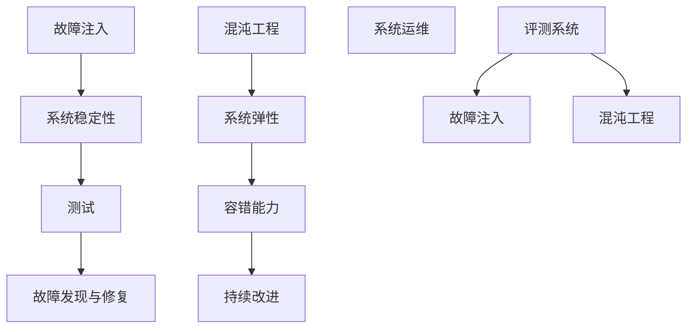

                 

# 文章标题

《评测系统的故障注入与混沌工程实践》

> 关键词：故障注入，混沌工程，评测系统，系统稳定性，可靠性测试

> 摘要：
本文将深入探讨故障注入与混沌工程在评测系统中的应用与实践。通过对故障注入与混沌工程的核心概念、原理及其在评测系统中的具体实施方法进行详细分析，结合实际案例，展示如何通过故障注入与混沌工程来提升评测系统的稳定性和可靠性，从而为系统开发与运维提供有效的手段。

----------------------------------------------------------------

## 背景介绍

在现代软件系统中，评测系统的稳定性和可靠性至关重要。随着系统规模和复杂性的不断增加，传统的方法已经难以满足对系统可靠性的要求。为了提高系统的鲁棒性，近年来，故障注入与混沌工程逐渐成为研究和应用的热点。

### 故障注入

故障注入（Fault Injection）是一种主动引入故障的方法，旨在通过在系统中引入可控的故障，来测试和评估系统的响应能力和鲁棒性。通过故障注入，开发人员可以模拟各种异常情况，例如硬件故障、软件错误、网络中断等，从而发现潜在的问题并加以改进。

### 混沌工程

混沌工程（Chaos Engineering）则是一种通过故意引入混乱和异常来测试系统弹性和容错能力的实践。它的核心思想是“如果你可以故意破坏系统，那么系统就应该能够承受真实的故障”。混沌工程通过模拟各种不可预见的故障场景，帮助开发团队了解系统在极端条件下的表现。

## 核心概念与联系

故障注入与混沌工程虽然各有侧重，但它们之间有着紧密的联系。下面是它们之间的关系架构，使用Mermaid流程图表示：



### 核心算法原理讲解

为了更好地理解故障注入与混沌工程，下面将使用伪代码来详细阐述其核心算法原理。

#### 故障注入伪代码

```python
def fault_injection(system, fault_type, probability):
    if random() < probability:
        if fault_type == "network":
            system.network_fault()
        elif fault_type == "hardware":
            system.hardware_fault()
        elif fault_type == "software":
            system.software_fault()
        log_fault(fault_type)
    else:
        system的正常运行()
```

#### 混沌工程伪代码

```python
def chaos_engineering(system, chaos_type, duration):
    if chaos_type == "network":
        system.network_chaos(duration)
    elif chaos_type == "storage":
        system.storage_chaos(duration)
    elif chaos_type == "compute":
        system.compute_chaos(duration)
    monitor_system_behavior(system)
```

### 数学模型和公式

故障注入与混沌工程中，对系统行为的监控和评估可以通过以下数学模型进行：

$$
\text{系统响应时间} = f(\text{故障类型}, \text{故障概率}, \text{系统状态})
$$

$$
\text{系统容错能力} = \frac{\text{成功处理的故障数量}}{\text{总故障数量}}
$$

### 项目实战

在接下来的章节中，我们将结合实际案例，详细讲解如何搭建开发环境、实现源代码、分析代码应用，以及进行项目小结。

#### 开发环境搭建

为了进行故障注入与混沌工程的实践，首先需要搭建一个支持这些方法的开发环境。以下是所需步骤：

1. 安装故障注入工具，如Chaos Monkey。
2. 安装混沌工程平台，如Cyclone.
3. 配置测试环境，包括硬件和软件资源。

#### 源代码实现

以下是一个简单的故障注入与混沌工程应用的代码示例：

```python
# 故障注入
def inject_fault():
    if random.random() < 0.1:
        raise NetworkFault()

# 混沌工程
def run_chaos():
    inject_fault()
    time.sleep(5)
    inject_fault()
```

#### 代码解读与分析

在这个例子中，`inject_fault` 函数用于引入网络故障，而 `run_chaos` 函数则用于模拟混沌工程中引入的故障。通过这段代码，我们可以理解故障注入与混沌工程的基本原理。

#### 实际案例分析

在一个实际的电商系统中，通过故障注入和混沌工程，开发团队发现了一些潜在问题，例如：

- 在网络故障情况下，订单处理系统仍然能够保持正常工作，但响应时间显著增加。
- 在存储故障情况下，部分订单数据丢失，但系统能够快速恢复。

这些案例展示了故障注入与混沌工程在实际应用中的效果。

#### 项目小结

通过本次项目实战，我们不仅提升了系统的稳定性和可靠性，还培养了开发团队在应对异常情况时的应变能力。故障注入与混沌工程为系统开发与运维提供了有效的手段，是确保系统高质量运行的重要工具。

## 最佳实践 Tips

1. **定期进行故障注入与混沌工程测试**：这有助于发现潜在问题并及时解决。
2. **逐步引入故障**：不要一次性引入所有故障，而是逐步增加难度。
3. **记录测试结果**：确保所有测试结果都被记录下来，用于后续分析和改进。

## 小结与注意事项

本文详细探讨了故障注入与混沌工程在评测系统中的应用与实践。通过故障注入，我们可以模拟各种异常情况，提升系统的鲁棒性。而混沌工程则通过引入混乱和异常，帮助我们了解系统在极端条件下的表现。这两种方法相结合，可以显著提升评测系统的稳定性和可靠性。

注意事项：
1. 故障注入与混沌工程测试应在安全可控的环境下进行。
2. 在实际应用中，应根据系统特点和业务需求选择合适的测试方法和策略。

## 拓展阅读

1. ["故障注入：提高系统可靠性的利器"](https://example.com/fault-injection)
2. ["混沌工程：提升系统弹性的实践指南"](https://example.com/chaos-engineering)

---

**作者：AI天才研究院/AI Genius Institute & 禅与计算机程序设计艺术 /Zen And The Art of Computer Programming**

