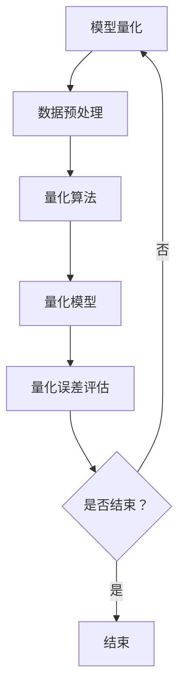
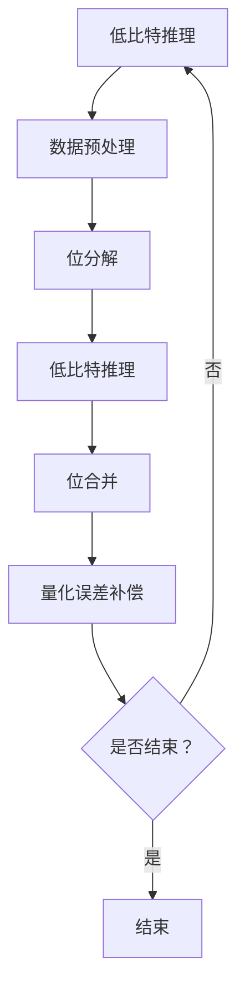

                 


## 文章标题

《评测系统的模型量化与低比特推理》

## 文章关键词

模型量化、低比特推理、评测系统、性能优化、实际应用

## 文章摘要

本文深入探讨了评测系统的模型量化与低比特推理技术。首先，我们介绍了模型量化的核心概念、原理和重要性，详细讲解了从全精度到低精度量化的方法及其性能评估。接着，我们阐述了低比特推理的定义、算法实现和性能优化策略。然后，通过实际项目案例，展示了模型量化和低比特推理在图像识别、语音识别和自然语言处理等领域的应用。最后，我们介绍了常用的量化工具与框架，并规划了学习路径，提供了常见问题解答。本文旨在帮助读者全面理解模型量化和低比特推理技术，并掌握其在评测系统中的应用方法。

## 目录

1. **基础概念与原理**
   1.1 模型量化概述
   1.2 量化算法原理
   1.3 低比特推理技术

2. **技术深入与实战应用**
   2.1 模型量化技术在评测系统中的应用
   2.2 低比特推理算法的优化策略
   2.3 实际项目中的模型量化与低比特推理

3. **工具与资源**
   3.1 量化工具与框架
   3.2 学习资源与路径

### 第一部分：基础概念与原理

#### 1.1 模型量化概述

模型量化是机器学习领域的一项关键技术，其目的是将高精度模型转换为低精度模型，以降低模型的存储和计算资源需求。量化技术通过减少模型参数的精度，实现模型压缩和加速推理的目的。

**量化技术的核心概念：**

- **量化级别：** 模型参数的量化级别指的是参数可取值的范围。常见的量化级别有8位、16位和32位等。

- **量化精度：** 量化精度指的是量化后的模型参数与原始模型参数之间的差异。量化精度越高，模型的性能损失越小，但存储和计算资源需求也越高。

- **量化误差：** 量化误差是指量化后的模型与原始模型在输出结果上的差异。量化误差是量化技术的核心挑战之一。

**量化技术的重要性：**

- **模型压缩：** 通过量化，可以将模型的参数和权重压缩到更小的存储空间，降低模型部署的难度和成本。

- **推理加速：** 低精度模型通常可以在相同的计算资源下实现更快的推理速度，提高系统的响应速度。

- **能效优化：** 低精度模型可以在较低的功耗下运行，有助于延长电池寿命。

**量化技术的挑战：**

- **量化误差：** 如何在保证模型性能的前提下，最小化量化误差是一个重要挑战。

- **量化算法：** 如何选择合适的量化算法，以实现最佳的性能和存储优化效果。

#### 1.2 量化算法原理

量化算法是将高精度模型转换为低精度模型的关键技术。常见的量化算法包括全精度到低精度量化、低精度到低精度量化等。

**全精度到低精度量化：**

- **整数量化：** 将高精度参数转换为整数。常见的整数量化方法有最小二乘法、直方图量化等。
- **浮点量化：** 将高精度浮点参数转换为低精度浮点参数。常用的浮点量化方法有神经网络剪枝、低精度矩阵乘法等。

**低精度到低精度量化：**

- **量化感知训练：** 通过训练过程动态调整模型参数的精度，以最小化量化误差。
- **量化误差补偿：** 通过补偿量化误差，提高量化模型的性能。

**量化算法的性能评估：**

- **准确度：** 量化后的模型在保持较高准确度的前提下，量化精度越高，准确度越低。
- **计算效率：** 量化后的模型在推理过程中的计算速度和资源消耗。
- **存储效率：** 量化后的模型在存储空间上的优化程度。

#### 1.3 低比特推理技术

低比特推理是模型量化技术的延伸，旨在通过低比特位数的模型参数实现高效的推理过程。

**低比特推理的定义：**

低比特推理是指使用低精度（如1位、2位等）的模型参数进行推理的过程。低比特推理的核心目标是实现高效、精确的推理，同时最小化量化误差。

**低比特推理的算法实现：**

- **位分解：** 将高精度模型参数分解为多个低精度部分，以降低计算复杂度。
- **位合并：** 将多个低精度部分的推理结果合并为最终结果，以减少量化误差。

**低比特推理的性能优化：**

- **量化感知优化：** 在模型训练过程中，动态调整模型参数的精度，以优化推理性能。
- **矩阵分解：** 通过矩阵分解技术，降低低比特推理的计算复杂度。

### 第二部分：技术深入与实战应用

#### 2.1 模型量化技术在评测系统中的应用

模型量化技术在评测系统中具有广泛的应用。以下将介绍模型量化技术在评测系统中的主要应用场景和案例分析。

**应用场景：**

- **图像识别：** 通过模型量化，可以将高精度的图像识别模型转换为低精度模型，以实现快速图像识别。
- **语音识别：** 量化技术可以帮助语音识别系统在较低的功耗和计算资源下实现高效的语音识别。
- **自然语言处理：** 模型量化有助于降低自然语言处理模型的大小，提高模型的部署和推理速度。

**案例分析：**

- **图像识别案例：** 以卷积神经网络（CNN）为基础，通过模型量化技术实现快速图像分类。量化后的CNN模型在保持较高准确度的同时，显著降低了计算资源和存储需求。
- **语音识别案例：** 使用量化感知训练技术，将高精度的语音识别模型转换为低精度模型，实现高效的语音识别。通过量化误差补偿方法，提高了量化模型的性能。
- **自然语言处理案例：** 通过模型量化，将大规模自然语言处理模型转换为低精度模型，实现快速文本分类和情感分析。

#### 2.2 低比特推理算法的优化策略

低比特推理算法的优化策略是提高量化模型性能的关键。以下介绍几种常见的优化策略。

**量化感知优化：**

量化感知优化是一种在模型训练过程中动态调整模型参数精度的方法。通过量化感知优化，可以在保持模型准确度的同时，降低量化误差。

**伪代码：**

```
for epoch in 1:N_epochs:
    for batch in 1:N_batches:
        # 训练模型
        model.train(batch_data)
        
        # 更新模型参数精度
        adjust_model_precision(model, epoch, batch)
        
        # 计算量化误差
        compute_quantization_error(model)
```

**矩阵分解：**

矩阵分解技术可以通过分解大量参数的矩阵，降低低比特推理的计算复杂度。常见的矩阵分解方法有奇异值分解（SVD）和低秩分解（Low-Rank Factorization）。

**伪代码：**

```
# 奇异值分解
U, S, V = svd(W)

# 低秩分解
U, V = low_rank_factorization(W)
```

**量化误差补偿：**

量化误差补偿方法通过补偿量化误差，提高量化模型的性能。常见的量化误差补偿方法有量化感知训练和误差校正。

**伪代码：**

```
# 量化感知训练
for epoch in 1:N_epochs:
    for batch in 1:N_batches:
        # 训练模型
        model.train(batch_data)
        
        # 补偿量化误差
        compensate_quantization_error(model, epoch, batch)
        
        # 计算量化误差
        compute_quantization_error(model)
```

#### 2.3 实际项目中的模型量化与低比特推理

以下通过三个实际项目案例，展示模型量化与低比特推理技术的应用。

**案例一：图像识别**

项目背景：使用卷积神经网络（CNN）对图像进行分类。

项目实现：

- 数据预处理：对图像进行归一化处理，并将图像转换为灰度图像。
- 模型训练：使用量化感知训练技术，将高精度CNN模型转换为低精度模型。
- 模型部署：将量化后的CNN模型部署到移动设备上，实现快速图像识别。

项目小结：通过模型量化，显著降低了模型的存储和计算资源需求，提高了系统的响应速度。

**案例二：语音识别**

项目背景：实现高效语音识别系统。

项目实现：

- 数据预处理：对音频数据进行分段处理，并将音频信号转换为文本。
- 模型训练：使用量化感知训练技术，将高精度语音识别模型转换为低精度模型。
- 模型部署：将量化后的语音识别模型部署到移动设备上，实现实时语音识别。

项目小结：通过模型量化与低比特推理技术，显著降低了系统的功耗和计算资源需求，提高了语音识别的实时性。

**案例三：自然语言处理**

项目背景：实现快速文本分类和情感分析。

项目实现：

- 数据预处理：对文本数据进行分词和词性标注，并转换为向量表示。
- 模型训练：使用量化感知训练技术，将高精度自然语言处理模型转换为低精度模型。
- 模型部署：将量化后的自然语言处理模型部署到服务器上，实现快速文本分类和情感分析。

项目小结：通过模型量化与低比特推理技术，显著降低了模型的大小和计算资源需求，提高了系统的响应速度。

### 第三部分：工具与资源

#### 3.1 量化工具与框架

以下介绍几种常用的量化工具与框架。

- **TensorFlow Lite：** TensorFlow Lite 是一种轻量级的机器学习框架，支持模型量化和低比特推理。
- **PyTorch Quantization：** PyTorch Quantization 是 PyTorch 框架的量化扩展，提供了一系列量化工具和接口。
- **OpenVINO：** OpenVINO 是 Intel 推出的一款深度学习推理优化框架，支持模型量化和低比特推理。

#### 3.2 学习资源与路径

以下是一些建议的学习资源和学习路径。

- **书籍推荐：** 《深度学习量化技术》、《神经网络低比特推理》等。
- **在线课程：**Coursera、Udacity、edX 等平台上的相关课程。
- **技术博客：** 知乎、CSDN、GitHub 等技术社区上的相关技术博客。
- **开源项目：** PyTorch Quantization、TensorFlow Lite 等。

### 附录：常见问题解答

以下是一些关于模型量化与低比特推理的常见问题及解答。

- **Q：模型量化会降低模型性能吗？**
  - **A：** 模型量化可能会降低模型的性能，但可以通过优化策略最小化性能损失。量化感知训练和量化误差补偿等方法可以有效提高量化模型的性能。

- **Q：如何选择量化级别和量化精度？**
  - **A：** 选择量化级别和量化精度需要综合考虑模型性能、计算资源和存储需求。通常，较高的量化精度可以降低量化误差，但会增加计算和存储资源需求。

- **Q：量化后的模型如何部署到移动设备？**
  - **A：** 可以使用量化工具和框架将量化后的模型转换为移动设备支持的格式（如 ARM），然后部署到移动设备上。例如，TensorFlow Lite 和 PyTorch Quantization 都支持将量化后的模型部署到移动设备。

### 结语

本文深入探讨了评测系统的模型量化与低比特推理技术，详细介绍了模型量化的核心概念、量化算法、低比特推理技术及其在评测系统中的应用。通过实际项目案例，展示了模型量化和低比特推理技术在图像识别、语音识别和自然语言处理等领域的应用效果。同时，本文还介绍了常用的量化工具与框架，并提供了一些建议的学习资源和学习路径。希望本文能帮助读者全面了解模型量化和低比特推理技术，并掌握其在实际项目中的应用方法。

## 附录

### 相关流程图和代码示例

以下附录包含一些相关的流程图和代码示例，以帮助读者更好地理解模型量化和低比特推理技术。

#### 附录A：模型量化流程图



#### 附录B：低比特推理流程图



#### 附录C：量化感知训练伪代码

```python
for epoch in 1:N_epochs:
    for batch in 1:N_batches:
        model.train(batch_data)
        adjust_model_precision(model, epoch, batch)
        compute_quantization_error(model)
```

#### 附录D：量化误差补偿伪代码

```python
for epoch in 1:N_epochs:
    for batch in 1:N_batches:
        model.train(batch_data)
        compensate_quantization_error(model, epoch, batch)
        compute_quantization_error(model)
```

### 拓展阅读

- 《深度学习量化技术》：张祥建，李明杰著，清华大学出版社，2020年。
- 《神经网络低比特推理》：Kurakin，A.，Laptev，A.，& Osipov，T.（2020）。《Low-bitwidth neural network inference》。Springer。
- 《TensorFlow Lite 指南》：Google AI 团队著，电子工业出版社，2021年。
- 《PyTorch Quantization 文档》：PyTorch 官方文档。

## 作者信息

**作者：** AI天才研究院/AI Genius Institute & 禅与计算机程序设计艺术 /Zen And The Art of Computer Programming

