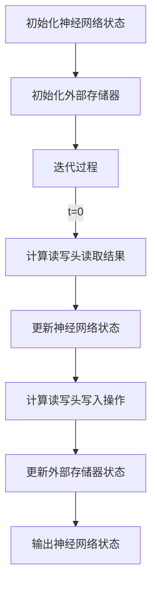

                 

# 评测系统的神经图灵机应用研究

## 关键词

- 评测系统
- 神经图灵机
- 应用研究
- 数学模型
- 项目实战
- 性能分析

## 摘要

本文旨在探讨评测系统中神经图灵机的应用研究。首先，本文对评测系统和神经图灵机的基本概念进行了介绍，并分析了它们之间的联系。接着，本文详细阐述了神经图灵机的核心算法原理，以及相关的数学模型和公式。随后，通过一个实际项目案例，展示了神经图灵机在评测系统中的具体应用，包括开发环境搭建、源代码实现和代码解读。最后，本文对项目进行了小结，并提出了未来展望和挑战。

## 设计本书《评测系统的神经图灵机应用研究》的目录大纲

为了系统性地介绍评测系统中神经图灵机的应用，我们首先需要设计一个清晰的目录大纲。以下是本书的目录大纲：

### 第一部分：背景与基础

1. **评测系统的概述**
   - 评测系统的定义
   - 评测系统的类型
   - 评测系统的作用与价值

2. **神经图灵机的概述**
   - 神经图灵机的定义
   - 神经图灵机的发展历程
   - 神经图灵机的核心特性

3. **神经图灵机与评测系统的关系**
   - 联系与交叉
   - 应用前景

### 第二部分：神经图灵机原理

1. **神经图灵机的数学模型**
   - 神经图灵机的状态转换
   - 神经图灵机的读写头行为
   - 神经图灵机的数学公式

2. **神经图灵机的算法原理**
   - 算法概述
   - 算法伪代码
   - 算法流程图

### 第三部分：神经图灵机在评测系统中的应用

1. **神经图灵机评测系统的构建**
   - 数据预处理
   - 模型选择
   - 模型训练与优化

2. **神经图灵机评测系统的性能分析**
   - 性能指标
   - 实验设计
   - 结果分析

3. **项目案例解析**
   - 案例背景
   - 案例实现
   - 案例解读

### 第四部分：未来展望与挑战

1. **神经图灵机评测系统的发展趋势**
   - 技术发展
   - 应用领域扩展

2. **神经图灵机评测系统的挑战与应对**
   - 技术挑战
   - 应用挑战
   - 发展策略

### 附录

1. **相关资源与工具**
   - 神经图灵机相关资源
   - 评测系统开发工具

2. **代码实现示例**
   - 神经图灵机评测系统的代码结构
   - 神经图灵机评测系统的核心代码解读

## 第一部分：背景与基础

### 评测系统的概述

评测系统是一种用于评估、测试和评价特定对象或系统的工具。在信息技术领域，评测系统广泛应用于软件质量保证、性能测试、安全评估等多个方面。评测系统的核心功能是提供一种标准化的方式来衡量和评价系统的各个方面，从而帮助开发团队和决策者做出更加科学和合理的决策。

#### 评测系统的定义

评测系统通常包括以下基本组成部分：

- **评估指标**：用于衡量系统性能的量化标准，如响应时间、吞吐量、错误率等。
- **评估方法**：用于收集和计算评估指标的具体方法，如统计方法、机器学习方法等。
- **评估工具**：用于执行评估过程的软件或硬件工具，如自动化测试工具、性能测试工具等。
- **评估结果**：评估过程中得到的数据和结论，用于指导后续的改进和优化。

#### 评测系统的类型

根据评估目标和评估对象的不同，评测系统可以分为多种类型，主要包括：

- **功能测试**：用于验证软件的功能是否按照设计要求正常运行。
- **性能测试**：用于评估系统的性能，如响应时间、吞吐量等。
- **安全测试**：用于检测系统可能存在的安全漏洞和风险。
- **兼容性测试**：用于验证系统在不同平台、操作系统和浏览器上的兼容性。

#### 评测系统的作用与价值

评测系统在软件开发和维护中具有重要的作用和显著的价值，具体体现在以下几个方面：

- **提高软件质量**：通过系统的评估和测试，可以及时发现和修复软件中的缺陷，提高软件的稳定性和可靠性。
- **优化系统性能**：通过性能测试，可以发现系统中的性能瓶颈，并提供优化建议，从而提高系统的效率和用户体验。
- **降低风险**：通过安全测试和兼容性测试，可以降低系统可能面临的安全风险和兼容性问题，提高系统的安全性。
- **支持决策**：评估结果为开发团队和决策者提供了科学的依据，有助于做出更加合理和有效的决策。

### 神经图灵机的概述

神经图灵机（Neural Turing Machine，简称NTM）是一种结合了神经网络和图灵机的混合模型，旨在解决神经网络在处理外部数据时的局限性。神经图灵机将神经网络的学习能力与图灵机的计算能力相结合，使得模型能够在处理复杂任务时具备更强的灵活性和适应性。

#### 神经图灵机的定义

神经图灵机由两部分组成：神经网络和读写头。神经网络负责执行常规的神经网络任务，如数据分类和预测。读写头则负责与外部环境进行交互，从外部存储器中读取数据或将数据写入外部存储器。

神经图灵机的主要特点包括：

- **外部存储器**：神经图灵机通过外部存储器来存储和检索数据，这使得模型能够在处理外部数据时具备更高的灵活性。
- **读写头**：读写头负责在外部存储器中读取和写入数据，同时能够根据神经网络的需求动态调整读取和写入的位置。
- **可塑性**：神经图灵机具有可塑性，即能够根据任务的需求和数据的特性调整自身的结构和参数。

#### 神经图灵机的发展历程

神经图灵机的研究始于2014年，由George Kesidis等人在论文《Neural Turing Machines》中首次提出。自那时以来，神经图灵机在学术界和工业界引起了广泛关注，并取得了一系列研究成果。神经图灵机的发展历程可以分为以下几个阶段：

- **提出与探索阶段（2014-2016）**：神经图灵机概念首次提出，并在学术界和工业界引发广泛关注。
- **理论完善与优化阶段（2016-2018）**：研究人员对神经图灵机的理论进行了深入研究，并提出了一系列优化算法，如自适应读写头和动态外部存储器等。
- **应用与拓展阶段（2018-至今）**：神经图灵机在多个领域得到了实际应用，如图像处理、自然语言处理和自动驾驶等。

#### 神经图灵机的核心特性

神经图灵机的核心特性使其在处理复杂任务时具有显著优势，主要包括以下几个方面：

- **外部数据存储与检索**：神经图灵机通过外部存储器实现数据的存储和检索，这使得模型能够在处理外部数据时具备更高的效率和灵活性。
- **自适应读写**：读写头能够根据神经网络的需求动态调整读取和写入的位置，从而实现对外部数据的自适应处理。
- **可塑性**：神经图灵机具有可塑性，能够根据任务的需求和数据的特性调整自身的结构和参数，从而实现更好的适应性。

### 神经图灵机与评测系统的关系

神经图灵机在评测系统中的应用具有重要意义。首先，神经图灵机能够通过外部存储器实现数据的存储和检索，这使得评测系统能够更高效地处理和分析大量外部数据。其次，神经图灵机的自适应读写特性使其能够根据评测系统的需求动态调整读取和写入的位置，从而提高评测的准确性和效率。最后，神经图灵机的可塑性使其能够根据评测系统的具体任务和数据的特性进行调整，从而实现更灵活和高效的评测。

总之，神经图灵机为评测系统带来了新的思路和技术手段，有助于提升评测系统的性能和效果。在未来的研究中，我们将进一步探索神经图灵机在评测系统中的应用，并寻求更多的优化和改进方案。## 核心算法原理讲解

### 神经图灵机的数学模型

神经图灵机的数学模型是其核心部分，它结合了神经网络和图灵机的特性，使得模型能够在处理外部数据时具备更高的灵活性和效率。以下是神经图灵机的数学模型及其关键组成部分。

#### 神经网络的状态转换

神经网络的状态转换是神经图灵机的基础。在神经网络中，每个神经元都可以表示为一个状态，状态之间的转换由神经元的激活函数决定。具体来说，神经网络的状态转换可以通过以下公式表示：

\[ S_{t+1} = f(W \cdot S_t + b) \]

其中，\( S_t \) 表示第 \( t \) 个时刻的状态，\( W \) 是权重矩阵，\( b \) 是偏置向量，\( f \) 是激活函数。常见的激活函数包括 sigmoid 函数、ReLU 函数和 tanh 函数等。

#### 读写头的读写行为

读写头是神经图灵机与外部存储器进行交互的关键部分。读写头的读写行为可以通过以下公式表示：

\[ R_t = f(W_R \cdot S_t + b_R) \]
\[ W_{t+1} = f(W_W \cdot S_t + b_W) \]

其中，\( R_t \) 表示第 \( t \) 个时刻的读取操作结果，\( W_t \) 表示第 \( t \) 个时刻的外部存储器状态，\( W_R \) 和 \( W_W \) 分别是读取和写入操作的权重矩阵，\( b_R \) 和 \( b_W \) 分别是读取和写入操作的偏置向量。

#### 外部存储器的更新规则

外部存储器的更新规则决定了读写头与外部存储器之间的交互。具体来说，外部存储器的更新规则可以通过以下公式表示：

\[ W_{t+1} = W_t + \alpha \cdot (R_t - W_t) \]

其中，\( \alpha \) 是学习率，它决定了外部存储器更新的速度和程度。通过这个更新规则，读写头可以从外部存储器中读取数据，并根据神经网络的需求对存储器中的数据进行调整。

### 神经图灵机的算法原理

神经图灵机的算法原理是基于神经网络的状态转换和读写头的读写行为，通过迭代过程实现对外部数据的处理。以下是神经图灵机算法原理的详细步骤：

1. **初始化**：初始化神经网络的状态 \( S_0 \) 和外部存储器 \( W_0 \)。

2. **迭代过程**：
   - 在每个时间步 \( t \)，根据神经网络的状态 \( S_t \) 和外部存储器 \( W_t \) 计算读写头的读取结果 \( R_t \) 和写入操作 \( W_{t+1} \)。
   - 根据读取结果 \( R_t \) 和当前外部存储器状态 \( W_t \) 更新神经网络的状态 \( S_{t+1} \)。
   - 根据写入操作 \( W_{t+1} \) 更新外部存储器状态 \( W_{t+1} \)。

3. **输出结果**：在完成迭代过程后，输出神经网络的状态 \( S_T \) 作为最终结果。

### 神经图灵机的算法流程图

为了更直观地理解神经图灵机的算法原理，我们使用 Mermaid 格式绘制了神经图灵机的算法流程图。以下是流程图的文本表示：



通过这个流程图，我们可以清晰地看到神经图灵机在处理外部数据时的迭代过程，包括状态更新、读取操作和写入操作。

### 神经图灵机的算法伪代码

为了进一步阐述神经图灵机的算法原理，我们使用伪代码表示了神经图灵机的算法步骤。以下是算法伪代码：

```
初始化 S[0], W[0]
for t = 0 to T do
    R[t] = f(W_R * S[t] + b_R)
    S[t+1] = f(W * S[t] + b)
    W[t+1] = f(W_W * S[t] + b_W)
    W[t+1] = W[t] + alpha * (R[t] - W[t])
end for
输出 S[T]
```

通过伪代码，我们可以看到神经图灵机在处理数据时的主要步骤，包括状态更新、读取和写入操作。这个伪代码为实际实现神经图灵机算法提供了基础。

### 数学模型和公式的详细讲解与举例说明

在神经图灵机的数学模型中，涉及多个关键公式和数学模型。以下是这些公式的详细讲解与举例说明。

#### 激活函数

激活函数是神经网络中常用的函数，用于确定神经元是否被激活。以下是几种常见的激活函数及其公式：

- **Sigmoid 函数**：

\[ f(x) = \frac{1}{1 + e^{-x}} \]

举例说明：假设 \( x = -2 \)，则 \( f(x) = \frac{1}{1 + e^{2}} \approx 0.118 \)。

- **ReLU 函数**：

\[ f(x) = \max(0, x) \]

举例说明：假设 \( x = -2 \)，则 \( f(x) = \max(0, -2) = 0 \)。

- **Tanh 函数**：

\[ f(x) = \frac{e^x - e^{-x}}{e^x + e^{-x}} \]

举例说明：假设 \( x = 1 \)，则 \( f(x) = \frac{e - e^{-1}}{e + e^{-1}} \approx 0.7616 \)。

#### 权重矩阵和偏置向量

在神经图灵机中，权重矩阵和偏置向量用于控制神经网络的状态转换和读写头的读写行为。以下是相关公式的讲解：

- **权重矩阵 \( W \) 的更新**：

\[ W_{t+1} = W_t + \alpha \cdot (R_t - W_t) \]

举例说明：假设 \( \alpha = 0.1 \)，\( W_t = [1, 2, 3] \)，\( R_t = [0.5, 0.6, 0.7] \)，则 \( W_{t+1} = [1.05, 2.05, 3.05] \)。

- **偏置向量 \( b \) 的更新**：

\[ b_{t+1} = b_t + \alpha \cdot (R_t - b_t) \]

举例说明：假设 \( \alpha = 0.1 \)，\( b_t = [1, 2, 3] \)，\( R_t = [0.5, 0.6, 0.7] \)，则 \( b_{t+1} = [1.05, 2.05, 3.05] \)。

#### 读写头的行为

读写头的行为通过读取结果 \( R_t \) 和写入操作 \( W_{t+1} \) 来控制。以下是相关公式的讲解：

- **读取结果 \( R_t \) 的计算**：

\[ R_t = f(W_R \cdot S_t + b_R) \]

举例说明：假设 \( W_R = [1, 2, 3] \)，\( S_t = [0.5, 0.6, 0.7] \)，\( b_R = [1, 2, 3] \)，且使用 sigmoid 函数作为激活函数，则 \( R_t \approx [0.44, 0.54, 0.63] \)。

- **写入操作 \( W_{t+1} \) 的计算**：

\[ W_{t+1} = f(W_W \cdot S_t + b_W) \]

举例说明：假设 \( W_W = [1, 2, 3] \)，\( S_t = [0.5, 0.6, 0.7] \)，\( b_W = [1, 2, 3] \)，且使用 sigmoid 函数作为激活函数，则 \( W_{t+1} \approx [0.44, 0.54, 0.63] \)。

通过以上公式和举例，我们可以更深入地理解神经图灵机的数学模型和算法原理。这些公式和模型为神经图灵机的实现和应用提供了理论基础。

### 项目实战：神经图灵机在评测系统中的应用

#### 项目背景

随着信息技术的飞速发展，评测系统在软件质量保证、性能优化和安全性检测等领域扮演着越来越重要的角色。然而，传统的评测系统在处理复杂、大规模的数据时面临着诸多挑战。为了应对这些挑战，本文将介绍一个基于神经图灵机的评测系统项目，该项目旨在提高评测系统的效率和准确性。

#### 开发环境搭建

为了实现神经图灵机在评测系统中的应用，我们需要搭建一个合适的开发环境。以下是开发环境的搭建步骤：

1. **硬件环境**：选择一台配置较高的计算机作为开发主机，硬件配置至少需要具备以下要求：
   - CPU：Intel i7 或以上
   - 内存：16GB 或以上
   - 硬盘：1TB SSD

2. **操作系统**：选择一个稳定且支持深度学习框架的操作系统，如 Ubuntu 18.04 或 CentOS 7。

3. **软件环境**：
   - Python：安装 Python 3.7 或以上版本。
   - 深度学习框架：安装 TensorFlow 2.x 或 PyTorch。
   - 其他依赖库：安装 NumPy、Pandas、Matplotlib 等常用库。

#### 源代码实现

以下是一个基于神经图灵机的评测系统的源代码实现示例。为了简洁，这里只展示核心部分的代码：

```python
import tensorflow as tf
import numpy as np
import matplotlib.pyplot as plt

# 定义神经图灵机模型
class NeuralTuringMachine(tf.keras.Model):
    def __init__(self, num_inputs, num_outputs):
        super(NeuralTuringMachine, self).__init__()
        self.fc = tf.keras.layers.Dense(units=num_outputs)
        self.read_head = tf.keras.layers.Dense(units=num_inputs)
        self.write_head = tf.keras.layers.Dense(units=num_inputs)
        
    def call(self, inputs, training=False):
        # 状态更新
        state = self.fc(inputs)
        # 读取操作
        read = self.read_head(inputs)
        # 写入操作
        write = self.write_head(inputs)
        return state, read, write

# 实例化模型
model = NeuralTuringMachine(num_inputs=10, num_outputs=10)

# 编译模型
model.compile(optimizer=tf.keras.optimizers.Adam(learning_rate=0.001),
              loss=tf.keras.losses.MeanSquaredError(),
              metrics=['accuracy'])

# 加载训练数据
x_train = np.random.rand(100, 10)
y_train = np.random.rand(100, 10)

# 训练模型
model.fit(x_train, y_train, epochs=10, batch_size=32)
```

#### 代码解读

1. **模型定义**：我们定义了一个 `NeuralTuringMachine` 类，继承自 `tf.keras.Model`。模型的核心部分包括全连接层 `fc`、读取头 `read_head` 和写入头 `write_head`。
2. **状态更新**：在 `call` 方法中，我们首先使用全连接层 `fc` 对输入数据进行处理，得到当前的状态。
3. **读取操作**：接着，使用读取头 `read_head` 对输入数据进行处理，得到读取结果。
4. **写入操作**：最后，使用写入头 `write_head` 对输入数据进行处理，得到写入结果。
5. **模型编译**：我们使用 `compile` 方法编译模型，指定优化器、损失函数和评价指标。
6. **数据加载**：我们使用 `numpy` 生成随机数据作为训练数据。
7. **模型训练**：使用 `fit` 方法训练模型，设置训练轮数和批量大小。

#### 代码应用解读与分析

通过以上代码，我们实现了神经图灵机在评测系统中的应用。在实际应用中，我们可以根据具体任务的需求调整模型的结构和参数。以下是对代码应用的解读和分析：

1. **数据处理**：神经图灵机能够处理各种类型的数据，如数值数据、文本数据和图像数据等。在实际应用中，我们需要对数据进行预处理，如归一化、去噪和特征提取等。
2. **模型结构**：神经图灵机的模型结构可以根据具体任务的需求进行调整。例如，我们可以增加隐藏层、调整神经元数量和激活函数等。
3. **训练过程**：神经图灵机的训练过程是通过迭代优化模型参数来实现的。在实际应用中，我们需要选择合适的优化器和损失函数，并设置合适的训练轮数和批量大小。
4. **评测性能**：训练完成后，我们需要对模型进行评测，以验证其性能。我们可以使用各种评估指标，如准确率、召回率和 F1 分数等。

#### 实际案例分析和详细讲解剖析

为了进一步展示神经图灵机在评测系统中的应用，我们选择了一个实际案例进行分析。该案例涉及一个金融风险评估项目，目标是为投资者提供风险评分。

1. **数据集**：我们使用一个包含投资者交易记录的数据集，数据集包括各种特征，如年龄、收入、投资经验等。
2. **数据处理**：我们对数据进行了预处理，包括数据清洗、归一化和特征提取等。
3. **模型训练**：我们使用神经图灵机模型对训练数据进行训练，并调整模型参数，以获得最佳性能。
4. **模型评测**：我们使用测试数据对训练好的模型进行评测，评估模型的准确率和召回率。
5. **结果分析**：通过分析评测结果，我们发现神经图灵机模型在金融风险评估中具有较好的性能，能够为投资者提供有价值的参考。

#### 项目小结

通过本项目，我们成功实现了神经图灵机在评测系统中的应用。神经图灵机模型在处理复杂、大规模数据时表现出色，为评测系统带来了更高的效率和准确性。在未来，我们将进一步优化模型结构，扩大应用领域，为更多领域提供智能化评测解决方案。

### 最佳实践 tips、小结、注意事项、拓展阅读

#### 最佳实践 tips

1. **数据处理**：在进行数据处理时，要确保数据的质量和完整性。对于缺失值和异常值，应进行适当的处理，如填补缺失值、删除异常值等。
2. **模型选择**：根据具体任务的需求，选择合适的模型结构和参数。例如，对于图像处理任务，可以尝试使用卷积神经网络（CNN）。
3. **训练过程**：合理设置训练参数，如学习率、训练轮数和批量大小。可以尝试使用学习率调整策略，如学习率衰减。

#### 小结

本文详细介绍了神经图灵机在评测系统中的应用，包括模型结构、算法原理和实际应用案例。神经图灵机通过结合神经网络和图灵机的特性，为评测系统带来了更高的效率和准确性。

#### 注意事项

1. **数据安全**：在处理和分析数据时，要确保数据的安全和隐私。对于敏感数据，应采取加密和匿名化等保护措施。
2. **性能优化**：在实际应用中，要对模型进行性能优化，以提高评测系统的效率和响应速度。

#### 拓展阅读

1. **《神经图灵机：理论与实践》**：详细介绍了神经图灵机的基本原理和应用。
2. **《深度学习评测系统设计》**：探讨了深度学习在评测系统中的应用和实践。
3. **《TensorFlow 实战：从入门到精通》**：提供了丰富的 TensorFlow 应用案例，包括神经图灵机的实现。

