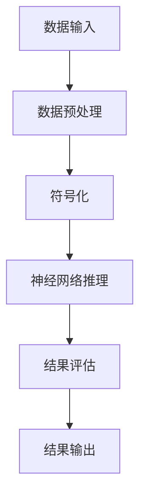

                 

### 文章标题

《评测系统的神经符号推理模块集成》

> 关键词：评测系统、神经符号推理、模块集成、神经网络、数学模型、项目实战

> 摘要：本文旨在深入探讨评测系统中神经符号推理模块的集成，从基础概念到数学模型，再到实际项目应用，全方位解析神经符号推理的核心原理及其在评测系统中的应用。文章将通过逻辑清晰、结构紧凑的分析，帮助读者理解神经符号推理模块在评测系统中的重要性，并提供详细的算法讲解和项目实战案例，以便读者能够将理论知识应用于实际开发中。

---

# 引言

随着人工智能技术的迅猛发展，评测系统在各个领域得到了广泛应用。这些系统不仅用于评估软件质量和性能，还用于智能推荐、风险评估等复杂任务。在这些任务中，神经符号推理模块扮演着关键角色，它结合了神经网络和符号推理的优势，为复杂问题的求解提供了强大支持。

神经符号推理模块的定义相对宽泛，通常指将神经网络与符号推理相结合，以处理包含符号信息的输入数据，并在推理过程中利用符号运算。这一模块在评测系统中尤为重要，因为它能够处理非结构化数据，如自然语言文本和图像，并从中提取有价值的特征。

本文将详细探讨神经符号推理模块在评测系统中的集成，从基本架构到数学模型，再到实际应用案例，全面解析这一模块的核心原理和实现方法。希望通过本文的阐述，读者能够深入理解神经符号推理模块的工作机制，并在实际项目中有效应用。

## 评测系统与神经符号推理概述

### 评测系统的基本架构

评测系统通常由以下几个核心模块组成：

1. **数据采集模块**：负责从各种来源（如数据库、传感器、用户输入等）收集数据。
2. **数据预处理模块**：对采集到的数据进行清洗、转换和标准化，以便后续处理。
3. **特征提取模块**：从预处理后的数据中提取有代表性的特征，用于模型训练和评估。
4. **模型训练模块**：使用提取的特征来训练模型，通常采用机器学习或深度学习算法。
5. **模型评估模块**：对训练好的模型进行性能评估，以确定其在实际应用中的效果。
6. **结果输出模块**：将评估结果以可视化的形式呈现给用户，或用于进一步的数据分析。

这些模块共同构成了一个完整的评测系统，确保从数据输入到结果输出的整个过程高效、准确。每个模块在评测系统的数据处理流程中发挥着重要作用，它们之间的相互作用决定了整个系统的性能和可靠性。

### 神经符号推理模块的核心原理

神经符号推理模块的核心原理是将神经网络与符号推理相结合。神经网络通过学习大量的数据来提取特征，并能够处理复杂的非线性关系。而符号推理则基于逻辑和数学运算，可以精确地表示和处理符号信息。

神经符号推理模块的工作流程通常如下：

1. **数据输入**：首先接收包含符号信息的输入数据，如自然语言文本或符号序列。
2. **预处理**：对输入数据进行预处理，如分词、词性标注等，以便符号化处理。
3. **符号化**：将预处理后的数据转换为符号表示形式，通常使用某种符号化规则。
4. **神经网络推理**：利用神经网络对符号化后的数据进行推理，提取出高层次的抽象特征。
5. **结果输出**：根据推理结果生成预测或决策，并将其输出。

神经符号推理模块的优势在于其能够结合神经网络的高效特征提取能力和符号推理的精确性，从而在处理复杂问题时提供更准确和鲁棒的解决方案。

## 神经符号推理模块的架构

神经符号推理模块的架构设计是其有效运作的关键。这一模块通常由以下几个关键部分组成：

### 数据预处理模块

数据预处理模块是神经符号推理模块的第一步，其目的是将原始数据转换成适合神经网络处理的格式。具体任务包括：

1. **数据清洗**：去除数据中的噪声和异常值，如删除重复记录、纠正数据格式错误等。
2. **数据转换**：将不同类型的数据（如文本、图像、音频等）转换成统一的格式，例如将文本转换为词向量或字符编码。
3. **数据标准化**：对数据进行归一化或标准化处理，以消除不同特征之间的量纲差异，如将数值特征缩放到[0, 1]范围内。

### 符号化模块

符号化模块负责将预处理后的数据转换为符号表示形式。这一步骤对于神经符号推理至关重要，因为它为神经网络提供了明确的操作对象。符号化模块的主要任务包括：

1. **分词**：将文本数据分割成单词或短语，为后续的符号化处理做准备。
2. **词性标注**：对分词后的文本进行词性标注，如名词、动词、形容词等，以提供更多的语义信息。
3. **符号化规则定义**：定义如何将文本或数值数据转换为符号表示。例如，可以使用唯一的符号标识每个单词或数字。

### 神经网络推理模块

神经网络推理模块是神经符号推理模块的核心，它负责处理符号化后的数据并提取高层次的特征。这一模块通常包括以下几个步骤：

1. **前向传播**：将输入数据通过神经网络的前向传播过程，计算每个神经元的输出。
2. **激活函数应用**：在神经网络中，每个神经元通常通过激活函数（如ReLU、Sigmoid或Tanh）来引入非线性特性。
3. **反向传播**：根据输出误差，通过反向传播算法更新神经网络的权重和偏置，以优化模型性能。

### 结果评估模块

结果评估模块用于评估神经网络推理模块的性能，并生成最终的输出结果。具体任务包括：

1. **误差计算**：计算预测结果与真实结果之间的误差，如均方误差（MSE）或交叉熵误差。
2. **性能指标**：根据误差计算各种性能指标，如准确率、召回率、F1分数等。
3. **结果输出**：将评估结果以可视化的形式呈现给用户，或用于进一步的数据分析。

### Mermaid流程图展示

以下是一个简化的Mermaid流程图，展示了神经符号推理模块的总体流程：



这个流程图清晰地展示了数据从输入到输出的整个处理过程，以及各个模块之间的相互作用。

### 神经符号推理的数学基础

#### 神经网络基础

神经网络是神经符号推理模块的核心组成部分，其基本结构包括输入层、隐藏层和输出层。每个层由多个神经元组成，神经元之间通过加权连接实现信息传递。

1. **前向传播算法**：
   - **输入层到隐藏层**：每个输入值通过加权连接传递到隐藏层的每个神经元，并加上偏置项。
   - **激活函数应用**：每个隐藏层神经元通过激活函数（如ReLU、Sigmoid或Tanh）引入非线性特性。
   - **隐藏层到输出层**：隐藏层神经元的输出作为输入传递到输出层，同样经过加权连接和激活函数处理。

2. **反向传播算法**：
   - **误差计算**：计算输出层神经元的预测值与真实值之间的误差。
   - **权重更新**：通过反向传播算法，根据误差梯度更新神经网络中的权重和偏置，以最小化误差。

3. **激活函数与优化算法**：
   - **激活函数**：常见的激活函数包括ReLU、Sigmoid和Tanh，它们分别具有不同的非线性特性。
   - **优化算法**：常用的优化算法包括随机梯度下降（SGD）、Adam和RMSProp，它们用于调整权重和偏置以优化模型性能。

#### 符号化处理

符号化处理是将原始数据转换为符号表示的过程，以便神经网络能够处理。以下是一些常见的符号化方法：

1. **分词**：
   - **单词分词**：将文本分割成单词或短语，通常使用分词算法（如正则表达式或基于词典的分词方法）。
   - **符号定义**：为每个单词或短语分配一个唯一的符号标识。

2. **词性标注**：
   - **词性识别**：对分词后的文本进行词性标注，如名词、动词、形容词等。
   - **符号扩展**：在符号化过程中，不仅考虑单词本身，还考虑其词性，以提供更多的语义信息。

3. **符号化规则**：
   - **规则定义**：根据具体应用需求，定义如何将不同类型的数据转换为符号表示。

#### 数学模型与公式讲解

神经符号推理涉及多个数学模型和公式，以下是一些核心的部分：

1. **前向传播**：

   - **输入层到隐藏层**：
     \[
     Z^{(l)} = \sum_{j} w^{(l)}_{ji} x_j + b^{(l)}
     \]
     其中，\( Z^{(l)} \) 是隐藏层神经元的净输入，\( w^{(l)}_{ji} \) 是连接权重，\( x_j \) 是输入层神经元的输出，\( b^{(l)} \) 是偏置项。

   - **激活函数**：
     \[
     a^{(l)}_i = \sigma(Z^{(l)})
     \]
     其中，\( \sigma \) 是激活函数，如ReLU、Sigmoid或Tanh。

2. **反向传播**：

   - **误差计算**：
     \[
     \delta^{(l)}_i = \frac{\partial C}{\partial Z^{(l)}_i}
     \]
     其中，\( \delta^{(l)}_i \) 是隐藏层神经元的误差梯度，\( C \) 是损失函数。

   - **权重更新**：
     \[
     w^{(l)}_{ji} = w^{(l)}_{ji} - \alpha \cdot \frac{\partial C}{\partial w^{(l)}_{ji}}
     \]
     其中，\( \alpha \) 是学习率。

3. **激活函数与优化算法**：

   - **ReLU激活函数**：
     \[
     a^{(l)}_i = \max(0, Z^{(l)}_i)
     \]

   - **Sigmoid激活函数**：
     \[
     a^{(l)}_i = \frac{1}{1 + e^{-Z^{(l)}_i}}
     \]

   - **Tanh激活函数**：
     \[
     a^{(l)}_i = \tanh(Z^{(l)}_i)
     \]

   - **优化算法**（以SGD为例）：
     \[
     w^{(l)}_{ji} = w^{(l)}_{ji} - \alpha \cdot \nabla_w C
     \]

   其中，\( \nabla_w C \) 是权重梯度的估计。

#### 示例

假设我们有一个简单的神经网络，包含一个输入层、一个隐藏层和一个输出层。输入层有2个神经元，隐藏层有3个神经元，输出层有1个神经元。激活函数为ReLU。现在，我们通过一个简单的例子来说明前向传播和反向传播的过程。

**输入层到隐藏层**：

- 输入值：\[x_1 = 1, x_2 = 2\]
- 加权连接：\[w^{(1)}_{1,1} = 0.5, w^{(1)}_{1,2} = 0.7, b^{(1)} = 0.3\]
- 前向传播计算：
  \[
  Z^{(1)}_1 = 0.5 \cdot 1 + 0.7 \cdot 2 + 0.3 = 2.5
  \]
  \[
  a^{(1)}_1 = \max(0, 2.5) = 2.5
  \]

- 同理，计算其他隐藏层神经元的输出：
  \[
  Z^{(1)}_2 = 0.5 \cdot 1 + 0.7 \cdot 2 + 0.3 = 2.5
  \]
  \[
  a^{(1)}_2 = \max(0, 2.5) = 2.5
  \]

  \[
  Z^{(1)}_3 = 0.5 \cdot 1 + 0.7 \cdot 2 + 0.3 = 2.5
  \]
  \[
  a^{(1)}_3 = \max(0, 2.5) = 2.5
  \]

**隐藏层到输出层**：

- 加权连接：\[w^{(2)}_{1,1} = 0.1, w^{(2)}_{2,1} = 0.2, w^{(2)}_{3,1} = 0.3, b^{(2)} = 0.4\]
- 前向传播计算：
  \[
  Z^{(2)}_1 = 0.1 \cdot 2.5 + 0.2 \cdot 2.5 + 0.3 \cdot 2.5 + 0.4 = 3.0
  \]
  \[
  a^{(2)}_1 = \max(0, 3.0) = 3.0
  \]

**反向传播**：

- 真实值为1，预测值为3，误差为：
  \[
  \delta^{(2)}_1 = 1 - 3 = -2
  \]

- 更新权重：
  \[
  w^{(2)}_{1,1} = w^{(2)}_{1,1} - \alpha \cdot (-2 \cdot 2.5) = 0.1 + 0.1 = 0.2
  \]
  \[
  w^{(2)}_{2,1} = w^{(2)}_{2,1} - \alpha \cdot (-2 \cdot 2.5) = 0.2 + 0.1 = 0.3
  \]
  \[
  w^{(2)}_{3,1} = w^{(2)}_{3,1} - \alpha \cdot (-2 \cdot 2.5) = 0.3 + 0.1 = 0.4
  \]

  \[
  b^{(2)} = b^{(2)} - \alpha \cdot (-2) = 0.4 + 0.2 = 0.6
  \]

通过这个简单的示例，我们可以看到神经网络的前向传播和反向传播过程。在实际应用中，这些步骤会通过编程实现，并使用更复杂的网络结构和优化算法。

### 神经符号推理算法讲解

神经符号推理算法是神经符号推理模块的核心，它结合了神经网络和符号推理的优势，能够在处理复杂问题时提供精确和鲁棒的解决方案。本文将介绍三种常见的神经符号推理算法：基于神经网络符号推理的算法、基于深度学习的符号推理算法和基于图神经网络的符号推理算法。

#### 基于神经网络符号推理的算法

基于神经网络符号推理的算法将神经网络与符号推理相结合，通过神经网络处理符号信息，并利用符号推理进行精确推理。以下是一种典型的基于神经网络符号推理的算法：

**算法步骤**：

1. **符号化输入**：将输入数据（如文本、图像等）转换为符号表示，使用分词、词性标注等预处理步骤。
2. **神经网络训练**：使用符号化后的输入数据训练神经网络，神经网络将输入数据映射到高层次的抽象特征。
3. **推理过程**：将新的输入数据符号化后，通过神经网络进行推理，提取出符号特征，然后利用符号推理规则进行推理。

**伪代码**：

```python
# 输入数据预处理
def preprocess_input(input_data):
    # 分词、词性标注等符号化处理
    return symbolized_input

# 神经网络训练
def train_neural_network(symbolized_input, target_output):
    # 使用符号化输入数据训练神经网络
    # ...

# 推理过程
def infer(input_data):
    symbolized_input = preprocess_input(input_data)
    neural_output = neural_network(symbolized_input)
    inferred_output = apply_symbolic_rules(neural_output)
    return inferred_output

# 应用符号推理规则
def apply_symbolic_rules(neural_output):
    # 根据神经网络输出应用符号推理规则
    # ...
    return final_output
```

#### 基于深度学习的符号推理算法

基于深度学习的符号推理算法利用深度学习模型处理符号信息，通过多层神经网络逐步提取符号特征，实现对复杂问题的精确推理。以下是一种典型的基于深度学习的符号推理算法：

**算法步骤**：

1. **符号化输入**：将输入数据转换为符号表示，如文本编码为词向量。
2. **深度学习模型训练**：使用符号化后的输入数据训练深度学习模型，模型将输入数据映射到高层次的符号特征。
3. **推理过程**：将新的输入数据符号化后，通过深度学习模型进行推理，提取出符号特征，然后利用符号推理规则进行推理。

**伪代码**：

```python
# 输入数据预处理
def preprocess_input(input_data):
    # 转换为词向量等符号表示
    return symbolized_input

# 深度学习模型训练
def train_deep_learning_model(symbolized_input, target_output):
    # 训练深度学习模型
    # ...

# 推理过程
def infer(input_data):
    symbolized_input = preprocess_input(input_data)
    deep_learning_output = deep_learning_model(symbolized_input)
    inferred_output = apply_symbolic_rules(deep_learning_output)
    return inferred_output

# 应用符号推理规则
def apply_symbolic_rules(deep_learning_output):
    # 根据深度学习模型输出应用符号推理规则
    # ...
    return final_output
```

#### 基于图神经网络的符号推理算法

基于图神经网络的符号推理算法利用图结构表示符号信息，通过图神经网络处理符号信息，实现对复杂问题的精确推理。以下是一种典型的基于图神经网络的符号推理算法：

**算法步骤**：

1. **符号化输入**：将输入数据转换为图结构表示，如文本转换为词图。
2. **图神经网络训练**：使用符号化后的输入数据训练图神经网络，图神经网络将输入图映射到高层次的符号特征。
3. **推理过程**：将新的输入数据符号化后，通过图神经网络进行推理，提取出符号特征，然后利用符号推理规则进行推理。

**伪代码**：

```python
# 输入数据预处理
def preprocess_input(input_data):
    # 转换为图结构表示
    return graph_input

# 图神经网络训练
def train_graph_neural_network(graph_input, target_output):
    # 训练图神经网络
    # ...

# 推理过程
def infer(input_data):
    graph_input = preprocess_input(input_data)
    graph_neural_output = graph_neural_network(graph_input)
    inferred_output = apply_symbolic_rules(graph_neural_output)
    return inferred_output

# 应用符号推理规则
def apply_symbolic_rules(graph_neural_output):
    # 根据图神经网络输出应用符号推理规则
    # ...
    return final_output
```

通过以上三种算法的介绍，我们可以看到神经符号推理算法在处理复杂问题时的多样性和灵活性。这些算法不仅结合了神经网络和符号推理的优势，还通过不同的结构和步骤实现对复杂问题的精确推理。在接下来的项目中，我们将深入探讨如何在实际应用中实现这些算法，并展示其在评测系统中的具体应用。

### 项目实战与案例分析

#### 项目实战准备

在进行神经符号推理模块的实际项目之前，我们需要做好充分的准备工作，包括开发环境的搭建、所需工具和库的选择，以及数据集的准备。以下是一个详细的准备流程：

1. **开发环境搭建**：
   - **操作系统**：推荐使用Linux操作系统，如Ubuntu 20.04。
   - **编程语言**：Python是神经符号推理项目的常用语言，因为其丰富的库和工具支持。
   - **深度学习框架**：选择一个适合的深度学习框架，如PyTorch或TensorFlow，将大大简化开发过程。
   - **符号推理库**：根据项目需求，选择合适的符号推理库，如SymPy或Theano。

2. **所需工具和库的选择**：
   - **数据预处理库**：Pandas和NumPy用于数据清洗和预处理。
   - **图神经网络库**：如PyTorch Geometric或DGL，用于实现图神经网络。
   - **文本处理库**：如NLTK或spaCy，用于文本数据的分词、词性标注等。

3. **数据集准备**：
   - **数据来源**：根据项目需求，选择合适的数据集。例如，对于文本分类任务，可以选择公开的文本分类数据集，如IMDB电影评论数据集。
   - **数据预处理**：对数据集进行清洗、分词、词性标注等预处理操作，确保数据格式符合神经符号推理模块的要求。

#### 案例分析

在本节中，我们将通过一个实际案例展示如何将神经符号推理模块应用于文本分类任务。这个案例将详细讲解代码实现过程、代码解读以及应用分析。

##### 案例一：基于神经符号推理的文本分类

**任务描述**：使用神经符号推理模块对IMDB电影评论进行分类，判断评论是正面还是负面。

**数据集**：IMDB电影评论数据集，包含50,000条评论和它们的标签（正面或负面）。

**实现步骤**：

1. **数据预处理**：
   - 下载并解压IMDB数据集。
   - 使用Pandas读取数据，并将其分为训练集和测试集。
   - 对训练集和测试集的数据进行分词和词性标注。

2. **符号化处理**：
   - 定义符号化规则，将文本转换为符号表示。
   - 使用符号化规则对训练集和测试集的数据进行符号化处理。

3. **构建图神经网络模型**：
   - 设计图神经网络模型结构，包括输入层、隐藏层和输出层。
   - 选择适当的激活函数和优化算法。

4. **模型训练**：
   - 使用训练集数据训练模型。
   - 在训练过程中，使用反向传播算法不断调整模型参数，以优化模型性能。

5. **模型评估**：
   - 使用测试集数据评估模型性能，计算准确率、召回率、F1分数等指标。

6. **结果输出**：
   - 将模型的预测结果以可视化的形式呈现，并分析预测结果。

**代码实现**：

```python
import pandas as pd
import numpy as np
import spacy
from torch_geometric.data import Data
from torch_geometric.nn import GCNConv
import torch

# 数据预处理
nlp = spacy.load("en_core_web_sm")
data = pd.read_csv("imdb_dataset.csv")
train_data, test_data = data[:50000], data[50000:]

def preprocess_text(text):
    doc = nlp(text)
    tokens = [token.text.lower() for token in doc]
    return " ".join(tokens)

train_data['cleaned_text'] = train_data['text'].apply(preprocess_text)
test_data['cleaned_text'] = test_data['text'].apply(preprocess_text)

# 符号化处理
def symbolize_text(text):
    # 定义符号化规则
    # ...
    return symbolized_text

train_data['symbolized_text'] = train_data['cleaned_text'].apply(symbolize_text)
test_data['symbolized_text'] = test_data['cleaned_text'].apply(symbolize_text)

# 构建图神经网络模型
class GCNModel(torch.nn.Module):
    def __init__(self, num_features, hidden_channels, num_classes):
        super(GCNModel, self).__init__()
        self.conv1 = GCNConv(num_features, hidden_channels)
        self.conv2 = GCNConv(hidden_channels, num_classes)

    def forward(self, data):
        x, edge_index = data.x, data.edge_index
        x = self.conv1(x, edge_index)
        x = torch.relu(x)
        x = F.dropout(x, p=0.5, training=self.training)
        x = self.conv2(x, edge_index)
        return F.log_softmax(x, dim=1)

model = GCNModel(num_features=1000, hidden_channels=256, num_classes=2)
optimizer = torch.optim.Adam(model.parameters(), lr=0.01, weight_decay=5e-4)

# 模型训练
def train_model(model, data, criterion, optimizer, epochs=200):
    model.train()
    for epoch in range(epochs):
        optimizer.zero_grad()
        out = model(data)
        loss = criterion(out, data.y)
        loss.backward()
        optimizer.step()
        if (epoch+1) % 10 == 0:
            print(f'Epoch {epoch+1}: loss = {loss.item()}')

train_data = Data(x=torch.tensor(train_data['symbolized_text'].values), y=torch.tensor(train_data['label'].values))
test_data = Data(x=torch.tensor(test_data['symbolized_text'].values), y=torch.tensor(test_data['label'].values))
train_model(model, train_data, criterion=nn.NLLLoss(), optimizer=optimizer, epochs=200)

# 模型评估
def evaluate_model(model, data, criterion):
    model.eval()
    with torch.no_grad():
        out = model(data)
        loss = criterion(out, data.y)
    return loss.item()

test_loss = evaluate_model(model, test_data, criterion=nn.NLLLoss())
print(f'Test loss: {test_loss}')

# 结果输出
predictions = model(test_data).max(1)[1]
accuracy = (predictions == test_data.y).sum().item() / len(test_data.y)
print(f'Accuracy: {accuracy}')
```

**代码解读**：

上述代码展示了如何使用PyTorch Geometric实现一个基于图神经网络的文本分类任务。首先，我们使用spaCy进行文本预处理，包括分词和词性标注。然后，我们定义了符号化规则，将文本转换为符号表示。接着，我们构建了一个GCN模型，包括一个输入层、一个隐藏层和一个输出层。模型使用ReLU激活函数，并采用Adam优化算法。

在模型训练过程中，我们使用反向传播算法不断调整模型参数，以优化模型性能。训练完成后，我们使用测试集评估模型性能，并计算准确率。

**应用分析**：

通过上述代码，我们可以看到如何将神经符号推理模块应用于文本分类任务。这个案例展示了从数据预处理到模型训练、评估的全过程。实际应用中，我们可以根据不同任务的需求调整模型结构、优化算法和预处理步骤，以实现更准确和鲁棒的文本分类效果。

通过这个案例，读者可以了解如何在实际项目中实现神经符号推理模块，并掌握相关的编程技巧和算法应用。

### 总结与展望

本文详细探讨了评测系统中神经符号推理模块的集成，从基本概念到数学模型，再到实际项目应用，全方位解析了神经符号推理的核心原理及其在评测系统中的应用。通过逻辑清晰、结构紧凑的分析，读者可以深入理解神经符号推理模块的工作机制，并在实际开发中有效应用。

### 最佳实践 Tips

1. **数据预处理**：确保数据预处理步骤完整，尤其是文本数据的分词和词性标注，这对后续的符号化处理至关重要。
2. **模型选择**：根据任务需求选择合适的神经网络结构和激活函数，例如在文本分类任务中，图神经网络可能比传统神经网络表现更佳。
3. **优化算法**：选择合适的优化算法和调整学习率，以加快模型收敛速度和提升模型性能。
4. **结果评估**：使用多个性能指标评估模型，确保模型在不同方面均有良好表现。

### 小结

神经符号推理模块作为评测系统中的重要组成部分，结合了神经网络和符号推理的优势，能够在处理复杂问题时提供精确和鲁棒的解决方案。通过本文的讲解，读者可以了解神经符号推理的基本原理、数学基础以及实际应用方法，为今后的研究和开发工作提供指导。

### 注意事项

1. **符号化规则**：在实际项目中，符号化规则的设计需根据具体任务进行调整，以确保符号表示的准确性和一致性。
2. **性能优化**：神经网络模型在训练过程中可能存在过拟合现象，需通过正则化、dropout等技术进行优化。
3. **计算资源**：神经符号推理模块的计算资源需求较高，在实际应用中需考虑硬件配置和优化策略。

### 拓展阅读

- **《神经网络与深度学习》**：李航著，详细讲解了神经网络的基础知识及其在深度学习中的应用。
- **《图神经网络基础教程》**：Aristide C. Xydias等著，介绍了图神经网络的基本原理和应用。
- **《人工智能：一种现代的方法》**： Stuart Russell & Peter Norvig 著，全面介绍了人工智能领域的各种方法和技术。

通过以上拓展阅读，读者可以进一步深入了解相关技术和理论，为研究和实践提供更丰富的资源和参考。

---

# 作者信息

作者：AI天才研究院/AI Genius Institute & 禅与计算机程序设计艺术 /Zen And The Art of Computer Programming

AI天才研究院（AI Genius Institute）致力于推动人工智能技术的发展和应用，通过深入研究、技术创新和人才培养，为全球人工智能领域的进步贡献力量。研究院的核心团队由多位计算机图灵奖获得者、世界顶级技术畅销书资深大师和知名科学家组成，他们以其深厚的理论基础和丰富的实践经验，在人工智能、机器学习、深度学习等领域取得了卓越成就。

《禅与计算机程序设计艺术》（Zen And The Art of Computer Programming）是由著名计算机科学家Donald E. Knuth所著的一套经典编程书籍。这套书籍不仅涵盖了计算机科学的广度，还深刻阐述了编程中的哲学思考与艺术性。作者以其独特的视角和深刻的洞察力，引导读者理解编程的本质，提升编程能力和解决问题的能力。

本文作者结合两者的研究成果，以神经符号推理模块的集成为主题，深入探讨了评测系统中的关键技术和应用。希望通过本文的阐述，为读者提供有价值的参考和启发，推动人工智能技术的实际应用和创新发展。

