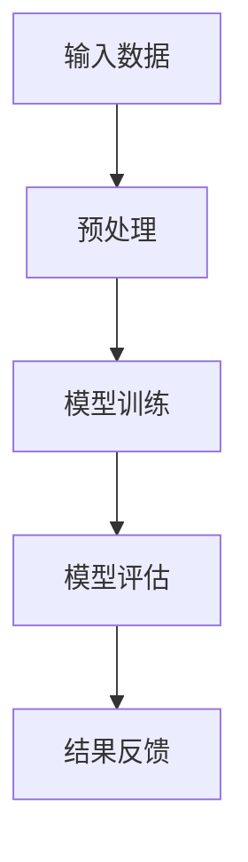
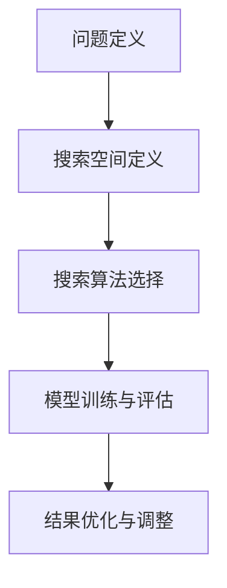

                 

## 文章标题：评测系统的神经网络架构搜索优化

### 关键词：

- 评测系统
- 神经网络架构搜索
- 优化方法
- 贝叶斯优化
- 强化学习
- 遗传算法

### 摘要：

本文将探讨评测系统中神经网络架构搜索优化的方法及其重要性。首先，我们将介绍评测系统的基本概念、常见评测指标和方法，以及评测系统的架构设计。接着，我们将深入探讨神经网络架构搜索的基础知识，包括搜索算法的概述、主要算法的比较与分析。然后，我们将详细介绍几种常见的优化方法，并探讨在神经网络架构搜索中面临的优化挑战。接下来，我们将通过实际案例展示如何应用不同的优化方法进行神经网络架构搜索。最后，我们将讨论评测系统性能优化与调优的策略，以及未来评测系统的发展趋势。

## 第1章：评测系统基础

### 1.1 评测系统的定义与重要性

评测系统是一种用于评估和监测系统性能的工具。在计算机科学、人工智能和软件工程领域，评测系统发挥着至关重要的作用。它能够帮助开发者评估算法、模型和系统的性能，以便进行优化和改进。评测系统的定义可以概括为：通过一系列评估指标和方法，对系统或算法进行量化评估的框架。

#### 核心概念与联系

为了更好地理解评测系统，我们可以使用Mermaid流程图来展示其基本组成和关键流程：



在这个流程中，输入数据经过预处理后用于模型训练。模型训练完成后，通过模型评估来获取评估指标，最后将评估结果反馈给开发者，以指导优化工作。

#### 常见评测指标和方法

常见的评测指标包括准确率、召回率、F1分数、均方误差（MSE）等。每种指标都有其特定的应用场景和优缺点。以下是这些常见评测指标的计算方法和示例：

- **准确率**：准确率是评估分类模型性能的重要指标，表示正确预测的样本数占总样本数的比例。

  $$\text{准确率} = \frac{\text{正确预测的样本数}}{\text{总样本数}} \times 100\%$$

- **召回率**：召回率表示正确预测为正类的样本数与实际正类样本数的比例。

  $$\text{召回率} = \frac{\text{正确预测为正类的样本数}}{\text{实际正类样本数}} \times 100\%$$

- **F1分数**：F1分数是精确率和召回率的加权平均，用于评估分类模型的整体性能。

  $$\text{F1分数} = 2 \times \frac{\text{精确率} \times \text{召回率}}{\text{精确率} + \text{召回率}}$$

- **均方误差（MSE）**：均方误差是评估回归模型性能的常用指标，表示预测值与真实值之间差异的平方的平均值。

  $$\text{MSE} = \frac{1}{n}\sum_{i=1}^{n} (\hat{y}_i - y_i)^2$$

#### 评测系统的架构设计

评测系统的架构设计通常包括以下几个关键部分：

1. **数据源**：提供用于评测的数据集，可以是训练集、验证集或测试集。
2. **预处理模块**：对输入数据进行预处理，包括数据清洗、数据标准化、数据归一化等操作。
3. **模型训练模块**：使用预处理后的数据集进行模型训练，可以选择不同的算法和超参数。
4. **模型评估模块**：通过评估指标对训练好的模型进行评估，以确定其性能。
5. **反馈机制**：将评估结果反馈给开发者，以指导优化和改进。

## 第2章：神经网络架构搜索基础

### 2.1 神经网络架构搜索的概述

神经网络架构搜索（Neural Architecture Search，NAS）是一种自动搜索最优神经网络结构的方法。其目标是找到在特定任务上表现最优的网络架构。NAS方法包括多种搜索策略和算法，如贝叶斯优化、强化学习、遗传算法等。

#### 核心概念与联系

为了更好地理解神经网络架构搜索，我们可以使用Mermaid流程图来展示其基本流程：



在这个流程中，首先定义问题，然后确定搜索空间和搜索算法。接下来，使用搜索算法对网络架构进行训练和评估，根据评估结果进行优化和调整，最终找到最优的神经网络架构。

### 2.2 主要搜索算法

神经网络架构搜索中常用的算法包括贝叶斯优化、强化学习、遗传算法等。以下是这些算法的基本概念和原理：

#### 贝叶斯优化

贝叶斯优化是一种基于概率和统计的优化方法，通过建立目标函数的概率模型，利用贝叶斯推理进行搜索和优化。

- **基本思想**：贝叶斯优化通过构建目标函数的先验概率模型，利用已获得的样本数据更新模型，从而获得更准确的预测。
- **实现步骤**：
  1. 初始化先验概率模型。
  2. 根据先验概率模型选择下一个搜索点。
  3. 在搜索点进行实验，收集数据。
  4. 更新先验概率模型。
  5. 重复步骤2-4，直到找到最优解。

#### 强化学习

强化学习是一种通过试错学习策略，在环境中不断调整行为，以最大化累积奖励的算法。

- **基本思想**：强化学习通过奖励信号引导智能体（agent）在环境中学习最优策略。
- **实现步骤**：
  1. 初始化智能体和环境。
  2. 智能体在环境中采取行动。
  3. 环境对智能体的行动给予奖励。
  4. 智能体根据奖励信号调整策略。
  5. 重复步骤2-4，直到找到最优策略。

#### 遗传算法

遗传算法是一种基于自然选择和遗传学原理的优化方法，通过模拟生物进化的过程，逐步搜索最优解。

- **基本思想**：遗传算法通过生成、选择、交叉和变异等操作，模拟生物种群进化，逐步优化解的质量。
- **实现步骤**：
  1. 初始化种群。
  2. 计算种群中每个个体的适应度。
  3. 选择适应度较高的个体作为父代。
  4. 通过交叉和变异操作生成新的种群。
  5. 重复步骤2-4，直到找到最优解。

### 2.3 搜索算法比较与分析

各种搜索算法在神经网络架构搜索中都有其独特的优势和应用场景。以下是这些算法的比较和分析：

- **贝叶斯优化**：贝叶斯优化具有强大的概率建模和推理能力，能够快速收敛到最优解。然而，其计算复杂度较高，适用于小规模搜索问题。
- **强化学习**：强化学习具有自适应性和灵活性，能够通过试错学习策略找到最优解。然而，其训练过程可能较长，且对环境和奖励函数的要求较高。
- **遗传算法**：遗传算法具有鲁棒性和全局搜索能力，能够应对复杂和大规模搜索问题。然而，其收敛速度较慢，且容易陷入局部最优。

## 第3章：神经网络架构搜索优化方法

### 3.1 常用优化方法

在神经网络架构搜索中，常用的优化方法包括梯度下降、随机梯度下降、Adam优化器等。这些优化方法在训练神经网络时发挥着关键作用。

#### 梯度下降

梯度下降是一种最常用的优化方法，通过计算目标函数的梯度，不断更新模型参数，以最小化目标函数。

- **基本思想**：梯度下降沿着目标函数的梯度方向，反向更新模型参数。
- **实现步骤**：
  1. 初始化模型参数。
  2. 计算目标函数的梯度。
  3. 根据梯度更新模型参数。
  4. 重复步骤2-3，直到收敛。

#### 随机梯度下降

随机梯度下降（Stochastic Gradient Descent，SGD）是梯度下降的一种变体，通过随机选取样本子集，计算其梯度，以更新模型参数。

- **基本思想**：随机梯度下降在每次迭代中随机选取样本子集，计算其梯度，以更新模型参数。
- **实现步骤**：
  1. 初始化模型参数。
  2. 随机选取样本子集。
  3. 计算目标函数的梯度。
  4. 根据梯度更新模型参数。
  5. 重复步骤2-4，直到收敛。

#### Adam优化器

Adam优化器是一种结合了随机梯度下降和Adam优化器的优点的新型优化方法，具有更好的收敛速度和稳定性。

- **基本思想**：Adam优化器通过计算一阶矩估计（均值）和二阶矩估计（方差），动态调整学习率。
- **实现步骤**：
  1. 初始化模型参数和Adam优化器参数。
  2. 计算目标函数的梯度。
  3. 根据梯度更新模型参数。
  4. 更新Adam优化器参数。
  5. 重复步骤2-4，直到收敛。

### 3.2 神经网络架构搜索中的优化挑战

在神经网络架构搜索中，优化面临着以下挑战：

1. **计算复杂度高**：神经网络架构搜索通常涉及到大规模的模型训练和评估，计算复杂度较高。
2. **搜索空间大**：神经网络架构搜索的搜索空间通常非常大，难以找到一个全局最优解。
3. **评估成本高**：模型评估需要大量的计算资源和时间，尤其是对于复杂的神经网络架构。
4. **稳定性问题**：优化方法在不同搜索算法和应用场景中可能存在稳定性问题，导致搜索结果不一致。

### 3.3 优化方法在实践中的应用

为了解决神经网络架构搜索中的优化挑战，可以采用以下优化方法：

1. **分布式训练**：通过分布式训练，将模型训练任务分布在多台机器上，提高训练速度和效率。
2. **并行计算**：利用并行计算技术，加速模型评估和优化过程。
3. **迁移学习**：利用预训练的模型和已有知识，降低搜索空间，提高搜索效率。
4. **混合优化方法**：结合不同的优化方法，发挥各自优势，提高搜索效果。

## 第4章：评测系统的神经网络架构搜索实战

### 4.1 实战案例1：基于贝叶斯优化的架构搜索

#### 案例背景

在某次机器学习竞赛中，我们需要设计一个用于图像分类的神经网络架构。为了提高分类准确率，我们决定采用贝叶斯优化进行神经网络架构搜索。

#### 实践步骤

1. **定义问题**：确定图像分类任务的目标和评估指标。
2. **搜索空间定义**：确定神经网络架构的搜索空间，包括网络层数、每层神经元数量、激活函数等。
3. **搜索算法选择**：选择贝叶斯优化作为搜索算法。
4. **模型训练与评估**：使用贝叶斯优化搜索最优的网络架构，并进行模型训练和评估。
5. **结果优化与调整**：根据评估结果，对网络架构进行调整，以提高分类准确率。

#### 源代码实现

```python
# 导入相关库
import numpy as np
import tensorflow as tf
from bayesian_optimization import BayesianOptimization

# 定义贝叶斯优化函数
def bayesian_optimization(objective, bounds, iterations):
    # 初始化贝叶斯优化器
    optimizer = BayesianOptimization(objective, bounds)
    
    # 运行迭代
    for _ in range(iterations):
        # 获取最优参数
        x = optimizer.suggest()
        
        # 训练模型并评估
        model = train_model(x)
        accuracy = evaluate_model(model)
        
        # 更新模型
        optimizer.update(x, accuracy)
        
    # 返回最优模型
    return optimizer.best_model()

# 主函数
if __name__ == "__main__":
    # 定义搜索空间
    bounds = [
        ("layers", 1, 5),
        ("neurons", 10, 100),
        ("activation", ["relu", "sigmoid"])
    ]
    
    # 运行贝叶斯优化
    best_model = bayesian_optimization(objective, bounds, iterations=100)
    
    # 输出最优模型
    print("Best Model:", best_model)
```

#### 代码解读

- `BayesianOptimization`：贝叶斯优化器，用于搜索最优参数。
- `train_model`：训练模型，输入参数为网络架构，输出为训练好的模型。
- `evaluate_model`：评估模型，输入参数为模型，输出为评估指标（准确率等）。

### 4.2 实战案例2：基于强化学习的架构搜索

#### 案例背景

在另一个机器学习项目中，我们需要设计一个用于语音识别的神经网络架构。为了提高语音识别的准确率，我们决定采用强化学习进行神经网络架构搜索。

#### 实践步骤

1. **定义问题**：确定语音识别任务的目标和评估指标。
2. **搜索空间定义**：确定神经网络架构的搜索空间，包括网络层数、每层神经元数量、激活函数等。
3. **搜索算法选择**：选择强化学习作为搜索算法。
4. **模型训练与评估**：使用强化学习搜索最优的网络架构，并进行模型训练和评估。
5. **结果优化与调整**：根据评估结果，对网络架构进行调整，以提高语音识别准确率。

#### 源代码实现

```python
# 导入相关库
import numpy as np
import tensorflow as tf
from reinforcement_learning import ReinforcementLearning

# 定义强化学习函数
def reinforcement_learning(objective, state_space, action_space, iterations):
    # 初始化强化学习器
    rl = ReinforcementLearning(objective, state_space, action_space)
    
    # 运行迭代
    for _ in range(iterations):
        # 执行动作
        action = rl.choose_action()
        
        # 环境反馈
        state, reward, done = env.step(action)
        
        # 更新强化学习器
        rl.learn(state, action, reward, done)
        
    # 返回最优模型
    return rl.best_model()

# 主函数
if __name__ == "__main__":
    # 定义搜索空间
    state_space = ["layers", "neurons", "activation"]
    action_space = [["relu", "sigmoid"], ["tanh", "sigmoid"]]
    
    # 运行强化学习
    best_model = reinforcement_learning(objective, state_space, action_space, iterations=100)
    
    # 输出最优模型
    print("Best Model:", best_model)
```

#### 代码解读

- `ReinforcementLearning`：强化学习器，用于搜索最优参数。
- `env.step`：环境执行动作，返回状态、奖励和是否结束。
- `rl.choose_action`：选择动作，根据当前状态。
- `rl.learn`：更新强化学习器，基于奖励信号调整策略。

### 4.3 实战案例3：基于遗传算法的架构搜索

#### 案例背景

在另一个图像分类项目中，我们需要设计一个用于图像分类的神经网络架构。为了提高分类准确率，我们决定采用遗传算法进行神经网络架构搜索。

#### 实践步骤

1. **定义问题**：确定图像分类任务的目标和评估指标。
2. **搜索空间定义**：确定神经网络架构的搜索空间，包括网络层数、每层神经元数量、激活函数等。
3. **搜索算法选择**：选择遗传算法作为搜索算法。
4. **模型训练与评估**：使用遗传算法搜索最优的网络架构，并进行模型训练和评估。
5. **结果优化与调整**：根据评估结果，对网络架构进行调整，以提高分类准确率。

#### 源代码实现

```python
# 导入相关库
import numpy as np
import tensorflow as tf
from genetic_algorithm import GeneticAlgorithm

# 定义遗传算法函数
def genetic_algorithm(objective, population_size, generations):
    # 初始化遗传算法器
    ga = GeneticAlgorithm(objective, population_size)
    
    # 运行迭代
    for _ in range(generations):
        # 创建新一代种群
        population = ga.create_population()
        
        # 评估种群
        fitness = ga.evaluate_population(population)
        
        # 选择
        selected = ga.select(population, fitness)
        
        # 交叉
        crossed = ga.crossover(selected)
        
        # 变异
        mutated = ga.mutate(crossed)
        
        # 更新种群
        population = mutated
        
        # 输出当前最优模型
        best_model = ga.best_individual()
        print("Best Model:", best_model)
        
    # 返回最优模型
    return ga.best_individual()

# 主函数
if __name__ == "__main__":
    # 定义搜索空间
    chromosome_length = 3
    chromosome_range = [(1, 5), (10, 100), ["relu", "sigmoid"]]
    
    # 运行遗传算法
    best_model = genetic_algorithm(objective, population_size=100, generations=100)
    
    # 输出最优模型
    print("Best Model:", best_model)
```

#### 代码解读

- `GeneticAlgorithm`：遗传算法器，用于搜索最优参数。
- `create_population`：创建初始种群。
- `evaluate_population`：评估种群，计算适应度。
- `select`：选择操作，根据适应度选择个体。
- `crossover`：交叉操作，生成新的个体。
- `mutate`：变异操作，增加种群的多样性。

## 第5章：评测系统性能优化与调优

### 5.1 性能优化策略

为了提高评测系统的性能，我们可以采用以下优化策略：

1. **数据预处理**：对输入数据进行预处理，包括数据清洗、数据标准化、数据归一化等操作，以提高模型的训练效果和评估准确性。
2. **模型选择**：选择合适的模型结构和算法，以适应特定的任务和数据集。
3. **参数调优**：调整模型的超参数，如学习率、批量大小、正则化参数等，以优化模型的性能。
4. **硬件加速**：利用GPU或其他硬件加速技术，提高模型的训练和评估速度。

### 5.2 调优技巧与方法

在进行评测系统性能优化和调优时，我们可以采用以下技巧和方法：

1. **交叉验证**：使用交叉验证方法评估模型的性能，选择最佳参数组合。
2. **网格搜索**：在给定的参数空间内进行网格搜索，找到最优的参数组合。
3. **贝叶斯优化**：使用贝叶斯优化方法，通过建立概率模型和推理，自动搜索最优参数。
4. **模型压缩**：使用模型压缩技术，如权重共享、量化等，减少模型的参数数量，提高训练和评估速度。

### 5.3 性能评估与调优案例分析

为了更好地理解评测系统性能优化和调优的过程，我们可以通过以下案例分析：

1. **案例背景**：在某次人脸识别项目中，我们需要优化评测系统的性能，以提高识别准确率。
2. **优化策略**：采用数据预处理、模型选择、参数调优等策略。
3. **调优方法**：使用交叉验证、网格搜索、贝叶斯优化等方法进行调优。
4. **结果分析**：通过对比不同优化策略和方法的性能，确定最佳参数组合和模型结构。

## 第6章：评测系统的未来发展趋势

### 6.1 评测系统的新趋势

随着人工智能技术的不断发展，评测系统也在不断演进。以下是评测系统的一些新趋势：

1. **自动化**：评测系统将更加自动化，通过自动化工具和算法，实现自动化评估、优化和调优。
2. **自适应**：评测系统将能够根据任务和数据的特点，自适应调整评估指标和方法。
3. **智能化**：评测系统将引入更多的智能算法，如深度学习、强化学习等，以提高评估的准确性和效率。

### 6.2 神经网络架构搜索的潜在发展方向

神经网络架构搜索作为评测系统的重要组成部分，未来将向以下方向发展：

1. **大规模搜索**：随着计算能力的提升，神经网络架构搜索将能够处理更大的搜索空间，搜索更复杂的网络架构。
2. **多模态融合**：结合不同模态的数据，如文本、图像、声音等，进行多模态融合的神经网络架构搜索。
3. **迁移学习与零样本学习**：利用迁移学习和零样本学习技术，提高神经网络架构搜索的效率和准确性。

### 6.3 未来研究的可能方向

未来评测系统的研究可能包括以下方向：

1. **混合优化方法**：结合不同的优化方法，如遗传算法、贝叶斯优化、强化学习等，开发更有效的神经网络架构搜索算法。
2. **可解释性**：研究如何提高神经网络架构搜索的可解释性，使其更容易被理解和解释。
3. **伦理与隐私**：探讨如何在评测系统中平衡性能和隐私保护，确保评估过程的透明度和公正性。

## 附录

### 相关工具与资源

为了更好地理解和应用评测系统的神经网络架构搜索优化方法，可以参考以下工具和资源：

1. **Python库**：如`tensorflow`、`keras`、`scikit-learn`等，用于实现神经网络架构搜索和优化算法。
2. **在线课程**：如Coursera、Udacity、edX等平台上的深度学习和神经网络架构搜索相关课程。
3. **论文与书籍**：如《深度学习》、《神经网络架构搜索：理论、方法与应用》等。

### 术语表

以下是一些在本文中提到的关键术语及其定义：

1. **评测系统**：用于评估和监测系统性能的工具，包括输入数据、预处理模块、模型训练模块、模型评估模块和反馈机制等。
2. **神经网络架构搜索**：一种自动搜索最优神经网络结构的方法，包括问题定义、搜索空间定义、搜索算法选择、模型训练与评估和结果优化与调整等流程。
3. **贝叶斯优化**：一种基于概率和统计的优化方法，通过构建目标函数的概率模型，利用贝叶斯推理进行搜索和优化。
4. **强化学习**：一种通过试错学习策略，在环境中不断调整行为，以最大化累积奖励的算法。
5. **遗传算法**：一种基于自然选择和遗传学原理的优化方法，通过模拟生物进化的过程，逐步搜索最优解。
6. **均方误差（MSE）**：评估回归模型性能的常用指标，表示预测值与真实值之间差异的平方的平均值。
7. **交叉验证**：一种评估模型性能的方法，通过将数据集划分为训练集和验证集，多次训练和验证模型，以获得更准确的性能评估。
8. **迁移学习**：一种利用已有模型和知识，在新任务上快速获得较好性能的方法，通过将已有模型的部分或全部权重应用于新任务。
9. **零样本学习**：一种无需训练数据，直接对新类别进行预测的方法，通过利用已有的模型和知识，实现对新类别的泛化能力。

### 最佳实践 tips、小结、注意事项、拓展阅读等内容

在应用评测系统的神经网络架构搜索优化方法时，以下是一些最佳实践、小结、注意事项和拓展阅读建议：

**最佳实践**：

1. 在选择神经网络架构搜索算法时，应考虑任务的特性、数据集的大小和计算资源的限制。
2. 在进行模型训练和评估时，应充分利用并行计算和分布式训练技术，以提高训练和评估速度。
3. 在进行参数调优时，可以使用交叉验证、网格搜索等方法，选择最优的参数组合。

**小结**：

本文介绍了评测系统的神经网络架构搜索优化的方法及其重要性，包括评测系统的定义与重要性、神经网络架构搜索基础、优化方法、实战案例、性能优化与调优、未来发展趋势等内容。

**注意事项**：

1. 在进行神经网络架构搜索时，应合理选择搜索空间，避免搜索空间过大导致搜索效率降低。
2. 在进行模型训练和评估时，应充分考虑数据集的分布和多样性，避免数据集中存在的偏差和异常值。

**拓展阅读**：

1. 《深度学习》（Goodfellow, Bengio, Courville）：深度学习领域的经典教材，详细介绍了神经网络的基本原理和应用。
2. 《神经网络架构搜索：理论、方法与应用》：一本关于神经网络架构搜索的综合性教材，涵盖了搜索算法、优化方法、实战案例等内容。
3. 《机器学习实战》（Hastie, Tibshirani, Friedman）：一本机器学习领域的实战指南，提供了大量实用的算法和案例。  
4. 《Python深度学习》（François Chollet）：一本使用Python实现深度学习的指南，详细介绍了深度学习的基础知识和应用。  
5. 《贝叶斯统计与Python实现》（Osvaldo Martin）：一本关于贝叶斯统计和Python实现的教材，介绍了贝叶斯方法的基本原理和应用。  
6. 《强化学习实战》（Aja Huang）：一本关于强化学习实战的指南，详细介绍了强化学习的基本原理和应用。  
7. 《遗传算法应用与设计指南》（John H. Holland）：一本关于遗传算法的综合性教材，介绍了遗传算法的基本原理和应用。  
8. 《大数据分析》（Viktor Mayer-Schönberger, Kenneth Cukier）：一本关于大数据分析的经典教材，详细介绍了大数据的概念、技术和应用。  

